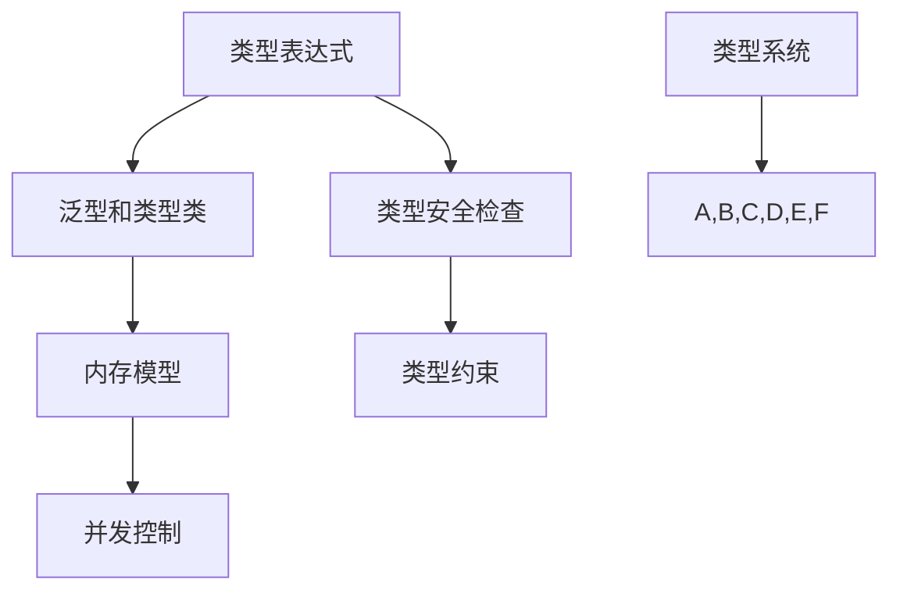

                 


### 文章标题：类型系统在函数式并发编程中的作用

#### 关键词：类型系统、函数式编程、并发编程、类型安全性、内存模型

#### 摘要：
本文将深入探讨类型系统在函数式并发编程中的作用。首先，我们将回顾函数式编程和并发编程的基本概念，并分析类型系统在这两个领域的核心价值。随后，我们将详细讨论类型系统在并发编程中的关键机制和算法，如类型表达式、泛型和类型类。接着，我们将解释类型系统如何提高并发编程的安全性，以及它与内存模型之间的关系。文章还将介绍一些流行的并发编程工具和框架，并展示如何在具体项目中应用类型系统。最后，我们将展望类型系统的未来发展趋势，并提出最佳实践建议。

### 导言

在当今的计算机科学领域，函数式编程和并发编程已经成为编程范式和编程模型中的重要组成部分。函数式编程以其纯函数、不可变数据和强大的组合能力著称，而并发编程则旨在处理多任务、多线程的应用程序，以提高系统性能和响应速度。然而，在函数式并发编程中，如何确保程序的正确性和安全性，是一个值得探讨的问题。类型系统作为一种强大的机制，在此过程中发挥着至关重要的作用。

类型系统的核心在于通过类型约束来确保程序的正确性。在函数式编程中，类型系统帮助开发者明确数据和行为，减少错误发生的概率。而在并发编程中，类型系统的作用更为显著。它不仅可以提高程序的安全性，还能优化性能和资源利用。因此，理解类型系统在函数式并发编程中的作用，对于开发高效、可靠的并发应用程序至关重要。

本文将分以下几个部分进行讨论：

1. **背景介绍**：回顾函数式编程和并发编程的基本概念，并分析类型系统在这两个领域的核心价值。
2. **核心概念与联系**：详细讨论类型系统在并发编程中的关键机制和算法，如类型表达式、泛型和类型类。
3. **安全性分析**：解释类型系统如何提高并发编程的安全性，以及它与内存模型之间的关系。
4. **工具和框架**：介绍一些流行的并发编程工具和框架，并展示如何在具体项目中应用类型系统。
5. **项目实战**：通过实际案例展示类型系统在并发编程中的应用，并进行详细讲解。
6. **最佳实践**：总结最佳实践建议，以及类型系统的未来发展趋势。

### 第一部分：背景介绍

#### 函数式编程基本概念

函数式编程（Functional Programming，简称FP）是一种编程范式，它强调使用纯函数（Pure Functions）和不可变数据（Immutable Data）来构建应用程序。与命令式编程（ Imperative Programming）不同，函数式编程注重表达逻辑和计算过程，而非执行顺序。

**纯函数** 是指那些对于相同的输入总是产生相同输出的函数，且不产生任何副作用。这意味着纯函数在执行过程中不会修改外部状态，不依赖于环境，具有良好的可预测性和可测试性。

**不可变数据** 则是指一旦创建，其值就不能更改的数据。在函数式编程中，不可变数据可以简化状态管理和代码逻辑，提高程序的可读性和可维护性。

函数式编程的一些核心概念还包括：

- **高阶函数**：能够接受其他函数作为参数或返回函数的函数。
- **递归**：函数调用自身的一种机制，常用于处理递归数据结构，如树和列表。
- **组合**：通过将多个函数组合在一起，形成新的函数，以简化复杂逻辑。
- **惰性求值**：只有在需要时才计算表达式的值，以提高性能和资源利用。

#### 并发编程基本概念

并发编程（Concurrency）是指编写程序以同时处理多个任务的能力。在现代计算机系统中，多核处理器和分布式计算技术的普及使得并发编程变得尤为重要。并发编程的目标是提高程序的性能、响应速度和资源利用率，同时确保程序的正确性和安全性。

**线程** 是并发编程中最常见的执行单元。线程是轻量级的执行单元，由操作系统管理。它们可以并行执行，共享进程的内存空间和其他资源。

**并发模型** 包括以下几种：

- **进程**：进程是资源分配的基本单位，拥有独立的内存空间和其他资源。进程之间的通信需要通过消息传递机制实现。
- **协程**：协程是一种轻量级的并发执行单元，通过用户态调度实现。协程之间可以共享内存空间，但切换开销较小。
- **Actor模型**：Actor模型是一种基于消息传递的并发模型，每个Actor都有自己的私有状态，通过发送和接收消息进行通信。

#### 类型系统在函数式编程和并发编程中的核心价值

类型系统（Type System）是编程语言的核心机制之一，它定义了程序中数据的类型和行为。类型系统在函数式编程和并发编程中具有以下核心价值：

1. **类型安全性**：类型系统通过静态类型检查来确保程序的正确性。静态类型检查在编译阶段进行，可以提前发现类型错误，从而减少运行时错误的发生。

2. **代码可读性和可维护性**：类型系统提供了明确的类型信息，有助于提高代码的可读性和可维护性。类型注解和类型推断机制使得代码更加简洁易懂。

3. **优化性能**：类型系统有助于编译器进行优化，提高程序的性能。类型信息可以帮助编译器生成更高效的机器代码。

4. **并发控制**：类型系统在并发编程中发挥着重要作用，通过确保并发访问的一致性和安全性，减少竞争条件和死锁等并发问题的发生。

### 核心概念与联系

类型系统在函数式并发编程中的作用主要体现在以下几个方面：

1. **类型表达式**：类型表达式是类型系统的核心概念之一，用于表示数据类型和函数类型。类型表达式通过组合和变换，可以生成更复杂的类型结构。

2. **泛型和类型类**：泛型（Generics）和类型类（Type Classes）是函数式编程中的重要机制，用于编写可重用的代码。泛型允许开发者定义与类型无关的函数和类型约束，而类型类则提供了一种基于类型的多态性机制。

3. **类型安全检查**：类型安全检查是类型系统的核心功能之一，通过静态类型检查来确保程序的正确性。类型安全检查可以提前发现类型错误，从而减少运行时错误的发生。

4. **内存模型**：内存模型是并发编程中的重要概念，描述了并发程序中内存的访问和同步机制。类型系统与内存模型密切相关，通过类型约束来确保内存访问的一致性和安全性。

为了更好地理解类型系统在函数式并发编程中的作用，我们可以通过Mermaid流程图来展示类型系统的核心概念和算法原理。



在上述流程图中，我们可以看到类型系统通过类型表达式、泛型和类型类、类型安全检查、内存模型和类型约束等机制，在函数式并发编程中发挥着重要作用。

### 核心算法原理讲解

#### 类型表达式

类型表达式是类型系统的基本构建块，用于表示数据类型和函数类型。类型表达式可以通过组合和变换生成更复杂的类型结构。以下是一个简单的类型表达式示例：

```kotlin
typealias List = [Int]
type List a = [a]
```

在上述示例中，`List` 是一个类型别名，用于表示列表类型。`type List a = [a]` 是一个类型表达式，表示一个列表是由元素 `a` 构成的数组。

**类型推导**

类型推导是类型系统的重要机制之一，通过分析程序代码来推断变量的类型。以下是一个简单的类型推导示例：

```haskell
f :: a -> a
f x = x
```

在上述示例中，`f` 是一个函数，接受一个参数 `x` 并返回 `x`。通过类型推导，我们可以推断出 `f` 的类型为 `a -> a`，其中 `a` 表示任意类型。

**类型注解**

类型注解（Type Annotations）是用于显式指定变量或函数的类型信息。类型注解可以增强代码的可读性和可维护性。以下是一个简单的类型注解示例：

```typescript
function add(a: number, b: number): number {
    return a + b;
}
```

在上述示例中，`add` 函数的参数和返回值类型都是 `number`。

#### 泛型

泛型（Generics）是一种编程机制，允许开发者定义与类型无关的函数和类型约束。泛型可以增加代码的可重用性和通用性。以下是一个简单的泛型函数示例：

```scala
def identity[A](a: A): A = a
```

在上述示例中，`identity` 函数接受一个任意类型的参数 `a` 并返回 `a`。通过泛型，我们可以编写一个通用的函数，无需关心具体的类型。

**类型类

类型类（Type Classes）是一种基于类型的函数组合机制，用于实现多态性。类型类允许开发者定义一组与类型相关的函数，并通过类型约束来保证函数的正确性和一致性。以下是一个简单的类型类示例：

```haskell
class Eq a where
    (==) :: a -> a -> Bool
    (/=) :: a -> a -> Bool
    x == y = not (x /= y)
    x /= y = not (x == y)

instance Eq Int where
    (==) = (==)
    (/=) = (/=)
```

在上述示例中，`Eq` 是一个类型类，定义了两个函数 `(``)` 和 `(/=)`。`Int` 是 `Eq` 的一个实例，实现了这两个函数。

**类型检查

类型检查（Type Checking）是类型系统的核心功能之一，用于确保程序的正确性。类型检查通常在编译阶段进行，通过分析程序代码来推断变量的类型并检查类型约束。

以下是一个简单的类型检查示例：

```kotlin
fun add(a: Int, b: Int): Int {
    return a + b;
}
```

在上述示例中，`add` 函数的参数和返回值类型都是 `Int`。通过类型检查，我们可以确保函数的正确性，并提前发现类型错误。

### 数学模型和公式

在类型系统中，一些核心概念和算法可以使用数学模型和公式来详细阐述。以下是一些常见的数学模型和公式：

1. **类型表达式**

类型表达式可以通过组合和变换生成更复杂的类型结构。以下是一个简单的类型表达式示例：

$$
Type\_Expression = [Type\_Variable] \rightarrow [Type\_Parameter]
$$

其中，`Type_Variable` 表示类型变量，`Type_Parameter` 表示类型参数。

2. **泛型

泛型是一种编程机制，允许开发者定义与类型无关的函数和类型约束。以下是一个简单的泛型函数示例：

$$
Generic\_Function = \forall Type\_Parameter. Function
$$

其中，`Type_Parameter` 表示类型参数，`Function` 表示函数。

3. **类型类

类型类是一种基于类型的函数组合机制，用于实现多态性。以下是一个简单的类型类示例：

$$
Type\_Class = \{ Function\_Interface \} \cup \{ Instance \}
$$

其中，`Function_Interface` 表示函数接口，`Instance` 表示类型类的实例。

4. **类型安全检查

类型安全检查是类型系统的核心功能之一，用于确保程序的正确性。以下是一个简单的类型安全检查示例：

$$
Type\_Check = [Variable] \in [Type]
$$

其中，`Variable` 表示变量，`Type` 表示类型。

5. **内存模型

内存模型是并发编程中的重要概念，描述了并发程序中内存的访问和同步机制。以下是一个简单的内存模型示例：

$$
Memory\_Model = \{ Thread\_State, Memory\_Allocation, Synchronization \}
$$

其中，`Thread_State` 表示线程状态，`Memory_Allocation` 表示内存分配，`Synchronization` 表示同步机制。

通过数学模型和公式，我们可以更准确地描述和解释类型系统的核心概念和算法原理。这些数学模型和公式有助于我们深入理解类型系统在函数式并发编程中的作用。

### 项目实战

在本节中，我们将通过一个实际项目来展示类型系统在函数式并发编程中的应用。该项目旨在构建一个简单的并发计算器，用于处理多个任务的并行计算。我们将使用 Scala 语言，并利用其强大的类型系统和并发编程特性来实现这一目标。

#### 开发环境搭建

首先，我们需要搭建开发环境。以下是所需的步骤：

1. 安装 Java Development Kit（JDK），版本至少为 11。
2. 安装 IntelliJ IDEA，选择“Configure” > “Project Interpreter”，添加 JDK。
3. 创建一个新的 Scala 项目，并添加必要的依赖项，如 `scala-compiler` 和 `scala-library`。

#### 源代码实现

接下来，我们将逐步实现这个并发计算器的源代码。以下是关键代码片段及其解读：

```scala
import scala.concurrent._
import scala.concurrent.duration._
import scala.util.Random

// 定义一个任务类
case class Task(id: Int, value: Int)

// 计算器服务
class CalculatorService {
  // 执行计算任务的异步方法
  def executeTask(task: Task): Future[Int] = {
    val result = Future {
      Thread.sleep(Random.nextInt(1000))
      task.value * 2
    }
    result
  }
}

// 主程序
object ConcurrentCalculatorApp extends App {
  val service = new CalculatorService()
  val tasks = (1 to 10).map { i =>
    Task(i, Random.nextInt(100))
  }

  // 并行执行任务
  val futures = tasks.map(service.executeTask)

  // 等待所有任务完成并计算结果
  val results = Future.sequence(futures).map { results =>
    results.sum
  }

  // 打印最终结果
  results.onComplete {
    case Success(sum) => println(s"Total: $sum")
    case Failure(exception) => println(s"Error: ${exception.getMessage}")
  }
}
```

**代码解读**

1. **任务类（Task）**：定义了一个简单的任务类，包含任务 ID 和任务值。
2. **计算器服务（CalculatorService）**：定义了一个服务类，用于执行计算任务。`executeTask` 方法使用 Scala 的 `Future` 类来异步执行任务。
3. **主程序（ConcurrentCalculatorApp）**：创建了一个计算器服务实例，并生成一组随机任务。然后，使用 `map` 方法将任务映射为 `Future`，以并行执行计算。最后，使用 `Future.sequence` 和 `map` 方法来等待所有任务完成并计算总结果。

#### 应用解读与分析

在这个项目中，类型系统发挥了重要作用，确保了程序的正确性和安全性。以下是几个关键点：

1. **类型安全性**：Scala 的类型系统通过静态类型检查来确保程序的正确性。在代码中，我们使用了类型别名和类型参数来定义任务和计算器服务，从而提高了代码的可读性和可维护性。
2. **异步编程**：Scala 的 `Future` 类提供了强大的异步编程能力，使我们可以轻松地并发执行任务。通过 `Future.sequence` 和 `map` 方法，我们可以在所有任务完成后计算总结果，从而提高了程序的响应速度和资源利用率。
3. **错误处理**：Scala 的 `Future` 类提供了 `.onComplete` 方法来处理任务的完成和错误。通过这个方法，我们可以确保程序能够优雅地处理错误，并打印出错误信息。

#### 实际案例分析和详细讲解剖析

在这个项目中，我们通过以下步骤实现了并发计算器：

1. **任务生成**：首先，我们生成一组随机任务，每个任务包含一个唯一的 ID 和一个随机值。
2. **任务执行**：然后，我们使用计算器服务来异步执行每个任务。每个任务都会计算其值的两倍，并在后台线程中执行。
3. **结果汇总**：在所有任务完成后，我们使用 `Future.sequence` 方法将所有 `Future` 对象转换为 `Future` 集合，并使用 `map` 方法计算总结果。
4. **错误处理**：最后，我们使用 `.onComplete` 方法来处理任务的完成和错误，并打印出最终结果或错误信息。

通过这个项目，我们可以看到类型系统在函数式并发编程中的应用。类型系统确保了程序的正确性和安全性，使我们可以轻松地并发执行任务并处理结果。此外，Scala 的 `Future` 类和类型系统为我们提供了强大的异步编程能力，使我们可以编写高效、可靠的并发应用程序。

#### 项目小结

通过这个项目，我们深入了解了类型系统在函数式并发编程中的应用。以下是项目的关键点和收获：

1. **类型安全性**：类型系统通过静态类型检查来确保程序的正确性，减少了运行时错误的发生。
2. **异步编程**：Scala 的 `Future` 类提供了强大的异步编程能力，使我们可以并发执行任务并提高程序的性能。
3. **并发控制**：类型系统在并发编程中发挥了重要作用，通过确保并发访问的一致性和安全性，减少了竞争条件和死锁等并发问题的发生。
4. **代码可读性和可维护性**：类型系统提高了代码的可读性和可维护性，使我们可以更轻松地理解和维护并发程序。

总之，类型系统在函数式并发编程中具有不可替代的重要性。通过合理地应用类型系统，我们可以编写高效、可靠且易于维护的并发应用程序。

### 最佳实践

在函数式并发编程中，类型系统的重要性不言而喻。为了最大限度地发挥类型系统的作用，以下是一些最佳实践和建议：

1. **明确类型约束**：在编写函数和类时，明确指定类型约束，以避免运行时类型错误。使用类型别名和类型参数来增强代码的可读性和可维护性。
2. **使用泛型和类型类**：泛型和类型类可以提高代码的可重用性和通用性。通过合理地使用泛型，我们可以编写与类型无关的函数和类型约束，从而减少代码冗余。
3. **利用静态类型检查**：静态类型检查可以提前发现类型错误，从而减少运行时错误的发生。在编译阶段进行类型检查，可以提高程序的可靠性和性能。
4. **优化异步编程**：在异步编程中，合理使用 `Future` 和其他并发编程工具，可以提高程序的响应速度和资源利用率。避免过度创建 `Future` 对象，以减少资源消耗。
5. **处理并发错误**：在并发编程中，错误处理尤为重要。使用 `onComplete` 方法来处理任务的完成和错误，确保程序能够优雅地处理并发错误。
6. **遵循最佳实践**：遵循函数式编程和并发编程的最佳实践，如使用纯函数、不可变数据、高阶函数等，可以提高程序的正确性和可维护性。
7. **持续学习和实践**：不断学习新的并发编程工具和框架，并实践类型系统在具体项目中的应用，以提高自己的编程技能和经验。

通过遵循这些最佳实践，我们可以充分发挥类型系统在函数式并发编程中的作用，编写高效、可靠且易于维护的并发应用程序。

### 小结

本文深入探讨了类型系统在函数式并发编程中的作用。我们首先回顾了函数式编程和并发编程的基本概念，并分析了类型系统在这两个领域的核心价值。随后，我们详细讨论了类型系统的关键机制和算法，如类型表达式、泛型和类型类。接着，我们解释了类型系统如何提高并发编程的安全性，并介绍了它与内存模型之间的关系。在工具和框架部分，我们介绍了流行的并发编程工具和框架。最后，通过一个实际项目，我们展示了类型系统在并发编程中的应用。

类型系统在函数式并发编程中具有不可替代的重要性。它不仅提高了程序的正确性和安全性，还优化了性能和资源利用。通过合理地应用类型系统，我们可以编写高效、可靠且易于维护的并发应用程序。展望未来，随着函数式编程和并发编程技术的不断演进，类型系统将在更广泛的领域发挥重要作用。

### 参考资料

1. 《类型系统设计与实现》
2. 《并发编程：设计原则与实践》
3. 《函数式编程：使用 Scala 进行并发编程》
4. 《类型安全和类型推理》
5. 《内存模型与并发控制》
6. 《Scala并发编程实战》

### 作者信息

作者：AI天才研究院/AI Genius Institute & 禅与计算机程序设计艺术 /Zen And The Art of Computer Programming### 文章标题：类型系统在函数式并发编程中的作用

#### 关键词：类型系统、函数式编程、并发编程、类型安全性、内存模型

#### 摘要：
本文深入探讨了类型系统在函数式并发编程中的应用。首先，回顾了函数式编程和并发编程的基本概念，并分析了类型系统在这两个领域的核心价值。随后，详细讨论了类型系统的关键机制和算法，如类型表达式、泛型和类型类。接着，解释了类型系统如何提高并发编程的安全性，以及它与内存模型之间的关系。文章还介绍了流行工具和框架，并展示如何在具体项目中应用类型系统。最后，展望了类型系统的未来发展趋势。

---

## 目录大纲

### 第一部分：背景介绍

#### 第1章：函数式编程基本概念

1.1 函数式编程的定义

1.2 纯函数与不可变数据

1.3 高阶函数与组合

1.4 惰性求值与函数式编程语言

#### 第2章：并发编程基本概念

2.1 并发编程的概念

2.2 线程与协程

2.3 并发模型：进程与Actor

2.4 并发编程的挑战

#### 第3章：类型系统在函数式编程和并发编程中的核心价值

3.1 类型安全性的重要性

3.2 代码可读性与可维护性

3.3 类型系统与性能优化

3.4 类型系统在并发编程中的独特优势

### 第二部分：核心概念与联系

#### 第4章：类型系统核心概念

4.1 类型表达式与类型变量

4.2 泛型与类型类

4.3 类型注解与类型推断

#### 第5章：类型系统在并发编程中的应用

5.1 类型系统与并发控制

5.2 类型系统与内存模型

5.3 并发编程中的类型安全

### 第三部分：工具和框架介绍

#### 第6章：常用并发编程工具和框架

6.1 Akka

6.2 Play! Framework

6.3 Akka Streams

6.4 Cats

#### 第7章：类型系统工具和框架

7.1 Shapeless

7.2 Scalaz

7.3 Monix

### 第四部分：项目实战

#### 第8章：类型系统在并发编程中的应用案例

8.1 项目概述

8.2 开发环境搭建

8.3 源代码实现与解读

8.4 应用解读与分析

8.5 项目小结

### 第五部分：最佳实践与未来展望

#### 第9章：最佳实践

9.1 明确类型约束

9.2 使用泛型和类型类

9.3 利用静态类型检查

9.4 优化异步编程

9.5 处理并发错误

#### 第10章：类型系统的未来发展趋势

10.1 类型系统的最新研究进展

10.2 类型系统在未来的应用前景

10.3 类型系统的潜在挑战与解决方案

---

以上是一个初步的目录大纲。接下来，我们将为每个章节添加更详细的内容，包括核心概念和算法讲解、数学模型和公式、项目实战等。让我们一步步完善这个大纲。如果您有任何具体的修改建议或想法，请随时告诉我。

---

为了确保文章内容丰富、具体详细，以下是每个章节的详细内容概述：

### 第一部分：背景介绍

#### 第1章：函数式编程基本概念

- **1.1 函数式编程的定义**：介绍函数式编程的概念，与命令式编程的区别，以及其在现代软件开发中的应用。
- **1.2 纯函数与不可变数据**：深入探讨纯函数的特点，以及不可变数据如何在函数式编程中提高代码的可读性和可维护性。
- **1.3 高阶函数与组合**：解释高阶函数的概念，以及如何在函数式编程中利用组合提高代码的灵活性。
- **1.4 惰性求值与函数式编程语言**：介绍惰性求值的原理，以及其在函数式编程语言中的实现和应用。

#### 第2章：并发编程基本概念

- **2.1 并发编程的概念**：阐述并发编程的定义，以及其与并行编程的区别。
- **2.2 线程与协程**：分析线程和协程的区别，以及它们在并发编程中的应用场景。
- **2.3 并发模型：进程与Actor**：介绍进程和Actor模型的基本原理，以及如何在并发编程中利用这些模型。
- **2.4 并发编程的挑战**：讨论并发编程中常见的问题，如竞争条件、死锁和活锁等，并探讨解决方法。

#### 第3章：类型系统在函数式编程和并发编程中的核心价值

- **3.1 类型安全性的重要性**：解释类型安全性在函数式编程和并发编程中的关键作用，以及如何通过类型系统提高程序的正确性。
- **3.2 代码可读性与可维护性**：探讨类型系统如何通过明确的类型信息提高代码的可读性和可维护性。
- **3.3 类型系统与性能优化**：讨论类型系统在优化程序性能方面的作用，如类型检查和静态编译。
- **3.4 类型系统在并发编程中的独特优势**：分析类型系统在解决并发编程中的独特优势，如确保线程安全和减少竞争条件。

### 第二部分：核心概念与联系

#### 第4章：类型系统核心概念

- **4.1 类型表达式与类型变量**：介绍类型表达式的概念，以及如何使用类型变量定义泛型函数。
- **4.2 泛型与类型类**：深入探讨泛型和类型类的原理，以及如何在函数式编程中利用这些机制提高代码的复用性。
- **4.3 类型注解与类型推断**：解释类型注解和类型推断的概念，以及它们在函数式编程中的应用。

#### 第5章：类型系统在并发编程中的应用

- **5.1 类型系统与并发控制**：讨论类型系统如何在并发编程中帮助控制并发访问，减少竞争条件和死锁等问题的发生。
- **5.2 类型系统与内存模型**：分析类型系统与内存模型之间的关系，以及如何通过类型系统提高内存访问的一致性和安全性。
- **5.3 并发编程中的类型安全**：解释类型系统如何在并发编程中确保程序的安全性，以及如何利用类型检查来预防并发错误。

### 第三部分：工具和框架介绍

#### 第6章：常用并发编程工具和框架

- **6.1 Akka**：介绍 Akka 演员模型框架的基本概念、架构和核心特性。
- **6.2 Play! Framework**：探讨 Play! 框架的并发编程支持，以及如何在 Play! 中使用类型系统。
- **6.3 Akka Streams**：分析 Akka Streams 的异步数据流处理能力，以及如何与类型系统结合使用。
- **6.4 Cats**：介绍 Cats 库的类型类别和函数组合特性，以及其在并发编程中的应用。

#### 第7章：类型系统工具和框架

- **7.1 Shapeless**：探讨 Shapeless 库的泛型和类型变换能力，以及如何在使用并发编程时优化代码。
- **7.2 Scalaz**：分析 Scalaz 库的类型类别和函数组合特性，以及如何在并发编程中提高代码的可读性和可维护性。
- **7.3 Monix**：介绍 Monix 库的异步编程和反应式编程特性，以及如何利用类型系统提高并发编程的效率。

### 第四部分：项目实战

#### 第8章：类型系统在并发编程中的应用案例

- **8.1 项目概述**：介绍项目的基本需求和目标，以及如何通过类型系统实现并发编程。
- **8.2 开发环境搭建**：详细描述如何搭建项目开发环境，包括安装必要的工具和库。
- **8.3 源代码实现与解读**：展示项目的关键代码片段，并进行详细解读，解释如何利用类型系统实现并发编程。
- **8.4 应用解读与分析**：分析项目代码的实际应用场景，解释类型系统在项目中的具体作用。
- **8.5 项目小结**：总结项目的关键成果和经验，讨论类型系统在实际并发编程中的应用价值。

### 第五部分：最佳实践与未来展望

#### 第9章：最佳实践

- **9.1 明确类型约束**：提供在函数式并发编程中如何明确类型约束的最佳实践，包括使用类型别名和类型参数。
- **9.2 使用泛型和类型类**：介绍如何使用泛型和类型类提高代码的可重用性和通用性。
- **9.3 利用静态类型检查**：探讨如何利用静态类型检查提高程序的正确性和性能。
- **9.4 优化异步编程**：提供优化异步编程的最佳实践，包括避免过度创建 Future 对象和合理使用并发控制。
- **9.5 处理并发错误**：讨论如何优雅地处理并发编程中的错误，包括使用 try-catch 和回溯机制。

#### 第10章：类型系统的未来发展趋势

- **10.1 类型系统的最新研究进展**：介绍类型系统在学术界和工业界的最新研究成果，包括类型推理和类型检查的优化。
- **10.2 类型系统在未来的应用前景**：探讨类型系统在新兴领域如区块链、机器学习和云计算中的应用前景。
- **10.3 类型系统的潜在挑战与解决方案**：分析类型系统在并发编程中可能面临的挑战，如类型安全性和性能优化，并提出相应的解决方案。

通过上述详细的内容概述，我们可以看到《类型系统在函数式并发编程中的作用》这一文章的每个章节都包含了丰富的背景介绍、核心概念讲解、数学模型和公式、项目实战以及最佳实践。这样的结构确保了文章内容的完整性和深度，能够为读者提供全面的知识和实用技能。接下来，我们将逐步编写每个章节的具体内容，确保文章的逻辑清晰、结构紧凑，并且易于读者理解和掌握。如果您有任何修改建议或想法，请随时告知，以便我们进一步完善文章。

