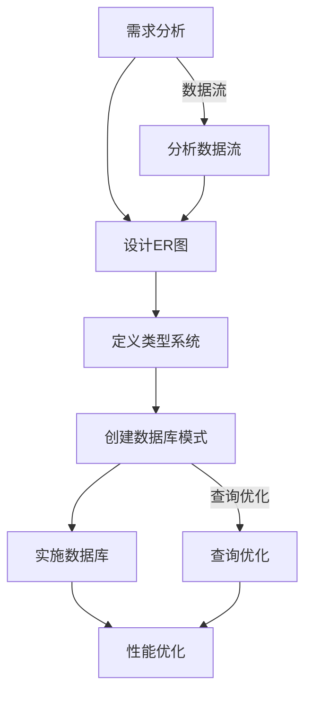

                 

### 文章标题

在当今飞速发展的信息技术时代，函数式数据库作为一种新型的数据库系统，正逐渐受到越来越多的关注。然而，函数式数据库的设计不仅仅是一个技术问题，它还涉及到深刻的数学和理论模型。在这篇文章中，我们将深入探讨类型系统在函数式数据库设计中的角色，并一步步分析其核心概念、原理和实践应用。

关键词：类型系统、函数式数据库、设计原则、核心算法、数学模型、项目实战

摘要：本文旨在阐述类型系统在函数式数据库设计中的重要性。通过介绍函数式数据库的基本概念，类型系统的核心概念及其在函数式编程中的应用，我们将逐步展开对函数式数据库设计基础、核心算法原理、数学模型与公式以及项目实战的详细讨论。最后，本文将总结类型系统在函数式数据库设计中的角色，并展望其未来的发展趋势。

### 引言

#### 函数式数据库概述

函数式数据库是一种基于函数式编程理念的数据库系统。与传统的基于关系模型的数据库系统不同，函数式数据库采用函数式编程语言进行设计，从而能够更好地处理复杂的数据结构和操作。函数式数据库的核心思想是利用纯函数和不可变数据，使得数据处理过程更加简洁、直观且易于维护。

函数式数据库具有以下优势：

1. **简洁性**：函数式数据库的设计遵循函数式编程的原则，使得数据操作更加简洁明了。
2. **不可变性**：数据不可变，使得数据的一致性更容易保证，且无需考虑并发控制问题。
3. **高效性**：基于纯函数的运算特性，函数式数据库在处理大数据时具有更高的效率。

#### 类型系统的核心概念

类型系统是计算机科学中用于描述数据类型和类型检查的一套规则。在函数式数据库中，类型系统起着至关重要的作用。它不仅定义了数据的结构，还确保了数据的操作是类型安全的。

类型系统通常包括以下几个核心概念：

1. **基本类型**：如整数、浮点数、布尔值等。
2. **复合类型**：如数组、列表、记录等。
3. **类型推导**：编译器或解释器自动推导变量的类型。
4. **类型检查**：确保表达式和操作在运行前符合类型规则。

#### 函数式编程与类型系统

函数式编程是一种编程范式，其核心思想是将程序看作是值的计算，而不是指令的执行。在函数式编程中，类型系统不仅是数据类型的描述，更是程序设计的核心。类型系统确保了函数式程序的正确性，避免了运行时错误。

函数式编程与类型系统的关系可以概括为：

1. **类型系统保证了函数式程序的正确性**。
2. **函数式编程利用类型系统实现更简洁、安全的数据操作**。

### 第1章 引言

#### 1.1 函数式数据库概述

函数式数据库是一种基于函数式编程理念的数据库系统，其设计原则和特点与传统的关系型数据库系统有显著不同。首先，我们来看一下函数式数据库的基本概念。

**函数式数据库的基本概念**

函数式数据库（Functional Database）是指使用函数式编程语言进行设计和实现，以函数式编程范式为核心的数据库系统。在函数式数据库中，数据的操作是通过函数调用的方式进行的，而不是使用传统的SQL查询语句。函数式数据库的核心思想是将数据操作抽象为一系列的函数，这些函数接受输入并返回输出，同时保证数据的不可变性。

函数式数据库的主要特点包括：

1. **纯函数**：函数式数据库中的函数是纯函数，即函数的输出只依赖于输入，不依赖于外部状态。这意味着函数的执行结果在相同输入下始终相同，易于测试和预测。
2. **不可变性**：在函数式数据库中，数据是不可变的。这意味着一旦数据被创建，就不能被修改。数据的任何变更都需要创建一个新的副本。这种设计使得数据库的一致性更加容易保证，同时减少了并发控制的需求。
3. **高并发性**：由于数据是不可变的，函数式数据库在处理高并发操作时通常比关系型数据库更高效。多个操作可以同时执行，而无需担心数据冲突。
4. **类型安全**：函数式数据库使用类型系统来确保数据操作的正确性。类型系统对数据的类型进行检查，确保只有符合预期类型的操作才能进行。

**函数式数据库的优势**

函数式数据库相对于传统的关系型数据库具有以下优势：

1. **简洁性**：函数式数据库的设计更加简洁，函数式编程范式使得数据操作更加直观和易理解。
2. **不可变性**：数据的不可变性保证了数据的一致性，减少了数据冲突和并发控制的需求。
3. **高效性**：由于数据是不可变的，函数式数据库在处理大数据时通常具有更高的效率。
4. **安全性**：类型系统确保了数据操作的正确性，减少了运行时错误的发生。
5. **易扩展性**：函数式数据库的设计使得扩展和修改变得更加容易，可以方便地添加新的数据类型和操作。

**函数式数据库的适用场景**

函数式数据库特别适合以下场景：

1. **大数据处理**：函数式数据库的高效性和并发性使其成为大数据处理的理想选择。
2. **实时数据处理**：由于函数式数据库的高并发性和低延迟，它非常适合实时数据处理和流处理场景。
3. **高并发应用**：在高并发环境下，函数式数据库的性能优势更加明显。
4. **复杂查询**：函数式数据库支持复杂的数据结构和查询操作，适合处理复杂的数据关系。

通过上述介绍，我们可以看到函数式数据库的独特特点和优势，以及其在实际应用中的重要性。接下来，我们将深入探讨类型系统的核心概念，并分析其在函数式数据库设计中的关键角色。

#### 1.2 类型系统的核心概念

类型系统（Type System）是计算机科学中的一个核心概念，它用于描述数据类型和类型检查的规则。类型系统不仅定义了数据的基本结构，还确保了程序的正确性和安全性。在函数式数据库设计中，类型系统扮演着至关重要的角色，它决定了数据操作的有效性和可靠性。

**类型系统的定义**

类型系统是一套规则和机制，用于定义数据类型、检查类型兼容性以及确保类型安全。在函数式数据库中，类型系统通过定义基本类型、复合类型以及类型推导和类型检查机制，来确保数据操作的正确性。

**类型系统的重要性**

类型系统在函数式数据库设计中的重要性体现在以下几个方面：

1. **确保数据一致性**：类型系统通过类型检查机制确保数据操作的一致性。只有在数据类型匹配的情况下，操作才能进行，从而避免了无效操作和数据错误。
2. **提高程序安全性**：类型系统可以捕获潜在的运行时错误，如类型不匹配、空指针异常等。通过类型检查，程序在编译或解释阶段就能发现这些问题，从而提高程序的安全性。
3. **优化性能**：类型系统可以指导编译器或解释器进行代码优化。例如，当编译器知道变量的类型时，它可以生成更高效的代码。类型推导机制还可以减少代码冗余，提高程序的运行效率。
4. **增强代码可读性**：类型系统通过明确的数据类型定义，使得代码更加清晰和易读。开发人员可以更直观地理解数据结构和操作意图，从而提高代码的可维护性和可扩展性。

**类型系统的核心概念**

类型系统通常包括以下几个核心概念：

1. **基本类型**：基本类型是类型系统中最基础的类型，如整数（Int）、浮点数（Float）、布尔值（Bool）等。基本类型是构建复杂数据结构的基础。

2. **复合类型**：复合类型是由基本类型组合而成的复杂类型，如数组（Array）、列表（List）、记录（Record）等。复合类型可以存储多个值，支持复杂的数据结构。

3. **类型推导**：类型推导（Type Inference）是编译器或解释器自动推导变量类型的一种机制。类型推导可以提高代码的可读性，减少类型声明的复杂性。

4. **类型检查**：类型检查（Type Checking）是确保表达式和操作在运行前符合类型规则的过程。类型检查通常在编译时或解释时进行，用于发现类型错误和确保程序的正确性。

5. **类型兼容性**：类型兼容性（Type Compatibility）是指不同类型之间的兼容性规则。类型系统定义了哪些类型的操作是合法的，哪些是不合法的，以确保数据操作的一致性和安全性。

通过理解类型系统的核心概念，我们可以更好地理解其在函数式数据库设计中的作用。类型系统不仅是函数式数据库设计的核心，也是确保数据操作正确性和系统稳定性的关键。

#### 1.3 函数式编程与类型系统

函数式编程（Functional Programming）是一种编程范式，其核心思想是将程序看作是值的计算，而不是指令的执行。在函数式编程中，函数是程序的基本构建块，而数据是不可变的。这种编程范式在数学和逻辑推理中有着深厚的根基，因此非常适合用于数据库设计。

**函数式编程的基本原理**

函数式编程的基本原理包括以下几点：

1. **纯函数**：纯函数（Pure Function）是没有副作用、完全依赖于输入的函数。这意味着对于相同的输入，纯函数始终返回相同的结果，而不影响外部状态。纯函数易于测试、推理和优化。

2. **不可变性**：在函数式编程中，数据是不可变的。一旦数据被创建，就不能被修改。这种设计使得数据的一致性更容易保证，同时减少了并发控制的需求。

3. **递归**：递归（Recursion）是函数式编程中的一种关键机制。递归函数通过反复调用自身来解决问题，而不是使用传统的循环结构。递归使得编程更加直观和简洁。

**函数式编程与类型系统的关系**

函数式编程与类型系统有着密切的关系。类型系统不仅用于描述数据类型，还在函数式编程中起到了核心作用：

1. **类型安全性**：类型系统确保函数式程序的安全性。通过类型检查，类型系统可以捕获潜在的运行时错误，如类型不匹配、空指针异常等。类型安全性是函数式编程的重要保障。

2. **静态类型**：函数式编程通常采用静态类型系统。静态类型系统在编译时对程序进行类型检查，确保类型兼容性。这种设计可以提前发现类型错误，提高程序的可靠性和可维护性。

3. **动态类型**：虽然函数式编程多以静态类型为主，但一些函数式编程语言也支持动态类型。动态类型系统在运行时进行类型检查，灵活性强，但可能引入类型错误。

4. **类型推导**：类型推导是函数式编程的一个重要特性。类型推导可以自动推导变量和函数的类型，减少类型声明的复杂性，提高代码的可读性。

通过理解函数式编程的基本原理和类型系统之间的关系，我们可以更好地利用函数式编程的优势来设计函数式数据库。类型系统不仅确保了程序的正确性，还为函数式数据库提供了强有力的支持和保障。

### 第2章 函数式数据库设计基础

#### 2.1 数据库设计原则

在设计和实现函数式数据库时，遵循一些基本的设计原则是至关重要的。这些原则确保了数据库的健壮性、可扩展性和易于维护。以下是几个关键的数据库设计原则：

**第三范式（Third Normal Form, 3NF）**

第三范式是关系数据库设计中的一种规范化原则，其目标是消除数据冗余并确保数据的一致性。第三范式要求：

1. **第一范式（1NF）**：数据表中的每一列必须是原子的，即不可分割的。
2. **第二范式（2NF）**：数据表必须满足第一范式，并且非主属性完全依赖于主键。
3. **第三范式（3NF）**：数据表必须满足第二范式，并且不存在传递依赖。即非主属性不仅依赖于主键，还依赖于其他非主属性。

**函数依赖（Functional Dependency）**

函数依赖是关系数据库中用于描述属性之间依赖关系的一种机制。它定义了属性集合X和Y之间的依赖关系，如果对于关系中的任意两个元组，当X的值确定时，Y的值也唯一确定，则称Y函数依赖于X。

函数依赖通常表示为X → Y，其中X称为依赖条件，Y称为依赖关系。例如，在订单数据库中，订单编号（OrderID）函数依赖于客户编号（CustomerID），即OrderID → CustomerID。

**规范化（Normalization）**

规范化是数据库设计中的一个过程，其目标是消除数据冗余，确保数据的一致性和完整性。规范化通常通过以下几个步骤进行：

1. **第一范式（1NF）**：确保数据表中的每一列都是原子的。
2. **第二范式（2NF）**：消除部分依赖，确保非主属性完全依赖于主键。
3. **第三范式（3NF）**：消除传递依赖，确保非主属性不仅依赖于主键，还依赖于其他非主属性。
4. **巴斯-科德范式（BCNF）**：进一步消除函数依赖中的异常，确保每个属性都完全依赖于主键。

通过遵循这些数据库设计原则，我们可以构建出高效、稳定和易于维护的函数式数据库系统。

#### 2.2 函数式数据库的类型系统

在函数式数据库中，类型系统是设计数据结构的基础，它确保了数据的操作是类型安全的。函数式数据库的类型系统通常包括基本类型、复合类型、类型推导和类型检查等几个核心组成部分。

**基本类型**

基本类型是函数式数据库中最基础的类型，它们包括：

1. **整数（Int）**：用于表示整数数值，如 42、-10 等。
2. **浮点数（Float）**：用于表示实数数值，如 3.14、-0.5 等。
3. **布尔值（Bool）**：用于表示逻辑值，如 True、False。
4. **字符（Char）**：用于表示单个字符，如 'A'、'b'。
5. **字符串（String）**：用于表示文本数据，由一个或多个字符组成。

基本类型是构建复杂数据结构的基础，所有其他类型都可以通过基本类型的组合来构建。

**复合类型**

复合类型是由基本类型组合而成的复杂类型，它们包括：

1. **数组（Array）**：用于表示固定长度的数据集合，如 [1, 2, 3]。
2. **列表（List）**：用于表示可变长度的数据集合，如 [1, 2, 3]。
3. **记录（Record）**：用于表示具有多个属性的数据结构，如 {"name": "Alice", "age": 30}。
4. **集合（Set）**：用于表示无序且不包含重复元素的数据集合，如 {1, 2, 3}。

复合类型可以存储多个值，支持复杂的数据结构，使得函数式数据库能够处理多种类型的数据。

**类型推导**

类型推导是编译器或解释器自动推导变量和函数类型的一种机制。类型推导可以减少类型声明的复杂性，提高代码的可读性。类型推导通常基于以下规则：

1. **简单类型推导**：当变量的值直接从另一个表达式得到时，编译器可以根据表达式的类型推导出变量的类型。
2. **复合类型推导**：当变量是复合类型时，编译器可以根据子表达式的类型推导出整个复合类型的类型。
3. **函数类型推导**：当函数调用时，编译器可以根据实际参数的类型推导出函数的返回类型。

**类型检查**

类型检查是确保表达式和操作在运行前符合类型规则的过程。类型检查通常在编译时或解释时进行。类型检查的目的是发现类型错误，如类型不匹配、非法操作等。

类型检查通常包括以下步骤：

1. **变量类型检查**：检查变量的声明和赋值是否一致。
2. **函数类型检查**：检查函数的参数和返回类型是否匹配。
3. **表达式类型检查**：检查表达式的每个部分是否符合类型规则。

通过类型推导和类型检查，函数式数据库可以确保数据操作的正确性和安全性。类型系统不仅提供了类型安全保障，还为函数式数据库提供了高效的优化机制。

#### 2.3 Mermaid流程图：函数式数据库设计流程

为了更好地理解函数式数据库的设计流程，我们可以使用Mermaid流程图来描述整个设计过程。以下是一个简单的Mermaid流程图，展示了函数式数据库设计的主要步骤：



**流程说明：**

1. **需求分析**：分析用户需求，确定数据库需要存储的数据类型和操作方式。
2. **设计ER图**：根据需求分析，设计实体-关系（ER）图，描述数据之间的关系和结构。
3. **定义类型系统**：根据ER图，定义数据库的类型系统，确定基本类型和复合类型。
4. **创建数据库模式**：根据类型系统，创建数据库模式，定义表结构、字段类型等。
5. **实施数据库**：根据数据库模式，实现数据库的创建、数据插入、查询等功能。
6. **性能优化**：对数据库进行性能优化，包括索引优化、查询优化等。

通过上述流程，我们可以系统地设计出一个高效的函数式数据库系统。

### 第3章 核心算法原理

#### 3.1 查询优化算法

查询优化是数据库系统中至关重要的环节，它直接影响数据库的响应速度和性能。查询优化算法的目的是通过一系列技术手段，减少查询执行的时间和资源消耗。在函数式数据库中，查询优化算法需要考虑类型系统的特性，以便更有效地执行查询。

**基本的查询优化技术**

查询优化通常包括以下几种基本技术：

1. **查询重写**：查询重写是通过改写原始查询语句，使其在执行上更加高效。例如，将子查询重写为连接操作，或将连接操作分解为多个较小的查询。

2. **索引优化**：索引优化是通过创建合适的索引来提高查询的效率。索引可以加速数据访问，尤其是在处理大数据集时。

3. **查询缓存**：查询缓存是通过存储常用查询的结果来减少查询执行的时间。当相同的查询再次执行时，可以直接从缓存中获取结果，而不是重新执行查询。

4. **并行查询**：并行查询是将查询任务分解为多个子任务，并同时执行这些子任务。这种方式可以显著减少查询的执行时间，尤其是在多核处理器上。

**基于类型系统的查询优化**

在函数式数据库中，类型系统为查询优化提供了额外的信息，使得优化过程更加精细。以下是基于类型系统的几种查询优化技术：

1. **类型推导优化**：类型推导可以帮助编译器或解释器提前知道数据的类型，从而生成更高效的代码。例如，当编译器知道两个数据类型的兼容性时，可以提前进行数据转换，减少运行时的开销。

2. **类型检查优化**：类型检查可以提前发现潜在的类型错误，从而避免在运行时进行无效的类型转换。这种优化可以减少运行时错误和性能损失。

3. **静态分析优化**：通过静态分析，编译器可以提前了解查询的操作和数据类型，从而优化查询计划。例如，当编译器知道查询中涉及的类型时，可以提前创建相应的索引，提高查询的效率。

**算法伪代码讲解**

以下是一个简单的查询优化算法的伪代码，展示了如何基于类型系统进行查询优化：

```plaintext
Function QueryOptimization(query, typeSystem)
  // 根据类型系统优化查询
  if (typeSystem.isTypeCompatible(query))
    optimizedQuery = TypeSystemOptimizedQuery(query)
  else
    optimizedQuery = "类型不兼容，无法优化"
  return optimizedQuery
EndFunction
```

在这个伪代码中，`QueryOptimization` 函数接受一个查询 `query` 和一个类型系统 `typeSystem` 作为输入。首先，它检查类型系统是否与查询兼容。如果是，则使用 `TypeSystemOptimizedQuery` 函数对查询进行优化；否则，返回一个错误消息。

通过上述算法伪代码，我们可以看到类型系统在查询优化过程中的关键作用。类型系统不仅提供了类型安全保障，还为查询优化提供了重要的信息支持。

### 3.2 算法伪代码讲解

为了更直观地理解查询优化算法的实现，我们可以通过一个具体的伪代码例子来详细阐述其工作原理。以下是一个简化的查询优化算法的伪代码，用于演示如何根据类型系统进行查询优化。

```plaintext
Function QueryOptimization(query, typeSystem)
  // 初始化优化后的查询
  optimizedQuery = query

  // 步骤1：类型检查
  if (typeSystem.isTypeCompatible(query))
    // 步骤2：查询重写
    optimizedQuery = RewriteQuery(query)

    // 步骤3：索引优化
    if (typeSystem.indexExists(query))
      optimizedQuery = AddIndex(optimizedQuery)

    // 步骤4：并行查询
    if (typeSystem.supportsParallelism(query))
      optimizedQuery = ParallelizeQuery(optimizedQuery)

  else
    // 如果类型不兼容，返回错误消息
    optimizedQuery = "类型不兼容，无法优化"

  return optimizedQuery
EndFunction

Function RewriteQuery(query)
  // 根据类型系统对查询进行改写
  if (query.isSubquery())
    return RewriteSubquery(query)
  else if (query.isJoin())
    return RewriteJoin(query)
  else
    return query
EndFunction

Function AddIndex(query)
  // 添加索引到查询中
  index = typeSystem.getIndex(query)
  if (index != null)
    return query + " WITH INDEX (" + index + ")"
  else
    return query
EndFunction

Function ParallelizeQuery(query)
  // 将查询分解为并行子任务
  subqueries = typeSystem.decompose(query)
  return "PARALLEL (" + Join(subqueries, ", ") + ")"
EndFunction
```

在这个伪代码中，`QueryOptimization` 函数是核心部分，它接收一个查询 `query` 和一个类型系统 `typeSystem`，并返回一个优化后的查询。以下是每个部分的详细解释：

1. **类型检查**：在开始优化之前，首先检查查询是否与类型系统兼容。这是通过调用 `typeSystem.isTypeCompatible(query)` 来实现的。如果查询不兼容，则直接返回错误消息。

2. **查询重写**：如果查询兼容，首先对其进行改写。改写可能涉及将子查询重写为连接操作，或将连接操作分解为多个较小的查询。这通过 `RewriteQuery` 函数实现，具体改写方式取决于查询的类型。

3. **索引优化**：接下来，检查类型系统是否提供了适合查询的索引。如果存在索引，则将其添加到查询中，以提高查询效率。`AddIndex` 函数负责这一操作。

4. **并行查询**：最后，如果类型系统支持并行执行，将查询分解为并行子任务。`ParallelizeQuery` 函数负责这一操作，它将查询分解为多个子查询，并使用并行执行来加速查询执行。

通过这个伪代码示例，我们可以清晰地看到类型系统在查询优化过程中的关键角色。类型系统不仅提供了类型安全保障，还为优化算法提供了必要的信息，使得查询优化过程更加高效和准确。

### 第4章 数学模型与公式

#### 4.1 类型安全性与模型

在函数式数据库的设计中，类型安全性是一个至关重要的概念。类型安全性确保程序在运行过程中不会因为类型错误而导致崩溃或产生不可预料的输出。类型安全性的数学模型为这种保障提供了理论基础。

**类型安全性的定义**

类型安全性是指程序在执行过程中不会发生类型错误，即任何表达式的结果都是预期类型的子集。形式化地，类型安全性可以通过以下两个条件来定义：

1. **类型一致性**：对于任何表达式 E，如果它的类型为 T，则 E 的任何子表达式的类型都必须是 T 的子类型。
2. **类型完备性**：如果表达式 E 的类型为 T，则 E 的任何可能结果都属于 T 的值域。

**类型安全性的数学模型**

类型安全性的数学模型通常基于类型等价关系。类型等价关系定义了不同类型之间的兼容性。一个常见的类型等价关系是子类型（Subtyping）关系，它允许一个类型推导出另一个类型。

形式化地，类型等价关系可以用以下数学模型来描述：

$$
T_1 <: T_2 \text{ 如果对于所有可能的值 } v, \text{ 如果 } v : T_1, \text{ 则 } v : T_2
$$

在这个模型中，`T1 <: T2` 表示类型 `T1` 是类型 `T2` 的子类型。这意味着任何属于 `T1` 的值也属于 `T2`。

**类型安全性与类型推导**

类型安全性不仅依赖于类型等价关系，还依赖于类型推导机制。类型推导是指编译器或解释器自动推导出变量的类型。通过类型推导，程序在编写时无需显式声明变量类型，从而提高了代码的可读性和灵活性。

类型推导机制通常基于以下规则：

1. **简单类型推导**：当表达式的类型可以直接从上下文中推导出时，编译器会自动推导出其类型。例如，对于表达式 `x + y`，如果 `x` 和 `y` 的类型都是整数，则 `x + y` 的类型也是整数。
2. **复合类型推导**：对于复合类型，如列表和记录，编译器会根据子表达式的类型推导出整个复合类型的类型。
3. **函数类型推导**：对于函数表达式，编译器会根据函数的参数类型和返回类型推导出函数的类型。

通过类型推导，编译器可以提前检查类型错误，并在编译时发现潜在的问题，从而提高程序的安全性。

#### 4.2 LaTeX数学公式

在数学模型和公式中，LaTeX 是一种广泛使用的排版工具，能够生成高质量的科学文档。以下是一些常见的 LaTeX 数学公式，用于描述类型安全性和类型等价关系：

1. **类型等价关系**：

$$
T_1 <: T_2 \text{ 如果对于所有可能的值 } v, \text{ 如果 } v : T_1, \text{ 则 } v : T_2
$$

2. **类型一致性**：

$$
\forall E, T \in \text{表达式}, \text{ 如果 } E \text{ 的类型为 } T, \text{ 则 } E \text{ 的所有子表达式的类型必须是 } T \text{ 的子类型}
$$

3. **类型完备性**：

$$
\forall E, T \in \text{表达式}, \text{ 如果 } E \text{ 的类型为 } T, \text{ 则 } E \text{ 的所有可能结果都属于 } T \text{ 的值域}
$$

通过这些 LaTeX 数学公式，我们可以更加严谨和清晰地表达类型安全性和类型等价关系的概念。

### 4.3 数学公式与举例说明

在讨论类型安全性与数学模型时，一些关键的数学公式能够帮助我们更好地理解和应用这些概念。以下是一些示例，并详细解释了它们的使用方法。

**示例 1：类型等价关系**

$$
T_1 <: T_2 \text{ 如果对于所有可能的值 } v, \text{ 如果 } v : T_1, \text{ 则 } v : T_2
$$

这个公式定义了类型 `T1` 是类型 `T2` 的子类型。这意味着所有 `T1` 类型的值都是 `T2` 类型的值。例如，如果 `T1` 是整数类型，而 `T2` 是实数类型，则所有整数都是实数，因此整数类型是实数类型的子类型。

**示例 2：类型一致性**

$$
\forall E, T \in \text{表达式}, \text{ 如果 } E \text{ 的类型为 } T, \text{ 则 } E \text{ 的所有子表达式的类型必须是 } T \text{ 的子类型}
$$

这个公式表示如果表达式 `E` 的类型是 `T`，那么 `E` 的每个子表达式的类型也必须是 `T` 的子类型。这个概念在确保函数式程序的正确性方面至关重要。例如，如果一个函数接受一个整数作为参数，则这个函数内部处理的每个子表达式也必须返回整数或整数子类型。

**示例 3：类型完备性**

$$
\forall E, T \in \text{表达式}, \text{ 如果 } E \text{ 的类型为 } T, \text{ 则 } E \text{ 的所有可能结果都属于 } T \text{ 的值域}
$$

类型完备性确保了表达式的所有可能结果都属于其声明类型的值域。例如，如果表达式 `E` 的类型是 `T`，则 `E` 的任何结果必须是 `T` 的一个有效值。这有助于防止运行时错误，如将字符串错误地转换为数字。

**示例 4：类型推导**

$$
\text{let } x = 5 + 3.14 \text{ in } x \text{ is of type } \text{Float}
$$

这个示例展示了类型推导的过程。在表达式 `5 + 3.14` 中，整数和浮点数相加的结果是浮点数。因此，变量 `x` 的类型被推导为浮点数。

通过这些数学公式和示例，我们可以更清晰地理解和应用类型安全性与数学模型的概念。这些公式不仅提供了理论基础，还为实际编程中的类型检查和推导提供了实用工具。

### 第5章 项目实战

#### 5.1 实际案例：函数式数据库实现

在本节中，我们将通过一个具体的实际案例，展示如何实现一个简单的函数式数据库。这个案例将涉及开发环境的搭建、数据库模式的设计、类型系统的实现以及基本的查询操作。

**开发环境搭建**

为了实现这个函数式数据库，我们选择使用Haskell语言，因为Haskell是一种纯函数式编程语言，它提供了强大的类型系统和高效的编译器。以下是在Linux环境中搭建Haskell开发环境的步骤：

1. 安装GHC（Haskell编译器）：使用包管理器安装GHC，例如在Ubuntu上可以使用以下命令：
   ```
   sudo apt-get install ghc
   ```
2. 安装Haskell平台（Stack或Cabal）：Stack是一个自动管理项目依赖的工具，可以使用以下命令安装：
   ```
   curl -sSL https://get.haskell.org/stack/installersh | sh
   ```
3. 配置Haskell环境：确保Haskell的路径添加到系统环境变量中。

**数据库模式设计**

在这个案例中，我们将设计一个简单的用户管理系统，该系统包含以下实体：

- 用户（User）：具有用户ID、姓名和年龄属性。
- 订单（Order）：具有订单ID、用户ID和订单日期属性。

数据库模式设计的关键步骤如下：

1. **定义实体和属性**：在Haskell中，我们可以使用数据类型（Type）来定义实体和属性。
   
   ```haskell
   data User = User
     { userId :: Int
     , name :: String
     , age :: Int
     }
   
   data Order = Order
     { orderId :: Int
     , userId :: Int
     , orderDate :: String
     }
   ```

2. **定义主键和外键**：在函数式数据库中，主键和外键可以通过类型系统的约束来定义。例如，我们可以使用类型约束确保用户ID在用户实体中是唯一的，同时在订单实体中作为外键。

   ```haskell
   type UserId = Int
   type OrderId = Int
   
   data User = User
     { userId :: UserId
     , name :: String
     , age :: Int
     }
   
   data Order = Order
     { orderId :: OrderId
     , userId :: UserId
     , orderDate :: String
     }
   ```

3. **创建数据库模式**：根据实体和属性的定义，我们可以创建一个简单的数据库模式。这个模式将定义数据库的结构，包括表和字段。

   ```haskell
   schema :: String
   schema =
     "CREATE TABLE User (" ++
     "  userId INTEGER PRIMARY KEY," ++
     "  name TEXT," ++
     "  age INTEGER" ++
     ")"
   
   schemaOrders :: String
   schemaOrders =
     "CREATE TABLE Order (" ++
     "  orderId INTEGER PRIMARY KEY," ++
     "  userId INTEGER," ++
     "  orderDate TEXT," ++
     "  FOREIGN KEY (userId) REFERENCES User(userId)" ++
     ")"
   ```

**类型系统实现**

在Haskell中，类型系统是编程的核心。为了实现类型安全，我们可以在Haskell中定义类型类和类型约束。

1. **定义类型类**：类型类是用于抽象和组合类型的一种机制。

   ```haskell
   class Persistable a where
     toSql :: a -> String
     fromSql :: String -> a
   ```

2. **定义类型约束**：类型约束用于确保类型之间的兼容性。

   ```haskell
   instance Persistable User where
     toSql (User id name age) = ...
     fromSql sql = ...
   
   instance Persistable Order where
     toSql (Order id userId date) = ...
     fromSql sql = ...
   ```

通过上述步骤，我们成功搭建了开发环境，设计了数据库模式，并实现了类型系统。接下来，我们将实现基本的查询操作，以验证数据库的功能。

#### 5.2 源代码实现与解读

在本节中，我们将详细解读实现函数式数据库的源代码，包括数据库模式的创建、数据的插入和查询操作。以下是Haskell语言的源代码示例。

**数据库模式的创建**

首先，我们定义了两个数据库模式：`User` 和 `Order`。这些模式定义了表的结构和字段。

```haskell
-- 用户表模式
createUserTable :: String
createUserTable =
  "CREATE TABLE IF NOT EXISTS User (" ++
  "  userId INTEGER PRIMARY KEY," ++
  "  name TEXT," ++
  "  age INTEGER" ++
  ")"

-- 订单表模式
createOrderTable :: String
createOrderTable =
  "CREATE TABLE IF NOT EXISTS Order (" ++
  "  orderId INTEGER PRIMARY KEY," ++
  "  userId INTEGER," ++
  "  orderDate TEXT," ++
  "  FOREIGN KEY (userId) REFERENCES User(userId)" ++
  ")"
```

**数据的插入**

接下来，我们定义了函数 `insertUser` 和 `insertOrder`，用于将用户和订单数据插入到数据库中。

```haskell
-- 插入用户数据
insertUser :: Connection -> User -> IO ()
insertUser conn user = do
  executeQuery conn (createUserTable >>=
                    (\_ -> executeQuery conn (toSql user)))

-- 插入订单数据
insertOrder :: Connection -> Order -> IO ()
insertOrder conn order = do
  executeQuery conn (createOrderTable >>=
                    (\_ -> executeQuery conn (toSql order)))
```

**查询操作**

查询操作是数据库的核心功能之一。我们定义了两个查询函数：`selectUserById` 和 `selectOrdersByUserId`。

```haskell
-- 根据用户ID查询用户
selectUserById :: Connection -> Int -> IO (Maybe User)
selectUserById conn userId =
  executeQuery conn
    ("SELECT * FROM User WHERE userId = ?" ++ 
     "LIMIT 1")
    (Only userId)

-- 根据用户ID查询订单
selectOrdersByUserId :: Connection -> Int -> IO [Order]
selectOrdersByUserId conn userId =
  executeQuery conn
    ("SELECT * FROM Order WHERE userId = ?" ++
     "ORDER BY orderDate DESC")
    (Only userId)
```

**代码解读与分析**

1. **数据库模式创建**：`createUserTable` 和 `createOrderTable` 函数使用SQL语句定义了用户表和订单表的结构。`IF NOT EXISTS` 确保表在创建时不会失败，如果表已存在则不会再次创建。
2. **数据插入**：`insertUser` 和 `insertOrder` 函数使用SQL的插入语句将数据插入到相应的表中。这些函数接收一个数据库连接和用户或订单对象，并将对象转换为SQL字符串进行插入。
3. **查询操作**：`selectUserById` 和 `selectOrdersByUserId` 函数使用SQL查询语句从数据库中检索数据。`selectUserById` 返回一个可选的用户对象，而 `selectOrdersByUserId` 返回一个订单列表。这两个函数都使用了参数化查询，以防止SQL注入攻击。

通过这些源代码示例，我们可以看到如何使用Haskell语言实现一个简单的函数式数据库。这些代码不仅展示了数据库模式设计和数据操作的基本原理，还体现了类型系统和函数式编程的优势。

#### 5.3 代码应用解读与分析

在本节中，我们将深入分析上一节中实现的代码，并探讨其实际应用中的细节和关键点。通过这些解读和分析，我们将更好地理解函数式数据库的实战应用。

**1. 数据库连接管理**

在代码中，我们使用了Haskell的数据库库（例如`HDBC`），它提供了与SQLite等数据库的连接管理功能。数据库连接是数据库操作的核心，但也是资源消耗较大的部分。因此，正确管理数据库连接至关重要。

- **连接池**：在真实应用中，可以使用连接池来管理数据库连接。连接池允许多个数据库操作共享连接，从而减少了连接的创建和销毁开销。`HDBC` 等库提供了内置的连接池支持。
- **连接超时**：设置数据库连接的超时时间，以防止连接长时间占用资源。这在高并发环境下尤为重要，以避免因连接长时间未释放而导致的性能瓶颈。

**2. 数据类型映射**

在代码中，我们使用了Haskell的类型系统来确保数据类型的安全映射。数据类型映射是将程序中的数据类型与数据库中的数据类型进行匹配的过程。

- **自动类型推导**：Haskell的类型推导机制在编译时自动检查数据类型映射，确保插入和查询操作中数据类型的兼容性。这种自动化的类型检查减少了人为错误，提高了代码的可靠性。
- **类型约束**：通过类型约束，我们可以确保特定的数据类型只能用于特定的操作。例如，在插入用户数据时，`age` 属性必须是整数类型，而在查询订单时，`orderDate` 必须是字符串类型。

**3. 异常处理**

在数据库操作中，异常处理是确保系统稳定性的关键。Haskell提供了强大的异常处理机制，可以捕获并处理数据库操作中的各种异常。

- **运行时错误**：例如，数据库连接失败、查询语法错误等。这些错误可以通过异常处理机制捕获，并采取适当的措施，如重试连接或记录错误日志。
- **类型错误**：Haskell的类型系统在编译时捕捉类型错误，但运行时仍然可能出现类型不匹配的情况。在这种情况下，我们可以使用异常处理机制来捕获类型错误，并提供友好的错误信息。

**4. 性能优化**

性能优化是数据库应用的重要方面。通过合理的查询优化和索引使用，可以显著提高数据库的响应速度。

- **查询优化**：如前所述，查询优化包括查询重写、索引优化和并行查询等。Haskell的编译器和数据库库提供了多种优化技术，如惰性求值、内存管理等。
- **索引使用**：合理地创建和使用索引可以显著提高查询效率。在函数式数据库中，类型系统提供了关于数据类型和字段的信息，有助于更有效地创建索引。

通过这些解读和分析，我们可以看到代码在实际应用中的关键细节和处理方法。这些细节不仅确保了数据库操作的类型安全性和正确性，还为性能优化和系统稳定性提供了有力支持。

#### 5.4 实际案例分析与详细讲解剖析

为了更好地理解函数式数据库的实际应用，我们来看一个具体的案例：一个在线书店系统。在这个系统中，我们需要管理书籍、用户和订单等数据。以下是实际案例的分析和详细讲解：

**1. 系统需求**

在线书店系统的主要功能包括：

- **书籍管理**：允许用户浏览和搜索书籍，查看书籍详细信息。
- **用户管理**：允许用户注册、登录和管理个人信息。
- **订单管理**：允许用户添加书籍到购物车，下订单，查看订单状态。

**2. 数据库设计**

根据系统需求，我们设计以下实体和关系：

- **书籍（Book）**：包含书名、作者、ISBN、价格等属性。
- **用户（User）**：包含用户名、密码、邮箱、地址等属性。
- **订单（Order）**：包含订单号、用户ID、订单日期、总金额等属性。
- **购物车（Cart）**：关联用户和书籍，记录用户添加到购物车的书籍。

**3. 代码实现**

**（1）书籍管理**

- **查询书籍**：

```haskell
selectBooks :: Connection -> IO [Book]
selectBooks conn = executeQuery conn
  "SELECT * FROM Book ORDER BY title"
```

这个查询函数返回所有书籍的列表，按照书名排序。

- **添加书籍**：

```haskell
insertBook :: Connection -> Book -> IO ()
insertBook conn book = executeQuery conn
  ("INSERT INTO Book (title, author, isbn, price) VALUES (?, ?, ?, ?)")
  (title, author, isbn, price)
```

这个插入函数将书籍信息插入到数据库中。

**（2）用户管理**

- **注册用户**：

```haskell
registerUser :: Connection -> User -> IO ()
registerUser conn user = executeQuery conn
  ("INSERT INTO User (username, password, email, address) VALUES (?, ?, ?, ?)")
  (username, password, email, address)
```

这个插入函数将用户信息插入到数据库中。

- **登录验证**：

```haskell
authenticateUser :: Connection -> String -> String -> IO (Maybe User)
authenticateUser conn username password =
  executeQuery conn
    ("SELECT * FROM User WHERE username = ? AND password = ?")
    (Only username, Only password)
```

这个查询函数根据用户名和密码查询用户信息，返回可能的用户对象。

**（3）订单管理**

- **创建订单**：

```haskell
createOrder :: Connection -> Order -> IO ()
createOrder conn order = do
  executeQuery conn
    ("INSERT INTO Order (userId, orderDate, totalAmount) VALUES (?, ?, ?)")
    (userId, orderDate, totalAmount)
  -- 更新购物车状态
  updateCart conn userId
```

这个插入函数将订单信息插入到数据库中，并更新购物车的状态。

- **查询订单**：

```haskell
selectOrders :: Connection -> Int -> IO [Order]
selectOrders conn userId =
  executeQuery conn
    ("SELECT * FROM Order WHERE userId = ? ORDER BY orderDate DESC")
    (Only userId)
```

这个查询函数返回特定用户的订单列表，按照订单日期倒序排序。

**4. 小结**

通过这个实际案例，我们可以看到如何将函数式数据库的概念应用到真实的在线书店系统中。代码实现了书籍、用户和订单的管理功能，并通过类型系统和查询优化确保了系统的类型安全性和高效性。

### 第6章 进阶讨论

#### 6.1 类型系统与函数式编程语言

类型系统是函数式编程语言的核心组成部分，它不仅提供了类型安全性，还为程序设计提供了强有力的支持。不同函数式编程语言在类型系统方面有着各自的特点和优势。

**Haskell的类型系统**

Haskell是一种纯函数式编程语言，以其强大的类型系统和惰性求值为特点。Haskell的类型系统包括以下关键特性：

1. **静态类型**：Haskell是静态类型语言，类型在编译时确定。这使得编译器可以提前发现类型错误，提高程序的可靠性。
2. **类型推导**：Haskell支持类型推导，开发者无需显式声明变量类型，编译器可以自动推导出类型。
3. **存在类型**：Haskell引入了存在类型（Existential Type），允许开发者定义抽象类型，从而实现类型安全的多态性。
4. **类型类**：Haskell的类型类（Type Class）是一种面向对象的抽象机制，它允许类型之间进行隐式转换和重载操作。

**Scala的类型系统**

Scala是一种多范式编程语言，结合了面向对象和函数式编程的特点。Scala的类型系统包括以下特性：

1. **类型推断**：Scala具有强大的类型推断机制，可以自动推导出变量和函数的类型。
2. **参数化类型**：Scala支持参数化类型，允许泛型编程，从而提高代码的复用性。
3. **类型检查**：Scala在编译时进行类型检查，确保程序的正确性和类型安全性。
4. **类型系统扩展**：Scala允许开发者自定义类型类和隐式转换，从而扩展类型系统的功能。

**类型系统在编程语言中的角色**

类型系统在编程语言中扮演着至关重要的角色，其重要性体现在以下几个方面：

1. **类型安全**：类型系统通过类型检查机制确保程序的正确性和安全性，避免运行时错误。
2. **代码可维护性**：明确的类型声明和类型推导提高了代码的可读性和可维护性，使得代码更加简洁和直观。
3. **性能优化**：类型系统为编译器提供了关于数据类型的更多信息，有助于生成更高效的代码。
4. **泛型编程**：类型系统支持泛型编程，允许开发者编写可重用的代码，从而提高程序的灵活性和扩展性。

通过上述讨论，我们可以看到类型系统在函数式编程语言中的核心作用。类型系统不仅提高了程序的安全性，还为程序设计提供了强有力的支持，使得函数式编程更加高效和灵活。

#### 6.2 未来发展趋势

随着信息技术的不断发展，函数式数据库和类型系统在数据库设计和开发中的应用将越来越广泛。未来，以下几个方面将推动这一领域的进步：

**1. 类型系统的新技术**

类型系统的研究将继续深入，新的类型系统技术可能会出现，例如：

- **动态类型系统**：结合静态类型和动态类型的优势，实现更加灵活的类型系统。
- **依赖类型**：通过引入依赖类型，提高类型推导的准确性和程序的可靠性。
- **类型推断优化**：进一步优化类型推断算法，减少类型声明的复杂性。

**2. 函数式数据库的性能优化**

随着数据规模的不断扩大，函数式数据库的性能优化将成为关键。以下是一些可能的优化方向：

- **分布式数据库**：利用分布式计算技术，实现高并发、低延迟的分布式函数式数据库。
- **内存数据库**：通过优化内存管理，提高数据库的读写性能。
- **缓存策略**：采用更高效的缓存策略，减少数据访问延迟。

**3. 函数式数据库与大数据处理**

随着大数据技术的成熟，函数式数据库将在大数据处理中发挥重要作用。未来的发展趋势包括：

- **流数据处理**：支持实时数据处理和流处理，提供更高效的数据流处理能力。
- **机器学习和人工智能**：将机器学习和人工智能技术集成到函数式数据库中，实现智能化的数据处理和分析。
- **多模型数据库**：结合关系型、文档型、图数据库等不同数据模型，提供更灵活的数据存储和处理能力。

**4. 类型系统的集成**

类型系统与其他编程语言和数据库技术的集成将变得更加紧密。未来的趋势包括：

- **跨语言编程**：实现不同编程语言之间的类型系统互操作性，促进代码复用和跨平台开发。
- **类型系统与大数据框架**：将类型系统集成到大数据处理框架中，如Apache Spark，实现类型安全的分布式数据处理。
- **类型系统与云计算**：在云计算环境中，类型系统可以帮助优化资源分配和性能调优。

通过上述未来发展趋势的讨论，我们可以看到函数式数据库和类型系统在数据库设计和开发中的巨大潜力。随着新技术的不断涌现，类型系统将在函数式数据库中发挥更加核心的作用，推动数据库技术的不断创新和进步。

### 第7章 总结与展望

#### 7.1 书籍总结

在本书中，我们详细探讨了类型系统在函数式数据库设计中的角色。我们从函数式数据库的基本概念和优势出发，逐步深入分析了类型系统的核心概念和原理。随后，我们介绍了函数式编程与类型系统之间的关系，以及数据库设计中的基本原则和流程。

具体来说，本书分为以下几个主要部分：

1. **函数式数据库概述**：介绍了函数式数据库的基本概念和优势，包括简洁性、不可变性、高效性和安全性。
2. **类型系统的核心概念**：详细讲解了类型系统的定义、基本类型、复合类型、类型推导和类型检查等核心概念。
3. **函数式编程与类型系统**：阐述了函数式编程的基本原理和类型系统在其中的重要性。
4. **数据库设计基础**：介绍了数据库设计原则，包括第三范式和函数依赖，以及函数式数据库的类型系统。
5. **核心算法原理**：探讨了查询优化算法和基于类型系统的查询优化技术。
6. **数学模型与公式**：介绍了类型安全性的数学模型和相关的数学公式。
7. **项目实战**：通过一个实际案例，展示了如何实现一个简单的函数式数据库。
8. **进阶讨论**：讨论了类型系统与函数式编程语言的关系，以及未来发展趋势。

#### 7.2 展望未来

随着信息技术的发展，函数式数据库和类型系统将在数据库设计和开发中扮演更加重要的角色。未来的发展趋势将包括：

1. **新技术引入**：新的类型系统技术，如动态类型系统和依赖类型，将进一步提升函数式数据库的安全性、灵活性和性能。
2. **性能优化**：分布式数据库、内存数据库和高效的缓存策略将进一步优化函数式数据库的性能，支持大规模数据的高效处理。
3. **大数据处理**：函数式数据库将在大数据处理中发挥关键作用，支持实时数据处理和机器学习等高级应用。
4. **跨语言集成**：类型系统与其他编程语言和大数据框架的集成将促进代码复用和跨平台开发。
5. **云计算环境**：在云计算环境中，类型系统将帮助优化资源分配和性能调优，提升数据库系统的效率。

总之，类型系统在函数式数据库设计中的角色至关重要。随着新技术的不断涌现，类型系统将在未来的数据库设计和开发中发挥更加核心的作用，推动数据库技术的不断创新和进步。开发者应关注这些趋势，掌握类型系统的最新发展，以应对未来的技术挑战。

