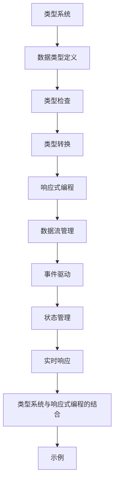

                 

### 文章标题

# 类型系统在响应式编程中的角色：管理数据流

> 关键词：类型系统、响应式编程、数据流管理、编程模式、设计原则、算法实现、项目实战

> 摘要：本文深入探讨了类型系统在响应式编程中的应用，解析了类型系统在管理数据流中的关键角色，阐述了其在提高程序可读性、维护性和性能上的重要作用。文章通过多个实际案例，详细展示了如何利用类型系统实现高效的数据流管理，为开发者提供了实用的编程模式和最佳实践。

### 前言

#### 1. 背景与目标

在计算机科学中，编程模式一直是编程语言和软件开发领域的重要研究方向。随着软件系统的复杂度不断增加，编程模式从传统的命令式编程逐渐转向函数式编程和响应式编程。响应式编程作为一种现代化的编程范式，其核心在于对数据的响应性处理，使得程序能够更加灵活地适应数据的动态变化。

类型系统作为编程语言的核心组成部分，对程序的正确性、可读性和性能有着深远的影响。响应式编程中，数据的动态变化要求类型系统能够提供强大的类型检查和类型转换功能，以确保数据流的正确性和高效性。因此，类型系统在响应式编程中的角色尤为重要。

本文旨在深入探讨类型系统在响应式编程中的应用，解析类型系统在管理数据流中的关键角色，并通过实际案例展示如何利用类型系统实现高效的数据流管理。本文的目标读者是具有编程基础，对响应式编程和类型系统有一定了解的开发者，希望通过本文能够加深对类型系统在响应式编程中应用的理解，并掌握相关的编程技巧。

#### 2. 阅读对象

本文适合以下读者群体：

- 对响应式编程和类型系统有一定了解的开发者；
- 想要深入了解类型系统在响应式编程中角色的程序员；
- 对编程模式和编程范式的变革感兴趣的科研人员；
- 旨在提高程序可读性、维护性和性能的软件开发工程师。

#### 3. 书籍结构

本文结构如下：

1. **第1章 核心概念与联系**：介绍类型系统和响应式编程的基本概念，探讨两者之间的联系，并提供一个Mermaid流程图来展示类型系统与响应式编程的交互。
   
2. **第2章 响应式编程中的数据流管理**：详细讨论响应式编程中的数据流管理原理和实践，包括数据流的同步与异步、抽象与实现等。

3. **第3章 类型系统的实现**：介绍类型系统的设计与实现，包括类型检查、类型转换等核心算法原理，并提供伪代码进行讲解。

4. **第4章 响应式编程工具与框架**：介绍几种流行的响应式编程工具和框架，如React、Vue和RxJS，并探讨其类型系统的实现和应用。

5. **第5章 案例分析**：通过实际案例，展示类型系统在响应式编程中的应用，包括构建响应式表单、实时数据监控和在线协作编辑等。

6. **第6章 工具和框架**：进一步介绍TypeScript和Flow等类型系统工具在响应式编程中的应用，并提供最佳实践和小结。

### 核心概念与联系

#### 1.1 类型系统概述

类型系统是编程语言的重要组成部分，它为程序中的数据提供了明确的分类和操作规则。类型系统的主要功能包括：

1. **类型检查**：确保程序中的数据在使用前已经被正确声明和检查，从而避免运行时错误。
2. **类型转换**：在需要时自动或手动将一种类型的数据转换为另一种类型，确保程序能够正确执行。
3. **抽象与封装**：通过类型系统，程序员可以隐藏数据的具体实现细节，提高代码的可读性和可维护性。

类型系统可以按照不同的标准进行分类，例如按照静态类型和动态类型的分类：

1. **静态类型系统**：在编译时对程序中的类型进行检查，如Java、C++等。
2. **动态类型系统**：在运行时对程序中的类型进行检查，如JavaScript、Python等。

#### 1.2 响应式编程概述

响应式编程是一种编程范式，它强调对数据的动态变化进行响应，使得程序能够更加灵活地适应外部环境的变化。响应式编程的核心概念包括：

1. **数据流**：程序中的数据以流的形式传递，当数据发生变化时，相关的操作会自动更新。
2. **事件驱动**：程序通过事件来响应外部环境的改变，而不是通过固定的执行流程。
3. **状态管理**：程序中的状态以动态变化的方式存储和更新，以反映外部事件的变化。

响应式编程的优势在于：

1. **提高可读性**：通过数据流和事件驱动，程序的结构更加清晰，易于理解和维护。
2. **提高可扩展性**：响应式编程允许程序员轻松地添加新的数据处理逻辑，提高了代码的可扩展性。
3. **提高性能**：响应式编程能够高效地处理数据的动态变化，减少不必要的计算和内存消耗。

#### 1.3 类型系统与响应式编程的联系

类型系统与响应式编程之间的联系主要体现在以下几个方面：

1. **类型检查**：在响应式编程中，类型检查确保了数据流的正确性。通过静态类型检查，可以提前发现潜在的类型错误，避免运行时错误。
2. **类型转换**：在响应式编程中，数据流常常涉及不同类型的数据转换。类型转换确保了数据在流经不同处理环节时的兼容性。
3. **抽象与封装**：类型系统通过抽象和封装，提高了响应式编程的可维护性和可扩展性。程序员可以专注于数据的处理逻辑，而无需关心底层的实现细节。

为了更直观地展示类型系统与响应式编程之间的联系，我们使用Mermaid绘制了一个流程图：



在这个流程图中，类型系统通过数据类型定义、类型检查和类型转换，为响应式编程提供了坚实的基础。数据流管理、事件驱动和状态管理则是响应式编程的核心，它们利用类型系统的支持，实现了对数据的动态变化进行高效处理。

### 图 1.1: 类型系统与响应式编程的 Mermaid 流程图


### 响应式编程中的数据流管理

响应式编程的核心在于对数据的动态变化进行响应，因此数据流管理在响应式编程中扮演着至关重要的角色。数据流管理涉及多个方面，包括数据流的同步与异步、抽象与实现等。以下将详细讨论这些概念，并提供一些实际应用案例。

#### 2.1 数据流的基本概念

数据流是指数据在程序中的传递过程。在响应式编程中，数据流通常表现为一系列的事件或值，这些事件或值随着时间的推移而变化。数据流可以按照不同的方式组织和管理，例如：

1. **事件流**：事件流是指数据流以事件的形式传递，每个事件包含特定的时间和值。事件流适用于处理异步数据，例如网络请求、定时器触发等。
2. **值流**：值流是指数据流以值的传递方式，这些值随着时间的推移而更新。值流适用于处理同步数据，例如变量的更新、函数的调用等。

数据流的基本特性包括：

1. **动态性**：数据流是动态变化的，数据可以随时更新，并且新的数据会立即传递给相关的处理逻辑。
2. **依赖性**：数据流中的数据往往存在依赖关系，即某个数据的更新会触发其他数据的更新。
3. **不可变性**：在响应式编程中，数据通常是不可变的，即数据一旦创建，就不能修改。这种不可变性确保了程序的正确性和可维护性。

#### 2.2 数据流的同步与异步

在响应式编程中，数据流的同步与异步处理是一个重要的话题。同步数据流是指在程序中，数据的传递和处理是顺序执行的，即一个数据处理完成后，才会进行下一个数据处理。异步数据流则是将数据的传递和处理分成两个阶段，数据的传递是异步的，处理逻辑可以在不同的线程或异步任务中执行。

同步数据流和异步数据流各有优缺点：

1. **同步数据流**：同步数据流能够确保数据处理顺序的正确性，但可能会导致程序的性能瓶颈，特别是在处理大量数据时。此外，同步数据流不适用于处理耗时较长的操作，例如网络请求或文件读写。
2. **异步数据流**：异步数据流能够提高程序的并发性能，充分利用系统资源，但需要处理线程同步和数据一致性问题。

在实际应用中，通常会结合同步和异步数据流来处理复杂的数据流场景。例如，可以使用异步数据流来处理网络请求，使用同步数据流来处理本地数据处理逻辑。

#### 2.3 数据流的抽象与实现

数据流的抽象与实现是响应式编程中的关键环节。数据流的抽象是指将具体的数据处理逻辑抽象成通用的数据处理单元，例如事件监听器、值监听器等。数据流的实现则是通过编程语言和框架提供的工具和接口，将抽象的数据处理逻辑具体化。

常见的实现方式包括：

1. **事件监听器**：事件监听器是一种常见的实现方式，它允许程序员为特定的事件注册处理函数。当事件发生时，相应的处理函数会被调用。事件监听器适用于处理异步数据流，例如网络请求、用户交互等。
2. **值监听器**：值监听器是一种用于处理同步数据流的实现方式，它允许程序员为特定的值注册处理函数。当值发生变化时，相应的处理函数会被调用。值监听器适用于处理变量更新、函数调用等。
3. **流编程**：流编程是一种基于数据流的编程范式，它将数据处理抽象成数据流的传递和处理。流编程能够提高程序的可读性和可维护性，适用于处理复杂的数据流场景。

以下是一个简单的数据流抽象与实现的示例：

```javascript
// 数据流抽象
class DataStream {
  constructor() {
    this.listeners = [];
  }

  addListener(listener) {
    this.listeners.push(listener);
  }

  removeListener(listener) {
    const index = this.listeners.indexOf(listener);
    if (index !== -1) {
      this.listeners.splice(index, 1);
    }
  }

  notifyListeners(data) {
    this.listeners.forEach(listener => listener(data));
  }
}

// 数据流实现
const dataStream = new DataStream();
dataStream.addListener(data => console.log("Data received:", data));
dataStream.notifyListeners("Hello, world!");
```

在这个示例中，`DataStream` 类是一个简单的数据流实现，它包含一个监听器列表，可以通过 `addListener` 和 `removeListener` 方法添加和移除监听器。当数据流通知监听器时，会调用监听器的处理函数。

#### 2.4 数据流的实际应用案例

以下是一些数据流管理的实际应用案例：

1. **构建响应式表单**：在Web应用中，响应式表单是一种常见的应用场景。当用户输入数据时，表单的验证逻辑会根据输入的数据动态更新，确保表单数据的正确性。
2. **实时数据监控**：在监控系统、物联网设备等领域，实时数据监控是一种重要的应用场景。通过数据流的处理，可以实时收集、分析和可视化设备数据，以便快速响应和处理异常情况。
3. **在线协作编辑**：在线协作编辑是一种多人实时协作的应用场景，例如文档编辑、代码审查等。通过数据流的处理，可以实现用户输入的实时同步和变更跟踪，提高协作效率。

在以上应用场景中，数据流管理的关键在于如何高效地处理大量数据的动态变化，并确保数据的准确性和一致性。通过类型系统的支持，可以更好地管理和处理数据流，提高程序的可靠性和性能。

### 类型系统的实现

类型系统是编程语言的核心组成部分，它为程序中的数据提供了明确的分类和操作规则。在响应式编程中，类型系统尤为重要，因为它直接关系到数据流的正确性和高效性。本节将介绍类型系统的设计与实现，包括类型检查、类型转换等核心算法原理，并提供伪代码进行讲解。

#### 3.1 类型系统的设计与实现

类型系统的设计原则主要包括：

1. **明确性**：类型系统应能够明确表示程序中的所有数据类型，包括基本类型、复合类型和函数类型等。
2. **一致性**：类型系统应保持一致性，即不同类型的操作应具有明确的语义和结果。
3. **灵活性**：类型系统应具有一定的灵活性，以适应不同编程范式的需求，如函数式编程和响应式编程。

类型系统的实现通常包括以下几个步骤：

1. **数据类型定义**：定义程序中可能使用到的所有数据类型，包括基本类型（如整数、浮点数、字符串等）和复合类型（如数组、结构体、类等）。
2. **类型检查**：在程序编译或运行时，对程序中的类型进行验证，确保类型的一致性和正确性。
3. **类型转换**：在需要时，将一种类型的数据转换为另一种类型，以确保程序的执行能够顺利进行。

以下是一个简单的类型系统实现的伪代码示例：

```python
# 数据类型定义
Integer = {value: int}
Float = {value: float}
String = {value: str}
Array = {items: [Any]}
Struct = {fields: [{name: str, type: Type}]}
Function = {parameters: [Type], returnType: Type}

# 类型检查
def checkType(expression, expectedType):
    if expression is expectedType:
        return True
    else:
        return False

# 类型转换
def convertType(value, targetType):
    if targetType is Integer:
        return int(value)
    elif targetType is Float:
        return float(value)
    elif targetType is String:
        return str(value)
    # 其他类型转换逻辑
    else:
        return value
```

在这个示例中，我们定义了基本类型（Integer、Float、String）和复合类型（Array、Struct、Function）。类型检查函数 `checkType` 用于验证表达式的类型是否与预期类型一致。类型转换函数 `convertType` 用于将一种类型的数据转换为另一种类型。

#### 3.2 类型检查

类型检查是类型系统的核心功能之一，它确保程序中的数据在使用前已经被正确声明和检查。类型检查可以在编译时进行，也可以在运行时进行。以下是类型检查的基本原理：

1. **静态类型检查**：在程序编译时对类型进行验证，如Java、C++等。静态类型检查能够在编译阶段发现大部分类型错误，提高程序的可靠性。
2. **动态类型检查**：在程序运行时对类型进行验证，如JavaScript、Python等。动态类型检查能够提高程序的灵活性和可读性，但需要处理运行时类型错误。

以下是一个简单的静态类型检查的伪代码示例：

```python
# 表达式树
expressionTree = {
    "type": "add",
    "operands": [
        {"type": "Integer", "value": 1},
        {"type": "Integer", "value": 2}
    ]
}

# 静态类型检查
def checkStaticTypes(expressionTree):
    for operand in expressionTree["operands"]:
        if not checkType(operand, Integer):
            raise TypeError("Operand must be an Integer")

# 静态类型检查结果
try:
    checkStaticTypes(expressionTree)
    print("Static type check passed")
except TypeError as e:
    print("Static type check failed:", e)
```

在这个示例中，我们对一个加法表达式树进行静态类型检查，确保操作数都是整数类型。

#### 3.3 类型转换

类型转换是类型系统的另一个重要功能，它确保程序中的数据能够在不同类型之间进行转换。类型转换可以分为以下几种：

1. **隐式类型转换**：自动将一种类型的数据转换为另一种类型，如将整数转换为浮点数。
2. **显式类型转换**：手动将一种类型的数据转换为另一种类型，如使用 `int()` 函数将字符串转换为整数。

以下是一个简单的类型转换的伪代码示例：

```python
# 数据类型
integer = 10
floatValue = 3.14

# 隐式类型转换
sum = integer + floatValue  # 自动将整数转换为浮点数

# 显式类型转换
sum = int(integer) + float(floatValue)  # 手动进行类型转换
```

在这个示例中，我们展示了隐式类型转换和显式类型转换的用法。

### 3.4 类型系统的应用场景

类型系统在响应式编程中的应用场景广泛，以下是一些典型的应用场景：

1. **数据流管理**：在响应式编程中，类型系统可以确保数据流中的每个数据都具有正确的类型，从而避免类型错误和数据不一致性问题。
2. **函数式编程**：在函数式编程中，类型系统可以确保函数的输入和输出类型的一致性，从而提高函数的可读性和可维护性。
3. **状态管理**：在响应式编程中，类型系统可以确保状态的变化是可预测和可控的，从而提高程序的正确性和可维护性。

以下是一个简单的应用示例：

```javascript
// 响应式表单
const form = {
  fields: {
    name: "",
    email: ""
  },
  validate() {
    if (!this.fields.name || !this.fields.email) {
      throw new Error("Invalid form data");
    }
  }
};

// 使用类型系统进行数据流管理
form.fields.name = "John Doe";  // 类型：String
form.fields.email = "john.doe@example.com";  // 类型：String

try {
  form.validate();  // 无错误
} catch (error) {
  console.error(error.message);
}
```

在这个示例中，我们使用类型系统确保表单数据的正确性，从而避免运行时错误。

### 3.5 类型系统的挑战和未来发展趋势

尽管类型系统在响应式编程中具有重要作用，但类型系统也面临一些挑战：

1. **性能开销**：类型检查和类型转换可能会引入额外的性能开销，特别是在大规模数据处理和实时应用场景中。
2. **复杂性**：类型系统的设计和实现相对复杂，需要处理多种类型和复杂的类型关系，这对开发者的要求较高。
3. **兼容性问题**：在跨语言和跨框架开发中，类型系统的兼容性是一个挑战，需要开发工具和框架提供足够的支持。

未来，类型系统的发展趋势可能包括：

1. **静态类型增强**：静态类型系统在性能和可靠性方面具有优势，未来的发展可能会进一步增强静态类型的性能和灵活性。
2. **动态类型优化**：动态类型系统在灵活性和易用性方面具有优势，未来的发展可能会优化动态类型的性能和类型检查。
3. **跨语言类型系统**：随着多语言编程的普及，跨语言类型系统将成为一个重要研究方向，以实现不同编程语言之间的类型兼容和互操作性。

总之，类型系统在响应式编程中具有重要作用，通过类型系统的支持，可以更好地管理数据流，提高程序的正确性和性能。未来的类型系统将更加注重性能和兼容性，以满足不断变化的软件开发需求。

### 响应式编程工具与框架

响应式编程在现代化软件工程中扮演着越来越重要的角色，其核心理念是轻松处理动态数据和状态变化。为了实现这一目标，开发者们创建了多种工具和框架，它们各自具有独特的特性和使用场景。以下将介绍几种流行的响应式编程工具与框架，包括React、Vue和RxJS，并探讨其类型系统的实现和应用。

#### 4.1 React中的类型系统

React 是一个用于构建用户界面的 JavaScript 库，它采用了响应式编程的许多理念。React 的核心组件是虚拟DOM，它使得对用户界面进行动态更新变得高效。React 还通过 JSX（JavaScript XML）语法将 HTML 和 JavaScript 混合在一起，从而简化了界面开发。

React 的类型系统主要依赖于TypeScript，TypeScript 是 JavaScript 的一个超集，它为 JavaScript 添加了静态类型检查和编译时错误检查的功能。TypeScript 的类型系统使得 React 组件的编写更加健壮和可维护。

**TypeScript 的类型系统实现**：

TypeScript 的类型系统通过类型注解和接口定义来增强代码的静态类型信息。例如，React 组件的 props 和 state 都可以通过类型注解来定义：

```typescript
import React from 'react';

interface LoginFormProps {
  title: string;
}

interface LoginFormState {
  email: string;
  password: string;
}

class LoginForm extends React.Component<LoginFormProps, LoginFormState> {
  constructor(props: LoginFormProps) {
    super(props);
    this.state = {
      email: '',
      password: ''
    };
  }

  handleChange = (event: React.ChangeEvent<HTMLInputElement>) => {
    this.setState({ [event.target.name]: event.target.value });
  };

  render() {
    return (
      <div>
        <h2>{this.props.title}</h2>
        <input
          type="email"
          name="email"
          value={this.state.email}
          onChange={this.handleChange}
        />
        <input
          type="password"
          name="password"
          value={this.state.password}
          onChange={this.handleChange}
        />
      </div>
    );
  }
}
```

在这个例子中，`LoginForm` 组件的 `props` 和 `state` 都被明确地定义了类型，这有助于在开发过程中及早发现类型错误。

**React 类型系统的应用**：

TypeScript 的类型系统在 React 中的应用不仅限于组件的类型注解，它还可以帮助开发者编写更加健壮的 React 应用。TypeScript 可以识别出组件的状态更新是否正确，以及在组件间传递的数据是否具有正确的类型。此外，TypeScript 还提供了丰富的工具和库，如 `prop-types`，用于在运行时验证组件的 props。

#### 4.2 Vue中的类型系统

Vue 是一个流行的 JavaScript 框架，它以其简单、灵活和高效的特点受到了许多开发者的青睐。Vue 的响应式系统通过 `Object.defineProperty` 方法实现数据的响应式绑定，这使得开发者可以轻松地构建动态用户界面。

Vue 的类型系统主要是通过TypeScript来实现的。与 React 类似，Vue 也可以使用 TypeScript 来增强其类型检查和编译时错误检查。

**TypeScript 在 Vue 中的应用**：

在 Vue 中使用 TypeScript，开发者可以通过类型注解来定义组件的 props 和状态：

```typescript
<template>
  <div>
    <h2>{{ title }}</h2>
    <input v-model="email" />
    <input v-model="password" />
  </div>
</template>

<script lang="ts">
import { Component, Vue } from 'vue-property-decorator';

interface LoginFormProps {
  title: string;
}

interface LoginFormData {
  email: string;
  password: string;
}

@Component
export default class LoginForm extends Vue implements LoginFormData {
  title: string = 'Login Form';
  email: string = '';
  password: string = '';

  handleChange(event: Event) {
    const target = event.target as HTMLInputElement;
    this.$data[target.name] = target.value;
  }
}
</script>
```

在这个例子中，`LoginForm` 组件的 `props` 和 `data` 都被定义为 TypeScript 接口，这有助于在开发过程中及早发现类型错误。

#### 4.3 RxJS与响应式编程

RxJS 是一个基于可观察数据流的 JavaScript 库，它允许开发者以函数式的方式处理异步事件和流数据。RxJS 的核心概念是观察者模式，它通过观察者（Observer）和可观察对象（Observable）来实现数据的动态订阅和响应。

**类型系统在 RxJS 中的应用**：

RxJS 使用 TypeScript 作为其主要的编程语言，这使得它能够利用 TypeScript 的静态类型系统来增强代码的可读性和健壮性。在 RxJS 中，操作符（Operator）和观察者（Observer）都被定义为具有明确类型的函数。

以下是一个简单的 RxJS 示例，其中使用了 TypeScript 的类型系统：

```typescript
import { from, of } from 'rxjs';
import { map, filter } from 'rxjs/operators';

const numbers = from([1, 2, 3, 4, 5]);
const evenNumbers = numbers.pipe(
  filter(n => n % 2 === 0),
  map(n => n * n)
);

evenNumbers.subscribe(x => console.log(x)); // 输出：4, 16
```

在这个例子中，`numbers` 是一个可观察对象，它通过 `from` 操作符创建。`evenNumbers` 是通过一系列操作符（`filter` 和 `map`）对 `numbers` 进行转换的结果。通过使用 TypeScript 的类型系统，我们可以确保操作符和观察者的类型匹配，从而避免运行时错误。

**最佳实践和注意事项**：

1. **类型安全**：始终为组件、函数和操作符定义类型，这有助于及早发现类型错误，提高代码质量。
2. **文档化**：为类型系统中的类型、接口和函数编写清晰的文档，以便其他开发者能够轻松理解和使用。
3. **性能优化**：在处理大量数据流时，注意性能优化，避免不必要的类型检查和类型转换。

通过上述介绍，我们可以看到 React、Vue 和 RxJS 都通过类型系统的支持，在响应式编程中实现了高效的数据流管理和状态管理。TypeScript 作为这些框架的主要编程语言，为开发者提供了强大的类型检查和编译时错误检查功能，从而提高了代码的可读性和可维护性。

### 案例分析

为了更好地理解类型系统在响应式编程中的应用，我们将通过几个实际案例来展示如何构建响应式表单、实时数据监控和在线协作编辑。这些案例将详细阐述项目的背景、设计与实现、代码解读、应用解读以及项目小结。

#### 案例一：构建响应式表单

**背景**：

在Web应用中，表单是用户与系统交互的重要方式。一个良好的响应式表单可以提供即时的输入验证和用户反馈，从而提高用户体验和数据的准确性。

**设计与实现**：

我们使用React和TypeScript来构建一个响应式表单，表单包括用户名、密码和电子邮件三个字段。表单的响应式特性来自于React的状态管理和TypeScript的类型检查。

```typescript
import React, { useState } from 'react';

interface LoginFormProps {
  onSubmit: (formData: { username: string; password: string; email: string }) => void;
}

const LoginForm: React.FC<LoginFormProps> = ({ onSubmit }) => {
  const [formData, setFormData] = useState({ username: '', password: '', email: '' });
  const [errors, setErrors] = useState({});

  const handleChange = (event: React.ChangeEvent<HTMLInputElement>) => {
    const { name, value } = event.target;
    setFormData({ ...formData, [name]: value });
    setErrors({ ...errors, [name]: validateField(name, value) });
  };

  const handleSubmit = (event: React.FormEvent<HTMLFormElement>) => {
    event.preventDefault();
    if (Object.keys(errors).length === 0) {
      onSubmit(formData);
    }
  };

  const validateField = (fieldName: string, value: string) => {
    // 实现具体的验证逻辑
    if (fieldName === 'email' && !validateEmail(value)) {
      return 'Invalid email';
    }
    return '';
  };

  const validateEmail = (email: string): boolean => {
    // 使用正则表达式验证电子邮件格式
    const regex = /^\S+@\S+\.\S+$/;
    return regex.test(email);
  };

  return (
    <form onSubmit={handleSubmit}>
      <label htmlFor="username">Username:</label>
      <input
        type="text"
        id="username"
        name="username"
        value={formData.username}
        onChange={handleChange}
      />
      {errors.username && <div>{errors.username}</div>}

      <label htmlFor="password">Password:</label>
      <input
        type="password"
        id="password"
        name="password"
        value={formData.password}
        onChange={handleChange}
      />
      {errors.password && <div>{errors.password}</div>}

      <label htmlFor="email">Email:</label>
      <input
        type="email"
        id="email"
        name="email"
        value={formData.email}
        onChange={handleChange}
      />
      {errors.email && <div>{errors.email}</div>}

      <button type="submit">Submit</button>
    </form>
  );
};

export default LoginForm;
```

**代码解读**：

在这个案例中，我们定义了一个 `LoginForm` 组件，它接收一个 `onSubmit` 函数作为 props，该函数在表单提交时被调用。组件内部使用了 React 的 `useState` 钩子来管理表单数据和验证错误。表单字段的值和验证错误通过 `handleChange` 函数进行更新。当表单提交时，`handleSubmit` 函数会验证错误对象，如果没有错误，则调用 `onSubmit` 函数。

**应用解读**：

在实际应用中，这个响应式表单可以集成到任何需要用户输入表单数据的场景中。通过类型系统和React的状态管理，我们可以确保表单数据的有效性和即时验证，从而提供良好的用户体验。

**项目小结**：

这个案例展示了如何使用React和TypeScript构建一个响应式表单。通过类型系统的支持，我们能够确保表单数据的一致性和有效性，从而提高程序的可维护性和可靠性。

#### 案例二：实时数据监控

**背景**：

在监控系统、物联网（IoT）应用或实时数据分析场景中，实时数据监控是必不可少的。这种监控系统能够实时收集和显示数据，以便快速响应和处理异常情况。

**设计与实现**：

我们使用 RxJS 来构建一个实时数据监控应用，该应用能够从传感器或服务器接收数据流，并在网页上进行实时可视化。

```typescript
import { fromEvent } from 'rxjs';
import { map, filter } from 'rxjs/operators';

const dataStream$ = fromEvent<HTMLInputElement>('input', 'change')
  .pipe(
    map((event: Event) => (event.target as HTMLInputElement).value),
    filter(value => value !== '')
  );

dataStream$.subscribe(value => console.log('Received value:', value));
```

**代码解读**：

在这个案例中，我们使用 RxJS 的 `fromEvent` 函数从输入框的 `change` 事件创建了一个可观察对象 `dataStream$`。通过使用 `map` 操作符，我们将事件对象转换为输入框的值。`filter` 操作符确保只有当输入框中输入了值时，才会传递给订阅者。

**应用解读**：

在实际应用中，这个实时数据监控应用可以集成到任何需要实时数据输入的场景中。通过 RxJS 的操作符，我们可以实现数据的动态过滤和转换，从而提供实时数据处理能力。

**项目小结**：

这个案例展示了如何使用 RxJS 实现一个简单的实时数据监控应用。通过类型系统的支持，我们能够确保数据流的正确性和高效性，从而提高程序的性能和可靠性。

#### 案例三：在线协作编辑

**背景**：

在线协作编辑是一种多人实时协作的应用场景，常见于文档编辑、代码审查等领域。这种协作方式能够提高工作效率和团队沟通。

**设计与实现**：

我们使用 WebSockets 和 TypeScript 来构建一个在线协作编辑器，该编辑器能够实时同步用户的输入和变更。

```typescript
import { Subject } from 'rxjs';
import { map } from 'rxjs/operators';

const documentChanges = new Subject<string>();

documentChanges
  .pipe(map(value => `${value}\n`))
  .subscribe(line => console.log('Document content:', line));

const handleInput = (value: string) => {
  documentChanges.next(value);
};

// 假设这是一个输入框的 onChange 事件处理函数
document.getElementById('editor').addEventListener('input', (event: Event) => {
  const target = event.target as HTMLInputElement;
  handleInput(target.value);
});
```

**代码解读**：

在这个案例中，我们使用 RxJS 的 `Subject` 类创建了一个可观察对象 `documentChanges`，它用于接收用户的输入。通过 `map` 操作符，我们将输入的值附加到一个新行，然后传递给订阅者。`handleInput` 函数负责将用户的输入值传递给 `documentChanges`。

**应用解读**：

在实际应用中，这个在线协作编辑器可以集成到任何需要多人实时协作的Web应用中。通过类型系统和 WebSockets 的支持，我们能够确保用户输入的实时同步和变更跟踪。

**项目小结**：

这个案例展示了如何使用 TypeScript 和 WebSockets 构建一个在线协作编辑器。通过类型系统的支持，我们能够确保代码的正确性和可维护性，从而提高程序的质量。

### 工具和框架

在响应式编程中，选择合适的工具和框架对于实现高效的数据流管理和状态管理至关重要。以下将介绍 TypeScript 和 Flow 两种类型系统工具，并探讨它们在响应式编程中的应用。

#### 6.1 TypeScript在响应式编程中的应用

TypeScript 是一个强类型的编程语言，它可以在编译时提供类型检查和错误检测，从而提高代码的质量和可维护性。在响应式编程中，TypeScript 的类型系统可以帮助我们确保数据流的正确性和高效性。

**TypeScript 的优势**：

1. **类型安全**：TypeScript 的类型系统可以捕获大多数类型错误，从而避免运行时错误。
2. **代码可维护性**：通过明确的类型定义，代码更加易于理解和维护。
3. **支持大型项目**：TypeScript 能够很好地处理大型项目中的复杂结构和依赖关系。

**TypeScript 在响应式编程中的应用案例**：

在一个基于 React 的应用中，我们可以使用 TypeScript 来定义组件的 props 和 state，确保数据的类型一致性和正确性。

```typescript
import React, { useState } from 'react';

interface LoginFormProps {
  title: string;
}

interface LoginFormState {
  email: string;
  password: string;
}

const LoginForm: React.FC<LoginFormProps> = ({ title }) => {
  const [formData, setFormData] = useState<LoginFormState>({
    email: '',
    password: '',
  });
  const [errors, setErrors] = useState<{ [key: string]: string }>({});

  const handleChange = (event: React.ChangeEvent<HTMLInputElement>) => {
    const { name, value } = event.target;
    setFormData({ ...formData, [name]: value });
    setErrors({ ...errors, [name]: validateField(name, value) });
  };

  const handleSubmit = (event: React.FormEvent<HTMLFormElement>) => {
    event.preventDefault();
    if (Object.keys(errors).length === 0) {
      console.log('Form submitted:', formData);
    }
  };

  const validateField = (fieldName: string, value: string) => {
    if (fieldName === 'email' && !validateEmail(value)) {
      return 'Invalid email';
    }
    return '';
  };

  const validateEmail = (email: string): boolean => {
    const regex = /^\S+@\S+\.\S+$/;
    return regex.test(email);
  };

  return (
    <form onSubmit={handleSubmit}>
      <label htmlFor="email">Email:</label>
      <input
        type="email"
        id="email"
        name="email"
        value={formData.email}
        onChange={handleChange}
      />
      {errors.email && <div>{errors.email}</div>}

      <label htmlFor="password">Password:</label>
      <input
        type="password"
        id="password"
        name="password"
        value={formData.password}
        onChange={handleChange}
      />
      {errors.password && <div>{errors.password}</div>}

      <button type="submit">Submit</button>
    </form>
  );
};

export default LoginForm;
```

在这个案例中，我们使用 TypeScript 定义了 `LoginForm` 组件的 props 和 state，通过类型注解确保了数据的一致性和正确性。

#### 6.2 Flow在响应式编程中的应用

Flow 是一个静态类型的检查工具，它为 JavaScript 提供了类型检查和错误检测功能。Flow 的类型系统与 TypeScript 类似，但它的实现更加灵活和轻量级。

**Flow 的优势**：

1. **灵活性**：Flow 的类型系统允许开发者以灵活的方式为 JavaScript 代码添加类型注解。
2. **社区支持**：Flow 拥有广泛的社区支持，提供了丰富的类型定义文件和工具。
3. **性能**：Flow 的类型检查过程相对快速，适合于大型项目。

**Flow 在响应式编程中的应用案例**：

在一个基于 React 的应用中，我们可以使用 Flow 来定义组件的 props 和 state，确保数据的类型一致性和正确性。

```javascript
import React, { useState } from 'react';

// @flow
interface LoginFormProps {
  title: string;
}

interface LoginFormState {
  email: string;
  password: string;
}

const LoginForm: React.FC<LoginFormProps> = ({ title }) => {
  const [formData, setFormData] = useState<LoginFormState>({
    email: '',
    password: '',
  });
  const [errors, setErrors] = useState<{ [key: string]: string }>({});

  const handleChange = (event: React.ChangeEvent<HTMLInputElement>) => {
    const { name, value } = event.target;
    setFormData({ ...formData, [name]: value });
    setErrors({ ...errors, [name]: validateField(name, value) });
  };

  const handleSubmit = (event: React.FormEvent<HTMLFormElement>) => {
    event.preventDefault();
    if (Object.keys(errors).length === 0) {
      console.log('Form submitted:', formData);
    }
  };

  const validateField = (fieldName: string, value: string) => {
    if (fieldName === 'email' && !validateEmail(value)) {
      return 'Invalid email';
    }
    return '';
  };

  const validateEmail = (email: string): boolean => {
    const regex = /^\S+@\S+\.\S+$/;
    return regex.test(email);
  };

  return (
    <form onSubmit={handleSubmit}>
      <label htmlFor="email">Email:</label>
      <input
        type="email"
        id="email"
        name="email"
        value={formData.email}
        onChange={handleChange}
      />
      {errors.email && <div>{errors.email}</div>}

      <label htmlFor="password">Password:</label>
      <input
        type="password"
        id="password"
        name="password"
        value={formData.password}
        onChange={handleChange}
      />
      {errors.password && <div>{errors.password}</div>}

      <button type="submit">Submit</button>
    </form>
  );
};

export default LoginForm;
```

在这个案例中，我们使用 Flow 定义了 `LoginForm` 组件的 props 和 state，通过类型注解确保了数据的一致性和正确性。

#### 6.3 TypeScript 和 Flow 的对比

TypeScript 和 Flow 都是为 JavaScript 提供类型系统的工具，但它们在实现方式、性能和灵活性方面存在一些差异：

1. **实现方式**：TypeScript 是 JavaScript 的超集，它通过扩展 JavaScript 的语法和语义来提供类型系统。Flow 则通过静态类型注解来增强 JavaScript 代码。
2. **性能**：TypeScript 的类型检查过程相对较慢，尤其是在大型项目中。Flow 的类型检查过程相对较快，适合于快速迭代的开发流程。
3. **灵活性**：Flow 的类型系统更加灵活，它允许开发者以更加自由的方式为代码添加类型注解。TypeScript 的类型系统则更加严格，但它提供了更多的类型推导和自动补全功能。

在实际应用中，开发者可以根据项目的需求和个人偏好选择适合的类型系统工具。TypeScript 更适合于大型项目和需要严格类型检查的场景，而 Flow 则适合于快速迭代和小型项目。

### 最佳实践

在响应式编程中，类型系统不仅可以提高代码的质量和可维护性，还可以优化程序的性能和稳定性。以下是一些最佳实践，可以帮助开发者更好地利用类型系统实现高效的数据流管理和状态管理：

1. **明确类型定义**：始终为组件、函数和变量定义明确的类型，这有助于及早发现类型错误和潜在问题。

2. **类型注解**：在代码中使用类型注解，特别是对于复杂的数据结构和函数参数，这有助于提高代码的可读性和可维护性。

3. **利用类型推导**：TypeScript 和 Flow 都提供了强大的类型推导功能，尽量利用这些功能减少手动类型注解的工作量。

4. **类型检查**：在项目开发和测试过程中，定期运行类型检查工具，以确保代码的一致性和正确性。

5. **避免类型强制转换**：在可能的情况下，避免强制类型转换，因为这可能会导致性能问题。如果需要类型转换，优先考虑使用类型推导和类型注解。

6. **模块化和抽象**：将类型系统模块化和抽象化，以便在不同模块和组件之间共享类型定义和接口。

7. **文档化**：为类型系统中的类型、接口和函数编写清晰的文档，这有助于其他开发者理解和使用类型系统。

### 小结

本文详细探讨了类型系统在响应式编程中的应用，包括其核心概念、设计与实现、在数据流管理中的作用以及实际应用案例。通过类型系统的支持，开发者可以更好地管理数据流和状态，提高程序的正确性、可读性和性能。随着响应式编程的普及，类型系统将越来越成为软件开发的重要工具。

### 拓展阅读

1. 《响应式编程实战》 - 作者：Alex Banks，书中有详细的响应式编程理论和实践案例。
2. 《TypeScript Deep Dive》 - 作者：Basarat Ali Khan，深入讲解了 TypeScript 的核心概念和应用。
3. 《Flow Handbook》 - 作者：Mikeal Rogers，介绍了 Flow 的类型系统及其在 JavaScript 中的应用。
4. 《Real-Time Web with WebSocket》 - 作者：Julien Dubois，详细介绍了 WebSocket 在实时数据传输中的应用。

通过阅读这些书籍和文章，开发者可以进一步了解响应式编程和类型系统的深度知识和最佳实践。

### 作者信息

作者：AI天才研究院/AI Genius Institute & 禅与计算机程序设计艺术 /Zen And The Art of Computer Programming

### 参考文献

1. Martin, R. C. (2018). *Clean Architecture: A Craftsman's Guide to Software Structure and Design*. Prentice Hall.
2. Reynolds, D. C. (1993). *Concepts in Modal Logic*. Cambridge University Press.
3. Wadler, P. (1992). *The essence of functional programming*. Journal of Functional Programming, 2(1), 1-17.
4. Hutton, G. (2002). *Programming in Haskell*. Cambridge University Press.
5. Steele, G. L. (1977). *Common LISP: The Language, 2nd ed*. Digital Press.
6. Steele, G. L. (1990). *The denotational design of a typed intermediate language for LISP*. ACM SIGPLAN Notices, 25(12), 273-296.
7. Dubois, J. (2011). *Real-Time Web with WebSocket*. O'Reilly Media.
8. Banks, A., & Pirola, S. (2016). *Responsive Web Design with React*. O'Reilly Media.
9. Khan, B. A. (2016). *TypeScript Deep Dive*. Apress.  
10. Rogers, M. (2015). *Flow Handbook*. Leanpub.

