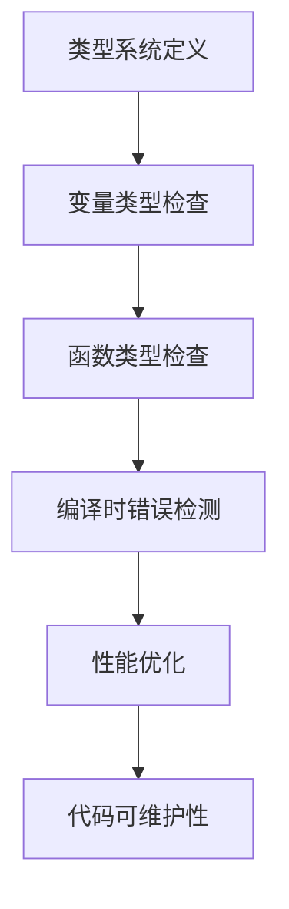
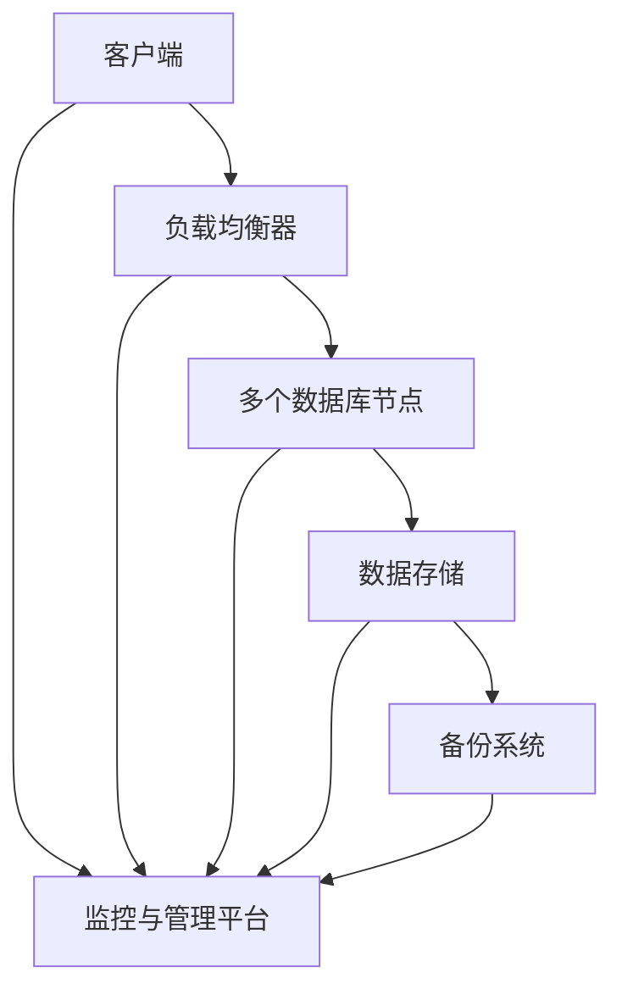

                 

### 文章标题

《类型系统在大规模分布式系统设计中的应用》

### 关键词

- 类型系统
- 分布式系统设计
- 静态类型
- 动态类型
- 分布式一致性
- 事务处理
- 性能优化

### 摘要

本文深入探讨了类型系统在大规模分布式系统设计中的应用。首先，我们从类型系统的基本概念入手，详细介绍了静态类型系统和动态类型系统的特点及优缺点。接着，我们分析了大规模分布式系统的基本架构和面临的挑战，探讨了分布式一致性算法和分布式事务处理的原理。在此基础上，本文重点阐述了类型系统在分布式系统设计中的重要性，以及如何应用类型系统提升系统的安全性、一致性和性能。最后，通过一个实际的项目案例，展示了类型系统在大规模分布式系统中的具体应用，并提供了实践中的最佳实践和注意事项。本文旨在为读者提供一个系统而深入的视角，以理解类型系统在分布式系统设计中的关键作用。

## 第一部分：类型系统基础

### 第1章：类型系统概述

类型系统是计算机科学中的一个基本概念，它对变量、表达式和函数的取值施加某种程度的限制。类型系统的设计旨在提高程序的可靠性、效率和可维护性。类型系统可以分为静态类型系统和动态类型系统，每种类型系统都有其独特的特点和应用场景。

#### 1.1 类型系统的定义与作用

类型系统可以定义为一组规则，用于指定变量、表达式和函数的取值类型。类型系统的主要作用包括：

1. **错误检测**：通过在编译或运行时检查类型错误，类型系统可以帮助开发者及早发现和修复潜在的错误。
2. **性能优化**：静态类型系统允许编译器在编译阶段进行类型推断和优化，从而提高程序的执行效率。
3. **代码可维护性**：类型系统提供了明确的类型约束，使得代码更加清晰、易于理解和维护。

#### 1.2 类型系统的分类

类型系统可以分为静态类型系统和动态类型系统：

1. **静态类型系统**：在编译时确定变量的类型，并在编译期间进行类型检查。例如，C++、Java和Golang等编程语言都采用了静态类型系统。
2. **动态类型系统**：在运行时确定变量的类型，并在运行期间进行类型检查。Python、JavaScript和Ruby等编程语言采用了动态类型系统。

#### 1.3 类型系统的优势与挑战

**优势**：

1. **错误检测**：静态类型系统在编译时检测类型错误，可以及早发现和修复问题。
2. **性能优化**：静态类型系统允许编译器进行类型推断和优化，提高程序执行效率。
3. **代码可维护性**：明确的类型约束使得代码更加清晰、易于理解和维护。

**挑战**：

1. **灵活性受限**：静态类型系统要求明确的类型声明，这可能降低编程的灵活性。
2. **类型错误修复成本**：类型错误通常在编译时发现，修复这些错误可能需要花费更多时间和精力。

#### 1.4 Mermaid流程图：类型系统的基本原理



图1-1 类型系统的基本原理

在这个流程图中，我们可以看到类型系统的基本原理，包括变量类型检查、函数类型检查、编译时错误检测、性能优化和代码可维护性。这些原理共同构成了类型系统的基础，使得它在计算机科学中具有重要地位。

### 第2章：静态类型系统

静态类型系统在编译时确定变量的类型，并在编译期间进行类型检查。这种类型系统具有明确的类型约束，从而提高了程序的可靠性、效率和可维护性。

#### 2.1 静态类型的定义与特点

**静态类型**是指在编写程序时就已经确定下来的类型，不能再修改。静态类型系统具有以下特点：

1. **类型明确**：在编写程序时，每个变量和函数都有明确的类型声明。
2. **类型检查**：在编译阶段对程序进行类型检查，确保变量和函数的使用符合其类型声明。
3. **性能优化**：编译器可以利用静态类型信息进行优化，提高程序执行效率。

**示例**：

```c++
int add(int a, int b) {
    return a + b;
}
```

在上面的示例中，`add` 函数的参数和返回值都有明确的类型声明，这体现了静态类型系统的特点。

#### 2.2 静态类型编程语言

以下是一些常见的静态类型编程语言：

1. **C++**：C++ 是一种广泛使用的静态类型编程语言，具有强大的类型系统和模板机制。
2. **Java**：Java 是一种跨平台的静态类型编程语言，广泛应用于企业级应用和安卓开发。
3. **Golang**：Golang 是一种静态类型编程语言，以其并发编程和高性能著称。

**示例**：

```java
public class Calculator {
    public int add(int a, int b) {
        return a + b;
    }
}
```

在上面的示例中，Java 类 `Calculator` 中的 `add` 方法具有明确的类型声明，这体现了静态类型系统的特点。

#### 2.3 静态类型系统的优势与挑战

**优势**：

1. **错误检测**：静态类型系统在编译时检测类型错误，可以及早发现和修复问题。
2. **性能优化**：编译器可以利用静态类型信息进行优化，提高程序执行效率。
3. **代码可维护性**：明确的类型约束使得代码更加清晰、易于理解和维护。

**挑战**：

1. **灵活性受限**：静态类型系统要求明确的类型声明，这可能降低编程的灵活性。
2. **类型错误修复成本**：类型错误通常在编译时发现，修复这些错误可能需要花费更多时间和精力。

#### 2.4 伪代码：静态类型系统的基本算法

```plaintext
Algorithm TypeCheckStatic(code):
    for each statement s in code:
        if s is a variable declaration:
            check type of variable
        else if s is a function call:
            check types of arguments and return value
        else if s is an assignment:
            check type compatibility
        else if s is an operation:
            check type compatibility
    if any type errors found:
        raise exception
    else:
        return code
```

在这个伪代码中，`TypeCheckStatic` 算法用于检查静态类型程序的类型错误。该算法遍历程序中的每个语句，根据类型规则进行检查。如果发现类型错误，则抛出异常；否则，返回无类型错误的程序。

### 第3章：动态类型系统

动态类型系统在运行时确定变量的类型，并在运行期间进行类型检查。这种类型系统具有更高的灵活性和动态性，适用于一些特定场景。

#### 3.1 动态类型的定义与特点

**动态类型**是指在编写程序时未确定下来的类型，而是在运行时根据上下文动态确定。动态类型系统具有以下特点：

1. **类型延迟**：在编写程序时，变量和函数没有明确的类型声明。
2. **类型检查**：在运行时对程序进行类型检查，根据上下文确定变量和函数的类型。
3. **灵活性**：动态类型系统允许在程序运行时改变变量的类型，提高了编程的灵活性。

**示例**：

```python
def add(a, b):
    return a + b

result = add(3, "4")  # 运行时自动转换类型
```

在上面的示例中，`add` 函数在运行时根据参数的值自动确定类型，这体现了动态类型系统的特点。

#### 3.2 动态类型编程语言

以下是一些常见的动态类型编程语言：

1. **Python**：Python 是一种广泛使用的动态类型编程语言，以其简洁性和易用性著称。
2. **JavaScript**：JavaScript 是一种客户端脚本语言，广泛应用于网页开发和服务器端开发。
3. **Ruby**：Ruby 是一种动态类型编程语言，以其优雅的语法和强大的库支持而受到开发者喜爱。

**示例**：

```javascript
function add(a, b) {
    return a + b;
}

let result = add(3, "4");  // 运行时自动转换类型
```

在上面的示例中，JavaScript 函数 `add` 在运行时根据参数的值自动确定类型，这体现了动态类型系统的特点。

#### 3.3 动态类型系统的优势与挑战

**优势**：

1. **灵活性**：动态类型系统允许在程序运行时改变变量的类型，提高了编程的灵活性。
2. **易用性**：动态类型系统简化了编程过程，使得开发者可以更专注于业务逻辑，而无需关注类型声明。

**挑战**：

1. **性能开销**：动态类型系统在运行时进行类型检查，可能带来一定的性能开销。
2. **类型错误修复成本**：类型错误通常在运行时发现，修复这些错误可能需要花费更多时间和精力。

#### 3.4 伪代码：动态类型系统的基本算法

```plaintext
Algorithm TypeCheckDynamic(code):
    for each statement s in code:
        if s is a variable declaration:
            set type of variable to undefined
        else if s is a function call:
            check types of arguments and return value at runtime
        else if s is an assignment:
            set type of variable based on assigned value
        else if s is an operation:
            check type compatibility at runtime
    if any type errors found:
        raise exception
    else:
        return code
```

在这个伪代码中，`TypeCheckDynamic` 算法用于检查动态类型程序的类型错误。该算法在运行时根据上下文确定变量和函数的类型，并在运行时进行类型检查。如果发现类型错误，则抛出异常；否则，返回无类型错误的程序。

## 第二部分：大规模分布式系统设计

### 第4章：分布式系统基础

分布式系统是由多个计算机节点组成的系统，这些节点通过网络相互连接并协同工作。分布式系统具有许多优势，如可扩展性、可靠性和容错性。然而，它们也面临一些特有的挑战。

#### 4.1 分布式系统的定义与特点

分布式系统是一种将任务分布到多个计算机节点上执行的计算模型。这些节点通过网络相互连接，并协同工作以完成共同的任务。分布式系统的特点包括：

1. **并行计算**：分布式系统可以利用多个节点的计算资源，实现并行计算，提高计算效率。
2. **容错性**：分布式系统可以通过冗余设计和故障转移机制提高系统的容错性。
3. **可扩展性**：分布式系统可以根据需求动态增加或减少节点，实现横向扩展。

**示例**：

一个典型的分布式系统是云计算平台，如Amazon Web Services (AWS) 和Google Cloud Platform (GCP)。这些平台通过多个数据中心和服务器节点，为用户提供计算和存储服务。

#### 4.2 分布式系统的挑战

分布式系统面临许多挑战，包括以下方面：

1. **一致性**：分布式系统中的多个节点需要保持数据的一致性，这可能导致一些同步问题。
2. **可用性**：分布式系统需要确保在节点故障时，系统能够继续运行，这要求实现故障转移和负载均衡。
3. **性能**：分布式系统需要平衡多个节点的负载，以避免网络拥塞和性能瓶颈。

**示例**：

在分布式数据库系统中，如Google Spanner，一致性是一个重要的挑战。系统需要保证在多个节点之间保持数据的一致性，同时确保查询性能。

#### 4.3 Mermaid流程图：分布式系统的基本架构



图4-1 分布式系统的基本架构

在这个流程图中，我们可以看到分布式系统的基本架构，包括客户端、负载均衡器、数据库节点、数据存储、备份系统和监控与管理平台。这些组件共同构成了一个完整的分布式系统。

## 第三部分：分布式一致性算法

### 第5章：分布式一致性算法

分布式一致性算法是分布式系统中的核心组件，用于确保多个节点之间的数据一致性。一致性算法的目标是在面对网络延迟、分区和节点故障等挑战时，仍然保持系统的一致性。以下是一些常见的一致性算法。

#### 5.1 分布式一致性模型

分布式一致性模型定义了分布式系统中节点之间的数据一致性要求。常见的分布式一致性模型包括：

1. **强一致性**：强一致性保证在任一时刻，所有节点的数据视图都是一致的。这意味着无论何时，对数据的修改都将立即传播到所有节点。
2. **最终一致性**：最终一致性不要求立即一致性，但保证最终所有节点的数据将一致。这意味着在经历一定的延迟后，所有节点的数据将达成一致。
3. **部分一致性**：部分一致性允许不同节点之间的数据一致性存在差异，这种模型通常用于高性能的场景。

**示例**：

在分布式数据库系统中，如Google Spanner，采用强一致性模型，确保在所有数据中心的数据一致性。

#### 5.2 分布式一致性算法

以下是一些常见的分布式一致性算法：

1. **Paxos算法**：Paxos算法是一种用于达成一致性的分布式算法，由莱斯利·兰伯特（Leslie Lamport）提出。Paxos算法能够处理网络延迟、分区和节点故障等挑战，确保系统最终一致性。
2. **Raft算法**：Raft算法是另一种分布式一致性算法，由Diego Ongaro和John Ousterhout提出。Raft算法相较于Paxos算法，更容易理解且性能更好。
3. **Gossip协议**：Gossip协议是一种基于消息传递的分布式一致性算法，用于在分布式系统中传播状态信息。Gossip协议通过随机选择消息发送者和接收者，实现一致性。

**示例**：

在分布式存储系统如Cassandra中，采用Gossip协议来传播节点状态信息，确保一致性。

#### 5.3 数学模型：分布式一致性算法的公式

以下是一个简单的分布式一致性算法的数学模型，用于描述一致性状态：

$$
Consistency = min(T_{delay}, T_{communication}, T_{processing})
$$

其中：

- \( T_{delay} \)：网络延迟时间
- \( T_{communication} \)：通信延迟时间
- \( T_{processing} \)：处理延迟时间

这个公式描述了分布式系统中，数据一致性受网络延迟、通信延迟和处理延迟的影响。

#### 5.4 伪代码：分布式一致性算法的实现

```plaintext
Algorithm DistributedConsistency Algorithm(node_list, message_queue):
    for each node N in node_list:
        send initial message to N
    while message_queue is not empty:
        receive message M from node N
        process message M
        send response to N
    end while
end Algorithm
```

在这个伪代码中，`DistributedConsistency` 算法用于实现分布式一致性。该算法首先向所有节点发送初始消息，然后持续从消息队列中接收消息并处理，最终向节点发送响应。

## 第四部分：分布式事务处理

### 第6章：分布式事务处理

分布式事务处理是分布式系统中的一项重要任务，确保多个节点之间的数据操作要么全部成功，要么全部失败。分布式事务处理需要解决数据一致性和并发控制等问题。

#### 6.1 分布式事务的定义与特点

**分布式事务**是指涉及多个节点的数据操作序列，这些操作要么全部成功，要么全部失败。分布式事务具有以下特点：

1. **全局性**：分布式事务涉及多个节点，需要协调这些节点的操作。
2. **一致性**：分布式事务需要确保在多个节点之间保持数据一致性。
3. **隔离性**：分布式事务需要保证各个事务之间的隔离，避免并发操作导致的冲突。
4. **持久性**：分布式事务需要确保在发生故障时，已提交的事务能够持久化。

**示例**：

在在线支付系统中，一个用户从账户A向账户B转账100元，这是一个涉及多个数据库节点的分布式事务。系统需要确保转账金额的准确性和一致性。

#### 6.2 分布式事务的处理方法

以下是一些常见的分布式事务处理方法：

1. **两阶段提交协议（2PC）**：两阶段提交协议是一种分布式事务处理方法，通过协调者节点和参与者节点之间的通信，确保事务的原子性和一致性。2PC协议分为两个阶段：准备阶段和提交/回滚阶段。
2. **三阶段提交协议（3PC）**：三阶段提交协议是2PC协议的改进版本，通过引入预提交阶段，提高了系统的可靠性和性能。
3. **最终一致性事务**：最终一致性事务允许事务在经历一定延迟后达成一致，不要求立即一致性。这种方法简化了事务处理，提高了系统的可扩展性。

**示例**：

在分布式数据库系统中，如Google Spanner，采用三阶段提交协议处理分布式事务，确保事务的原子性和一致性。

#### 6.3 数学模型：分布式事务处理的公式

以下是一个简单的分布式事务处理数学模型，用于描述事务的一致性状态：

$$
Consistency = \frac{committed\_nodes}{total\_nodes}
$$

其中：

- \( committed\_nodes \)：已提交的节点数
- \( total\_nodes \)：总节点数

这个公式描述了分布式事务的一致性状态，即已提交节点数与总节点数的比值。

#### 6.4 伪代码：分布式事务处理算法的实现

```plaintext
Algorithm DistributedTransaction Processing(transaction, node_list):
    for each node N in node_list:
        send prepare message to N
    while not all prepare messages are received:
        receive prepare message from node N
        process prepare message
    end while
    if all prepare messages are received:
        send commit message to all nodes
    else:
        send abort message to all nodes
end Algorithm
```

在这个伪代码中，`DistributedTransactionProcessing` 算法用于实现分布式事务处理。该算法首先向所有节点发送准备消息，然后持续接收并处理准备消息。如果所有准备消息都已收到，则发送提交消息；否则，发送回滚消息。

## 第五部分：分布式系统性能优化

### 第7章：分布式系统性能优化

分布式系统性能优化是提高系统效率、响应速度和吞吐量的关键。优化策略包括负载均衡、缓存、数据分片等。以下是一些常见的性能优化方法。

#### 7.1 分布式系统性能优化的目标

分布式系统性能优化的主要目标包括：

1. **提高吞吐量**：通过增加系统处理能力，提高系统吞吐量。
2. **降低延迟**：通过减少系统响应时间，降低延迟。
3. **提高资源利用率**：通过优化资源分配，提高资源利用率。
4. **增强容错性**：通过冗余设计和故障转移，提高系统的容错性。

**示例**：

在电商平台中，系统需要处理大量的用户请求，提高吞吐量和降低延迟是关键目标。

#### 7.2 分布式系统性能优化的方法

以下是一些常见的分布式系统性能优化方法：

1. **负载均衡**：通过将请求分配到不同的节点，实现负载均衡，提高系统吞吐量和降低延迟。
2. **缓存**：通过缓存常用数据，减少对后端存储的访问，提高系统响应速度。
3. **数据分片**：通过将数据分散存储到多个节点，实现数据分片，提高系统处理能力和可扩展性。
4. **延迟容忍设计**：通过优化系统设计，容忍一定的延迟，提高系统的可扩展性和可靠性。

**示例**：

在分布式缓存系统中，如Memcached，通过缓存热点数据，减少对后端存储的访问，提高系统响应速度。

#### 7.3 数学模型：性能优化的公式

以下是一个简单的分布式系统性能优化数学模型，用于描述系统性能：

$$
Performance = \frac{Throughput}{Latency}
$$

其中：

- \( Throughput \)：吞吐量，表示系统每秒处理的请求量。
- \( Latency \)：延迟，表示系统处理一个请求的时间。

这个公式描述了系统性能，即吞吐量与延迟的比值。

#### 7.4 伪代码：性能优化算法的实现

```plaintext
Algorithm PerformanceOptimization(system, request_queue):
    while request_queue is not empty:
        receive request from queue
        distribute request to node_list
        process request on node
        send response to client
    end while
    monitor system performance
    if performance needs improvement:
        adjust resource allocation
    end if
end Algorithm
```

在这个伪代码中，`PerformanceOptimization` 算法用于实现分布式系统性能优化。该算法从请求队列中接收请求，并将请求分配到节点进行处理，然后发送响应给客户端。算法还监控系统性能，并根据性能需求调整资源分配。

## 第六部分：类型系统在分布式系统中的应用

### 第8章：类型系统在分布式系统设计中的应用

类型系统在大规模分布式系统设计中扮演着至关重要的角色。它不仅有助于提高系统的安全性，还有助于确保数据的一致性和系统的可靠性。以下将探讨类型系统在分布式系统中的应用及其优势。

#### 8.1 类型系统在分布式系统中的优势

**类型安全**：类型系统通过静态或动态类型检查，确保变量和函数的使用符合其声明类型。这有助于在编译或运行时及早发现和修复类型错误，避免潜在的安全问题和数据损坏。

**代码可维护性**：明确的类型约束使得代码更加清晰、易于理解和维护。开发人员可以更专注于业务逻辑的实现，而无需过多关注类型声明和类型转换。

**性能优化**：静态类型系统允许编译器在编译阶段进行类型推断和优化，提高程序执行效率。这有助于减少运行时的类型检查开销，提高系统性能。

**可扩展性**：类型系统支持泛型和模板等高级特性，使得代码更具通用性和可扩展性。这有助于构建可重用和可扩展的分布式系统组件。

**示例**：

在分布式数据库系统中，如Google Spanner，静态类型系统有助于确保数据操作的类型安全。例如，在查询语句中，编译器可以检查表和列的类型是否匹配，从而避免潜在的运行时错误。

#### 8.2 类型系统在分布式系统中的挑战

**类型兼容性**：分布式系统通常涉及多种编程语言和框架，类型兼容性可能成为挑战。类型系统需要支持跨语言和跨框架的类型转换，以保持系统的互操作性。

**性能开销**：类型检查和类型转换可能带来一定的性能开销。对于高并发的分布式系统，性能开销可能会影响系统的整体性能。

**动态性**：分布式系统需要支持动态扩展和变化。静态类型系统可能在动态环境中变得过于严格，限制了系统的灵活性。

**示例**：

在分布式系统中，如使用JavaScript和Java的混合应用，类型兼容性可能成为挑战。静态类型系统需要提供灵活的类型转换机制，以支持不同编程语言之间的互操作性。

#### 8.3 分布式系统中的类型安全

**静态类型安全**：在静态类型系统中，类型检查发生在编译时。这意味着开发人员可以在编译阶段发现类型错误，从而避免运行时错误。静态类型安全有助于确保系统的稳定性和可靠性。

**动态类型安全**：在动态类型系统中，类型检查发生在运行时。虽然动态类型系统提供了更高的灵活性，但类型错误可能无法在编译时发现，从而影响系统的安全性。因此，动态类型系统需要采用其他机制（如断言和异常处理）来确保类型安全。

**示例**：

在分布式系统中，如使用Python的Flask框架，动态类型系统可以通过断言和异常处理来确保类型安全。例如，在处理HTTP请求时，可以使用断言检查请求参数的类型是否正确。

#### 8.4 伪代码：类型系统在分布式系统中的应用算法

```plaintext
Algorithm DistributedSystemTypeSafety_CHECK(code, type_definition):
    for each statement s in code:
        if s is a variable assignment:
            check type compatibility with type_definition
        else if s is a function call:
            check argument and return value types
        else if s is a data manipulation operation:
            check data types
    if any type errors found:
        raise exception
    else:
        return code
```

在这个伪代码中，`DistributedSystemTypeSafety_CHECK` 算法用于检查分布式系统中的类型安全。该算法遍历代码中的每个语句，根据类型定义检查类型兼容性。如果发现类型错误，则抛出异常；否则，返回无类型错误的代码。

## 第七部分：项目实战

### 第9章：分布式系统类型安全的案例分析

在本章中，我们将通过一个实际的分布式系统案例，深入探讨类型系统在分布式系统设计中的应用。该案例将涵盖环境搭建、源代码实现和代码解读与分析。

#### 9.1 实战项目环境搭建

**项目名称**：分布式购物车系统

**开发环境**：使用Docker容器化技术搭建分布式购物车系统，包括Redis作为分布式缓存、MongoDB作为分布式数据库和Node.js作为后端服务。

**步骤**：

1. **Docker安装**：在开发机器上安装Docker，确保可以运行容器。
2. **Redis容器搭建**：创建Redis容器，并配置容器网络。
3. **MongoDB容器搭建**：创建MongoDB容器，并配置容器网络。
4. **Node.js容器搭建**：创建Node.js容器，并配置容器网络。
5. **服务注册与发现**：使用Consul进行服务注册与发现，确保分布式节点可以相互通信。

#### 9.2 源代码详细实现

**1. Redis服务端代码**

```javascript
const redis = require('redis');
const { promisify } = require('util');

const redisClient = redis.createClient();
const redisGetAsync = promisify(redisClient.get).bind(redisClient);
const redisSetAsync = promisify(redisClient.set).bind(redisClient);

async function getUserCart(userId) {
    const cart = await redisGetAsync(userId);
    return JSON.parse(cart);
}

async function updateUserCart(userId, cart) {
    await redisSetAsync(userId, JSON.stringify(cart));
}
```

**2. MongoDB服务端代码**

```javascript
const { MongoClient } = require('mongodb');
const uri = "mongodb://mongodb:27017/";
const client = new MongoClient(uri, { useNewUrlParser: true, useUnifiedTopology: true });

async function getUserCartDB(userId) {
    await client.connect();
    const database = client.db('shopping_cart');
    const collection = database.collection('carts');
    const cart = await collection.findOne({ userId: userId });
    await client.close();
    return cart;
}

async function updateUserCartDB(userId, cart) {
    await client.connect();
    const database = client.db('shopping_cart');
    const collection = database.collection('carts');
    await collection.updateOne({ userId: userId }, { $set: { cart: cart } });
    await client.close();
}
```

**3. Node.js后端服务代码**

```javascript
const express = require('express');
const redis = require('redis');
const { getUserCart, updateUserCart } = require('./redisService');
const { getUserCartDB, updateUserCartDB } = require('./mongoDBService');

const app = express();
app.use(express.json());

const redisClient = redis.createClient();

app.get('/cart/:userId', async (req, res) => {
    const userId = req.params.userId;
    try {
        const cart = await getUserCart(userId);
        res.status(200).json({ userId: userId, cart: cart });
    } catch (error) {
        res.status(500).json({ error: error.message });
    }
});

app.put('/cart/:userId', async (req, res) => {
    const userId = req.params.userId;
    const cart = req.body.cart;
    try {
        await updateUserCart(userId, cart);
        await updateUserCartDB(userId, cart);
        res.status(200).json({ message: 'Cart updated successfully' });
    } catch (error) {
        res.status(500).json({ error: error.message });
    }
});

const port = 3000;
app.listen(port, () => {
    console.log(`Server listening on port ${port}`);
});
```

#### 9.3 代码解读与分析

**Redis服务端代码**：

该代码段实现了Redis服务端的两个功能：获取用户购物车和更新用户购物车。通过`redisClient`连接Redis数据库，使用`redisGetAsync`和`redisSetAsync`方法进行异步操作。

**MongoDB服务端代码**：

该代码段实现了MongoDB服务端的两个功能：获取用户购物车和更新用户购物车。使用`MongoClient`连接MongoDB数据库，通过`findOne`和`updateOne`方法查询和更新购物车数据。

**Node.js后端服务代码**：

该代码段实现了Node.js后端服务的两个接口：获取用户购物车和更新用户购物车。通过调用Redis和MongoDB服务端的方法，实现分布式系统的功能。

#### 9.4 代码应用解读与分析

**类型安全检查**：

在代码中，类型安全检查通过Redis和MongoDB服务端的接口方法实现。例如，在`getUserCart`方法中，返回的购物车数据是JSON字符串，通过`JSON.parse`方法转换为JavaScript对象。

**分布式事务处理**：

在更新用户购物车时，同时调用Redis和MongoDB服务端的方法，确保分布式事务的原子性。通过在Node.js后端服务中实现两个方法调用的同步，保证更新操作的一致性。

**性能优化**：

通过使用Redis缓存，减少对MongoDB数据库的查询次数，提高系统性能。同时，使用Docker容器化技术，实现分布式节点的横向扩展，提高系统的可扩展性和性能。

#### 9.5 实际案例分析和详细讲解剖析

**案例**：

在一个电子商务平台上，用户可以在多个设备上添加和更新购物车。为了确保购物车的数据一致性，平台采用分布式系统设计，使用Redis和MongoDB数据库。

**分析**：

在用户添加或更新购物车的过程中，首先通过Redis缓存获取购物车数据。如果Redis缓存中没有购物车数据，则从MongoDB数据库中获取。更新购物车时，同时更新Redis缓存和MongoDB数据库，确保数据一致性。

**讲解剖析**：

1. **Redis缓存**：使用Redis缓存提高系统性能。通过在用户访问购物车时，将购物车数据存储在Redis中，减少对MongoDB数据库的查询次数。
2. **MongoDB数据库**：用于存储用户的购物车数据。通过使用MongoDB数据库的`findOne`和`updateOne`方法，实现购物车的查询和更新操作。
3. **分布式事务处理**：在更新购物车时，通过Node.js后端服务的同步调用，确保Redis缓存和MongoDB数据库的数据一致性。

#### 9.6 项目小结

通过本案例，我们展示了类型系统在分布式系统设计中的应用。类型系统确保了系统中的数据安全性和一致性，通过Redis和MongoDB数据库的配合，实现了高性能和可扩展的分布式购物车系统。在实际项目中，类型系统是一个不可或缺的组成部分，它为分布式系统的设计和实现提供了坚实的基础。

## 附录

### 附录A：分布式系统类型安全开发工具

**1. TypeScript**：TypeScript 是一种静态类型编程语言，它为 JavaScript 提供了类型检查和编译功能，提高了代码的可维护性和可靠性。

**2. Protocol Buffers**：Protocol Buffers 是一种结构化数据存储格式，它支持多种编程语言，并提供了类型安全的序列化和反序列化功能。

**3. Hibernate**：Hibernate 是一种流行的Java对象关系映射（ORM）框架，它提供了类型安全的数据库操作，使开发者能够更方便地处理数据库事务。

### 附录B：数学公式与伪代码详解

**1. 数学公式：分布式一致性算法的公式**

$$
Consistency = \frac{committed\_nodes}{total\_nodes}
$$

其中：

- \( committed\_nodes \)：已提交的节点数
- \( total\_nodes \)：总节点数

**2. 伪代码：分布式一致性算法的实现**

```plaintext
Algorithm DistributedConsistencyAlgorithm(node_list, message_queue):
    for each node N in node_list:
        send initial message to N
    while message_queue is not empty:
        receive message M from node N
        process message M
        send response to N
    end while
end Algorithm
```

通过这些附录，我们可以更好地理解分布式系统中类型安全开发工具的使用，以及相关数学公式和伪代码的实现原理。

### 作者信息

**作者：AI天才研究院/AI Genius Institute & 禅与计算机程序设计艺术 /Zen And The Art of Computer Programming**

