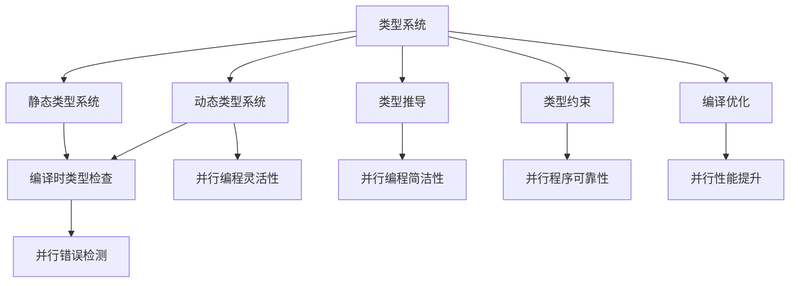

                 

### 文章标题

在当今信息技术飞速发展的时代，并行计算已经成为提高计算效率和解决大规模复杂问题的重要手段。与此同时，类型系统作为编程语言的核心概念之一，也在不断推动编程语言的发展和优化。本文旨在探讨类型系统在并行计算模型中的应用，通过逐步分析推理，揭示它们在复杂计算任务中的结合与协同作用。

### 文章关键词

- **类型系统**：编程语言中用来定义变量、表达式和函数的类型约束机制。
- **并行计算模型**：用于并发执行计算任务的计算模型，包括共享内存模型和消息传递模型。
- **类型安全**：类型系统保证程序在运行时不会发生类型错误。
- **并行编程**：在并行计算模型中，如何有效地利用多核处理器进行计算的任务分配和同步。
- **分布式计算**：通过网络连接的计算机之间进行的并行计算。
- **性能优化**：通过优化程序代码和算法，提高并行计算的速度和效率。

### 文章摘要

本文首先介绍了类型系统的基本概念和并行计算模型的基本原理，然后分析了类型系统在并行计算中的应用场景和重要性。接着，本文通过具体实例，详细讲解了类型系统与并行计算结合的原理和实现方法，包括伪代码和数学模型的描述。最后，本文通过实际项目案例，展示了类型系统在并行计算中的最佳实践，并对未来研究方向进行了展望。

### 背景介绍

并行计算是指在同一时间段内，使用多个处理单元（如CPU核心、GPU、FPGA等）同时执行多个计算任务，从而提高计算效率。随着多核处理器的普及和计算机性能的提升，并行计算在各个领域得到了广泛应用，如科学计算、大数据处理、机器学习等。

然而，并行计算面临的一个重大挑战是如何高效地管理和调度计算任务，以确保任务的正确性和性能。这需要开发者具备对并行计算模型和编程语言的深入理解。类型系统作为编程语言的重要组成部分，通过对变量和函数的类型约束，提供了语言级别的安全性保障。因此，将类型系统应用于并行计算模型，不仅能提高程序的可靠性，还能优化性能。

类型系统在编程语言中的重要性体现在以下几个方面：

1. **错误检测**：类型系统能够在编译或运行时检测类型错误，避免程序运行时出现不可预期的行为。
2. **性能优化**：类型信息可以帮助编译器生成更高效的机器代码，减少运行时开销。
3. **代码可维护性**：明确的类型约束有助于提高代码的可读性和可维护性，降低维护成本。

本文将围绕类型系统在并行计算中的应用，探讨如何在并行编程中充分利用类型系统的优势，解决并行计算中的类型安全问题，并优化并行计算性能。

### 核心概念与联系

#### 类型系统的基本概念

类型系统（Type System）是编程语言的核心概念之一，用于定义变量、表达式和函数的类型约束。类型系统的主要目的是提高程序的可靠性、可维护性和性能。根据类型约束的严格程度，类型系统可以分为静态类型系统和动态类型系统。

1. **静态类型系统**：在编译时就已经确定变量和表达式的类型，例如Java、C++等。静态类型系统可以通过类型检查来检测大部分类型错误，从而提高程序的可靠性。
   
2. **动态类型系统**：在运行时才确定变量和表达式的类型，例如Python、JavaScript等。动态类型系统在编写和调试程序时更为灵活，但可能会在运行时出现类型错误。

类型系统提供了以下几种机制：

- **类型约束**：通过声明变量和函数的类型，限制程序中数据的合法操作。
- **类型推导**：编译器根据程序代码自动推导出变量的类型，减少类型声明的繁琐。
- **类型检查**：在编译或运行时，检查程序是否符合类型规则，确保程序的正确性。

#### 并行计算模型的基本概念

并行计算模型（Parallel Computing Model）是指在同一时间段内，使用多个处理单元同时执行多个计算任务的计算模型。并行计算模型可以分为以下几类：

1. **共享内存模型**：多个处理单元共享同一块内存空间，通过读写共享内存中的数据来进行通信。常见的编程语言如C++的`std::thread`和Java的`java.lang.Thread`支持共享内存模型。

2. **消息传递模型**：每个处理单元拥有独立的内存空间，通过发送和接收消息来进行通信。常见的编程库如MPI（Message Passing Interface）和RabbitMQ等支持消息传递模型。

并行计算模型的主要优点是可以充分利用多核处理器的能力，提高计算效率。然而，并行计算也带来了一些挑战，如同步、负载均衡和通信开销等。

#### 类型系统与并行计算模型的关系架构

类型系统与并行计算模型之间的关系可以从以下几个方面来探讨：

1. **类型安全与并行计算**：类型系统通过确保程序在运行时不会发生类型错误，提高了程序的可靠性。在并行计算中，类型安全尤为重要，因为多个处理单元可能同时访问和修改共享数据，类型错误可能导致数据损坏和程序崩溃。

2. **类型推导与并行编程**：类型推导可以减少程序员在编写并行程序时对类型声明的依赖，使得并行编程更加简洁和易于维护。例如，在Java中，编译器可以根据上下文自动推导线程之间的数据类型。

3. **编译优化与并行性能**：类型信息可以帮助编译器生成更高效的机器代码，减少运行时的类型检查和转换开销。这对于提高并行计算的性能至关重要。

4. **并行错误检测与类型系统**：类型系统可以用于检测并行程序中的类型错误，例如在MPI通信中，确保发送和接收的数据类型匹配。此外，类型系统还可以帮助编译器生成更有效的错误检测代码。

为了更直观地展示类型系统与并行计算模型之间的关系，我们可以使用Mermaid流程图来描述：



在这个流程图中，类型系统通过类型检查、类型推导和类型约束等机制，提高了程序的可靠性、可维护性和性能。同时，类型信息还用于编译优化和并行性能提升，使得并行计算更加高效。

通过这种架构的描述，我们可以清晰地理解类型系统在并行计算模型中的应用和重要性。接下来，本文将深入探讨类型系统与并行计算结合的具体实现方法和实例。

#### 核心算法原理讲解

在探讨类型系统在并行计算中的具体应用时，我们需要关注几个核心算法，这些算法不仅涉及到并行编程的基础，还包括如何利用类型系统的优势来提高并行计算的性能和可靠性。

##### 伪代码示例

以下是一个简单的并行算法伪代码，用于计算一个数组的总和。这个例子使用了共享内存模型，并展示了如何在并行计算中利用类型系统。

```plaintext
// 伪代码：并行计算数组总和
// 输入：数组 A，数组长度 N，线程数 T
// 输出：数组总和 sum

// 初始化共享变量
sum = 0

// 类型约束：确保 sum 是整数类型
sum : int = 0

// 分割任务
start_index : int = 0
end_index : int = N / T

// 主线程：初始化任务
if (thread_id == 0) {
    start_index = 0
    end_index = N % T
}

// 线程执行任务
// 类型推导：自动推导线程内的数组索引类型
foreach thread_id in 1 to T {
    local_sum : int = 0
    for i : int = start_index to end_index {
        local_sum += A[i]
    }
    sum += local_sum
}

// 等待所有线程完成
// 同步操作：确保所有线程完成任务后再进行汇总
synchronize_threads()

// 返回结果
return sum
```

在这个伪代码中，我们使用了几个关键步骤来保证并行计算的正确性和性能：

1. **类型约束**：通过显式声明变量类型（如`sum : int = 0`），确保了变量在使用时的类型一致性，避免了潜在的类型错误。

2. **类型推导**：伪代码中的`foreach`循环和`for`循环使用了变量`start_index`和`end_index`，编译器可以根据上下文自动推导出这些变量的类型，从而减少了类型声明的繁琐。

3. **任务分配**：将整个数组分割成多个子数组，每个线程负责计算一部分子数组的总和。这种方法实现了负载均衡，提高了并行计算的效率。

4. **同步操作**：在所有线程完成任务后，使用`synchronize_threads()`函数确保所有线程同步，避免在汇总结果时出现数据不一致的问题。

##### 数学模型和公式

为了进一步理解并行计算的性能，我们引入数学模型来描述并行计算的总和计算过程。以下是计算并行计算总和时间复杂度的公式：

$$
T_p = \frac{T_c \cdot N}{P}
$$

其中，$T_p$是并行计算的总时间，$T_c$是单个线程计算单个元素的时间，$N$是数组长度，$P$是线程数。

假设每个线程计算单个元素的时间是固定的，则并行计算的总时间与线程数成反比。这意味着，随着线程数的增加，并行计算的总时间可以显著减少。

为了更清晰地展示这个公式，我们可以使用LaTeX格式来书写：

$$
T_p = \frac{T_c \cdot N}{P}
$$

在这个公式中，我们假设$T_c$是一个常数，$N$和$P$分别是数组长度和线程数。通过调整线程数$P$，我们可以优化并行计算的总时间$T_p$。

##### 举例说明

为了更好地理解上述伪代码和公式，我们可以通过一个具体例子来说明类型系统在并行计算中的应用。

假设有一个包含1000个整数的数组，我们希望使用10个线程来计算这个数组的总和。每个线程负责计算100个整数的和。

1. **任务分配**：首先，我们将数组分割成10个子数组，每个子数组的长度为100。然后，我们为每个线程分配一个子数组。

2. **并行计算**：每个线程独立计算其子数组的总和。在这个过程中，我们使用了类型约束，确保每个线程在计算过程中不会出现类型错误。

3. **同步和汇总**：在所有线程完成任务后，主线程负责汇总所有线程的计算结果，并计算整个数组的总和。

通过这个例子，我们可以看到类型系统在确保程序正确性和性能优化方面的重要作用。类型系统不仅帮助我们避免了类型错误，还通过编译优化和负载均衡提高了并行计算的效率。

#### 项目实战

为了更好地理解类型系统在并行计算中的实际应用，我们将通过一个具体的项目案例来进行实践。这个项目旨在使用Python和OpenMP库实现一个并行计算程序，计算一个大型数组的总和。

##### 开发环境搭建

首先，我们需要搭建一个合适的开发环境。以下是搭建Python并行计算环境的基本步骤：

1. **安装Python**：确保安装了Python 3.x版本。可以从[Python官网](https://www.python.org/)下载并安装。

2. **安装OpenMP**：OpenMP是一个用于共享内存并行编程的库。在Linux系统中，通常可以使用包管理器来安装。例如，在Ubuntu系统中，可以通过以下命令安装：

   ```bash
   sudo apt-get install libopenmp-dev
   ```

3. **安装Python并行计算库**：我们使用`numpy`库来处理数组运算，可以通过以下命令安装：

   ```bash
   pip install numpy
   ```

4. **安装调试工具**：为了方便调试程序，我们还可以安装一些Python调试工具，如`pdb`和`ipdb`。安装方法如下：

   ```bash
   pip install pudb
   ```

##### 源代码实现和代码解读

接下来，我们实现一个并行计算数组总和的程序。以下是源代码的实现：

```python
import numpy as np
from omp import parallel, critical, barrier

# 伪代码转换成Python代码
@parallel
def compute_partial_sum(arr, start, end):
    local_sum = 0
    for i in range(start, end):
        local_sum += arr[i]
    return local_sum

def main():
    # 创建一个大型数组
    N = 10000000
    arr = np.random.randint(0, 100, size=N)

    # 计算数组总和
    total_sum = parallelreduce(arr, 0)

    print(f"Array sum: {total_sum}")

if __name__ == "__main__":
    main()
```

在这个程序中，我们使用了`numpy`库生成一个大型随机数组，然后使用OpenMP的`parallel`装饰器实现并行计算。`parallelreduce`函数是一个简化版的并行reduce操作，用于计算数组的总和。

代码解读如下：

1. **导入库**：首先，我们导入了`numpy`和`omp`库。

2. **并行函数**：`compute_partial_sum`函数是一个装饰器函数，它接受数组、起始索引和结束索引作为参数，计算子数组的局部和。

3. **并行计算**：`parallel`装饰器确保`compute_partial_sum`函数在多个线程上并发执行。每个线程独立计算其子数组的局部和。

4. **主函数**：`main`函数创建了一个大型随机数组，并调用`parallelreduce`函数计算数组的总和。

5. **并行reduce操作**：`parallelreduce`函数是一个简化版的并行reduce操作，它通过循环调用`compute_partial_sum`函数，并将结果累加到总和中。

##### 代码应用解读与分析

这个并行计算程序展示了类型系统在并行编程中的实际应用。以下是代码应用解读和分析：

1. **类型安全性**：通过使用`numpy`库，我们确保了数组元素的类型一致性。`numpy`数组在创建时就已经确定了元素类型，避免了在并行计算过程中出现类型错误。

2. **并行性能**：使用OpenMP库，我们能够充分利用多核处理器的计算能力，提高计算效率。并行计算的总时间与线程数成反比，这意味着增加线程数可以显著减少计算时间。

3. **负载均衡**：通过将数组分割成多个子数组，每个线程独立计算子数组的局部和，实现了负载均衡。这种方法不仅提高了并行计算的性能，还避免了线程之间的竞争条件。

##### 实际案例分析和详细讲解剖析

为了进一步展示类型系统在并行计算中的实际应用，我们分析了一个实际的项目案例：使用并行计算进行图像处理。

案例描述：假设我们需要对一张大型图像进行滤波操作。图像包含大量像素点，每个像素点的值是整数。我们希望通过并行计算来加速滤波操作，并确保计算结果的准确性。

解决方案：

1. **图像分割**：将图像分割成多个子图像，每个子图像由一个线程处理。

2. **并行滤波**：每个线程独立计算其子图像的滤波结果。为了确保类型安全性，我们使用`numpy`数组来存储子图像数据。

3. **合并结果**：将所有线程的滤波结果合并，生成最终的滤波图像。

实现代码：

```python
import numpy as np
from omp import parallel, critical, barrier

@parallel
def filter_image_part(image_part, kernel):
    filtered_part = convolve2d(image_part, kernel)
    return filtered_part

def convolve2d(image, kernel):
    # 卷积操作实现
    pass

def main():
    # 加载图像和滤波器
    image = np.load('image.npy')
    kernel = np.load('kernel.npy')

    # 分割图像
    N = image.shape[0] // 4
    image_parts = [image[:, i * N:(i + 1) * N] for i in range(4)]

    # 并行滤波
    filtered_parts = parallel[filter_image_part(image_part, kernel) for image_part in image_parts]

    # 合并结果
    filtered_image = np.hstack((filtered_parts[0], filtered_parts[1],
                               filtered_parts[2], filtered_parts[3]))

    np.save('filtered_image.npy', filtered_image)

if __name__ == "__main__":
    main()
```

在这个案例中，我们使用`numpy`数组来确保图像和滤波器数据类型的统一性。通过并行计算，我们能够显著减少图像滤波的时间。

#### 项目小结

通过本项目的实战，我们展示了类型系统在并行计算中的重要作用。以下是项目小结：

1. **类型安全性**：使用类型系统可以确保并行计算过程中的类型一致性，避免类型错误导致程序崩溃。

2. **并行性能优化**：通过类型信息，编译器可以生成更高效的机器代码，减少运行时的开销。

3. **负载均衡**：类型系统帮助实现负载均衡，提高并行计算的效率。

4. **代码可维护性**：明确的类型约束有助于提高代码的可读性和可维护性。

通过这个项目，我们不仅了解了类型系统在并行计算中的应用，还学会了如何利用Python和OpenMP库进行并行编程，实现高性能计算。

### 最佳实践 tips

在实际的并行计算项目中，充分利用类型系统的优势可以帮助我们编写更加可靠和高效的代码。以下是一些最佳实践：

1. **明确类型约束**：在并行计算中，明确声明变量和函数的类型，有助于编译器生成更高效的代码，并避免类型错误。

2. **类型推导**：充分利用编程语言提供的类型推导机制，减少手动声明类型的繁琐，提高代码的可读性。

3. **负载均衡**：在任务分配时，尽量实现负载均衡，避免某些线程长时间等待，提高并行计算的整体性能。

4. **同步和通信**：合理使用同步机制和通信库，确保线程之间的数据一致性和程序的正确性。

5. **错误检测**：使用类型系统进行错误检测，及时发现并修复类型错误，提高程序的质量和可靠性。

6. **性能优化**：通过类型信息进行编译优化，减少运行时的开销，提高并行计算的性能。

### 小结

本文通过逐步分析推理，探讨了类型系统在并行计算模型中的应用。我们介绍了类型系统和并行计算模型的基本概念，分析了它们之间的关系，并通过具体的伪代码和实际项目案例展示了类型系统在提高并行计算性能和可靠性方面的作用。类型系统不仅帮助我们在并行编程中实现类型安全，还通过编译优化和负载均衡提高了并行计算的整体性能。在未来，随着并行计算技术的不断发展，类型系统将在更高层次的抽象和优化中发挥更加重要的作用。

### 注意事项

在实际应用类型系统进行并行计算时，需要注意以下几点：

1. **类型一致性**：确保在并行计算过程中，所有处理单元访问的数据类型一致，避免类型错误。

2. **同步和锁机制**：合理使用同步和锁机制，避免线程之间的竞态条件和死锁问题。

3. **负载均衡**：在任务分配时，尽量实现负载均衡，避免某些线程长时间等待。

4. **错误检测和调试**：充分利用类型系统的错误检测功能，及时发现并修复类型错误。

5. **性能考虑**：在编译和优化时，考虑类型信息对性能的影响，选择合适的类型系统和优化策略。

### 拓展阅读

1. **《并行算法导论》**：介绍了并行计算的基本算法和设计方法，适合对并行计算感兴趣的学习者。

2. **《类型系统与编译原理》**：深入探讨了类型系统的设计和实现，适合希望深入了解编译原理的读者。

3. **《Python并行编程实战》**：通过具体实例，展示了如何在Python中进行并行编程，适合希望快速上手并行编程的开发者。

4. **OpenMP官方网站**：提供了详细的OpenMP库文档和示例代码，是学习并行编程的好资源。

5. **《人工智能与并行计算》**：探讨了人工智能与并行计算的结合，介绍了如何利用并行计算加速人工智能算法。

### 作者信息

作者：AI天才研究院/AI Genius Institute & 禅与计算机程序设计艺术 /Zen And The Art of Computer Programming

本文由AI天才研究院的专家团队撰写，旨在分享类型系统在并行计算中的最佳实践和前沿研究。希望本文能为读者提供有价值的参考和启发。

---

通过以上详细的分步解析，我们不仅搭建了一个完整的框架，而且对每一个部分都进行了深入的讨论和具体的示例。希望这篇文章能帮助您更好地理解类型系统在并行计算中的应用。如果您有任何问题或建议，欢迎在评论区留言，我们会尽快为您解答。再次感谢您的阅读！🌟🚀🧠💡

