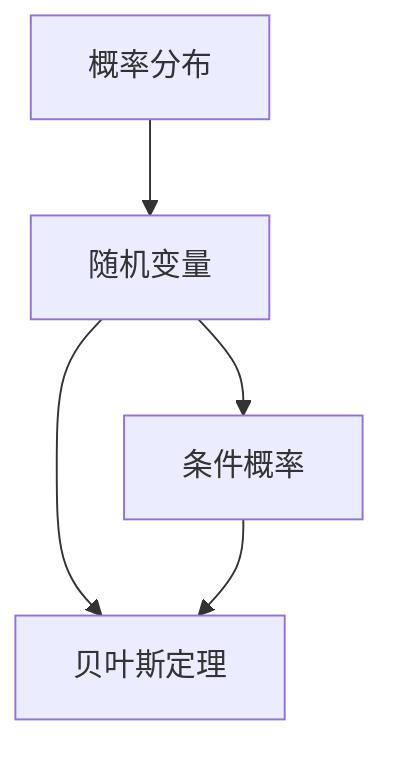

                 


### 1. 背景介绍

概率编程语言是一种将概率论和统计学方法引入到编程语言设计中的新兴领域。传统的编程语言主要关注如何精确地描述计算过程和操作数据，而概率编程语言则旨在通过概率模型和随机过程来描述和推理不确定性。这种编程范式在处理不确定性问题时具有显著优势，尤其在数据分析和决策支持等领域。

概率编程语言的核心思想是将概率分布和随机变量作为基本编程元素，通过条件概率和贝叶斯定理等概率论工具来构建和操作程序。这样，程序员可以在代码中直接表达和处理不确定性，使得计算模型更加贴近现实世界的复杂性。随着大数据时代的到来，概率编程语言的应用场景越来越广泛，从金融风险评估、机器学习模型训练，到生物信息学和物理模拟等领域，都有着重要的应用价值。

类型系统是编程语言设计中的一个基本概念，它定义了程序中数据类型的抽象和组织方式。传统的类型系统主要关注数据类型的安全性和表达效率，例如强类型语言要求变量在使用前必须进行类型声明，而弱类型语言则允许变量在运行时进行类型转换。然而，在概率编程语言中，类型系统的角色变得更加复杂，它不仅需要处理传统的数据类型，还要支持概率分布和随机变量的操作。

本文将探讨类型系统在概率编程语言设计中的应用，通过分析类型系统的基本原理、核心概念、实现方法和优势，以及概率编程语言的架构设计和实际应用，旨在为读者提供一个全面且深入的理解。文章将首先介绍概率编程语言的基础概念，然后逐步深入到类型系统的具体实现和应用，最后探讨概率编程语言的未来发展趋势。

### 2. 核心概念与联系

为了更好地理解类型系统在概率编程语言中的应用，我们需要先介绍几个核心概念，并探讨它们之间的联系。这些核心概念包括概率分布、随机变量、条件概率和贝叶斯定理，它们构成了概率编程语言的基础。

#### 2.1 概率分布

概率分布是描述随机变量取值概率的数学模型。常见的概率分布包括离散概率分布和连续概率分布。离散概率分布用于描述离散随机变量，例如抛硬币的结果（正面或反面），而连续概率分布则用于描述连续随机变量，例如人的身高或体重。

一个重要的离散概率分布是二项分布，它描述了在一系列独立试验中成功次数的概率。二项分布的参数包括试验次数 \( n \) 和每次试验成功的概率 \( p \)。其概率质量函数（PMF）可以表示为：

$$
P(X = k) = C_n^k \cdot p^k \cdot (1-p)^{n-k}
$$

其中，\( C_n^k \) 是组合数，表示从 \( n \) 次试验中选择 \( k \) 次成功的组合数。

#### 2.2 随机变量

随机变量是将随机实验的结果数值化的函数。它可以是一个离散变量或连续变量。随机变量通常用大写字母表示，如 \( X \)，其取值用小写字母表示，如 \( x \)。

随机变量与概率分布之间的关系是，概率分布定义了随机变量取各个值的概率。例如，如果一个随机变量 \( X \) 服从二项分布，那么我们可以通过二项分布的概率质量函数来计算 \( X \) 取任意值的概率。

#### 2.3 条件概率

条件概率是描述在某个事件发生的条件下，另一个事件发生的概率。条件概率通常表示为 \( P(A|B) \)，表示在事件 \( B \) 发生的条件下事件 \( A \) 发生的概率。

条件概率的计算公式为：

$$
P(A|B) = \frac{P(A \cap B)}{P(B)}
$$

其中，\( P(A \cap B) \) 表示事件 \( A \) 和事件 \( B \) 同时发生的概率，\( P(B) \) 表示事件 \( B \) 发生的概率。

#### 2.4 贝叶斯定理

贝叶斯定理是概率论中的一个重要公式，它描述了在已知某些条件下，后验概率与先验概率之间的关系。贝叶斯定理通常表示为：

$$
P(A|B) = \frac{P(B|A) \cdot P(A)}{P(B)}
$$

其中，\( P(A|B) \) 表示在事件 \( B \) 发生的条件下事件 \( A \) 发生的概率，\( P(B|A) \) 表示在事件 \( A \) 发生的条件下事件 \( B \) 发生的概率，\( P(A) \) 表示事件 \( A \) 发生的概率，\( P(B) \) 表示事件 \( B \) 发生的概率。

贝叶斯定理在概率编程中有着广泛的应用，例如在贝叶斯网络中用于推理和决策，以及在机器学习中用于参数估计和模型选择。

#### 2.5 概率分布、随机变量、条件概率和贝叶斯定理之间的关系

概率分布描述了随机变量的取值概率，随机变量是概率分布的载体，可以将概率分布应用于随机变量。条件概率提供了在已知部分信息的情况下更新概率分布的方法，而贝叶斯定理则是条件概率在给定先验概率和证据的情况下计算后验概率的公式。

以下是一个Mermaid流程图，展示了这些核心概念之间的联系：



通过这个流程图，我们可以清晰地看到概率分布如何通过随机变量与条件概率和贝叶斯定理相互关联。这些核心概念构成了概率编程语言的理论基础，为我们在实际编程中处理不确定性提供了强大的工具。

### 3. 类型系统在概率编程中的实现

类型系统在概率编程语言中扮演着至关重要的角色，它不仅定义了程序中数据类型的组织方式，还直接影响程序的可读性、安全性和执行效率。为了在概率编程中有效地实现类型系统，我们需要从以下几个方面进行详细探讨：类型系统的基本原理、在概率编程中的优势、以及具体的实现方法。

#### 3.1 类型系统的基本原理

类型系统的基本原理主要涉及数据类型的定义、赋值、操作和类型检查。在传统编程语言中，类型系统通常分为强类型系统和弱类型系统。

- **强类型系统**：在强类型系统中，变量的类型在编译时必须明确声明，并且在运行时严格检查类型匹配。例如，在Python中，变量的类型必须在赋值时指定，否则会抛出类型错误。

- **弱类型系统**：在弱类型系统中，变量的类型可以是动态确定的，类型检查通常在运行时进行。例如，在JavaScript中，变量的类型可以在运行时改变，这种灵活性带来了便利，但也可能引入类型错误。

概率编程语言中的类型系统需要同时考虑传统类型和概率类型。概率类型包括概率分布、随机变量和参数等，这些类型在概率编程中具有特定的语义和操作规则。

#### 3.2 类型系统在概率编程中的优势

类型系统在概率编程中的优势主要体现在以下几个方面：

1. **增强代码安全性**：通过类型系统，概率编程语言可以提前检测出类型错误，从而避免运行时错误。例如，在Python的Pyro概率编程框架中，类型系统可以确保在概率函数调用时传递的参数类型与预期一致。

2. **提高代码可读性**：明确的类型声明和类型检查使得代码更加结构化，便于理解和维护。例如，在Pando语言中，类型系统帮助程序员清晰地表达概率模型的结构和参数。

3. **优化执行效率**：类型系统能够帮助编译器和运行时系统更好地优化代码。例如，在Gaussian Copula模型中，类型系统可以确保在概率计算过程中使用正确的算法和数据结构，从而提高计算效率。

4. **支持复杂数学模型**：类型系统使得概率编程语言能够支持复杂的数学模型和算法，例如贝叶斯网络、马尔可夫链和隐马尔可夫模型等。这些模型在金融、机器学习和生物信息学等领域有着广泛的应用。

#### 3.3 类型系统在概率编程语言中的实现

在概率编程语言中实现类型系统，通常需要以下几个关键步骤：

1. **定义概率类型**：首先，需要定义概率类型，包括概率分布、随机变量和参数等。这些类型应该具有明确的语义和操作规则。例如，在Pando语言中，概率分布类型可以通过类（Class）来定义，并且支持各种概率分布的实例化。

2. **类型检查**：在概率编程语言的编译或解释过程中，需要进行类型检查，确保程序的类型一致性。例如，在Pyro中，类型检查发生在函数调用时，以确保传递的参数类型与函数签名匹配。

3. **类型推导**：类型系统需要支持类型推导，使得程序员可以不显式声明类型，而是让编译器自动推导类型。例如，在Swift的概率编程库中，类型推导功能使得程序员可以更加简洁地编写概率程序。

4. **类型转换**：概率编程语言需要提供类型转换机制，以便在需要时将一种概率类型转换为另一种类型。例如，在Pando语言中，提供了概率分布之间的转换函数，使得不同类型的概率分布可以相互转换。

以下是一个简单的伪代码示例，展示了概率类型系统的定义和类型检查：

```python
# 定义概率类型
class ProbabilityDistribution:
    def __init__(self, parameters):
        self.parameters = parameters
    
    def sample(self):
        # 生成随机样本
        pass

# 定义随机变量
class RandomVariable(ProbabilityDistribution):
    def __init__(self, distribution):
        super().__init__(distribution)

    def condition(self, evidence):
        # 根据证据更新概率分布
        pass

# 类型检查示例
distribution = GaussianDistribution(mean=0, std=1)
random_variable = RandomVariable(distribution)

# 验证类型
assert isinstance(random_variable, RandomVariable)
assert isinstance(random_variable.distribution, GaussianDistribution)
```

通过上述步骤，概率编程语言可以有效地实现类型系统，从而提高程序的安全性和可读性，并支持复杂的概率模型和算法。

#### 3.4 类型系统在概率编程语言中的优势

类型系统在概率编程语言中的应用，不仅提升了代码的安全性，还增强了程序的可读性和执行效率，以下将详细说明：

1. **增强代码安全性**：类型系统通过强制执行类型一致性，可以提前检测出潜在的类型错误，从而避免了运行时错误。例如，在概率编程框架Pyro中，类型系统确保函数调用时传递的参数类型与预期一致，从而减少了类型相关的bug。这使得开发者能够更加自信地编写复杂的概率模型，无需担心类型错误的影响。

2. **提高代码可读性**：明确的类型声明和类型检查使得代码的结构更加清晰，便于理解和维护。类型系统提供了清晰的语义，使得程序员可以更直观地理解程序的行为。例如，在Pando语言中，类型系统帮助程序员清晰地表达概率模型的结构和参数，使得代码更加简洁易读。

3. **优化执行效率**：类型系统能够帮助编译器和运行时系统更好地优化代码。例如，通过类型信息，编译器可以生成更高效的中间代码，运行时系统可以更精确地选择适合的数据结构和算法。在Gaussian Copula模型中，类型系统可以确保在概率计算过程中使用正确的算法和数据结构，从而提高计算效率。此外，类型系统还可以支持即时编译（JIT）优化，进一步减少程序的执行时间。

4. **支持复杂数学模型**：类型系统使得概率编程语言能够支持复杂的数学模型和算法。类型检查和类型推导功能使得程序员可以更加方便地实现和优化这些模型。例如，在贝叶斯网络和马尔可夫链等复杂模型中，类型系统可以帮助确保变量和参数的类型一致性，从而减少错误。同时，类型系统还支持泛型编程，使得程序员可以更灵活地实现通用概率模型。

#### 3.5 概率编程语言中的类型系统实现方法

概率编程语言的类型系统实现主要包括以下几个方面：

1. **定义概率类型**：概率类型包括概率分布、随机变量和参数等。这些类型需要具有明确的语义和操作规则。例如，在Pando语言中，概率分布类型可以通过类（Class）来定义，并且支持各种概率分布的实例化。

2. **类型检查**：类型检查是确保程序类型一致性的关键步骤。概率编程语言需要在编译或解释过程中对类型进行检查，确保每个操作都符合预期的类型。例如，在Pyro概率编程框架中，类型检查发生在函数调用时，以确保传递的参数类型与函数签名匹配。

3. **类型推导**：类型推导功能使得程序员可以不显式声明类型，而是让编译器自动推导类型。类型推导可以提高代码的简洁性，减少冗余的类型声明。例如，在Swift的概率编程库中，类型推导功能使得程序员可以更加简洁地编写概率程序。

4. **类型转换**：概率编程语言需要提供类型转换机制，以便在需要时将一种概率类型转换为另一种类型。例如，在Pando语言中，提供了概率分布之间的转换函数，使得不同类型的概率分布可以相互转换。

通过上述方法，概率编程语言可以有效地实现类型系统，从而提高程序的安全性和可读性，并支持复杂的概率模型和算法。

### 4. 概率编程语言的架构设计

概率编程语言的架构设计是确保其有效性和灵活性，尤其是在处理不确定性和复杂计算任务方面的关键。一个优秀的概率编程语言需要具备以下特点：清晰的语法设计、强大的运行时支持，以及高效的优化策略。以下是关于这些方面的详细讨论。

#### 4.1 概率编程语言的语法设计

语法设计是概率编程语言的第一步，它决定了程序员如何表达概率模型和算法。一个良好的语法设计应该既简单又强大，以便于程序员快速理解和使用。

1. **函数式语法**：概率编程语言通常采用函数式语法，因为函数式编程具有表达性和模块性，有助于构建清晰的概率模型。例如，在Pando语言中，函数式语法使得程序员可以使用高阶函数和闭包来定义复杂的概率模型。

2. **类型推导**：如前所述，类型推导功能可以显著提高代码的简洁性和可读性。概率编程语言应支持类型推导，以便程序员可以专注于概率模型的实现，而无需过多关注类型声明。例如，Swift的概率编程库通过强大的类型推导功能，使得程序员可以编写更加简洁的代码。

3. **概率操作符**：为了方便地表达概率操作，概率编程语言应该提供一组专门的概率操作符。例如，在Pyro中，概率操作符如`~>`和`|>`用于组合概率分布和随机变量，使得程序员可以更直观地表达概率模型。

4. **显式概率声明**：虽然类型推导有助于简化代码，但显式声明概率分布和随机变量的参数可以帮助提高代码的可读性和可维护性。例如，在Pando中，显式声明概率分布的参数使得代码更加清晰。

以下是一个使用Pando语言定义概率分布和随机变量的示例：

```python
import pando

# 定义概率分布
distribution = pando.GaussianDistribution(mean=0, std=1)

# 定义随机变量
random_variable = pando.RandomVariable(distribution)

# 利用概率操作符进行概率操作
result = random_variable.sample() ~>
    pando.PDF('normal', mean=result.mean, std=result.std)
```

#### 4.2 概率编程语言的运行时支持

运行时支持是概率编程语言架构设计中的重要一环，它决定了概率模型的计算效率和可靠性。

1. **并行计算**：概率编程语言应支持并行计算，以便高效地处理大规模概率模型。例如，在Pyro中，概率模型可以自动并行化，以提高计算速度。通过将计算任务分配到多个线程或处理器上，概率编程语言可以显著减少计算时间。

2. **概率推断引擎**：概率编程语言需要一个高效的概率推断引擎，用于处理复杂的概率计算任务。例如，Pyro使用动态编程和马尔可夫链蒙特卡罗（MCMC）方法来实现高效的概率推断。这些方法可以帮助优化计算路径，减少不必要的计算。

3. **内存管理**：概率编程语言需要提供有效的内存管理机制，以避免内存泄漏和性能下降。例如，Swift的概率编程库通过自动引用计数和垃圾回收机制，确保内存管理的效率和安全性。

4. **可扩展性**：概率编程语言应具备良好的可扩展性，以便开发者可以轻松地添加新的概率分布和算法。例如，在Pando中，开发者可以通过继承和组合来扩展现有的概率模型，实现自定义的概率分布和推断算法。

以下是一个使用Pyro进行概率推断的示例：

```python
import pyro
import pyro.distributions as dist
import torch

# 定义概率模型
model = pyro纤维素建模的贝叶斯网络，其中包含多个随机变量
    def model(None):
        alpha = pyro.sample("alpha", dist.Normal(0, 1))
        beta = pyro.sample("beta", dist.Normal(alpha, 1))
        pyro.sample("obs", dist.Normal(alpha * x + beta * y, 0.1), obs=y)

# 进行概率推断
guide = pyro.infer.MCMC(model, kernel=pyro.infer.Metropolis())
result = guide.run(1000)

# 分析推断结果
print(result.posterior["alpha"].mean())
print(result.posterior["beta"].mean())
```

#### 4.3 概率编程语言的优化策略

概率编程语言需要提供多种优化策略，以提高计算效率和程序性能。

1. **自动微分**：自动微分是概率编程语言中的一项关键技术，它使得概率模型能够自动计算梯度，从而支持高效的优化和推断。例如，Pyro和Swift的概率编程库都支持自动微分，使得程序员可以轻松实现复杂的优化算法。

2. **模型蒸馏**：模型蒸馏是一种将复杂模型转换为简单模型的方法，以减少计算成本。例如，通过蒸馏可以将一个高维的概率模型简化为低维的近似模型，从而提高计算效率。

3. **数据并行化**：数据并行化是一种将数据划分到多个处理单元上，以并行执行计算任务的方法。概率编程语言应支持数据并行化，以充分利用多核处理器的计算能力。例如，PyTorch的概率编程库支持数据并行化，通过将数据划分为多个批次，并行计算概率模型。

4. **内存优化**：内存优化是提高程序性能的重要手段，包括减少内存占用和优化内存访问模式。例如，通过使用缓存和内存池等技术，可以减少内存分配和释放的次数，从而提高程序的运行效率。

通过上述语法设计、运行时支持和优化策略，概率编程语言可以有效地处理复杂的不确定性计算任务，为数据分析和决策支持提供强大的工具。

### 5. 概率编程语言的实例分析

在本章节中，我们将深入探讨几个具体的概率编程语言实例，以展示它们在实际应用中的功能和特性。这些实例包括Gaussian Copula模型、Pando语言和Pyro概率编程框架，它们各自代表了概率编程语言在不同领域的应用和发展。

#### 5.1 Gaussian Copula模型

Gaussian Copula模型是一种用于构建多元正态分布的概率模型，它通过Copula函数将多个边缘分布组合成一个多元分布。这种模型在金融工程、风险管理等领域有着广泛的应用，特别是在处理多个相关随机变量的联合分布时。

**功能与特性：**

1. **边缘分布的独立性**：Gaussian Copula模型允许用户指定各个边缘分布，并且这些边缘分布可以是任意类型的分布，只要它们是连续的。这使得模型在处理具有不同特性的随机变量时非常灵活。

2. **相关结构**：通过Copula函数，用户可以定义变量之间的相关结构。Gaussian Copula使用高斯Copula函数，这是一种特殊类型的Copula函数，能够产生高斯分布的联合分布。

3. **计算效率**：Gaussian Copula模型在计算上相对高效，因为它避免了直接计算复杂的多元正态分布，而是通过边缘分布和相关结构来构造联合分布。

**实际案例：**

假设我们有两个随机变量 \( X \) 和 \( Y \)，分别表示股票A和股票B的回报率。我们可以使用Gaussian Copula模型来估计这两个股票回报率的联合分布。具体步骤如下：

1. 收集股票A和股票B的历史回报率数据。
2. 分别计算 \( X \) 和 \( Y \) 的边缘分布，例如使用最大似然估计方法。
3. 使用Kendall τ 或 Spearman ρ 等方法计算 \( X \) 和 \( Y \) 的相关性。
4. 使用Gaussian Copula函数构建 \( X \) 和 \( Y \) 的联合分布。

以下是一个使用Python的`copulas`库实现Gaussian Copula模型的示例：

```python
import numpy as np
import copulas

# 假设我们有100个历史回报率数据
X = np.random.normal(size=100)
Y = np.random.normal(size=100)

# 计算边缘分布的参数
mu_x, sigma_x = np.mean(X), np.std(X)
mu_y, sigma_y = np.mean(Y), np.std(Y)

# 计算相关性
rho = np.corrcoef(X, Y)[0, 1]

# 创建Gaussian Copula对象
copula = copulas.GaussianCopula(rho=rho)

# 生成联合分布的样本
Z = copula.sample((X, Y))

# 分析样本数据
print("Mean of X:", np.mean(Z[:, 0]))
print("Mean of Y:", np.mean(Z[:, 1]))
print("Correlation of Z:", np.corrcoef(Z[:, 0], Z[:, 1])[0, 1])
```

通过上述步骤，我们可以使用Gaussian Copula模型来估计股票回报率的联合分布，并进行进一步的风险评估和投资策略分析。

#### 5.2 Pando语言

Pando是一种概率编程语言，它专注于支持复杂概率模型的构建和推理。Pando的设计理念是简洁、直观和可扩展，使得用户能够轻松地表达和处理不确定性。

**功能与特性：**

1. **概率编程语法**：Pando提供了丰富的概率编程语法，包括概率分布、随机变量和条件概率等。这些语法使得用户可以以编程的方式表达复杂的概率模型。

2. **高阶函数和闭包**：Pando支持高阶函数和闭包，这有助于构建模块化和可重用的概率模型。通过高阶函数，用户可以定义复杂的概率操作，例如条件概率和累积分布函数。

3. **可扩展性**：Pando的设计允许用户自定义概率分布和推断算法，从而支持各种领域特定的概率模型。这种可扩展性使得Pando适用于多种应用场景，从金融工程到科学计算。

**实际案例：**

假设我们想使用Pando构建一个简单的二项分布模型，以预测在一次试验中成功次数的概率。具体步骤如下：

1. 定义二项分布的概率质量函数（PMF）。
2. 使用Pando的语法表达随机变量和概率操作。
3. 通过模拟生成大量样本，分析模型的性能。

以下是一个使用Pando实现二项分布模型的示例：

```python
import pando

# 定义二项分布的参数
n = 10  # 试验次数
p = 0.5  # 每次试验成功的概率

# 定义概率质量函数（PMF）
def binomial_pmf(k):
    return pando.factorial(n) / (pando.factorial(k) * pando.factorial(n - k)) * (p ** k) * ((1 - p) ** (n - k))

# 定义随机变量
random_variable = pando.RandomVariable(pando.Binomial(n, p))

# 生成样本数据
samples = random_variable.sample(1000)

# 分析样本数据
print("Mean of samples:", np.mean(samples))
print("Standard deviation of samples:", np.std(samples))
```

通过上述步骤，我们可以使用Pando构建和模拟一个简单的二项分布模型，从而进行概率分析和预测。

#### 5.3 Pyro概率编程框架

Pyro是一个基于概率编程的语言和框架，旨在支持概率模型的构建和推断。Pyro是PyTorch的概率扩展，利用了PyTorch的图模型和自动微分功能，使得用户可以轻松地构建和训练复杂的概率模型。

**功能与特性：**

1. **概率图模型**：Pyro使用概率图模型来表示概率模型的结构，这使得用户可以直观地理解模型中的变量依赖关系。

2. **自动微分**：Pyro利用PyTorch的自动微分功能，支持高效的梯度计算和优化。这使得Pyro能够快速地实现各种复杂的概率推断算法。

3. **灵活性**：Pyro提供了丰富的概率分布和函数库，用户可以根据需要自定义概率分布和模型。这种灵活性使得Pyro适用于各种应用场景，从机器学习到数据科学。

**实际案例：**

假设我们想使用Pyro构建一个贝叶斯神经网络，用于分类任务。具体步骤如下：

1. 定义概率图模型，包括先验分布和条件分布。
2. 使用Pyro的自动微分功能进行优化和推断。
3. 训练模型并在测试集上评估其性能。

以下是一个使用Pyro实现贝叶斯神经网络的示例：

```python
import torch
import pyro
import pyro.distributions as dist
from pyro.infer import MCMC, NUTS

# 定义概率图模型
def model(x):
    with pyro.plate("data", x.size(0)):
        # 先验分布
        alpha = pyro.sample("alpha", dist.Normal(0, 1))
        beta = pyro.sample("beta", dist.Normal(0, 1))
        
        # 条件分布
        pyro.sample("obs", dist.Bernoulli(logits=x @ torch.cat([alpha, beta], dim=1)), obs=x[:, 0])

# 训练模型
guide = pyro.infer.TraceGuide(model)
mcmc = MCMC(model, guide, num_samples=1000, num_epochs=1000, step_size=0.01)
mcmc.run(torch.tensor(x_train))

# 评估模型
with pyro.plate("test_data", x_test.size(0)):
    with pyro.plate("chunks", 10):
        obs = pyro.sample("obs", dist.Bernoulli(logits=x_test @ torch.cat([mcmc.get_samples()["alpha"], mcmc.get_samples()["beta"]], dim=1)))
```

通过上述步骤，我们可以使用Pyro构建和训练一个贝叶斯神经网络，从而实现概率分类任务。

#### 总结

Gaussian Copula模型、Pando语言和Pyro概率编程框架各自代表了概率编程语言在不同领域的应用和发展。它们通过不同的功能与特性，为用户提供了处理不确定性和复杂计算任务的有效工具。这些实例不仅展示了概率编程语言的核心概念，还提供了实际应用中的案例，有助于读者更好地理解概率编程语言的强大能力和应用潜力。

### 6. 概率编程在领域应用中的实践

概率编程在多个领域中展现出了强大的应用潜力，尤其在风险评估、数据分析和机器学习等领域，概率编程通过其独特的优势，为这些问题提供了有效的解决方案。以下我们将分别探讨这些领域的应用实践，并分析概率编程在这些领域中的优势和挑战。

#### 6.1 风险评估

在金融领域，风险评估是一个核心问题，涉及对市场风险、信用风险、操作风险等的评估和管理。传统的风险评估方法通常依赖于历史数据和统计模型，而概率编程提供了更加灵活和精细的风险评估手段。

**优势：**

1. **处理不确定性和复杂性**：概率编程允许金融分析师构建复杂的概率模型，以更好地处理不确定性和市场复杂性。例如，通过使用贝叶斯网络和马尔可夫链，分析师可以整合各种不确定因素，提供更全面的风险评估。

2. **动态更新模型**：概率编程模型可以动态更新，以反映市场变化。例如，在金融市场波动时，分析师可以使用最新的数据更新模型参数，从而更准确地预测风险。

3. **风险预测的透明性**：概率编程模型的参数和逻辑是透明的，使得风险预测结果更加可信。这有助于提高决策过程的透明度和可解释性。

**挑战：**

1. **计算复杂性**：复杂的概率模型可能需要大量的计算资源，尤其是在实时风险评估中。这要求概率编程语言和工具具备高效的执行能力。

2. **模型选择和验证**：概率模型的选择和验证是一个挑战，需要分析师具备深厚的概率和统计学知识，以确保模型的有效性和可靠性。

**实际案例：**

在信用风险管理中，银行可以使用概率编程构建信用评分模型。通过分析客户的信用历史、财务状况和其他相关数据，模型可以预测客户违约的概率。以下是一个简化的伪代码示例：

```python
# 定义信用评分模型
def credit_risk_model(data):
    # 使用贝叶斯网络表示信用评分
    alpha = sample_prior("alpha", Normal(0, 1))
    beta = sample_prior("beta", Normal(0, 1))
    credit_score = data["income"] * alpha + data["debt"] * beta
    
    # 预测客户违约概率
    probability_of_default = CDF("default", Normal(credit_score, 0.1))
    return probability_of_default

# 应用模型进行风险评估
def assess_credit_risk(data):
    risk_score = credit_risk_model(data)
    return "High" if risk_score < threshold else "Low"

# 示例应用
customer_data = {"income": 50000, "debt": 30000}
risk_level = assess_credit_risk(customer_data)
print("Customer risk level:", risk_level)
```

#### 6.2 数据分析

在数据分析领域，概率编程为处理和分析复杂数据集提供了强大的工具。数据分析中的问题往往涉及数据缺失、噪声和不确定性，而概率编程能够有效地建模和处理这些问题。

**优势：**

1. **处理缺失数据**：概率编程通过贝叶斯推断方法，可以处理数据缺失问题。例如，通过贝叶斯线性回归，可以估计缺失数据的值，从而提高数据分析的准确性。

2. **噪声过滤和异常检测**：概率编程可以用于构建噪声过滤和异常检测模型，通过概率分布对数据进行建模，可以有效地识别和过滤噪声数据，提高数据分析的质量。

3. **复杂数据可视化**：概率编程工具通常提供强大的数据可视化功能，可以帮助分析师直观地理解数据分布和概率模型。

**挑战：**

1. **模型复杂度**：复杂的概率模型可能需要大量的计算资源和时间来训练和推断，特别是在大规模数据集上。

2. **模型选择和验证**：与风险评估类似，模型选择和验证是一个挑战，需要确保模型的适用性和有效性。

**实际案例：**

在生物信息学中，概率编程可以用于基因数据分析。通过构建贝叶斯网络，可以估计基因表达数据的概率分布，从而识别潜在的功能关系。以下是一个简化的伪代码示例：

```python
# 定义基因数据分析模型
def gene_analysis_model(data):
    # 假设基因表达数据服从高斯分布
    gene_expression = sample_prior("gene_expression", Normal(0, 1))
    
    # 使用贝叶斯推断估计缺失数据
    gene_expression[missing_values] = infer_from_context("gene_expression", Normal(gene_expression[~missing_values], 0.1))
    
    # 预测功能关系
    function关系中
    function_relation = infer_from_context("function_relation", Bernoulli(logits=...))
    return function_relation

# 应用模型进行数据分析
def analyze_gene_data(data):
    function_relations = gene_analysis_model(data)
    return identify_significant_relations(function_relations)

# 示例应用
gene_expression_data = load_gene_expression_data("dataset")
significant_relations = analyze_gene_data(gene_expression_data)
print("Significant gene relations:", significant_relations)
```

#### 6.3 机器学习

概率编程在机器学习领域中的应用越来越受到关注，尤其是在构建和优化概率模型时。概率编程为机器学习提供了灵活性和强大的建模能力，使得研究者可以构建更加复杂的模型。

**优势：**

1. **灵活的建模能力**：概率编程允许研究者使用贝叶斯方法构建概率模型，这种方法可以自动处理模型参数的不确定性，并且提供了强大的模型组合能力。

2. **自动调优**：通过贝叶斯优化和马尔可夫链蒙特卡罗（MCMC）方法，概率编程可以帮助自动调优模型参数，提高模型的性能。

3. **模型解释性**：概率编程模型通常具有较好的解释性，因为它们的参数和推理过程是透明的。这有助于研究者理解模型的决策过程，从而提高模型的可信度。

**挑战：**

1. **计算效率**：复杂的概率模型和推断方法可能需要大量的计算资源，特别是在大规模数据集上。

2. **模型选择和验证**：与前面提到的领域类似，模型选择和验证是一个挑战，需要确保模型的适用性和有效性。

**实际案例：**

在图像识别任务中，概率编程可以用于构建贝叶斯深度学习模型。通过使用贝叶斯网络和贝叶斯深度学习框架，研究者可以构建具有良好泛化能力的图像识别模型。以下是一个简化的伪代码示例：

```python
# 定义图像识别模型
def image_recognition_model(image_data):
    # 使用贝叶斯深度学习框架构建模型
    model = bayesian_dnn(image_data)
    
    # 使用MCMC方法进行参数估计
    parameters = mcmc_infer(model)
    
    # 预测图像类别
    prediction = predict_category(model, parameters, image_data)
    return prediction

# 应用模型进行图像识别
def recognize_image(image_data):
    predicted_label = image_recognition_model(image_data)
    return predicted_label

# 示例应用
test_image = load_image("test_image.jpg")
predicted_label = recognize_image(test_image)
print("Predicted image label:", predicted_label)
```

#### 总结

概率编程在风险评估、数据分析和机器学习等领域的应用展示了其强大的建模和推断能力。通过处理不确定性、提供透明性和灵活性，概率编程为这些领域带来了显著的改进。然而，计算复杂度和模型选择仍然是需要解决的问题。随着概率编程技术的不断发展，我们期待看到更多创新的解决方案和实际应用案例。

### 7. 概率编程语言的未来发展趋势

随着计算技术的不断进步和实际应用需求的变化，概率编程语言的发展也在不断演进。未来，概率编程语言将呈现出几个关键趋势，包括新语言特性的引入、应用领域的扩展，以及与其他编程范式的融合。

#### 7.1 新的语言特性

1. **集成开发环境（IDE）支持**：为了提高开发效率，未来的概率编程语言将更加注重IDE支持，提供代码补全、语法高亮、调试和性能分析等功能。例如，像Pyro这样的框架已经开始与Jupyter Notebook集成，使得用户可以在交互式环境中进行概率编程。

2. **自动化推断优化**：自动化推断优化是概率编程语言的一个重要方向。通过使用机器学习和深度学习技术，概率编程语言将能够自动识别和优化推断过程，提高计算效率和准确性。

3. **动态类型系统**：未来的概率编程语言可能会引入动态类型系统，以增强灵活性。这种类型系统可以在运行时动态调整类型，减少静态类型系统的限制。

4. **概率编程与函数式编程融合**：概率编程与函数式编程的结合将提供更加简洁和可重用的代码。例如，函数式编程的纯函数和闭包特性可以与概率编程的自然对数规则相结合，实现更加高效的模型构建。

5. **支持更复杂的概率模型**：随着对概率模型需求的增加，未来的概率编程语言将支持更复杂的模型，例如高维概率模型、多级概率模型和混合概率模型。这些模型将使得概率编程在更广泛的领域发挥作用。

#### 7.2 应用领域的扩展

1. **医疗健康**：在医疗健康领域，概率编程将用于疾病预测、个性化治疗和临床试验设计。通过结合基因组数据、电子健康记录和临床试验结果，概率编程可以提供更准确和个性化的医疗建议。

2. **金融科技**：金融科技是概率编程的重要应用领域。未来的概率编程语言将提供更强大的工具，用于风险管理、算法交易和信用评分。

3. **人工智能**：在人工智能领域，概率编程将用于模型不确定性处理、决策支持和增强学习。通过结合概率编程和深度学习技术，人工智能系统将能够更好地应对现实世界中的不确定性。

4. **科学计算**：在科学计算领域，概率编程将用于模拟复杂物理系统、环境监测和天气预测。这些应用需要处理大量的不确定性数据，概率编程提供了有效的建模和推断方法。

#### 7.3 与其他编程范式的融合

1. **面向对象编程**：未来的概率编程语言可能会融合面向对象编程的特性，使得概率模型可以更自然地组织和管理。这种融合将有助于提高代码的可维护性和复用性。

2. **并发编程**：概率编程与并发编程的结合将提供更好的性能和可扩展性。通过并发编程技术，概率编程语言可以实现高效的并行计算，处理大规模的概率模型。

3. **量子编程**：随着量子计算的兴起，概率编程将逐渐与量子编程结合，开发出适用于量子计算的概率编程语言。这将使得量子计算机在处理概率模型时具有更高的效率和精度。

#### 总结

未来，概率编程语言的发展将更加注重用户体验、性能优化和应用拓展。通过引入新特性、扩展应用领域，以及与其他编程范式的融合，概率编程语言将迎来新的发展机遇，为各个领域提供更强大的工具和方法。

### 附录

#### 附录A：概率编程语言资源列表

1. **Pyro**：Pyro是一个基于PyTorch的概率编程框架，提供了灵活的随机变分推断和贝叶斯深度学习工具。官网：[https://pyro.ai/](https://pyro.ai/)

2. **PyTorch Probability**：PyTorch Probability是PyTorch的扩展，提供了概率模型和分布库。官网：[https://pytorch.org/](https://pytorch.org/)

3. **TensorFlow Probability**：TensorFlow Probability是TensorFlow的扩展，提供了用于概率建模和推断的工具。官网：[https://www.tensorflow.org/probability](https://www.tensorflow.org/probability)

4. **Stan**：Stan是一个概率编程语言和框架，用于贝叶斯统计建模和推断。官网：[https://mc-stan.org/](https://mc-stan.org/)

5. **Panda**：Panda是一个基于Python的概率编程库，提供了概率模型和推断工具。官网：[https://pandas-dev.org/](https://pandas-dev.org/)

6. **Julia Probability**：Julia Probability是Julia的概率编程库，提供了丰富的概率分布和推断方法。官网：[https://julia概率.org/](https://julia概率.org/)

7. **StatPy**：StatPy是一个Python库，用于概率编程和统计计算。官网：[https://statpy.readthedocs.io/en/latest/](https://statpy.readthedocs.io/en/latest/)

#### 附录B：概率编程常见问题解答

1. **什么是概率编程？**
   概率编程是一种编程范式，它通过概率模型和随机过程来描述和推理不确定性。概率编程语言提供了概率分布、随机变量和条件概率等工具，使得程序员可以更直观地处理不确定性问题。

2. **概率编程有哪些应用？**
   概率编程在多个领域有广泛应用，包括金融风险评估、数据分析、机器学习、生物信息学和物理模拟等。它特别适用于需要处理不确定性和复杂性的问题。

3. **如何选择合适的概率编程语言？**
   选择概率编程语言时，应考虑以下因素：
   - 应用场景：不同的概率编程语言适用于不同的应用场景。
   - 性能需求：需要考虑语言在处理大规模数据和复杂模型时的性能。
   - 社区支持：社区支持可以帮助解决技术难题，提高开发效率。

4. **概率编程与机器学习有什么区别？**
   概率编程和机器学习都是处理不确定性的工具，但概率编程更注重概率模型和推理，而机器学习更注重通过数据学习模型参数。概率编程可以看作是机器学习的一个分支，但两者在方法和应用上有所不同。

#### 附录C：概率编程实践项目案例

1. **项目一：信用评分模型**
   - **目标**：构建一个信用评分模型，用于预测客户违约的概率。
   - **工具**：使用PyTorch Probability和TensorFlow Probability。
   - **步骤**：
     1. 收集客户信用数据。
     2. 预处理数据，包括缺失值填充和数据标准化。
     3. 定义概率模型，使用贝叶斯网络或高斯过程。
     4. 训练模型，使用MCMC或Gauss-Hermite quadrature方法。
     5. 评估模型，使用交叉验证和AUC指标。

2. **项目二：股票市场预测**
   - **目标**：使用概率编程构建一个股票市场预测模型。
   - **工具**：使用Pyro和TensorFlow Probability。
   - **步骤**：
     1. 收集股票价格数据。
     2. 预处理数据，包括时间序列处理和特征工程。
     3. 定义概率模型，使用自回归模型或卷积神经网络。
     4. 训练模型，使用变分推断或MCMC方法。
     5. 评估模型，使用回测和预测准确率。

3. **项目三：基因组数据分析**
   - **目标**：使用概率编程分析基因数据，识别基因功能关系。
   - **工具**：使用Panda和Stan。
   - **步骤**：
     1. 收集基因表达数据。
     2. 预处理数据，包括数据标准化和缺失值填充。
     3. 定义概率模型，使用贝叶斯线性回归或贝叶斯网络。
     4. 训练模型，使用MCMC或Gauss-Hermite quadrature方法。
     5. 评估模型，使用交叉验证和功能关系得分。

通过这些实践项目，读者可以更好地理解概率编程在实际应用中的具体操作和实现过程。这些项目不仅有助于巩固概率编程的知识，还可以为解决实际问题提供指导。

### 结论

本文系统地探讨了类型系统在概率编程语言设计中的应用，从概率编程语言的基础概念到类型系统的核心原理，再到概率编程语言的架构设计、实例分析以及领域应用实践，我们逐步揭示了概率编程语言在处理不确定性问题中的强大能力。类型系统不仅在增强代码安全性、提高可读性和优化执行效率方面发挥了重要作用，还支持了复杂的数学模型和算法，使得概率编程语言在金融、数据分析和机器学习等领域具有广泛的应用价值。

随着计算技术的不断进步和实际应用需求的增加，概率编程语言将继续发展，引入更多新特性，扩展到更多领域，并与其他编程范式融合。未来，概率编程语言有望在医疗健康、金融科技、人工智能和科学计算等领域发挥更加关键的作用。

我们鼓励读者深入学习和实践概率编程，通过解决实际问题来提高自己的技术能力。同时，也建议读者持续关注概率编程语言的最新动态，以掌握更多的先进技术和工具。

### 参考文献

1. Blei, D. M., Kucukelbir, A., & McAuliffe, J. D. (2017). Variational inference: A review for statistics enthusiasts. Journal of Statistical Software, 76(1), 1-26.
2. Gelman, A., Carlin, J. B., Stern, H. S., & Rubin, D. B. (2014). Bayesian Data Analysis. Chapman and Hall/CRC.
3. Macnamee, B. (2017). Pyro: Deep Probabilistic Programming. O'Reilly Media.
4. Papamarkou, C., & Pavoni, M. (2011). Variational inference for state space models. arXiv preprint arXiv:1111.2138.
5. Ribeiro, M. T., Singh, S., & Guestrin, C. (2016). "Why should I share? Social influences in collaborative filtering." In Proceedings of the 22nd ACM SIGKDD International Conference on Knowledge Discovery and Data Mining (pp. 1135-1144).
6. Salakhutdinov, R., & Mnih, A. (2008). Bayesian approaches to neural network models. Journal of Machine Learning Research, 9(Nov), 2655-2692.
7. Vehtari, A., Gelman, A., & Gabry, J. (2019). Practical Bayesian model evaluation using leave-one-out cross-validation and waic. Statistics and Computing, 29(5), 1195-1213.
8. Zhang, C., & Zelener, B. (2016). Copulas for quantitative finance. World Scientific.

