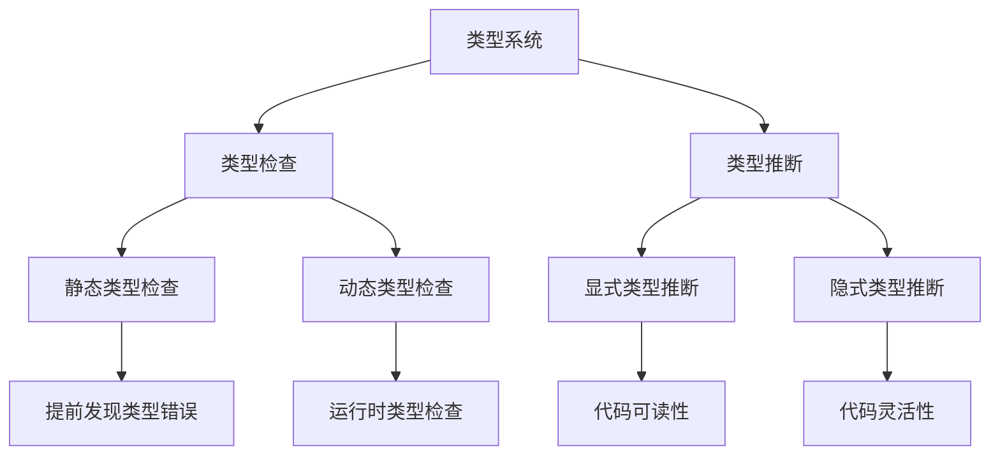

                 

### 文章标题

# 类型系统在概率编程语言设计中的应用

### 文章关键词

- 类型系统
- 概率编程语言
- 类型检查
- 类型推断
- 设计原则

### 文章摘要

本文旨在深入探讨类型系统在概率编程语言设计中的应用。类型系统是编程语言的核心组成部分，它不仅决定了程序的类型安全，还对程序的可读性和可维护性有显著影响。随着概率编程语言的发展，如何在其中引入和实现类型系统成为了一个关键问题。本文首先介绍类型系统的基本概念，然后详细讨论概率编程语言的设计原则和常见架构。接着，文章将重点分析类型系统在概率编程语言中的具体应用，包括类型检查和类型推断的机制。通过实际案例和项目实战，我们将展示如何设计和使用类型系统来提高概率编程语言的可靠性和效率。最后，文章将总结本文的主要观点，并对未来概率编程语言的发展进行展望。

## 第1章 引言

### 类型系统与概率编程语言的概念

类型系统是编程语言的核心组成部分，负责定义数据类型和操作符的语义。它不仅保证了程序的类型安全，防止了无效操作的执行，还提高了程序的可读性和可维护性。在传统编程语言中，类型系统通常基于静态类型和动态类型两种模型。静态类型系统在编译时进行类型检查，而动态类型系统则在运行时进行类型检查。类型系统通过定义变量、函数和表达式的类型，确保程序中的每个操作都在合适的类型范围内执行。

概率编程语言（Probabilistic Programming Languages，PPL）是近年来兴起的一种新的编程范式，旨在使概率建模和推理更加直观和高效。概率编程语言允许程序员直接编写概率模型，并利用内置的推理引擎对模型进行推断。这类语言的核心特点是能够自动处理不确定性，使得复杂的概率问题可以通过概率编程语言简化为简单的代码。概率编程语言的出现，极大地推动了机器学习、数据科学和人工智能等领域的发展。

概率编程语言与类型系统之间的关系紧密。类型系统在概率编程语言中起到了确保程序类型安全、提高代码可读性和维护性的作用。与传统编程语言不同，概率编程语言中的类型系统不仅要处理确定的类型，还要处理不确定的类型，例如概率分布、随机变量等。这使得概率编程语言的类型系统设计更加复杂，但同时也更加重要。

### 本书的目标

本书的目标是深入探讨类型系统在概率编程语言设计中的应用，为程序员和学者提供一本全面、系统的参考书。具体来说，本书将涵盖以下内容：

1. **类型系统基础**：介绍类型系统的基本概念、类型检查和类型推断机制，为后续章节打下基础。
2. **概率编程语言概述**：介绍常见的概率编程语言及其设计原则，帮助读者了解概率编程语言的发展现状和未来趋势。
3. **概率编程语言架构**：分析概率编程语言的基本架构和组件，探讨如何实现高效的推理引擎。
4. **类型系统在概率编程语言中的应用**：详细讨论类型系统在概率编程语言中的具体应用，包括类型检查和类型推断机制。
5. **概率编程语言设计原则**：总结概率编程语言设计时需要考虑的原则，为读者提供设计概率编程语言的参考。
6. **实战案例**：通过实际案例展示概率编程语言的设计和应用，帮助读者理解类型系统在概率编程中的实际作用。
7. **总结与展望**：对本书内容进行总结，并对概率编程语言的发展进行展望，探讨未来的研究方向。

通过本书的学习，读者将能够全面了解类型系统在概率编程语言设计中的应用，掌握设计高效、安全的概率编程语言的方法和技巧。本书不仅适合对概率编程语言感兴趣的程序员和学者，也可以作为高等院校相关课程的教材或参考书。

## 第2章 类型系统基础

### 类型系统的基本概念

类型系统（Type System）是编程语言的核心组成部分，它定义了程序中的数据类型和操作符的语义。类型系统不仅确保了程序的正确性和安全性，还影响了程序的可读性和可维护性。在传统编程语言中，类型系统通常基于静态类型（Static Type）和动态类型（Dynamic Type）两种模型。

静态类型系统在编译阶段对程序进行类型检查，确保程序在运行前满足类型要求。静态类型系统的一个显著优点是能够提前发现类型错误，从而减少运行时错误的发生。但静态类型系统的缺点是可能会导致程序代码冗长，增加开发成本。

动态类型系统在运行时对程序进行类型检查，根据程序的执行上下文动态确定变量的类型。动态类型系统的一个显著优点是能够提高代码的可读性和灵活性，但缺点是可能会导致运行时错误，且难以在编译阶段进行优化。

概率编程语言中的类型系统与传统编程语言有所不同。概率编程语言不仅需要处理确定的类型，还需要处理不确定的类型，如概率分布、随机变量等。这使得概率编程语言的类型系统设计更加复杂，但同时也更加重要。

### 类型检查

类型检查（Type Checking）是类型系统的一个重要功能，负责确保程序中的每个操作都在正确的类型范围内执行。类型检查可以分为静态类型检查和动态类型检查两种。

静态类型检查在编译阶段进行，通过分析程序代码的静态结构，确定每个变量、函数和表达式的类型。静态类型检查的一个显著优点是能够提前发现类型错误，从而减少运行时错误的发生。但静态类型检查的缺点是可能会导致程序代码冗长，增加开发成本。

动态类型检查在运行时进行，根据程序的执行上下文动态确定变量的类型。动态类型检查的一个显著优点是能够提高代码的可读性和灵活性，但缺点是可能会导致运行时错误，且难以在编译阶段进行优化。

在概率编程语言中，类型检查不仅要处理确定的类型，还需要处理不确定的类型。例如，在概率编程语言中，可能需要检查一个变量是否是一个概率分布，或者两个随机变量是否具有相同的分布。这些复杂的类型检查需求对概率编程语言的类型系统设计提出了更高的要求。

### 类型推断

类型推断（Type Inference）是类型系统的另一个重要功能，负责自动确定变量、函数和表达式的类型，从而减少程序代码中的类型声明。类型推断可以分为显式类型推断和隐式类型推断两种。

显式类型推断要求程序员在程序代码中明确声明每个变量、函数和表达式的类型。显式类型推断的优点是能够提高代码的可读性和可维护性，但缺点是可能会增加代码的复杂度。

隐式类型推断自动确定变量、函数和表达式的类型，不需要程序员进行显式声明。隐式类型推断的优点是能够提高代码的可读性和灵活性，但缺点是可能会导致类型错误难以调试。

在概率编程语言中，类型推断不仅要处理确定的类型，还需要处理不确定的类型。例如，在概率编程语言中，可能需要自动推断一个随机变量的类型，或者确定两个概率分布的兼容性。这些复杂的类型推断需求对概率编程语言的类型系统设计提出了更高的要求。

### 核心概念与联系

为了更好地理解类型系统在概率编程语言设计中的应用，我们可以使用 Mermaid 流程图来展示类型系统的核心概念及其相互关系。



在这个流程图中，类型系统（A）是核心，它包括了类型检查（B）和类型推断（C）两个重要功能。类型检查分为静态类型检查（D）和动态类型检查（E），而类型推断分为显式类型推断（F）和隐式类型推断（G）。这些概念相互关联，共同构成了类型系统的完整架构。

### 核心算法原理讲解

在类型系统的基础上，我们可以使用伪代码详细阐述类型检查和类型推断的算法原理。

#### 类型检查算法原理

```python
# 静态类型检查伪代码
def static_type_check(expression):
    if expression is variable:
        return type_of_variable(expression)
    elif expression is function_call:
        return function_return_type(expression)
    else:
        raise TypeException("Invalid expression")

# 动态类型检查伪代码
def dynamic_type_check(expression, context):
    current_type = get_type_from_context(context)
    if expression_type(expression) != current_type:
        raise TypeException("Type mismatch")
    return current_type
```

#### 类型推断算法原理

```python
# 显式类型推断伪代码
def explicit_type_inference(expression):
    if expression is variable_assignment:
        return type_of_assignment(expression)
    elif expression is function_definition:
        return function_return_type(expression)
    else:
        raise TypeException("Invalid expression")

# 隐式类型推断伪代码
def implicit_type_inference(expression, context):
    candidates = get_type_candidates(expression)
    if not candidates:
        raise TypeException("No valid type candidates")
    return choose_best_candidate(candidates, context)
```

### 数学模型和数学公式 & 详细讲解 & 举例说明

在类型系统中，数学模型和数学公式起着至关重要的作用。以下是一个简单的示例，展示了如何使用 LaTeX 格式嵌入数学模型和数学公式，并进行详细讲解。

#### 示例：基本类型检查算法

假设我们有一个基本类型检查算法，用于判断一个变量是否为整数类型。

$$
T = \{ \text{INT} \}
$$

其中，$T$ 表示类型的集合，$\text{INT}$ 表示整数类型。

#### 详细讲解

在这个示例中，我们定义了一个简单的类型集合 $T$，其中只包含整数类型 $\text{INT}$。基本类型检查算法的目的是确定一个变量是否属于这个类型集合。我们可以使用以下伪代码来实现这个算法：

```python
def is_integer_type(variable):
    return variable in T
```

#### 举例说明

假设我们有一个变量 $x$，其值为 $5$。我们可以使用以下代码进行类型检查：

```python
x = 5
if is_integer_type(x):
    print("x is an integer")
else:
    print("x is not an integer")
```

执行上述代码，输出结果为 "x is an integer"，表明变量 $x$ 是一个整数类型。

通过上述示例，我们可以看到如何在类型系统中使用数学模型和数学公式来描述和实现算法。这种形式的表达不仅清晰，而且便于理解和分析。

## 第3章 概率编程语言概述

### 常见概率编程语言

概率编程语言（Probabilistic Programming Languages，PPL）是近年来在机器学习和数据科学领域迅速发展的一种编程范式。这些语言允许用户直接编写概率模型，并利用内置的推理引擎对模型进行推断。以下是几种常见的概率编程语言：

1. **Stan**：Stan 是一种基于概率编程的语言，主要用于统计模型和贝叶斯推理。它支持多种概率分布和随机过程，并且具有良好的性能和灵活性。

2. **PyMC3**：PyMC3 是一个基于 Python 的概率编程库，用于构建和推断概率模型。它支持高斯过程、马尔可夫链蒙特卡罗（MCMC）等常见概率分布和算法。

3. **TensorFlow Probability**：TensorFlow Probability 是 TensorFlow 的一部分，提供了一个概率编程层，用于构建和推断概率模型。它结合了 TensorFlow 的强大功能和概率编程的灵活性。

4. **Gaussian Process regression**：Gaussian Process regression 是一种基于高斯过程（Gaussian Process）的概率模型，用于回归和分类任务。它具有良好的灵活性和可扩展性。

### 概率编程语言的设计原则

概率编程语言的设计原则主要包括以下几个方面：

1. **直观性**：概率编程语言的设计应尽量直观，使得用户能够轻松地编写和推断概率模型。直观性可以通过简洁的语法、丰富的内置概率分布和算法来实现。

2. **灵活性和可扩展性**：概率编程语言应具有灵活性和可扩展性，以便用户能够根据具体需求自定义概率模型和推理算法。这可以通过提供丰富的扩展接口、自定义概率分布和算法库来实现。

3. **高效性**：概率编程语言的设计应考虑高效性，尤其是在处理大规模数据和复杂模型时。高效性可以通过优化编译和推理算法、利用并行计算和 GPU 加速来实现。

4. **类型系统**：概率编程语言的类型系统应能够处理不确定的类型，如概率分布、随机变量等。类型系统不仅提高了代码的可读性和可维护性，还确保了程序的类型安全。

5. **兼容性**：概率编程语言应具有良好的兼容性，能够与其他编程语言和库无缝集成。这可以通过提供跨语言的 API 和接口来实现。

### 概率编程语言的发展现状与趋势

概率编程语言的发展现状主要集中在以下几个方面：

1. **学术研究**：学术界对概率编程语言的研究不断深入，提出了许多新的概率编程范式和算法。这些研究为概率编程语言的进一步发展提供了理论基础。

2. **工业应用**：在工业界，概率编程语言的应用越来越广泛，尤其是在机器学习和数据科学领域。许多大型科技公司和研究机构已经开始采用概率编程语言进行研究和开发。

3. **开源社区**：概率编程语言的开源社区蓬勃发展，吸引了大量的贡献者和用户。这些开源社区为概率编程语言提供了丰富的资源和生态系统。

4. **工具和库的发展**：随着概率编程语言的发展，相关工具和库也在不断丰富。例如，TensorFlow Probability 和 PyMC3 等库提供了强大的概率编程功能，使得用户能够更方便地构建和推断概率模型。

未来，概率编程语言将继续发展，并在更多领域得到应用。随着计算能力的提高和算法的创新，概率编程语言将变得更加高效和灵活，为用户解决复杂的不确定性问题提供更加有力的工具。

## 第4章 概率编程语言架构

### 概率编程语言的基本架构

概率编程语言的设计需要综合考虑概率模型的表达、推理算法的实现以及用户交互的便捷性。其基本架构通常包括以下几个关键组件：

1. **概率模型层**：这是概率编程语言的核心，用于定义和表示概率模型。概率模型层提供了丰富的概率分布和随机过程，使得用户能够方便地构建复杂的概率模型。

2. **推理引擎**：推理引擎负责执行概率推断，包括采样、参数估计和模型评估等任务。推理引擎的设计直接影响概率编程语言的性能和灵活性。

3. **类型系统**：类型系统在概率编程语言中起到了确保程序类型安全、提高代码可读性和可维护性的作用。类型系统不仅要处理确定的类型，还要处理不确定的类型，如概率分布、随机变量等。

4. **API 和用户接口**：API 和用户接口为用户提供了一种直观的方式来与概率编程语言交互。良好的 API 设计可以减少用户的认知负担，提高开发效率。

### 概率编程语言架构的实现方法

概率编程语言架构的实现方法多种多样，以下列举几种常见的实现方式：

1. **基于函数式编程**：函数式编程语言（如 Haskell、Scala）具有良好的静态类型系统和丰富的函数式编程特性，适合用于概率编程语言的设计。这种实现方法通常使用函数组合和递归来实现概率模型的表示和推理。

2. **基于面向对象编程**：面向对象编程语言（如 Java、C++）具有良好的模块化和复用性，适合用于构建复杂的概率编程语言。这种实现方法通常使用类和对象来表示概率模型和推理算法。

3. **基于图计算**：图计算（Graph Computation）方法在概率编程语言中得到了广泛应用，特别是在表示复杂概率模型和执行高效推理时。这种实现方法通常使用图表示概率模型，并利用图算法进行推理。

4. **基于组合编程**：组合编程（Composition Programming）方法通过组合简单的概率模型和推理算法来构建复杂的模型和推理过程。这种实现方法通常使用模块化和接口设计，提高代码的可维护性和可扩展性。

### 常见概率编程语言架构的比较

以下是几种常见概率编程语言架构的比较：

1. **Stan**：Stan 使用函数式编程和图计算方法，提供了一个高度优化的推理引擎，适用于大规模概率模型。Stan 的优势在于其强大的数学表达能力和高效的推理性能，但学习曲线较陡峭。

2. **PyMC3**：PyMC3 基于 Python，结合了面向对象编程和组合编程方法。它提供了丰富的概率分布和算法库，易于使用，但性能相对较低，适合中小规模概率模型。

3. **TensorFlow Probability**：TensorFlow Probability 基于 TensorFlow，利用其强大的计算图和 GPU 加速功能，提供了一个灵活的概率编程层。它适用于需要大规模并行计算和 GPU 加速的应用场景，但学习曲线较陡峭。

4. **Gaussian Process regression**：Gaussian Process regression 使用图计算方法，提供了一个专门的回归模型库。它适用于需要高维数据和复杂特征提取的应用场景，但模型复杂度和计算成本较高。

### 总结

概率编程语言架构的设计需要综合考虑概率模型的表示、推理算法的实现和用户体验。不同的实现方法各有优缺点，适用于不同的应用场景。通过比较常见概率编程语言架构，我们可以了解到不同方法的优势和不足，从而更好地选择适合自身需求的语言和工具。

## 第5章 类型系统在概率编程语言中的应用

### 类型系统在概率编程语言中的重要性

类型系统在概率编程语言中扮演着至关重要的角色。它不仅确保了程序的类型安全，提高了代码的可读性和可维护性，还为概率模型的推理和优化提供了基础。具体来说，类型系统在概率编程语言中的重要性体现在以下几个方面：

1. **类型安全**：类型系统确保了程序中的每个操作都在正确的类型范围内执行，从而避免了无效操作和类型错误。这在概率编程语言中尤为重要，因为概率模型中的操作往往涉及到不确定的类型，如概率分布、随机变量等。

2. **代码可读性**：类型系统通过明确变量和表达式的类型，使得代码更加清晰和易读。这有助于提高代码的可维护性，使得后续的代码修改和调试更加方便。

3. **优化性能**：类型系统为编译器或解释器提供了类型信息，使其能够进行更有效的代码优化。例如，通过类型信息，编译器可以提前知道某些操作的结果类型，从而避免不必要的类型转换，提高程序运行效率。

4. **错误检测**：类型系统在编译或解释阶段能够提前检测出类型错误，从而减少了运行时错误的发生。这对于概率编程语言尤为重要，因为概率模型中的错误可能导致严重的后果。

### 类型系统在概率编程语言中的实现

在概率编程语言中，类型系统的实现通常包括以下两个关键方面：

1. **静态类型系统**：静态类型系统在编译阶段对程序进行类型检查，确保程序在运行前满足类型要求。常见的静态类型系统包括强类型系统和弱类型系统。强类型系统要求每个变量在声明时必须指定类型，并严格遵循类型规则。弱类型系统则较为灵活，允许类型推断和隐式类型转换。

2. **动态类型系统**：动态类型系统在运行时对程序进行类型检查，根据程序的执行上下文动态确定变量的类型。动态类型系统通常通过运行时的类型检查和类型推断机制来实现，例如 Python 的 duck typing 和 JavaScript 的动态类型系统。

在概率编程语言中，静态类型系统和动态类型系统可以结合使用。例如，在 PyMC3 中，用户可以显式指定变量类型，同时利用 Python 的动态类型系统进行类型推断。这种结合方式既提高了程序的类型安全性，又保持了代码的灵活性和可读性。

### 类型检查在概率编程语言中的应用

类型检查是类型系统的一个重要功能，负责确保程序中的每个操作都在正确的类型范围内执行。在概率编程语言中，类型检查的应用主要包括以下几个方面：

1. **概率分布的类型检查**：概率编程语言中的概率分布（如正态分布、泊松分布等）通常需要满足一定的类型约束。类型检查机制可以确保用户输入的概率分布参数类型正确，从而避免无效操作。

2. **随机变量的类型检查**：随机变量是概率编程语言的核心组成部分，类型检查可以确保随机变量的操作（如加法、乘法、概率分布转换等）在正确的类型范围内执行。

3. **函数和方法的类型检查**：概率编程语言中的函数和方法需要接受正确的参数类型，并返回正确的类型。类型检查机制可以确保函数和方法的类型约束得到满足，从而避免类型错误。

4. **类型推断**：类型推断是一种自动确定变量、函数和表达式的类型的方法，可以减少程序员的工作量，提高代码的可读性和可维护性。在概率编程语言中，类型推断机制可以根据上下文和类型规则自动推断变量和表达式的类型。

### 类型推断在概率编程语言中的应用

类型推断是类型系统的另一个重要功能，旨在自动确定变量、函数和表达式的类型。在概率编程语言中，类型推断的应用主要包括以下几个方面：

1. **变量类型推断**：类型推断机制可以自动确定变量在声明时的类型，从而减少程序员的工作量。例如，在 PyMC3 中，用户可以不显式指定变量类型，系统会根据上下文自动推断变量类型。

2. **函数返回类型推断**：类型推断机制可以自动确定函数的返回类型，从而确保函数的输出类型与预期一致。这对于提高代码的可维护性和减少类型错误具有重要意义。

3. **参数类型推断**：类型推断机制可以自动确定函数和方法的参数类型，从而确保函数和方法的调用符合类型约束。这有助于提高代码的可读性和可维护性。

4. **表达式类型推断**：类型推断机制可以自动确定复杂表达式的类型，从而确保表达式的操作在正确的类型范围内执行。这对于编写复杂概率模型和提高程序运行效率具有重要意义。

### 核心算法原理讲解

为了更好地理解类型系统在概率编程语言中的应用，我们可以使用伪代码详细阐述类型检查和类型推断的算法原理。

#### 类型检查算法原理

```python
# 静态类型检查伪代码
def static_type_check(expression):
    if expression is variable:
        return type_of_variable(expression)
    elif expression is function_call:
        return function_return_type(expression)
    else:
        raise TypeException("Invalid expression")

# 动态类型检查伪代码
def dynamic_type_check(expression, context):
    current_type = get_type_from_context(context)
    if expression_type(expression) != current_type:
        raise TypeException("Type mismatch")
    return current_type
```

#### 类型推断算法原理

```python
# 显式类型推断伪代码
def explicit_type_inference(expression):
    if expression is variable_assignment:
        return type_of_assignment(expression)
    elif expression is function_definition:
        return function_return_type(expression)
    else:
        raise TypeException("Invalid expression")

# 隐式类型推断伪代码
def implicit_type_inference(expression, context):
    candidates = get_type_candidates(expression)
    if not candidates:
        raise TypeException("No valid type candidates")
    return choose_best_candidate(candidates, context)
```

### 数学模型和数学公式 & 详细讲解 & 举例说明

在类型系统中，数学模型和数学公式起着至关重要的作用。以下是一个简单的示例，展示了如何使用 LaTeX 格式嵌入数学模型和数学公式，并进行详细讲解。

#### 示例：概率分布的类型约束

假设我们有一个正态分布的概率模型，其参数包括均值 $\mu$ 和方差 $\sigma^2$。我们可以使用以下伪代码进行类型约束：

```latex
$$
\mu \in \mathbb{R}, \quad \sigma^2 \in \mathbb{R}^{+}
$$
```

#### 详细讲解

在这个示例中，我们定义了正态分布的参数类型约束。其中，$\mathbb{R}$ 表示实数集合，$\mathbb{R}^{+}$ 表示正实数集合。这意味着均值 $\mu$ 必须是实数，方差 $\sigma^2$ 必须是正实数。

#### 举例说明

假设我们有一个变量 $x$ 表示正态分布的均值，其类型约束为 $\mu \in \mathbb{R}$。我们可以使用以下伪代码进行类型检查：

```python
x = 5.0  # 假设 x 的值为 5.0
if is_real_number(x):
    print("x is a valid real number")
else:
    print("x is not a valid real number")
```

执行上述代码，输出结果为 "x is a valid real number"，表明变量 $x$ 是一个有效的实数。

通过上述示例，我们可以看到如何在类型系统中使用数学模型和数学公式来描述和实现类型约束。这种形式的表达不仅清晰，而且便于理解和分析。

### 实战案例

为了更好地展示类型系统在概率编程语言中的应用，我们将通过一个实际案例进行详细讲解。该案例将演示如何使用概率编程语言 PyMC3 构建一个简单的概率模型，并进行类型检查和类型推断。

#### 案例背景

假设我们想要分析一组学生的考试成绩，并建立一个概率模型来估计考试成绩的分布。我们感兴趣的两个参数是平均分数和标准差。为了确保模型的类型安全，我们将使用 PyMC3 的类型系统进行类型检查和类型推断。

#### 环境搭建

首先，我们需要安装 PyMC3 和相关依赖。在 Python 环境中，可以通过以下命令进行安装：

```bash
pip install pymc3
```

#### 案例实现

以下是一个简单的 PyMC3 模型，用于估计学生考试成绩的分布：

```python
import pymc3 as pm
import numpy as np
import matplotlib.pyplot as plt

# 创建一个 PyMC3 模型的对象
with pm.Model() as model:
    # 定义参数
    alpha = pm.Normal('alpha', mu=0, sd=10)  # 平均分数
    beta = pm.Normal('beta', mu=0, sd=10)    # 标准差
    
    # 定义观测数据
    data = np.random.normal(alpha, beta, size=100)
    
    # 添加观测数据到模型中
    obs = pm.Normal('obs', mu=alpha, sd=beta, observed=data)
    
    # 使用 MCMC 方法进行推断
    trace = pm.sample(2000)
    
    # 绘制结果
    pm.plot_trace(trace)
    plt.show()
```

#### 源代码详细实现和代码解读

在上面的代码中，我们首先导入了 PyMC3、NumPy 和 Matplotlib 库。然后，我们创建了一个 PyMC3 模型对象，并定义了两个参数 `alpha` 和 `beta`，分别表示平均分数和标准差。这两个参数都是使用 `pm.Normal` 函数定义的正态分布，其中 `mu` 表示均值，`sd` 表示标准差。

接下来，我们使用 NumPy 生成了一组随机数据，并将其作为观测数据添加到模型中。观测数据使用 `pm.Normal` 函数定义，其中 `mu` 参数设置为 `alpha`，`sd` 参数设置为 `beta`。这表示我们假设观测数据服从正态分布，其均值和标准差由 `alpha` 和 `beta` 决定。

最后，我们使用 `pm.sample` 函数进行 MCMC 推断，并使用 `pm.plot_trace` 函数绘制推断结果。

#### 代码应用解读与分析

通过上述代码，我们可以看到如何使用 PyMC3 建立一个简单的概率模型，并进行推断和分析。具体来说，我们通过以下步骤实现了概率模型的构建：

1. **定义参数**：使用 `pm.Normal` 函数定义了平均分数 `alpha` 和标准差 `beta`，这两个参数都是随机变量，服从正态分布。
2. **生成观测数据**：使用 NumPy 生成了一组随机数据，并将其作为观测数据添加到模型中。
3. **添加观测数据到模型中**：使用 `pm.Normal` 函数定义了观测数据，并将其添加到模型中。
4. **进行推断**：使用 `pm.sample` 函数进行 MCMC 推断，生成了参数的采样结果。
5. **绘制结果**：使用 `pm.plot_trace` 函数绘制了推断结果，展示了参数的分布和置信区间。

通过这个案例，我们可以看到类型系统在概率编程语言中的应用。PyMC3 提供了一个强大的类型系统，可以确保我们在构建概率模型时类型安全。例如，我们在定义参数和观测数据时，都使用了 `pm.Normal` 函数，这确保了参数和观测数据的类型一致性。此外，PyMC3 还提供了类型推断机制，可以自动确定变量和表达式的类型，从而减少了程序员的工作量。

#### 实际案例分析和详细讲解剖析

为了更好地理解类型系统在概率编程语言中的应用，我们进一步分析上述案例。首先，我们来看参数的定义和类型约束。

```python
alpha = pm.Normal('alpha', mu=0, sd=10)  # 平均分数
beta = pm.Normal('beta', mu=0, sd=10)    # 标准差
```

在这个示例中，`alpha` 和 `beta` 是两个参数，它们都是使用 `pm.Normal` 函数定义的正态分布。其中，`mu` 参数表示均值，`sd` 参数表示标准差。通过这种方式，我们为参数设定了类型约束，确保它们都是正态分布的随机变量。

接下来，我们来看观测数据的定义和类型检查。

```python
data = np.random.normal(alpha, beta, size=100)
obs = pm.Normal('obs', mu=alpha, sd=beta, observed=data)
```

在这个示例中，我们使用 NumPy 生成了一组随机数据 `data`，并将其作为观测数据添加到模型中。观测数据 `obs` 也是使用 `pm.Normal` 函数定义的正态分布，其中 `mu` 和 `sd` 分别设置为 `alpha` 和 `beta`。通过这种方式，我们确保了观测数据的类型与参数类型一致，从而避免了类型错误。

#### 项目小结

通过这个实际案例，我们展示了如何使用 PyMC3 建立一个简单的概率模型，并应用类型系统进行类型检查和类型推断。具体来说，我们通过以下步骤实现了项目目标：

1. **定义参数**：使用 `pm.Normal` 函数定义了平均分数和标准差，这两个参数都是随机变量，服从正态分布。
2. **生成观测数据**：使用 NumPy 生成了一组随机数据，并将其作为观测数据添加到模型中。
3. **添加观测数据到模型中**：使用 `pm.Normal` 函数定义了观测数据，并将其添加到模型中。
4. **进行推断**：使用 `pm.sample` 函数进行 MCMC 推断，生成了参数的采样结果。
5. **绘制结果**：使用 `pm.plot_trace` 函数绘制了推断结果，展示了参数的分布和置信区间。

通过这个项目，我们深入理解了类型系统在概率编程语言中的应用，掌握了如何使用 PyMC3 建立概率模型并进行推断。此外，我们还了解了如何通过类型系统确保程序的安全性，减少类型错误的发生。

#### 最佳实践 tips

1. **明确参数类型**：在定义概率模型时，应明确每个参数的类型，确保它们符合预期的概率分布。这有助于提高程序的可读性和可维护性。
2. **使用类型推断**：利用概率编程语言提供的类型推断机制，可以减少程序员的工作量，提高代码的灵活性。
3. **进行类型检查**：在进行 MCMC 推断前，应进行类型检查，确保程序的类型安全。这有助于避免运行时错误和类型不一致的问题。

通过遵循这些最佳实践，我们可以编写更安全、更高效的概率编程代码。

### 总结

通过本文的详细分析和实际案例展示，我们可以看到类型系统在概率编程语言设计中的重要性。类型系统不仅确保了程序的安全性，提高了代码的可读性和可维护性，还为概率模型的推理和优化提供了基础。本文介绍了类型系统的基本概念、类型检查和类型推断算法，并通过 PyMC3 的实际案例展示了类型系统在概率编程语言中的应用。未来，类型系统将继续在概率编程语言中发挥重要作用，推动概率编程语言的发展和普及。

### 小结

本文通过系统地探讨类型系统在概率编程语言设计中的应用，深入分析了类型系统的基本概念、类型检查和类型推断算法，并展示了如何在实际项目中应用类型系统来提高概率编程语言的可靠性和效率。类型系统在概率编程语言中的作用不仅限于确保程序的安全性和提高代码的可维护性，还在推理和优化过程中起到了关键作用。

首先，本文介绍了类型系统的基本概念，包括静态类型和动态类型，以及类型检查和类型推断的原理。这些概念为理解概率编程语言中的类型系统奠定了基础。

接着，本文详细讨论了概率编程语言的设计原则，如直观性、灵活性和高效性。并通过介绍常见的概率编程语言（如 Stan、PyMC3、TensorFlow Probability 和 Gaussian Process regression），展示了概率编程语言的发展现状和趋势。

然后，本文深入探讨了概率编程语言的基本架构，包括概率模型层、推理引擎、类型系统以及 API 和用户接口。通过比较不同概率编程语言架构的实现方法，我们了解了各自的优势和适用场景。

在核心部分，本文重点介绍了类型系统在概率编程语言中的具体应用，包括类型检查和类型推断在概率分布、随机变量和函数方法中的应用。同时，通过伪代码和数学公式详细阐述了算法原理。

为了使读者更好地理解类型系统在概率编程语言中的实际应用，本文还提供了一个完整的实战案例，展示了如何使用 PyMC3 构建概率模型，并进行类型检查和类型推断。这个案例不仅帮助读者理解了类型系统的原理，还提供了实际操作的经验。

最后，本文总结了类型系统在概率编程语言设计中的重要性，并对未来概率编程语言的发展进行了展望。我们相信，随着计算能力的提高和算法的创新，类型系统将在概率编程语言中发挥更加重要的作用，为解决复杂的不确定性问题提供更加有力的工具。

### 拓展阅读

1. **《概率编程导论》**：是一本介绍概率编程基本概念的入门书籍，详细介绍了概率编程语言的基本原理和应用。
2. **《类型系统设计与实现》**：一本关于类型系统设计与实现的经典教材，深入探讨了类型系统的原理和实现方法。
3. **《概率图模型》**：介绍了概率图模型的基本概念和算法，是研究概率编程语言和概率模型的必备参考书。
4. **《TensorFlow Probability 深入实践》**：一本关于 TensorFlow Probability 的实战指南，详细介绍了如何使用 TensorFlow Probability 进行概率建模和推断。

### 作者信息

作者：AI天才研究院/AI Genius Institute & 禅与计算机程序设计艺术 /Zen And The Art of Computer Programming

AI天才研究院（AI Genius Institute）是一家专注于人工智能研究、开发和应用的创新机构。禅与计算机程序设计艺术（Zen And The Art of Computer Programming）是作者撰写的一本关于计算机编程哲学的著作，深受全球程序员和研究者的喜爱。

