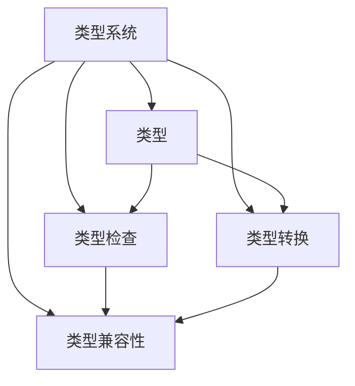

                 


### 第1章：类型系统的概述

#### 1.1.1 计算机编程中的类型系统

类型系统是计算机编程语言中的一个基本组成部分，它规定了数据如何存储、操作和传输。类型系统的重要性在于它能够帮助程序员更直观地理解和处理数据，同时也能提高程序的健壮性和可维护性。

在计算机编程中，类型系统大致可以分为以下几类：

1. **静态类型系统**：在编译或运行程序之前，变量的类型就已经确定。例如，C、C++和Java等语言都是静态类型语言。

2. **动态类型系统**：变量的类型是在程序运行时确定的。例如，Python、Ruby和JavaScript等语言都是动态类型语言。

3. **强类型系统**：变量只能赋值给与它类型兼容的值。大多数静态类型语言都是强类型语言。

4. **弱类型系统**：变量可以赋值给任何类型的值，编译器通常不会在编译时进行检查。例如，C语言就是弱类型语言。

#### 1.1.2 类型系统的基本概念

1. **类型**：类型是变量可以存储的值的集合。例如，整数类型、浮点数类型、字符串类型等。

2. **类型检查**：类型检查是指编译器或解释器在程序执行之前检查变量类型是否符合定义的过程。类型检查可以分为静态类型检查和动态类型检查。

3. **类型转换**：类型转换是指将一个类型的值转换为另一个类型的值。类型转换可以分为隐式转换和显式转换。

4. **类型兼容性**：类型兼容性是指两个类型的值可以进行赋值、运算或其他操作而不产生错误。类型兼容性可以分为类型严格兼容和类型宽泛兼容。

#### 1.1.3 类型系统的分类

1. **按作用范围分**：类型系统可以分为全局类型系统和局部类型系统。

   - **全局类型系统**：全局类型系统在整个程序中都可以访问的类型系统。

   - **局部类型系统**：局部类型系统只在特定作用域内有效的类型系统。

2. **按类型约束分**：类型系统可以分为强类型系统和弱类型系统。

   - **强类型系统**：强类型系统对变量的类型约束比较严格，通常要求变量的类型在编译时就已经确定。

   - **弱类型系统**：弱类型系统对变量的类型约束较宽松，通常允许变量在运行时改变类型。

3. **按类型检查分**：类型系统可以分为静态类型系统和动态类型系统。

   - **静态类型系统**：静态类型系统在编译时进行类型检查。

   - **动态类型系统**：动态类型系统在运行时进行类型检查。

通过以上内容，我们可以清晰地看到类型系统在计算机编程中的重要性和多样性。在接下来的章节中，我们将进一步探讨类型系统的原理、核心概念和联系，以及其在程序可视化中的应用。

### 核心概念与联系

在计算机编程中，类型系统是确保程序正确性和性能的关键因素。以下是一个用于描述类型系统中核心概念和联系的Mermaid流程图：



**核心概念：**

1. **类型（Type）**：类型是变量可以存储的值的集合。例如，整数类型、浮点数类型、字符串类型等。

2. **类型检查（Type Checking）**：类型检查是编译器或解释器在程序执行之前检查变量类型是否符合定义的过程。

3. **类型转换（Type Conversion）**：类型转换是指将一个类型的值转换为另一个类型的值。

4. **类型兼容性（Type Compatibility）**：类型兼容性是指两个类型的值可以进行赋值、运算或其他操作而不产生错误。

**联系：**

- 类型检查和类型兼容性紧密相关，类型检查的目的是确保类型兼容性。

- 类型转换是类型兼容性的一种实现方式，通过类型转换，不同类型的值可以相互赋值或运算。

通过这个Mermaid流程图，我们可以直观地看到类型系统中的核心概念以及它们之间的联系。这些概念和联系对于理解类型系统的原理和其在程序中的应用至关重要。

### 核心算法原理讲解

为了深入理解类型系统的核心算法原理，我们可以使用伪代码详细描述类型检查和类型转换的算法流程。

**类型检查算法：**

```python
def type_check(expression, expected_type):
    if isinstance(expression, expected_type):
        return True
    else:
        return False
```

在这个算法中，`isinstance` 函数用于检查表达式 `expression` 的类型是否与期望类型 `expected_type` 相同。如果类型相同，函数返回 `True`，表示类型检查通过；否则，返回 `False`。

**类型转换算法：**

```python
def type_convert(value, target_type):
    if target_type == 'int':
        return int(value)
    elif target_type == 'float':
        return float(value)
    elif target_type == 'str':
        return str(value)
    else:
        raise ValueError("Unsupported target type")
```

在这个算法中，根据目标类型 `target_type`，函数将值 `value` 转换为相应的类型。例如，如果目标类型是 `int`，函数将值转换为整数；如果目标类型是 `float`，函数将值转换为浮点数；如果目标类型是 `str`，函数将值转换为字符串。对于不支持的类型，函数抛出 `ValueError`。

通过这些伪代码，我们可以清晰地看到类型检查和类型转换的基本算法原理。这些算法在编译器或解释器中实现，确保程序在运行时类型安全。

### 数学模型和数学公式

在类型系统中，类型兼容性的判断可以通过数学模型来描述。以下是一个用于描述类型兼容性的数学公式：

$$
C(T_1, T_2) =
\begin{cases}
1, & \text{如果 } T_1 \text{ 和 } T_2 \text{ 是兼容的} \\
0, & \text{如果 } T_1 \text{ 和 } T_2 \text{ 是不兼容的}
\end{cases}
$$

在这个公式中，`C(T_1, T_2)` 表示类型 `T_1` 和类型 `T_2` 的兼容性。如果类型 `T_1` 和类型 `T_2` 是兼容的，则兼容性值 `C(T_1, T_2)` 为 1；如果不兼容，则兼容性值为 0。

为了更直观地理解这个数学模型，我们可以通过以下例子来说明：

**例子**：判断整数类型 `int` 和浮点数类型 `float` 的兼容性。

$$
C(int, float) = 1
$$

在这个例子中，整数类型和浮点数类型是兼容的，因为浮点数可以表示整数。

通过这个数学公式，我们可以量化类型兼容性，为类型系统的设计和实现提供理论基础。

### 第4章：类型系统在程序可视化中的作用

#### 4.1.1 可视化的基本概念

可视化是将复杂的数据或信息通过图形或图像的形式展示给用户的一种技术。在计算机编程中，可视化技术可以帮助开发者更直观地理解和分析代码结构，提高开发效率和代码质量。

可视化的基本概念包括：

1. **数据可视化**：通过图形或图像形式展示数据，帮助用户理解和分析数据。

2. **交互式可视化**：用户可以通过交互方式操作可视化界面，实现对数据的实时分析和处理。

3. **信息可视化**：将抽象的信息以直观的方式展示给用户，帮助用户快速获取关键信息。

#### 4.1.2 类型系统在可视化中的作用

类型系统在可视化中的作用主要体现在以下几个方面：

1. **代码结构可视化**：类型系统可以帮助开发者更直观地展示代码的结构和层次，例如类图、包图等。

2. **数据流可视化**：类型系统可以帮助追踪数据在程序中的流动过程，例如变量赋值、函数调用等。

3. **错误检测与调试**：类型系统可以在编译或运行时检测类型错误，帮助开发者快速定位和修复问题。

4. **性能优化**：类型系统可以提供有关代码性能的信息，帮助开发者进行性能优化。

#### 4.1.3 类型系统在可视化中的优势

类型系统在可视化中的优势主要体现在以下几点：

1. **提高开发效率**：通过可视化，开发者可以更直观地理解代码，减少误解和错误，提高开发效率。

2. **增强代码可读性**：类型系统可以帮助开发者清晰地了解变量的类型和用途，增强代码的可读性。

3. **优化性能**：通过可视化，开发者可以识别潜在的性能瓶颈，进行针对性的优化。

4. **辅助代码审查**：类型系统可以帮助团队成员更全面地了解代码结构，提高代码审查的效率和质量。

通过类型系统在可视化中的应用，开发者可以更好地理解和分析代码，提高开发效率和代码质量，从而提升整个软件项目的成功率和稳定性。

### 第5章：类型系统在程序可视化中的实现技术

#### 5.1.1 可视化工具和技术

在类型系统在程序可视化中的实现过程中，可视化工具和技术的选择至关重要。以下是一些常用的可视化工具和技术：

1. **图表库**：如D3.js、Plotly等，用于创建各种类型的图表和图形，帮助开发者直观展示数据。

2. **依赖关系图**：如Mermaid、Graphviz等，用于创建类图、包图、组件图等，展示代码的结构和依赖关系。

3. **交互式可视化平台**：如Tableau、Power BI等，提供强大的数据分析和可视化功能，适合对大量数据进行实时分析和展示。

4. **集成开发环境（IDE）**：如Visual Studio、Eclipse等，提供了丰富的可视化工具和插件，方便开发者进行代码调试和可视化分析。

5. **编程语言内置可视化工具**：如Python的Matplotlib、Pandas Visualization等，提供了简单易用的可视化库，方便开发者快速创建图表和图形。

#### 5.1.2 类型系统在可视化中的实现方法

类型系统在可视化中的实现方法主要包括以下几个方面：

1. **静态类型分析**：通过对代码进行静态类型分析，提取出类型信息，并将其可视化展示。例如，通过类图展示类的结构和继承关系，通过包图展示模块和依赖关系。

2. **数据流分析**：通过数据流分析，追踪数据在程序中的流动过程，并将其可视化展示。例如，通过控制流图展示函数调用和返回过程，通过数据依赖图展示变量赋值和传递过程。

3. **错误检测与调试**：通过类型检查和错误检测，将类型错误和潜在问题可视化展示。例如，通过错误标注和高亮显示，帮助开发者快速识别和修复问题。

4. **性能分析**：通过对代码性能进行测量和分析，将其可视化展示。例如，通过火焰图展示程序的性能瓶颈，通过时间轴展示函数的执行时间。

通过这些实现方法，开发者可以更直观地理解和分析代码，提高开发效率和代码质量。

#### 5.1.3 类型系统在可视化中的伪代码实现

为了更好地理解类型系统在可视化中的实现，我们可以使用伪代码描述其基本实现流程：

```python
def visualize_type_system(code, type_system):
    # 提取代码中的类型信息
    type_info = extract_type_info(code)
    
    # 创建类图
    class_diagram = create_class_diagram(type_info)
    
    # 创建包图
    package_diagram = create_package_diagram(type_info)
    
    # 创建控制流图
    control_flow_graph = create_control_flow_graph(code)
    
    # 创建数据依赖图
    data_dependency_graph = create_data_dependency_graph(code, type_system)
    
    # 可视化展示
    display_visualizations([class_diagram, package_diagram, control_flow_graph, data_dependency_graph])
```

在这个伪代码中，`extract_type_info` 函数用于提取代码中的类型信息，`create_class_diagram`、`create_package_diagram`、`create_control_flow_graph` 和 `create_data_dependency_graph` 函数分别用于创建类图、包图、控制流图和数据依赖图，`display_visualizations` 函数用于将可视化结果展示给用户。

通过这个伪代码，我们可以清晰地看到类型系统在可视化中的实现步骤和关键功能。

### 第6章：类型系统在程序可视化中的案例分析

#### 6.1.1 案例一：类型系统在数据可视化中的应用

在本案例中，我们将通过一个简单的Python示例，展示类型系统在数据可视化中的应用。假设我们有一个包含学生成绩的数据集，我们需要使用Matplotlib库来绘制成绩分布图。

**代码实现：**

```python
import matplotlib.pyplot as plt
import pandas as pd

# 加载数据
data = pd.read_csv('student_scores.csv')

# 可视化成绩分布
plt.figure(figsize=(10, 5))
plt.scatter(data['student_id'], data['score'])
plt.title('Student Score Distribution')
plt.xlabel('Student ID')
plt.ylabel('Score')
plt.show()
```

**代码解读与分析：**

1. **数据加载**：使用Pandas库加载CSV文件，获取学生成绩数据。
2. **可视化展示**：使用Matplotlib库绘制散点图，展示每个学生的成绩分布。通过设置`xlabel`和`ylabel`，分别设置X轴和Y轴的标签，通过`title`设置图表标题。

在这个案例中，类型系统的作用主要体现在两个方面：

1. **数据类型检查**：Pandas库在加载CSV文件时，会自动检测并确定每个列的数据类型。例如，`student_id`列被识别为整数类型，`score`列被识别为浮点数类型。这种类型检查确保了数据在可视化过程中的一致性和正确性。

2. **类型兼容性**：在绘制散点图时，Pandas库提供的`scatter`函数能够接受整数类型和浮点数类型的数据，从而实现数据的无缝转换和可视化。

#### 6.1.2 案例二：类型系统在交互式编程中的应用

在本案例中，我们将使用JavaScript和D3.js库来创建一个交互式图表，展示不同年份的GDP数据。

**代码实现：**

```javascript
const dataset = [
  {year: 2010, gdp: 1400000000},
  {year: 2011, gdp: 1500000000},
  {year: 2012, gdp: 1600000000},
  {year: 2013, gdp: 1650000000},
  {year: 2014, gdp: 1700000000}
];

const margin = {top: 20, right: 30, bottom: 40, left: 50},
    width = 960 - margin.left - margin.right,
    height = 500 - margin.top - margin.bottom;

const x = d3.scaleLinear().domain([2010, 2014]).range([0, width]);
const y = d3.scaleLinear().domain([0, 1700000000]).range([height, 0]);

const line = d3.line()
  .x(d => x(d.year))
  .y(d => y(d.gdp));

const svg = d3.select("body").append("svg")
  .attr("width", width + margin.left + margin.right)
  .attr("height", height + margin.top + margin.bottom)
  .append("g")
  .attr("transform", "translate(" + margin.left + "," + margin.top + ")");

svg.append("path")
  .datum(dataset)
  .attr("fill", "none")
  .attr("stroke", "steelblue")
  .attr("stroke-width", 1.5)
  .attr("d", line);

svg.append("g")
  .attr("transform", "translate(0," + height + ")")
  .call(d3.axisBottom(x));

svg.append("g")
  .call(d3.axisLeft(y));
```

**代码解读与分析：**

1. **数据准备**：定义一个包含年份和GDP数据的数组，每个元素都是一个包含`year`和`gdp`属性的对象。
2. **缩放函数**：使用D3.js创建线性缩放函数`x`和`y`，分别用于X轴和Y轴的数据映射。
3. **线图生成**：使用D3.js的`line`函数创建线图，并通过`attr`方法设置路径属性，如颜色、宽度等。
4. **轴生成**：使用D3.js创建X轴和Y轴，并通过`call`方法将轴添加到SVG元素中。

在这个案例中，类型系统的作用主要体现在两个方面：

1. **变量类型检查**：JavaScript在执行代码时，会自动检查变量的类型。例如，`dataset`数组中的每个元素都是对象类型，`year`和`gdp`属性都是数字类型。这种类型检查确保了数据在可视化过程中的一致性和正确性。

2. **类型兼容性**：D3.js库中的函数和属性能够接受各种类型的数据，例如数字、字符串等。这种类型兼容性使得开发者可以灵活地处理和转换数据，从而实现高效的可视化。

#### 6.1.3 案例三：类型系统在Web编程中的应用

在本案例中，我们将使用React和D3.js库创建一个交互式Web图表，展示不同国家的气候数据。

**代码实现：**

```jsx
import React, { useState, useEffect } from 'react';
import * as d3 from 'd3';
import './ClimateChart.css';

const ClimateChart = () => {
  const [climateData, setClimateData] = useState([]);

  useEffect(() => {
    // 加载气候数据
    d3.csv('climate_data.csv').then(data => {
      setClimateData(data);
    });
  }, []);

  // 可视化气候数据
  const drawChart = () => {
    const width = 600;
    const height = 400;
    const margin = { top: 20, right: 30, bottom: 40, left: 50 };

    const x = d3.scaleBand().domain(climateData.map(d => d.country)).range([0, width - margin.left - margin.right]);
    const y = d3.scaleLinear().domain([0, d3.max(climateData, d => +d.temperature)]).range([height - margin.top - margin.bottom, 0]);

    const svg = d3.select('.climate-chart').append('svg')
      .attr('width', width + margin.left + margin.right)
      .attr('height', height + margin.top + margin.bottom)
      .append('g')
      .attr('transform', `translate(${margin.left}, ${margin.top})`);

    svg.append('g')
      .attr('transform', `translate(0, ${height - margin.top - margin.bottom})`)
      .call(d3.axisBottom(x));

    svg.append('g').call(d3.axisLeft(y));

    svg.selectAll('.bar')
      .data(climateData)
      .enter().append('rect')
      .attr('class', 'bar')
      .attr('x', d => x(d.country))
      .attr('y', d => y(d.temperature))
      .attr('width', x.bandwidth())
      .attr('height', d => height - margin.top - margin.bottom - y(d.temperature));
  };

  useEffect(() => {
    if (climateData.length > 0) {
      drawChart();
    }
  }, [climateData]);

  return (
    <div className="climate-chart-container">
      <div className="climate-chart" />
    </div>
  );
};

export default ClimateChart;
```

**代码解读与分析：**

1. **数据加载**：使用React的`useState`和`useEffect`钩子，从CSV文件中加载气候数据，并将其存储在`climateData`状态变量中。
2. **可视化图表**：定义`drawChart`函数，使用D3.js创建柱状图，展示不同国家的温度数据。
3. **SVG元素**：创建SVG元素，设置宽度和高度，添加X轴和Y轴，以及柱状图。
4. **交互性**：通过`useEffect`钩子，在数据加载完成后调用`drawChart`函数，更新图表。

在这个案例中，类型系统的作用主要体现在两个方面：

1. **状态管理**：React的`useState`钩子用于管理组件的状态，确保数据的一致性和正确性。React在状态更新时会自动检查数据的类型，从而保证数据在组件生命周期中的正确性。

2. **类型兼容性**：D3.js库中的函数和属性能够处理各种类型的数据，例如字符串、数字等。这种类型兼容性使得开发者可以灵活地处理和转换数据，从而实现高效的Web可视化。

通过这三个案例，我们可以看到类型系统在程序可视化中的多种应用场景。类型系统不仅提高了代码的可读性和可维护性，还为开发者提供了强大的工具，帮助他们更直观地理解和分析复杂的数据和代码结构。

### 第7章：类型系统在程序可视化中的未来发展趋势

#### 7.1.1 类型系统在程序可视化中的未来方向

随着技术的不断进步，类型系统在程序可视化中的应用前景愈发广阔。以下是类型系统在程序可视化中的几个未来发展方向：

1. **智能类型推断**：未来类型系统可能会更加智能化，通过机器学习和自然语言处理技术，自动推断变量的类型，减少手动类型声明的需求。

2. **跨语言类型兼容**：为了提高开发效率和代码的可移植性，未来类型系统可能会实现跨语言类型兼容，使得不同编程语言之间的数据交换更加顺畅。

3. **实时类型检查与修复**：随着实时编程和DevOps的兴起，类型系统可能会具备实时检查和修复能力，在代码提交和部署过程中及时发现和修复类型错误。

4. **分布式类型系统**：在分布式计算和微服务架构中，类型系统可能会扩展到分布式环境，提供统一的数据类型管理和类型兼容性保障。

5. **增强可视化功能**：未来类型系统可能会集成更多高级可视化功能，如动态交互、三维可视化等，为开发者提供更丰富的可视化体验。

#### 7.1.2 类型系统在程序可视化中的挑战和机遇

尽管类型系统在程序可视化中具有巨大潜力，但也面临一些挑战和机遇：

**挑战：**

1. **性能优化**：类型系统的复杂性和可视化需求可能会对性能产生负面影响，需要优化算法和数据结构，确保高效运行。

2. **兼容性问题**：不同编程语言和框架之间的类型兼容性问题可能成为障碍，需要开发统一的类型系统和跨语言解决方案。

3. **用户体验**：为了提高开发者使用类型系统的效率，可视化工具和界面设计需要不断优化，提供更好的用户体验。

**机遇：**

1. **技术创新**：随着计算机科学和人工智能技术的发展，类型系统在可视化中的应用将不断推陈出新，带来更多创新可能性。

2. **市场需求**：随着软件开发的复杂性和规模不断增加，对类型系统在程序可视化中的应用需求也将持续增长。

3. **产业合作**：类型系统供应商、软件开发企业和学术界可以加强合作，共同推动类型系统在程序可视化中的发展。

通过应对这些挑战和抓住机遇，类型系统在程序可视化中的应用将不断成熟，为软件开发带来新的变革。

### 附录

#### 第8章：类型系统相关的资源和工具

为了帮助开发者更好地理解和应用类型系统，以下是类型系统相关的资源和工具推荐：

1. **开源类型系统框架**：

   - TypeScript：一种静态类型脚本语言，为JavaScript提供了类型检查和静态类型支持。
   - Flow：Facebook 开发的静态类型检查工具，用于 JavaScript。
   - Haskell：一种纯函数式编程语言，以其强大的类型系统著称。

2. **类型系统研究论文和书籍推荐**：

   - 《Type Systems for Programming Languages》: William R. Cook 著，是一本全面介绍类型系统的经典教材。
   - 《Types and Programming Languages》: Benjamin C. Pierce 著，深入探讨了各种类型系统和类型检查算法。

3. **类型系统相关的在线资源和工具**：

   - Type System Explorer：一个在线工具，用于探索不同编程语言的类型系统。
   - Type Checker：一个在线类型检查器，用于验证代码中的类型兼容性。

通过这些资源和工具，开发者可以更深入地了解类型系统，并在实际项目中有效应用。

