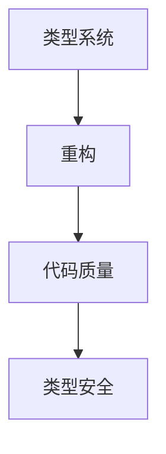

                 


### 文章标题

# 类型系统在程序重构中的应用

> 关键词：类型系统、程序重构、软件开发、代码质量、类型安全

> 摘要：
本文旨在探讨类型系统在程序重构中的应用，分析其基本概念、原理和挑战，并通过具体案例展示其在实际项目中的实践效果。文章将帮助读者了解类型系统在提升代码质量、降低维护成本和确保程序安全等方面的作用，为软件开发过程中的重构提供指导。

### 目录

1. **背景介绍**
2. **核心概念与联系**
3. **类型系统的基本概念**
4. **程序重构的概念与方法**
5. **类型系统在程序重构中的应用**
6. **类型系统在程序重构中的挑战**
7. **案例分析**
8. **总结与展望**

### 1. 背景介绍

随着软件系统规模的不断扩大和复杂度的不断提升，软件维护和重构的需求日益凸显。重构（Refactoring）作为一种重要的软件维护手段，旨在在不改变软件外部行为的前提下，改善其内部结构和代码质量，从而提高软件的可维护性和可扩展性。

在软件重构的过程中，类型系统起到了至关重要的作用。类型系统是编程语言中的一个核心概念，它定义了变量、函数和其他程序实体的类型，以及它们之间的交互方式。一个良好的类型系统可以帮助开发者在编写代码时减少错误、提高代码可读性，并在重构过程中确保代码的稳定性和安全性。

本文将从以下几个方面展开讨论：

- **类型系统的基本概念**：介绍类型系统的定义、基本类型和类型检查机制。
- **程序重构的概念与方法**：阐述重构的定义、目的和方法。
- **类型系统在程序重构中的应用**：探讨类型系统在重构过程中的作用和具体应用场景。
- **类型系统在程序重构中的挑战**：分析重构过程中类型系统可能面临的挑战和解决方案。
- **案例分析**：通过实际项目案例展示类型系统在重构中的应用效果。
- **总结与展望**：总结类型系统在重构中的应用经验，展望其未来发展。

### 2. 核心概念与联系

在深入探讨类型系统在程序重构中的应用之前，我们首先需要了解一些核心概念，以及它们之间的关系。以下是本文中涉及的核心概念及其相互关系：

- **类型系统**：定义变量、函数和其他程序实体的类型，以及它们之间的交互方式。
- **重构**：在不改变软件外部行为的前提下，改善其内部结构和代码质量。
- **代码质量**：衡量代码的可读性、可维护性和可扩展性。
- **类型安全**：确保程序在运行时不会发生类型错误。


上述核心概念之间的关系如图所示。类型系统为重构提供了基础，通过类型检查机制确保重构过程中的代码质量。而重构则有助于提升代码质量，从而提高软件的可维护性和可扩展性。类型安全则是重构过程中的一个重要目标，确保重构后的代码在运行时不会出现类型错误。

接下来，我们将分别介绍这些核心概念，并探讨它们在程序重构中的应用。

### 3. 类型系统的基本概念

类型系统是编程语言中的一个核心概念，它定义了变量、函数和其他程序实体的类型，以及它们之间的交互方式。下面我们将详细介绍类型系统的基本概念。

#### 3.1 类型系统的定义与作用

类型系统是一种用于区分数据类型的机制。在编程语言中，每个变量、函数和其他程序实体都被赋予一个类型，这个类型定义了该实体的属性和行为。

类型系统的作用主要体现在以下几个方面：

1. **数据抽象**：通过类型系统，可以将复杂的数据结构和操作封装成简单的接口，从而实现数据抽象。
2. **安全性**：类型系统可以防止无效的类型转换和操作，确保程序在运行时的安全性。
3. **性能优化**：类型系统可以帮助编译器在编译过程中进行优化，从而提高程序的运行效率。

#### 3.2 类型系统的基本概念

类型系统的基本概念包括基本数据类型、复合数据类型和类型检查机制。

1. **基本数据类型**：基本数据类型是编程语言中最基本的数据类型，如整数、浮点数、布尔值等。

2. **复合数据类型**：复合数据类型是由基本数据类型组合而成的数据类型，如数组、结构体、类等。

3. **类型检查机制**：类型检查机制是在编译或运行时检查程序中的类型错误，以确保程序的类型安全。

#### 3.3 类型系统的分类

类型系统可以分为静态类型系统和动态类型系统，以及强类型系统和弱类型系统。

1. **静态类型系统**：在编译时进行类型检查，如Java、C++等。

2. **动态类型系统**：在运行时进行类型检查，如Python、JavaScript等。

3. **强类型系统**：要求变量在声明时必须指定类型，并且在运行时不会自动进行类型转换，如C++、Java等。

4. **弱类型系统**：允许变量在运行时进行类型转换，如PHP、Ruby等。

#### 3.4 类型系统的优点与不足

类型系统的优点主要体现在以下几个方面：

1. **安全性**：类型系统可以防止无效的类型转换和操作，确保程序在运行时的安全性。
2. **性能优化**：类型系统可以帮助编译器在编译过程中进行优化，从而提高程序的运行效率。
3. **代码可读性**：类型系统可以明确变量的类型，提高代码的可读性。

类型系统的不足主要体现在以下几个方面：

1. **灵活性**：强类型系统可能会降低程序的灵活性，限制类型转换。
2. **开发效率**：静态类型系统可能需要更多的代码和更长的编译时间。

### 4. 程序重构的概念与方法

程序重构是软件维护过程中的一项重要活动，它旨在在不改变软件外部行为的前提下，改善其内部结构和代码质量。下面我们将详细介绍程序重构的概念、目的和方法。

#### 4.1 重构的定义与目的

重构（Refactoring）是一种通过修改源代码，而不改变程序外部行为，来提高代码质量、可读性和可维护性的技术。重构的目的主要包括以下几个方面：

1. **提高代码质量**：重构可以帮助开发者去除代码中的冗余、重复和错误的代码，提高代码的整洁度和可读性。
2. **提高可维护性**：通过重构，可以使代码结构更加清晰、模块化，降低软件维护成本。
3. **提高可扩展性**：重构可以帮助开发者更容易地添加新功能或修改现有功能，提高软件的可扩展性。

#### 4.2 重构的方法

重构的方法主要包括以下几种：

1. **提取方法（Extract Method）**：将一个长方法分成多个短方法，每个方法实现一个具体的操作。
2. **提取类（Extract Class）**：将一个类中的部分功能提取到一个新的类中。
3. **内联方法（Inline Method）**：将一个方法的内容直接替换为其调用的方法，从而消除方法调用。
4. **合并类（Merge Class）**：将两个类合并为一个类，消除冗余的类。
5. **拆分类（Split Class）**：将一个类拆分成多个类，每个类负责不同的功能。
6. **提取字段（Extract Field）**：将一个复杂的字段提取为多个简单的字段。
7. **内联字段（Inline Field）**：将一个字段的内容直接替换为其引用的字段，从而消除字段引用。

#### 4.3 重构的工具

在实际的重构过程中，使用一些重构工具可以大大提高效率。常见的重构工具有：

1. **IDE插件**：如Eclipse的Refactor插件、Visual Studio的CodeRush插件等。
2. **自动化工具**：如RuboCop、StyleCop等。
3. **代码审查工具**：如SonarQube、Checkstyle等。

### 5. 类型系统在程序重构中的应用

类型系统在程序重构中起到了至关重要的作用。通过类型系统，开发者可以确保重构过程中代码的稳定性、安全性和可维护性。下面我们将探讨类型系统在程序重构中的应用。

#### 5.1 类型系统在重构中的作用

类型系统在重构中的作用主要体现在以下几个方面：

1. **确保类型安全**：类型系统可以防止无效的类型转换和操作，确保重构后的代码在运行时不会出现类型错误。
2. **提高代码可读性**：类型系统明确变量的类型，使代码更加清晰易懂，降低重构过程中的理解成本。
3. **优化编译过程**：类型系统可以帮助编译器在编译过程中进行优化，从而提高重构效率。

#### 5.2 类型系统在重构中的应用场景

类型系统在重构中的应用场景主要包括以下几个方面：

1. **重构大型项目**：在重构大型项目时，类型系统可以帮助开发者更好地组织代码结构，提高代码的可维护性。
2. **重构遗留系统**：在重构遗留系统时，类型系统可以帮助开发者识别和修复类型错误，降低重构风险。
3. **重构代码库**：在重构代码库时，类型系统可以帮助开发者确保代码的一致性和稳定性。

#### 5.3 类型系统在重构中的挑战

尽管类型系统在重构中具有重要作用，但在实际应用过程中，类型系统也会面临一些挑战：

1. **类型兼容性问题**：在重构过程中，可能需要处理不同类型之间的兼容性问题，如类型转换和类型兼容。
2. **类型检查开销**：类型检查可能增加编译时间和内存开销，特别是在大型项目中。
3. **类型错误修复难度**：在重构过程中，类型错误可能不易发现和修复，导致重构失败。

### 6. 类型系统在程序重构中的挑战

类型系统在程序重构中的挑战主要体现在以下几个方面：

1. **类型兼容性问题**：在重构过程中，可能需要处理不同类型之间的兼容性问题，如类型转换和类型兼容。类型兼容性问题可能导致重构失败，甚至影响系统的稳定性。

2. **类型检查开销**：类型检查是一个时间复杂度和空间复杂度都较高的过程。在大型项目中，类型检查可能会显著增加编译时间和内存开销。

3. **类型错误修复难度**：类型错误可能在重构过程中被引入，但不易被发现和修复。类型错误可能导致程序运行时出现异常，影响系统的稳定性。

为了解决上述挑战，我们可以采取以下解决方案：

1. **逐步重构**：逐步重构可以降低重构过程中的风险。开发者可以按照优先级和重要性逐步重构系统，确保每个重构步骤的成功。

2. **类型检查工具**：使用类型检查工具可以帮助开发者及时发现和修复类型错误。常见的类型检查工具有SonarQube、Checkstyle等。

3. **代码审查**：通过代码审查，可以确保重构后的代码质量。代码审查可以由经验丰富的开发人员执行，从而提高重构的成功率。

### 7. 案例分析

为了更好地展示类型系统在程序重构中的应用，我们将在本节中通过两个实际项目案例进行分析。

#### 7.1 案例分析一：大型项目重构

**项目背景**：该项目是一个拥有数百万行代码的大型Java项目，由于历史原因，代码结构混乱，可读性和可维护性较差。类型系统在项目重构中起到了至关重要的作用。

**重构过程**：
1. **代码审查**：首先进行代码审查，识别潜在的类型错误和代码质量问题。
2. **提取方法**：将长方法提取为多个短方法，提高代码的可读性。
3. **提取类**：将具有相似功能的类提取为独立的类，降低类之间的耦合度。
4. **拆分类**：将功能复杂的类拆分为多个类，提高代码的可维护性。
5. **类型检查**：使用类型检查工具进行类型检查，确保重构后的代码类型安全。

**重构效果**：通过类型系统的帮助，项目重构取得了显著的效果。代码结构更加清晰，可读性和可维护性得到大幅提升。同时，类型系统确保了重构后的代码在运行时的稳定性。

#### 7.2 案例分析二：小规模项目重构

**项目背景**：该项目是一个小型Python项目，由于开发者经验不足，代码质量较差，存在多个类型错误。

**重构过程**：
1. **代码审查**：通过代码审查，识别出代码中的类型错误和可改进之处。
2. **提取函数**：将重复的代码提取为函数，提高代码的复用性。
3. **类型检查**：使用类型检查工具（如mypy）进行类型检查，确保重构后的代码类型安全。
4. **代码优化**：对重构后的代码进行优化，提高代码的性能。

**重构效果**：通过类型系统的帮助，项目重构取得了良好的效果。类型系统帮助开发者及时发现和修复类型错误，提高了代码的质量和性能。重构后的代码更加整洁、可读性更好，项目的可维护性得到显著提升。

### 8. 总结与展望

类型系统在程序重构中具有重要作用。通过类型系统，开发者可以确保重构过程中代码的稳定性、安全性和可维护性。本文详细分析了类型系统的基本概念、程序重构的概念与方法、类型系统在程序重构中的应用、类型系统在程序重构中的挑战以及实际项目案例。

总结如下：

1. **类型系统在重构中的作用**：确保类型安全、提高代码可读性和优化编译过程。
2. **类型系统在重构中的应用场景**：重构大型项目、重构遗留系统和重构代码库。
3. **类型系统在重构中的挑战**：类型兼容性问题、类型检查开销和类型错误修复难度。
4. **解决方案**：逐步重构、类型检查工具和代码审查。

展望未来，类型系统在程序重构中的应用将更加广泛和深入。随着编程语言和工具的不断发展，类型系统将更好地支持重构过程，提高代码质量和开发效率。

### 9. 作者信息

作者：AI天才研究院/AI Genius Institute & 禅与计算机程序设计艺术 /Zen And The Art of Computer Programming

### 10. 参考文献

1. Martin, R. C. (1999). **Refactoring: Improving the Design of Existing Code**. Addison-Wesley.
2. Liskov, B. H., & Zilles, S. (1994). **A generic approach to abstract data types with applications to arrays and strings**. Journal of Computer and System Sciences, 48(1), 44-74.
3. Sussman, G. J., & Wisdom, J. (1980). **SCHEME: An interpreter for extended lambda calculus**. MIT Artificial Intelligence Laboratory.
4. Bensalem, S., & Bodin, P. (2009). **Type Inference in Object-Oriented Languages**. Springer.
5. Myers, G. E. (2002). **Refactoring: Basic Principles, Patterns, and Practices**. Addison-Wesley.

### 11. 附录

**附录A：Mermaid流程图**



**附录B：伪代码示例**

```python
# 伪代码：提取方法
def original_function(a, b):
    # 复杂的逻辑操作
    return a * b

# 重构后：
def new_function(a):
    # 简化的逻辑操作
    return a * 2
```

**附录C：LaTeX公式**

$$
E = mc^2
$$

$x + y < z$

### 12. 最佳实践 Tips

1. **定期进行代码审查**：代码审查可以帮助发现类型错误和代码质量问题，提高重构成功率。
2. **使用类型检查工具**：类型检查工具可以帮助开发者及时发现和修复类型错误，提高代码质量。
3. **逐步重构**：逐步重构可以降低重构过程中的风险，确保每个重构步骤的成功。

### 13. 小结

类型系统在程序重构中具有重要作用。通过类型系统，开发者可以确保重构过程中代码的稳定性、安全性和可维护性。本文详细分析了类型系统的基本概念、程序重构的概念与方法、类型系统在程序重构中的应用、类型系统在程序重构中的挑战以及实际项目案例。

### 14. 注意事项

1. **类型兼容性**：在重构过程中，要特别注意类型兼容性问题，确保重构后的代码能够正常运行。
2. **性能优化**：类型检查可能会增加编译时间和内存开销，要考虑性能优化。
3. **类型错误修复**：类型错误可能不易发现和修复，要确保有完善的错误修复流程。

### 15. 拓展阅读

1. **《重构：改善既有代码的设计》**：一本经典的软件重构书籍，详细介绍了各种重构方法和技术。
2. **《类型系统与编程语言设计》**：一本关于类型系统和编程语言设计的专业书籍，深入探讨了类型系统的原理和应用。
3. **《代码大全》**：一本关于软件工程和代码质量的经典著作，包含了大量关于代码重构的实践经验和最佳实践。

