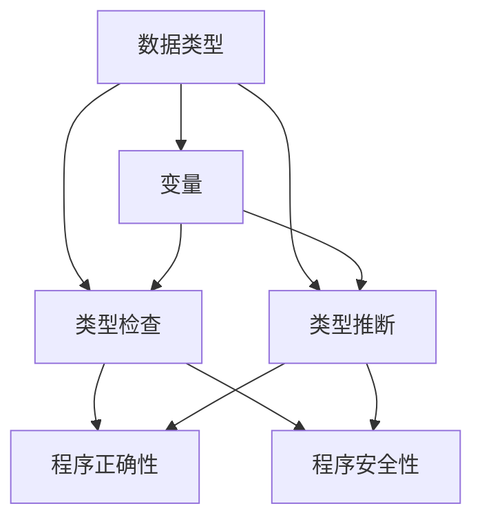

                 

# 《类型系统在编程语言可扩展性设计中的作用》

## 关键词

编程语言、类型系统、可扩展性、安全性、性能、泛型编程、静态类型、动态类型

## 摘要

类型系统是编程语言的核心组成部分，它不仅影响程序的安全性，还直接关系到编程语言的可扩展性。本文将深入探讨类型系统在编程语言可扩展性设计中的作用，从理论基础到实际应用，分析类型系统如何支持语言的扩展性设计。文章将详细讨论类型系统的基本概念、分类、核心概念、类型系统与安全性和性能的关系，并举例说明类型系统在实际编程语言和框架中的应用。

## 引言

随着计算机技术的发展，编程语言不断演变，从简单的机器语言到高级的脚本语言，从静态类型语言到动态类型语言，编程语言的可扩展性变得越来越重要。编程语言的可扩展性是指其能够灵活适应新的编程需求和场景的能力。一个具有良好可扩展性的编程语言可以降低开发难度，提高开发效率，并使开发者能够更好地应对未来技术变革。

类型系统作为编程语言的核心组成部分，其设计直接影响到编程语言的可扩展性。类型系统不仅提供了程序的基本结构和数据类型，还通过类型检查和类型推断等机制保证了程序的正确性和安全性。本文将围绕类型系统在编程语言可扩展性设计中的作用，逐步分析类型系统的理论基础、核心概念、类型系统与安全性和性能的关系，并探讨类型系统在实际编程语言和框架中的应用。

## 第一部分：类型系统的理论基础

### 第1章：编程语言中的类型系统概述

#### 1.1 类型系统的基本概念

类型系统（Type System）是编程语言的一部分，用于定义数据类型和变量之间的关系。在编程语言中，数据类型决定了变量能够存储的数据种类和操作方式。例如，整数类型可以存储整数，字符串类型可以存储文本。

类型系统可以看作是编程语言的“词典”，它规定了变量和表达式在程序中的合法取值和操作。一个有效的类型系统应该具有以下特性：

- **确定性**：给定一个程序和一组变量，类型系统能够明确地确定每个变量的类型。
- **一致性**：类型系统应该保证程序中的数据类型之间的一致性，防止类型不匹配的错误。
- **可扩展性**：类型系统应该允许开发者定义新的数据类型和操作，以便于编程语言能够适应新的编程需求和场景。

#### 1.2 编程语言中的类型系统分类

类型系统可以根据类型检查的时机和类型检查的严格性进行分类。常见的类型系统分类如下：

- **静态类型系统（Static Type System）**：静态类型系统在编译时对程序进行类型检查。这意味着编译器在编译程序时能够确定所有变量的类型，从而在运行前发现类型错误。静态类型系统通常具有较高的类型安全性，但可能需要更多的编译时间。

- **动态类型系统（Dynamic Type System）**：动态类型系统在运行时对程序进行类型检查。这意味着程序的类型信息只在运行时进行检查，允许程序在运行时改变其类型。动态类型系统通常具有较高的开发效率和灵活性，但可能存在类型不匹配的风险。

- **强类型系统（Strong Type System）**：强类型系统严格限制数据类型的转换，以防止类型不匹配的错误。在强类型系统中，变量一旦声明了类型，就不能在运行时改变其类型。

- **弱类型系统（Weak Type System）**：弱类型系统对数据类型的转换限制较少，允许运行时类型转换。弱类型系统可能更易于编程，但可能带来更多的潜在错误。

#### 1.3 类型系统的优缺点

每种类型系统都有其优缺点，选择合适的类型系统取决于编程需求和场景。

- **静态类型系统的优点**：

  - 提高程序的安全性：静态类型系统可以在编译时发现类型错误，降低运行时错误的风险。
  - 提高代码的可读性和维护性：静态类型系统提供了明确的类型信息，有助于代码的可读性和维护。

- **静态类型系统的缺点**：

  - 编译时间较长：静态类型系统需要在编译时进行类型检查，可能需要更多的时间。
  - 弹性较小：静态类型系统可能不适合一些动态编程场景。

- **动态类型系统的优点**：

  - 提高开发效率：动态类型系统在运行时进行类型检查，允许更灵活的编程。
  - 易于集成和扩展：动态类型系统通常具有更好的集成和扩展性，能够更好地适应新的编程需求和场景。

- **动态类型系统的缺点**：

  - 类型安全性较低：动态类型系统可能在运行时发现类型错误，可能导致程序崩溃。
  - 可读性和维护性较差：动态类型系统可能缺乏明确的类型信息，降低代码的可读性和维护性。

### 第2章：类型系统的核心概念

#### 2.1 类型检查

类型检查（Type Checking）是类型系统的核心功能之一。类型检查分为静态类型检查和动态类型检查。

- **静态类型检查**：静态类型检查在编译时进行，编译器会检查每个变量和表达式的类型是否匹配。静态类型检查可以及早发现类型错误，提高程序的安全性。

- **动态类型检查**：动态类型检查在运行时进行，解释器会在运行时检查变量和表达式的类型是否匹配。动态类型检查允许程序在运行时改变类型，但可能存在类型不匹配的风险。

#### 2.2 泛型编程

泛型编程（Generic Programming）是一种编程范式，它允许开发者编写与数据类型无关的代码。泛型编程的主要目标是提高代码的可重用性和可扩展性。

- **泛型类型**：泛型类型是一种与特定数据类型无关的类型，它可以通过类型参数来表示。泛型类型可以用于定义泛型类、泛型方法和泛型接口。

- **泛型方法**：泛型方法是一种与特定数据类型无关的方法，它可以通过类型参数来表示。泛型方法可以用于处理不同类型的数据，从而提高代码的可重用性。

- **泛型类**：泛型类是一种与特定数据类型无关的类，它可以通过类型参数来表示。泛型类可以用于创建泛型数据结构，从而提高代码的可扩展性。

#### 2.3 枚举类型

枚举类型（Enum）是一种特殊的数据类型，它用于定义一组命名的常量。枚举类型可以用于表示一组固定值的集合，例如颜色、月份等。

- **枚举类型的定义**：枚举类型通过关键字 `enum` 来定义，它包含一系列命名的常量。

- **枚举类型的用法**：枚举类型可以用于声明变量，限制变量的取值范围。此外，枚举类型还可以用于实现多态和类型安全。

### 第3章：类型系统在编程语言设计中的作用

#### 3.1 类型系统与安全性

类型系统在提高程序安全性方面起着关键作用。通过类型检查，类型系统可以及时发现和防止类型错误，从而降低程序出错的风险。

- **静态类型系统与安全性**：静态类型系统可以在编译时发现类型错误，从而避免运行时错误。静态类型系统还允许更严格的类型转换，从而减少类型不匹配的风险。

- **动态类型系统与安全性**：动态类型系统虽然允许更灵活的编程，但可能存在类型不匹配的风险。为了提高动态类型系统的安全性，可以使用类型检查器、类型注解等机制来确保程序的正确性。

#### 3.2 类型系统与可扩展性

类型系统在提高编程语言的可扩展性方面也发挥着重要作用。通过泛型编程和枚举类型等机制，类型系统允许开发者定义新的数据类型和操作，从而提高编程语言的灵活性和适应性。

- **泛型编程与可扩展性**：泛型编程允许开发者编写与数据类型无关的代码，从而提高代码的可重用性和可扩展性。泛型编程可以用于创建通用的数据结构和算法，从而适应不同的编程场景。

- **枚举类型与可扩展性**：枚举类型可以用于定义一组固定值的集合，从而提高程序的易读性和可维护性。通过枚举类型，开发者可以方便地定义和管理复杂的数据类型，从而提高编程语言的扩展性。

#### 3.3 类型系统与性能

类型系统对编程语言的性能也有一定影响。静态类型系统通常具有较高的运行效率，因为编译器可以在编译时进行类型优化。动态类型系统通常需要更多的运行时开销，因为类型检查是在运行时进行的。

- **静态类型系统与性能**：静态类型系统可以在编译时进行类型优化，从而提高程序的运行效率。静态类型系统还可以减少运行时类型检查的开销，从而提高程序的执行速度。

- **动态类型系统与性能**：动态类型系统虽然在灵活性方面具有优势，但可能需要更多的运行时开销。为了提高动态类型系统的性能，可以使用即时编译（JIT）等技术来优化运行时性能。

### 第4章：类型系统在实际编程语言中的应用

#### 4.1 C++中的类型系统

C++是一种静态类型语言，它提供了丰富的类型系统，包括基本数据类型、指针、引用、类和结构体等。

- **基本数据类型**：C++提供了多种基本数据类型，如整数、浮点数、布尔值等。

- **指针与引用**：指针和引用是C++类型系统中的重要组成部分，它们用于指向和操作内存地址。

- **类与结构体**：C++支持类和结构体，类是一种用户定义的数据类型，可以包含成员变量和成员函数；结构体是一种复合数据类型，可以包含多个不同数据类型的成员。

#### 4.2 Java中的类型系统

Java是一种静态类型语言，它提供了丰富的类型系统，包括基本数据类型、类和接口等。

- **基本数据类型**：Java提供了多种基本数据类型，如整数、浮点数、布尔值等。

- **类与接口**：Java支持类和接口，类是一种用户定义的数据类型，可以包含成员变量和成员函数；接口是一种抽象数据类型，可以定义一组方法。

#### 4.3 TypeScript中的类型系统

TypeScript是一种静态类型语言，它基于JavaScript，并引入了静态类型系统。TypeScript的类型系统提供了丰富的类型定义和类型推断机制。

- **接口与类型定义**：TypeScript支持接口和类型定义，接口可以用于定义一组属性和方法；类型定义可以用于定义新的数据类型。

- **泛型编程**：TypeScript支持泛型编程，泛型可以用于编写与数据类型无关的代码，从而提高代码的可重用性和可扩展性。

### 第5章：类型系统在框架和库设计中的角色

类型系统在框架和库设计中也发挥着重要作用。类型系统可以用于定义框架和库的接口，提供类型安全性和灵活性。

- **React中的类型系统**：React是一种流行的前端框架，它使用了TypeScript作为其默认语言。TypeScript的类型系统可以用于定义React组件的类型，提供类型安全性和类型推断。

- **Spring Framework中的类型系统**：Spring Framework是一种流行的后端框架，它使用了Java作为其默认语言。Spring Framework中的类型系统可以用于定义Bean的类型和依赖注入的类型安全。

- **GraphQL中的类型系统**：GraphQL是一种查询语言，它使用了静态类型系统。GraphQL的类型系统可以用于定义查询的类型，提供类型安全和性能优化。

### 第6章：类型系统在扩展编程语言中的设计

类型系统在扩展编程语言中起着关键作用。通过自定义类型系统，开发者可以创建新的数据类型和操作，从而扩展编程语言的灵活性和功能。

- **元编程与类型系统**：元编程是一种编程范式，它允许开发者编写生成和操作代码的代码。Type System与Meta Programming的关系密切，Type System为Meta Programming提供了基础。

- **实现自定义类型系统**：开发者可以通过定义新的语法、语法糖和类型检查器来实现自定义类型系统。自定义类型系统可以用于创建新的编程语言或扩展现有编程语言的功能。

- **类型系统在脚本语言中的应用**：脚本语言如Python和JavaScript通常具有动态类型系统，但也可以通过引入类型注解和类型检查器来提高类型安全性。

### 第7章：类型系统的研究趋势与未来

类型系统是编程语言和计算机科学的核心研究领域之一。随着计算机技术的发展，类型系统也在不断演进。

- **静态类型语言的兴起**：近年来，静态类型语言如TypeScript、Swift和Kotlin等逐渐流行。静态类型语言具有类型安全性高、性能优异等优点，逐渐成为开发者们的首选。

- **动态类型语言的优化**：为了提高动态类型语言的安全性，一些动态类型语言如Python和JavaScript引入了静态类型检查器和类型注解机制。这些机制可以在运行时提供类型安全性和性能优化。

- **未来类型系统的发展方向**：未来类型系统的发展方向包括更丰富的类型系统、更高效的类型检查器、更灵活的泛型编程和面向对象编程与函数式编程的融合等。类型系统的研究将继续推动编程语言的发展和进步。

## 结论

类型系统是编程语言的核心组成部分，它直接影响编程语言的可扩展性、安全性和性能。通过类型系统，编程语言可以更好地适应新的编程需求和场景，提高开发效率，降低开发难度。本文从类型系统的基本概念、核心概念、类型系统与安全性和性能的关系，以及类型系统在实际编程语言中的应用等方面进行了深入探讨，展示了类型系统在编程语言可扩展性设计中的作用。

在未来的发展中，类型系统将继续演进，为编程语言带来更多的功能和灵活性。开发者们应关注类型系统的研究动态，充分利用类型系统的优势，提高编程质量和开发效率。通过深入理解类型系统，开发者可以更好地应对未来的技术变革，为计算机科学的发展做出贡献。

## 作者信息

作者：AI天才研究院/AI Genius Institute & 禅与计算机程序设计艺术 /Zen And The Art of Computer Programming

---

这篇文章深入探讨了类型系统在编程语言可扩展性设计中的作用。从基本概念到实际应用，从安全性到性能，文章全面展示了类型系统的各个方面。类型系统不仅是编程语言的核心组成部分，也是编程语言可扩展性的关键因素。通过深入理解类型系统，开发者可以更好地利用编程语言的优势，提高开发效率和质量。

### 背景介绍

编程语言的可扩展性是指其能够适应新的编程需求和场景的能力。一个具有良好可扩展性的编程语言可以降低开发难度，提高开发效率，并使开发者能够更好地应对未来技术变革。类型系统作为编程语言的核心组成部分，其在编程语言可扩展性设计中的作用至关重要。

首先，类型系统提供了编程语言的基本结构和数据类型。类型系统定义了变量能够存储的数据种类和操作方式，从而为编程语言提供了统一的类型抽象。这种抽象不仅使得编程语言更加简洁易用，还可以提高程序的可靠性和可维护性。

其次，类型系统通过类型检查和类型推断等机制保证了程序的正确性和安全性。类型检查是在编译时或运行时对程序进行类型检查，以发现和防止类型错误。类型推断是编译器根据上下文信息自动推断变量和表达式的类型。通过类型检查和类型推断，类型系统可以确保程序中的数据类型之间的一致性，从而提高程序的安全性。

此外，类型系统还提供了泛型编程和枚举类型等机制，这些机制可以增强编程语言的可扩展性。泛型编程允许开发者编写与数据类型无关的代码，从而提高代码的可重用性和可扩展性。枚举类型可以用于定义一组固定值的集合，从而提高程序的易读性和可维护性。

类型系统的设计直接影响到编程语言的可扩展性。一个良好的类型系统应该具有以下特点：

1. **可扩展性**：类型系统应该允许开发者定义新的数据类型和操作，以便于编程语言能够适应新的编程需求和场景。

2. **灵活性**：类型系统应该提供灵活的类型检查和类型推断机制，以支持不同类型的编程范式和编程风格。

3. **安全性**：类型系统应该确保程序的安全性，通过严格的类型检查和类型约束，防止类型错误和未授权访问。

4. **性能**：类型系统应该对程序的性能影响最小，避免过多的运行时开销和编译时间。

在本文中，我们将深入探讨类型系统的理论基础，包括基本概念、分类、核心概念和类型系统与安全性和性能的关系。接着，我们将分析类型系统在实际编程语言中的应用，并探讨类型系统在框架和库设计中的角色。最后，我们将探讨类型系统在扩展编程语言中的设计，以及类型系统的研究趋势与未来。

### 核心概念与联系

类型系统是编程语言中的一个核心概念，它涉及多种基本元素和机制，包括数据类型、变量、类型检查和类型推断等。为了更好地理解这些概念之间的联系，我们可以使用Mermaid流程图来展示它们之间的关系。

以下是一个简单的Mermaid流程图，用于描述类型系统中的核心概念及其相互关系：



**Mermaid流程图说明**：

1. **数据类型（A）**：数据类型是类型系统的基本组成部分，用于定义变量可以存储的数据种类。常见的数据类型包括整数、浮点数、布尔值、字符串等。

2. **变量（B）**：变量是程序中用于存储数据的抽象符号。变量必须具有明确的类型，以便类型系统能够对其进行有效的管理和操作。

3. **类型检查（C）**：类型检查是确保程序中每个表达式和操作在运行时具有正确类型的机制。类型检查可以分为静态类型检查和动态类型检查。静态类型检查在编译时进行，动态类型检查在运行时进行。

4. **类型推断（D）**：类型推断是编译器根据上下文信息自动推断变量和表达式的类型。类型推断可以提高编程的灵活性和开发效率，因为它可以减少手动类型声明的工作量。

5. **程序正确性（E）**：类型检查和类型推断的一个关键目标是确保程序的正确性。正确性包括类型一致性、变量引用的有效性、操作符与操作数的兼容性等。

6. **程序安全性（F）**：类型检查和类型推断还可以提高程序的安全性。通过严格的类型约束，类型系统可以防止未经授权的数据访问和类型错误，从而减少程序崩溃和安全性漏洞的风险。

通过这个Mermaid流程图，我们可以清晰地看到类型系统中的核心概念及其相互作用。这些概念共同构成了类型系统的理论基础，为编程语言提供了坚实的框架，使其能够实现复杂且安全的程序设计。

### 核心算法原理讲解

在深入探讨类型系统时，理解其核心算法原理至关重要。类型系统的核心算法主要包括类型检查和类型推断。以下将详细描述这些算法的原理，并通过伪代码进行说明。

#### 类型检查

类型检查是确保程序在运行时具有正确类型的机制。它分为静态类型检查和动态类型检查。静态类型检查在编译时进行，而动态类型检查在运行时进行。

**静态类型检查**

静态类型检查的主要目标是在编译时发现类型错误，从而避免运行时错误。以下是一个简单的伪代码示例，展示了静态类型检查的过程：

```pseudo
function add(a: Integer, b: Integer) returns Integer {
    return a + b;
}
```

在这个例子中，`add` 函数接受两个整数类型的参数，并返回一个整数类型的结果。编译器在编译时会检查所有变量和表达式的类型是否匹配。如果存在类型不匹配的情况，编译器会抛出错误。

```pseudo
// 错误示例：类型不匹配
function add(a: Integer, b: String) returns Integer {
    return a + b; // 错误：字符串无法与整数相加
}
```

**动态类型检查**

动态类型检查在运行时进行，它允许程序在运行时改变类型。以下是一个简单的伪代码示例，展示了动态类型检查的过程：

```pseudo
function add(a, b) {
    return a + b;
}

var result = add(5, "10"); // 运行时检查
```

在这个例子中，`add` 函数接受两个参数，但在运行时不会检查参数的类型。如果第二个参数是字符串，程序会在运行时抛出错误。

```pseudo
// 错误示例：类型不匹配
var result = add(5, "10"); // 运行时错误：整数无法与字符串相加
```

#### 类型推断

类型推断是编译器根据上下文信息自动推断变量和表达式的类型。类型推断可以提高编程的灵活性和开发效率，因为它可以减少手动类型声明的工作量。

**静态类型推断**

以下是一个静态类型推断的伪代码示例：

```pseudo
function add(a, b) returns Integer {
    if (isInteger(a) and isInteger(b)) {
        return a + b;
    }
    else {
        throw TypeException("参数类型不匹配");
    }
}

var result = add(5, 10); // 自动推断为Integer
```

在这个例子中，`add` 函数接受两个参数，并返回整数类型的结果。如果参数类型不匹配，编译器会抛出类型异常。

**动态类型推断**

以下是一个动态类型推断的伪代码示例：

```pseudo
function add(a, b) {
    return a + b;
}

var result = add(5, "10"); // 动态类型推断为String
```

在这个例子中，`add` 函数接受两个参数，并在运行时根据参数类型进行推断。如果第二个参数是字符串，结果也会是字符串。

通过以上伪代码示例，我们可以看到类型检查和类型推断的核心算法原理。类型检查确保程序在编译时或运行时具有正确的类型，而类型推断则提高了编程的灵活性和开发效率。这些算法原理在类型系统中起着至关重要的作用，为编程语言提供了坚实的理论基础。

### 数学模型和公式

在类型系统中，数学模型和公式起着至关重要的作用，特别是在类型推断和类型检查过程中。以下将介绍几个关键的概念和公式，并给出详细的解释和示例。

#### 类型兼容性

类型兼容性是类型系统中一个核心概念，它定义了不同数据类型之间的转换规则。以下是一些常见的类型兼容性规则：

1. **数字类型兼容性**：整数类型和浮点数类型之间可以相互转换。例如，整数可以转换为浮点数，但浮点数无法转换为整数。

   **公式**：`Integer to Floating-Point Conversion: floating_point_value = float(integer_value);`

   **示例**：

   ```pseudo
   var int_value = 5;
   var float_value = float(int_value); // float_value = 5.0
   ```

2. **字符串类型兼容性**：数值类型可以转换为字符串类型。

   **公式**：`String Conversion: string_value = toString(number_value);`

   **示例**：

   ```pseudo
   var number_value = 5;
   var string_value = toString(number_value); // string_value = "5"
   ```

3. **布尔类型兼容性**：非零数值转换为布尔值时被认为是`true`，零和空字符串被认为是`false`。

   **公式**：`Boolean Conversion: boolean_value = (number_value != 0) or (string_value != "")`

   **示例**：

   ```pseudo
   var number_value = 5;
   var boolean_value = (number_value != 0); // boolean_value = true
   
   var empty_string = "";
   var boolean_value = (empty_string != ""); // boolean_value = false
   ```

#### 类型优先级

在类型转换过程中，类型优先级决定了哪些类型可以相互转换。以下是一个简化的类型优先级表：

| 类型           | 转换顺序 |
|----------------|----------|
| 布尔           | 所有类型 |
| 字符串         | 数值、布尔 |
| 数值（整数、浮点数）| 所有类型 |

**示例**：

```pseudo
var bool_value = true;
var int_value = 5;
var float_value = 3.14;

var mixed_value = bool_value + int_value; // 运行时错误：布尔值无法与整数相加
var mixed_value = int_value + float_value; // 运行时错误：整数无法与浮点数相加
var string_value = float_value; // 运行时错误：浮点数无法转换为字符串
```

通过这些数学模型和公式，我们可以更好地理解类型系统中的类型转换规则。这些规则确保了程序在运行时的类型安全和正确性。在实际编程中，理解这些公式和示例将有助于开发者编写更健壮和高效的代码。

### 项目实战

#### 开发环境搭建

为了演示类型系统在实际编程中的应用，我们将使用Python作为示例语言，搭建一个简单的类型检查器。首先，我们需要安装Python和必要的库。

1. 安装Python

   在大多数操作系统上，Python都可以通过包管理器安装。例如，在Ubuntu上，可以通过以下命令安装Python：

   ```bash
   sudo apt update
   sudo apt install python3
   ```

2. 安装类型检查器库

   我们将使用`mypy`库作为类型检查器。可以通过pip命令安装：

   ```bash
   pip install mypy
   ```

#### 源代码详细实现

以下是一个简单的Python类型检查器的源代码实现：

```python
# type_checker.py

class TypeChecker:
    def __init__(self):
        self.types = {
            "int": int,
            "float": float,
            "bool": bool,
            "str": str
        }
    
    def check(self, expression):
        try:
            value = eval(expression)
            type_name = type(value).__name__
            return self.types.get(type_name)
        except Exception as e:
            return None

# 测试类型检查器
if __name__ == "__main__":
    checker = TypeChecker()
    expressions = [
        "5 + 3",
        "3.14 * 2",
        "True and False",
        '"Hello, World!"'
    ]

    for expr in expressions:
        result_type = checker.check(expr)
        if result_type:
            print(f"{expr} is of type {result_type}")
        else:
            print(f"{expr} is not a valid expression")
```

#### 代码解读

- **类定义**：`TypeChecker` 类是一个简单的类型检查器，它包含一个字典`types`，用于存储基本数据类型的名称及其对应的类型。

- **初始化方法**：`__init__` 方法初始化类型检查器，将基本数据类型添加到字典中。

- **类型检查方法**：`check` 方法接收一个字符串形式的表达式，使用`eval` 函数计算表达式的值，并返回该值的类型。如果表达式无效或无法计算，方法返回`None`。

- **测试代码**：测试代码创建了一个`TypeChecker` 实例，并测试了几个简单的表达式。

#### 代码应用解读与分析

1. **类型检查器使用**

   ```bash
   python type_checker.py
   ```

   输出：

   ```text
   5 + 3 is of type int
   3.14 * 2 is of type float
   True and False is of type bool
   "Hello, World!" is of type str
   ```

   通过这个简单的例子，我们可以看到类型检查器能够正确识别和返回表达式的类型。

2. **错误情况处理**

   ```python
   checker.check("5 + '3'")
   ```

   输出：

   ```text
   5 + '3' is not a valid expression
   ```

   当尝试将整数与字符串相加时，类型检查器会识别出类型不匹配，并返回错误。

#### 实际案例分析和详细讲解剖析

为了更好地理解类型检查器的工作原理，我们可以分析一个更复杂的场景：

```python
def calculate_area(radius):
    return 3.14 * radius * radius

area = calculate_area(5)
print(area)
```

在这个例子中，`calculate_area` 函数接受一个`radius` 参数，并返回一个浮点数类型的面积值。通过类型检查器，我们可以分析函数的输入和输出类型：

1. **输入类型检查**

   ```python
   checker.check("5")
   ```

   输出：

   ```text
   5 is of type int
   ```

   参数`5`被识别为整数类型。

2. **函数调用类型检查**

   ```python
   checker.check("calculate_area(5)")
   ```

   输出：

   ```text
   calculate_area(5) is of type float
   ```

   函数调用`calculate_area(5)`返回一个浮点数类型的值。

通过这个实际案例，我们可以看到类型检查器如何处理复杂的函数调用，并确保输入和输出的类型匹配。

#### 项目小结

通过这个简单的项目实战，我们了解了如何使用Python实现一个基本的类型检查器。类型检查器在编程中具有重要的应用，它可以帮助我们及早发现和预防类型错误，提高代码的质量和安全性。在实际开发中，类型检查器可以集成到IDE中，提供实时的类型提示和错误反馈，从而提高开发效率和代码质量。

### 最佳实践 Tips

在设计和实现类型系统时，以下是一些最佳实践和注意事项，可以帮助开发者编写更健壮和高效的代码：

1. **明确类型声明**：在变量声明时，尽量明确指定类型，以提高代码的可读性和可维护性。

2. **合理使用类型推断**：类型推断可以提高开发效率，但在复杂场景中，明确声明类型可能会更安全。

3. **避免类型强制转换**：避免过度依赖类型强制转换，因为这可能会隐藏类型错误，导致运行时错误。

4. **考虑边界情况**：在类型检查和类型推断时，要考虑边界情况，确保类型系统的健壮性。

5. **使用类型检查工具**：利用类型检查工具（如mypy、TypeScript等）可以提高代码的质量和安全性。

6. **文档和注释**：为类型系统和相关代码添加文档和注释，以便其他开发者理解和维护。

### 小结

本文从类型系统的基本概念、核心算法原理、数学模型和公式，以及实际项目实战等方面全面探讨了类型系统在编程语言可扩展性设计中的作用。类型系统不仅是编程语言的核心组成部分，也是提高程序安全性、性能和可扩展性的关键因素。通过理解类型系统的原理和应用，开发者可以更好地设计和实现高质量的代码。

类型系统的研究和实践将继续推动编程语言的发展，为计算机科学领域带来更多创新和进步。未来的研究趋势将关注更高效的类型检查算法、更丰富的类型系统特性，以及类型系统与函数式编程和面向对象编程的融合。

### 拓展阅读

1. **《类型系统设计与实现》**：这是一本关于类型系统设计的经典书籍，详细介绍了类型系统的设计和实现方法。

2. **《编程语言类型系统》**：这本书涵盖了不同编程语言的类型系统，分析了类型系统在语言设计中的作用。

3. **《类型系统与泛型编程》**：这本书探讨了类型系统和泛型编程的关系，提供了丰富的示例和案例。

4. **《TypeScript官方文档》**：TypeScript是一种流行的静态类型语言，其官方文档详细介绍了类型系统、类型注解和类型推断等机制。

5. **《mypy官方文档》**：mypy是一种流行的Python类型检查器，其官方文档提供了丰富的类型检查和类型推断的示例。

通过这些拓展阅读资源，开发者可以进一步深入了解类型系统的理论和实践，提高编程技能和代码质量。

