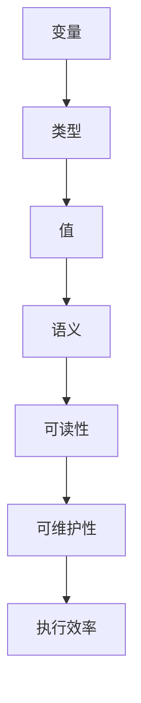
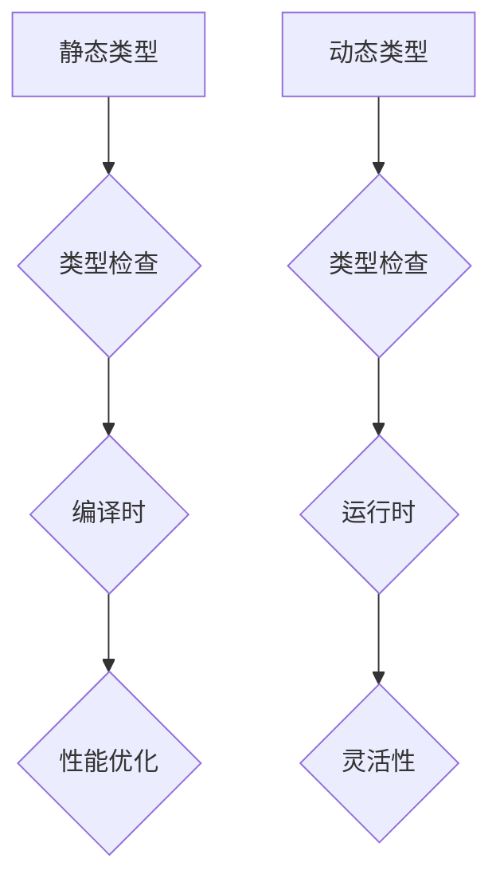
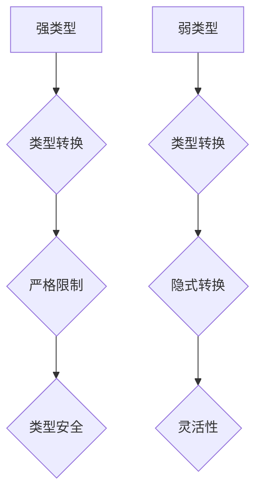

                 


## 文章标题
《类型系统在编程语言教学中的重要性》

## 关键词
类型系统，编程语言，教学，静态类型，动态类型，编译器，程序优化，人工智能

## 摘要
本文深入探讨了类型系统在编程语言教学中的重要性。首先，介绍了类型系统的基本概念和发展历程，随后详细分析了静态类型和动态类型的定义、特点、优势与挑战，以及类型系统在编译器设计和程序优化中的应用。接着，探讨了类型系统在编程语言教学中的现状及其重要性，并结合Python、Java和C++等编程语言进行了案例分析。最后，展望了类型系统的未来发展趋势，并给出了对类型系统教学的建议。

## 目录

## 第一部分：类型系统概述

## 第1章：类型系统的基本概念
### 1.1 编程语言中的类型系统
类型系统是编程语言的核心组成部分，它定义了变量、表达式和函数的语义。类型系统的主要目的是提高代码的可读性、可维护性和执行效率。

#### 核心概念与联系
在编程语言中，类型是用于标识数据或值的类别，如整型、浮点型、布尔型等。类型系统通过定义这些类型的属性和相互关系，确保程序的正确性。



### 1.2 类型系统的分类
类型系统可以分为静态类型系统和动态类型系统，以及强类型系统和弱类型系统。

#### 静态类型与动态类型
- **静态类型**：在编译时进行类型检查，确保代码的正确性。静态类型系统可以提高程序的性能，因为编译器可以在编译时进行优化。
- **动态类型**：在运行时进行类型检查，允许更灵活的编程方式。动态类型系统可以减少编译时间，但可能降低程序的性能。



#### 强类型与弱类型
- **强类型**：严格限制类型转换，确保类型安全。强类型系统可以减少类型错误，提高程序的可靠性。
- **弱类型**：允许隐式类型转换，可能导致类型错误。弱类型系统在编写代码时可能更灵活，但运行时可能出现问题。



### 1.3 类型系统的优点和挑战
#### 优点
- **代码可读性**：类型系统提供了清晰的代码结构，使代码更容易理解和维护。
- **可维护性**：类型检查可以提前发现潜在的错误，减少代码维护成本。
- **性能提升**：静态类型系统可以提供更多的优化信息，提高程序执行效率。

#### 挑战
- **灵活性**：静态类型系统可能限制程序的灵活性，需要更多的类型声明和类型转换。
- **性能开销**：动态类型系统可能增加运行时的性能开销，因为需要在运行时进行类型检查。

## 第二部分：类型系统的历史与发展

## 第2章：类型系统的历史与发展
### 2.1 类型系统的起源
类型系统起源于早期编程语言，如ALGOL和Fortran。这些语言引入了基本的数据类型，如整型和浮点型，为后续类型系统的发展奠定了基础。

### 2.2 类型系统的发展历程
类型系统经历了从简单到复杂，从静态到动态的发展过程。如Pascal、C++和Java等语言在类型系统方面进行了创新和改进。

### 2.3 现代类型系统的特点
现代类型系统具有以下特点：
- **多态性**：实现代码复用和抽象，提高程序的可扩展性。
- **类型推导**：自动推导变量和函数的类型，提高代码可读性。

## 第三部分：类型系统在编程语言中的应用

## 第3章：静态类型系统
### 3.1 静态类型的定义与特点
静态类型系统在编译时进行类型检查，确保代码的正确性。静态类型的定义明确，使代码更易于理解和维护。

### 3.2 静态类型语言的优势与限制
#### 优势
- **错误检查**：编译时发现类型错误，减少运行时错误。
- **性能优化**：提供更多的优化信息，提高程序执行效率。

#### 限制
- **灵活性**：需要更多的类型声明和类型转换。
- **编译时间**：静态类型系统可能导致更长的编译时间。

### 3.3 静态类型系统的实现
静态类型系统的实现涉及类型检查算法、类型表示方法和类型推导算法。

## 第4章：动态类型系统
### 4.1 动态类型的定义与特点
动态类型系统在运行时进行类型检查，提供更灵活的编程方式。动态类型的定义隐含，使代码更简洁。

### 4.2 动态类型语言的优势与限制
#### 优势
- **灵活性**：允许更灵活的编程方式，减少类型声明。
- **开发效率**：减少编译时间，提高开发效率。

#### 限制
- **性能开销**：运行时类型检查可能导致性能开销。
- **类型安全**：类型错误可能在运行时才被发现。

### 4.3 动态类型系统的实现
动态类型系统的实现涉及运行时类型检查、动态类型表示方法和动态类型推导算法。

## 第5章：类型系统与编译器设计
### 5.1 编译器的基本原理
编译器是将高级编程语言翻译成机器语言或汇编语言的工具。编译器的设计涉及词法分析、语法分析、语义分析和代码生成等过程。

### 5.2 类型检查过程
类型检查是在编译过程中对代码进行类型检查，以确保代码的正确性。类型检查分为静态类型检查和动态类型检查。

### 5.3 静态类型与动态类型的编译器设计比较
静态类型编译器设计复杂，但可以提供更好的性能优化。动态类型编译器设计简单，但可能降低程序的性能。

## 第6章：类型系统与程序优化
### 6.1 类型信息在程序优化中的作用
类型信息可以提供编译器更多的优化信息，从而提高程序的执行效率。类型系统可以用于常量折叠、循环优化和函数内联等优化技术。

### 6.2 静态类型系统下的程序优化
静态类型系统下的程序优化可以基于类型推导的结果，进行更精确的优化。

### 6.3 动态类型系统下的程序优化
动态类型系统下的程序优化可能受到限制，但仍然可以采用一些优化技术，如静态分配和动态调度。

## 第7章：类型系统在教育中的应用
### 7.1 类型系统教育的现状
当前，类型系统教育在编程课程中占据重要地位，但还存在一些问题和挑战。

### 7.2 静态类型系统在教学中的重要性
静态类型系统可以帮助学生理解代码的语义和类型检查的重要性，提高代码质量。

### 7.3 动态类型系统在教学中的应用
动态类型系统可以提供更灵活的编程方式，帮助学生更好地理解编程概念。

## 第四部分：案例分析

## 第8章：类型系统在特定编程语言中的应用
### 8.1 Python中的类型系统
Python是一种动态类型语言，具有类型推导和动态类型检查的特点。

### 8.2 Java中的类型系统
Java是一种静态类型语言，具有强类型和类型检查的特点。

### 8.3 C++中的类型系统
C++是一种支持静态类型和动态类型的语言，具有丰富的类型系统和类型检查功能。

## 第9章：类型系统在实际项目中的应用
### 9.1 类型系统在Web开发中的应用
类型系统在Web开发中可以用于前端和后端，提高代码质量和性能。

### 9.2 类型系统在移动应用开发中的应用
类型系统在移动应用开发中可以用于提高代码质量和性能。

### 9.3 类型系统在企业应用开发中的应用
类型系统在企业应用开发中可以用于提高代码质量和性能。

## 第10章：类型系统的未来发展趋势
### 10.1 类型系统的演进方向
类型系统将继续朝着更灵活、更高效和更安全的方向发展。

### 10.2 类型系统在编程语言教学中的未来
类型系统在教育中的应用将更加广泛和深入。

### 10.3 对类型系统教学的建议
- **理论与实践相结合**：注重类型系统的理论学习和实践应用。
- **多样化教学方式**：结合在线课程、实验项目和案例分析等多种教学方式。
- **持续更新课程内容**：紧跟类型系统的发展趋势，更新课程内容。

## 结论
类型系统在编程语言教学中的重要性不可忽视。通过深入理解和应用类型系统，可以编写更高质量、更易于维护的代码，提高程序的性能和可靠性。

## 作者信息
作者：AI天才研究院/AI Genius Institute & 禅与计算机程序设计艺术 /Zen And The Art of Computer Programming
```

