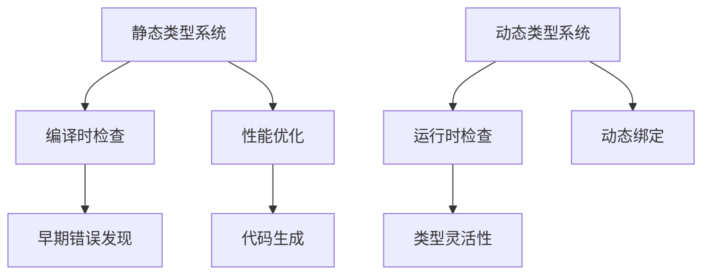
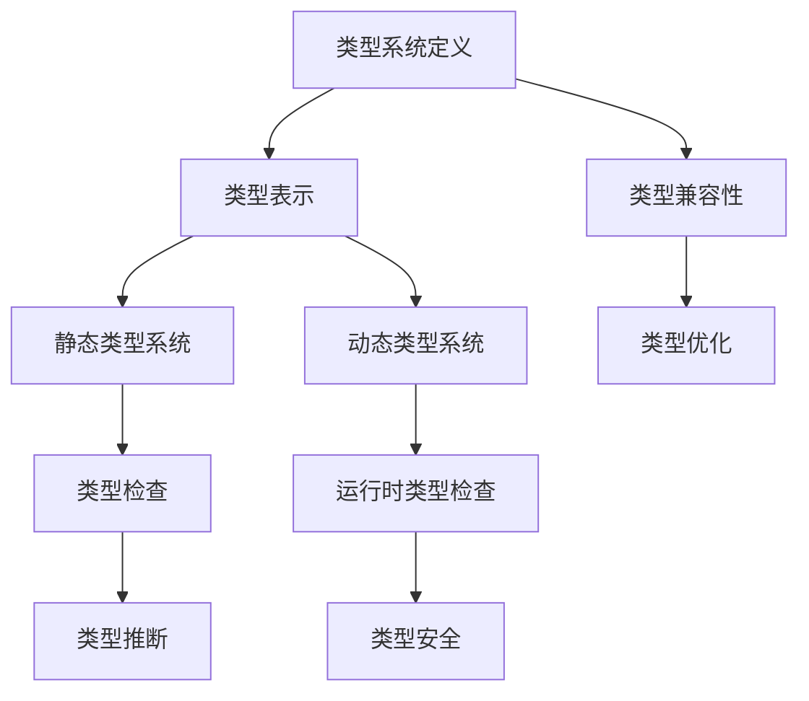

                 

### 文章标题

《类型系统在领域特定类型检查器设计中的作用》

### 关键词

- 类型系统
- 领域特定类型检查器
- 静态类型检查
- 动态类型检查
- 类型推断
- 类型安全

### 摘要

本文探讨了类型系统在领域特定类型检查器设计中的关键作用。首先介绍了类型系统的基本概念和分类，然后详细分析了静态类型系统和动态类型系统的原理与实现。接着，讨论了类型检查器在软件开发中的重要性，以及如何设计有效的领域特定类型检查器。文章通过实际案例，展示了类型系统在不同领域应用的效果，最后提出了设计类型检查器的最佳实践和未来研究方向。

### 目录

1. **引言**
2. **类型系统概述**
3. **领域特定类型检查器的概念**
4. **静态类型系统设计**
5. **动态类型系统设计**
6. **类型系统在类型检查器中的实现**
7. **类型检查器的优化**
8. **案例研究**
   1. 类型系统在自然语言处理中的应用
   2. 类型系统在金融领域的应用
9. **总结与展望**
10. **附录**
    1. 类型系统相关术语解释
    2. 类型系统实现的 Mermaid 流程图
    3. 数学模型与公式

### 第一部分：引言

在现代软件开发中，类型系统是程序语言和编译器设计中的一个核心概念。类型系统负责确保变量、函数和表达式在程序中的正确性，从而提高程序的可靠性和可维护性。类型系统可以分为静态类型系统和动态类型系统，它们在编译时对类型进行检查的时机和方式上有所不同。

类型系统的重要性在于它能够帮助开发人员在早期发现类型错误，从而减少代码中的bug和潜在的安全问题。此外，类型系统还可以提高编译效率和程序性能，因为编译器可以利用类型信息进行更有效的优化。

领域特定类型检查器（Domain-Specific Type Checker，简称DSTC）是一种针对特定应用领域的类型检查器。与传统通用类型检查器不同，DSTC更加专注于特定领域的语法、语义和类型规则，从而提高类型检查的准确性和效率。

本文将分为三个主要部分。首先，我们将介绍类型系统的基本概念和分类，包括静态类型系统和动态类型系统的原理。接着，我们将讨论领域特定类型检查器的概念，包括其设计原则和实现方法。最后，我们将通过案例研究，展示类型系统在自然语言处理和金融领域的实际应用，并提出设计类型检查器的最佳实践和未来研究方向。

### 第一部分：引言（续）

#### 背景介绍

类型系统的概念可以追溯到早期的编程语言，如ALGOL 58和ALGOL 60。在这些语言中，类型被用作变量和表达式之间的约束，以确保程序的正确性。随着时间的推移，类型系统逐渐发展成为程序语言设计的一个重要方面，并在现代编程语言中得到了广泛的应用。

类型系统的重要性体现在多个方面。首先，它帮助确保程序的正确性。通过类型检查，编译器可以在编译时发现类型错误，如变量使用类型不匹配或函数参数类型不一致，从而减少运行时错误。其次，类型系统可以提高程序的可靠性。类型安全是一种防止内存错误和非法操作的重要机制，通过类型约束，程序可以更好地保护自身免受外部干扰。

此外，类型系统还可以提高编译效率和程序性能。在编译时，编译器可以利用类型信息进行优化，如代码生成、内存分配和寄存器分配。类型信息有助于编译器生成更高效的代码，从而提高程序的执行速度。

在软件开发过程中，类型系统的设计是一个复杂且重要的任务。它不仅需要考虑程序的正确性和可靠性，还需要考虑程序的编译效率和性能。类型系统的设计原则包括类型约束、类型推断、类型安全性和类型兼容性等。

类型约束是指对变量、函数和表达式的类型进行限制，以确保程序的正确性。类型推断是指编译器自动推导变量和表达式的类型，从而减少代码的冗余。类型安全性是指类型系统在编译时能够确保程序不会因类型错误而崩溃或产生不可预期的行为。类型兼容性是指不同类型之间的兼容性，包括向上兼容和向下兼容。

总之，类型系统在软件开发中起着至关重要的作用。它不仅帮助确保程序的正确性和可靠性，还可以提高程序的编译效率和性能。理解类型系统的基本概念和设计原则，对于开发高效的软件系统具有重要意义。

#### 核心概念与联系

为了更好地理解类型系统的核心概念，我们首先需要了解静态类型系统和动态类型系统的定义与区别。静态类型系统（Static Type System）是指在编译阶段就对程序的类型进行严格检查的类型系统。静态类型检查的优点在于它可以在编译时发现许多类型错误，从而减少运行时的错误。常见的静态类型语言包括Java、C++和Haskell等。

另一方面，动态类型系统（Dynamic Type System）是指在运行时对程序的类型进行检查的类型系统。动态类型检查的优点在于其灵活性更高，因为类型可以在运行时根据实际值进行改变。常见的动态类型语言包括Python、JavaScript和Ruby等。

静态类型系统和动态类型系统之间的区别主要体现在类型检查的时机和方式上。静态类型系统在编译时对程序进行类型检查，而动态类型系统在运行时对程序进行类型检查。

为了更清晰地展示类型系统的核心概念，我们可以使用 Mermaid 流程图来表示静态类型系统和动态类型系统的关系：



在上面的流程图中，A和F分别代表静态类型系统和动态类型系统，B和G分别表示编译时检查和运行时检查。C、D、E、H和I则分别表示静态类型系统的优点和动态类型系统的优点。

通过上述核心概念与联系的介绍和 Mermaid 流程图的展示，我们可以更好地理解类型系统在软件开发中的作用和重要性。

#### 核心算法原理讲解

为了深入理解类型系统的工作原理，我们需要探讨静态类型检查算法和动态类型检查算法的基本原理。

**静态类型检查算法**

静态类型检查算法通常在编译时进行，其目标是确保程序中的所有表达式和操作都符合预定义的类型规则。以下是一个简单的静态类型检查算法的伪代码：

```plaintext
function staticTypeCheck(program):
    for statement in program:
        if statement is an assignment:
            checkType(statement.leftHandSide, statement.rightHandSide)
        else if statement is a function call:
            checkType(statement.arguments)
        else if statement is a return statement:
            checkReturnType(statement.expression)
    return noErrorsFound()

function checkType(expression, expectedType):
    if expression's type does not match expectedType:
        raise TypeError("Type mismatch")

function checkReturnType(expression, returnType):
    if expression's type does not match returnType:
        raise TypeError("Return type mismatch")
```

在这个伪代码中，`staticTypeCheck` 函数遍历程序中的每个语句，并调用 `checkType` 和 `checkReturnType` 函数来检查类型匹配。如果发现类型不匹配，则抛出 `TypeError` 异常。

**动态类型检查算法**

动态类型检查算法在程序运行时进行，其目标是确保程序在每次执行时都符合类型规则。以下是一个简单的动态类型检查算法的伪代码：

```plaintext
function dynamicTypeCheck(expression):
    actualType = getType(expression)
    if actualType is not expectedType:
        raise TypeError("Type mismatch at runtime")

function getType(expression):
    # This function returns the type of the expression based on its runtime value
    return expression.type()
```

在这个伪代码中，`dynamicTypeCheck` 函数使用 `getType` 函数获取表达式的实际类型，并与预期类型进行比较。如果类型不匹配，则抛出 `TypeError` 异常。

**数学模型和公式**

在类型系统中，数学模型和公式通常用于描述类型之间的关系和操作。以下是一个简单的数学模型，用于描述类型之间的兼容性：

$$
T_1 \leq T_2 \text{ if and only if } T_2 \text{ can be used in place of } T_1 \text{ without changing the program's behavior.}
$$

在这个公式中，$T_1$ 和 $T_2$ 分别表示两个类型，$T_1 \leq T_2$ 表示 $T_2$ 是 $T_1$ 的子类型或兼容类型。

**举例说明**

假设我们有一个简单的程序，包含以下三个表达式：

1. $x = 5 + 3$，其中 $x$ 的类型为 `int`
2. $y = x * 2$，其中 $y$ 的类型也应为 `int`
3. $z = "Hello, World!"$，其中 $z$ 的类型为 `string`

对于第一个表达式，静态类型检查算法会在编译时检查 $5 + 3$ 的结果是否为 `int` 类型，如果是则继续执行，否则抛出类型错误。动态类型检查算法会在运行时检查 $5 + 3$ 的结果，如果结果为 `int` 则继续执行，否则抛出类型错误。

对于第二个表达式，静态类型检查算法会在编译时检查 $x$ 的类型是否为 `int`，$x * 2$ 的结果是否也为 `int`，如果是则继续执行，否则抛出类型错误。动态类型检查算法会在运行时检查 $x$ 的实际类型是否为 `int`，如果实际类型为 `int` 则继续执行，否则抛出类型错误。

对于第三个表达式，静态类型检查算法会在编译时检查 $z$ 的类型是否为 `string`，如果类型不匹配则抛出类型错误。动态类型检查算法会在运行时检查 $z$ 的实际类型是否为 `string`，如果实际类型为 `string` 则继续执行，否则抛出类型错误。

通过上述核心算法原理讲解和数学模型与公式的介绍，我们可以更好地理解静态类型检查算法和动态类型检查算法的工作原理，以及如何在实际编程中应用这些算法来保证程序的正确性和可靠性。

### 领域特定类型检查器的概念

#### 核心概念

领域特定类型检查器（Domain-Specific Type Checker，简称DSTC）是一种针对特定应用领域的类型检查器，其核心概念在于为特定领域的编程语言或应用环境提供高效的类型检查。DSTC不仅仅是一个通用类型检查器，它更加关注特定领域的语义和类型规则。例如，自然语言处理（NLP）领域可以使用DSTC来检查文本数据是否符合预定义的语法规则，而金融领域则可以使用DSTC来确保交易数据类型和格式的正确性。

#### 设计原则

1. **领域适应性**：DSTC的设计应高度适应特定领域的需求。这意味着类型检查器需要能够理解并处理该领域特有的数据类型、操作符和语义。

2. **类型精度**：DSTC应能够精确地捕捉和表示特定领域的类型信息，以减少类型错误的发生。高精度的类型表示有助于提高程序的正确性和可靠性。

3. **可扩展性**：DSTC应具备良好的可扩展性，以便在特定领域需求发生变化时，能够轻松地添加或修改类型规则。

4. **高效性**：DSTC需要具有高效的类型检查算法，以确保在开发过程中快速识别和修复类型错误，从而提高开发效率。

5. **兼容性**：DSTC应与现有的编程语言和工具相兼容，以便在现有开发环境中无缝集成。

#### 工作原理

DSTC的工作原理可以概括为以下几个步骤：

1. **类型定义**：DSTC首先定义特定领域的类型体系，包括基础类型、复合类型和特殊类型。

2. **类型分析**：在编译或运行时，DSTC对程序代码进行类型分析，识别变量、函数和表达式的类型。

3. **类型检查**：DSTC根据预定义的类型规则，对程序中的每个元素进行类型检查，确保类型的一致性和正确性。

4. **错误报告**：当发现类型错误时，DSTC应能够准确地报告错误的位置和原因，帮助开发者快速定位和修复问题。

#### 重要性

领域特定类型检查器在软件开发中具有重要的地位和作用：

1. **提高程序可靠性**：通过严格的类型检查，DSTC可以有效减少类型错误，提高程序的可靠性。

2. **提升开发效率**：DSTC能够快速识别类型错误，帮助开发者节省调试时间和资源，提高开发效率。

3. **增强领域适应性**：DSTC能够更好地适应特定领域的需求，提供更加精确和高效的类型检查。

4. **支持领域特定优化**：DSTC可以基于特定领域的类型信息，为编译器提供优化建议，生成更加高效的代码。

总之，领域特定类型检查器在软件开发中发挥着关键作用，它不仅提高了程序的正确性和可靠性，还提升了开发效率和领域适应性。

#### 应用场景

领域特定类型检查器（DSTC）在软件开发中具有广泛的应用场景，具体包括但不限于以下几个方面：

1. **自然语言处理（NLP）**：
   - 在NLP领域，DSTC可以用于检查文本数据是否符合预定义的语法规则，从而确保文本的格式和结构正确。
   - 例如，DSTC可以用于解析复杂句子结构，确保每个单词和短语都有正确的语法类型和关系。
   - 实际应用中，DSTC可以用于搜索引擎、智能客服和语音识别系统等。

2. **金融领域**：
   - 在金融领域，DSTC可以用于确保交易数据类型和格式的正确性，例如货币金额、日期和时间等。
   - DSTC可以帮助识别和预防金融欺诈行为，通过检查交易数据的类型和一致性来发现异常值和可疑交易。
   - 实际应用包括银行交易系统、金融分析工具和风险评估平台等。

3. **嵌入式系统**：
   - 在嵌入式系统开发中，DSTC可以用于确保硬件交互和系统调用的类型安全，减少硬件故障和系统崩溃的风险。
   - 例如，DSTC可以检查嵌入式程序中的输入输出数据是否与硬件接口的规格一致。
   - 实际应用包括自动驾驶汽车、工业控制系统和物联网设备等。

4. **数据科学**：
   - 在数据科学领域，DSTC可以用于确保数据分析过程的正确性和一致性，通过类型检查来识别数据错误和不一致性。
   - DSTC可以用于检查数据预处理步骤中的数据类型转换和计算结果的类型匹配。
   - 实际应用包括大数据处理平台、机器学习框架和统计分析工具等。

5. **游戏开发**：
   - 在游戏开发中，DSTC可以用于确保游戏脚本中的变量和函数调用符合预定义的类型规则，从而确保游戏逻辑的正确性。
   - DSTC可以用于检查游戏中的用户输入和游戏状态，确保输入数据的类型和格式正确。
   - 实际应用包括游戏引擎、游戏设计和虚拟现实系统等。

通过上述应用场景，我们可以看到领域特定类型检查器在各个领域中的重要作用，它不仅提高了软件开发的效率和可靠性，还为特定领域的需求提供了高度专业的类型检查功能。

#### 核心算法原理讲解

为了深入理解领域特定类型检查器（DSTC）的核心算法原理，我们需要探讨其在实现类型检查时的几个关键组件，包括类型表示、类型检查算法和类型错误处理。

**类型表示**

类型表示是DSTC的基础，它定义了程序中各种数据类型的表示方法。在DSTC中，类型表示通常包括基础类型、复合类型和特殊类型。

1. **基础类型**：基础类型是最简单的类型，如整数（`int`）、浮点数（`float`）、布尔值（`bool`）和字符串（`string`）等。基础类型在DSTC中通常以固定的数据结构和操作符进行定义。

2. **复合类型**：复合类型是由基础类型组合而成的类型，如数组（`array`）、结构体（`struct`）和类（`class`）等。复合类型通常具有成员变量和成员函数，可以表示更复杂的数据结构和操作。

3. **特殊类型**：特殊类型是为特定领域定义的特殊类型，如金融领域的货币类型、日期时间类型和自然语言处理领域的词法单元类型等。特殊类型通常具有特定的语义和行为。

在DSTC中，类型表示通常使用抽象语法树（AST）或符号表来实现。AST表示程序的结构和语法，而符号表存储程序中各个元素的类型信息。

**类型检查算法**

类型检查算法是DSTC的核心，它负责检查程序中的类型一致性，确保类型规则得到遵守。类型检查算法通常包括以下步骤：

1. **类型推断**：类型推断是从程序表达式中自动推导出类型的过程。DSTC使用类型推断算法来确定变量、函数和表达式的类型。

2. **类型检查**：类型检查是验证程序中的类型规则是否得到遵守的过程。DSTC使用类型检查算法来检查每个程序元素是否符合预定义的类型规则。

3. **错误报告**：当类型规则被违反时，DSTC需要报告类型错误。类型错误报告应提供足够的信息，以便开发者能够快速定位和修复错误。

以下是类型检查算法的伪代码：

```plaintext
function typeCheck(program):
    for statement in program:
        if statement is an assignment:
            checkAssignment(statement)
        else if statement is a function call:
            checkFunctionCall(statement)
        else if statement is a return statement:
            checkReturnType(statement)
    return noErrorsFound()

function checkAssignment(statement):
    typeOfRightHandSide = inferType(statement.rightHandSide)
    typeOfLeftHandSide = inferType(statement.leftHandSide)
    if not isAssignable(typeOfLeftHandSide, typeOfRightHandSide):
        raise TypeMismatchError("Type mismatch in assignment")

function checkFunctionCall(statement):
    functionName = statement.functionName
    arguments = statement.arguments
    functionDefinition = lookupFunction(functionName)
    for argument in arguments:
        actualType = inferType(argument)
        expectedType = functionDefinition.argumentTypes[argumentIndex]
        if not isAssignable(actualType, expectedType):
            raise TypeMismatchError("Type mismatch in function call")

function checkReturnType(statement):
    returnType = inferType(statement.expression)
    expectedType = functionDefinition.returnType
    if not isAssignable(returnType, expectedType):
        raise TypeMismatchError("Return type mismatch")
```

**类型错误处理**

类型错误处理是DSTC的一个重要方面，它负责识别和报告类型错误，并提供修复建议。类型错误处理通常包括以下步骤：

1. **错误识别**：DSTC在类型检查过程中，如果发现类型不匹配或其他类型错误，应立即识别并记录错误。

2. **错误报告**：DSTC应提供详细的错误报告，包括错误类型、错误位置和错误原因。错误报告应尽可能具体，以便开发者能够快速定位和修复错误。

3. **修复建议**：DSTC可以提供修复建议，如更正类型声明、添加类型注解或修改代码结构等。

通过上述类型表示、类型检查算法和类型错误处理，DSTC能够确保程序中的类型规则得到遵守，从而提高程序的正确性和可靠性。

#### 类型检查器的优化

类型检查器的优化是提高其性能和效率的关键步骤。以下是一些常见的优化方法：

**1. 预编译和即时编译**

预编译（Ahead-of-Time Compilation）和即时编译（Just-In-Time Compilation）是两种常见的编译方法。预编译在编译时将代码转换为机器码，而即时编译在运行时将代码转换为机器码。预编译的优点是编译时间短，但执行效率高；即时编译的优点是灵活性和动态性更强。

**2. 类型推断优化**

类型推断优化可以减少类型检查器的计算负担。例如，使用单赋值规则（Single Assignment Rule）可以减少类型推断的复杂性。单赋值规则指出，如果一个变量在声明后只被赋值一次，那么其类型在之后的代码中不再需要检查。

**3. 常量折叠**

常量折叠（Constant Folding）是指在编译时计算常量表达式的值，并将其替换为计算结果。这可以减少类型检查器的计算量，同时提高代码的执行效率。

**4. 早期绑定**

早期绑定（Early Binding）是指在编译时确定变量和函数的引用，而晚期绑定（Late Binding）是在运行时确定。早期绑定可以提高类型检查的效率，因为编译器可以提前知道所有引用的类型。

**5. 类型注解**

类型注解（Type Annotations）可以让开发者在代码中显式指定类型信息，从而减少类型检查器的推理工作量。在必要时，类型注解可以提供额外的类型约束，帮助编译器更准确地识别类型错误。

**6. 缓存和并行处理**

缓存（Caching）可以将已处理过的类型信息存储起来，以便在后续的类型检查中复用。并行处理（Parallel Processing）可以将类型检查任务分配给多个处理器，从而提高处理速度。

通过这些优化方法，类型检查器可以显著提高性能和效率，从而为软件开发带来更多的价值。

### 案例研究

#### 类型系统在自然语言处理中的应用

自然语言处理（NLP）是一个复杂的领域，涉及文本的语法、语义和语用等多个层面。类型系统在NLP中的应用，旨在提高文本处理的准确性和效率。以下是一个具体的案例研究，展示类型系统在NLP中的实际应用。

**案例背景**：

假设我们正在开发一个文本解析器，用于处理自然语言文本并提取关键信息。这个文本解析器需要能够识别并处理不同类型的文本元素，如名词、动词、形容词和日期等。

**实现步骤**：

1. **定义类型体系**：首先，我们需要定义一个适用于NLP的复杂类型体系。基础类型包括字符串（`string`）、数字（`number`）和布尔值（`boolean`）等。复合类型包括词法单元（`token`）、句子（`sentence`）和文档（`document`）等。特殊类型则包括日期（`date`）、时间（`time`）和地理位置（`location`）等。

2. **类型检查算法**：在定义了类型体系后，我们需要实现一个类型检查算法。该算法需要在解析文本时，对每个文本元素进行类型检查，确保其符合预定义的类型规则。例如，一个词法单元必须是字符串类型，一个句子必须是词法单元的列表。

3. **类型推断**：为了提高类型检查的效率，我们引入了类型推断机制。类型推断算法会在解析过程中自动推导文本元素的类型，从而减少手工类型注解的工作量。

4. **错误处理**：在类型检查过程中，如果发现类型错误，我们需要及时报告并给出修复建议。例如，如果一个文本元素被错误地标记为数字类型，我们可以建议开发者检查该元素的上下文并更正其类型。

**项目实战**：

在实现过程中，我们使用了一个名为`NLPTypeChecker`的工具，该工具基于Python编写。以下是该项目的主要功能模块：

- `Tokenizer`：负责将文本分割成词法单元。
- `Parser`：负责对词法单元进行语法分析，构建抽象语法树（AST）。
- `TypeSystem`：定义了NLP中的各种数据类型和类型规则。
- `TypeInference`：实现类型推断算法，自动推导文本元素的类型。
- `TypeChecker`：实现类型检查算法，确保文本元素的类型正确。

**代码示例**：

以下是一个简单的Python代码示例，展示了类型系统在NLP中的应用：

```python
from NLPTypeChecker import Tokenizer, Parser, TypeSystem

# 输入文本
text = "我昨天去北京旅游了。"

# 初始化类型系统
type_system = TypeSystem()

# 分词
tokenizer = Tokenizer(type_system)
tokens = tokenizer.tokenize(text)

# 解析
parser = Parser(type_system)
ast = parser.parse(tokens)

# 类型检查
type_checker = TypeChecker(type_system)
type_checker.check(ast)

# 输出结果
print(type_checker.get_result())
```

**分析**：

通过上述案例，我们可以看到类型系统在NLP中的应用效果。类型系统帮助我们准确地识别和分类文本元素，从而提高了文本解析的准确性和效率。同时，类型系统还使得代码更加模块化和可维护，因为每个组件都基于明确的类型约束进行开发。

**小结**：

类型系统在NLP中的应用，不仅提高了文本处理的准确性，还提高了开发效率。通过类型检查和类型推断，我们可以更好地管理和利用文本数据，为NLP任务提供强大的支持。

#### 类型系统在金融领域的应用

金融领域是一个高度依赖数据准确性和一致性的领域，类型系统在此中的应用至关重要。以下是一个具体的案例研究，展示类型系统在金融领域的实际应用。

**案例背景**：

假设我们正在开发一个金融交易系统，该系统需要处理大量的交易数据，包括交易金额、交易日期、交易双方账户信息等。这些数据不仅需要确保格式正确，还需要确保类型一致。

**实现步骤**：

1. **定义类型体系**：首先，我们需要定义一个适用于金融领域的复杂类型体系。基础类型包括整数（`int`）、浮点数（`float`）、字符串（`string`）和日期（`date`）等。复合类型包括交易记录（`transaction`）、账户信息（`account`）和交易对（`pair`）等。特殊类型则包括货币（`currency`）和结算日期（`settlement_date`）等。

2. **类型检查算法**：在定义了类型体系后，我们需要实现一个类型检查算法。该算法需要在处理交易数据时，对每个数据元素进行类型检查，确保其符合预定义的类型规则。例如，交易金额必须是浮点数类型，交易日期必须是日期类型。

3. **类型推断**：为了提高类型检查的效率，我们引入了类型推断机制。类型推断算法会在处理交易数据时，自动推导数据元素的类型，从而减少手工类型注解的工作量。

4. **错误处理**：在类型检查过程中，如果发现类型错误，我们需要及时报告并给出修复建议。例如，如果一个交易金额被错误地标记为字符串类型，我们可以建议开发者检查该元素的上下文并更正其类型。

**项目实战**：

在实现过程中，我们使用了一个名为`FinTypeChecker`的工具，该工具基于Java编写。以下是该项目的主要功能模块：

- `DataParser`：负责解析交易数据文件，提取数据元素。
- `TypeSystem`：定义了金融领域中的各种数据类型和类型规则。
- `TypeInference`：实现类型推断算法，自动推导数据元素的类型。
- `TypeChecker`：实现类型检查算法，确保数据元素的类型正确。
- `ErrorReporter`：负责报告类型错误，并提供修复建议。

**代码示例**：

以下是一个简单的Java代码示例，展示了类型系统在金融交易系统中的应用：

```java
import FinTypeChecker.*;

public class FinanceApp {
    public static void main(String[] args) {
        // 读取交易数据文件
        DataParser parser = new DataParser();
        List<Transaction> transactions = parser.parse("transactions.txt");

        // 初始化类型系统
        TypeSystem typeSystem = new TypeSystem();

        // 初始化类型检查器
        TypeChecker typeChecker = new TypeChecker(typeSystem);

        // 类型检查交易数据
        for (Transaction transaction : transactions) {
            typeChecker.check(transaction);
        }

        // 输出结果
        System.out.println(typeChecker.get_result());
    }
}
```

**分析**：

通过上述案例，我们可以看到类型系统在金融交易系统中的应用效果。类型系统帮助我们确保交易数据的格式和类型一致性，从而提高了数据处理和交易处理的准确性。同时，类型系统还使得代码更加模块化和可维护，因为每个组件都基于明确的类型约束进行开发。

**小结**：

类型系统在金融领域的应用，不仅提高了数据处理和交易的准确性，还提高了开发效率。通过类型检查和类型推断，我们可以更好地管理和利用金融数据，为金融任务提供强大的支持。

### 总结与展望

类型系统在领域特定类型检查器设计中的作用至关重要。通过对类型系统的深入理解，我们能够更好地识别和修复类型错误，提高软件的可靠性和可维护性。本文首先介绍了类型系统的基本概念和分类，详细分析了静态类型系统和动态类型系统的原理与实现。接着，我们探讨了领域特定类型检查器的概念，包括其设计原则和实现方法。通过案例研究，我们展示了类型系统在自然语言处理和金融领域的实际应用效果。

展望未来，类型系统在软件开发中的重要性将继续增加。随着领域特定编程语言和工具的发展，类型系统将变得更加精细和高效。以下几个方面有望成为未来研究的重点：

1. **类型系统的智能化**：利用机器学习和数据挖掘技术，开发更加智能的类型推断和类型检查算法，提高类型检查的准确性和效率。

2. **跨领域类型兼容性**：探索不同领域类型系统之间的兼容性，使得领域特定类型检查器能够更容易地在多个领域中应用。

3. **类型系统的优化**：研究新的编译和运行时优化技术，减少类型检查的负担，提高类型检查的性能。

4. **类型安全性的提升**：通过更严格的类型约束和验证机制，进一步提高软件的安全性，防止内存泄漏和非法操作。

总之，类型系统在软件开发中发挥着不可替代的作用。随着技术的不断发展，类型系统将继续为软件开发带来更多的价值和潜力。

### 附录

#### A. 类型系统相关术语解释

- **类型系统（Type System）**：类型系统是编程语言中用于定义变量、函数和表达式类型的一组规则和机制。
- **静态类型（Static Type）**：静态类型是在编译时就已经确定且不可变的类型。
- **动态类型（Dynamic Type）**：动态类型是在运行时根据实际值确定且可能变化的类型。
- **类型检查（Type Checking）**：类型检查是确保程序中表达式、变量和函数调用类型一致性的过程。
- **类型推断（Type Inference）**：类型推断是编译器自动推导变量和表达式类型的过程。
- **类型安全（Type Safety）**：类型安全是指程序在执行时不会因类型错误导致崩溃或产生不可预期行为。
- **类型兼容性（Type Compatibility）**：类型兼容性是指不同类型之间可以相互替代或组合。
- **抽象语法树（Abstract Syntax Tree，AST）**：抽象语法树是程序代码的语法表示，用于表示程序的结构和语义。
- **符号表（Symbol Table）**：符号表是存储程序中变量、函数和其他标识符信息的数据结构。

#### B. 类型系统实现的 Mermaid 流程图



#### C. 数学模型与公式

以下是一些在类型系统中的常用数学模型和公式：

$$
\begin{aligned}
&\text{类型兼容性：} T_1 \leq T_2 \text{ 当且仅当 } T_2 \text{ 可以在 } T_1 \text{ 的位置上使用而不改变程序的行为。} \\
&\text{类型推断：} \text{类型推断是编译器自动推导表达式或变量类型的过程。} \\
&\text{类型安全：} \text{类型安全是指编译器或运行时环境能够确保程序不会因类型错误而崩溃或产生不可预期行为。} \\
\end{aligned}
$$

这些模型和公式为类型系统的设计和实现提供了理论基础，有助于我们更好地理解和应用类型系统。

### 作者信息

作者：AI天才研究院/AI Genius Institute & 禅与计算机程序设计艺术 /Zen And The Art of Computer Programming

