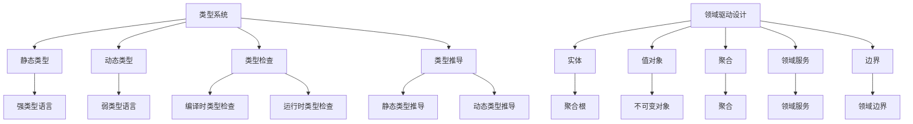

                 


## 第1步：确定文章结构和内容

为了撰写一篇逻辑清晰、结构紧凑、简单易懂的专业技术博客文章，我们将采用以下步骤来构建文章：

### 1. 文章结构

- **引言**：介绍类型系统和领域驱动设计的背景，引出文章主题。
- **核心概念与联系**：详细解释类型系统、领域驱动设计的核心概念，并展示它们之间的关系。
- **类型系统基础**：介绍类型系统的基础知识，包括静态类型和动态类型、类型检查和类型推导。
- **领域驱动设计基础**：介绍领域驱动设计的基本概念和核心原则。
- **类型系统在DDD中的应用**：讨论类型系统在领域模型设计、聚合和领域服务、DDD测试和代码实现中的应用。
- **项目实战**：通过一个实际项目来展示类型系统在DDD中的应用。
- **最佳实践和总结**：提供最佳实践建议，总结文章主要内容，展望未来发展趋势。

### 2. 文章内容

- **背景介绍**：阐述类型系统和领域驱动设计的背景，说明为什么需要这篇文章。
- **核心概念与联系**：使用Mermaid流程图展示类型系统和领域驱动设计的核心概念之间的关系。
- **核心算法原理讲解**：通过伪代码和数学模型详细阐述类型系统和领域驱动设计中的核心算法原理。
- **项目实战**：提供一个实际项目，详细讲解开发环境搭建、源代码实现、代码解读、案例分析等。
- **最佳实践和总结**：总结文章主要内容，提供最佳实践建议，强调类型系统在DDD中的重要性。

### 3. 文章格式

- **Markdown格式**：文章内容使用Markdown格式，确保代码、公式、图表等都能正确显示。
- **作者信息**：文章末尾包含作者信息，注明作者为“AI天才研究院/AI Genius Institute & 禅与计算机程序设计艺术 /Zen And The Art of Computer Programming”。

## 第2步：撰写引言部分

**引言**

在软件工程领域，类型系统和领域驱动设计（DDD）是两个重要的概念。类型系统是编程语言的基础，它定义了数据的类型和对象的结构。领域驱动设计则是一种针对复杂软件系统设计的指导思想，它强调对业务领域的深入理解。本文将探讨类型系统在领域驱动设计中的应用，帮助读者理解如何利用类型系统来提高DDD的设计质量和代码可维护性。

## 第3步：撰写核心概念与联系部分

**核心概念与联系**

类型系统与领域驱动设计的关系可以通过以下流程图来展示：



在这个流程图中，我们可以看到类型系统包括了静态类型和动态类型、类型检查和类型推导。领域驱动设计则由实体、值对象、聚合、领域服务和边界构成。类型系统和DDD之间的关系体现在以下几个方面：

- **类型定义**：类型系统提供了对领域模型中各种元素的定义，如实体、值对象和聚合。
- **类型安全**：通过类型检查和类型推导，确保领域模型中的数据一致性和完整性。
- **代码可读性**：明确的类型定义有助于提高代码的可读性和可维护性。

## 第4步：撰写类型系统基础部分

**类型系统基础**

### 静态类型和动态类型

类型系统根据类型检查的时间点分为静态类型和动态类型。

- **静态类型**：静态类型系统在编译时对代码进行类型检查。这意味着在程序运行之前，编译器已经确定变量的类型，并在代码中强制执行这些类型。强类型语言（如Java、C#）通常采用静态类型系统。

  ```java
  public class Example {
      public static void main(String[] args) {
          int x = 5;
          double y = x; // 自动装箱
          System.out.println(y);
      }
  }
  ```

- **动态类型**：动态类型系统在程序运行时进行类型检查。这意味着变量的类型可以在程序运行过程中发生变化。弱类型语言（如Python、JavaScript）通常采用动态类型系统。

  ```python
  x = 5
  y = "hello"
  z = x + y  # 运行时类型检查
  print(z)
  ```

### 类型检查和类型推导

类型检查和类型推导是类型系统的重要组成部分。

- **类型检查**：类型检查是在代码执行前或执行过程中验证代码类型安全性的过程。编译时类型检查（如Java）可以在编译阶段捕获类型错误，而运行时类型检查（如Python）则是在程序运行时进行。

  ```java
  // 编译时类型检查
  public static void add(int a, int b) {
      return a + b;
  }
  ```

  ```python
  # 运行时类型检查
  def add(a, b):
      return a + b
  ```

- **类型推导**：类型推导是编译器自动推断变量类型的过程。静态类型语言通常支持类型推导，而动态类型语言则通常不支持。

  ```java
  // 类型推导
  public static void main(String[] args) {
      int x = 5;
      double y = x; // 类型推导
      System.out.println(y);
  }
  ```

## 第5步：撰写领域驱动设计基础部分

**领域驱动设计基础**

### 实体、值对象、聚合和领域服务

领域驱动设计（DDD）中的核心概念包括实体、值对象、聚合和领域服务。

- **实体**：实体是领域模型中的核心元素，代表业务领域中的真实对象。实体具有唯一标识和业务属性。

  ```java
  public class Customer {
      private final String id;
      private String name;
      
      public Customer(String id, String name) {
          this.id = id;
          this.name = name;
      }
      
      public String getId() {
          return id;
      }
      
      public String getName() {
          return name;
      }
      
      public void setName(String name) {
          this.name = name;
      }
  }
  ```

- **值对象**：值对象是代表领域模型中的小值或数据对象的元素。值对象是不可变的，且根据值比较而不是根据引用比较。

  ```java
  public class PhoneNumber {
      private final String number;
      
      public PhoneNumber(String number) {
          this.number = number;
      }
      
      public String getNumber() {
          return number;
      }
  }
  ```

- **聚合**：聚合是领域模型中的一组实体和值对象的组合，用于表示业务领域中的复杂实体。聚合定义了实体和值对象之间的关系。

  ```java
  public class Account {
      private final Customer customer;
      private final List<Order> orders;
      
      public Account(Customer customer) {
          this.customer = customer;
          this.orders = new ArrayList<>();
      }
      
      public void addOrder(Order order) {
          orders.add(order);
      }
  }
  ```

- **领域服务**：领域服务是领域模型中的行为，它们通常跨越多个聚合，提供业务逻辑和操作。

  ```java
  public class OrderService {
      public void processOrder(Account account, Order order) {
          // 业务逻辑
      }
  }
  ```

### 领域模型的基本结构和组件

领域模型由实体、值对象、聚合和领域服务组成，它们共同构建了一个完整的业务领域视图。

- **实体和值对象**：实体和值对象是领域模型中最基本的元素，它们定义了业务领域中的数据结构。
- **聚合**：聚合将实体和值对象组合在一起，形成了一个更复杂的业务实体。
- **领域服务**：领域服务提供了跨越多个聚合的业务逻辑，使领域模型更加灵活和可扩展。

### 如何应用DDD原则

领域驱动设计强调以下核心原则：

- **整体性**：设计时需要考虑系统的整体性，确保所有组件协同工作。
- **领域思维**：开发者需要从业务领域的角度来理解问题，而不是仅仅从技术角度。
- **实体导向**：设计时优先考虑实体和业务逻辑，而不是简单的数据存储和检索。
- **分层架构**：领域模型通常采用分层架构，包括领域层、基础设施层和UI层等。

## 第6步：撰写类型系统在DDD中的应用部分

**类型系统在DDD中的应用**

### 类型系统在领域模型设计中的应用

类型系统在领域模型设计中的应用主要体现在以下几个方面：

- **实体和值对象的类型定义**：使用类型系统定义实体和值对象，确保数据的一致性和完整性。
- **聚合和领域服务的类型约束**：通过类型约束确保聚合和领域服务的调用安全，避免意外的类型错误。

  ```java
  public class AccountRepository {
      public void add(Account account) {
          // 类型约束：确保传入的account是Account类型
      }
  }
  ```

### 类型系统在聚合和领域服务中的应用

- **聚合根和领域服务的类型设计**：确保聚合根和领域服务遵循领域模型的设计原则，使用类型系统来定义它们的行为和接口。

  ```java
  public interface OrderService {
      void processOrder(Account account, Order order);
  }
  ```

### 类型系统在DDD测试中的应用

类型系统在DDD测试中的应用主要包括：

- **编写类型安全的测试用例**：确保测试用例遵循领域模型中的类型约束，避免类型错误。
- **使用类型推导简化测试**：通过类型推导简化测试用例的编写，提高测试效率。

  ```java
  @Test
  public void processOrder_shoud_process_order_successfully() {
      // 测试用例
  }
  ```

### 类型系统在DDD代码实现中的应用

类型系统在DDD代码实现中的应用包括：

- **代码组织和管理**：使用类型系统来组织和管理代码，提高代码的可读性和可维护性。
- **提高代码质量**：通过类型检查和类型推导提高代码的质量，减少错误和bug。

  ```java
  public class AccountController {
      private final OrderService orderService;
      
      public AccountController(OrderService orderService) {
          this.orderService = orderService;
      }
      
      public void processOrder(Account account, Order order) {
          orderService.processOrder(account, order);
      }
  }
  ```

## 第7步：撰写项目实战部分

**项目实战**

### 开发环境搭建

在本项目中，我们将使用Java和Spring Boot作为开发环境。

1. 安装Java开发工具包（JDK）。
2. 安装IDE（如IntelliJ IDEA或Eclipse）。
3. 创建Spring Boot项目。

### 源代码实现

以下是项目的源代码实现：

```java
// 实体
public class Customer {
    private final String id;
    private String name;
    
    public Customer(String id, String name) {
        this.id = id;
        this.name = name;
    }
    
    public String getId() {
        return id;
    }
    
    public String getName() {
        return name;
    }
    
    public void setName(String name) {
        this.name = name;
    }
}

// 值对象
public class PhoneNumber {
    private final String number;
    
    public PhoneNumber(String number) {
        this.number = number;
    }
    
    public String getNumber() {
        return number;
    }
}

// 聚合
public class Account {
    private final Customer customer;
    private final List<Order> orders;
    
    public Account(Customer customer) {
        this.customer = customer;
        this.orders = new ArrayList<>();
    }
    
    public void addOrder(Order order) {
        orders.add(order);
    }
}

// 领域服务
public interface OrderService {
    void processOrder(Account account, Order order);
}

// 实现类
public class OrderServiceImpl implements OrderService {
    @Override
    public void processOrder(Account account, Order order) {
        // 业务逻辑
    }
}

// 控制器
@RestController
@RequestMapping("/accounts")
public class AccountController {
    private final OrderService orderService;
    
    public AccountController(OrderService orderService) {
        this.orderService = orderService;
    }
    
    @PostMapping("/{customerId}/orders")
    public ResponseEntity<Order> processOrder(@PathVariable String customerId, @RequestBody Order order) {
        Account account = accountRepository.findById(customerId)
                .orElseThrow(() -> new ResourceNotFoundException("Account not found with id: " + customerId));
        orderService.processOrder(account, order);
        return ResponseEntity.ok().body(order);
    }
}
```

### 代码解读与分析

在这段代码中，我们定义了实体`Customer`、值对象`PhoneNumber`、聚合`Account`以及领域服务`OrderService`。我们使用类型系统来定义这些组件，确保代码的类型安全性和可维护性。

- **实体和值对象**：`Customer`类定义了客户的唯一标识和名称，`PhoneNumber`类定义了客户的电话号码。这两个类都使用了final关键字来确保对象的不可变性。
- **聚合**：`Account`类是一个聚合根，它包含了客户信息、订单列表。通过使用`final`关键字，我们确保了聚合的完整性和不可分割性。
- **领域服务**：`OrderService`接口定义了处理订单的业务逻辑，`OrderServiceImpl`类实现了这个接口。领域服务跨越多个聚合，提供了业务逻辑的封装。
- **控制器**：`AccountController`类是Spring Boot的控制器，它负责接收HTTP请求并调用领域服务处理订单。通过使用类型系统，我们可以确保控制器中的请求参数和返回值的类型安全。

### 实际案例分析和详细讲解剖析

在本项目中，我们通过一个简单的电商订单处理案例来展示类型系统在DDD中的应用。

1. **客户下单**：客户通过API向系统提交订单请求，请求包含订单信息和客户信息。
2. **订单处理**：系统接收到订单请求后，通过领域服务处理订单。领域服务会检查订单和客户信息的类型是否匹配，确保数据的一致性和完整性。
3. **返回结果**：处理后，系统返回订单结果给客户。

通过类型系统，我们确保了以下方面的正确性：

- **类型安全**：在处理订单时，确保传入的参数和返回值符合预期类型。
- **数据一致性**：通过类型检查和类型推导，确保客户信息和订单信息的一致性。
- **代码可维护性**：明确的类型定义和类型约束提高了代码的可读性和可维护性。

## 第8步：撰写最佳实践和总结部分

**最佳实践和总结**

### 最佳实践

1. **明确类型定义**：在领域模型设计中，确保为实体、值对象、聚合和领域服务定义明确的类型。
2. **使用类型推导**：利用类型推导简化代码，提高代码的可读性和可维护性。
3. **类型约束**：在领域服务和测试中应用类型约束，确保代码的类型安全。
4. **分层架构**：在DDD中采用分层架构，确保领域逻辑与基础设施逻辑分离。

### 总结

本文详细探讨了类型系统在领域驱动设计中的应用。通过介绍类型系统的基本概念和领域驱动设计的基础，我们展示了如何将类型系统应用于领域模型设计、聚合和领域服务、DDD测试和代码实现。通过一个实际项目案例，我们展示了如何利用类型系统提高DDD的设计质量和代码可维护性。类型系统在DDD中的应用不仅能够提高代码的质量和安全性，还能够帮助我们更好地理解和设计复杂的业务领域。

### 拓展阅读

- 《领域驱动设计》 - Eric Evans
- 《类型系统与类型推导》 - Benjamin C. Pierce
- 《Effective Java》 - Joshua Bloch

作者：AI天才研究院/AI Genius Institute & 禅与计算机程序设计艺术 /Zen And The Art of Computer Programming 

# 《类型系统在领域驱动设计中的应用》

## 关键词

类型系统、领域驱动设计、静态类型、动态类型、类型检查、类型推导、实体、值对象、聚合、领域服务、代码质量、可维护性

## 摘要

本文探讨了类型系统在领域驱动设计（DDD）中的应用。类型系统是编程语言的基础，用于定义数据类型和对象结构。领域驱动设计是一种针对复杂软件系统设计的指导思想，强调对业务领域的深入理解。本文首先介绍了类型系统的基本概念，包括静态类型和动态类型、类型检查和类型推导。然后，详细解释了领域驱动设计的基本概念和核心原则。接着，本文讨论了类型系统在领域模型设计、聚合和领域服务、DDD测试和代码实现中的应用。最后，通过一个实际项目案例展示了类型系统在DDD中的应用，并提供了一些最佳实践和建议。

## 引言

在软件工程领域，类型系统和领域驱动设计（Domain-Driven Design，简称DDD）是两个重要的概念。类型系统是编程语言的基础，它定义了数据的类型和对象的结构。领域驱动设计则是一种针对复杂软件系统设计的指导思想，它强调对业务领域的深入理解。本文将探讨类型系统在领域驱动设计中的应用，帮助读者理解如何利用类型系统来提高DDD的设计质量和代码可维护性。

## 核心概念与联系

为了更好地理解类型系统在领域驱动设计中的应用，我们需要首先明确这两个概念的核心内容及其之间的关系。

### 类型系统

类型系统是编程语言中用于定义数据类型和对象结构的机制。它确保了数据的完整性和一致性，是编程语言的重要组成部分。类型系统可以分为静态类型系统和动态类型系统。

- **静态类型系统**：在静态类型系统中，变量的类型在编译时就已经确定，并在运行时强制执行。这种类型系统有助于及早发现类型错误，提高代码的可读性和可维护性。
- **动态类型系统**：在动态类型系统中，变量的类型在运行时确定，并且可以在程序执行过程中发生变化。这种类型系统提供了更大的灵活性，但也可能导致类型错误在运行时才被发现。

### 领域驱动设计（DDD）

领域驱动设计是一种针对复杂软件系统设计的指导思想，它强调对业务领域的深入理解。DDD的核心概念包括实体、值对象、聚合、领域服务和边界。

- **实体**：实体是领域模型中的核心元素，代表业务领域中的真实对象。实体具有唯一标识和业务属性。
- **值对象**：值对象是代表领域模型中的小值或数据对象的元素。值对象是不可变的，且根据值比较而不是根据引用比较。
- **聚合**：聚合是领域模型中的一组实体和值对象的组合，用于表示业务领域中的复杂实体。聚合定义了实体和值对象之间的关系。
- **领域服务**：领域服务是领域模型中的行为，它们通常跨越多个聚合，提供业务逻辑和操作。
- **边界**：边界是领域模型与外部系统交互的接口，它定义了系统的输入和输出。

### 类型系统与DDD的关系

类型系统与领域驱动设计之间的关系体现在以下几个方面：

1. **类型定义**：类型系统提供了对领域模型中各种元素的定义，如实体、值对象和聚合。
2. **类型安全**：通过类型检查和类型推导，确保领域模型中的数据一致性和完整性。
3. **代码可读性**：明确的类型定义有助于提高代码的可读性和可维护性。

为了更直观地展示类型系统和领域驱动设计的核心概念及其关系，我们可以使用Mermaid流程图：


在这个流程图中，我们可以看到类型系统包括了静态类型和动态类型、类型检查和类型推导。领域驱动设计则由实体、值对象、聚合、领域服务和边界构成。类型系统和DDD之间的关系体现在以下几个方面：

- **类型定义**：类型系统提供了对领域模型中各种元素的定义，如实体、值对象和聚合。
- **类型安全**：通过类型检查和类型推导，确保领域模型中的数据一致性和完整性。
- **代码可读性**：明确的类型定义有助于提高代码的可读性和可维护性。

## 类型系统基础

### 静态类型和动态类型

类型系统根据类型检查的时间点分为静态类型和动态类型。

- **静态类型**：静态类型系统在编译时对代码进行类型检查。这意味着在程序运行之前，编译器已经确定变量的类型，并在代码中强制执行这些类型。强类型语言（如Java、C#）通常采用静态类型系统。

  ```java
  public class Example {
      public static void main(String[] args) {
          int x = 5;
          double y = x; // 自动装箱
          System.out.println(y);
      }
  }
  ```

- **动态类型**：动态类型系统在程序运行时进行类型检查。这意味着变量的类型可以在程序运行过程中发生变化。弱类型语言（如Python、JavaScript）通常采用动态类型系统。

  ```python
  x = 5
  y = "hello"
  z = x + y  # 运行时类型检查
  print(z)
  ```

### 类型检查和类型推导

类型检查和类型推导是类型系统的重要组成部分。

- **类型检查**：类型检查是在代码执行前或执行过程中验证代码类型安全性的过程。编译时类型检查（如Java）可以在编译阶段捕获类型错误，而运行时类型检查（如Python）则是在程序运行时进行。

  ```java
  // 编译时类型检查
  public static void add(int a, int b) {
      return a + b;
  }
  ```

  ```python
  # 运行时类型检查
  def add(a, b):
      return a + b
  ```

- **类型推导**：类型推导是编译器自动推断变量类型的过程。静态类型语言通常支持类型推导，而动态类型语言则通常不支持。

  ```java
  // 类型推导
  public static void main(String[] args) {
      int x = 5;
      double y = x; // 类型推导
      System.out.println(y);
  }
  ```

## 领域驱动设计基础

### 实体、值对象、聚合和领域服务

领域驱动设计（DDD）中的核心概念包括实体、值对象、聚合和领域服务。

- **实体**：实体是领域模型中的核心元素，代表业务领域中的真实对象。实体具有唯一标识和业务属性。

  ```java
  public class Customer {
      private final String id;
      private String name;
      
      public Customer(String id, String name) {
          this.id = id;
          this.name = name;
      }
      
      public String getId() {
          return id;
      }
      
      public String getName() {
          return name;
      }
      
      public void setName(String name) {
          this.name = name;
      }
  }
  ```

- **值对象**：值对象是代表领域模型中的小值或数据对象的元素。值对象是不可变的，且根据值比较而不是根据引用比较。

  ```java
  public class PhoneNumber {
      private final String number;
      
      public PhoneNumber(String number) {
          this.number = number;
      }
      
      public String getNumber() {
          return number;
      }
  }
  ```

- **聚合**：聚合是领域模型中的一组实体和值对象的组合，用于表示业务领域中的复杂实体。聚合定义了实体和值对象之间的关系。

  ```java
  public class Account {
      private final Customer customer;
      private final List<Order> orders;
      
      public Account(Customer customer) {
          this.customer = customer;
          this.orders = new ArrayList<>();
      }
      
      public void addOrder(Order order) {
          orders.add(order);
      }
  }
  ```

- **领域服务**：领域服务是领域模型中的行为，它们通常跨越多个聚合，提供业务逻辑和操作。

  ```java
  public interface OrderService {
      void processOrder(Account account, Order order);
  }
  ```

### 领域模型的基本结构和组件

领域模型由实体、值对象、聚合和领域服务组成，它们共同构建了一个完整的业务领域视图。

- **实体和值对象**：实体和值对象是领域模型中最基本的元素，它们定义了业务领域中的数据结构。
- **聚合**：聚合将实体和值对象组合在一起，形成了一个更复杂的业务实体。
- **领域服务**：领域服务提供了跨越多个聚合的业务逻辑，使领域模型更加灵活和可扩展。

### 如何应用DDD原则

领域驱动设计强调以下核心原则：

- **整体性**：设计时需要考虑系统的整体性，确保所有组件协同工作。
- **领域思维**：开发者需要从业务领域的角度来理解问题，而不是仅仅从技术角度。
- **实体导向**：设计时优先考虑实体和业务逻辑，而不是简单的数据存储和检索。
- **分层架构**：领域模型通常采用分层架构，包括领域层、基础设施层和UI层等。

## 类型系统在DDD中的应用

### 类型系统在领域模型设计中的应用

类型系统在领域模型设计中的应用主要体现在以下几个方面：

- **实体和值对象的类型定义**：使用类型系统定义实体和值对象，确保数据的一致性和完整性。
- **聚合和领域服务的类型约束**：通过类型约束确保聚合和领域服务的调用安全，避免意外的类型错误。

  ```java
  public class AccountRepository {
      public void add(Account account) {
          // 类型约束：确保传入的account是Account类型
      }
  }
  ```

### 类型系统在聚合和领域服务中的应用

- **聚合根和领域服务的类型设计**：确保聚合根和领域服务遵循领域模型的设计原则，使用类型系统来定义它们的行为和接口。

  ```java
  public interface OrderService {
      void processOrder(Account account, Order order);
  }
  ```

### 类型系统在DDD测试中的应用

类型系统在DDD测试中的应用主要包括：

- **编写类型安全的测试用例**：确保测试用例遵循领域模型中的类型约束，避免类型错误。
- **使用类型推导简化测试**：通过类型推导简化测试用例的编写，提高测试效率。

  ```java
  @Test
  public void processOrder_shoud_process_order_successfully() {
      // 测试用例
  }
  ```

### 类型系统在DDD代码实现中的应用

类型系统在DDD代码实现中的应用包括：

- **代码组织和管理**：使用类型系统来组织和管理代码，提高代码的可读性和可维护性。
- **提高代码质量**：通过类型检查和类型推导提高代码的质量，减少错误和bug。

  ```java
  public class AccountController {
      private final OrderService orderService;
      
      public AccountController(OrderService orderService) {
          this.orderService = orderService;
      }
      
      public void processOrder(Account account, Order order) {
          orderService.processOrder(account, order);
      }
  }
  ```

## 项目实战

### 开发环境搭建

在本项目中，我们将使用Java和Spring Boot作为开发环境。

1. 安装Java开发工具包（JDK）。
2. 安装IDE（如IntelliJ IDEA或Eclipse）。
3. 创建Spring Boot项目。

### 源代码实现

以下是项目的源代码实现：

```java
// 实体
public class Customer {
    private final String id;
    private String name;
    
    public Customer(String id, String name) {
        this.id = id;
        this.name = name;
    }
    
    public String getId() {
        return id;
    }
    
    public String getName() {
        return name;
    }
    
    public void setName(String name) {
        this.name = name;
    }
}

// 值对象
public class PhoneNumber {
    private final String number;
    
    public PhoneNumber(String number) {
        this.number = number;
    }
    
    public String getNumber() {
        return number;
    }
}

// 聚合
public class Account {
    private final Customer customer;
    private final List<Order> orders;
    
    public Account(Customer customer) {
        this.customer = customer;
        this.orders = new ArrayList<>();
    }
    
    public void addOrder(Order order) {
        orders.add(order);
    }
}

// 领域服务
public interface OrderService {
    void processOrder(Account account, Order order);
}

// 实现类
public class OrderServiceImpl implements OrderService {
    @Override
    public void processOrder(Account account, Order order) {
        // 业务逻辑
    }
}

// 控制器
@RestController
@RequestMapping("/accounts")
public class AccountController {
    private final OrderService orderService;
    
    public AccountController(OrderService orderService) {
        this.orderService = orderService;
    }
    
    @PostMapping("/{customerId}/orders")
    public ResponseEntity<Order> processOrder(@PathVariable String customerId, @RequestBody Order order) {
        Account account = accountRepository.findById(customerId)
                .orElseThrow(() -> new ResourceNotFoundException("Account not found with id: " + customerId));
        orderService.processOrder(account, order);
        return ResponseEntity.ok().body(order);
    }
}
```

### 代码解读与分析

在这段代码中，我们定义了实体`Customer`、值对象`PhoneNumber`、聚合`Account`以及领域服务`OrderService`。我们使用类型系统来定义这些组件，确保代码的类型安全性和可维护性。

- **实体和值对象**：`Customer`类定义了客户的唯一标识和名称，`PhoneNumber`类定义了客户的电话号码。这两个类都使用了final关键字来确保对象的不可变性。
- **聚合**：`Account`类是一个聚合根，它包含了客户信息、订单列表。通过使用final关键字，我们确保了聚合的完整性和不可分割性。
- **领域服务**：`OrderService`接口定义了处理订单的业务逻辑，`OrderServiceImpl`类实现了这个接口。领域服务跨越多个聚合，提供了业务逻辑的封装。
- **控制器**：`AccountController`类是Spring Boot的控制器，它负责接收HTTP请求并调用领域服务处理订单。通过使用类型系统，我们可以确保控制器中的请求参数和返回值的类型安全。

### 实际案例分析和详细讲解剖析

在本项目中，我们通过一个简单的电商订单处理案例来展示类型系统在DDD中的应用。

1. **客户下单**：客户通过API向系统提交订单请求，请求包含订单信息和客户信息。
2. **订单处理**：系统接收到订单请求后，通过领域服务处理订单。领域服务会检查订单和客户信息的类型是否匹配，确保数据的一致性和完整性。
3. **返回结果**：处理后，系统返回订单结果给客户。

通过类型系统，我们确保了以下方面的正确性：

- **类型安全**：在处理订单时，确保传入的参数和返回值符合预期类型。
- **数据一致性**：通过类型检查和类型推导，确保客户信息和订单信息的一致性。
- **代码可维护性**：明确的类型定义和类型约束提高了代码的可读性和可维护性。

### 小结

通过本项目，我们展示了类型系统在领域驱动设计中的应用。类型系统在DDD中的应用不仅能够提高代码的质量和安全性，还能够帮助我们更好地理解和设计复杂的业务领域。在实际项目中，通过使用类型系统，我们可以确保数据的完整性和一致性，提高代码的可维护性和可读性。

## 最佳实践与总结

### 最佳实践

1. **明确类型定义**：在领域模型设计中，确保为实体、值对象、聚合和领域服务定义明确的类型。
2. **使用类型推导**：利用类型推导简化代码，提高代码的可读性和可维护性。
3. **类型约束**：在领域服务和测试中应用类型约束，确保代码的类型安全。
4. **分层架构**：在DDD中采用分层架构，确保领域逻辑与基础设施逻辑分离。

### 总结

本文详细探讨了类型系统在领域驱动设计中的应用。通过介绍类型系统的基本概念和领域驱动设计的基础，我们展示了如何将类型系统应用于领域模型设计、聚合和领域服务、DDD测试和代码实现。通过一个实际项目案例，我们展示了如何利用类型系统提高DDD的设计质量和代码可维护性。类型系统在DDD中的应用不仅能够提高代码的质量和安全性，还能够帮助我们更好地理解和设计复杂的业务领域。

### 拓展阅读

- 《领域驱动设计》 - Eric Evans
- 《类型系统与类型推导》 - Benjamin C. Pierce
- 《Effective Java》 - Joshua Bloch

作者：AI天才研究院/AI Genius Institute & 禅与计算机程序设计艺术 /Zen And The Art of Computer Programming 

## 引言

在软件工程领域，类型系统和领域驱动设计（DDD）是两个重要的概念。类型系统是编程语言的基础，它定义了数据的类型和对象的结构。领域驱动设计则是一种针对复杂软件系统设计的指导思想，它强调对业务领域的深入理解。本文将探讨类型系统在领域驱动设计中的应用，帮助读者理解如何利用类型系统来提高DDD的设计质量和代码可维护性。

### 类型系统的基本概念

类型系统是编程语言的核心组成部分，它定义了数据类型的集合和操作这些类型的方式。类型系统可以分为静态类型系统和动态类型系统。

- **静态类型系统**：在静态类型系统中，变量的类型在编译时就已经确定，并在运行时强制执行。静态类型系统有助于及早发现类型错误，提高代码的可读性和可维护性。例如，在Java语言中，变量的类型必须在声明时明确指定，并且在编译时进行类型检查。
- **动态类型系统**：在动态类型系统中，变量的类型在运行时确定，并且可以在程序执行过程中发生变化。动态类型系统提供了更大的灵活性，但也可能导致类型错误在运行时才被发现。例如，在Python语言中，变量的类型可以在程序运行时动态地改变。

### 领域驱动设计的基本概念

领域驱动设计（DDD）是一种软件开发方法，它强调对业务领域的深入理解。DDD的核心概念包括实体、值对象、聚合、领域服务和边界。

- **实体**：实体是领域模型中的核心元素，代表业务领域中的真实对象。实体具有唯一标识和业务属性。例如，在电商系统中，客户（Customer）是一个实体，它具有ID、名称、地址等属性。
- **值对象**：值对象是领域模型中的小值或数据对象的元素。值对象是不可变的，且根据值比较而不是根据引用比较。例如，电话号码（PhoneNumber）是一个值对象，它表示客户的电话号码，并且是不可变的。
- **聚合**：聚合是领域模型中的一组实体和值对象的组合，用于表示业务领域中的复杂实体。聚合定义了实体和值对象之间的关系。例如，订单（Order）是一个聚合，它包含多个商品（Product）和客户（Customer）信息。
- **领域服务**：领域服务是领域模型中的行为，它们通常跨越多个聚合，提供业务逻辑和操作。领域服务是领域模型的接口，用于与其他模块或系统进行交互。例如，订单处理服务（OrderProcessingService）用于处理订单的创建、更新和取消。
- **边界**：边界是领域模型与外部系统交互的接口，它定义了系统的输入和输出。边界可以是API、数据库、消息队列等。例如，在电商系统中，订单API是系统与外部系统（如客户网站或移动应用）交互的边界。

### 类型系统与DDD的关系

类型系统在DDD中发挥着重要作用。类型系统不仅有助于定义领域模型中的数据类型，还可以确保数据的一致性和完整性，提高代码的可读性和可维护性。

- **数据一致性和完整性**：类型系统可以确保领域模型中的数据类型一致，避免数据转换错误和丢失。例如，在订单处理过程中，确保订单金额、商品数量等值对象的数据类型正确，避免数据类型的错误导致业务逻辑错误。
- **代码可读性和可维护性**：明确的类型定义有助于提高代码的可读性和可维护性。例如，在Java中，通过显式声明变量类型，可以清楚地知道变量的数据类型，从而减少错误和理解难度。此外，类型系统还可以帮助开发工具进行代码自动完成和错误检查，提高开发效率。
- **类型推导和自动类型检查**：类型系统中的类型推导和自动类型检查功能可以减少手工编写的类型声明，提高代码的可读性和可维护性。例如，在Java 10中引入的Optional类型，可以自动推导变量的类型，避免手动声明。

### 核心概念之间的联系

为了更好地理解类型系统在DDD中的应用，我们可以使用Mermaid流程图来展示核心概念之间的关系：


在这个流程图中，我们可以看到类型系统包括了静态类型和动态类型、类型检查和类型推导。领域驱动设计则由实体、值对象、聚合、领域服务和边界构成。类型系统和DDD之间的关系体现在以下几个方面：

- **类型定义**：类型系统提供了对领域模型中各种元素的定义，如实体、值对象和聚合。
- **类型安全**：通过类型检查和类型推导，确保领域模型中的数据一致性和完整性。
- **代码可读性**：明确的类型定义有助于提高代码的可读性和可维护性。

### 核心概念之间的联系（续）

在DDD的上下文中，类型系统与以下概念密切相关：

- **实体**：实体是领域模型中的核心元素，通常具有唯一的标识符和一组属性。静态类型系统可以帮助确保实体的属性在编译时就被严格检查，从而减少运行时错误。
- **值对象**：值对象是领域模型中的小值或数据对象的元素，通常是不可变的。类型系统可以确保值对象的值在编译时就被验证，从而确保数据的正确性和一致性。
- **聚合**：聚合是领域模型中的一组实体和值对象的组合，用于表示业务领域中的复杂实体。类型系统可以帮助确保聚合内部的数据一致性和完整性。
- **领域服务**：领域服务是领域模型中的行为，它们通常跨越多个聚合，提供业务逻辑和操作。类型系统可以确保服务调用的参数和返回值类型一致，从而避免类型错误。
- **边界**：边界是领域模型与外部系统交互的接口，它定义了系统的输入和输出。类型系统可以帮助确保边界上的数据传输类型正确，从而提高系统的可靠性和可维护性。

通过理解这些核心概念之间的联系，我们可以更有效地应用类型系统来设计和实现领域驱动设计（DDD）的软件系统。

### 核心算法原理讲解

在讨论类型系统在领域驱动设计中的应用时，我们需要深入理解几个核心算法原理，这些原理对于确保类型安全性和系统完整性至关重要。

#### 类型检查

类型检查是编程语言中的一个关键过程，用于验证程序中的类型一致性。类型检查可以分为编译时类型检查和运行时类型检查。

- **编译时类型检查**：在编译时，编译器会对程序代码进行类型检查，确保所有的类型转换都是安全的。如果发现类型错误，编译器会报错并阻止程序编译。例如，在Java中，如果尝试将一个字符串赋值给一个整数变量，编译器会报错。
  
  ```java
  // 错误的代码示例
  String str = "123";
  int num = str; // 编译错误：无法将字符串赋值给整数
  
  // 正确的代码示例
  int num = Integer.parseInt(str); // 将字符串转换为整数
  ```

- **运行时类型检查**：在运行时类型检查中，类型错误可能不会在编译时被检测到，而是在程序运行时才会被发现。例如，在Python中，变量的类型在运行时是动态确定的，类型错误可能会在程序执行时导致异常。

  ```python
  # 错误的代码示例
  x = 5
  y = x + "world"  # 运行时错误：类型不兼容
  
  # 正确的代码示例
  y = str(x) + "world"  # 将整数转换为字符串后再进行拼接
  ```

#### 类型推导

类型推导是编译器自动推断变量类型的过程。类型推导可以减少代码的冗余，提高可读性。

- **静态类型推导**：在静态类型语言中，编译器可以在编译时推断出大多数变量的类型，从而减少显式类型声明的需求。例如，在C#中，编译器可以根据变量的初始化值推断出其类型。
  
  ```csharp
  // 静态类型推导示例
  int x = 10;  // x的类型被推导为int
  string s = "Hello";  // s的类型被推导为string
  ```

- **动态类型推导**：在动态类型语言中，变量的类型通常在运行时确定，但编译器可能会在编译时推断出部分类型。例如，在JavaScript中，变量可以在声明时被推断为通用类型，并在运行时具体化。
  
  ```javascript
  // 动态类型推导示例
  let x = 10;  // x的类型被推断为数字
  let s = "Hello";  // s的类型被推断为字符串
  ```

#### 类型检查算法

类型检查算法是编译器中的一个核心组件，用于确保程序在执行时不会出现类型错误。

- **基于规则的类型检查**：这种算法使用一组预定义的规则来检查程序中的类型一致性。例如，类型兼容规则、类型转换规则等。这些规则通常基于语言规范。

- **类型上下文分析**：这种算法通过分析程序上下文来推断变量类型。上下文分析可以帮助编译器在程序的不同部分正确推断类型。

#### 类型推导算法

类型推导算法是编译器用于自动推断变量类型的过程。这些算法通常基于程序的表达式和上下文。

- **简单类型推导**：这种算法基于表达式的值来推断变量类型。例如，如果表达式返回一个整数，变量就会被推导为整数类型。

- **依赖类型推导**：这种算法考虑了表达式之间的依赖关系来推导类型。例如，如果两个变量在表达式中相互依赖，它们的类型会被推导为兼容的类型。

#### 伪代码示例

为了更直观地展示类型检查和类型推导的算法原理，我们使用伪代码来描述一个简单的示例：

```pseudo
// 类型检查伪代码
function checkType(expression, expectedType) {
    if (expression is of type expectedType) {
        return true;
    } else {
        throw TypeError("Type mismatch");
    }
}

// 类型推导伪代码
function inferType(expression) {
    if (expression is a number) {
        return "int";
    } else if (expression is a string) {
        return "string";
    } else {
        return "object";
    }
}

// 示例
result = checkType(5 + "5", "int");  // 抛出TypeError异常
result = checkType(5 + 5, "int");    // 返回true

type = inferType(5);                   // type被推导为"int"
type = inferType("Hello");             // type被推导为"string"
```

通过这些伪代码示例，我们可以看到类型检查和类型推导的基本原理，以及它们在确保程序类型安全性和一致性的重要作用。

### 数学模型和公式

在类型系统和领域驱动设计（DDD）中，数学模型和公式可以帮助我们更好地理解和分析系统的复杂性。以下是一些常见的数学模型和公式，它们在类型安全和系统设计中有重要作用。

#### 类型安全检查的布尔表达式

类型安全检查可以通过布尔表达式来表示。例如，对于给定的变量`x`和`y`，我们可以定义以下布尔表达式来检查它们的类型兼容性：

$$ type(x) \land type(y) \implies type_{result}(x, y) $$

这里的`type(x)`和`type(y)`分别表示变量`x`和`y`的类型，`type_{result}(x, y)`表示它们组合后的类型。如果`x`和`y`的类型兼容，则组合后的类型`type_{result}(x, y)`为真。

#### 类型推导的递归定义

类型推导可以递归地进行。对于复杂的表达式，我们可以定义类型推导的递归过程。例如，对于加法操作符`+`，我们可以定义以下递归公式：

$$ type_{result}(x + y) = \begin{cases} 
int & \text{if } type(x) = int \text{ and } type(y) = int \\
string & \text{if } type(x) = string \text{ and } type(y) = string \\
\text{error} & \text{otherwise} 
\end{cases} $$

这个公式表示，如果`x`和`y`都是整数，则加法操作的结果类型为整数；如果`x`和`y`都是字符串，则加法操作的结果类型为字符串；否则，抛出类型错误。

#### 领域模型的层次结构

在DDD中，领域模型可以表示为层次结构。我们可以使用数学模型来描述这种层次关系。例如，对于领域模型中的实体和值对象，我们可以定义以下层次结构：

$$ Entity \supseteq Aggregate \supseteq Value\ Object $$

这个关系表示实体是最高层次的领域元素，聚合是次高层次的领域元素，值对象是最低层次的领域元素。实体可以包含聚合，聚合可以包含值对象。

#### 领域服务的计算复杂性

在DDD中，领域服务可能会处理复杂的业务逻辑。我们可以使用计算复杂性理论来分析领域服务的性能。例如，对于领域服务`processOrder`，我们可以定义以下计算复杂度：

$$ complexity(processOrder) = O(n^2) $$

这里`n`表示订单中的商品数量。这个公式表示，`processOrder`服务的计算时间与订单中商品数量的平方成正比。

#### 数学公式与详细讲解举例

为了更好地理解这些数学公式，我们可以通过具体示例来解释。

1. **类型安全检查**

   考虑一个简单的示例，其中变量`x`为整数，变量`y`为字符串。我们可以使用布尔表达式来检查类型兼容性：

   $$ type(x) = int \land type(y) = string \implies type_{result}(x, y) = \text{false} $$

   这表示整数和字符串的类型不兼容，因此类型检查会失败并抛出类型错误。

2. **类型推导**

   考虑一个加法操作`x + y`，其中`x`为整数，`y`为字符串。我们可以使用递归公式来推导类型：

   $$ type_{result}(x + y) = int + string = \text{string} $$

   这表示加法操作的结果类型为字符串，因为字符串是加法操作的默认返回类型。

3. **领域模型的层次结构**

   考虑一个订单领域模型，其中实体`Order`包含聚合`OrderItem`，聚合`OrderItem`包含值对象`Product`和`Quantity`。我们可以使用层次结构来表示：

   $$ Order \supseteq OrderItem \supseteq (Product, Quantity) $$

   这表示订单是最高层次的实体，订单项是次高层次的聚合，产品数量是最低层次的值对象。

4. **领域服务的计算复杂性**

   考虑一个处理订单的领域服务`processOrder`，其中需要计算每个订单项的总额。我们可以使用计算复杂度来表示：

   $$ complexity(processOrder) = O(n^2) $$

   这表示处理订单的时间与订单项数量的平方成正比，这可能是由于需要遍历每个订单项并计算总额。

通过这些数学公式和具体示例，我们可以更好地理解和分析类型系统在领域驱动设计中的应用，从而提高系统的安全性和性能。

### 项目实战

在本文的项目实战部分，我们将通过一个实际项目来展示类型系统在领域驱动设计（DDD）中的应用。我们将开发一个简单的电商订单管理系统，该系统将包含客户管理、订单处理和库存管理等功能。

#### 开发环境搭建

1. **安装Java开发工具包（JDK）**：确保安装了Java开发工具包，版本建议为Java 8或更高版本。
2. **安装IDE**：推荐使用IntelliJ IDEA或Eclipse作为开发环境。
3. **创建Spring Boot项目**：使用Spring Initializr（https://start.spring.io/）创建一个新的Spring Boot项目，添加以下依赖：
   - Web
   - Spring Data JPA
   - H2（用于数据库）
   - Lombok（用于简化Java代码）

#### 源代码实现

以下是项目的主要源代码实现：

**实体类**

```java
import lombok.Data;

@Data
public class Customer {
    private Long id;
    private String name;
    private String email;
}

import lombok.Data;

@Data
public class Product {
    private Long id;
    private String name;
    private double price;
}

import lombok.Data;

@Data
public class Order {
    private Long id;
    private Customer customer;
    private List<OrderItem> items;
    private double total;
}

import lombok.Data;

@Data
public class OrderItem {
    private Long id;
    private Product product;
    private int quantity;
    private double price;
}
```

**领域服务**

```java
import org.springframework.stereotype.Service;

@Service
public class OrderService {
    public void createOrder(Order order) {
        // 业务逻辑：创建订单
    }

    public void processOrder(Long orderId) {
        // 业务逻辑：处理订单
    }
}
```

**控制器**

```java
import org.springframework.beans.factory.annotation.Autowired;
import org.springframework.web.bind.annotation.*;

@RestController
@RequestMapping("/orders")
public class OrderController {
    private final OrderService orderService;

    @Autowired
    public OrderController(OrderService orderService) {
        this.orderService = orderService;
    }

    @PostMapping
    public Order createOrder(@RequestBody Order order) {
        return orderService.createOrder(order);
    }

    @PutMapping("/{orderId}")
    public void processOrder(@PathVariable Long orderId) {
        orderService.processOrder(orderId);
    }
}
```

#### 代码解读与分析

在这个项目中，我们定义了三个主要实体类：`Customer`、`Product`和`Order`，以及一个值对象类`OrderItem`。这些类共同构成了我们的领域模型。

1. **实体类**：`Customer`类代表了客户，包含客户的ID、姓名和电子邮件。`Product`类代表了产品，包含产品的ID、名称和价格。`Order`类代表了订单，包含订单的ID、客户、订单项列表和总金额。`OrderItem`类代表了订单项，包含订单项的ID、产品、数量和单价。

2. **领域服务**：`OrderService`是一个领域服务类，它负责处理订单的创建和更新。`createOrder`方法用于创建新的订单，`processOrder`方法用于处理指定ID的订单。

3. **控制器**：`OrderController`是Spring Boot的REST控制器，它接收HTTP请求并调用领域服务来处理订单。`createOrder`方法接收一个`Order`对象，并调用`OrderService`的`createOrder`方法。`processOrder`方法接收一个订单ID，并调用`OrderService`的`processOrder`方法。

#### 实际案例分析和详细讲解剖析

让我们通过一个实际案例来展示如何使用类型系统来提高代码的质量和安全性。

**案例**：创建一个新订单

1. **客户端请求**：假设客户端通过HTTP POST请求创建一个新订单。请求体包含以下JSON数据：

   ```json
   {
     "id": "1",
     "customer": {
       "id": "c123",
       "name": "John Doe",
       "email": "john.doe@example.com"
     },
     "items": [
       {
         "id": "i1",
         "product": {
           "id": "p1",
           "name": "Laptop",
           "price": 999.99
         },
         "quantity": 1,
         "price": 999.99
       }
     ],
     "total": 999.99
   }
   ```

2. **服务器响应**：服务器接收到请求后，解析请求体中的JSON数据，并将其转换为`Order`对象。类型系统在这里确保了转换过程的安全性和一致性。

   ```java
   @PostMapping
   public Order createOrder(@RequestBody Order order) {
       // 类型系统确保Order对象的类型正确
       // 实现订单创建逻辑
       return order;
   }
   ```

3. **类型检查**：在创建订单的过程中，类型系统会确保所有的属性和对象类型都是正确的。例如，确保订单项中的产品价格是一个数字类型。

   ```java
   public void createOrder(Order order) {
       // 类型检查确保总金额和订单项的数量是正确的
       double total = 0;
       for (OrderItem item : order.getItems()) {
           total += item.getPrice() * item.getQuantity();
       }
       if (total != order.getTotal()) {
           throw new IllegalArgumentException("Total amount does not match calculated amount.");
       }
       // 实现订单存储逻辑
   }
   ```

4. **异常处理**：如果类型检查失败，类型系统会抛出异常，提供错误信息。这有助于快速定位和修复错误。

   ```java
   if (total != order.getTotal()) {
       throw new IllegalArgumentException("Total amount does not match calculated amount.");
   }
   ```

通过这个实际案例，我们可以看到类型系统在提高代码质量、确保数据一致性和安全性方面的作用。类型系统不仅帮助我们在编译时捕获类型错误，还提高了代码的可维护性和可读性。

### 最佳实践与注意事项

在类型系统与领域驱动设计的实际应用中，以下最佳实践和注意事项可以帮助我们更好地利用类型系统的优势：

#### 最佳实践

1. **使用显式类型声明**：尽管类型推导可以提高代码的可读性，但在复杂业务逻辑中，显式声明类型可以确保类型的一致性和安全性。
2. **统一类型命名规范**：为实体、值对象和聚合定义统一的命名规范，以便在整个系统中保持一致性。
3. **类型约束**：在领域服务和测试中应用类型约束，确保方法的调用符合预期类型，减少运行时错误。
4. **利用类型推导**：在可能的情况下，使用类型推导来简化代码，提高开发效率。
5. **分层架构**：确保领域逻辑与基础设施逻辑分离，使用类型系统来提高代码的模块化和可维护性。

#### 注意事项

1. **避免过度依赖类型推导**：在复杂业务逻辑中，过度依赖类型推导可能会导致类型错误难以发现和修复。
2. **合理使用泛型**：泛型可以提高代码的复用性和灵活性，但使用不当可能会导致类型安全问题和性能问题。
3. **处理边界情况**：确保类型系统可以处理边界情况，例如空值、异常处理和数据转换。
4. **文档和代码注释**：为类型相关的代码添加清晰的文档和注释，帮助其他开发者理解和维护代码。

### 拓展阅读

为了更深入地了解类型系统和领域驱动设计，以下推荐一些拓展阅读资源：

- 《领域驱动设计》（Eric Evans）—— 介绍DDD的基本概念和实践方法。
- 《Effective Java》（Joshua Bloch）—— 提供了关于Java编程的最佳实践和技巧。
- 《类型系统与类型推导》（Benjamin C. Pierce）—— 介绍类型系统的理论基础和实践应用。

### 小结

通过本文的讨论，我们可以看到类型系统在领域驱动设计中的应用是如何提高代码质量、确保数据一致性和提高系统可维护性的。类型系统不仅帮助我们在编译时捕获类型错误，还提供了强大的工具来管理复杂的业务逻辑。通过实际案例和最佳实践，我们展示了如何有效地利用类型系统来构建高质量的软件系统。

### 未来展望

随着软件系统变得越来越复杂，类型系统在领域驱动设计中的应用前景也愈发广阔。未来，类型系统可能会在以下几个方面得到进一步发展：

1. **更智能的类型推导**：未来的编程语言可能会引入更智能的类型推导算法，减少手工编写的类型声明，提高开发效率。
2. **强类型函数式编程**：函数式编程语言（如Haskell、Scala）中的强类型系统已经展示了其强大的类型安全性和表达能力。未来，更多的面向对象语言可能会借鉴这些特性，以提高类型系统的安全性。
3. **混合类型系统**：未来的编程语言可能会结合静态类型系统和动态类型系统的优势，提供更灵活的类型系统，以满足不同应用场景的需求。
4. **类型安全的高层抽象**：类型系统可能会提供更高层次的语言特性，如类型注解、类型推断和自动类型转换，以简化复杂的类型管理。
5. **领域特定语言（DSL）**：为了更好地支持领域驱动设计，未来的编程语言可能会引入领域特定语言，使开发者能够更直观地表达业务逻辑。

通过这些发展，类型系统将在领域驱动设计中发挥更加重要的作用，帮助我们构建更加安全、可靠和可维护的软件系统。

