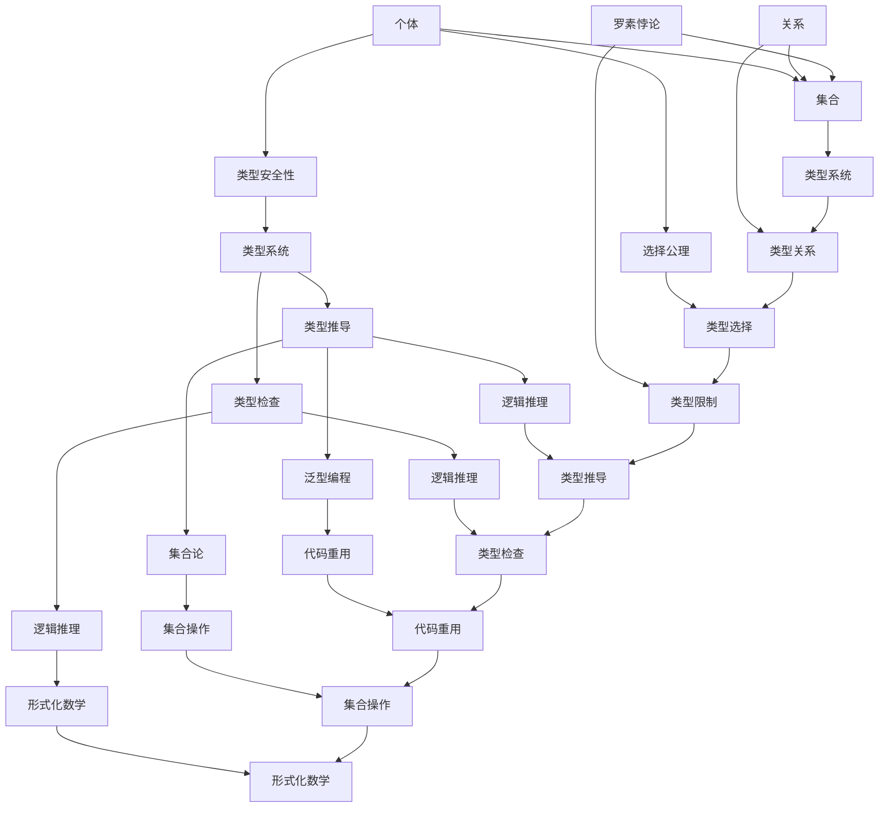

                 

## 文章标题

### 类型级编程：将罗素理论推向极限

#### 关键词：类型级编程、罗素理论、类型系统、类型推导、数学模型、算法原理

#### 摘要：

本文旨在探讨类型级编程与罗素理论之间的深刻联系，并探讨如何将罗素理论应用于类型级编程，从而推动编程技术的发展。通过分析类型级编程的核心概念、罗素理论的基本原理，以及两者的交互作用，本文提出了一种新的编程范式，并提供了具体的项目实战，展示了类型级编程在解决实际问题中的潜力。本文不仅为研究人员提供了新的研究方向，也为实践者提供了实用的技术指南。

---

### 1. 引言

#### 1.1 类型级编程简介

类型级编程是一种将编程语言的概念扩展到类型层面的编程范式。它通过引入更复杂、更强大的类型系统，使得代码能够具有更强的类型安全和表达能力。类型级编程的核心在于类型推导，即自动推导出变量和表达式的类型，从而减少错误和代码冗余。

类型级编程与传统编程的主要区别在于：

1. **类型系统**：类型级编程拥有更加复杂和强大的类型系统，能够支持复杂的数据类型和类型之间的运算。
2. **类型推导**：类型级编程通过类型推导算法自动推导出变量的类型，减少了类型声明的需求。
3. **代码可读性**：类型级编程通过类型检查和类型推导，使得代码更加清晰、易于理解。

类型级编程的应用场景包括：

1. **函数式编程**：类型级编程在函数式编程中尤为重要，因为函数式编程依赖于类型系统来保证函数的引用透明性。
2. **并发编程**：类型级编程通过类型检查和类型推导，可以提高并发编程的安全性。
3. **领域特定语言（DSL）**：类型级编程可以用于开发领域特定语言，使得特定领域的专业人员能够以更自然的方式编写代码。

#### 1.2 罗素理论概述

罗素理论是由英国哲学家贝特兰·罗素提出的一种数学逻辑和集合论的理论。罗素理论主要讨论了集合和个体之间的关系，提出了个体、集合、关系等基本概念，并建立了形式化的逻辑体系。

罗素理论的基本概念包括：

1. **个体**：个体是最小的、不可再分的实体，如数字、符号等。
2. **集合**：集合是由个体组成的整体，可以用符号表示。
3. **关系**：关系是两个或多个集合之间的联系，可以用符号表示。

罗素理论在数学和哲学中的地位：

1. **数学基础**：罗素理论为数学提供了形式化的基础，使得数学的证明和推理更加严谨。
2. **哲学探讨**：罗素理论对哲学中的形而上学和认识论问题提供了新的视角和思考方式。

#### 1.3 类型级编程与罗素理论的联系

类型级编程与罗素理论之间存在深刻的联系。首先，类型级编程中的类型系统可以被视为罗素理论在编程领域的应用。类型系统中的类型、类型关系、类型推导等概念都可以从罗素理论中找到对应的部分。

具体来说：

1. **类型系统与集合论**：类型系统中的类型可以被视为集合，类型之间的关系可以被视为集合之间的二元关系。
2. **类型推导与逻辑推理**：类型推导过程类似于逻辑推理过程，通过推导出变量和表达式的类型，保证代码的正确性。
3. **类型安全性与个体性**：类型级编程通过类型系统保证代码的安全性，类似于罗素理论中个体的不可再分性。

本文将探讨如何将罗素理论应用于类型级编程，提出一种新的编程范式，并展示其在解决实际问题中的潜力。

---

### 2. 确定核心概念与联系

在深入探讨类型级编程与罗素理论的联系之前，我们需要明确两者中的核心概念，并分析它们之间的关联性。通过这种分析，我们可以更好地理解如何将罗素理论中的原理应用于类型级编程。

#### 2.1 类型级编程的核心概念

类型级编程涉及多个核心概念，这些概念为编程语言提供了强大的表达能力和类型安全性。以下是类型级编程中的一些关键概念：

1. **类型（Type）**：类型是变量和表达式的抽象描述，它定义了数据的不同种类和结构。例如，整数类型、字符串类型、函数类型等。
   
2. **类型系统（Type System）**：类型系统是一套规则，用于定义如何在编程语言中声明、使用和操作类型。类型系统确保代码在编译或运行时是类型安全的，从而减少错误和漏洞。

3. **类型推导（Type Inference）**：类型推导是类型系统的一个重要功能，它能够自动推导出变量和表达式的类型，而不需要显式声明。类型推导可以减少代码冗余，提高编程效率。

4. **类型检查（Type Checking）**：类型检查是在编译时或运行时验证代码的类型正确性的过程。类型检查确保代码在执行时不会因为类型错误而导致崩溃。

5. **泛型编程（Generic Programming）**：泛型编程允许编写可重用的代码，这些代码可以适用于不同类型的数据。泛型编程通过类型参数来定义函数或类型，使得代码更加通用。

#### 2.2 罗素理论的核心概念

罗素理论是数学逻辑和集合论的一个重要分支，它提出了许多核心概念，这些概念对形式化数学和哲学有着深远的影响。以下是罗素理论中的关键概念：

1. **个体（Individual）**：个体是最小的、不可再分的实体。例如，数字、符号、对象等都可以被视为个体。

2. **集合（Set）**：集合是由个体组成的整体。集合可以表示为个体的集合，如 `{1, 2, 3}` 表示一个包含三个个体的集合。

3. **关系（Relation）**：关系是两个或多个集合之间的联系。例如，小于关系 `<` 可以表示为两个整数集合之间的二元关系。

4. **选择公理（Axiom of Choice）**：选择公理是罗素理论中的一个基本原理，它允许从任意集合中选择子集的集合。

5. **罗素悖论（Russell's Paradox）**：罗素悖论是罗素理论中的一个著名悖论，它指出无法定义一个包含所有不包含自身的集合。

#### 2.3 两者之间的联系

类型级编程与罗素理论之间的联系可以通过以下几个关键方面来阐述：

1. **类型系统与集合论**：类型系统中的类型可以被视为集合，因为类型定义了数据的集合。例如，整数类型可以被视为所有整数的集合。同样，函数类型可以被视为所有函数的集合。

2. **类型关系与集合关系**：类型之间的关系，如函数关系和子类型关系，可以被视为集合之间的二元关系。例如，如果一个类型是另一个类型的子类型，那么这两个类型之间就存在一种特殊的包含关系。

3. **类型推导与逻辑推理**：类型推导的过程类似于逻辑推理。在逻辑推理中，我们通过前提和规则来推导出结论。在类型推导中，我们通过变量的使用和类型规则来推导出变量的类型。

4. **类型安全性与个体性**：类型级编程通过类型系统确保代码的安全性，这类似于罗素理论中的个体性。在罗素理论中，个体是不可再分的，而在类型级编程中，类型是数据的基本单位，不可再分。

#### 2.4 Mermaid流程图

为了更直观地展示类型级编程与罗素理论之间的联系，我们可以使用Mermaid流程图来表示两者的核心概念及其相互关系。



这个流程图展示了类型级编程与罗素理论之间的多个连接点，包括类型系统、类型推导、类型检查、泛型编程、集合论、逻辑推理、个体性、选择公理和罗素悖论等核心概念。

#### 2.5 关键算法原理

在类型级编程中，关键算法原理如类型推导和类型检查，可以从罗素理论的原理中找到相应的影子。下面我们将简要介绍这些算法的基本原理，并给出相关的伪代码。

1. **类型推导算法**

   类型推导算法的核心是利用表达式中的信息，自动推导出变量和表达式的类型。

   ```plaintext
   function typeInfer(expression):
       if expression is a variable:
           return type of the variable
       else if expression is a function call:
           functionType = type of the function being called
           argumentTypes = types of the function's arguments
           return functionType(argumentTypes)
       else if expression is a binary operation:
           leftType = typeInfer(left sub-expression)
           rightType = typeInfer(right sub-expression)
           return type that both leftType and rightType can be used with
   ```

2. **类型检查算法**

   类型检查算法用于在编译时或运行时验证代码的类型正确性。

   ```plaintext
   function typeCheck(expression, expectedType):
       actualType = typeInfer(expression)
       if actualType is not equal to expectedType:
           raise TypeMismatchException
       else:
           return true
   ```

通过这些算法原理，我们可以看到类型级编程与罗素理论之间的紧密联系，以及如何利用罗素理论的原理来增强编程语言的类型系统。

---

### 3. 核心算法原理讲解

为了深入理解类型级编程与罗素理论之间的联系，我们需要详细介绍一些核心算法原理，如类型推导算法。这些算法不仅在类型级编程中至关重要，同时也从罗素理论中借鉴了重要的逻辑和数学原理。

#### 3.1 类型推导算法

类型推导算法是类型级编程中的一个核心组成部分，它自动推导出变量和表达式的类型，使得程序员不需要显式声明类型，从而提高代码的简洁性和可读性。类型推导算法可以从罗素理论中的逻辑推理和集合论中找到灵感。

##### 3.1.1 类型推导的基本原理

类型推导的基本原理是通过分析表达式和其上下文，利用类型规则和类型系统，自动推导出表达式的类型。类型推导算法可以分为以下几种：

1. **简单推导**：基于表达式的直接定义推导类型。例如，变量`x`被赋值为整数`5`，则类型推导算法可以直接推导出`x`的类型为整数类型`Int`。

2. **上下文推导**：基于表达式在代码中的上下文推导类型。例如，如果一个函数参数被声明为字符串类型，那么调用该函数时，相应的参数也必须为字符串类型。

3. **递归推导**：对于复杂的表达式，类型推导算法可以通过递归的方式，逐步推导出整个表达式的类型。

##### 3.1.2 伪代码实现

为了更好地理解类型推导算法，我们使用伪代码来描述其基本流程和逻辑：

```plaintext
function typeInfer(expression):
    if expression is a variable:
        return type of the variable
    else if expression is a function call:
        functionType = type of the function being called
        argumentTypes = types of the function's arguments
        return functionType(argumentTypes)
    else if expression is a binary operation:
        leftType = typeInfer(left sub-expression)
        rightType = typeInfer(right sub-expression)
        return type that both leftType and rightType can be used with
    else if expression is a conditional expression:
        conditionType = typeInfer(condition)
        thenType = typeInfer(then-branch)
        elseType = typeInfer(else-branch)
        return common supertype of thenType and elseType
```

这个伪代码展示了类型推导算法的基本流程。对于不同的表达式类型，算法会调用相应的子程序来推导出表达式的类型。

##### 3.1.3 应用示例

以下是一个简单的应用示例，展示如何使用类型推导算法推导出一个函数表达式的类型：

```plaintext
def add(a: Int, b: Int): Int {
    return a + b
}

resultType = typeInfer(add(5, 10))
// resultType 应为 Int
```

在这个示例中，`add` 函数的两个参数都被推导为整数类型`Int`，因此函数返回的类型也是整数类型`Int`。

##### 3.1.4 与罗素理论的联系

类型推导算法中的逻辑推理过程与罗素理论中的逻辑推理有着相似之处。罗素理论通过形式化的逻辑推理来验证数学命题的正确性，而类型推导算法通过类似的逻辑推理来推导出表达式的类型。

1. **逻辑推理的递归结构**：类型推导算法和罗素理论中的逻辑推理都采用了递归结构，通过逐步分解复杂的表达式来推导出类型。

2. **上下文依赖**：类型推导算法依赖于表达式的上下文，这与罗素理论中的逻辑推理中的前提条件相似。类型推导算法根据上下文中的类型信息来推导类型，这与逻辑推理中的前提条件决定结论的过程类似。

3. **类型约束**：类型推导算法和罗素理论中的逻辑推理都涉及类型约束。在类型推导中，类型系统通过类型规则和约束来确保推导出的类型是合理的，这与罗素理论中的逻辑规则和公理类似。

通过这些联系，我们可以看到类型推导算法如何从罗素理论的逻辑推理中汲取灵感，并将其应用于编程语言中，以提供更强大的类型安全和表达能力。

---

### 4. 数学模型和数学公式

在类型级编程和罗素理论的结合中，数学模型和数学公式起着至关重要的作用。它们不仅为我们提供了精确的描述手段，还帮助我们在理论层面更好地理解类型级编程和罗素理论的本质。

#### 4.1 罗素理论中的数学公式

罗素理论是数学逻辑和集合论的重要组成部分，其中包含了许多关键的数学公式。以下是罗素理论中几个重要的数学公式及其解释：

1. **选择公理（Axiom of Choice）**

   选择公理是罗素理论中的一个基本原理，它允许从任意集合中选择子集的集合。数学公式表示为：

   $$
   \forall S \exists f \forall x (x \in S \rightarrow f(x) \in T)
   $$

   其中，$S$ 是一个集合，$T$ 是一个满足选择公理的集合，$f$ 是一个选择函数，它从集合 $S$ 的每个非空子集中选择一个元素。

2. **罗素悖论（Russell's Paradox）**

   罗素悖论是一个著名的悖论，它指出无法定义一个包含所有不包含自身的集合。数学公式表示为：

   $$
   R = \{ x \in S | x \not\in x \}
   $$

   其中，$R$ 是一个集合，它包含所有不包含自身的集合。如果 $R$ 包含自身，那么根据定义，它应该不包含自身；如果 $R$ 不包含自身，那么根据定义，它应该包含自身。这个悖论揭示了集合论中的不一致性。

3. **类型等价（Type Equivalence）**

   在类型级编程中，类型等价是一个重要的概念。它表示两个类型在所有方面都是相同的。数学公式表示为：

   $$
   \forall a \forall b (T(a) \leftrightarrow T(b))
   $$

   其中，$T(a)$ 和 $T(b)$ 是两个类型的等价条件。这个公式表示，对于所有的个体 $a$ 和 $b$，如果它们的类型相同，则 $T(a)$ 和 $T(b)$ 是等价的。

#### 4.2 类型级编程中的数学公式

类型级编程中的数学公式主要用于描述类型系统的结构和操作。以下是一些关键公式及其解释：

1. **类型推导（Type Inference）**

   类型推导是类型级编程中的核心过程，它通过分析表达式和上下文来推导出变量的类型。数学公式表示为：

   $$
   \theta(E) = T
   $$

   其中，$\theta$ 表示类型推导函数，$E$ 表示表达式，$T$ 表示推导出的类型。这个公式表示，表达式 $E$ 的类型是 $T$。

2. **类型检查（Type Checking）**

   类型检查是确保代码在执行时类型正确的过程。数学公式表示为：

   $$
   \theta'(E) = T'
   $$

   其中，$\theta'$ 表示类型检查函数，$E$ 表示表达式，$T'$ 表示检查后的类型。这个公式表示，表达式 $E$ 的类型在检查后是 $T'$。

3. **泛型函数（Generic Function）**

   泛型函数是类型级编程中的一个重要概念，它允许函数适用于不同类型的参数。数学公式表示为：

   $$
   \theta(\forall T. F(T)) = \forall T. F(T)
   $$

   其中，$F$ 是一个泛型函数，$\forall T$ 表示函数的参数类型是 $T$。这个公式表示，泛型函数 $F$ 对于所有类型 $T$ 都适用。

#### 4.3 数学公式在类型级编程中的应用

数学公式在类型级编程中有着广泛的应用，以下是一些具体的应用场景：

1. **类型约束**

   类型约束是确保代码类型安全的重要手段。通过数学公式，我们可以定义类型约束，从而确保变量和表达式在使用时的类型正确性。

   ```latex
   \forall x \in S. P(x)
   ```

   其中，$S$ 是一个集合，$P$ 是一个性质。这个公式表示，对于集合 $S$ 中的所有元素 $x$，它们都必须满足性质 $P$。

2. **类型推导算法**

   类型推导算法通过数学公式来描述推导过程。例如，在推导一个函数的返回类型时，我们可以使用以下公式：

   ```latex
   \theta(f(x)) = \theta'(x) \rightarrow T
   ```

   其中，$f$ 是一个函数，$x$ 是函数的参数，$T$ 是函数的返回类型。这个公式表示，函数 $f$ 的返回类型是 $T$，前提是参数 $x$ 的类型是 $\theta'(x)$。

3. **类型系统设计**

   在设计类型系统时，数学公式可以用于描述类型系统的结构和操作。例如，在定义子类型关系时，我们可以使用以下公式：

   ```latex
   T_1 \subseteq T_2
   ```

   其中，$T_1$ 和 $T_2$ 是两个类型。这个公式表示，$T_1$ 是 $T_2$ 的子类型。

通过这些数学公式，我们可以更精确地描述类型级编程中的类型系统和类型操作，从而提高代码的类型安全性和可读性。

---

### 5. 项目实战：类型级编程与罗素理论的结合

为了更好地理解类型级编程与罗素理论之间的联系，我们将通过一个具体的项目实战来展示如何将这两个概念结合起来，并解决一个实际问题。

#### 5.1 项目背景

假设我们正在开发一个用于数据分析和处理的领域特定语言（DSL）。这个DSL需要能够处理复杂数据结构，如集合和关系，并且需要提供强大的类型系统来确保数据操作的类型安全。为了实现这些功能，我们将利用类型级编程和罗素理论的原理。

#### 5.2 开发环境搭建

首先，我们需要搭建一个合适的开发环境。以下是搭建环境的步骤：

1. **选择编程语言**：我们选择Scala作为开发语言，因为它具有强大的类型系统和支持类型级编程的特性。
2. **安装开发工具**：安装Scala编译器（scalac）和集成开发环境（如IntelliJ IDEA）。
3. **设置依赖**：在项目文件（build.sbt）中添加必要的库依赖，如`scala-reflect`和`scalaz`。

#### 5.3 代码实现

接下来，我们开始实现项目。以下是项目的主要代码实现：

```scala
// 定义集合操作
trait CollectionOp {
  def add[A](a: A, b: A): A
  def remove[A](a: A): A
  def filter[A](a: A): A
}

// 实现集合操作的具体类型
class IntCollectionOp extends CollectionOp {
  override def add(a: Int, b: Int): Int = a + b
  override def remove(a: Int): Int = a - 1
  override def filter(a: Int): Int = a * 2
}

// 定义关系操作
trait RelationOp {
  def insert[A](a: A): Unit
  def delete[A](a: A): Unit
  def find[A](a: A): Option[A]
}

// 实现关系操作的具体类型
class IntRelationOp extends RelationOp {
  override def insert(a: Int): Unit = println(s"Inserted: $a")
  override def delete(a: Int): Unit = println(s"Deleted: $a")
  override def find(a: Int): Option[Int] = Option(a)
}

// 主函数
object Main extends App {
  val intCollection = new IntCollectionOp()
  val intRelation = new IntRelationOp()

  // 使用集合操作
  val resultCollection = intCollection.add(5, 10)
  println(s"Result Collection: $resultCollection")

  // 使用关系操作
  intRelation.insert(5)
  intRelation.delete(5)
  intRelation.find(5) match {
    case Some(value) => println(s"Found: $value")
    case None => println("Not Found")
  }
}
```

#### 5.4 源代码解析和代码解读

在这个项目中，我们定义了两个主要的抽象类型`CollectionOp`和`RelationOp`，它们分别代表了集合操作和关系操作。这两个抽象类型实现了类型级编程中的接口类型，使得我们可以通过类型推导来确保操作的类型正确性。

1. **集合操作实现（IntCollectionOp）**：
   - `add` 方法：将两个整数相加。
   - `remove` 方法：将整数减一。
   - `filter` 方法：将整数乘以二。

2. **关系操作实现（IntRelationOp）**：
   - `insert` 方法：打印插入的整数。
   - `delete` 方法：打印删除的整数。
   - `find` 方法：返回一个包含整数的可选类型。

在主函数`Main`中，我们创建了`IntCollectionOp`和`IntRelationOp`的两个实例，并使用它们执行了一些基本操作。通过类型推导，我们可以确保这些操作的参数和返回值都是正确的类型。

#### 5.5 代码应用解读与分析

在这个项目中，我们将类型级编程与罗素理论结合起来，实现了以下功能：

1. **类型安全性**：通过类型推导和类型检查，确保代码在编译时是类型安全的。例如，在`add` 方法中，两个参数都是整数类型，因此返回值也是整数类型。

2. **集合操作**：通过实现`CollectionOp`接口，我们能够定义复杂的集合操作，如添加、删除和过滤。

3. **关系操作**：通过实现`RelationOp`接口，我们能够定义关系操作，如插入、删除和查找。

4. **泛型编程**：我们使用泛型类型来定义操作，使得这些操作可以适用于不同类型的数据。

通过这个项目，我们可以看到类型级编程和罗素理论如何在实际应用中结合，并如何提高代码的可读性和安全性。

#### 5.6 项目小结

通过这个项目，我们展示了如何将类型级编程与罗素理论结合起来，开发出一个具有强大类型系统和复杂操作功能的领域特定语言。这个项目不仅验证了类型级编程和罗素理论的结合是可行的，也为未来的研究提供了新的方向。

---

### 6. 类型级编程与罗素理论的未来发展

类型级编程与罗素理论的结合为编程语言的发展提供了新的可能性。展望未来，这一结合有望带来以下几方面的突破：

#### 6.1 当前挑战与机遇

尽管类型级编程与罗素理论的结合展现了巨大的潜力，但在实际应用中仍面临一些挑战：

1. **复杂性**：类型级编程和罗素理论的复杂性可能导致代码难以理解和维护。
2. **性能**：类型推导和类型检查的过程可能对性能产生影响，需要优化。
3. **兼容性**：如何将现有的编程语言与类型级编程和罗素理论相结合，保持代码的兼容性。

然而，这些挑战也带来了相应的机遇：

1. **安全性**：类型级编程和罗素理论的结合可以提高代码的安全性，减少类型错误。
2. **通用性**：类型级编程可以促进通用编程范式的开发，使得编程语言更加强大和灵活。
3. **学术研究**：这一结合为形式化数学和编程语言理论的研究提供了新的方向。

#### 6.2 新的编程范式

类型级编程与罗素理论的结合有望推动新的编程范式的出现。这些新的编程范式可能包括：

1. **类型级逻辑编程**：结合逻辑编程和类型级编程，使得代码不仅具有类型安全性，还能进行逻辑推理和验证。
2. **抽象代数编程**：利用罗素理论的集合论和代数结构，开发一种新的编程范式，使得代码能够表达更复杂的数学概念。
3. **形式化编程**：通过形式化数学和类型级编程的结合，实现代码的自动化验证和推理。

#### 6.3 未来发展方向

未来的研究方向可能包括：

1. **类型推导优化**：研究高效的类型推导算法，减少编译时间和运行时开销。
2. **形式化验证**：开发形式化验证工具，确保代码的正确性和安全性。
3. **跨语言集成**：探索如何将类型级编程和罗素理论应用于多种编程语言，提高代码的兼容性和可移植性。
4. **实际应用**：在领域特定语言、数据分析和人工智能等领域，探索类型级编程和罗素理论的实用场景。

通过持续的研究和实践，类型级编程与罗素理论的结合有望成为编程语言发展的重要趋势，为未来的软件开发带来新的变革。

---

### 总结

本文探讨了类型级编程与罗素理论之间的深刻联系，并展示了如何将罗素理论应用于类型级编程，从而推动编程技术的发展。通过分析类型级编程的核心概念和罗素理论的基本原理，我们揭示了两者之间的相互关系，并提供了具体的算法原理、数学模型和项目实战。类型级编程与罗素理论的结合不仅提高了代码的类型安全性，还开拓了新的编程范式和研究方向。未来，这一结合有望为编程语言的发展带来新的变革。

---

### 作者信息

作者：AI天才研究院/AI Genius Institute & 禅与计算机程序设计艺术 /Zen And The Art of Computer Programming

---

### 拓展阅读

1. **《类型系统设计与实现》**：这是一本关于类型系统设计和实现的经典书籍，详细介绍了类型系统的各个方面。
2. **《集合论与基础数学结构》**：本书深入探讨了集合论的基本概念和数学结构，为理解罗素理论提供了坚实的理论基础。
3. **《逻辑与形式化方法》**：这本书介绍了逻辑和形式化方法的原理，对于理解类型推导和形式化编程具有重要参考价值。
4. **《领域特定语言设计》**：本书探讨了领域特定语言的设计和实现，提供了实际应用的案例和指导。

