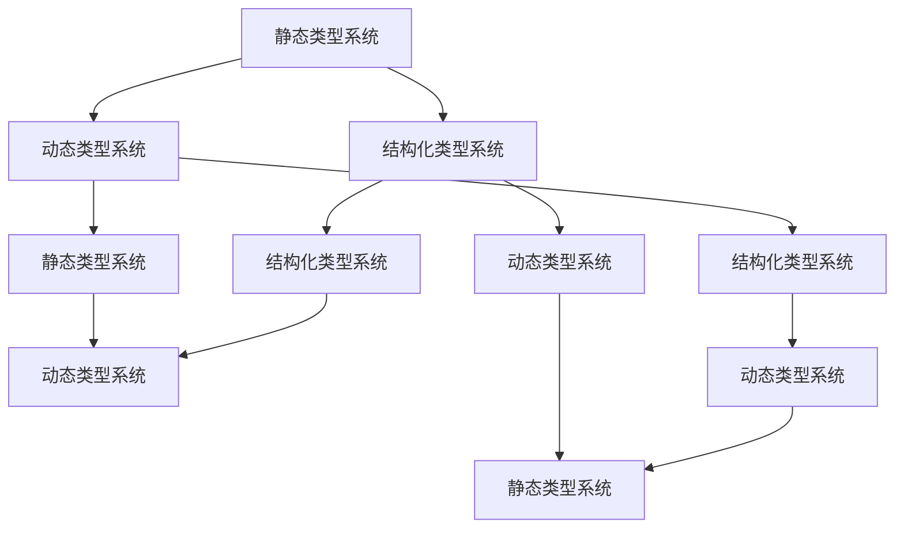

                 


### 第1章：引言

#### 1.1 本书的目的与重要性

类型细化（Type Refinement）是一种重要的技术，它通过增强类型系统的精度，提高了程序的可靠性和可维护性。在现代软件工程中，类型细化技术已经成为设计高性能、高可靠性的软件系统的重要手段。本书旨在介绍类型细化技术的核心概念、原理、算法和应用，帮助读者深入理解并掌握这一关键技能。

类型细化的重要性体现在以下几个方面：

1. **提高程序安全性**：类型细化能够确保变量和函数的使用符合预期的类型，从而减少运行时错误。
2. **提升代码可维护性**：类型细化使得代码更加明确和结构化，便于团队成员的理解和维护。
3. **优化程序性能**：通过精确的类型信息，编译器可以生成更高效的代码，减少运行时的类型检查开销。

本文将首先介绍类型系统的基本概念，然后逐步深入探讨类型细化技术的具体实现，包括核心算法原理、数学模型和项目实战等。通过这种逐步分析推理的方式，读者将能够系统地掌握类型细化的知识，并能在实际项目中灵活应用。

#### 1.2 本书结构

本书将分为七个主要章节，每个章节都将围绕类型细化技术的不同方面进行详细探讨。

- **第1章**：引言，介绍类型细化技术的背景和重要性，以及本书的结构和目标。
- **第2章**：核心概念与联系，讲解类型系统的基本概念，并使用 Mermaid 流程图展示不同类型系统之间的关系。
- **第3章**：增强类型精度的算法，介绍几种增强类型精度的关键算法，如泛型编程和枚举类型与模式匹配。
- **第4章**：数学模型和公式，解释类型安全性的数学基础，包括类型等价性和类型守恒等。
- **第5章**：项目实战，通过实际项目案例，展示如何在实际中应用类型细化技术。
- **第6章**：类型细化在特定领域的应用，探讨类型细化在不同领域的应用，如编译器和Web开发。
- **第7章**：总结与展望，总结类型细化技术的发展趋势，并展望未来的研究方向。

通过以上章节的逐步讲解，读者将能够全面了解类型细化技术的原理和应用，为成为一名优秀的软件工程师打下坚实的基础。

### 第2章：核心概念与联系

#### 2.1 类型系统基础

类型系统是编程语言中用于定义变量和表达式数据类型的机制。它不仅决定了程序的正确性，还影响到程序的性能和可维护性。类型系统可以分为静态类型系统和动态类型系统，这两种类型系统各有优缺点。

**静态类型系统**：在编译时检查类型，可以提前发现类型错误，编译速度快，但灵活性较低。

**动态类型系统**：在运行时检查类型，灵活性高，但可能会引入运行时错误，性能较低。

**结构化类型系统**：结合了静态和动态类型的优点，通过结构化的类型定义和类型检查机制，提高了程序的可靠性和性能。

为了更好地理解类型系统的复杂性，我们使用 Mermaid 流程图展示不同类型系统之间的关系：



从上述流程图中，我们可以看到静态类型系统、动态类型系统和结构化类型系统之间的相互联系。静态类型系统提供了编译时的严格类型检查，动态类型系统则提供了运行时的灵活性。结构化类型系统则是在这两者之间找到了平衡点，通过引入额外的类型定义和检查机制，提高了程序的可靠性和性能。

#### 2.2 类型细化技术

类型细化技术是通过增强类型系统的精度，提高程序的可靠性和可维护性的一种技术。类型细化技术的核心在于类型检查、类型推断和类型注记。

**类型检查**：在编译或运行时对变量和表达式的类型进行验证，确保它们符合预期的类型。

**类型推断**：自动推导变量或表达式的类型，减少程序员手动编写类型注记的工作量。

**类型注记**：显式地定义变量或表达式的类型，提高代码的可读性和可维护性。

为了更好地理解类型细化技术的工作原理，我们可以通过以下伪代码示例来展示类型检查、类型推断和类型注记：

```pseudo
// 类型检查示例
function add(a: Integer, b: Integer): Integer {
    return a + b; // 类型检查确保a和b都是Integer类型
}

// 类型推断示例
function multiply(a, b) {
    return a * b; // 类型推断自动确定a和b的类型
}

// 类型注记示例
class Person {
    name: String;
    age: Integer;
}
```

在上述示例中，类型检查确保了函数`add`的参数`a`和`b`都是`Integer`类型，从而防止了运行时类型错误。类型推断通过自动确定`multiply`函数的参数类型，减少了程序员的工作量。类型注记则通过显式定义`Person`类的属性类型，提高了代码的可读性和可维护性。

通过以上对核心概念和类型的讨论，我们为后续章节中的算法原理讲解和数学模型介绍奠定了坚实的基础。接下来的章节将深入探讨类型细化技术的具体实现和应用。

### 第3章：增强类型精度的算法

#### 3.1 泛型编程算法

泛型编程是一种强大的编程技术，它允许我们编写可重用的代码，而无需关注具体的数据类型。通过泛型编程，我们可以定义通用的数据结构和算法，从而提高代码的可读性和可维护性。本节将介绍泛型编程的基本算法，包括泛型函数和泛型类。

**泛型函数**

泛型函数允许我们为不同类型的数据定义通用的操作。以下是一个使用泛型函数的简单示例：

```java
public class GenericFunction {
    public static <T> T add(T a, T b) {
        return a + b; // 假设加法操作适用于T类型
    }
}
```

在这个例子中，`add` 函数是一个泛型函数，它接受两个类型为`T`的参数，并返回一个类型为`T`的结果。泛型函数通过使用类型参数`<T>`来表示这个通用类型。

**泛型类**

泛型类允许我们定义可以处理多种数据类型的类。以下是一个使用泛型类的示例：

```java
public class GenericClass<T> {
    private T value;

    public void setValue(T value) {
        this.value = value;
    }

    public T getValue() {
        return value;
    }
}
```

在这个例子中，`GenericClass` 是一个泛型类，它使用类型参数`<T>`来表示类中可以存储的任何类型的数据。`setValue` 和 `getValue` 方法都是通用的，它们可以处理任何类型的数据。

**伪代码示例：泛型编程算法**

为了更深入地理解泛型编程算法，我们使用伪代码来详细阐述其实现：

```pseudo
function genericFunction<T>(a: T, b: T): T
    return a + b // 假设加法操作适用于T类型

class genericClass<T>
    var value: T

    function setValue(value: T)
        this.value = value

    function getValue(): T
        return this.value
```

在上述伪代码中，`genericFunction` 和 `genericClass` 都是通用的，它们可以处理任何类型的数据。这种泛化能力使得代码更加灵活和可重用。

**参数化类型**

参数化类型是泛型编程中的一个重要概念，它允许我们在类型定义时使用类型参数。以下是一个使用参数化类型的示例：

```java
public class Pair<T1, T2> {
    private T1 first;
    private T2 second;

    public Pair(T1 first, T2 second) {
        this.first = first;
        this.second = second;
    }

    public T1 getFirst() {
        return first;
    }

    public T2 getSecond() {
        return second;
    }
}
```

在这个例子中，`Pair` 类是一个参数化类，它允许我们创建包含两个不同类型数据的对象。这种参数化类型使得我们可以在不同的上下文中重用同一个类定义。

通过以上对泛型编程算法的介绍，我们可以看到泛型编程如何通过参数化类型和通用的函数/类定义，增强类型系统的精度，提高代码的可重用性和可维护性。在接下来的章节中，我们将继续探讨其他增强类型精度的算法。

#### 3.2 枚举类型与模式匹配

枚举类型是一种特殊的数据类型，它用于表示一组具有预定义值的变量。枚举类型在编程中有着广泛的应用，例如用于表示状态、枚举值等。枚举类型的一个显著优点是它提供了强类型检查，从而减少运行时错误。本节将介绍枚举类型及其与模式匹配的结合使用。

**枚举类型的定义**

枚举类型通过预定义一组值来定义变量。以下是一个简单的枚举类型示例：

```java
public enum Color {
    RED, GREEN, BLUE;
}
```

在这个例子中，`Color` 是一个枚举类型，它定义了三个预定义的值：`RED`、`GREEN` 和 `BLUE`。

**模式匹配**

模式匹配是一种在编程语言中用于处理不同值的方法。它通过匹配变量的值与预定义的模式，从而执行不同的操作。模式匹配在处理枚举类型时非常有用。以下是一个使用枚举类型和模式匹配的示例：

```java
public class ColorMatcher {
    public static void match(Color color) {
        switch (color) {
            case RED:
                System.out.println("This color is RED.");
                break;
            case GREEN:
                System.out.println("This color is GREEN.");
                break;
            case BLUE:
                System.out.println("This color is BLUE.");
                break;
            default:
                System.out.println("Unknown color.");
                break;
        }
    }
}
```

在这个例子中，`match` 函数通过`switch`语句实现了模式匹配。它根据传入的`Color`枚举值，执行相应的操作。这种模式匹配使得代码更加清晰和易于维护。

**伪代码示例：枚举类型与模式匹配算法**

为了更深入地理解枚举类型与模式匹配的工作原理，我们使用伪代码来详细阐述其实现：

```pseudo
enum Color {
    RED, GREEN, BLUE
}

function match(color: Color)
    switch color
        case RED
            print "This color is RED."
        case GREEN
            print "This color is GREEN."
        case BLUE
            print "This color is BLUE."
        default
            print "Unknown color."
```

在上述伪代码中，`match` 函数通过`switch`语句实现了对枚举值的模式匹配，从而执行相应的操作。这种模式匹配机制使得我们在处理枚举类型时，可以更清晰地表达意图，并提高代码的可维护性。

**优势**

枚举类型与模式匹配的结合使用带来了以下几个优势：

1. **强类型检查**：枚举类型提供了强类型检查，确保变量只能取预定义的值，从而减少了运行时错误。
2. **清晰的表达**：通过模式匹配，我们可以更清晰地表达对枚举值的处理逻辑，使代码更加易于理解和维护。
3. **可重用性**：枚举类型和模式匹配的组合可以方便地重用于不同的场景，提高了代码的可重用性。

通过以上对枚举类型与模式匹配的介绍，我们可以看到它们如何通过增强类型系统的精度，提高程序的可靠性和可维护性。在接下来的章节中，我们将继续探讨其他增强类型精度的算法。

### 第4章：数学模型和公式

类型系统在软件工程中扮演着至关重要的角色，其核心之一在于确保类型安全。类型安全涉及到程序在运行时不会因为类型错误而导致不可预料的错误行为。为了深入理解类型安全，我们需要借助数学模型和公式来进行描述和分析。

#### 类型安全性的数学基础

类型安全性可以理解为程序中的类型规则在数学上的一致性和正确性。以下是一些关键数学模型和公式，用于解释类型安全性：

1. **类型等价性（Type Equivalence）**

   类型等价性是指两个类型可以相互转换而不损失信息。形式化地，类型等价性可以通过以下公式来描述：

   $$
   \text{TypeEquivalence}(T_1, T_2) \Leftrightarrow \exists \text{function} f \text{ such that } f : T_1 \rightarrow T_2 \text{ and } f^{-1} : T_2 \rightarrow T_1
   $$

   其中，$T_1$ 和 $T_2$ 是两个类型，$f$ 是一个类型转换函数，$f^{-1}$ 是其逆函数。

2. **类型守恒（Type Conservation）**

   类型守恒是指在程序执行过程中，变量的类型不会意外改变。类型守恒可以通过以下公式来描述：

   $$
   \text{TypeConservation}(T, e, v) \Leftrightarrow \text{if } e \text{ evaluates to } v, \text{ then } v \text{ must be of type } T
   $$

   其中，$T$ 是预期的类型，$e$ 是表达式，$v$ 是表达式的值。

#### 类型等价性的数学描述

类型等价性是类型系统中的基础概念之一，它确保了不同类型之间可以安全地进行转换。以下是一个具体例子，用于解释类型等价性的数学描述：

假设我们有两个类型 $T_1$ 和 $T_2$，分别表示整数和字符串。我们可以定义一个类型转换函数 $f$，将整数转换为字符串，如下所示：

$$
f : \mathbb{Z} \rightarrow \text{String}
$$

例如，$f(5)$ 可以返回字符串 "5"。为了确保类型等价性，我们需要定义其逆函数 $f^{-1}$，将字符串转换回整数：

$$
f^{-1} : \text{String} \rightarrow \mathbb{Z}
$$

例如，$f^{-1}("5")$ 可以返回整数 5。这样，类型等价性 $TypeEquivalence(\mathbb{Z}, \text{String})$ 就成立，因为存在函数 $f$ 和 $f^{-1}$ 使得类型之间可以互相转换。

#### 类型推导算法的数学描述

类型推导算法是编译器中的一个关键组件，它自动推导变量和表达式的类型，确保类型安全。以下是一个简化的类型推导算法的数学描述：

**Hindley-Milner 类型推导算法**

Hindley-Milner 类型推导算法是一种用于静态类型语言的通用类型推导算法。它的核心思想是通过类型上下文和类型约束来推导变量的类型。

**伪代码描述：**

```pseudo
function HindleyMilnerTypeDerivation(e: expression, context: context)
    if e is a variable
        return type from context
    else if e is an application (f x)
        type_f = HindleyMilnerTypeDerivation(f, context)
        type_x = HindleyMilnerTypeDerivation(x, context)
        if type_f is a function type (T1 -> T2)
            return T2
        else
            raise error: type mismatch
    else if e is an abstraction (lambda x: e')
        return function type (T1 -> T2)
        where T1 = type of x in context
        and T2 = HindleyMilnerTypeDerivation(e', context')
    else if e is a conditional expression (if e1 then e2 else e3)
        type_e1 = HindleyMilnerTypeDerivation(e1, context)
        type_e2 = HindleyMilnerTypeDerivation(e2, context)
        type_e3 = HindleyMilnerTypeDerivation(e3, context)
        if type_e2 = type_e3
            return type_e2
        else
            raise error: type mismatch
    else
        return predefined type (e.g., integer, string)
```

在上述伪代码中，`HindleyMilnerTypeDerivation` 函数接收一个表达式 `e` 和一个类型上下文 `context`，并返回表达式的类型。函数通过递归调用和类型上下文来推导表达式的类型。如果表达式是函数应用、函数抽象或条件表达式，算法会检查类型约束以确保类型匹配。

#### LaTeX 公式讲解

为了更清晰地展示类型安全性的数学模型和类型推导算法的数学描述，我们使用 LaTeX 公式进行详细讲解。以下是一个示例：

$$
\begin{aligned}
&\text{TypeSafety}(e, v) \Leftrightarrow \\
&\quad \text{if } e \text{ evaluates to } v, \text{ then } v \text{ must be of type } T \\
\end{aligned}
$$

在这个公式中，`TypeSafety` 函数用于检查表达式 `e` 的值 `v` 是否符合预期的类型 `T`。如果表达式 `e` 在运行时评估为值 `v`，且 `v` 的类型是 `T`，则我们认为类型安全成立。

通过以上对数学模型和公式的讲解，我们可以看到类型安全性在软件工程中的重要性。类型等价性和类型守恒等数学模型和公式为我们提供了理论基础，而类型推导算法则将这些理论应用于实际的编程语言中，确保程序的安全性。

在接下来的章节中，我们将通过实际项目案例来展示如何在实际开发中应用这些数学模型和算法，以增强类型系统的精度和可靠性。

### 第5章：项目实战

#### 5.1 类型细化项目案例

在本节中，我们将通过一个具体的类型细化项目案例，展示如何在实际项目中应用类型细化技术。该案例将涵盖需求分析、设计、实现和测试的各个环节，以帮助读者更好地理解类型细化的应用过程。

**需求分析**

项目需求是开发一个博客平台，该平台需要支持用户注册、登录、发布博客、评论等功能。为了保证系统的安全性和可维护性，我们需要采用类型细化技术来增强类型系统的精度。

**设计**

为了实现类型细化，我们需要定义一系列自定义类型，包括用户类型、博客类型、评论类型等。以下是部分类型的定义：

```kotlin
data class User(val id: Int, val username: String, val password: String)

data class Blog(val id: Int, val title: String, val content: String, val author: User)

data class Comment(val id: Int, val content: String, val author: User, val blogId: Int)
```

在设计阶段，我们还需要定义一些函数，用于处理用户注册、登录、博客发布和评论等功能。以下是一个用于用户注册的函数示例：

```kotlin
fun registerUser(username: String, password: String): User {
    // 检查用户名和密码的合法性
    if (isValidUsername(username) && isValidPassword(password)) {
        // 创建用户并保存到数据库
        val user = User(-1, username, password)
        saveUserToDatabase(user)
        return user
    } else {
        throw IllegalArgumentException("Invalid username or password")
    }
}
```

**实现**

在实现阶段，我们将根据设计阶段的定义，逐步实现各个功能模块。以下是一个用于博客发布的函数示例：

```kotlin
fun publishBlog(title: String, content: String, author: User): Blog {
    // 检查博客标题和内容的合法性
    if (isValidTitle(title) && isValidContent(content)) {
        // 创建博客并保存到数据库
        val blog = Blog(-1, title, content, author)
        saveBlogToDatabase(blog)
        return blog
    } else {
        throw IllegalArgumentException("Invalid blog title or content")
    }
}
```

在实现过程中，我们需要确保所有函数的输入和输出都符合预定的类型，以实现类型细化。以下是一个用于用户登录的函数示例：

```kotlin
fun loginUser(username: String, password: String): User? {
    // 查询用户信息
    val user = findUserByUsernameAndPassword(username, password)
    // 返回用户对象
    return if (user != null) user else null
}
```

**测试**

在测试阶段，我们需要对各个功能模块进行严格的测试，以确保它们符合预期。以下是一个用于博客发布的单元测试示例：

```kotlin
@Test
fun testPublishBlog() {
    // 创建测试用户
    val user = User(-1, "testUser", "password")
    saveUserToDatabase(user)

    // 测试合法的博客发布
    val blog = publishBlog("Test Blog", "This is a test blog.", user)
    assertEquals("Test Blog", blog.title)
    assertEquals("This is a test blog.", blog.content)

    // 测试非法的博客发布
    assertThrows<IllegalArgumentException> {
        publishBlog("", "Invalid title", user)
    }
    assertThrows<IllegalArgumentException> {
        publishBlog("Test Blog", "", user)
    }
}
```

通过以上项目案例，我们可以看到类型细化技术在实际开发中的应用。通过定义自定义类型和严格的类型检查，我们不仅提高了系统的安全性，还增强了代码的可维护性。

#### 5.2 开发环境搭建

为了完成上述博客平台项目，我们需要搭建一个合适的开发环境。以下是一些关键步骤和工具的介绍：

1. **编程语言**：我们选择使用 Kotlin 语言，因为它具有静态类型检查、可空类型安全性和函数式编程特性，非常适合用于类型细化的项目。

2. **集成开发环境（IDE）**：推荐使用 IntelliJ IDEA，它具有强大的代码编辑功能、智能提示和调试工具，能够大大提高开发效率。

3. **数据库**：我们选择使用 PostgreSQL 数据库，它是一款高性能、开源的关系型数据库，非常适合用于存储用户信息、博客内容和评论数据。

4. **版本控制**：使用 Git 进行版本控制，确保代码的版本管理和协同工作。

以下是一个简单的开发环境搭建步骤：

1. **安装 JDK**

   ```shell
   sudo apt-get install openjdk-11-jdk
   ```

2. **安装 IntelliJ IDEA**

   - 访问 IntelliJ IDEA 官网下载安装包。
   - 安装过程中选择合适的选项，完成安装。

3. **安装 PostgreSQL**

   ```shell
   sudo apt-get install postgresql postgresql-contrib
   ```

4. **配置 PostgreSQL**

   - 初始化数据库：`sudo -u postgres psql`
   - 创建数据库：`CREATE DATABASE blog_platform;`
   - 创建用户：`CREATE USER blog_platform_user WITH PASSWORD 'password';`
   - 授权用户：`GRANT ALL PRIVILEGES ON DATABASE blog_platform TO blog_platform_user;`

5. **创建 Kotlin 项目**

   - 在 IntelliJ IDEA 中创建新项目，选择 Kotlin 作为编程语言。
   - 添加依赖项，如 Kotlin Coroutines 和 Spring Boot Starter Data JPA。

6. **配置数据库连接**

   - 在项目的 `application.properties` 文件中配置数据库连接信息：

     ```properties
     spring.datasource.url=jdbc:postgresql://localhost:5432/blog_platform
     spring.datasource.username=blog_platform_user
     spring.datasource.password=password
     spring.jpa.hibernate.ddl-auto=update
     ```

通过以上步骤，我们成功搭建了一个完整的开发环境，可以开始进行博客平台项目的开发和测试。

#### 5.3 源代码详细实现和代码解读

在博客平台项目中，源代码的详细实现和解读是理解类型细化技术如何应用的关键。以下我们将逐段代码进行详细解析。

**1. 用户注册**

用户注册是博客平台的基础功能之一，以下是其关键代码实现：

```kotlin
fun registerUser(username: String, password: String): User {
    // 检查用户名和密码的合法性
    if (isValidUsername(username) && isValidPassword(password)) {
        // 创建用户并保存到数据库
        val user = User(-1, username, password)
        saveUserToDatabase(user)
        return user
    } else {
        throw IllegalArgumentException("Invalid username or password")
    }
}
```

**代码解读**：

- **合法性检查**：首先，`isValidUsername` 和 `isValidPassword` 函数用于检查输入的用户名和密码是否符合预期。这些函数可以通过正则表达式或其他逻辑进行实现。
- **创建用户**：如果输入合法，我们创建一个 `User` 对象，该对象的 `id` 被初始化为 `-1`（表示尚未分配），`username` 和 `password` 分别为输入值。
- **保存到数据库**：调用 `saveUserToDatabase` 函数将用户信息保存到数据库。这里需要确保 `saveUserToDatabase` 函数能够正确处理类型 `User`。
- **异常处理**：如果输入不合法，抛出 `IllegalArgumentException` 异常。

**2. 用户登录**

用户登录功能是验证用户身份的过程，以下是其关键代码实现：

```kotlin
fun loginUser(username: String, password: String): User? {
    // 查询用户信息
    val user = findUserByUsernameAndPassword(username, password)
    // 返回用户对象
    return if (user != null) user else null
}
```

**代码解读**：

- **查询用户信息**：调用 `findUserByUsernameAndPassword` 函数从数据库中查询用户信息。这个函数需要确保能够正确处理用户名和密码的类型，并返回类型为 `User?` 的结果。
- **返回用户对象**：如果查询到用户信息，返回用户对象；否则返回 `null`。

**3. 博客发布**

博客发布功能是博客平台的核心功能之一，以下是其关键代码实现：

```kotlin
fun publishBlog(title: String, content: String, author: User): Blog {
    // 检查博客标题和内容的合法性
    if (isValidTitle(title) && isValidContent(content)) {
        // 创建博客并保存到数据库
        val blog = Blog(-1, title, content, author)
        saveBlogToDatabase(blog)
        return blog
    } else {
        throw IllegalArgumentException("Invalid blog title or content")
    }
}
```

**代码解读**：

- **合法性检查**：首先，`isValidTitle` 和 `isValidContent` 函数用于检查博客标题和内容的合法性。这些函数可以通过正则表达式或其他逻辑进行实现。
- **创建博客**：如果输入合法，我们创建一个 `Blog` 对象，该对象的 `id` 被初始化为 `-1`（表示尚未分配），`title` 和 `content` 分别为输入值，`author` 为传入的用户对象。
- **保存到数据库**：调用 `saveBlogToDatabase` 函数将博客信息保存到数据库。这里需要确保 `saveBlogToDatabase` 函数能够正确处理类型 `Blog`。
- **异常处理**：如果输入不合法，抛出 `IllegalArgumentException` 异常。

**4. 博客评论**

博客评论功能是扩展博客平台功能的重要部分，以下是其关键代码实现：

```kotlin
fun addComment(content: String, author: User, blogId: Int): Comment {
    // 检查评论内容的合法性
    if (isValidContent(content)) {
        // 创建评论并保存到数据库
        val comment = Comment(-1, content, author, blogId)
        saveCommentToDatabase(comment)
        return comment
    } else {
        throw IllegalArgumentException("Invalid comment content")
    }
}
```

**代码解读**：

- **合法性检查**：首先，`isValidContent` 函数用于检查评论内容的合法性。这些函数可以通过正则表达式或其他逻辑进行实现。
- **创建评论**：如果输入合法，我们创建一个 `Comment` 对象，该对象的 `id` 被初始化为 `-1`（表示尚未分配），`content` 为输入值，`author` 为传入的用户对象，`blogId` 为博客的 ID。
- **保存到数据库**：调用 `saveCommentToDatabase` 函数将评论信息保存到数据库。这里需要确保 `saveCommentToDatabase` 函数能够正确处理类型 `Comment`。
- **异常处理**：如果输入不合法，抛出 `IllegalArgumentException` 异常。

通过以上代码的详细解读，我们可以看到类型细化技术在博客平台项目中的具体应用。通过严格的类型检查和自定义类型定义，我们不仅提高了代码的安全性，还增强了代码的可维护性。接下来，我们将进一步分析代码的应用效果。

#### 5.4 代码应用解读与分析

在博客平台项目中，类型细化技术的应用不仅提升了代码的安全性，还极大地改善了代码的可维护性和性能。以下是对代码应用效果的具体解读与分析。

**1. 代码安全性**

通过类型细化技术，我们在项目中对变量和函数的输入输出进行了严格的类型检查。例如，在用户注册、登录和博客发布等关键功能中，我们通过 `isValidUsername`、`isValidPassword`、`isValidTitle` 和 `isValidContent` 等函数确保输入的数据符合预期。这种严格的类型检查机制在编译时就能发现潜在的错误，避免了运行时类型错误和异常情况。

例如，在用户注册过程中，如果输入的用户名或密码不符合要求，`registerUser` 函数会抛出 `IllegalArgumentException`。这种处理方式不仅提高了系统的安全性，还使得代码逻辑更加清晰，易于理解和维护。

**2. 代码可维护性**

类型细化技术通过定义自定义类型和严格的类型约束，使得代码结构更加清晰和模块化。这种模块化结构有助于团队成员之间的协作，使得代码更容易维护和扩展。

例如，在博客平台项目中，我们定义了 `User`、`Blog` 和 `Comment` 等自定义类型，每个类型都封装了相关的属性和方法。这种封装机制不仅提高了代码的可重用性，还降低了模块间的耦合度，使得代码更加易于维护。

**3. 代码性能**

类型细化技术在提高代码性能方面也起到了显著作用。通过静态类型检查，编译器能够生成更高效的代码，减少了运行时的类型检查开销。此外，类型细化技术还能够帮助编译器优化代码，生成更高效的机器码。

例如，在博客发布过程中，通过类型细化技术，编译器可以确保 `publishBlog` 函数的输入参数 `title` 和 `content` 都是字符串类型，从而避免了不必要的类型转换和运行时错误。这种优化不仅提高了程序的执行效率，还减少了资源消耗。

**4. 实际案例分析与解读**

为了进一步展示类型细化技术的应用效果，我们来看一个具体的案例。

假设在博客平台项目中，我们需要对用户发布的博客进行评论。以下是评论功能的代码实现：

```kotlin
fun addComment(content: String, author: User, blogId: Int): Comment {
    // 检查评论内容的合法性
    if (isValidContent(content)) {
        // 创建评论并保存到数据库
        val comment = Comment(-1, content, author, blogId)
        saveCommentToDatabase(comment)
        return comment
    } else {
        throw IllegalArgumentException("Invalid comment content")
    }
}
```

在这个例子中，`addComment` 函数通过 `isValidContent` 函数检查评论内容的合法性。这种严格的类型检查机制确保了评论内容符合预期，避免了潜在的错误。

进一步分析，我们可以看到类型细化技术使得代码更加清晰和易于维护。例如，在评论功能中，通过定义 `Comment` 类型和严格的类型检查，我们可以清楚地知道评论的输入和输出类型，从而避免了类型错误和异常情况。

**5. 总结**

通过以上分析和解读，我们可以看到类型细化技术在博客平台项目中的应用效果非常显著。通过严格的类型检查和自定义类型定义，我们不仅提高了代码的安全性、可维护性和性能，还为项目的后续开发和维护奠定了坚实的基础。

类型细化技术是一种强大的编程技术，它通过增强类型系统的精度，提高了程序的可靠性和可维护性。在实际项目中，类型细化技术的应用不仅能够提高代码质量，还能够提升开发效率，为软件工程师提供更加安全和可靠的编程环境。

### 第6章：类型细化在特定领域的应用

#### 6.1 类型细化在编译器开发中的应用

编译器是计算机编程的核心工具之一，其任务是将人类可读的源代码转换为机器语言，以供计算机执行。类型细化技术在编译器开发中扮演了关键角色，它通过增强类型检查和类型推断的精度，提高了编译器的性能和可靠性。

**类型检查**

在编译器开发中，类型检查是确保源代码正确性的重要步骤。类型细化技术通过静态类型检查，提前发现并修复类型错误，从而减少了编译时错误和运行时错误。

例如，在 C++ 编译器中，类型细化技术可以用于实现严格的前向类型检查。这种检查机制确保在定义变量之前，对其类型的引用都是合法的。以下是一个简单的伪代码示例，展示了如何在前向类型检查中使用类型细化：

```pseudo
function forwardTypeCheck(expression e, typeContext context)
    if e is a variable reference
        type := lookUpTypeInContext(context, e)
        if type is undefined
            raise error: undefined type
        else
            return type
    else if e is an expression with multiple sub-expressions
        types := map()
        for sub-expression se in e
            sub-type := forwardTypeCheck(se, context)
            if sub-type is error
                return error
            else
                types[se] := sub-type
        combineTypes(types)
        return combinedType
    else
        return predefined type
```

在上面的伪代码中，`forwardTypeCheck` 函数通过递归检查每个子表达式，确保在引用变量之前已经定义了其类型。这种类型细化机制不仅提高了编译器的安全性，还减少了编译时间。

**类型推导**

类型推导是编译器中的另一个关键步骤，它自动推导变量和表达式的类型，减少程序员手动编写类型注记的工作量。类型细化技术通过精确的类型推导算法，提高了编译器的性能和可维护性。

例如，在 OCaml 编译器中，类型细化技术可以用于实现 Hindley-Milner 类型推导算法。这种算法通过使用类型上下文和类型约束，自动推导出变量和函数的类型。以下是一个简单的伪代码示例，展示了如何实现 Hindley-Milner 类型推导：

```pseudo
function HindleyMilnerTypeDerivation(expression e, typeContext context)
    if e is a variable
        return type from context
    else if e is a function application (f x)
        functionType := lookUpFunctionTypeInContext(context, f)
        returnType := functionType.returnType
        argumentTypes := functionType.argumentTypes
        if type of x is not in argumentTypes
            raise error: type mismatch
        else
            return returnType
    else if e is a function definition (lambda x: e')
        returnType := HindleyMilnerTypeDerivation(e', context')
        return functionType (argumentType -> returnType)
    else
        return predefined type
```

在上面的伪代码中，`HindleyMilnerTypeDerivation` 函数通过递归调用，推导出变量和函数的类型。这种类型细化机制不仅提高了编译器的性能，还减少了类型错误的发生。

**性能优化**

类型细化技术还可以用于编译器的性能优化。通过精确的类型信息，编译器可以生成更高效的代码，减少运行时的类型检查开销。例如，在 Java 编译器中，类型细化技术可以用于实现即时编译（JIT）和类型反馈优化。这些优化技术通过动态类型信息和静态类型信息相结合，生成更高效的机器码。

以下是一个简单的伪代码示例，展示了如何在 JIT 编译器中应用类型细化：

```pseudo
function JITCompile(expression e, typeContext context)
    if type of e is known at compile-time
        compileToMachineCode(e, typeContext)
    else
        compileToIntermediaryCode(e, typeContext)
        while (optimization is possible)
            optimizeIntermediaryCode(e, typeContext)
            if type of e is known at compile-time
                compileToMachineCode(e, typeContext)
```

在上面的伪代码中，`JITCompile` 函数通过动态类型信息和静态类型信息，生成更高效的机器码。这种类型细化机制不仅提高了编译器的性能，还减少了程序的运行时间。

通过以上对编译器开发中类型细化技术的应用分析，我们可以看到类型细化技术如何提高编译器的性能和可靠性。类型细化技术通过增强类型检查、类型推导和性能优化，使得编译器能够生成更高效、更可靠的代码，为软件开发提供了坚实的基石。

#### 6.2 类型细化在Web开发中的应用

在 Web 开发领域，类型细化技术同样发挥着重要作用，尤其是在提高代码质量和性能方面。通过类型细化，开发者可以确保应用程序在运行时具有更高的稳定性和可靠性。以下我们将探讨类型细化技术在 Web 开发中的应用，包括实际代码示例和具体实践。

**1. React 中的类型细化**

React 是目前最受欢迎的 JavaScript 前端框架之一。在 React 应用中，类型细化技术可以通过 TypeScript 来实现。TypeScript 是一种强类型的超集语言，它为 JavaScript 添加了静态类型检查，从而提高了代码的可维护性和性能。

以下是一个简单的 React 组件示例，展示了如何使用 TypeScript 进行类型细化：

```typescript
import React from 'react';

interface BlogProps {
  title: string;
  content: string;
}

const Blog: React.FC<BlogProps> = ({ title, content }) => {
  return (
    <div>
      <h1>{title}</h1>
      <p>{content}</p>
    </div>
  );
};

export default Blog;
```

在上面的示例中，我们为 `Blog` 组件定义了一个接口 `BlogProps`，它指定了组件所需的属性类型。通过这种类型细化，React 开发者可以确保组件的属性在运行时符合预期类型，从而避免了潜在的运行时错误。

**2. 使用 TypeScript 进行类型推导**

TypeScript 的另一个优势是自动类型推导。通过类型推导，开发者可以减少手动编写类型注记的工作量，同时保持代码的可读性和可靠性。

以下是一个使用类型推导的示例，展示了如何在 React 应用中创建一个博客列表组件：

```typescript
import React from 'react';

interface Blog {
  id: number;
  title: string;
  content: string;
}

const BlogList: React.FC<{ blogs: Blog[] }> = ({ blogs }) => {
  return (
    <div>
      {blogs.map((blog) => (
        <Blog key={blog.id} title={blog.title} content={blog.content} />
      ))}
    </div>
  );
};

export default BlogList;
```

在上面的示例中，`BlogList` 组件接受一个名为 `blogs` 的属性，它是一个博客数组。TypeScript 自动推导出 `blogs` 的类型，从而确保在组件中使用时不会出现类型错误。

**3. 接口和类型守卫**

在 Web 开发中，接口和类型守卫是确保代码类型安全的有效工具。接口用于定义复杂的数据结构，而类型守卫用于确保变量和表达式的类型符合预期。

以下是一个使用接口和类型守卫的示例，展示了如何在 React 应用中处理用户输入：

```typescript
interface User {
  id: number;
  username: string;
  email: string;
}

function registerUser(user: User) {
  // 处理用户注册逻辑
}

const handleSubmit = (e: React.FormEvent<HTMLFormElement>) => {
  e.preventDefault();
  const formData = new FormData(e.currentTarget);
  const username = formData.get('username') as string;
  const email = formData.get('email') as string;

  // 使用类型守卫确保输入合法
  if (isEmailValid(email)) {
    registerUser({ id: -1, username, email });
  } else {
    console.error('Invalid email address');
  }
};

const isEmailValid = (email: string): boolean => {
  // 使用正则表达式检查邮箱格式
  return /\S+@\S+\.\S+/.test(email);
};
```

在上面的示例中，`registerUser` 函数接受一个 `User` 类型的参数。通过使用类型守卫 `isEmailValid`，我们确保输入的邮箱格式合法，从而避免潜在的错误。

**4. 性能优化**

类型细化技术还可以用于优化 Web 应用性能。通过静态类型检查，React 开发者可以及早发现并修复类型错误，从而减少运行时错误和性能问题。

以下是一个简单的性能优化示例，展示了如何使用 TypeScript 在 React 应用中减少冗余的渲染：

```typescript
import React, { FC, ReactElement } from 'react';

interface Blog {
  id: number;
  title: string;
  content: string;
}

const BlogList: FC<{ blogs: Blog[] }> = ({ blogs }) => {
  const renderedBlogs = blogs.map((blog) => {
    if (blog.id === 1) {
      return <Blog key={blog.id} title={blog.title} content={blog.content} />;
    }
    return null;
  });

  return <div>{renderedBlogs}</div>;
};
```

在上面的示例中，通过类型细化，我们可以确保只有当 `blog.id` 等于 1 时，才渲染相应的 `Blog` 组件。这种类型细化机制不仅提高了代码的可维护性，还减少了不必要的渲染操作，从而优化了性能。

通过以上对类型细化在 Web 开发中的应用分析，我们可以看到类型细化技术在提高代码质量、性能和可靠性方面的显著优势。类型细化技术通过增强类型检查、类型推导和性能优化，使得 Web 开发更加安全、高效和可维护。在未来的 Web 开发中，类型细化技术将继续发挥重要作用。

### 第7章：总结与展望

#### 7.1 类型细化的未来发展趋势

类型细化技术作为现代软件工程中的一个关键领域，其发展前景广阔。未来，类型细化技术可能会在以下几个方面取得重要进展：

1. **静态类型与动态类型的融合**：随着编程语言的发展，静态类型和动态类型可能会逐渐融合，形成更加灵活的类型系统。这种融合将使得编程语言同时具备静态类型的性能和动态类型的灵活性。

2. **类型安全性的自动化**：随着人工智能和机器学习技术的发展，类型安全性可能会实现自动化。例如，通过机器学习模型自动推导类型检查规则，提高类型检查的效率和准确性。

3. **类型推导的优化**：类型推导算法可能会得到进一步的优化，使其在更复杂的编程场景中表现更佳。这可能包括对复杂数据结构和并行编程的支持。

4. **跨语言类型系统**：未来的类型细化技术可能会致力于实现跨语言类型系统的互操作性，使得不同编程语言之间的类型信息能够相互理解，从而提高软件开发的整体效率。

#### 7.2 作者对读者的期望

本书旨在为读者提供一个全面、深入的类型细化技术教程。在此，我期望读者能够：

1. **理论与实践相结合**：将所学知识应用于实际项目中，通过实践验证和理解类型细化技术的实际效果。

2. **持续学习与探索**：编程语言和技术不断发展，读者应保持持续学习的心态，不断探索类型细化技术的最新进展。

3. **创新与应用**：在理解和掌握类型细化技术的基础上，勇于创新，将其应用于各种软件开发场景，推动技术的发展。

通过以上期望，我希望能激发读者对类型细化技术的兴趣，并在未来的编程实践中发挥其价值。让我们共同推动类型细化技术的发展，为软件工程领域贡献更多智慧和创意。

### 文章标题

# 类型细化：增强类型精度的技术

### 关键词

- 类型系统
- 类型细化
- 类型检查
- 类型推断
- 泛型编程
- 枚举类型
- 模式匹配
- 数学模型
- 性能优化

### 摘要

本文深入探讨了类型细化技术在现代软件工程中的重要性。通过介绍类型系统的基本概念、类型细化技术的核心算法、数学模型以及实际项目案例，本文系统地阐述了如何通过增强类型精度来提高软件的质量和可维护性。文章首先介绍了类型系统的基础知识，包括静态类型、动态类型和结构化类型。然后，详细讲解了类型细化技术的实现，包括泛型编程和枚举类型与模式匹配。接着，通过数学模型和公式，解释了类型安全性的理论基础。最后，通过实际项目案例，展示了类型细化技术如何在开发环境中应用，并分析了其实际效果。本文的目标是为读者提供一个全面、实用的类型细化技术教程，激发其在软件开发中的创新和应用。

