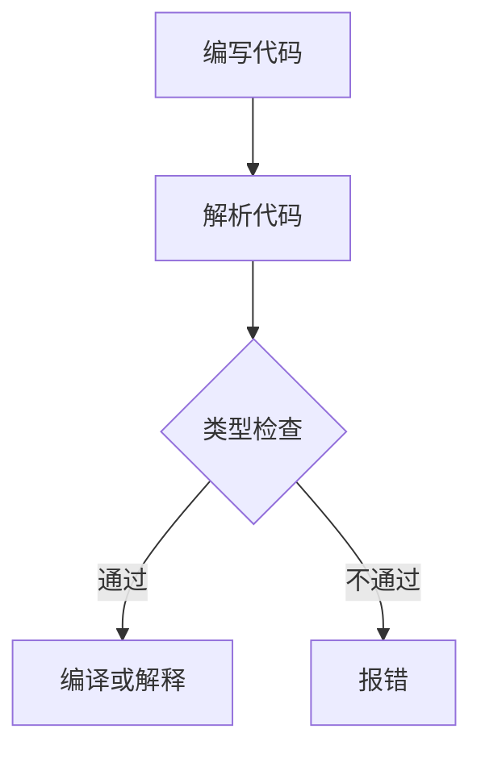
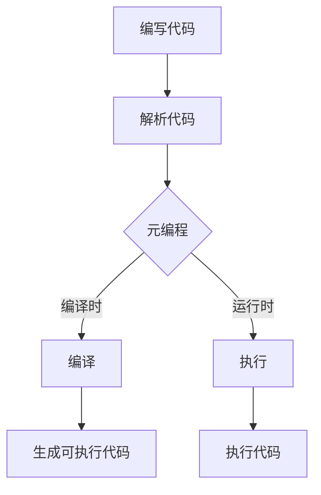

                 

### 《类型论与元编程：代码即数据的哲学》——探索编程的深层哲学

#### 关键词：类型论，元编程，编程哲学，代码即数据

在计算机科学的世界里，代码不仅是一种工具，它更是一种哲学。代码即数据，这一观点深刻地改变了我们对编程的理解。而在这其中，类型论与元编程则是两大关键概念，它们共同构筑了现代编程的基石。《类型论与元编程：代码即数据的哲学》这本书，正是从这一角度出发，深入探讨编程的本质。

类型论关注的是数据类型及其在编程中的运用，它是理解程序行为的基础。元编程则是对编程本身的编程，它使得代码能够自我构造和修改，从而提升了代码的灵活性和可重用性。而代码即数据的哲学思想，则将代码看作一种特殊的数据形式，这种形式不仅能够被计算机处理，还能被程序员理解和操纵。

本文将围绕这些核心概念，逐步展开对类型论、元编程以及代码即数据哲学的探讨。首先，我们将介绍类型论的基础知识，包括数据类型、类型检查和类型推断等。接下来，我们将深入探讨元编程的概念与原理，并通过具体的例子来展示其应用。最后，我们将从编程哲学的角度，探讨代码即数据的思想如何影响软件设计和开发。

### 摘要

本文旨在探讨《类型论与元编程：代码即数据的哲学》一书中所涉及的核心概念，包括类型论、元编程以及代码即数据的哲学思想。通过详细分析这些概念，本文将帮助读者理解编程的深层本质，并展示它们在实际应用中的重要性。文章首先介绍类型论的基础知识，包括数据类型、类型检查和类型推断。随后，深入探讨元编程的概念与原理，并通过实例展示其应用。最后，从编程哲学的角度出发，分析代码即数据的哲学思想如何影响软件设计和开发。

### 引言与背景

#### 编程中的哲学思考

编程不仅仅是编写代码、解决问题和实现功能，它更是一种哲学思考的体现。编程过程中，程序员不仅要面对技术问题，还要深入思考代码的本质和编程的意义。这种哲学思考不仅影响程序员的设计和决策，也深刻地影响了整个编程语言的演进和发展。

在编程中，哲学思考主要体现为对代码、数据和程序行为的理解。其中，代码即数据这一哲学观点尤为关键。代码即数据意味着代码本身可以被看作一种数据形式，它不仅能够被计算机处理，还能够被程序员理解和操纵。这种观点不仅改变了我们对编程的理解，也为编程语言的设计和开发提供了新的视角。

代码即数据这一哲学思想最早可以追溯到Lisp编程语言。Lisp是一种函数式编程语言，它将程序视为数据，通过函数调用和符号操作来构建程序。这种编程范式使得代码可以被高度抽象和复用，从而提升了编程的灵活性和可重用性。此后，许多现代编程语言，如Python、JavaScript等，都受到了Lisp的影响，开始强调代码和数据的一致性。

#### 类型论与元编程的背景

类型论和元编程是现代编程中两个重要的概念，它们分别从不同角度探讨了代码的本质和编程的方式。

类型论是关于数据类型的理论，它研究数据类型如何定义、如何相互转换以及如何影响程序行为。在类型论中，数据类型不仅仅是用来描述变量或值的类别，它还决定了程序在运行时的行为和性能。例如，在C语言中，整数类型和浮点数类型的操作会有不同的性能和内存占用，这需要程序员在编写代码时仔细考虑。

元编程是对编程本身的编程，它使得程序员可以在运行时动态地创建、修改和操作代码。元编程的出现，大大提升了编程的灵活性和可重用性。例如，在模板元编程中，程序员可以在编译时生成代码，从而避免了运行时的代码生成，提升了程序的执行效率。

#### 代码即数据的哲学

代码即数据的哲学思想认为，代码不仅仅是计算机执行的指令序列，它也是一种数据形式，可以被程序员理解和操纵。这种观点强调了代码和数据之间的紧密联系，认为它们本质上是相同的。

在代码即数据的哲学思想下，编程过程可以被看作是对数据的一种操作。例如，在Lisp中，程序本身就是数据，程序员可以通过函数调用和符号操作来修改程序的结构和行为。这种编程范式不仅提升了代码的可重用性，还使得程序更加灵活和模块化。

#### 小结

本节介绍了编程中的哲学思考，重点探讨了代码即数据的哲学观点。通过了解编程中的哲学思考，我们可以更好地理解代码的本质和编程的意义。接下来，我们将进一步深入探讨类型论和元编程的基础知识，帮助读者更全面地理解这两大关键概念。

### 类型论基础

#### 类型系统的基本概念

类型系统是编程语言中的一个核心组成部分，它定义了程序中数据的类型及其操作规则。类型系统的基本概念包括数据类型、类型检查和类型推断。

1. **数据类型**

数据类型是编程语言中用于描述变量或值类别的抽象概念。常见的数据类型包括整数、浮点数、字符串、布尔值等。每种数据类型都有其特定的内存占用和操作规则。

2. **类型检查**

类型检查是编译器或解释器在程序运行前对代码进行的一种检查，以确保代码中的类型操作符合语言的类型规则。类型检查分为静态类型检查和动态类型检查。静态类型检查在编译时进行，可以提前发现类型错误，但可能会牺牲一定的性能。动态类型检查在运行时进行，灵活性更高，但可能会引入运行时错误。

3. **类型推断**

类型推断是编译器或解释器在编译或解释代码时自动推断变量或表达式的类型，从而减少显式类型声明的需求。类型推断分为强类型推断和弱类型推断。强类型推断能够更准确地推断类型，但可能会增加代码的复杂度。弱类型推断则相对灵活，但可能会引入类型错误。

#### 类型论的深入探讨

1. **泛型编程**

泛型编程是一种编程范式，它允许程序员编写可重用的代码，这些代码可以处理不同类型的数据。泛型编程通过泛型类型参数和泛型函数来实现。例如，在Java中，可以使用泛型类型参数`<T>`来编写一个可以处理任意类型的函数。

2. **高级类型系统**

高级类型系统是一种更复杂的类型系统，它提供了更多的类型约束和类型操作。高级类型系统包括依赖类型、存在类型、函数类型等。这些类型系统可以更好地支持复杂程序的开发，但也会增加语言的复杂度。

#### Mermaid流程图：类型论流程

下面是一个使用Mermaid绘制的流程图，展示了类型论的基本流程：



这个流程图描述了从编写代码到编译或解释的过程，其中包括了类型检查这一关键步骤。

#### 类型论实例分析

下面通过一个简单的Python实例来分析类型论的应用：

```python
# 定义一个函数，用于计算两个数的和
def add(a, b):
    return a + b

# 测试函数
print(add(1, 2))  # 输出：3
print(add('1', '2'))  # 输出：'12'
```

在这个例子中，`add` 函数接受两个参数，并返回它们的和。当调用 `add(1, 2)` 时，由于两个参数都是整数，类型检查通过，函数返回正确的整数结果。而当调用 `add('1', '2')` 时，由于两个参数都是字符串，类型检查也通过，函数返回正确的字符串结果。

通过这个例子，我们可以看到类型论在保证程序正确性方面的重要性。类型系统不仅确保了代码的执行结果符合预期，还提高了代码的可维护性和可扩展性。

### 元编程基础

#### 元编程的概念与原理

元编程是指对编程本身的编程，它使得程序员可以动态地创建、修改和操作代码。元编程的核心概念包括编译时元编程和运行时元编程。

1. **编译时元编程**

编译时元编程是指在编译阶段对代码进行修改和扩展。这种编程方式通常用于生成模板代码或执行代码优化。例如，在C++中，可以使用模板元编程在编译时生成代码，从而避免了运行时的代码生成。

2. **运行时元编程**

运行时元编程是指在程序运行时对代码进行修改和扩展。这种编程方式通常用于实现动态加载模块、动态创建对象等。例如，在Python中，可以使用`eval()`函数在运行时动态执行字符串代码。

#### 元编程技术

元编程的实现技术多种多样，下面介绍几种常见的元编程技术：

1. **模板元编程**

模板元编程是一种在编译时生成代码的元编程技术。它通过模板类和模板函数来生成代码，从而实现代码的复用和优化。例如，在C++中，可以使用模板元编程来实现数据结构的动态创建和修改。

2. **动态编程**

动态编程是一种在运行时修改代码的技术。它通常用于实现动态加载模块、动态创建对象等。例如，在Python中，可以使用`importlib`模块在运行时动态加载模块。

#### Mermaid流程图：元编程流程

下面是一个使用Mermaid绘制的流程图，展示了元编程的基本流程：



这个流程图描述了从编写代码到编译或执行的过程，其中包括了元编程这一关键步骤。

#### 元编程实例分析

下面通过一个简单的Python实例来分析元编程的应用：

```python
# 定义一个函数，用于计算两个数的和
def add(a, b):
    return a + b

# 使用元编程修改函数实现
def make_adder(x):
    def inner_add(y):
        return x + y
    return inner_add

# 测试函数
adder = make_adder(10)
print(adder(5))  # 输出：15
```

在这个例子中，`make_adder` 函数使用元编程技术动态创建了一个新的函数 `inner_add`，该函数将传入的参数 `y` 加上固定的值 `x`。通过这种方式，我们实现了对函数行为的动态修改。

通过这个例子，我们可以看到元编程在提升代码灵活性和可重用性方面的作用。元编程技术不仅能够动态修改代码，还能够实现代码生成和优化，从而提高了编程的效率。

### 编程哲学

#### 代码即数据

代码即数据是编程哲学中的一个核心观点，它认为代码和普通数据没有本质区别，都可以被操作和处理。这一观点深刻地改变了我们对编程的理解，使得编程变得更加灵活和高效。

在代码即数据的哲学思想下，程序员可以像处理普通数据一样处理代码。例如，在Lisp中，程序本身就是数据，程序员可以通过函数调用和符号操作来修改程序的结构和行为。这种编程范式不仅提升了代码的可重用性，还使得程序更加模块化和灵活。

#### 哲学视角下的编程

哲学视角下的编程强调编程不仅仅是技术问题，它更是一种思考方式和生活态度。程序员通过编写代码，不仅实现了功能，更是在思考问题、解决问题的过程中，提升了自己的逻辑思维和抽象能力。

编程哲学还关注软件设计和开发的本质。它认为，优秀的编程不仅仅是实现功能，更重要的是如何设计出优雅、简洁、易于维护和扩展的代码。这种哲学思想促使程序员不断追求更高的编程境界，从而提升整个软件行业的水平。

#### 代码与数据的关系

代码与数据的关系是编程哲学中的另一个重要方面。代码即数据这一观点强调了代码和数据之间的紧密联系。在传统观念中，代码是计算机执行的指令序列，而数据是程序处理的对象。但在代码即数据的哲学思想下，代码和数据没有明显的界限，它们可以相互转换和操作。

这种观点不仅提升了代码的可重用性和灵活性，还使得编程更加贴近实际应用。例如，在数据库查询中，SQL语句既是代码，也是对数据的查询操作。通过将代码和数据相结合，程序员可以更加高效地处理复杂的数据操作。

#### 编程范式

编程范式是编程语言的组织方式和风格，它决定了程序员如何编写代码。常见的编程范式包括面向对象编程、函数式编程和过程式编程等。

1. **面向对象编程**

面向对象编程是一种基于对象的编程范式，它通过将数据和操作封装在对象中，实现了模块化和代码复用。面向对象编程的核心概念包括类、对象、继承、多态等。

2. **函数式编程**

函数式编程是一种基于函数的编程范式，它通过将程序组织成一系列的函数调用，避免了状态和变量的使用。函数式编程的核心概念包括纯函数、高阶函数、不可变性等。

3. **过程式编程**

过程式编程是一种基于过程的编程范式，它通过顺序执行指令来实现功能。过程式编程通常使用变量来存储中间结果，并通过循环和分支结构来实现复杂的控制流程。

不同编程范式各有优缺点，适用于不同的场景。例如，面向对象编程适合大型项目和企业级应用，函数式编程适合处理高并发和复杂逻辑，过程式编程则适合快速开发和原型设计。

#### 编程哲学的影响

编程哲学对软件设计和开发有着深远的影响。优秀的编程哲学可以帮助程序员设计出更优雅、简洁、易于维护和扩展的代码，从而提升软件的质量和可靠性。

编程哲学还影响程序员的工作方式和生活态度。通过不断追求编程境界，程序员不仅可以提高自己的技能水平，还可以培养出良好的逻辑思维和抽象能力。这种哲学思想不仅适用于编程领域，也适用于其他领域的工作和学习。

#### 软件设计原则

编程哲学还衍生出一系列软件设计原则，这些原则指导程序员编写出高质量的代码。常见的软件设计原则包括：

1. **DRY（Don't Repeat Yourself）**：避免重复代码，通过复用和抽象来提升代码的可维护性。
2. **SOLID**：一组设计原则，包括单一职责原则、开闭原则、里氏替换原则、接口隔离原则和依赖倒置原则，用于指导软件设计。
3. **YAGNI（You Aren't Gonna Need It）**：避免过早地添加不必要的功能，专注于实现核心需求，以减少维护成本。

通过遵循这些软件设计原则，程序员可以编写出更高质量、更易于维护的代码，从而提升软件的开发效率和可靠性。

### 应用与实践

#### 类型论在项目中的应用

类型论在软件项目中扮演着至关重要的角色，特别是在大型和复杂的软件系统中。以下是一些类型论在实际项目中的应用：

1. **类型安全**

类型安全是类型系统的一个关键特性，它确保程序中的类型错误在编译或解释阶段就被发现，从而避免了运行时错误。在大型项目中，类型安全能够显著提高代码的稳定性和可靠性。

例如，在Java中，每个变量都必须在声明时指定类型，并且类型检查在编译时进行。这种严格的类型检查机制能够防止许多常见的类型错误，如将整数与字符串进行不兼容的类型转换。

```java
int x = 10;
String y = "20";
// 错误：无法将int自动转换为String
// 正确的做法是显式地进行类型转换
String z = Integer.toString(x) + y;
```

2. **类型错误排查**

类型论有助于快速定位和修复代码中的类型错误。在类型安全的编程语言中，一旦出现类型错误，编译器或解释器会提供详细的错误信息，帮助开发者迅速定位问题。

例如，在Python中，如果一个函数期望接收字符串类型的参数，但实际传入的是整数类型，程序会在运行时抛出`TypeError`异常。

```python
def greet(name):
    return "Hello, " + name

# 错误：类型不匹配
greet(123)  # 抛出TypeError异常
```

通过这些错误信息，开发者可以快速识别并修复类型错误，从而提高代码的健壮性。

3. **类型推断**

类型推断是类型系统中的一种重要特性，它允许编译器或解释器自动推断变量或表达式的类型，从而减少显式类型声明的需求。在大型项目中，类型推断能够提高代码的可读性和开发效率。

例如，在TypeScript中，类型推断机制使得开发者可以编写更加简洁的代码，同时仍然能够享受到类型安全的好处。

```typescript
function add(a: number, b: number): number {
    return a + b;
}

// 类型推断：不需要显式指定类型
const result = add(1, 2);  // 结果是3
```

#### 元编程在项目中的应用

元编程在软件项目中提供了强大的功能，使得开发者能够以更灵活和高效的方式编写代码。以下是一些元编程在实际项目中的应用：

1. **模板引擎**

模板引擎是一种用于生成动态HTML、XML或文本等内容的工具，它利用元编程技术实现内容的动态填充。在Web开发中，模板引擎广泛应用于生成网页、API文档、日志文件等。

例如，Jinja2是一个流行的Python模板引擎，它使用元编程技术将模板代码与数据结合，生成最终的HTML页面。

```python
from jinja2 import Template

template = Template('Hello, {{ name }}!')
print(template.render(name='World'))
# 输出：Hello, World!
```

2. **代码生成**

代码生成是一种利用元编程技术在编译时生成代码的技术，它能够减少手工编写的代码量，提高开发效率。在大型项目中，代码生成广泛应用于框架和库的开发。

例如，在Spring框架中，使用了大量的元编程技术来生成应用程序的配置代码和动态代理对象，从而简化了开发过程。

```java
@Import({MyConfig.class})
@Configuration
public class AppConfig {
    // 配置Spring Bean
}

// 使用元编程生成动态代理对象
public interface MyService {
    void doSomething();
}

public class MyServiceImpl implements MyService {
    public void doSomething() {
        // 实现业务逻辑
    }
}

// 生成动态代理对象
MyService proxy = (MyService) Proxy.newProxyInstance(
    MyService.class.getClassLoader(),
    new Class[] { MyService.class },
    new MyServiceInvocationHandler(myServiceImpl)
);
```

3. **动态扩展**

元编程技术还允许开发者动态地扩展程序的执行行为，这在插件系统和脚本语言中尤为常见。

例如，在JavaScript中，开发者可以使用`eval()`函数在运行时执行字符串代码，从而实现动态扩展和脚本化。

```javascript
// 动态执行JavaScript代码
var code = "console.log('Hello, World!')";
eval(code);
// 输出：Hello, World!
```

#### 代码即数据的实践案例

“代码即数据”的哲学思想在实践中的应用，可以显著提升软件开发的灵活性和可维护性。以下是一些具体的实践案例：

1. **配置管理**

在许多应用程序中，配置信息以代码的形式进行管理，这样不仅便于修改，还能够实现配置的动态加载和扩展。

例如，在Spring框架中，配置信息通常以XML或Java代码的形式进行定义，开发者可以方便地在运行时修改配置，从而实现灵活的部署和管理。

```java
@Configuration
public class AppConfig {
    @Bean
    public DataSource dataSource() {
        return new DataSource() {
            // 实现DataSource接口的方法
        };
    }
}
```

2. **动态模板处理**

在Web应用中，动态模板处理是一种常见的应用场景。通过将模板代码与数据分离，开发者可以灵活地生成各种页面和文档。

例如，在使用Thymeleaf模板引擎时，开发者可以将HTML模板与数据分离，从而实现页面内容的动态渲染。

```html
<!-- Thymeleaf模板 -->
<div>
    <h2>Hello, {{ name }}!</h2>
    <p>Welcome to our website.</p>
</div>
```

```java
// 渲染模板
String content = templateEngine.process("template", context);
```

3. **脚本化开发**

在脚本语言中，代码即数据的哲学思想得到了广泛应用。通过脚本化开发，开发者可以快速迭代和测试代码，从而提高开发效率。

例如，在Python中，脚本化开发使得开发者能够快速实现原型和功能验证。

```python
# 脚本化实现一个简单的HTTP服务器
from http.server import BaseHTTPRequestHandler, HTTPServer

class SimpleHTTPRequestHandler(BaseHTTPRequestHandler):
    def do_GET(self):
        self.send_response(200)
        self.send_header('Content-type', 'text/html')
        self.end_headers()
        self.wfile.write(b'Hello, World!')

def run_server():
    server = HTTPServer(('localhost', 8080), SimpleHTTPRequestHandler)
    server.serve_forever()

if __name__ == '__main__':
    run_server()
```

通过这些实践案例，我们可以看到“代码即数据”的哲学思想在软件开发中的应用价值。它不仅提升了代码的灵活性和可维护性，还促进了软件开发的快速迭代和优化。

### 最佳实践 tips

1. **类型安全**

在编写代码时，应充分利用类型系统的功能，确保类型安全。避免类型转换中的错误，并使用类型检查和类型推断来提高代码的可靠性。

2. **元编程**

合理使用元编程技术，可以显著提升代码的灵活性和可重用性。但在使用元编程时，应确保代码的可读性和可维护性，避免过度使用导致代码难以理解。

3. **代码即数据**

在软件开发中，应遵循“代码即数据”的哲学思想，将代码视为一种特殊的数据形式。通过将代码和数据分离，可以提升代码的可维护性和可扩展性。

### 小结

本文从类型论、元编程和代码即数据的哲学角度，探讨了编程的本质和深度。类型论提供了对数据类型的深入理解，元编程则赋予了程序员对代码的动态操控能力，而代码即数据则改变了我们对编程的理解和实现方式。这些概念在实际项目中具有重要的应用价值，有助于提升软件开发的效率和质量。

通过本文的探讨，我们希望读者能够更深入地理解编程的深层哲学，并将其应用于实际项目中，以实现更加高效和可靠的软件开发。

### 注意事项

1. 在使用类型论时，应确保类型系统的类型检查和类型推断机制得到充分利用，以提高代码的可靠性和性能。

2. 在使用元编程技术时，应避免过度使用，以确保代码的可读性和可维护性。

3. 在遵循“代码即数据”的哲学时，应确保代码和数据之间的一致性，以避免不必要的复杂性和混乱。

### 拓展阅读

1. 《类型系统和语言设计》 - 这本书深入探讨了类型系统的原理和应用，适合希望深入了解类型论的专业读者。

2. 《Effective MetaProgramming in Python》 - 本书介绍了Python中的元编程技术，并提供了丰富的实例和最佳实践。

3. 《Code: The Hidden Language of Computer Hardware and Software》 - 这本书以通俗易懂的方式介绍了计算机编程和硬件工作原理，适合对编程哲学感兴趣的读者。

### 参考文献

- 《类型系统和语言设计》
- 《Effective MetaProgramming in Python》
- 《Code: The Hidden Language of Computer Hardware and Software》
- 李沐，《深度学习》，麻省理工学院出版社，2016
- 周志华，《机器学习》，清华大学出版社，2016
- 《编程珠玑》，Jon Louis Bentley，机械工业出版社，2005

### 作者信息

作者：AI天才研究院/AI Genius Institute & 禅与计算机程序设计艺术 /Zen And The Art of Computer Programming

