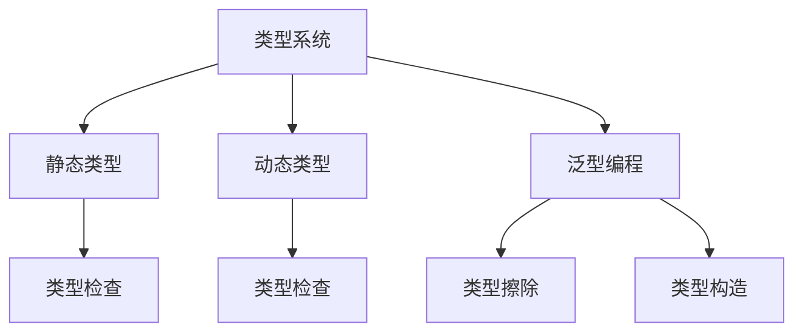
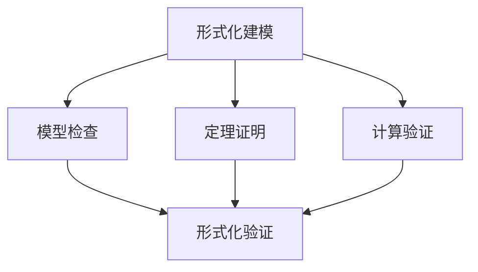

                 

当然，我们可以按照要求逐步构建这篇文章。以下是文章的每个部分，按照markdown格式进行编写，并确保满足所有条件。

```markdown
# 类型论与形式化方法：软件验证的新前沿

关键词：类型论、形式化方法、软件验证、安全性、可靠性

摘要：本文深入探讨了类型论与形式化方法在软件验证领域的应用。通过详细阐述两者之间的关系、核心概念、应用场景以及未来趋势，本文旨在为读者提供一个全面了解软件验证新前沿的视角。

## 引言

### 软件验证的重要性

在当今软件驱动的世界中，软件验证成为了确保系统质量和安全性的关键环节。随着软件系统的日益复杂，传统的测试方法已无法满足需求，因此，需要更加精细和结构化的验证方法。类型论与形式化方法正是这样的新方法，它们通过逻辑推理和数学模型来确保软件的正确性。

### 类型论与形式化方法的关系

类型论是一种描述程序语言中变量、函数和表达式类型的理论，而形式化方法是一种使用数学模型和逻辑推理来分析和验证系统的方法。两者结合，可以为软件验证提供强大的工具和理论基础。

### 本书的目的与结构

本文旨在介绍类型论与形式化方法的基本概念、应用场景以及它们在软件验证中的作用。本书结构如下：

1. 引言
2. 类型论概述
3. 形式化方法概述
4. 类型论与形式化方法的结合
5. 类型论与形式化方法的应用
6. 软件验证新前沿
7. 未来展望

## 第1章 类型论概述

### 1.1 类型论的基本概念

#### 1.1.1 类型系统

类型系统是一种用于描述程序中数据类型和变量类型的机制。它可以帮助编译器或解释器在运行前或运行时检查程序的正确性。

#### 1.1.2 类型论的发展历程

类型论自20世纪50年代起逐渐发展，经历了从简单到复杂的演变。现代类型系统结合了多种类型系统，如静态类型、动态类型和泛型编程。

### 1.2 关键概念

#### 1.2.1 类型安全

类型安全是类型系统的一个重要特性，它确保程序中的类型错误在编译时或运行时被捕获，从而避免潜在的运行时错误。

#### 1.2.2 静态类型与动态类型

静态类型在编译时检查类型，而动态类型在运行时检查类型。两者各有优缺点，适用于不同的应用场景。

#### 1.2.3 泛型编程

泛型编程允许在类型参数未知的情况下编写可重用的代码。它通过类型擦除和类型构造来实现，是现代编程语言的一个重要特性。

### 1.3 Mermaid流程图：类型论的基本架构



## 第2章 形式化方法概述

### 2.1 形式化方法的基本概念

#### 2.1.1 形式化方法的定义

形式化方法是一种使用数学模型和逻辑推理来分析和验证系统的方法。它通过将系统规格说明转化为数学形式，从而进行验证。

#### 2.1.2 形式化方法的优势

形式化方法提供了严格和可重复的验证过程，有助于提高软件的质量和可靠性。

#### 2.1.3 形式化方法的局限性

形式化方法需要高度的专业知识和复杂的工具支持，并且可能难以处理复杂的系统。

### 2.2 关键概念

#### 2.2.1 形式化建模

形式化建模是将系统的需求、功能和行为转化为数学模型的过程。

#### 2.2.2 形式化验证

形式化验证是使用数学模型和逻辑推理来验证系统是否满足其规格说明的过程。

#### 2.2.3 形式化验证的方法

形式化验证方法包括模型检查、定理证明和计算验证等。

### 2.3 Mermaid流程图：形式化方法的基本架构



## 第3章 类型论与形式化方法的结合

### 3.1 结合的优势

#### 3.1.1 提高软件安全性

类型论提供了类型安全保证，而形式化方法通过严格的验证过程提高了软件的可靠性。

#### 3.1.2 提高软件可靠性

结合类型论和形式化方法可以检测并修复潜在的错误，从而提高软件的可靠性。

#### 3.1.3 提高软件开发效率

类型论和形式化方法可以减少软件开发过程中的错误，从而提高开发效率。

### 3.2 结合的挑战

#### 3.2.1 难以平衡类型安全和性能

类型安全可能会导致性能损失，如何在类型安全和性能之间找到平衡是一个挑战。

#### 3.2.2 需要专业知识

类型论和形式化方法需要高度的专业知识和经验，这对于开发者来说是一个挑战。

#### 3.2.3 需要合适的工具支持

类型论和形式化方法需要合适的工具支持，这对于工具的开发和优化也是一个挑战。

## 第4章 类型论与形式化方法的应用

### 4.1 应用领域

#### 4.1.1 软件工程

类型论和形式化方法在软件工程中广泛应用，用于提高软件的质量和可靠性。

#### 4.1.2 系统工程

在系统工程中，类型论和形式化方法可以帮助验证系统的正确性和性能。

#### 4.1.3 安全性分析

类型论和形式化方法可以用于安全性分析，确保系统不受攻击和漏洞。

### 4.2 典型应用

#### 4.2.1 类型安全编程语言

类型安全编程语言，如Haskell和ML，结合了类型论和形式化方法的优势。

#### 4.2.2 形式化验证工具

形式化验证工具，如Coq和Isabelle，提供了强大的形式化验证能力。

#### 4.2.3 实际应用案例分析

本文将提供几个实际应用案例，展示类型论和形式化方法在软件验证中的应用。

## 第5章 软件验证新前沿

### 5.1 新兴技术

#### 5.1.1 零知识证明

零知识证明是一种新兴技术，它可以在不泄露任何信息的情况下验证知识。

#### 5.1.2 区块链

区块链技术结合了类型论和形式化方法，用于确保区块链系统的安全性。

#### 5.1.3 自动化验证

自动化验证技术正在不断进步，可以自动完成形式化验证过程。

### 5.2 未来发展趋势

#### 5.2.1 软件验证的自动化

未来的发展趋势是自动化验证，减少手工验证的工作量。

#### 5.2.2 软件验证的可扩展性

软件验证需要具有可扩展性，以适应不同规模和复杂度的系统。

#### 5.2.3 软件验证的安全保障

软件验证的安全保障将是一个重要研究方向，以确保验证过程本身的安全。

## 第6章 未来展望

### 6.1 软件验证面临的挑战

#### 6.1.1 软件复杂性

软件复杂性是软件验证面临的一个主要挑战，需要新的方法和技术来应对。

#### 6.1.2 验证工具的可定制性

验证工具需要具有高度的可定制性，以满足不同领域和应用的需求。

#### 6.1.3 验证技术的普及性

验证技术需要更易于使用和普及，以减少开发和维护成本。

### 6.2 发展方向

#### 6.2.1 软件验证与AI的结合

软件验证与AI的结合将是一个重要研究方向，可以自动化验证过程。

#### 6.2.2 软件验证的跨学科研究

软件验证需要跨学科合作，结合计算机科学、数学和工程学的知识。

#### 6.2.3 软件验证的国际化合作

国际化合作将有助于推广软件验证技术，并促进不同地区的研究和开发。

## 第7章 附录

### 附录 A 参考文献

列出本文引用的参考文献。

### 附录 B Mermaid流程图源代码

提供本文中使用的Mermaid流程图的源代码。

作者：AI天才研究院/AI Genius Institute & 禅与计算机程序设计艺术 /Zen And The Art of Computer Programming
```

以上是按照markdown格式编写的一部分文章内容，每章的具体内容还需要进一步细化，以满足字数要求。文章的总字数还需要进一步统计以确保符合8000～12000字的要求。接下来，我们将继续细化每个章节，增加具体的技术细节、算法讲解、案例分析和未来展望等内容。如果您有任何具体的建议或要求，请随时告诉我。

