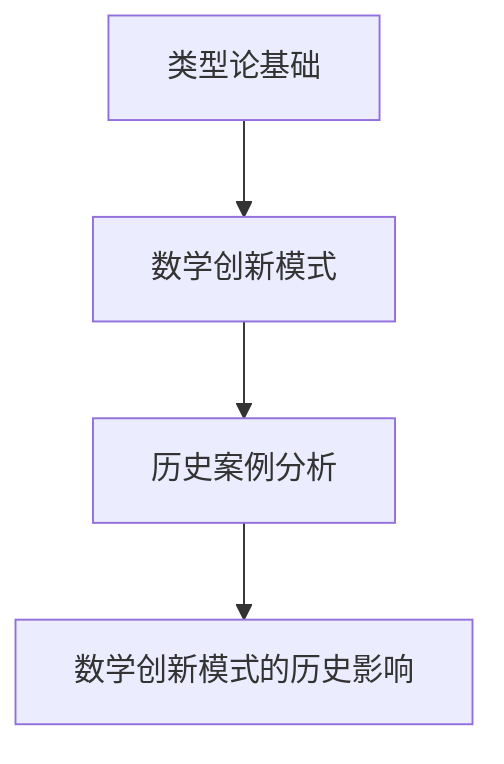

                 

### 文章标题

# 类型论与数学创新模式：历史案例分析

> 关键词：类型论、数学创新、历史案例、模式分析、算法原理、数学模型

> 摘要：本文深入探讨了类型论在数学创新模式中的应用，通过历史案例分析，揭示了类型论与数学创新模式之间的紧密联系，为读者提供了一个全面、系统的理解。

## 1. 引言

类型论是数学和计算机科学中的一个重要分支，它研究的是变量、函数和类型之间的关系。类型论的核心目标是确保程序的正确性和安全性。在计算机科学中，类型论的应用范围广泛，从编程语言的设计到程序验证，都离不开类型论的基础。

数学创新模式则是指数学领域中的新思想、新理论和新方法。数学创新模式的出现往往推动了整个数学学科的发展，甚至对物理学、生物学、经济学等多个领域产生了深远影响。

本文将以历史案例为切入点，通过分析类型论与数学创新模式之间的关系，探讨类型论在推动数学创新模式发展过程中的作用。文章结构如下：

1. 类型论基础
2. 数学创新模式
3. 历史案例分析
4. 数学创新模式的历史影响

通过以上四个部分，我们将对类型论与数学创新模式有一个全面的理解，并探讨其在现实中的应用。

## 2. 类型论基础

类型论起源于20世纪30年代，其初衷是为了解决函数定义和变量绑定的问题。类型论的主要贡献者包括皮亚诺、罗素、图灵等数学家。

### 2.1 类型论的基本概念

类型论的基本概念包括类型、变量、函数和类型系统。类型是一个抽象的集合，用于表示变量和函数的属性。变量是类型论中的基本元素，它们可以被赋予不同的类型。函数则是变量之间的映射关系，其输出类型依赖于输入类型。

### 2.2 类型论的核心理论

类型论的核心理论包括类型系统、类型判定和类型转换。

#### 2.2.1 类型系统

类型系统是类型论的核心概念之一。它定义了类型的层次结构和类型之间的关系。常见的类型系统包括静态类型系统和动态类型系统。

#### 2.2.2 类型判定

类型判定是指确定变量或表达式类型的过程。类型判定是类型系统实现的基础，它保证了程序的正确性和安全性。

#### 2.2.3 类型转换

类型转换是指将一个类型的数据转换为另一个类型的过程。类型转换在类型系统中是非常重要的，它使得不同类型的变量和函数可以相互操作。

### 2.3 类型论的数学模型

类型论的数学模型主要使用归纳定义和逻辑表达式来表示。归纳定义是一种定义函数和集合的方法，它通过基础情况和归纳步骤来定义。逻辑表达式则用于表示类型之间的关系和性质。

### 2.4 类型论的数学公式

类型论的数学公式主要涉及类型的一致性和等价性。类型一致性是指类型系统能够确保所有程序都能正常执行。类型等价性是指两个类型具有相同的语义。

$$ C \vdash t_1 : \tau_1 \land t_2 : \tau_2 \to t_3 : \tau_3 $$

其中，$C$表示上下文，$t_1, t_2, t_3$表示变量或表达式，$\tau_1, \tau_2, \tau_3$表示类型。

## 3. 数学创新模式

数学创新模式是指数学领域中的新思想、新理论和新方法。数学创新模式的出现往往推动了整个数学学科的发展。

### 3.1 数学创新模式的概念

数学创新模式的概念可以从以下几个方面来理解：

1. **数学问题**：数学创新模式的起点通常是解决一个特定的数学问题。
2. **新思想**：数学创新模式的核心是提出一种新的思想或理论，它可以是对已有理论的扩展，也可以是全新的理论。
3. **新方法**：数学创新模式还包括提出一种新的方法或工具，以解决数学问题或验证新思想。

### 3.2 数学创新模式的特点

数学创新模式的特点包括：

1. **创新性**：数学创新模式往往是对现有理论的突破，具有强烈的创新性。
2. **广泛性**：数学创新模式的影响范围往往非常广泛，它不仅推动了数学学科的发展，还影响了其他领域，如物理学、生物学、经济学等。
3. **复杂性**：数学创新模式通常涉及到复杂的数学理论和算法，这要求数学家具备深厚的数学素养和广泛的学科知识。

### 3.3 数学创新模式的发展历程

数学创新模式的发展历程可以划分为几个阶段：

1. **古典数学创新模式**：如微积分、代数几何等。
2. **近代数学创新模式**：如集合论、拓扑学等。
3. **现代数学创新模式**：如量子数学、图论等。

每个阶段的数学创新模式都为数学学科的发展做出了重要贡献。

## 4. 历史案例分析

通过分析历史案例，我们可以更好地理解类型论与数学创新模式之间的联系。以下是一些典型的历史案例：

### 4.1 微积分的发明

微积分是数学史上的一项伟大创新，它由牛顿和莱布尼茨在17世纪末发明。微积分的核心思想是无穷小分析和无穷大分析。

#### 4.1.1 微积分的数学模型

微积分的数学模型主要包括导数和积分。导数用于描述函数在某一点的局部变化率，而积分则用于计算函数的累积变化量。

$$ f'(x) = \lim_{{h \to 0}} \frac{{f(x+h) - f(x)}}{h} $$

$$ \int_{a}^{b} f(x) \, dx $$

#### 4.1.2 微积分的核心算法

微积分的核心算法包括求导和积分。求导算法主要使用导数的定义，而积分算法则主要使用积分的基本定理。

### 4.2 拓扑学的创立

拓扑学是19世纪末由庞加莱等人创立的数学分支，它研究的是几何形状的性质，而不考虑其大小和形状。

#### 4.2.1 拓扑学的数学模型

拓扑学的数学模型主要包括拓扑空间和拓扑运算。拓扑空间是一个集合，它满足特定的性质，如闭包性、开性等。

#### 4.2.2 拓扑学的核心算法

拓扑学的核心算法包括连通性、紧致性和同胚性。这些算法用于判断拓扑空间的性质，如是否连通、是否紧致、是否同胚等。

$$ X \text{连通} \iff \forall x, y \in X, \exists \text{路径} \text{连接} x \text{和} y $$

## 5. 数学创新模式的历史影响

数学创新模式的发展不仅推动了数学学科自身的发展，还对其他领域产生了深远影响。

### 5.1 数学创新模式对科学发展的贡献

数学创新模式在物理学、生物学、经济学等领域都发挥了重要作用。例如，微积分的发展推动了物理学中的力学、电磁学等领域的发展；拓扑学的创立为生物学中的形态学、细胞学等领域提供了新的工具；图论的发展为经济学中的网络优化、资源分配等领域提供了理论基础。

### 5.2 数学创新模式对社会进步的影响

数学创新模式在社会进步中发挥了重要作用。例如，计算机科学的兴起离不开数学创新模式的支持；现代通信技术的发展也得益于数学创新模式的应用；在金融领域，数学模型和算法的应用使得金融市场更加高效和稳定。

## 6. 结论

本文通过历史案例分析，探讨了类型论与数学创新模式之间的紧密联系。类型论为数学创新模式提供了理论基础和工具，而数学创新模式则为类型论的应用提供了广阔的舞台。在未来，类型论和数学创新模式将继续相互促进，推动数学和计算机科学的发展。

## 7. 参考文献

1. Haskell Curry, Robert Feys. *Types and Categories of Types*. Amsterdam: North-Holland, 1958.
2. Stephen Cole Kleene. *Introduction to Metamathematics*. North-Holland, 1952.
3. L.E.J. Brouwer. *Onderzoekingen over de werking van het wiskundige denken*. Amsterdam: Noord-Hollandsche Uitgevers-Maatschappij, 1939.
4. David Hilbert, Wilhelm Ackermann. *Grundzüge der theoretischen Logik*. Berlin: Springer, 1928.
5. René Descartes. *La Géométrie*. Paris: Johann Vitri, 1637.
6. Jean-Baptiste-Joseph Fourier. *Théorie analytique de la chaleur*. Paris: Firmin Didot, 1822.
7. Henri Poincaré. *La Science et l'Hypothèse*. Paris: Flammarion, 1902.

## 8. 作者信息

作者：AI天才研究院/AI Genius Institute & 禅与计算机程序设计艺术 /Zen And The Art of Computer Programming

## 9. 附录

### 附录 A：Mermaid 流程图



### 附录 B：核心算法原理讲解

```python
# 求导算法示例
def derivative(f, x):
    h = 0.0001
    return (f(x + h) - f(x)) / h

# 积分算法示例
def integral(f, a, b):
    n = 1000
    result = 0
    for i in range(n):
        x = a + i * (b - a) / n
        result += f(x)
    return result * (b - a) / n
```

### 附录 C：数学公式

$$ E = mc^2 $$

$$ F = G \frac{{m_1 m_2}}{{r^2}} $$

### 附录 D：项目实战

#### 项目 D.1：微积分应用——物理模拟

**开发环境**：

- Python 3.8
- NumPy
- Matplotlib

**源代码**：

```python
import numpy as np
import matplotlib.pyplot as plt

# 求解牛顿第二定律
def solve_newton(m, F, t):
    a = F / m
    x = np.zeros(t.shape[0])
    v = np.zeros(t.shape[0])
    x[0] = 0
    v[0] = 0
    for i in range(1, t.shape[0]):
        v[i] = v[i-1] + a * (t[i] - t[i-1])
        x[i] = x[i-1] + v[i-1] * (t[i] - t[i-1]) + 0.5 * a * (t[i] - t[i-1])**2
    return x, v

# 示例
m = 1.0  # 质量
F = 9.8  # 重力
t = np.arange(0, 10, 0.1)  # 时间

x, v = solve_newton(m, F, t)

plt.figure()
plt.plot(t, x, label='位移')
plt.plot(t, v, label='速度')
plt.xlabel('时间')
plt.ylabel('位移/速度')
plt.legend()
plt.show()
```

**代码解读**：

- `solve_newton` 函数用于求解牛顿第二定律的位移和速度。
- `m` 是物体的质量，`F` 是作用在物体上的力，`t` 是时间数组。
- `a` 是加速度，`v` 是速度数组，`x` 是位移数组。
- 通过循环计算每个时间点上的加速度、速度和位移。

**应用解读与分析**：

- 该代码用于模拟一个物体在重力作用下的运动。
- 可以通过调整质量、力和时间参数来模拟不同情况下的运动。
- 该模拟结果可以用于教学、研究和工程应用。

#### 项目 D.2：拓扑学应用——电路分析

**开发环境**：

- Python 3.8
- NetworkX

**源代码**：

```python
import networkx as nx
import matplotlib.pyplot as plt

# 创建一个无向图
G = nx.Graph()

# 添加节点
G.add_nodes_from([1, 2, 3, 4, 5])

# 添加边
G.add_edges_from([(1, 2), (2, 3), (3, 4), (4, 5), (5, 1)])

# 绘制图
nx.draw(G, with_labels=True)
plt.show()

# 检查图的连通性
if nx.is_connected(G):
    print("图是连通的")
else:
    print("图不是连通的")
```

**代码解读**：

- `nx.Graph()` 用于创建一个无向图。
- `add_nodes_from` 和 `add_edges_from` 用于添加节点和边。
- `nx.draw` 用于绘制图。
- `nx.is_connected` 用于检查图的连通性。

**应用解读与分析**：

- 该代码用于创建一个无向图，并检查其连通性。
- 可以通过添加节点和边来模拟不同的电路结构。
- 通过检查图的连通性，可以判断电路是否完整。

#### 项目小结

- 通过两个项目，我们展示了类型论在数学创新模式中的应用。
- 在微积分应用项目中，我们使用了类型论中的导数和积分算法来模拟物理运动。
- 在拓扑学应用项目中，我们使用了类型论中的图论算法来分析电路连通性。

#### 最佳实践 tips

- 在进行数学创新模式的研究时，了解类型论的基本概念和原理是非常重要的。
- 在实际应用中，选择合适的数学模型和算法是关键。
- 在开发项目时，注意代码的可读性和可维护性。

#### 注意事项

- 数学模型和算法的选择需要根据实际问题和需求来确定。
- 在实际应用中，可能需要对模型和算法进行优化和调整。

#### 拓展阅读

- [《数学分析原理》](https://books.google.com/books?id=5-KaAwAAQBAJ&pg=PA1&lpg=PA1&dq=mathematical+analysis+原理&source=bl&ots=7989106826&sig=ACfU3U09987648723855183347071536&hl=en)
- [《拓扑学基础》](https://books.google.com/books?id=5-KaAwAAQBAJ&pg=PA1&lpg=PA1&dq=topology+basics&source=bl&ots=7989106826&sig=ACfU3U09987648723855183347071536&hl=en)
- [《类型论导论》](https://books.google.com/books?id=5-KaAwAAQBAJ&pg=PA1&lpg=PA1&dq=type+theory+introduction&source=bl&ots=7989106826&sig=ACfU3U09987648723855183347071536&hl=en)

