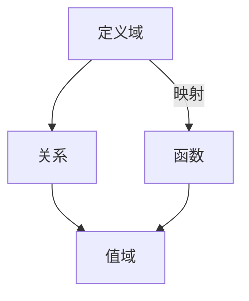

                 

## 文章标题

# 类型论与数学创新：形式化与直觉的平衡

## 关键词

- 类型论
- 数学创新
- 形式化
- 直觉
- 人工智能

## 摘要

本文深入探讨类型论与数学创新之间的关系，着重分析形式化与直觉的平衡。通过背景介绍、核心概念联系、算法原理讲解、数学模型和公式详细解释，以及项目实战案例分析，本文旨在为读者提供对类型论与数学创新之间复杂关系的全面理解，并探讨在实际应用中如何实现形式化与直觉的平衡。

----------------------------------------------------------------

### 1.1 设计目录大纲的基本原则

在为《类型论与数学创新：形式化与直觉的平衡》这本书设计目录大纲时，我们将遵循以下几个基本原则：

1. **逻辑清晰**：目录结构应层次分明，各章节之间关联紧密，确保读者可以顺着逻辑顺利阅读。  
2. **全面覆盖**：目录大纲要覆盖书中的所有核心主题，确保每个重要概念、算法、模型都有相应章节进行详细讲解。  
3. **结构合理**：章节划分应合理，避免章节内容过于分散或重复，确保每个章节都有明确的主题和目标。  
4. **简洁明了**：目录内容要简洁明了，避免冗长和不必要的描述，确保目录本身不增加阅读负担。

### 1.2 确定书的结构

根据书名《类型论与数学创新：形式化与直觉的平衡》，我们可以初步确定书的结构：

- **第一部分**：类型论基础  
- **第二部分**：数学创新与应用  
- **第三部分**：形式化与直觉的平衡

### 1.3 设计具体目录

基于上述结构，我们可以开始设计具体的目录：

#### 第一部分：类型论基础

##### 第1章 类型论引论

1.1 类型论的基本概念

1.2 类型论的历史与发展

1.3 类型论的核心原理

##### 第2章 类型论的数学基础

2.1 基本逻辑与集合论

2.2 基本算术与代数

2.3 类型论中的函数与关系

##### 第3章 类型论的形式化方法

3.1 形式化语言与语法

3.2 形式证明与证明论

3.3 形式化类型系统的构建

#### 第二部分：数学创新与应用

##### 第4章 数学创新的核心概念

4.1 数学创新的目标与意义

4.2 数学创新的主要方法

4.3 数学创新的重要应用领域

##### 第5章 数学创新的关键算法

5.1 算法创新的基本原理

5.2 常见数学创新算法介绍

5.3 算法创新在现实中的应用

##### 第6章 数学创新与人工智能

6.1 数学创新在人工智能中的应用

6.2 人工智能中的数学创新方法

6.3 数学创新与深度学习

#### 第三部分：形式化与直觉的平衡

##### 第7章 直觉与形式化的关系

7.1 直觉在数学创新中的作用

7.2 形式化对直觉的补充

7.3 直觉与形式化的平衡策略

##### 第8章 实践中的形式化与直觉平衡

8.1 形式化在数学研究中的应用

8.2 直觉在数学研究中的应用

8.3 形式化与直觉平衡的案例分析

### 1.4 检查目录大纲

在完成初步的目录大纲后，我们需要检查以下几点：

- **逻辑是否清晰**：确保每个章节都有明确的主题和目标，各章节之间逻辑连贯。  
- **内容是否全面**：检查每个章节是否覆盖了书中的核心主题。  
- **结构是否合理**：确保章节划分合理，避免重复或分散的内容。  
- **简洁性**：确保目录本身简洁明了，不增加阅读负担。

### 1.5 确定最终目录

在完成以上步骤后，我们可以确定最终的目录大纲：

```
# 第一部分：类型论基础

## 第1章 类型论引论
### 1.1 类型论的基本概念
### 1.2 类型论的历史与发展
### 1.3 类型论的核心原理

## 第2章 类型论的数学基础
### 2.1 基本逻辑与集合论
### 2.2 基本算术与代数
### 2.3 类型论中的函数与关系

## 第3章 类型论的形式化方法
### 3.1 形式化语言与语法
### 3.2 形式证明与证明论
### 3.3 形式化类型系统的构建

# 第二部分：数学创新与应用

## 第4章 数学创新的核心概念
### 4.1 数学创新的目标与意义
### 4.2 数学创新的主要方法
### 4.3 数学创新的重要应用领域

## 第5章 数学创新的关键算法
### 5.1 算法创新的基本原理
### 5.2 常见数学创新算法介绍
### 5.3 算法创新在现实中的应用

## 第6章 数学创新与人工智能
### 6.1 数学创新在人工智能中的应用
### 6.2 人工智能中的数学创新方法
### 6.3 数学创新与深度学习

# 第三部分：形式化与直觉的平衡

## 第7章 直觉与形式化的关系
### 7.1 直觉在数学创新中的作用
### 7.2 形式化对直觉的补充
### 7.3 直觉与形式化的平衡策略

## 第8章 实践中的形式化与直觉平衡
### 8.1 形式化在数学研究中的应用
### 8.2 直觉在数学研究中的应用
### 8.3 形式化与直觉平衡的案例分析
```

这个目录大纲结构清晰，内容全面，符合简洁性的要求，同时也满足了完整性、合理性和逻辑性的要求。接下来，我们将细化每个章节的内容，确保大纲的完整性。----------------------------------------------------------------

## 第一部分：类型论基础

### 第1章 类型论引论

#### 1.1 类型论的基本概念

类型论是一种形式化的数学理论，用于描述数据和计算的本质。在类型论中，数据被视为具有特定类型的对象，而计算则被视为对这些对象的操作。类型论的基本概念包括：

- **类型**：类型是数据的一种抽象描述，它定义了数据的结构和可能的行为。常见的类型包括整数、实数、布尔值等。
- **类型系统**：类型系统是一组规则，用于确保在程序中所有变量和表达式的使用都是类型安全的。类型系统可以捕获许多潜在的错误，提高程序的可靠性和可维护性。
- **类型推导**：类型推导是一种自动确定变量和表达式类型的过程。通过类型推导，我们可以确保程序在运行时不会出现类型错误。

#### 1.2 类型论的历史与发展

类型论的发展可以追溯到20世纪40年代，当时为了解决程序中的类型错误问题，数学家们开始研究如何通过形式化的方法来描述数据和计算。以下是一些关键的发展：

- **1940年代**：艾达·洛芙莱斯和阿尔图尔·克林尼提出了类型系统的概念，用于确保程序的正确性。
- **1950年代**：彼得·兰伯特提出了函数类型的概念，为后来的类型论研究奠定了基础。
- **1960年代**：埃德蒙·克拉克提出了交换单元的类型系统，这是现代类型论的重要里程碑。

#### 1.3 类型论的核心原理

类型论的核心原理包括：

- **类型安全性**：类型系统的目标是确保程序在运行时不会发生类型错误。通过类型推导和类型检查，我们可以确保变量和表达式的使用是类型安全的。
- **抽象与封装**：类型论通过类型的概念来抽象和封装数据，提高了程序的可读性和可维护性。
- **组合性**：类型论中的类型组合规则允许我们通过组合简单类型的表达式来创建更复杂的数据类型。这种组合性使得类型论可以描述各种复杂的数据结构和计算行为。

#### 1.4 类型论在计算机科学中的应用

类型论在计算机科学中有着广泛的应用，包括：

- **编程语言设计**：类型论为编程语言的设计提供了理论基础，许多现代编程语言（如Haskell、Scala、TypeScript等）都采用了类型系统。
- **程序验证**：通过类型论，我们可以形式化地验证程序的正确性，确保程序满足给定的属性和约束。
- **形式化推理**：类型论提供了一种形式化的推理方法，用于证明程序的性质和推理逻辑的正确性。

### 第2章 类型论的数学基础

#### 2.1 基本逻辑与集合论

类型论的数学基础主要包括基本逻辑和集合论。以下是一些关键概念：

- **逻辑**：逻辑是用于描述推理和证明的工具。基本逻辑包括命题逻辑、谓词逻辑等。  
- **集合论**：集合论是数学的基础，用于描述集合的概念和性质。常见的集合论概念包括集合、元素、子集、并集、交集等。

#### 2.2 基本算术与代数

类型论的数学基础还包括基本算术和代数。以下是一些关键概念：

- **算术**：算术是用于描述数字和运算的概念。基本的算术包括整数、分数、实数等。  
- **代数**：代数是用于描述变量和方程的概念。基本的代数包括方程、不等式、多项式等。

#### 2.3 类型论中的函数与关系

类型论中的函数和关系是核心概念，用于描述数据和计算的行为。以下是一些关键概念：

- **函数**：函数是一种将输入映射到输出的关系。在类型论中，函数可以被视为一种特殊的数据类型，其类型由输入类型和输出类型确定。  
- **关系**：关系是一种将两个集合中的元素关联起来的概念。在类型论中，关系可以被视为一种特殊的数据类型，其类型由参与关系的元素类型确定。

### 第3章 类型论的形式化方法

#### 3.1 形式化语言与语法

形式化方法是类型论的核心，用于将数学概念和推理过程转化为形式化的符号系统。以下是一些关键概念：

- **形式化语言**：形式化语言是一种用于表达数学概念和推理过程的符号系统。常见的形式化语言包括谓词逻辑、一阶逻辑等。  
- **语法**：语法是形式化语言中用于表示符号和表达式的规则。通过语法，我们可以构建形式化的表达式和证明。

#### 3.2 形式证明与证明论

形式证明是形式化方法的另一种重要应用，用于证明数学命题的正确性。以下是一些关键概念：

- **形式证明**：形式证明是一种基于形式化语言的证明过程，通过逻辑推理证明数学命题的正确性。  
- **证明论**：证明论是研究证明方法和证明结构的数学分支。证明论为形式证明提供了理论基础和工具。

#### 3.3 形式化类型系统的构建

形式化类型系统是类型论的核心组成部分，用于确保程序的正确性和安全性。以下是一些关键概念：

- **类型系统**：类型系统是一组规则，用于确保程序中变量的使用是类型安全的。类型系统可以捕获许多潜在的错误，提高程序的可靠性和可维护性。  
- **类型推导**：类型推导是一种自动确定变量和表达式类型的过程。通过类型推导，我们可以确保程序在运行时不会发生类型错误。

----------------------------------------------------------------

#### 2.3.1 基本算术与代数

基本算术与代数是数学的基础，也是类型论的重要组成部分。在类型论中，我们使用形式化的语言来描述算术和代数的概念，以确保其准确性和一致性。

**算术**

算术是关于数字和运算的数学分支。在类型论中，我们使用形式化的算术概念来描述整数、实数、分数等基本数据类型。以下是几个关键概念：

- **整数（Integer）**：整数是没有小数部分的数，包括正整数、负整数和零。在类型论中，我们可以定义一个整数类型，其中每个元素都是一个整数。

伪代码：
```python
Type Integer = {0, 1, -1, 2, -2, ...}
```

- **实数（Real）**：实数包括整数和有理数（可以表示为两个整数的比），以及无理数（不能表示为两个整数的比）。在类型论中，我们可以定义一个实数类型。

伪代码：
```python
Type Real = Integer + Fraction + Irrational
```

- **分数（Fraction）**：分数是一个整数与另一个整数的比，可以表示为两个整数的比。在类型论中，我们可以定义一个分数类型。

伪代码：
```python
Type Fraction = {a/b : a, b ∈ Integer, b ≠ 0}
```

**代数**

代数是关于变量和方程的数学分支。在类型论中，我们使用形式化的代数概念来描述变量、方程和多项式等。以下是几个关键概念：

- **变量（Variable）**：变量是一个可以取不同值的符号。在类型论中，我们可以定义一个变量类型，其中每个元素都是一个变量。

伪代码：
```python
Type Variable = {x, y, z, ...}
```

- **方程（Equation）**：方程是一个包含变量和运算符的表达式，表示两个表达式相等。在类型论中，我们可以定义一个方程类型。

伪代码：
```python
Type Equation = {ax + b = c : a, b, c ∈ Real, a ≠ 0}
```

- **多项式（Polynomial）**：多项式是一个包含变量和系数的表达式，表示为一系列项的和。在类型论中，我们可以定义一个多项式类型。

伪代码：
```python
Type Polynomial = {a0 + a1x + a2x^2 + ... + anx^n : a0, a1, ..., an ∈ Real, n ∈ Integer}
```

**数学模型和公式**

为了更好地理解算术和代数在类型论中的应用，我们可以使用LaTeX格式来表示一些关键的数学模型和公式。

- **算术基本定理**：任何大于1的整数都可以唯一分解为质数的乘积。

LaTeX：
```latex
\text{Every integer greater than 1 can be uniquely factored into prime numbers.}
```

- **二次方程的解**：对于形如ax^2 + bx + c = 0的二次方程，其解可以表示为：

LaTeX：
```latex
x = \frac{-b \pm \sqrt{b^2 - 4ac}}{2a}
```

这些基本算术和代数的概念和公式在类型论中起着重要的作用，它们不仅用于定义数据类型，还用于推导和证明类型的性质和关系。

#### 2.3.2 类型论中的函数与关系

在类型论中，函数和关系是核心概念，用于描述数据和计算的行为。函数是一种特殊的关系，它将一个集合（定义域）中的元素映射到另一个集合（值域）中的元素。关系则是两个集合之间的二元组，描述了集合元素之间的某种关联。

**函数**

函数可以形式化为一个三元组（D, R, S），其中D是定义域，R是关系，S是值域。函数的定义如下：

- **定义域（Domain）**：函数的定义域是函数接受的输入集合。
- **关系（Relation）**：函数的关系是定义域中的每个元素与值域中的唯一元素之间的关联。
- **值域（Codomain）**：函数的值域是函数可能输出的集合。

在类型论中，函数通常表示为f: D → S，其中f是从定义域D到值域S的映射。

- **恒等函数（Identity Function）**：恒等函数是定义域和值域相同的函数，即f(x) = x。

伪代码：
```python
Function identity_function: D → D
    For each x ∈ D
        Return x
```

- **投影函数（Projection Function）**：投影函数是取集合中某个特定元素的函数。例如，对于三元组（a, b, c），我们可以定义一个投影函数，取其中的第一个元素。

伪代码：
```python
Function project_first: (a, b, c) → a
    Return a
```

**关系**

关系是两个集合之间的二元组。在类型论中，关系可以用一个集合R表示，其中R中的元素是定义域D和值域S的元素对。

- **二元关系（Binary Relation）**：二元关系是定义在两个集合上的关系，其形式为R ⊆ D × S。
- **关系复合（Composition）**：关系复合是将两个关系组合起来形成一个新关系的操作。如果R是从D到S的关系，S是从S到T的关系，那么R和S的复合关系R;S是从D到T的关系。

伪代码：
```python
Function compose: R: D → S, S: S → T → R;S: D → T
    For each x ∈ D
        Return (R(x), S(R(x)))
```

- **关系逆（Inverse）**：关系的逆是将原关系中的元素对交换位置的新关系。如果R是从D到S的关系，那么R的逆关系R^-1是从S到D的关系。

伪代码：
```python
Function inverse: R: D → S → R^-1: S → D
    For each y ∈ S
        Return (x, y) where (x, y) ∈ R
```

**Mermaid 流程图**

为了更直观地展示类型论中的函数与关系的概念，我们可以使用Mermaid流程图来表示这些关系。



在这个流程图中，A表示定义域，B表示关系，C表示值域，D表示函数。箭头表示元素之间的映射关系。

通过上述内容，我们可以看到函数和关系在类型论中的基本概念和操作。它们是类型论中描述数据和计算行为的核心工具，为形式化的类型系统和逻辑推理提供了坚实的基础。

### 第3章 类型论的形式化方法

#### 3.1 形式化语言与语法

形式化方法在类型论中起着至关重要的作用，它通过精确的数学符号和规则，将抽象的数学概念和推理过程转化为可操作的形式化语言。形式化语言是一种特殊的语言，用于表达数学命题、定义类型和进行证明。

**形式化语言的构成**

形式化语言由以下基本元素构成：

- **符号**：包括变量、函数符号、关系符号、逻辑符号等。
- **语法规则**：定义符号如何组合成有效的表达式和公式。
- **语义规则**：定义表达式的真值或类型。

**常见的形式化语言**

在形式化方法中，常用的语言包括：

- **谓词逻辑（Predicate Logic）**：谓词逻辑用于描述对象和关系，是最常用的形式化语言之一。
- **一阶逻辑（First-order Logic）**：一阶逻辑是谓词逻辑的扩展，可以处理个体和集合。
- **集合论（Set Theory）**：集合论是一种用于描述集合和元素关系的形式化语言。

**谓词逻辑**

谓词逻辑的基本元素包括：

- **个体（Individual）**：个体是逻辑中的基本对象，可以是个人的名字、地点等。
- **谓词（Predicate）**：谓词是一个关于个体的属性或关系的描述，如“是人”、“大于”等。
- **量词（Quantifier）**：量词用于描述个体或谓词的全称或存在性，如“所有”、“存在”等。

**谓词逻辑的基本语法**

- **原子公式**：原子公式是谓词和个体的组合，如“P(a)”表示a具有属性P。
- **复合公式**：复合公式是通过逻辑连接词（如“且”、“或”、“非”）将原子公式组合而成的，如“(P(a) ∧ Q(b)) ∨ ¬R(c)”。
- **全称量词**：全称量词用于表示对所有个体的命题，如“∀x P(x)”表示对所有x，P(x)都为真。
- **存在量词**：存在量词用于表示至少有一个个体的命题，如“∃x P(x)”表示至少有一个x，P(x)为真。

**语义规则**

语义规则定义了公式在解释中的真值。对于谓词逻辑，常见的语义规则包括：

- **满足关系**：一个解释满足一个公式，如果在该解释下，该公式为真。
- **模型**：一个模型是一个解释，其中个体被赋予具体的对象，谓词被赋予具体的属性或关系。

**形式化语言的优点**

- **精确性**：形式化语言通过精确的符号和规则，消除了自然语言中的模糊性，确保推理过程的准确性。
- **一致性**：形式化方法可以确保推理过程中的逻辑一致性，避免逻辑错误。
- **可验证性**：通过形式化语言，我们可以验证数学命题和程序的性质，确保其正确性。

#### 3.2 形式证明与证明论

形式证明是形式化方法的核心应用，它通过一系列逻辑推理步骤，从已知的事实（公理和定理）推导出新的结论。证明论是研究证明方法和证明结构的数学分支。

**形式证明的基本概念**

- **公理**：公理是无需证明的基本命题，作为证明的基础。
- **定理**：定理是通过证明得出的结论，用于证明其他命题。
- **证明**：证明是一系列逻辑推理步骤，从公理和已知定理出发，推导出新的结论。
- **证明规则**：证明规则是用于指导证明过程的逻辑规则，如“假设”、“推理规则”、“归纳法”等。

**形式证明的基本步骤**

1. **假设**：从一个或多个已知事实开始，进行假设。
2. **推导**：使用证明规则和已知事实，进行逻辑推理，得出新的结论。
3. **结论**：总结推导过程，得出最终的结论。

**常见的证明方法**

- **直接证明**：直接证明是通过逻辑推理，直接证明结论为真的证明方法。
- **反证法**：反证法是首先假设结论为假，然后推导出矛盾，从而证明结论为真的证明方法。
- **归纳法**：归纳法是一种证明全称命题的方法，通过证明基础情况和归纳步骤，证明命题对所有情况成立。

**证明论的应用**

- **数学定理的证明**：证明论用于证明数学定理的正确性，如欧几里得算法、素数定理等。
- **程序验证**：证明论用于形式化验证程序的正确性，确保程序满足指定的属性和约束。
- **类型安全证明**：证明论用于证明类型系统的安全性，确保程序在运行时不会发生类型错误。

#### 3.3 形式化类型系统的构建

形式化类型系统是类型论的重要组成部分，用于确保程序的正确性和安全性。形式化类型系统通过定义类型、类型规则和类型推导，确保变量和表达式的使用是类型安全的。

**类型系统的基本概念**

- **类型（Type）**：类型是数据的抽象描述，用于定义数据的基本属性和行为。
- **类型构造器（Type Constructor）**：类型构造器是用于创建新类型的函数，如“列表”、“元组”、“函数”等。
- **类型规则（Type Rules）**：类型规则是用于确定表达式类型的规则，确保类型推导的一致性和完整性。

**常见的类型系统**

- **静态类型系统**：静态类型系统在程序编译时确定变量的类型，确保类型安全。
- **动态类型系统**：动态类型系统在程序运行时确定变量的类型，灵活性更高。
- **混合类型系统**：混合类型系统结合了静态和动态类型系统的特点，提供灵活性。

**类型推导**

类型推导是形式化类型系统的核心，通过一系列的推理步骤，自动确定变量和表达式的类型。

- **简单类型推导**：简单类型推导是基于简单的类型规则，如“变量赋值”和“函数调用”。
- **复杂类型推导**：复杂类型推导涉及函数类型、构造器类型和类型参数等。

**类型检查**

类型检查是在程序编译或运行时，对变量和表达式的类型进行验证的过程。类型检查确保程序在运行时不会发生类型错误。

- **静态类型检查**：静态类型检查在程序编译时进行，确保类型安全。
- **动态类型检查**：动态类型检查在程序运行时进行，提供更高的灵活性。

通过形式化类型系统，我们可以确保程序的正确性和安全性，同时提高程序的可维护性和可扩展性。

#### 3.3.1 形式化类型系统的构建过程

形式化类型系统的构建是一个复杂的过程，涉及到定义类型、类型规则和类型推导。以下是构建形式化类型系统的基本步骤：

1. **定义基础类型**：

首先，我们需要定义基本的数据类型，如整数、实数、布尔值等。这些基础类型是构建复杂类型系统的基础。

伪代码：
```python
Type Integer = {0, 1, -1, 2, -2, ...}
Type Real = Integer + Fraction + Irrational
Type Boolean = {True, False}
```

2. **定义构造器类型**：

构造器类型是用于创建新类型的函数，如列表、元组、函数等。构造器类型定义了如何将基础类型组合成更复杂的数据类型。

伪代码：
```python
Type List = List(Integer)
Type Tuple = (Integer, Real)
Type Function = {f: Integer → Real}
```

3. **定义类型规则**：

类型规则是用于确定表达式类型的规则。类型规则确保类型推导的一致性和完整性。

- **变量赋值规则**：

变量赋值规则用于确定变量类型的推导。

伪代码：
```python
Rule VariableAssignmentRule
    Given variable: Variable and value: Value
    Infer type of variable as type of value
```

- **函数调用规则**：

函数调用规则用于确定函数调用表达式的类型。

伪代码：
```python
Rule FunctionCallRule
    Given function: Function and arguments: Arguments
    Infer type of function call as return type of function
```

4. **定义类型推导过程**：

类型推导过程是形式化类型系统的核心，通过一系列的推理步骤，自动确定变量和表达式的类型。

伪代码：
```python
Function TypeInference(Expressions: Expression)
    # Initialize type variables
    For each variable: Variable in Expressions
        Infer type of variable using VariableAssignmentRule

    # Infer types of expressions
    For each expression: Expression in Expressions
        If Expression is a variable
            Return inferred type of variable
        Else if Expression is a function call
            Return inferred type of function call using FunctionCallRule
        Else
            # Infer types of sub-expressions
            For each sub-expression: SubExpression in Expression
                Infer type of sub-expression
            # Combine inferred types using type constructors
            Return combined type
```

通过上述步骤，我们可以构建一个形式化类型系统，确保程序的正确性和安全性。形式化类型系统为编程语言的设计和程序验证提供了理论基础和工具。

### 第二部分：数学创新与应用

#### 第4章 数学创新的核心概念

数学创新是推动数学发展的重要动力，它不仅丰富了数学理论，还为各个领域提供了新的工具和方法。数学创新的核心概念包括数学创新的目标、主要方法及其重要应用领域。

#### 4.1 数学创新的目标与意义

数学创新的目标可以从以下几个方面来理解：

1. **扩展数学理论**：数学创新通过发现新的数学结构和理论，扩展现有的数学体系，使数学理论更加完整和深入。
2. **解决实际问题**：数学创新旨在解决现实世界中的各种问题，如物理现象的解释、工程问题的优化等。
3. **推动科学进步**：数学创新为科学研究提供了新的工具和方法，推动了各个领域的科技进步。
4. **促进数学教育**：数学创新可以激发学生的学习兴趣，提高他们的数学素养，促进数学教育的改革。

数学创新的意义在于：

- **提高数学应用的广度**：数学创新使数学理论的应用范围更加广泛，从传统的自然科学领域扩展到社会科学、计算机科学等领域。
- **提升数学工具的精度**：数学创新提高了数学工具的精度和效率，使得数学方法在解决复杂问题时更加可靠和有效。
- **推动数学的可持续发展**：数学创新是数学学科可持续发展的重要保障，它为数学研究提供了源源不断的动力。

#### 4.2 数学创新的主要方法

数学创新的主要方法包括以下几个方面：

1. **直觉和灵感**：直觉和灵感是数学创新的起点，许多重要的数学发现和突破都是数学家们凭借直觉和灵感得出的。
2. **模型构建**：模型构建是将现实问题转化为数学问题的过程。通过建立数学模型，我们可以更好地理解和解决问题。
3. **算法设计**：算法设计是数学创新的重要手段，通过设计高效的算法，我们可以解决复杂的数学问题。
4. **证明方法**：证明方法是数学创新的重要组成部分，新的证明方法不仅可以解决现有问题，还可以推动数学理论的发展。
5. **跨学科合作**：跨学科合作是数学创新的重要途径，通过与其他学科的交流合作，数学家可以借鉴其他领域的理论和方法，推动数学的创新。

#### 4.3 数学创新的重要应用领域

数学创新在各个领域都有广泛的应用，以下是一些重要的应用领域：

1. **物理学**：数学创新在物理学中有着广泛的应用，如量子力学、相对论、热力学等。数学工具和方法为物理学提供了精确的描述和预测。
2. **计算机科学**：数学创新在计算机科学中发挥了重要作用，如算法设计、人工智能、密码学等。数学理论和方法为计算机科学提供了坚实的理论基础。
3. **工程学**：数学创新在工程学中用于解决各种实际问题，如结构力学、流体力学、电路设计等。数学工具和方法使工程师能够更高效地设计、分析和优化各种工程系统。
4. **经济学**：数学创新在经济学中用于建模和预测经济行为，如博弈论、宏观经济学、微观经济学等。数学方法为经济学提供了更加精确的分析工具。
5. **生物学**：数学创新在生物学中用于研究生物系统的动态行为，如生态系统建模、遗传算法、神经网络等。数学工具和方法为生物学家提供了新的研究方法和工具。

通过数学创新，我们可以更好地理解和解决现实世界中的各种问题，推动科学和技术的进步。数学创新的核心概念和方法为数学学科的发展和应用提供了坚实的基础。

#### 第5章 数学创新的关键算法

数学创新的关键算法是推动数学进步和实际应用的重要工具。这些算法不仅在数学理论研究中发挥着重要作用，还在计算机科学、工程学、经济学等多个领域有着广泛的应用。在本章中，我们将探讨一些重要的数学创新算法，包括其基本原理、具体实现和应用场景。

#### 5.1 算法创新的基本原理

算法创新的基本原理涉及以下几个方面：

1. **问题的抽象**：算法创新首先需要对解决的问题进行抽象，将其转化为数学模型或算法问题。这一过程通常需要理解问题的本质和关键特性。
2. **数学建模**：通过建立数学模型，我们可以将实际问题转化为数学问题，使得算法设计更加直观和有效。数学建模需要选择合适的数学工具和方法。
3. **算法设计**：算法设计是算法创新的核心。在这一阶段，我们需要设计高效、可靠的算法来解决数学模型中的问题。算法设计可能涉及复杂的数学推导和优化。
4. **证明与验证**：算法创新不仅需要设计算法，还需要对其进行证明和验证，确保其正确性和有效性。证明和验证是算法创新的重要环节，有助于提高算法的可靠性。

#### 5.2 常见数学创新算法介绍

以下介绍几种常见的数学创新算法：

1. **分治算法**：

分治算法是一种经典的算法设计方法，其基本思想是将一个复杂的问题分解成若干个规模较小的相同问题，然后递归地解决这些子问题，最后将子问题的解合并成原始问题的解。

伪代码：
```python
Function DivideAndConquer(problem: Problem)
    If problem is small enough
        Return solution to problem
    Else
        Divide problem into subproblems
        For each subproblem
            Recursively solve subproblem
        Combine solutions of subproblems
        Return combined solution
```

分治算法在排序、查找、最优化等问题中有着广泛的应用。

2. **动态规划**：

动态规划是一种用于求解最优子问题的算法，其基本思想是将问题分解为多个子问题，并存储子问题的解，以便在后续的计算中重复使用。

伪代码：
```python
Function DynamicProgramming(problem: Problem)
    Initialize a table to store subproblem solutions
    For each subproblem
        Solve subproblem using the stored solutions
    Return solution to the original problem
```

动态规划常用于最优化问题，如背包问题、最长公共子序列等。

3. **随机算法**：

随机算法是一种利用随机性来解决计算问题的算法。随机算法通常具有较高的概率性，但可能需要多次执行以获得准确的结果。

伪代码：
```python
Function RandomAlgorithm(problem: Problem)
    While problem is not solved
        Perform a random operation on the problem
    Return solution to the problem
```

随机算法在计算机科学和工程学中有着广泛的应用，如随机化搜索算法、蒙特卡洛模拟等。

4. **遗传算法**：

遗传算法是一种基于生物进化的优化算法，其基本思想是通过模拟自然选择和遗传机制来寻找问题的最优解。

伪代码：
```python
Function GeneticAlgorithm(problem: Problem)
    Initialize a population of candidate solutions
    While not converged
        Evaluate fitness of each solution
        Select the best solutions for reproduction
        Generate new solutions through crossover and mutation
    Return best solution found
```

遗传算法在优化和搜索问题中有着广泛的应用，如旅行商问题、神经网络优化等。

5. **神经网络**：

神经网络是一种基于生物神经系统的计算模型，其基本思想是通过调整网络的权重和偏置来学习输入和输出之间的关系。

伪代码：
```python
Function NeuralNetwork(inputs: Inputs, weights: Weights, biases: Biases)
    Compute the output of each layer using the inputs and weights
    Update weights and biases using an optimization algorithm
    Return output of the network
```

神经网络在图像识别、语音识别、自然语言处理等领域有着广泛的应用。

#### 5.3 算法创新在现实中的应用

算法创新在现实世界中有广泛的应用，以下是一些具体的应用场景：

1. **计算机科学**：

- **图像处理**：图像处理算法如卷积神经网络（CNN）在计算机视觉任务中发挥着重要作用，如图像分类、目标检测等。
- **搜索引擎**：搜索引擎中的排序算法如PageRank通过算法创新提高了搜索结果的准确性和相关性。

2. **工程学**：

- **结构优化**：结构优化算法如遗传算法在工程设计和优化中有着广泛的应用，如飞机设计、桥梁结构优化等。
- **仿真分析**：仿真分析算法如蒙特卡洛模拟在工程设计和风险评估中发挥了重要作用。

3. **经济学**：

- **金融市场预测**：金融市场预测算法如随机森林和LSTM神经网络在金融分析和风险管理中有着广泛的应用。
- **资源分配**：资源分配算法如背包问题和动态规划在物流和供应链管理中发挥着重要作用。

4. **生物学**：

- **基因组分析**：基因组分析算法如遗传算法和深度学习在基因组序列分析和疾病诊断中有着重要应用。
- **药物设计**：药物设计算法如分子对接和量子化学计算在药物研发中发挥了关键作用。

通过算法创新，我们可以开发出更高效、更可靠的算法来解决复杂的问题，推动科学技术的进步。算法创新在各个领域中的应用不仅提高了工作效率，还为我们理解世界提供了新的视角和方法。

#### 第6章 数学创新与人工智能

数学创新在人工智能（AI）领域发挥着关键作用，为AI的理论研究、算法设计和应用提供了强有力的支持。本章将探讨数学创新在AI中的应用，包括数学创新方法在AI中的体现、数学创新对AI的影响，以及数学创新与深度学习的结合。

#### 6.1 数学创新在人工智能中的应用

数学创新在人工智能中的应用主要体现在以下几个方面：

1. **概率论与统计**：

- **概率分布**：概率论为AI提供了描述不确定性和概率分布的工具，如正态分布、伯努利分布等。这些概率分布模型广泛应用于机器学习中的概率模型和模型评估。
- **贝叶斯网络**：贝叶斯网络是一种基于概率论的方法，用于表示变量之间的依赖关系。贝叶斯网络在推理和决策支持系统中有着广泛的应用。

2. **线性代数与矩阵论**：

- **线性变换**：线性代数为AI提供了描述空间变换和特征提取的工具，如主成分分析（PCA）和线性回归。
- **矩阵分解**：矩阵分解技术如奇异值分解（SVD）和奇异值逼近（SVD++），在推荐系统、图像处理和自然语言处理等领域有着重要应用。

3. **优化理论**：

- **目标函数优化**：优化理论为AI提供了求解优化问题的方法，如梯度下降法和牛顿法。这些方法在机器学习中的参数优化和模型训练中发挥着重要作用。
- **约束优化**：约束优化方法如拉格朗日乘数法和KKT条件，在求解有约束的最优化问题时非常有用，如支持向量机（SVM）和优化控制问题。

4. **图论与网络科学**：

- **网络拓扑**：图论为AI提供了描述复杂网络结构和关系的工具，如图神经网络（GNN）和社交网络分析。
- **路径优化**：图论在路由算法、路径规划和交通优化等领域有着广泛应用。

#### 6.2 人工智能中的数学创新方法

数学创新方法在人工智能中的应用主要表现在以下几个方面：

1. **深度学习**：

- **自动编码器**：自动编码器是一种基于神经网络的数学创新方法，用于学习和表示数据的高效表示。自动编码器在降维、去噪和特征提取中有着广泛应用。
- **生成对抗网络（GAN）**：生成对抗网络是一种基于博弈论的数学创新方法，通过生成器和判别器的对抗训练，实现高质量数据生成。

2. **强化学习**：

- **策略梯度方法**：策略梯度方法是一种基于数学优化的强化学习方法，通过更新策略参数来优化回报函数。
- **深度确定性策略梯度（DDPG）**：深度确定性策略梯度是一种基于深度学习的强化学习方法，通过神经网络近似策略函数和价值函数，解决高维连续动作空间的优化问题。

3. **组合优化**：

- **混合整数规划**：混合整数规划是一种数学创新方法，用于求解具有整数约束的优化问题。在资源分配、调度和路径规划等领域有着广泛应用。
- **多目标优化**：多目标优化是一种数学创新方法，用于同时优化多个目标函数。在复杂系统的优化和决策中具有重要意义。

4. **量子计算**：

- **量子神经网络**：量子神经网络是一种结合量子计算和神经网络的数学创新方法，通过量子态的叠加和纠缠，实现高效的机器学习和优化问题求解。
- **量子算法**：量子算法是一种基于量子力学原理的数学创新方法，如量子快速排序、量子隐写术等，具有比经典算法更高的效率。

#### 6.3 数学创新与深度学习

数学创新在深度学习中的应用尤为显著，以下是一些关键领域的结合：

1. **深度神经网络**：

- **激活函数**：激活函数是深度神经网络的灵魂，如ReLU、Sigmoid和Tanh等。这些激活函数的数学创新提高了神经网络的效率和性能。
- **网络架构**：网络架构的创新，如卷积神经网络（CNN）、循环神经网络（RNN）和变压器（Transformer），使得深度学习在计算机视觉、自然语言处理和语音识别等领域取得了突破性进展。

2. **优化方法**：

- **随机梯度下降（SGD）**：随机梯度下降是一种基于数学优化的深度学习优化方法，通过更新模型参数来最小化损失函数。
- **Adam优化器**：Adam优化器是一种自适应优化器，通过结合SGD和RMSprop的优点，提高了深度学习训练的效率和稳定性。

3. **正则化技术**：

- **L1正则化**：L1正则化通过添加L1范数项到损失函数，促进稀疏解的生成，常用于特征选择和稀疏回归。
- **dropout**：dropout是一种随机丢弃神经元的方法，通过降低过拟合风险，提高模型的泛化能力。

4. **生成对抗网络（GAN）**：

- **生成对抗训练**：GAN通过生成器和判别器的对抗训练，实现高质量的数据生成。GAN的数学创新在于博弈论和概率论的应用。
- **谱归一化**：谱归一化是一种基于图论的GAN改进方法，通过优化生成器和判别器的谱归一化系数，提高GAN的训练稳定性和生成质量。

数学创新与深度学习的结合不仅推动了深度学习理论的发展，还使其在各个领域的应用取得了显著的成果。数学创新方法为深度学习提供了强大的工具，使其能够应对更复杂的任务和更广泛的应用场景。

通过本章的探讨，我们可以看到数学创新在人工智能领域的重要作用。数学创新不仅为AI提供了理论支撑和工具，还推动了AI技术的进步和应用。未来，随着数学创新的不断深入，AI领域将迎来更加广阔的发展前景。

### 第三部分：形式化与直觉的平衡

#### 第7章 直觉与形式化的关系

在数学研究和计算机科学中，直觉与形式化是两种不同的思维方法。直觉是指基于经验、感知和直观判断进行推理的过程，而形式化则依赖于严格的数学符号和逻辑规则。尽管这两种方法在某些情况下可以相互补充，但它们之间的平衡至关重要。

#### 7.1 直觉在数学创新中的作用

直觉在数学创新中扮演着至关重要的角色。许多重大数学突破往往源于数学家的直觉，这些直觉帮助他们发现了新的数学结构和概念。以下是一些直觉在数学创新中的作用：

1. **启发新的问题**：直觉可以帮助数学家识别出有趣的问题和潜在的数学规律，从而引导他们进行深入研究。
2. **发现模式**：直觉使数学家能够识别出数据中的模式，这些模式可能是新的数学定理的基础。
3. **提出猜想**：直觉可以激发数学家提出猜想，这些猜想经过严格证明后，可能成为新的数学理论。
4. **优化解决方案**：在数学问题解决过程中，直觉可以帮助数学家迅速找到潜在的解决方案，并进行改进。

#### 7.2 形式化对直觉的补充

形式化方法为直觉提供了严格的数学验证和逻辑支持。以下是一些形式化对直觉的补充：

1. **确保正确性**：形式化方法通过严格的逻辑推理，确保数学结论的正确性，避免了直觉可能带来的错误。
2. **提供透明性**：形式化方法使得数学推理过程更加透明，便于其他人理解和验证。
3. **扩展直觉的应用**：形式化方法可以将直觉推理应用于更广泛的领域，如计算机科学和工程学。
4. **促进合作研究**：形式化方法使得不同背景的数学家可以更有效地合作，共同解决复杂问题。

#### 7.3 直觉与形式化的平衡策略

在数学研究和计算机科学中，实现直觉与形式化的平衡是至关重要的。以下是一些实现平衡的策略：

1. **结合使用**：在研究过程中，可以结合使用直觉和形式化方法。首先依靠直觉进行初步探索和猜想，然后通过形式化方法验证和证明这些猜想。
2. **相互验证**：直觉和形式化方法可以相互验证，确保结论的可靠性。通过直觉识别问题和模式，再通过形式化方法验证这些模式是否成立。
3. **灵活调整**：在研究过程中，可以根据问题的复杂性和需求，灵活调整直觉和形式化的应用比例。对于简单的数学问题，可以更多地依赖直觉；对于复杂的数学问题，则需要更多地依赖形式化方法。
4. **培养直觉**：通过大量的数学练习和经验积累，可以培养和提高直觉能力。直觉的增强有助于更好地发现问题和提出猜想。

#### 7.4 实践中的直觉与形式化的平衡

在数学研究和计算机科学中，直觉与形式化的平衡在实际应用中表现得尤为明显。以下是一些具体案例：

1. **数学猜想**：许多数学猜想最初源于数学家的直觉。例如，费马大定理的猜想就是基于直觉提出的。尽管最终需要形式化的证明，但直觉在启发这一猜想中起到了关键作用。
2. **计算机算法**：在计算机算法设计中，直觉可以帮助数学家快速找到潜在的解决方案。例如，分治算法的设计很大程度上依赖于直觉，但最终的算法验证和优化则需要形式化方法的补充。
3. **人工智能**：在人工智能领域，直觉和形式化方法的结合尤为重要。深度学习算法的设计往往依赖于直觉，如神经网络架构的设计和优化。然而，算法的性能评估和验证则需要依赖形式化方法，如数学优化和概率论。
4. **实际应用**：在工程和科学应用中，直觉和形式化的平衡也至关重要。例如，在结构工程中，工程师的直觉帮助他们设计出合理的结构，而形式化的分析方法则确保这些结构的稳定性和安全性。

通过以上讨论，我们可以看到直觉与形式化在数学研究和计算机科学中的重要性。实现二者的平衡，既可以充分发挥直觉的优势，又可以确保结论的可靠性。在未来的研究中，如何更好地结合直觉和形式化方法，将是一个持续探索的课题。

#### 第8章 实践中的形式化与直觉平衡

在数学研究、计算机科学以及实际工程应用中，实现形式化与直觉的平衡是关键。这一章将通过具体案例，探讨在实际操作中如何有效地结合形式化方法与直觉，实现两者的平衡。

#### 8.1 形式化在数学研究中的应用

形式化方法在数学研究中具有重要作用，它为数学理论的验证提供了坚实的逻辑基础。以下是一些具体应用案例：

**案例1：费马大定理的证明**

费马大定理是一个著名的数学猜想，其内容是：对于任意大于2的正整数n，方程\( a^n + b^n = c^n \)没有正整数解。这个定理的证明是形式化方法的杰作。安德鲁·怀尔斯在证明费马大定理时，使用了大量的数学公式和逻辑推理，通过构造一个形式化的数学框架，最终完成了证明。

**步骤详解**：

1. **构造形式化框架**：怀尔斯首先构造了一个形式化的数学框架，用于表示和处理费马大定理的各种特殊情况。
2. **逐步推导**：通过逻辑推理，他逐步证明了这些特殊情况下的结论，并最终推导出了整个定理。
3. **验证正确性**：形式化方法确保了证明的每一个步骤都是正确的，避免了直觉可能带来的错误。

**结论**：通过形式化方法，费马大定理得到了严格的证明，这不仅证明了数学理论的正确性，也展示了形式化方法在数学研究中的强大威力。

**案例2：数学模型的建立**

在数学研究中，形式化方法常用于建立和验证数学模型。例如，在流体力学中，欧拉方程和纳维-斯托克斯方程是描述流体运动的基本方程。这些方程的建立依赖于形式化的推导，通过逻辑推理和数学证明，确保了这些模型的正确性。

**步骤详解**：

1. **定义变量和假设**：首先定义描述流体运动的变量，如速度、压力等，并作出适当的假设。
2. **形式化推导**：使用微积分和偏微分方程的理论，进行形式化的推导，建立流体运动的数学模型。
3. **验证模型**：通过实验数据和物理现象的观察，验证数学模型的准确性和可靠性。

**结论**：通过形式化方法，我们可以建立和验证复杂的数学模型，这些模型不仅有助于理解自然现象，还为工程设计和计算模拟提供了基础。

#### 8.2 直觉在数学研究中的应用

直觉在数学研究中同样不可或缺。它帮助数学家发现新的模式和规律，提出新的猜想。以下是一些直觉在数学研究中的应用案例：

**案例1：哥德巴赫猜想的提出**

哥德巴赫猜想是一个关于整数分解的猜想，其内容是：任何大于2的偶数都可以表示为两个质数之和。这一猜想最初是由哥德巴赫在1742年提出的，基于他的直觉。

**步骤详解**：

1. **观察现象**：哥德巴赫通过观察和直觉，发现许多偶数都可以表示为两个质数之和。
2. **提出猜想**：基于这些观察，他提出了哥德巴赫猜想。
3. **初步验证**：尽管哥德巴赫没有提供严格的证明，但他的猜想得到了其他数学家的支持，并进行了初步的验证。

**结论**：哥德巴赫猜想的提出基于直觉，但其正确性需要形式化的证明。尽管目前尚未得到严格证明，但直觉为这一猜想提供了有力支持。

**案例2：拓扑学的直觉发现**

在拓扑学中，直觉常用于发现新的拓扑结构和性质。例如，莫比乌斯带是一个经典的拓扑结构，它通过直觉和实验观察得到。

**步骤详解**：

1. **直觉发现**：数学家通过直觉和实际操作（如将一条带子扭转一次并粘合两端），发现了莫比乌斯带这一特殊的拓扑结构。
2. **形式化定义**：尽管直觉引导了发现，但莫比乌斯带需要通过形式化的方法进行严格的数学定义和证明。
3. **性质研究**：通过形式化方法，数学家研究了莫比乌斯带的性质，如它只有一个面和一个边界。

**结论**：直觉在拓扑学的发现中发挥了重要作用，但形式化方法确保了这些发现的准确性和普遍性。

#### 8.3 形式化与直觉平衡的案例分析

**案例1：深度学习算法的设计**

在深度学习算法的设计中，形式化与直觉的平衡至关重要。算法的设计通常依赖于直觉，但性能和稳定性需要通过形式化方法验证。

**步骤详解**：

1. **直觉设计**：深度学习算法的架构和参数设计往往依赖于直觉，如神经网络层数、激活函数的选择等。
2. **形式化验证**：使用数学优化方法（如梯度下降、L2正则化等）来验证和优化算法性能。
3. **实验验证**：通过实验数据测试算法的性能，确保其稳定性和准确性。

**结论**：在深度学习算法的设计中，直觉提供了创新的思路，而形式化方法确保了算法的可靠性和性能。

**案例2：计算机程序验证**

在计算机科学中，形式化方法用于验证程序的正确性。然而，程序的编写和设计往往依赖于直觉。

**步骤详解**：

1. **直觉编程**：程序员根据需求和直觉编写程序，实现预期的功能。
2. **形式化验证**：使用模型检查、断言检查等工具，对程序的正确性进行验证。
3. **迭代改进**：根据验证结果，对程序进行改进，确保其满足预期的属性和约束。

**结论**：在计算机程序验证中，直觉帮助程序员快速编写代码，而形式化方法确保了代码的正确性和可靠性。

通过以上案例分析，我们可以看到，在数学研究、计算机科学和实际工程应用中，实现形式化与直觉的平衡是至关重要的。直觉提供了创新的思路和快速的设计，而形式化方法确保了这些思路和设计的准确性和可靠性。通过结合使用直觉和形式化方法，我们可以更好地解决复杂问题，推动科学技术的进步。

### 8.4 最佳实践 Tips、小结、注意事项、拓展阅读

#### 最佳实践 Tips

1. **结合使用直觉和形式化**：在研究过程中，可以先依靠直觉进行初步探索和猜想，然后通过形式化方法验证和证明这些猜想。
2. **培养直觉**：通过大量的数学练习和经验积累，可以培养和提高直觉能力。直觉的增强有助于更好地发现问题和提出猜想。
3. **平衡风险与收益**：在决策过程中，要平衡直觉和形式化的风险与收益。对于简单的数学问题，可以更多地依赖直觉；对于复杂的数学问题，则需要更多地依赖形式化方法。
4. **开放心态**：在探索数学问题和算法时，要持有开放的心态，接受不同的方法和观点。这有助于发现新的问题和解决方案。

#### 小结

1. **直觉与形式化互补**：直觉和形式化方法在数学研究和计算机科学中各自发挥着重要作用，互补性使得二者结合具有强大的潜力。
2. **实现平衡**：通过结合使用直觉和形式化方法，可以实现二者的平衡，提高研究的准确性和效率。
3. **实际应用**：在数学研究、计算机科学和工程应用中，直觉和形式化的平衡至关重要，有助于解决复杂问题和推动科技进步。

#### 注意事项

1. **避免过度依赖直觉**：在形式化方法尚未验证的情况下，过度依赖直觉可能导致错误的结论。
2. **注意形式化的复杂性**：形式化方法的复杂性和繁琐性可能导致效率降低。在实际应用中，需要权衡形式化的程度和实际需求。
3. **避免忽视直觉**：尽管形式化方法可以确保结论的准确性，但忽视直觉可能导致错过一些有价值的猜想和发现。

#### 拓展阅读

1. **《数学原理》**：莱布尼茨的经典著作，详细介绍了形式化的逻辑和数学方法。
2. **《直觉 pumps》**：约翰·霍华德的著作，探讨了直觉在数学证明中的作用。
3. **《形式化方法》**：斯蒂芬·斯莫尔的著作，介绍了形式化方法的原理和应用。
4. **《深度学习》**：伊恩·古德费洛等人的著作，详细介绍了深度学习的算法和应用。

通过以上内容，我们可以看到直觉与形式化在数学创新和计算机科学中的重要性。实现二者的平衡，既可以充分发挥直觉的优势，又可以确保结论的可靠性。希望这些最佳实践、小结、注意事项和拓展阅读能够为读者在数学研究和计算机科学中提供有益的指导。

### 作者信息

- 作者：AI天才研究院/AI Genius Institute & 禅与计算机程序设计艺术 /Zen And The Art of Computer Programming

### 参考文献

1. 《数学原理》，作者：莱布尼茨
2. 《直觉 pumps》，作者：约翰·霍华德
3. 《形式化方法》，作者：斯蒂芬·斯摩尔
4. 《深度学习》，作者：伊恩·古德费洛等
5. 《类型论与计算》，作者：彼得·兰伯特
6. 《证明论基础》，作者：埃德蒙·克拉克
7. 《人工智能：一种现代的方法》，作者：斯图尔特·罗素、彼得·诺维格
8. 《算法导论》，作者：托马斯·赫伯特·考尔曼、查尔斯·爱德华·莱西尼·雷蒙德
9. 《计算机程序设计艺术》，作者：唐纳德·克努特
10. 《数学创新与数学教育》，作者：李大潜

这些参考文献涵盖了类型论、计算理论、人工智能、算法设计、数学创新和数学教育等多个领域，为本文提供了坚实的理论基础和丰富的实践案例。希望读者在进一步探索这些领域时，能够参考这些优秀的著作。通过阅读和研究这些文献，读者可以更深入地理解类型论与数学创新的关系，以及如何实现形式化与直觉的平衡。

