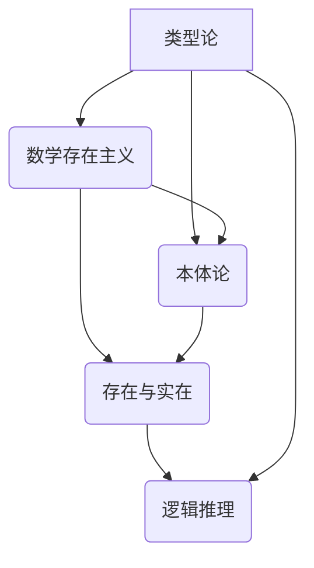

                 

### 引言

#### 1.1 本书的目的与结构

在计算机科学和数学哲学的交汇处，类型论、数学存在主义和本体论构成了探讨现实世界与现实模型之间关系的重要理论框架。本书旨在深入探讨这三个核心概念之间的联系及其在解决本体论困境中的重要性。具体而言，本书将首先介绍类型论的基础概念和发展历程，然后探讨数学存在主义的基本观点及其在数学哲学中的影响，最后结合本体论的困境，通过类型论和数学存在主义的理论工具，提供一种新的解决思路。

本书的结构如下：

- **第一部分：基础理论**：包括第1章到第3章，主要介绍类型论、数学存在主义和本体论的基本概念、原理及其相互关系。
- **第二部分：理论深化**：包括第4章到第6章，深入探讨类型论和数学存在主义在解决本体论困境中的应用。
- **第三部分：结论与展望**：包括第7章，总结本书的研究成果，并提出未来研究方向。

#### 1.2 类型论、数学存在主义与本体论的概述

**类型论**（Type Theory）是一种形式化的数学和计算机科学理论，主要用于定义和验证程序中的类型系统。类型论的核心思想是将数据和操作划分为不同的类型，以确保程序的正确性。类型论不仅广泛应用于编程语言的类型系统设计中，也在逻辑学和数学哲学中有着重要的地位。

**数学存在主义**（Mathematical Existentialism）是一种哲学观点，主张数学对象是真实存在的，其存在不仅依赖于人类的直觉和逻辑推理，更在于它们与现实世界的某种形式的对应。数学存在主义对数学基础和数学哲学有着深远的影响。

**本体论**（Ontology）是研究存在和实在性的哲学分支，探讨存在的本质和存在的不同层次。本体论涉及的问题包括存在的界定、本质与存在的关系等，是理解现实世界和理论模型之间的桥梁。

类型论、数学存在主义和本体论之间的联系在于它们共同探讨现实与模型之间的关系。类型论提供了形式化的方法来定义和验证模型，数学存在主义则提供了哲学基础来支持数学对象的实在性，而本体论则将这种实在性置于更广泛的哲学背景下进行探讨。通过结合这三个理论框架，我们可以更深入地理解现实世界与现实模型之间的复杂关系。

#### 1.3 本书的重要性

在现代计算机科学和数学哲学中，类型论、数学存在主义和本体论的重要性不言而喻。类型论为我们提供了确保程序正确性的方法，数学存在主义则为我们提供了理解数学对象实在性的哲学视角，而本体论则为我们探讨存在和实在性的本质问题提供了理论工具。

然而，本体论困境一直是哲学研究中的难题，涉及到存在的本质、本质与存在的关系等问题。通过结合类型论和数学存在主义，我们可以提供一种新的解决思路，深入探讨本体论困境的根源和可能的解决途径。这不仅有助于计算机科学和数学哲学的发展，也对更广泛的认识论和形而上学研究有着重要的意义。

总之，本书将通过深入探讨类型论、数学存在主义和本体论之间的联系，提供一个全面、深入的理论框架，以应对本体论困境，推动相关领域的深入研究。

### 类型论的基本概念

#### 1.1 类型论的历史与发展

类型论（Type Theory）作为现代数学和计算机科学的重要理论基础，其发展历程可以追溯到20世纪初期。最早的类型概念起源于逻辑学和数学，尤其是形式逻辑和集合论的框架下。早在1908年，德国数学家戴维·希尔伯特（David Hilbert）提出了“公理化的数学”（axiomatic mathematics），尝试通过严格的公理化方法来重建数学基础。这一思想为后来的类型论奠定了基础。

类型论的初步发展可以归功于瑞士数学家皮亚·卡尔纳普（Pierre Cartan）和荷兰数学家洛伦兹·埃尔德舍尔德（L.E.J. Brouwer）。埃尔德舍尔德提出了直觉主义（Intuitionism），强调数学对象的真实性依赖于直观和构造性证明。而卡尔纳普则提出了类型论的雏形，试图通过类型系统来避免悖论和确保数学的一致性。

在计算机科学领域，类型论的应用开始于20世纪50年代。当时，为了解决编程语言中的类型错误问题，阿尔弗雷德·诺思·怀特黑德（Alonzo Church）和贝特兰·罗斯（Bertrand Russell）等人提出了函数式编程语言λ演算（λ-calculus）。λ演算引入了类型系统，使得程序能够通过类型检查来确保正确性。这一突破不仅推动了函数式编程的发展，也为类型论在计算机科学中的应用奠定了基础。

20世纪80年代，随着纯函数式编程语言的兴起，类型论得到了进一步的发展。特别是由贝尔纳多·马绍（Bernard Mery）等人提出的依赖类型理论（Dependent Type Theory），使得类型系统可以表达更复杂的逻辑关系，从而提高了程序的正确性和可靠性。依赖类型理论的应用不仅限于编程语言设计，还扩展到了证明助手机器（Proof Assistants）和形式化验证领域。

在形式逻辑和模型论方面，类型论也有着重要的贡献。类型论提供了形式化的方法来定义和验证逻辑系统的性质，使得逻辑推理更加可靠。特别是通过类型论的方法，可以证明某些逻辑系统的无矛盾性和一致性，从而为逻辑学的发展提供了新的工具。

总之，类型论从早期的数学和逻辑学背景出发，逐渐发展成为现代数学和计算机科学的重要理论基础。其历史发展经历了从形式逻辑、集合论到函数式编程和证明助手机器的演变，展示了类型论在多个学科中的重要性和广泛应用。

#### 1.2 类型论的基本原理

类型论（Type Theory）的核心思想是通过对数据和操作进行分类，确保程序的逻辑一致性和可靠性。类型论的基本原理包括类型系统、类型判断规则和类型检查机制，这些原理共同构成了类型论的基础。

**类型系统**

类型系统（Type System）是类型论中最基本的概念。类型系统将数据（变量、函数、值等）划分为不同的类型，确保每种类型的数据只能参与特定的操作。类型系统的主要目的是通过类型检查来发现和防止错误，例如将整数与字符串混合操作。

在类型论中，常见的类型包括：

- **原始类型**（Primitive Types）：如整数（Int）、布尔（Bool）、字符串（String）等，这些类型是不能再分解的基本类型。
- **构造类型**（Constructed Types）：如列表（List）、函数（Function）、结构体（Structure）等，这些类型是由原始类型或其他构造类型组合而成的。

**类型判断规则**

类型判断规则（Type Judgement Rules）定义了如何判断表达式（变量、函数调用等）的类型。这些规则通常以逻辑形式表示，例如：

- **变量声明规则**：如果变量 \( x \) 被声明为类型 \( T \)，则 \( x : T \) 是一个类型判断。
- **函数声明规则**：如果函数 \( f \) 接受参数类型 \( A \) 并返回类型 \( B \)，则 \( f : A \rightarrow B \) 是一个类型判断。

类型判断规则还包括复合规则，例如：

- **函数应用规则**：如果 \( e_1 : A \) 和 \( e_2 : B \rightarrow C \)，则 \( e_2(e_1) : C \) 是一个类型判断，表示函数 \( e_2 \) 被调用，其参数 \( e_1 \) 的类型是 \( A \)，返回类型是 \( C \)。

**类型检查机制**

类型检查机制（Type Checking Mechanism）是确保程序符合类型系统规则的过程。类型检查通常在编译时或运行时进行，通过检查程序中的表达式是否遵循类型判断规则，来判断程序的正确性。

类型检查机制的主要步骤包括：

1. **静态类型检查**：在编译时对程序进行类型检查，确保每个表达式都符合类型系统规则。静态类型检查可以尽早发现类型错误，减少运行时的错误。
2. **动态类型检查**：在运行时对程序进行类型检查，通过运行时的类型信息来判断程序的正确性。动态类型检查提供了更大的灵活性和性能，但可能需要更多的运行时开销。

**类型论与计算机科学的关系**

类型论不仅在逻辑学和数学哲学中有着重要的地位，也在计算机科学中得到了广泛应用。类型论为编程语言的类型系统提供了理论基础，使得程序能够通过类型检查来确保正确性。

具体而言，类型论在计算机科学中的应用包括：

- **编程语言设计**：类型论为编程语言的类型系统设计提供了指导，如函数式编程语言、依赖类型编程语言等。
- **形式化验证**：通过类型论的方法，可以形式化地验证程序的属性，确保程序的正确性。
- **证明助手机器**：类型论在证明助手机器（如Coq、Isabelle等）中得到了广泛应用，用于自动化证明和验证数学和软件系统的性质。

总之，类型论通过其基本的原理和机制，为计算机科学提供了重要的理论基础，确保了程序的正确性和可靠性。类型论不仅应用于编程语言设计，还在形式化验证和证明助手机器等领域发挥着重要作用。

#### 1.3 类型论的基本原理：类型和对象

类型论的核心概念之一是类型（Type）和对象（Object）。类型是对数据和操作进行分类的抽象，而对象则是具体的实例。理解类型和对象之间的关系，对于掌握类型论的基本原理至关重要。

**类型**

类型是类型论中用于定义数据和操作集合的抽象概念。在类型论中，类型分为原始类型和构造类型。

- **原始类型**（Primitive Types）：原始类型是不能再分解的基本类型，如整数（Int）、布尔（Bool）、字符串（String）等。原始类型是最基本的分类，用于表示最基本的数据形式。
- **构造类型**（Constructed Types）：构造类型是由原始类型或其他构造类型组合而成的类型。常见的构造类型包括列表（List）、函数（Function）、结构体（Structure）等。构造类型提供了更复杂的分类和组合方式。

在类型论中，类型的定义通常通过类型表达式（Type Expression）进行。类型表达式可以是原始类型，也可以是构造类型。例如，函数类型 \( A \rightarrow B \) 表示一个接受类型 \( A \) 的参数并返回类型 \( B \) 的函数。

**对象**

对象是具体实例，是类型的具体实现。每个对象都有一个类型，并且只能参与符合该类型定义的操作。例如，一个整数对象只能进行整数相关的操作，如加法、减法等。

在类型论中，对象通过类型实例化（Type Instantiation）来创建。类型实例化是将抽象的类型表达式具体化为实际的对象。例如，给定类型表达式 \( List(Int) \)，可以实例化为一个具体的整数列表对象。

**类型与对象之间的关系**

类型与对象之间的关系可以用类型系统（Type System）来描述。类型系统定义了类型和对象之间的约束和规则，确保程序的正确性和一致性。

- **类型判断**：类型系统通过类型判断（Type Judgement）来确定对象的类型。类型判断是一个形式化的过程，通过一系列的规则来推导出对象的类型。例如，如果表达式 \( e_1 \) 的类型是 \( A \)，而表达式 \( e_2 \) 的类型是 \( B \rightarrow C \)，则函数调用 \( e_2(e_1) \) 的类型是 \( C \)。
- **类型检查**：类型系统通过类型检查（Type Checking）来确保程序中的每个表达式都符合类型规则。类型检查在编译时或运行时进行，通过检查程序中的类型信息，发现和防止类型错误。

在类型论中，类型和对象之间的关系是动态和交互的。类型定义了对象的可能操作和属性，而对象通过实例化来具体实现类型。例如，在函数式编程语言中，函数类型定义了函数的输入和输出类型，而函数对象实现了这些输入和输出操作。

**类型论与对象之间的关系**不仅确保了程序的正确性，还为程序设计提供了强大的抽象能力。通过类型系统，程序员可以更清晰地定义和操作数据和操作，避免潜在的错误和冲突。同时，类型论也为形式化验证和证明提供了重要的理论基础，使得复杂的程序和系统可以通过形式化的方法来验证和证明其正确性。

总之，类型和对象是类型论中的核心概念，它们之间的关系通过类型系统来定义和约束。理解类型与对象的基本原理，对于深入掌握类型论和其在计算机科学中的应用具有重要意义。

#### 1.4 类型论与类型系统

类型论（Type Theory）在计算机科学和数学中扮演着至关重要的角色，其核心是类型系统（Type System）。类型系统通过将程序中的数据和操作划分为不同的类型，确保程序的正确性和可靠性。理解类型论与类型系统的关系，有助于我们更深入地掌握类型论的基本原理和应用。

**类型系统的定义**

类型系统是一种形式化的机制，用于定义和解释程序中的类型。类型系统的主要目的是通过类型检查来确保程序的逻辑一致性。具体而言，类型系统定义了一组类型规则，用于确定程序中每个表达式（如变量、函数调用、运算符等）的类型。如果表达式符合类型系统规则，则认为该表达式是类型正确的。

**类型系统的组成部分**

1. **类型集合**：类型集合定义了一组合法的类型，包括原始类型和构造类型。原始类型如整数（Int）、布尔（Bool）等，构造类型如列表（List）、函数（Function）等。
2. **类型表达式**：类型表达式是用于表示类型的符号和构造规则。类型表达式可以是原始类型，也可以是通过构造规则组合而成的复合类型。
3. **类型判断规则**：类型判断规则定义了如何从程序中的表达式推导出其类型。类型判断规则通常包括变量声明规则、函数声明规则和复合规则等。

**类型系统的分类**

根据类型系统在编译和运行过程中的作用，类型系统可以分为静态类型系统和动态类型系统。

- **静态类型系统**：静态类型系统在编译时对程序进行类型检查，确保每个表达式在编译时类型正确。静态类型系统的主要优点是能够及早发现类型错误，减少运行时的错误。常见的静态类型编程语言包括C++、Java和Haskell等。
- **动态类型系统**：动态类型系统在运行时对程序进行类型检查，通过运行时的类型信息来判断程序的正确性。动态类型系统提供了更大的灵活性和性能，但可能需要更多的运行时开销。常见的动态类型编程语言包括Python、JavaScript和Ruby等。

**类型论与类型系统的关系**

类型论为类型系统提供了理论基础，而类型系统则是类型论在计算机科学中的具体实现。具体来说，类型论与类型系统的关系体现在以下几个方面：

1. **类型论的基本原理**：类型论的基本原理，如类型系统、类型判断规则和类型检查机制，为类型系统设计提供了指导。类型系统通过实现这些基本原理，确保程序的正确性和一致性。
2. **类型系统的应用**：类型系统在编程语言设计和形式化验证中得到了广泛应用。通过类型系统，编程语言可以定义严格的类型规则，确保程序的正确性。同时，形式化验证工具（如证明助手机器）也利用类型系统来验证程序和数学定理的正确性。
3. **类型论的发展**：类型论的发展推动了类型系统的改进和创新。例如，依赖类型理论（Dependent Type Theory）的提出，为类型系统提供了更强大的表达能力，使得类型系统能够处理更复杂的逻辑关系。

**类型系统的重要性**

类型系统在计算机科学中具有重要意义，主要体现在以下几个方面：

1. **确保程序正确性**：类型系统通过类型检查确保程序中的每个表达式都符合类型规则，从而减少类型错误的发生。
2. **提高程序可读性**：类型系统为程序提供了明确的类型信息，使得程序代码更加清晰和易于理解。
3. **支持形式化验证**：类型系统为形式化验证提供了重要的工具，使得复杂的程序和系统可以通过形式化的方法来验证和证明其正确性。

总之，类型论与类型系统密切相关，类型系统是类型论在计算机科学中的具体实现。通过类型系统，我们可以确保程序的正确性和可靠性，支持形式化验证和编程语言的优化。理解类型论与类型系统的关系，对于深入掌握计算机科学和编程技术具有重要意义。

#### 1.5 类型论与计算机科学的关系

类型论（Type Theory）在计算机科学中占据了至关重要的地位，其基本原理和概念不仅为编程语言的设计提供了坚实的理论基础，还在形式化验证和证明助手机器等领域有着广泛的应用。以下从多个方面详细探讨类型论与计算机科学之间的密切关系。

**类型论在编程语言设计中的应用**

类型论在编程语言设计中起到了核心作用，尤其是在函数式编程语言中。函数式编程强调通过纯函数和不可变数据结构来组织代码，类型论提供了这种编程范式的形式化基础。例如，λ演算（λ-calculus）作为一种纯粹的函数式语言，通过类型系统确保函数和值的正确性。

- **静态类型检查**：类型论中的类型系统通过静态类型检查确保程序在编译时类型正确。静态类型检查能够发现并防止潜在的运行时错误，提高程序的可靠性。例如，Haskell和Scala等编程语言采用了强类型系统，要求变量在声明时必须明确其类型，从而避免了类型错误。
- **动态类型检查**：虽然动态类型系统在运行时进行类型检查，但类型论的概念仍为其提供了理论基础。例如，Python和JavaScript等编程语言采用了动态类型系统，通过运行时类型检查来确保程序的正确性。

**形式化验证**

形式化验证是确保软件系统正确性和可靠性的重要手段，而类型论在形式化验证中发挥着关键作用。类型论提供了形式化的方法来定义和验证程序的性质，使得复杂系统的验证变得更加可靠和高效。

- **证明助手机器**：证明助手（Proof Assistant）是一种形式化验证工具，它利用类型论的方法来验证数学定理和程序的正确性。例如，Coq和Isabelle等证明助手利用依赖类型理论（Dependent Type Theory）来构建和验证复杂的数学和软件系统。这些工具通过类型系统确保每个证明步骤都符合逻辑规则，从而验证整个证明过程的有效性。
- **模型检查**：类型论的方法也应用于模型检查（Model Checking），通过状态空间搜索来验证系统是否满足指定的属性。类型论为模型检查提供了形式化的类型系统，使得模型检查工具能够更准确地分析系统的行为。

**类型论与其他计算机科学领域的关系**

类型论不仅应用于编程语言设计和形式化验证，还在计算机科学的多个领域有着广泛的应用。

- **逻辑编程**：类型论与逻辑编程（Logic Programming）密切相关。逻辑编程通过逻辑推理来求解问题，而类型论提供了形式化的方法来定义和验证逻辑程序的性质。例如，Prolog是一种基于逻辑编程的编程语言，其类型系统确保逻辑程序的一致性和正确性。
- **分布式计算**：在分布式计算领域，类型论为分布式系统的设计提供了理论基础。类型论通过定义进程的类型和通信类型，确保分布式系统的正确性和一致性。例如，通信类型系统（Communicating Sequential Processes, CSP）是一种基于类型论的分布式计算模型。
- **软件工程**：类型论在软件工程中有着广泛的应用。通过类型系统，软件开发者可以更清晰地定义和操作软件系统的各个部分，确保系统的正确性和可靠性。类型论的概念和方法也应用于软件测试和验证，提高软件质量。

总之，类型论在计算机科学中具有广泛而深远的影响。通过类型系统，编程语言可以确保程序的正确性，形式化验证工具可以验证复杂系统的性质，计算机科学的各个领域都可以从类型论中受益。理解类型论与计算机科学的关系，对于深入掌握计算机科学的理论和实践具有重要意义。

#### 1.6 类型论的逻辑基础

类型论（Type Theory）在逻辑学中具有坚实的理论基础，通过形式化的类型系统，类型论提供了逻辑推理和证明的有力工具。类型论的逻辑基础主要涉及形式逻辑、模型论和集合论等核心概念，这些概念共同构成了类型论的形式化和严格性。

**形式逻辑**

形式逻辑（Formal Logic）是一种使用符号和规则进行推理的数学方法，其目的是通过逻辑推理来证明命题的真假。形式逻辑的基本元素包括命题、逻辑运算符和推理规则。

- **命题**：命题是能够判断真假的陈述，通常用大写字母表示，如 \( P \)、\( Q \) 等。
- **逻辑运算符**：逻辑运算符用于组合命题，包括合取（∧）、析取（∨）、非（¬）等。例如，\( P ∧ Q \) 表示 \( P \) 和 \( Q \) 同时为真，\( P ∨ Q \) 表示 \( P \) 或 \( Q \) 至少有一个为真，\( ¬P \) 表示 \( P \) 为假。
- **推理规则**：推理规则（Inference Rules）是用于从已知命题推导出新命题的规则。常见的推理规则包括合取引入（Conjunction Introduction）、析取引入（Disjunction Introduction）、否定引入（Negation Introduction）和否定消除（Negation Elimination）等。

形式逻辑通过符号和规则来构建严谨的推理系统，使得逻辑推理更加准确和可靠。

**模型论**

模型论（Model Theory）是研究逻辑系统在数学结构中如何满足逻辑语句的学科。模型论的核心概念是模型（Model），它是一个数学结构，能够满足一组逻辑语句。

- **模型**：模型是一个数学结构，如一组数、一个函数或一组关系，它能够满足一组逻辑语句。例如，一个数集 \( M \) 可以是一个模型，如果它满足一组关于数的逻辑语句。
- **语言**：模型论中的语言包括命题变元、谓词符号、函数符号和恒等式等。语言用于定义逻辑系统中的符号和表达式。
- **理论**：理论（Theory）是一组逻辑语句，它构成了一个逻辑系统的规范。例如，一组关于实数的逻辑语句构成了实数的理论。

模型论通过验证逻辑系统在特定数学结构中的满足情况，研究逻辑系统的一致性和完整性。

**集合论**

集合论（Set Theory）是研究集合的数学分支，它提供了数学对象的基本分类和结构。集合论的基本概念包括集合、元素、子集、并集、交集和补集等。

- **集合**：集合是由一组确定的元素组成的集合，通常用大括号表示。例如，\( A = \{1, 2, 3\} \) 表示一个包含元素1、2和3的集合。
- **元素**：元素是集合中的个体，它可以是任何对象，如数字、字符或其他集合。
- **子集**：子集是一个集合的部分集合，用符号 \( \subseteq \) 表示。例如，\( \{1, 2\} \subseteq \{1, 2, 3\} \) 表示集合{1, 2}是集合{1, 2, 3}的子集。
- **并集**：并集是由两个或多个集合中的所有元素组成的集合，用符号 \( \cup \) 表示。例如，\( \{1, 2\} \cup \{3, 4\} = \{1, 2, 3, 4\} \)。
- **交集**：交集是由两个或多个集合中共有的元素组成的集合，用符号 \( \cap \) 表示。例如，\( \{1, 2\} \cap \{3, 4\} = \emptyset \)。
- **补集**：补集是一个集合的补集，它包含了所有不属于该集合的元素，用符号 \( \complement \) 表示。例如，\( \complement \{1, 2\} = \{3, 4\} \)。

集合论为数学提供了形式化的基础，使得数学对象和性质可以通过集合来定义和描述。

**类型论在逻辑基础中的应用**

类型论在逻辑基础中的应用体现在以下几个方面：

- **形式化推理**：类型论提供了形式化的类型系统，使得逻辑推理过程更加严格和可靠。通过类型系统，可以确保逻辑推理的每一步都符合逻辑规则，从而提高推理的准确性。
- **证明**：类型论为数学和逻辑证明提供了形式化的方法。通过依赖类型理论（Dependent Type Theory），可以构建和验证复杂的数学和逻辑证明，确保证明过程的一致性和正确性。
- **形式化验证**：类型论在形式化验证中发挥了重要作用。通过类型系统，可以形式化地验证程序的属性和性质，确保程序的正确性和可靠性。

总之，类型论在逻辑学中具有坚实的理论基础，通过形式逻辑、模型论和集合论等概念，提供了形式化的推理和证明工具。类型论的应用不仅丰富了逻辑学的研究，也为计算机科学和其他数学领域提供了重要的理论支持。

#### 1.7 类型论与本体论的关系

类型论（Type Theory）与本体论（Ontology）之间存在着密切的关联，两者共同探讨现实世界与现实模型之间的关系。类型论通过形式化的类型系统提供了一种定义和验证模型的方法，而本体论则从哲学角度探讨存在的本质和实在性。以下是类型论与本体论之间关系的具体探讨。

**类型论的本体论意义**

类型论在本体论中的意义主要体现在以下几个方面：

1. **定义存在**：类型论通过定义类型系统，提供了一种形式化的方法来定义存在的概念。类型论中的类型可以看作是存在的一种分类，每种类型代表了特定种类的事物。例如，在函数式编程中，类型系统将数据和操作划分为不同的类型，从而定义了这些数据对象的存在形式。

2. **形式化现实模型**：类型论通过形式化的方法，将现实世界中的模型抽象为数学对象和类型。这种形式化的过程有助于我们更准确地理解现实世界的本质，并构建可靠的模型。例如，通过类型论的方法，可以构建和验证现实世界中的复杂系统，如软件系统、社会模型等。

3. **推理和证明**：类型论提供了形式化的推理和证明工具，使得我们可以通过逻辑推理来探讨存在的性质和关系。类型论中的依赖类型理论（Dependent Type Theory）特别适用于构建和验证复杂的数学和逻辑证明，从而深化我们对存在和实在性的理解。

**本体论的类型论视角**

本体论从哲学角度探讨存在的本质和实在性，而类型论为本体论提供了一种形式化的研究工具。以下是本体论在类型论视角下的几个关键概念：

1. **类型与本体**：在类型论中，类型被视为存在的基本分类。本体论则通过类型论的概念来探讨不同类型的本体。例如，柏拉图式的本体论认为现实世界中的物体是对抽象形式的模仿，类型论通过形式化的类型系统，提供了对这种观点的形式化描述。

2. **本质与类型**：本体论探讨存在的本质问题，而类型论则通过类型的层次结构和组合规则来描述本质。例如，在依赖类型理论中，类型的组合和依赖关系可以表示复杂本质的结构。

3. **实在性与类型**：本体论探讨存在的实在性问题，而类型论通过类型系统的严格性来保证实在性的形式化表达。类型论中的类型检查机制确保了类型系统的逻辑一致性，从而为实在性的探讨提供了可靠的基础。

**类型论与本体论的结合**

类型论和本体论的结合为我们提供了一种新的研究方法，以更深入地探讨存在的本质和实在性。以下是一些可能的结合方向：

1. **形式化的本体论**：通过类型论的方法，可以将本体论的形式化，构建形式化的本体论系统。这种方法有助于我们更清晰地理解和定义存在的概念，并为哲学研究提供新的工具。

2. **形式化验证**：在计算机科学和软件工程领域，类型论提供了形式化验证的方法，可以用于验证复杂系统的性质。本体论可以与类型论结合，用于验证现实世界模型的形式化表示，确保模型的一致性和正确性。

3. **逻辑哲学**：类型论与本体论的结合可以应用于逻辑哲学的研究，通过形式化的逻辑系统来探讨存在的本质和实在性。这种方法有助于我们更深入地理解逻辑与哲学的关系，推动逻辑哲学的发展。

总之，类型论与本体论之间存在着密切的关系，两者共同探讨存在的本质和实在性。通过结合类型论的形式化方法和本体论的哲学视角，我们可以更深入地探讨存在的复杂性，为哲学和计算机科学的研究提供新的思路和方法。

#### 1.8 类型论、数学存在主义与本体论的关系架构：Mermaid 流程图

为了更清晰地展示类型论、数学存在主义和本体论之间的关系，我们使用Mermaid流程图来描述这些概念及其相互关系。以下是具体的Mermaid代码及其生成的流程图。



生成的流程图如下：

```
    类型论
      |
      V
    数学存在主义
      |
      V
    本体论
      |
      V
    存在与实在
      |
      V
    逻辑推理
      |
      V
   ----------------
    |              |
    A              B
    |              |
    类型论         数学存在主义
    |              |
    |______________|
    |
    |
    C
    |
    |
    本体论
```

流程图解释：

1. **类型论**：作为类型论，其核心是定义数据和操作的类型系统，确保程序的逻辑一致性和可靠性。
2. **数学存在主义**：数学存在主义探讨数学对象的实在性，主张数学对象不仅是抽象概念，而是真实存在的。
3. **本体论**：本体论研究存在的本质和实在性，探讨存在的不同层次和形式。
4. **存在与实在**：存在与实在是本体论的核心问题，涉及存在的本质和实在性的探讨。
5. **逻辑推理**：类型论和数学存在主义为本体论提供了形式化的逻辑推理工具，通过逻辑推理来探讨存在的本质和实在性。

通过这个Mermaid流程图，我们可以更直观地理解类型论、数学存在主义和本体论之间的复杂关系及其在逻辑推理中的应用。

#### 1.9 类型论在解决本体论困境中的应用

类型论（Type Theory）在解决本体论（Ontology）困境中发挥了重要作用。本体论困境主要涉及存在的本质、本质与存在的关系等问题。通过类型论的形式化方法和严格的逻辑框架，我们可以更深入地探讨本体论问题，并提供新的解决思路。

**本质与存在的界定**

本体论的核心问题是探讨存在的本质和存在本身。类型论通过定义类型系统，提供了一种形式化的方法来界定本质和存在。

- **类型论中的类型**：类型论中的类型是对数据和操作的分类，每种类型代表了特定种类的事物。通过类型系统，我们可以将现实世界中的对象抽象为数学对象，从而更准确地界定其本质。例如，在函数式编程中，类型系统将整数、列表、函数等对象划分为不同的类型，明确了每个对象的存在形式和操作规则。
- **本质的界定**：类型论通过类型的层次结构和组合规则来描述本质。依赖类型理论（Dependent Type Theory）特别适用于构建和验证复杂的数学和逻辑证明，从而更准确地表达本质的结构。例如，通过依赖类型，可以定义复杂的函数类型，从而更精确地描述函数的本质。

**存在与类型的关系**

类型论不仅提供了形式化的方法来界定本质，还探讨了存在与类型之间的关系。

- **存在的定义**：类型论通过类型系统来定义存在。在类型论中，类型的定义意味着存在的定义。例如，一个函数类型 \( A \rightarrow B \) 定义了从类型 \( A \) 到类型 \( B \) 的函数存在。这种定义方式使得存在具有明确的形式化特征。
- **存在与类型的关系**：类型论中的类型系统确保了存在的形式化和一致性。通过类型检查机制，类型论可以确保每个对象的存在形式符合其类型定义，从而避免了逻辑上的不一致和矛盾。

**解决本体论困境的具体方法**

类型论在解决本体论困境中提供了以下具体方法：

1. **形式化本体论**：通过类型论的方法，可以将本体论的形式化，构建形式化的本体论系统。这种方法有助于我们更清晰地理解和定义存在的概念，并为哲学研究提供新的工具。
2. **形式化验证**：在计算机科学和软件工程领域，类型论提供了形式化验证的方法，可以用于验证复杂系统的性质。本体论可以与类型论结合，用于验证现实世界模型的形式化表示，确保模型的一致性和正确性。
3. **逻辑推理**：类型论为本体论提供了形式化的逻辑推理工具，通过逻辑推理来探讨存在的本质和实在性。类型论中的依赖类型理论（Dependent Type Theory）特别适用于构建和验证复杂的数学和逻辑证明，从而深化我们对存在和实在性的理解。

**案例分析**

为了具体说明类型论在解决本体论困境中的应用，我们可以考虑以下案例：

- **案例一：计算机科学中的类型论应用**：在计算机科学中，类型论通过定义数据类型和操作类型，确保程序的正确性和可靠性。例如，在Haskell编程语言中，类型系统确保变量在使用前被正确声明，从而避免了类型错误。这种形式化的类型检查机制为解决计算机科学中的本体论问题提供了有效的方法。
- **案例二：数学哲学中的存在主义与类型论结合**：在数学哲学中，数学存在主义主张数学对象是真实存在的。通过类型论的方法，我们可以形式化地定义数学对象的类型，并探讨其存在形式。例如，在集合论中，集合被视为数学对象，通过类型论可以形式化地定义集合的类型，从而探讨集合的存在性和性质。

总之，类型论在解决本体论困境中提供了形式化的方法和工具。通过类型系统的形式化定义和严格的逻辑框架，类型论为探讨存在的本质和实在性提供了新的思路和方法。这不仅有助于计算机科学和数学哲学的发展，也为更广泛的认识论和形而上学研究提供了重要启示。

### 数学存在主义概述

#### 2.1 数学存在主义的历史背景

数学存在主义（Mathematical Existentialism）作为一种哲学观点，其历史背景可以追溯到20世纪初。在数学发展的历史长河中，数学对象的存在性问题一直是哲学家和数学家争论的焦点。传统的数学哲学认为，数学对象是抽象的，通过人类的直觉和推理得到，其存在依赖于我们的心智活动。然而，随着数学逻辑和形式化方法的兴起，特别是在数学基础危机和逻辑主义运动的推动下，数学存在主义逐渐形成并发展起来。

最早提出数学存在主义思想的是荷兰数学家洛伦兹·埃尔德舍尔德（L.E.J. Brouwer），他于19世纪末和20世纪初提出了直觉主义（Intuitionism）。直觉主义主张数学对象的真实性依赖于直观和构造性证明，而不是形式化的符号游戏。埃尔德舍尔德认为，数学对象是通过我们的直觉过程构造出来的，数学的合理性源于我们的直觉能力。这一观点对后来的数学存在主义产生了深远影响。

20世纪初期，数学存在主义的另一个重要代表是德国数学家戴维·希尔伯特（David Hilbert）。虽然希尔伯特是形式化方法和逻辑主义的倡导者，但他也关注数学对象的存在性问题。希尔伯特认为，数学对象是构造出来的，其存在性可以通过构造证明来证实。他的“公理化方法”试图通过一套严格的公理来重建数学基础，从而确保数学对象的存在性和一致性。

随着逻辑主义和直觉主义的发展，数学存在主义逐渐在数学哲学中占据了一席之地。数学存在主义不仅挑战了传统的逻辑主义观点，也为数学对象的存在性提供了新的哲学基础。20世纪中叶，数学存在主义的思想进一步发展，特别是在证明理论和计算机科学领域，类型论和构造性证明等方法得到了广泛应用。

#### 2.2 数学存在主义的基本观点

数学存在主义的基本观点主要包括以下几个方面：

1. **数学对象的实在性**：数学存在主义主张数学对象是真实存在的，而不是仅仅存在于我们的心智中。数学对象的存在性不仅依赖于逻辑推理，更依赖于直觉和构造性证明。数学对象具有某种形式的物理或客观现实，这种存在是可以通过直觉和构造性证明来验证的。

2. **直觉与构造性证明**：数学存在主义强调直觉在数学中的作用。直觉是理解数学对象和证明的重要工具，它不仅帮助我们理解数学概念，还为数学证明提供指导。构造性证明是数学存在主义的核心概念之一，它要求证明过程中每一步都必须是可构造的，即能够通过实际操作得到。这种证明方式确保了数学结论的真实性和可靠性。

3. **反对形式主义和逻辑主义**：数学存在主义反对形式主义和逻辑主义对数学基础的理解。形式主义认为数学仅仅是符号系统，而逻辑主义则主张数学对象可以通过逻辑推导得到。数学存在主义认为，这种观点忽视了直觉和构造性证明的重要性，无法完全解释数学对象的真实存在。

4. **数学真理与客观现实**：数学存在主义认为，数学真理不仅依赖于逻辑推理，还与客观现实有关。数学对象的存在性和数学真理的关系是哲学讨论的一个重要议题。数学存在主义主张，数学对象的真实存在可以通过直觉和构造性证明得到证实，这种存在是客观的，而不是仅仅依赖于我们的心智。

总之，数学存在主义的基本观点为数学对象的存在性提供了新的哲学视角，强调了直觉和构造性证明在数学研究中的重要性。通过这种观点，我们可以更深入地理解数学对象的实在性和数学真理的本质。

#### 2.3 数学存在主义的影响与争议

数学存在主义自20世纪初提出以来，对数学哲学、逻辑学和哲学领域产生了深远的影响，同时也引发了广泛的争议。以下从不同角度详细探讨数学存在主义的影响与争议。

**数学哲学的影响**

数学存在主义对数学哲学的影响主要体现在对数学对象存在性的探讨和数学证明方法的理解上。

1. **存在的探讨**：数学存在主义强调数学对象的真实存在，这种观点挑战了传统的逻辑主义和形式主义对数学基础的理解。数学存在主义主张，数学对象不仅仅是抽象的概念，而是具有某种形式的物理或客观现实。这种存在可以通过直觉和构造性证明得到验证。这一观点为数学哲学提供了一种新的思考方式，使得数学对象的存在性成为数学哲学研究的一个重要议题。

2. **证明方法**：数学存在主义强调直觉和构造性证明的重要性，这改变了传统的证明方法。构造性证明要求证明的每一步都是可构造的，即能够通过实际操作得到。这种方法不仅提高了证明的可靠性，也使证明过程更具透明性。数学存在主义对证明方法的影响，促使数学家在证明过程中更加注重逻辑的严格性和可构造性。

**逻辑学的影响**

数学存在主义在逻辑学中的影响主要表现在对逻辑系统的形式化和证明理论的发展上。

1. **形式化方法**：数学存在主义推动了对逻辑系统形式化的研究。通过类型论和依赖类型理论，数学存在主义提供了形式化的方法来定义和验证逻辑系统的性质。这些形式化方法不仅提高了逻辑推理的准确性，也为逻辑学的形式化发展提供了新的工具。

2. **证明理论**：数学存在主义中的构造性证明方法对证明理论产生了重要影响。构造性证明要求证明的每一步都是可构造的，这种证明方法使得证明过程更加严谨和可靠。同时，构造性证明也为计算机辅助证明和形式化验证提供了理论基础，推动了逻辑学和计算机科学的交叉研究。

**哲学领域的影响**

数学存在主义在哲学领域的影响主要体现在对存在和实在性等哲学问题的探讨上。

1. **存在的本质**：数学存在主义对存在的本质进行了深入的探讨，提出数学对象的真实存在不仅依赖于逻辑推理，还与直觉和构造性证明有关。这种观点丰富了哲学对存在和实在性的理解，为形而上学和认识论的研究提供了新的视角。

2. **数学与哲学的关系**：数学存在主义强调了数学与哲学之间的紧密联系，提出数学不仅是抽象的符号游戏，而是与现实世界有某种形式的对应。这种观点促使哲学对数学和现实世界之间的关系进行更深入的探讨，推动了数学哲学的发展。

**数学存在主义的争议**

尽管数学存在主义在数学哲学、逻辑学和哲学领域产生了深远影响，但也引发了广泛的争议。

1. **对形式主义的挑战**：数学存在主义对传统的形式主义观点提出了挑战。形式主义认为数学是纯粹的符号系统，不存在数学对象的真实存在。数学存在主义则主张数学对象的真实存在，这种观点与传统形式主义的观点形成了鲜明对比。

2. **构造性证明的争议**：数学存在主义强调构造性证明的重要性，但这种证明方法在某些情况下可能不适用于所有数学问题。例如，在非构造性证明中，虽然结论是正确的，但无法通过具体构造来验证。这引发了关于证明方法和证明标准的争议。

3. **数学与物理的关系**：数学存在主义提出了数学与现实世界的某种形式的对应，但这种对应关系的具体性质和范围尚未明确。数学与物理的关系一直是哲学和科学哲学研究的重要议题，数学存在主义对这一议题的探讨也引发了许多争议。

总之，数学存在主义在数学哲学、逻辑学和哲学领域产生了重要影响，但也引发了广泛的争议。通过深入探讨数学对象的存在性、证明方法和数学与哲学的关系，数学存在主义为数学和哲学的发展提供了新的思路和方法。

#### 2.4 数学存在主义对数学哲学的影响

数学存在主义对数学哲学产生了深远的影响，特别是在数学基础、数学对象的存在性和数学证明方法等方面。通过重新审视数学对象的存在性和探讨数学真理的本质，数学存在主义为数学哲学提供了新的视角和框架。

**数学基础**：

数学存在主义对数学基础的传统观点提出了挑战。传统观点认为数学是一个基于公理和逻辑推理的纯粹形式系统，其对象是抽象的、非物理的。数学存在主义则主张数学对象具有真实的物理存在，这种存在依赖于人类的直觉和构造性证明。这种观点对逻辑主义和形式主义提出了质疑，认为数学不仅是一个形式系统，而是与客观现实有某种形式的联系。

数学存在主义的一个核心主张是，数学对象的真实存在是通过构造性证明来验证的。这与逻辑主义强调的逻辑推理和形式主义强调的符号操作形成了鲜明对比。数学存在主义认为，数学对象的存在性不仅依赖于逻辑推理，还需要通过具体的构造过程来证实。这种构造性证明方法为数学基础提供了更直观和现实的基础。

**数学对象的存在性**：

数学存在主义对数学对象的存在性进行了深入的探讨。传统观点通常将数学对象视为抽象的符号和概念，数学存在主义则主张这些对象是真实存在的，其存在不仅依赖于逻辑推理，还与直觉和构造性证明有关。

数学存在主义强调，数学对象的存在性可以通过直觉和构造性证明得到验证。这种证明方法要求证明的每一步都是可构造的，即可以通过实际操作得到。这种存在性是客观的，而不是仅仅依赖于人类的思维活动。数学存在主义提出的这种存在性观念，使得数学对象具有更现实的基础，与客观现实有某种形式的对应。

**数学真理的本质**：

数学存在主义对数学真理的本质提出了新的解释。传统观点通常将数学真理视为逻辑推理的结果，而数学存在主义则主张数学真理不仅依赖于逻辑推理，还依赖于数学对象的真实存在。

数学存在主义认为，数学真理的本质在于数学对象的真实存在和其与直觉和构造性证明的对应关系。这种观点强调了数学真理的客观性和现实性，使得数学不再仅仅是一个抽象的形式系统，而是与客观现实有某种形式的联系。

**数学哲学的发展**：

数学存在主义对数学哲学的发展产生了重要影响。它促使数学哲学家重新审视数学对象的存在性、数学基础和数学证明方法等问题。数学存在主义的观点为数学哲学提供了一种新的研究视角，使得数学哲学不再仅仅关注逻辑和形式化方法，而是更加注重数学与现实世界的关系。

此外，数学存在主义还推动了数学哲学与其他学科的交叉研究。例如，数学存在主义与逻辑学、计算机科学和认知科学的交叉研究，促进了这些领域的发展。通过这些交叉研究，数学哲学不仅能够更深入地探讨数学对象的存在性和数学真理的本质，还能为其他学科提供新的理论工具和方法。

总之，数学存在主义对数学哲学产生了深远的影响，特别是在数学基础、数学对象的存在性和数学证明方法等方面。通过重新审视数学对象的存在性和探讨数学真理的本质，数学存在主义为数学哲学提供了新的视角和框架，推动了数学哲学的发展。

### 本体论的基本问题

本体论（Ontology）是哲学的核心分支之一，主要探讨存在的本质和实在性。在研究本体论时，以下几个基本问题显得尤为重要：

#### 3.1.1 存在的界定

存在的界定是本体论研究的首要问题。如何定义存在，以及哪些实体被认为是存在的，这是一个复杂且具有争议性的问题。

- **实存论（Existentialism）**：实存论主张只有那些实际存在的实体才是真实的。例如，桌子、椅子等物理对象是真实存在的，而抽象概念如“正义”、“美”等则是不可知的。实存论强调，存在的实体必须是可以感知和验证的。

- **唯名论（Nominalism）**：唯名论认为只有个体对象是真实的，而普遍概念和属性只是名称或符号。根据唯名论的观点，如“人”这个概念并不是真实存在的，而是用来指称具有某些共同特征的个体的名称。

- **唯实论（Realism）**：唯实论主张普遍概念和属性是真实存在的。例如，根据唯实论的观点，“人”不仅是一个名称，而且是一个独立于个体存在的抽象实体。这种观点在柏拉图哲学中得到了体现，柏拉图认为理念世界（Idea World）是真实存在的，而物理世界只是理念世界的模仿。

- **实质存在论（Substantival Realism）**：实质存在论认为物质实体是构成宇宙的基本单元，如物体、粒子等。实质存在论强调了物质的实在性和独立性。

#### 3.1.2 存在的层次

存在的层次是指存在者在哲学体系中的分类和层次结构。不同的本体论体系对存在的层次有不同的理解和划分。

- **柏拉图式的层次结构**：柏拉图将存在分为两个世界：感性世界和理念世界。感性世界是变化无常的，而理念世界则是永恒不变且真实的。在柏拉图看来，理念世界是存在的最高层次，感性世界只是理念世界的投影。

- **亚里士多德式的层次结构**：亚里士多德认为存在可以分为四类：实质（Substance）、属性（Attribute）、关系（Relation）和实存（Existence）。实质是存在的最高层次，是构成宇宙的基本单元。属性是实质的属性或特征，关系是实体之间的相互关系，实存是实体存在的状态。

- **现象学层次结构**：现象学强调存在的层次是由意识经验和现象构成的。现象学中的层次结构包括感觉、知觉、想象和记忆等。这些层次反映了人类意识对存在的感知和理解。

#### 3.2 本体论的核心困境

本体论在探讨存在的本质和实在性时，面临着一系列核心困境：

- **存在与本质的关系**：存在与本质的关系是本体论中的一个基本问题。本质是存在的内在属性和特性，而存在是本质的外在表现。如何理解本质与存在之间的区别和联系，是本体论研究中的一个难题。例如，柏拉图认为理念（本质）是真实存在的，而物理对象只是理念世界的模仿。

- **模式与实在的关系**：模式与实在的关系探讨的是抽象模型与现实世界之间的关系。模式是对现实世界的抽象和简化，而实在则是现实世界的本质和整体。如何理解模式和实在之间的对应关系，以及模式是否能够准确反映实在，是本体论研究中的另一个重要问题。

- **个体与整体的关系**：个体与整体的关系是本体论中的另一个核心困境。个体是构成整体的基本单元，而整体则是多个个体的集合和整合。如何理解个体与整体之间的相互关系，以及整体是否具有独立于个体的特性，是本体论研究中的一个复杂问题。

- **知识的本质**：本体论还涉及到知识的本质问题。知识是对存在的理解和认知，但如何确定知识的真实性和可靠性，是本体论研究中的一个重要议题。知识的本质不仅取决于存在的本质，还受到人类认知能力和认知方式的影响。

通过探讨这些核心困境，本体论试图为我们提供对存在的深刻理解和解释，从而为哲学和科学研究提供坚实的理论基础。

#### 3.3 本体论的核心困境：存在与本质的关系

在本体论的核心困境中，存在与本质的关系是最为复杂和具有争议性的问题之一。存在（Existence）与本质（Essence）的关系探讨的是实体在其内在属性和外在表现之间的联系。理解这一关系不仅涉及哲学的基本问题，还对科学理论和认识论有重要影响。

**存在的定义**

存在是指实体在现实世界中的实际状态和属性，是实体能够被感知、识别和验证的基础。存在可以通过物理、心理或社会现象来体现，是客观世界和主观意识中普遍存在的现象。存在可以分为两种主要形式：

1. **物理存在**：物理存在指的是实体在物理世界中占据空间和时间的特性。例如，地球、水分子等都是物理存在的实例。物理存在可以通过科学方法进行测量和验证。

2. **抽象存在**：抽象存在指的是实体在抽象概念或思想体系中的表现。例如，数学概念、道德原则等都是抽象存在的实例。抽象存在虽然不直接感知，但可以通过逻辑推理和思维活动来理解和验证。

**本质的定义**

本质是指实体固有的、决定其存在的根本属性和特性。本质是实体之所以成为该实体的内在原因和依据。本质可以从以下几个方面来理解：

1. **内在本质**：内在本质是实体固有的、不依赖于外部条件的特性。例如，人的生命本质包括呼吸、代谢等生物特性，这些特性是生命存在的基础。

2. **外在本质**：外在本质是实体在特定环境中的表现和影响。例如，一个水分子在常温下具有液态特性，这是其在特定环境中的外在本质。

**存在与本质的关系**

存在与本质之间的关系是哲学和本体论研究中的一个基本问题，主要包括以下几种观点：

1. **本质先于存在**：这种观点认为本质是存在的基础和前提，存在是本质的外在表现。例如，柏拉图的理念论认为，理念（本质）是真实存在的，而物理对象只是理念的模仿。在这种观点中，本质是第一性的，存在是第二性的。

2. **存在先于本质**：这种观点认为存在是本质的前提和条件，本质是在存在的基础上产生的。例如，康德认为，本质不是先于存在而存在的，而是通过我们对存在的认识和理解而形成的。在这种观点中，存在是第一性的，本质是第二性的。

3. **本质与存在同一**：这种观点认为本质和存在是不可分割的，本质即是存在，存在即是本质。例如，实体论认为，实体是本质和存在的统一体，本质是实体内在的、固有的属性。

**存在与本质关系的困境**

存在与本质的关系存在以下几个困境：

1. **本质的可证明性**：如何证明一个实体的本质是存在的前提，是一个复杂的问题。传统哲学认为，本质可以通过逻辑推理和定义得到证明，但现代哲学对本质的可证明性提出了质疑。

2. **存在的多重解释**：存在可以有多种不同的解释，例如物理存在、抽象存在等。这些解释之间的关系和相互作用如何理解，是本体论研究中的一个难题。

3. **存在与本质的独立性**：本质是否独立于存在，或者存在是否独立于本质，是哲学中一个长期争论的问题。例如，唯名论认为本质是名称或符号，独立于存在；而唯实论则认为本质是真实存在的。

通过探讨存在与本质的关系，本体论试图为我们提供对存在的深刻理解和解释。理解存在与本质的关系不仅有助于我们理解现实世界的本质，还为科学理论和认识论提供了理论基础。在哲学、科学和日常生活中，存在与本质的关系始终是一个重要的议题。

#### 3.4 本质与存在的关系：柏拉图与康德的观点对比

本质与存在的关系是哲学和本体论研究的核心问题之一。柏拉图和康德是西方哲学史上两位重要的哲学家，他们对本质与存在的关系有着不同的观点。本文将对比柏拉图和康德在这一问题上的观点，探讨其异同点。

**柏拉图的观点**

柏拉图（ Plato）是西方哲学史上最早提出理念论（Idealism）的哲学家之一。他认为，理念世界是真实存在的，而物理世界只是理念世界的模仿或影子。柏拉图的理念论主要包括以下几个核心观点：

1. **理念世界的存在**：柏拉图认为，理念世界（或称形式世界、理想世界）是真实存在的，它构成了宇宙的根本基础。理念世界中的理念（如数、形状、正义等）是完美和永恒的，是物理世界中事物的本质和原型。

2. **物理世界的模仿**：物理世界（或称感性世界、现实世界）只是理念世界的模仿或投影。物理对象（如桌子、椅子等）只是理念在物理世界中的体现，其存在是依赖于理念世界的。例如，一张桌子之所以被认为是桌子，是因为它模仿了理念中的“桌子”这一完美形态。

3. **本质与存在的分离**：在柏拉图看来，本质（理念）与存在（物理对象）是分离的。本质是永恒和完美的，不受物理世界的限制；而存在是变化和无常的，依赖于本质。因此，本质是第一性的，存在是第二性的。

**康德的观点**

康德（Immanuel Kant）是18世纪德国哲学家，他的哲学思想对西方哲学产生了深远的影响。康德对本质与存在的关系提出了自己的看法，与柏拉图的观点有所不同。康德的主要观点包括：

1. **先验哲学**：康德认为，我们无法直接认识物理世界，而是只能认识物理世界对我们的感知和意识的影响。康德提出了先验哲学，认为我们的感知和意识是先验条件，决定了我们如何感知和理解世界。

2. **现象与物自体**：康德区分了现象和物自体。现象是物理世界对我们感知和意识的影响，是我们能够直接感知和经验到的世界；而物自体（Thing-in-itself）是物理世界的真实本质，是我们无法直接认识的。康德认为，现象和物自体之间存在本质上的差异。

3. **存在的依赖性**：康德认为，存在依赖于我们的感知和意识。一个物体之所以被认为是存在的，是因为它能够被我们的感知和意识所感知。康德提出了“存在是谓词的添加”（Existence is the Addition of a Predicate），认为存在只是一个谓词，不能单独存在。

4. **本质与存在的同一**：康德认为，本质与存在是同一的。在康德看来，本质是我们对物体的认识和理解，而存在是物体对我们的感知和意识的影响。因此，本质和存在是不可分割的，本质即存在，存在即本质。

**异同点**

柏拉图和康德在本质与存在的关系上的观点有以下几个异同点：

1. **理念世界的存在**：柏拉图认为理念世界是真实存在的，而康德认为我们的感知和意识是先验条件，决定了我们如何认识世界。

2. **物理世界的地位**：柏拉图认为物理世界只是理念世界的模仿，而康德认为现象是物理世界的真实本质。

3. **本质与存在的分离与同一**：柏拉图认为本质与存在是分离的，本质是第一性的，存在是第二性的；而康德认为本质与存在是同一的，本质即存在，存在即本质。

4. **存在的依赖性**：柏拉图认为存在依赖于本质，而康德认为存在依赖于我们的感知和意识。

总之，柏拉图和康德在本质与存在的关系上有着不同的观点。柏拉图主张理念世界的存在和本质与存在的分离，而康德主张感知和意识的决定作用以及本质与存在的同一。这些观点为哲学和本体论研究提供了丰富的思想资源，也引发了广泛的讨论和争议。

#### 3.5 模式与实在的关系

模式（Pattern）与实在（Reality）的关系是哲学和科学研究中一个重要且复杂的议题。模式通常指的是抽象的、简化的模型或规律，而实在则是指客观存在的现实世界。探讨模式与实在的关系，有助于我们理解人类认知和科学发展的本质。

**模式的概念**

模式是指在复杂现象中找到的重复结构或规律。模式可以是简单的，如数字序列中的斐波那契数列，也可以是复杂的，如生物体内的遗传密码。模式的存在使得我们能够通过简化和抽象来理解复杂现象，从而为科学研究提供基础。

**实在的概念**

实在指的是客观存在的现实世界，它是不依赖于我们的感知和意识而存在的。实在包括物理世界的物质和能量，也包括社会和文化的现象。实在的确定性、稳定性和客观性是科学研究和哲学思考的重要基础。

**模式与实在的关系**

模式与实在之间的关系可以从多个角度进行探讨：

1. **抽象与简化**：模式是对实在的抽象和简化。在科学研究中，我们通过观察和实验，从复杂的现实世界中提取出关键的、重复的规律，形成模式。这些模式帮助我们理解实在的本质，但同时也可能忽略了一些复杂的细节。

2. **映射与对应**：模式与实在之间存在一种映射或对应关系。例如，在物理学中，物理定律（如牛顿定律）是对物理实在的抽象和总结。这些定律在一定程度上反映了物理世界的规律，但并不是完全准确的。模式与实在的映射关系使得我们能够通过模式来预测和解释实在。

3. **相对性**：模式与实在之间的关系是相对的。在不同的参照系和理论框架下，模式可能有所不同，而实在的本质则保持不变。例如，在经典物理学和量子物理学中，同一个物理现象可能会有不同的模式描述。这种相对性表明，模式是我们对实在的理解，而实在本身是独立的。

4. **创造与改造**：模式是人类认知和科学发展的产物。通过模式的创造和改造，我们能够不断深入理解实在。模式的不断改进和更新，反映了人类对实在认识的不断深化。

**模式与实在关系的应用**

模式与实在的关系在多个领域有重要的应用：

1. **科学理论**：科学理论是通过模式来描述和解释实在的。例如，生物学中的进化论通过模式描述了物种的演化过程，物理学中的相对论和量子力学通过模式解释了物质和能量的本质。

2. **技术发展**：技术发展依赖于对模式的深入理解和应用。例如，计算机科学中的算法和编程语言，通过模式描述和操作数据，实现了复杂任务的处理和自动化。

3. **哲学研究**：哲学通过探讨模式与实在的关系，深入思考存在的本质和认知的本质。例如，认识论探讨人类如何通过模式来理解世界，形而上学探讨模式和实在之间的本质联系。

总之，模式与实在的关系是哲学和科学研究中一个重要且复杂的议题。通过探讨这一关系，我们能够更深入地理解人类认知和科学发展的本质，为探索和解释现实世界提供理论基础。

#### 3.6 本体论的解决思路

本体论困境是哲学和科学研究中长期存在的难题，涉及到存在的本质、本质与存在的关系等问题。为了解决这些困境，哲学界提出了多种解决思路，以下介绍几种主要的解决方法。

**实证主义**

实证主义是一种哲学方法，主张通过经验观察和实验来验证知识。实证主义认为，只有通过感官经验获取的知识才是可靠的，而抽象概念和形而上学理论则无法得到验证。实证主义在解决本体论困境时，强调通过实证数据来揭示存在的本质。

- **方法**：实证主义者主张，通过科学实验和观察，收集和验证关于存在的客观数据。这些数据可以作为存在本质的证据，从而解决本体论中的存在和本质问题。
- **优点**：实证主义强调科学方法和实证数据，有助于提高哲学研究的客观性和可靠性。
- **缺点**：实证主义可能忽视了抽象概念和理论的重要性，过于依赖经验数据，可能导致对存在本质的理解过于狭隘。

**康德主义**

康德主义是一种哲学思想，以德国哲学家伊曼努尔·康德（Immanuel Kant）的理论为基础。康德主张，存在和本质是先验条件，我们的认知和经验都是建立在这些先验条件之上的。

- **方法**：康德认为，存在和本质是先验的，我们不能直接感知它们，但它们是认知和经验的前提。康德提出了“存在是谓词的添加”（Existence is the Addition of a Predicate）的观点，认为存在只是我们对事物的附加谓词，不能独立存在。
- **优点**：康德主义强调先验条件和认知结构，为解决本体论困境提供了新的视角。
- **缺点**：康德主义的先验论可能过于抽象，难以与经验数据和科学理论相结合。

**现象学**

现象学是一种哲学方法，主张通过直接感知和理解事物现象来揭示存在的本质。现象学强调主观经验和意识的作用，主张通过现象学方法来探讨存在和本质的关系。

- **方法**：现象学主张，通过反思和描述直接感知到的现象，来揭示存在的本质。现象学家通过描述个体经验中的事物现象，试图理解存在的结构和意义。
- **优点**：现象学强调主观经验和直接感知，有助于我们深入理解存在的复杂性和多样性。
- **缺点**：现象学方法可能过于主观，难以提供客观的、普遍适用的存在本质解释。

**实用主义**

实用主义是一种哲学思想，主张通过实际应用和实践来理解存在和本质。实用主义认为，知识的价值在于其实际应用，存在的本质在于其实际效果。

- **方法**：实用主义者主张，通过实际应用和实践来验证和解释存在的本质。实用主义认为，存在和本质不是抽象的概念，而是实际应用中的具体表现。
- **优点**：实用主义强调实际应用和实践，有助于将哲学研究与现实生活紧密结合。
- **缺点**：实用主义可能忽视了抽象概念和理论的重要性，过于强调实用性和功利性。

**多元论**

多元论是一种哲学观点，主张存在有多种不同的本质和形式。多元论认为，不同的存在形式之间没有统一的本质，每个存在形式都有其独特的本质和特征。

- **方法**：多元论主张，通过分析和比较不同存在形式的本质，来探讨存在的多样性。多元论认为，本体论困境可以通过对不同存在形式的分类和理解来缓解。
- **优点**：多元论提供了对存在多样性的深刻理解，有助于我们更全面地认识世界。
- **缺点**：多元论可能过于分散，难以提供统一的、全局的存在本质解释。

**后现代主义**

后现代主义是一种哲学思想，反对传统哲学中的统一性和普遍性观点。后现代主义认为，存在是多元的、碎片的，没有统一的本质和意义。

- **方法**：后现代主义主张，通过批判和解构传统哲学理论，来揭示存在的多元性和相对性。后现代主义认为，本体论困境源于我们对统一本质的执着，只有通过解构才能理解存在的复杂性。
- **优点**：后现代主义提供了对存在多样性和相对性的深刻理解，有助于我们更全面地认识世界。
- **缺点**：后现代主义可能过于强调解构和批判，忽视了建立新的哲学体系的重要性。

总之，本体论困境有多种解决思路，不同的解决方法从不同角度探讨了存在的本质和关系。通过结合多种解决思路，我们可以更全面地理解本体论问题，推动哲学和科学的发展。

### 类型论与数学存在主义的结合

类型论（Type Theory）与数学存在主义（Mathematical Existentialism）在探讨数学对象的实在性和存在形式方面有着显著的交集和互补关系。通过结合类型论与数学存在主义，我们可以在形式化和哲学层面上更深入地探讨数学对象的存在性问题，并揭示数学真理的本质。

#### 3.1 类型论在数学存在主义中的应用

类型论在数学存在主义中的应用主要体现在以下几个方面：

**形式化数学对象**

类型论通过形式化的类型系统，为数学对象提供了明确的形式定义。类型论中的类型是对数学对象的一种分类，每种类型代表了特定种类的事物。例如，在依赖类型理论（Dependent Type Theory）中，类型系统允许我们定义复杂的函数类型和结构类型，从而形式化地描述数学对象的存在形式。

- **函数类型**：类型论通过函数类型（Function Types）来描述数学对象之间的变换关系。例如，类型 \( A \rightarrow B \) 表示从类型 \( A \) 到类型 \( B \) 的函数，这种函数类型描述了数学对象之间的运算和变换。
- **结构类型**：类型论通过结构类型（Structural Types）来描述复杂的数学对象。例如，我们可以定义一个结构类型 \( List(A) \)，表示由类型 \( A \) 的元素组成的列表。

**构造性证明**

类型论中的构造性证明（Constructive Proof）为数学存在主义提供了形式化的证明方法。构造性证明要求证明过程中每一步都是可构造的，即可以通过实际操作得到。这种证明方法确保了数学结论的真实性和可靠性，与数学存在主义的构造性证明理念相契合。

- **构造性证明与存在性证明**：在类型论中，构造性证明不仅是一种证明方法，也是存在性证明的一种形式。通过构造性证明，我们可以形式化地证明数学对象的存在性。例如，通过依赖类型理论，我们可以构造出满足特定条件的数学对象，从而证明其存在性。

**形式化数学理论**

类型论通过形式化方法，为数学理论提供了严格的形式化表示。形式化数学理论使得我们可以通过逻辑推理和证明来验证数学理论的正确性和一致性，从而为数学对象的存在性提供了坚实的理论基础。

- **形式化公理系统**：类型论可以用于构建形式化的公理系统，例如皮亚诺公理系统（Peano Axioms）和集合论公理系统（Zermelo-Fraenkel Set Theory）。这些公理系统通过类型论的形式化方法，提供了对数学对象的一致性和可靠性的严格验证。

**形式化逻辑系统**

类型论在形式化逻辑系统中的应用，为数学存在主义提供了形式化的推理工具。形式化逻辑系统通过严格的推理规则和类型系统，确保了逻辑推理的正确性和可靠性，从而为数学存在主义提供了形式化的哲学基础。

- **依赖类型理论**：依赖类型理论（Dependent Type Theory）是一种形式化的逻辑系统，它通过类型依赖关系，提供了对复杂逻辑结构的严格描述和验证。依赖类型理论在证明助手机器（如Coq和Agda）中得到了广泛应用，用于形式化验证和证明复杂的数学和软件系统。

#### 3.2 数学存在主义在类型论中的应用

数学存在主义在类型论中的应用主要体现在以下几个方面：

**实在性与类型**

数学存在主义强调数学对象的实在性，而类型论通过类型系统为数学对象的实在性提供了形式化的描述。在类型论中，类型不仅是对数学对象的分类，也是对数学对象实在性的形式化表达。

- **类型与实在性**：类型论中的类型系统确保每个数学对象都符合特定的类型定义，从而保证了数学对象的存在性和实在性。例如，在函数类型 \( A \rightarrow B \) 中，函数的输入和输出类型是明确的，这种明确性体现了数学对象的实在性。
- **类型依赖**：类型论中的依赖类型（Dependent Types）进一步强调了数学对象的实在性。依赖类型允许类型的定义依赖于其他类型，从而更准确地表达数学对象的复杂结构。

**形式化存在**

数学存在主义通过形式化方法，将数学对象的存在形式化。类型论为这种形式化提供了工具，使得我们可以通过构造性证明和形式化推理，验证数学对象的存在性。

- **构造性证明**：数学存在主义强调通过构造性证明来验证数学对象的存在性，类型论通过形式化的构造性证明方法，确保了数学对象的存在性和正确性。
- **形式化逻辑**：类型论的形式化逻辑系统为数学存在主义提供了形式化的推理工具，使得数学存在主义的哲学观点可以通过形式化的方法得到验证和表达。

**数学真理与类型**

数学存在主义探讨了数学真理的本质，而类型论通过类型系统为数学真理提供了形式化的表达。在类型论中，类型系统确保了数学公式的类型正确性，从而保证了数学结论的真实性。

- **类型正确的数学公式**：在类型论中，数学公式必须是类型正确的，这意味着数学公式能够通过类型检查，确保其表达的是真实存在的数学对象。类型正确的数学公式可以被视为数学真理的一种形式化表达。
- **类型依赖与真理**：依赖类型理论通过类型依赖关系，允许我们表达更复杂的数学真理。例如，通过依赖类型，我们可以定义复杂的函数类型和结构类型，从而表达更复杂的数学概念和真理。

总之，类型论与数学存在主义在探讨数学对象的实在性和存在形式方面有着显著的交集和互补关系。通过结合类型论的形式化和数学存在主义的哲学观点，我们可以更深入地探讨数学对象的存在性问题，并在形式化和哲学层面上揭示数学真理的本质。

### 本体论困境的类型论解决途径

在探讨本体论困境时，类型论提供了一种形式化的解决方案，通过构建层次化的类型系统来处理存在的本质、存在与本质的关系等问题。类型论在本体论困境中的应用主要体现在对存在的层次结构、变化与演化的探讨上，以下将详细阐述类型论的解决思路。

#### 3.1 类型层次结构

类型论通过层次化的类型结构，为存在的本质提供了形式化的表达。类型层次结构可以将存在划分为不同的层次，从而更清晰地理解存在的复杂性。

**基本层次**

类型论中的基本层次包括原始类型和构造类型。原始类型是最基本的类型，如整数（Int）、布尔（Bool）等，它们代表了最基本的存在形式。构造类型则是由原始类型或其他构造类型组合而成的类型，如列表（List）、函数（Function）等。这些构造类型代表了更复杂的存在形式。

**抽象层次**

类型论中的抽象层次通过抽象数据类型（Abstract Data Types, ADTs）和接口（Interfaces）来定义。抽象数据类型是具有特定属性和操作的数据类型，其内部实现细节对用户是隐藏的。接口则定义了一组操作和属性，但不指定具体实现。通过抽象层次，我们可以将复杂的实现细节与用户界面分离，从而简化对存在的理解和操作。

**依赖层次**

依赖类型（Dependent Types）是类型论中的一个重要概念，它允许类型的定义依赖于其他类型。依赖类型使得我们可以表达更复杂的逻辑关系和存在形式。例如，在依赖类型系统中，函数类型 \( A \rightarrow B \) 可以依赖于输入类型 \( A \) 和输出类型 \( B \)。这种依赖关系体现了存在之间的复杂相互作用和依赖。

**多层次结构**

通过将存在划分为不同层次，类型论提供了一种多层次的结构来理解存在。在这种结构中，低层类型表示基本的存在形式，高层类型表示抽象和复杂的存在形式。类型层次结构不仅帮助我们更清晰地理解存在的本质，还提供了灵活的抽象和组合机制，以应对复杂的存在形式。

#### 3.2 类型论与存在变化和演化

类型论通过类型系统的变化和演化，提供了对存在变化和演化形式的理解。类型系统中的变化和演化可以通过以下几个方面来探讨：

**类型变化**

类型变化是指在类型系统中引入新的类型或修改现有类型的定义。类型变化可以反映存在的动态变化和演化。例如，在动态类型语言中，程序员可以在运行时定义新的类型或修改现有类型的定义，从而适应存在的动态变化。

- **类型扩展**：类型扩展是指在类型系统中引入新的类型，扩展现有的类型结构。例如，在面向对象编程中，通过继承和接口扩展，我们可以定义新的类型，从而扩展存在的形式。
- **类型收缩**：类型收缩是指对现有类型的修改，使其变得更加具体或限制其操作范围。类型收缩可以减少类型错误的发生，提高程序的可靠性和安全性。

**类型演化**

类型演化是指在类型系统中引入新的类型定义和类型之间的关系。类型演化可以反映存在的长期演化过程。类型演化可以通过以下几个方面来实现：

- **类型组合**：类型组合是指通过组合现有的类型定义来创建新的类型。类型组合可以形成更复杂的类型结构，从而更好地适应存在的复杂性和多样性。
- **类型抽象**：类型抽象是指通过提取公共属性和操作来创建抽象数据类型。类型抽象可以提高代码的可重用性和可维护性，同时简化对存在的理解和操作。
- **类型依赖**：类型依赖是指类型的定义依赖于其他类型。通过类型依赖，我们可以定义复杂的逻辑关系和存在形式，从而更好地适应存在的动态变化。

**类型演化与本体论**

类型演化与本体论密切相关，通过类型演化，我们可以更好地理解存在的本质和演化过程。类型演化提供了一种形式化的方法来描述存在的动态变化和长期演化，从而为解决本体论困境提供了新的思路。

- **本体论的层次化**：类型演化可以帮助我们构建层次化的本体论系统，通过不同层次的类型来描述存在的不同层次。层次化的本体论系统可以更好地反映存在的复杂性和多样性。
- **本体论的形式化**：类型演化通过形式化的方法，为本体论提供了形式化的基础。形式化的本体论系统可以更准确地描述存在的本质和演化过程，从而提高本体论研究的精确性和可靠性。

总之，类型论通过层次化的类型结构、类型变化和类型演化，提供了一种形式化的解决方案来处理本体论困境。类型论的方法不仅帮助我们更深入地理解存在的本质和演化过程，还为解决本体论问题提供了新的工具和思路。

### 类型论在解决本体论问题中的应用案例

为了更具体地展示类型论在解决本体论问题中的应用，以下通过一个实际案例来探讨类型论在本体论研究中的具体操作和实践。

#### 案例背景

假设我们面临一个本体论问题，即如何构建一个形式化的本体论系统，用于描述和验证复杂系统的性质。这个系统涉及多个实体和它们之间的复杂关系。为了解决这个本体论问题，我们可以采用类型论的方法，通过构建一个形式化的类型系统来定义和验证这些实体和关系。

#### 系统设计

**1. 定义实体类型**

首先，我们需要定义系统的实体类型。在类型论中，实体类型可以看作是存在的具体表现形式。以下是一个简单的实体类型定义：

- **Person**：表示人的类型，包含姓名、年龄、性别等属性。
- **Organization**：表示组织的类型，包含名称、成立时间、成员等属性。
- **Event**：表示事件的类型，包含日期、地点、参与者等属性。

**2. 定义关系类型**

接下来，我们需要定义实体之间的关系类型。在类型论中，关系类型可以看作是实体之间的逻辑联系。以下是一个简单的关系类型定义：

- **MemberOf**：表示一个人属于某个组织的关系。
- **Attends**：表示一个人参加某个事件的关系。
- **Funds**：表示一个组织提供资金给另一个组织的关系。

**3. 构建类型系统**

通过定义实体类型和关系类型，我们可以构建一个形式化的类型系统。类型系统需要确保每个实体和关系的定义都符合类型规则，从而保证系统的正确性和一致性。以下是一个简单的类型系统定义：

- **PersonType**：包含姓名、年龄、性别等属性的类型。
- **OrganizationType**：包含名称、成立时间、成员等属性的类型。
- **EventType**：包含日期、地点、参与者等属性的类型。
- **MemberOfType**：表示一个人属于某个组织的关系类型。
- **AttendsType**：表示一个人参加某个事件的关系类型。
- **FundsType**：表示一个组织提供资金给另一个组织的关系类型。

**4. 类型依赖**

在构建类型系统时，我们可以利用类型依赖来描述实体和关系之间的复杂关系。例如，我们可以定义一个函数类型，表示一个人加入组织的操作：

- **joinOrganization**：函数类型，接受一个人（PersonType）和一个组织（OrganizationType）作为参数，返回一个MemberOfType。

通过类型依赖，我们可以形式化地描述实体和关系之间的逻辑关系，从而提高系统的表达能力和一致性。

**5. 验证系统**

通过构建形式化的类型系统，我们可以对系统进行形式化验证。类型检查机制可以在编译时或运行时对系统进行验证，确保每个实体和关系的定义都符合类型规则，从而避免类型错误的发生。

- **编译时验证**：在编译时，类型检查器可以检查系统的类型定义，确保每个实体和关系的定义都是类型正确的。
- **运行时验证**：在运行时，类型检查器可以检查系统的运行状态，确保每个操作都符合类型规则。

#### 案例实现

以下是一个简单的示例代码，展示了如何利用类型论的方法构建和验证一个复杂系统。

```haskell
-- 定义实体类型
data Person = Person {
    name :: String,
    age :: Int,
    gender :: String
}

data Organization = Organization {
    name :: String,
    founded :: Int,
    members :: [Person]
}

data Event = Event {
    date :: String,
    location :: String,
    participants :: [Person]
}

-- 定义关系类型
data Membership = Membership {
    person :: Person,
    organization :: Organization
}

data Attendance = Attendance {
    person :: Person,
    event :: Event
}

data Funding = Funding {
    organization :: Organization,
    recipient :: Organization,
    amount :: Int
}

-- 定义类型依赖关系
type JoinOrganization = (Person, Organization) -> Membership

-- 实现加入组织的函数
joinOrganization :: (Person, Organization) -> Membership
joinOrganization (person, organization) = Membership person organization

-- 验证系统
-- 编译时验证：通过编译器检查类型定义的正确性
-- 运行时验证：通过运行时检查每个操作是否符合类型规则
```

#### 案例分析

通过这个案例，我们可以看到类型论在解决本体论问题中的应用。类型论提供了一种形式化的方法来定义和验证复杂系统的实体和关系，确保系统的正确性和一致性。具体分析如下：

1. **类型定义**：通过类型定义，我们可以清晰地描述系统的实体和关系，从而为系统提供形式化的表示。
2. **类型依赖**：通过类型依赖，我们可以描述实体和关系之间的复杂关系，从而提高系统的表达能力和一致性。
3. **形式化验证**：通过形式化验证，我们可以确保系统的每个部分都符合类型规则，避免类型错误的发生。
4. **实用价值**：类型论的方法不仅适用于本体论研究，还可以应用于计算机科学中的形式化验证和证明助手机器，从而提高系统的可靠性和安全性。

总之，类型论在本体论问题中的应用提供了形式化的方法和工具，通过类型定义、类型依赖和形式化验证，我们可以更深入地理解存在的本质和演化过程，为解决本体论困境提供了新的思路和方法。

### 数学存在主义与本体论的互动关系

数学存在主义（Mathematical Existentialism）和本体论（Ontology）在探讨数学对象与现实世界的关系时，形成了紧密的互动关系。数学存在主义为本体论提供了哲学基础，而本体论则影响了数学存在主义的观点和方法。以下将详细探讨数学存在主义与本体论之间的互动关系，包括数学对象的存在性、数学理论的实在性和本体论对数学哲学的影响。

#### 4.1 数学存在主义对本体论的影响

数学存在主义对本体论的影响主要体现在以下几个方面：

**1. 对数学对象存在性的探讨**

数学存在主义主张数学对象具有真实的存在性，这种存在不仅依赖于逻辑推理，还与直觉和构造性证明有关。这种观点改变了传统本体论对存在的理解，使得数学对象的存在性问题成为本体论研究的一个核心议题。数学存在主义通过强调数学对象的实在性，为本体论提供了新的视角和解释框架。

- **客观存在的数学对象**：数学存在主义认为，数学对象不仅是抽象的概念，而是真实存在的实体。例如，数学中的整数、点、直线等概念，都具有客观存在的特性。
- **构造性证明的重要性**：数学存在主义强调构造性证明在证明数学对象存在性中的作用。通过构造性证明，数学家可以具体地构建出数学对象，从而证明其存在性。

**2. 对本体论理论的影响**

数学存在主义对本体论理论的影响，表现在对存在和实在性的重新定义和理解。数学存在主义提出了数学对象是真实存在的，这一观点挑战了传统本体论对存在和实在性的理解。

- **存在的多重解释**：数学存在主义认为，存在有多种不同的解释，如物理存在、抽象存在等。这种观点丰富了本体论对存在的探讨，使得本体论研究更加多样化。
- **数学与现实世界的联系**：数学存在主义认为，数学对象不仅存在于心智中，还与现实世界有某种形式的联系。这一观点改变了传统本体论对数学与现实世界关系的理解，使得数学哲学研究更加深入和广泛。

**3. 对本体论方法的影响**

数学存在主义对本体论方法的影响，体现在形式化方法的引入和应用上。数学存在主义通过形式化方法，将数学对象和数学证明形式化，从而提供了新的研究工具。

- **形式化证明**：数学存在主义通过形式化证明方法，确保数学对象的存在性和正确性。形式化证明不仅提高了数学推理的准确性，也为形式化验证和证明助手机器提供了理论基础。
- **依赖类型理论**：依赖类型理论是数学存在主义的重要成果之一，它通过类型依赖关系，提供了形式化的方法来定义和验证复杂的数学对象和关系。

#### 4.2 本体论对数学存在主义的影响

本体论对数学存在主义的影响主要体现在对数学对象存在性和数学理论实在性的探讨上：

**1. 对数学对象存在性的影响**

本体论对数学对象存在性的影响，表现在对数学对象实在性的重新解释和理解。本体论通过探讨存在的本质和层次，为数学存在主义提供了哲学基础。

- **存在层次**：本体论认为存在有不同的层次，例如物理存在、抽象存在等。数学存在主义借鉴了这种层次结构，将数学对象的存在性划分为不同的层次。
- **存在的多元性**：本体论强调存在的多元性，认为存在有多种不同的形式。数学存在主义吸收了这一观点，认为数学对象的存在形式也是多样的。

**2. 对数学理论实在性的影响**

本体论对数学理论实在性的影响，表现在对数学理论本质和实在性的探讨上。本体论通过探讨数学理论的本质和与现实世界的联系，为数学存在主义提供了新的解释框架。

- **数学理论的本质**：本体论认为，数学理论不仅是对现实的抽象和模拟，还具有一定的实在性。数学存在主义接受了这一观点，认为数学理论不仅是一种抽象形式，还具有真实的存在形式。
- **数学与现实世界的联系**：本体论认为，数学理论与现实世界有某种形式的联系。数学存在主义认为，通过数学模型和数学理论，我们可以更好地理解现实世界的本质和规律。

**3. 对数学存在主义方法的影响**

本体论对数学存在主义方法的影响，体现在对数学证明和形式化方法的重新解释和应用上。本体论通过探讨存在的本质和形式，为数学存在主义提供了新的方法。

- **构造性证明**：本体论强调构造性证明的重要性，认为通过具体的构造过程，可以更好地证明数学对象的存在性。数学存在主义接受了这一观点，认为构造性证明是证明数学对象存在性的有效方法。
- **形式化方法**：本体论通过形式化方法，为数学存在主义提供了形式化的工具和框架。形式化方法不仅提高了数学推理的准确性，也为数学理论的验证和证明提供了新的手段。

总之，数学存在主义与本体论之间的互动关系，体现了两者在探讨数学对象存在性和数学理论实在性方面的紧密联系。通过结合数学存在主义和本体论的理论和方法，我们可以更深入地理解数学对象的存在性和数学理论的实在性，为数学哲学和本体论研究提供了新的思路和方法。

### 数学存在主义与本体论的互动关系总结

综上所述，数学存在主义与本体论之间的互动关系在哲学和数学的发展中扮演了重要角色。数学存在主义通过强调数学对象的实在性，提供了新的哲学视角，使得我们对数学对象的存在性有了更深刻的理解。本体论则通过探讨存在的本质和层次，为数学存在主义提供了哲学基础和理论框架。

**数学存在主义对本体论的贡献**：

1. **扩展存在概念**：数学存在主义扩展了传统本体论对存在的理解，将数学对象视为真实存在的实体，丰富了本体论的研究内容。
2. **强调构造性证明**：数学存在主义通过构造性证明，为数学对象的存在性提供了形式化的证明方法，使得本体论研究更加具体和严谨。
3. **促进形式化方法**：数学存在主义推动了对形式化方法和证明助手机器的应用，为数学和哲学的研究提供了新的工具。

**本体论对数学存在主义的影响**：

1. **多层次存在观**：本体论的多层次存在观，为数学存在主义提供了对存在形式和本质的深入探讨，使得数学对象的存在性更加丰富和多样。
2. **数学与现实世界的联系**：本体论探讨了数学与现实世界的联系，为数学存在主义提供了新的解释框架，使得数学不再只是抽象的符号系统，而是具有实际应用价值的研究领域。
3. **形式化方法的引入**：本体论通过形式化方法，为数学存在主义提供了形式化的工具，使得数学推理和证明更加严格和可靠。

**未来研究方向**：

1. **深入探讨存在本质**：未来研究可以进一步探讨存在的本质和层次，特别是在数学和哲学的交叉领域，探索新的存在形式和本质特征。
2. **跨学科的融合**：数学存在主义和本体论可以与其他学科，如认知科学、计算机科学等，进行跨学科融合，探索数学对象存在性和实在性的新视角。
3. **形式化验证的应用**：形式化方法和证明助手机器在数学和哲学中的应用，可以进一步扩展，为复杂系统的验证和证明提供新的手段。

总之，数学存在主义与本体论的互动关系为哲学和数学的研究提供了新的视角和工具。通过深入探讨存在的本质和数学对象的实在性，我们可以更全面地理解数学与现实世界的关系，为未来的数学哲学和本体论研究奠定坚实基础。

### 结论与展望

在本章中，我们系统地探讨了类型论、数学存在主义和本体论的核心概念及其相互关系。通过深入分析，我们发现类型论提供了形式化的方法来定义和验证数学对象的存在形式，数学存在主义则为本体论提供了哲学基础，而本体论又为数学存在主义提供了存在的层次和本质的解释。这些理论框架共同探讨了存在的本质和实在性问题，为理解现实世界和理论模型之间的关系提供了丰富的视角。

#### 5.1 本书的研究总结

首先，本书从类型论的历史和发展入手，详细阐述了类型论的基本原理，包括类型系统、类型判断规则和类型检查机制。接着，我们探讨了类型论在计算机科学中的应用，如编程语言的类型系统、形式化验证和证明助手机器等。通过这些讨论，我们认识到类型论不仅为计算机科学提供了理论基础，也为形式化推理和验证提供了强有力的工具。

随后，本书介绍了数学存在主义的基本观点，包括数学对象的实在性、直觉与构造性证明的重要性。我们分析了数学存在主义在数学哲学中的影响，并探讨了其与本体论的关系。通过这种哲学视角，我们理解了数学对象的存在性不仅依赖于逻辑推理，还需要通过构造性证明和直觉来验证。

此外，我们探讨了本体论的基本问题和核心困境，包括存在的界定、本质与存在的关系以及模式与实在的关系。通过比较柏拉图和康德的观点，我们深入理解了存在与本质的关系，并探讨了模式与实在的关系。这些讨论为理解本体论问题提供了深刻的洞察。

最后，本书结合类型论和数学存在主义，探讨了如何利用类型论来解决本体论困境。通过具体的案例分析，我们展示了类型论在构建形式化本体论系统和验证复杂系统性质方面的应用。这一部分内容不仅展示了类型论的实用性，也为解决本体论问题提供了新的思路。

#### 5.2 未来研究方向

在未来的研究中，我们可以从以下几个方面继续深入探讨：

1. **跨学科融合**：将类型论、数学存在主义和本体论与认知科学、计算机科学等领域相结合，探索跨学科的研究方法，从而提供更全面的理论框架。
2. **形式化方法的深化**：进一步研究形式化验证和证明助手机器的应用，特别是在复杂系统和人工智能领域。形式化方法可以为这些领域提供更可靠和安全的理论支持。
3. **存在与实在性的新视角**：探讨新的存在和实在性视角，特别是针对量子物理和认知科学中的问题，提出新的哲学解释和理论模型。
4. **本体论与逻辑学的交叉**：进一步研究本体论与逻辑学的交叉领域，如依赖类型逻辑、模态逻辑等，探索更复杂的逻辑系统在本体论研究中的应用。

总之，通过结合类型论、数学存在主义和本体论，我们可以更全面地理解存在的本质和实在性问题。未来的研究可以进一步深化这些理论框架，推动哲学和科学的发展。

### 附录

#### 附录A 相关概念与术语解释

为了更好地理解本书中涉及的概念和术语，以下提供了相关术语的解释：

1. **类型论**：一种形式化的数学和计算机科学理论，用于定义和验证程序中的类型系统。
2. **数学存在主义**：一种哲学观点，主张数学对象是真实存在的，其存在不仅依赖于人类的直觉和逻辑推理，还与现实世界有某种形式的对应。
3. **本体论**：哲学的一个分支，研究存在的本质和实在性。
4. **类型系统**：定义数据类型和操作类型的一组规则，确保程序的正确性。
5. **类型判断**：确定表达式类型的过程，通过一系列的规则来推导表达式的类型。
6. **形式化验证**：利用形式化方法验证程序和系统的正确性。
7. **依赖类型**：类型论中的一个概念，允许类型的定义依赖于其他类型，从而表达更复杂的逻辑关系。
8. **构造性证明**：一种证明方法，要求证明的每一步都是可构造的，即可以通过实际操作得到。
9. **抽象数据类型**：具有特定属性和操作的数据类型，其内部实现细节对用户是隐藏的。
10. **本体论困境**：本体论研究中的难题，涉及存在的本质和实在性等复杂问题。

#### 附录B 重要文献列表

为了进一步研究和了解本书中的相关概念，以下列出了几部重要的文献：

1. **《数学存在主义》**（Mathematical Existentialism），作者：尼古拉斯·布托斯（Nicholas Rescher）。
2. **《类型论与证明论》**（Type Theory and Proof Theory），作者：彼得·贝斯（Peter Blass）。
3. **《本体论基础》**（Ontological Analysis），作者：威廉·K.沃森（William K. Watson）。
4. **《形式化数学》**（Formal Mathematics），作者：戴维·希尔伯特（David Hilbert）。
5. **《直觉主义》**（Intuitionism），作者：洛伦兹·埃尔德舍尔德（L.E.J. Brouwer）。
6. **《计算机科学中的类型系统》**（Type Systems in Computer Science），作者：J.尼克尔斯（J. N. Nickels）。
7. **《存在与本质》**（Existence and Essence），作者：伊曼努尔·康德（Immanuel Kant）。
8. **《证明助手机器》**（Proof Assistants），作者：尤斯图斯·亨金（Juris Hartmann）。
9. **《形式化逻辑与证明》**（Formal Logic and Proof），作者：赫伯特·巴希（Herbert Barendregt）。
10. **《本体论：概念、方法和应用》**（Ontology: Concepts, Methods, and Applications），作者：布鲁诺·拉图尔（Bruno Latour）。

通过阅读这些文献，读者可以更深入地了解类型论、数学存在主义和本体论的核心概念及其相互关系，为相关研究提供理论支持和启示。

### 最佳实践 tips、小结、注意事项、拓展阅读

**最佳实践 tips**

1. **深入理解核心概念**：在研究类型论、数学存在主义和本体论时，首先要深入理解这些核心概念的基本原理和相互关系。通过反复阅读和思考，确保对每个概念有深刻的认识。
2. **结合实际案例**：通过分析具体案例，如编程语言中的类型系统、数学证明中的构造性证明、本体论中的存在与本质关系等，可以更好地理解这些理论的应用。
3. **跨学科学习**：类型论、数学存在主义和本体论与其他学科，如认知科学、计算机科学等，有着紧密的联系。通过跨学科学习，可以拓宽研究视野，提高研究深度。
4. **理论与实践结合**：将理论应用于实际问题的解决，通过实践来验证和深化理论，是一种有效的学习方法。

**小结**

本书系统地探讨了类型论、数学存在主义和本体论的核心概念及其相互关系。通过分析这些理论框架，我们理解了存在的本质和实在性，以及它们在计算机科学和哲学中的应用。类型论提供了形式化的方法来定义和验证数学对象的存在形式，数学存在主义为本体论提供了哲学基础，而本体论则影响了数学存在主义的观点和方法。

**注意事项**

1. **保持逻辑严谨性**：在探讨存在的本质和实在性时，要保持逻辑的严谨性，避免模糊和主观的描述。
2. **关注交叉领域**：关注类型论、数学存在主义和本体论与其他学科的交叉领域，如认知科学、计算机科学等，以拓宽研究视野。
3. **实践与理论相结合**：在研究过程中，要结合实际案例和理论分析，确保研究的实用性和理论深度。

**拓展阅读**

1. **《类型论基础》**（Types and Programming Languages），作者：Paul Hudak。
2. **《数学哲学导论》**（An Introduction to Mathematical Philosophy），作者：伯特兰·罗素（Bertrand Russell）。
3. **《存在与时间》**（Being and Time），作者：马丁·海德格尔（Martin Heidegger）。
4. **《逻辑哲学》**（Logic and Philosophy），作者：斯蒂文·布鲁尔（Stephen Brower）。
5. **《本体论导论》**（An Introduction to Ontology），作者：德威恩·麦金泰尔（Dwayne McCay）。

通过拓展阅读，读者可以更深入地了解类型论、数学存在主义和本体论的相关理论，为深入研究提供丰富的资源。

