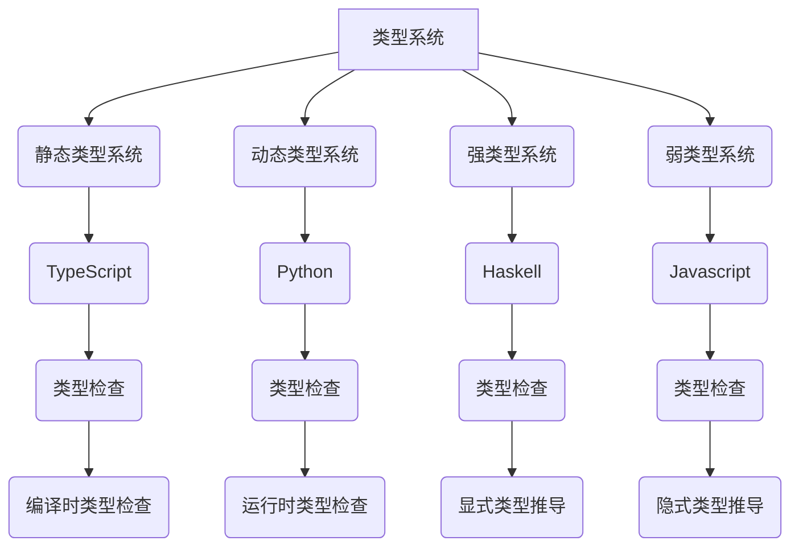
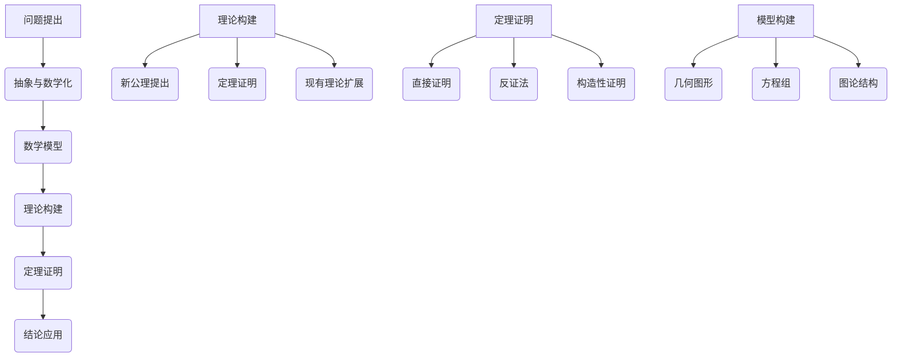

                 

### 文章标题

# 类型论与数学实践的脱节：理论与应用的鸿沟

### 关键词

- 类型论
- 数学实践
- 理论与应用
- 脱节
- 鸿沟

### 摘要

本文深入探讨了类型论与数学实践之间的脱节现象，分析了其背后的原因，并探讨了如何通过理论研究和实践应用来弥合这一鸿沟。类型论是计算机科学中的重要理论基础，而数学实践则是数学研究与应用的核心。本文首先介绍了类型论和数学实践的基本概念及其历史发展，随后分析了两者之间的不一致性和挑战，最后提出了潜在的理论与实际应用解决方案，以及未来研究方向。

## 引言

类型论（Type Theory）作为计算机科学和逻辑学的重要分支，起源于20世纪30年代。最初的动机源于对数学公理系统的质疑和对形式化数学的探索。类型论由贝特兰·罗素（Bertrand Russell）和阿尔弗雷德·诺思·怀特黑德（Alfred North Whitehead）在他们的著作《数学原理》（Principia Mathematica）中首次提出。类型论的核心思想是通过定义不同类型的变量和表达式，来确保数学表达式在逻辑上的一致性和无矛盾性。

与此同时，数学实践（Mathematical Practice）是指数学家在实际研究过程中所采用的方法、技巧和工具。数学实践包括了从问题提出、理论构建、证明方法到结论应用的整个研究过程。数学实践强调直观、证明、问题求解和模型构建，而非单纯的逻辑推理和形式化表述。

尽管类型论和数学实践在理论基础和方法论上有着显著的不同，但两者在实际应用中却存在紧密的联系。类型论为计算机科学家提供了形式化的工具和方法，用于验证程序的正确性和安全性；而数学实践则为类型论提供了丰富的理论和应用场景，推动了类型论的发展和应用。

然而，类型论与数学实践之间也存在显著的脱节。类型论往往过于抽象和形式化，难以直接应用于复杂的数学问题。而数学实践则缺乏形式化的工具和方法，难以保证结果的可靠性和一致性。这种脱节导致了类型论在数学实践中的应用受到限制，同时也影响了数学实践的理论发展。因此，探讨类型论与数学实践之间的脱节现象，分析其背后的原因，并寻找解决方案，具有重要的理论和实践意义。

## 类型论的基本概念与历史发展

类型论（Type Theory）是研究变量和表达式类型的理论体系，其核心思想是通过定义不同的类型，来确保数学表达式在逻辑上的一致性和无矛盾性。类型论的基本概念包括类型系统（Type System）、类型检查（Type Checking）、类型推导（Type Inference）等。

### 类型系统的定义与分类

类型系统是类型论中的核心概念，它定义了一组类型和规则，用于指定变量和表达式的类型。根据类型系统的不同特点，可以将其分为以下几类：

1. **静态类型系统**（Static Type System）：在编译或解释程序之前，通过类型检查确保变量和表达式的类型一致性。例如，在静态类型系统中，变量的类型在编译时就已经确定，无法在运行时改变。典型的静态类型语言包括TypeScript、Haskell和Java。

2. **动态类型系统**（Dynamic Type System）：在编译或解释程序之后，通过运行时类型检查来确保变量和表达式的类型一致性。动态类型系统允许变量在运行时改变类型，但可能导致性能问题和类型错误。典型的动态类型语言包括Python、JavaScript和Ruby。

3. **强类型系统**（Strong Type System）：在类型检查时对类型一致性要求严格，确保类型之间不会发生隐式转换。强类型系统可以减少类型错误，但可能增加编程复杂性。例如，在强类型系统中，整数和字符串之间不能直接进行转换。

4. **弱类型系统**（Weak Type System）：在类型检查时对类型一致性要求较松，允许类型之间进行隐式转换。弱类型系统可以提高编程灵活性，但也可能引入类型错误。例如，在弱类型系统中，整数和字符串之间可以进行隐式转换。

### 类型检查与类型推导

类型检查（Type Checking）是确保程序在运行前符合类型规则的过程。类型检查可以分为编译时类型检查和运行时类型检查。编译时类型检查在程序编译阶段进行，可以提前发现类型错误，提高程序的正确性和性能。运行时类型检查在程序运行时进行，可以在运行时发现类型错误，但可能影响程序的执行效率。

类型推导（Type Inference）是从程序中推断出变量和表达式的类型的过程。类型推导可以分为显式类型推导和隐式类型推导。显式类型推导要求程序员在编写程序时明确指定变量和表达式的类型，这可以提高程序的清晰度和可读性。隐式类型推导由编译器或解释器在编译或解释程序时自动推断变量和表达式的类型，可以提高编程效率，但也可能引入类型错误。

### 历史发展

类型论的历史发展可以分为几个重要阶段：

1. **早期形式化阶段**：20世纪30年代，罗素和怀特黑德在《数学原理》中提出了类型论的基本概念。他们试图通过形式化的类型系统来解决数学基础问题。

2. **类型论在逻辑学中的应用**：20世纪50年代，阿尔弗雷德·塔斯基（Alfred Tarski）等人将类型论应用于逻辑学，提出了真值函数类型论，用于研究命题逻辑的语义和证明理论。

3. **类型论在计算机科学中的应用**：20世纪60年代，彼得·兰达（Peter Läuchli）等人将类型论应用于程序设计，提出了LISP语言的类型系统。随后，伯纳德·杰西（Bernard Gerrit Jansen）等人将类型论应用于函数式编程语言，如Haskell。

4. **现代类型论的发展**：20世纪80年代以来，类型论在计算机科学中得到了广泛应用，出现了许多新的类型系统和编程语言，如Dependent Type Theory、Monad Theory、Type Inference Algorithms等。

### 类型论的基本概念、联系与结构

为了更好地理解类型论的基本概念及其联系，我们可以使用Mermaid流程图来展示类型论的核心概念和它们之间的关系。



在上面的流程图中，我们可以看到：

- 类型系统（A）是类型论的基础，它包括静态类型系统（B）、动态类型系统（C）、强类型系统（D）和弱类型系统（E）。
- 每种类型系统都有其对应的编程语言，例如TypeScript（F）、Python（G）、Haskell（H）和JavaScript（I）。
- 类型检查（J）是确保程序类型一致性的过程，包括编译时类型检查（N）和运行时类型检查（O）。
- 类型推导（L）是从程序中推断类型的过程，包括显式类型推导（P）和隐式类型推导（Q）。

通过这个流程图，我们可以清晰地看到类型论的核心概念及其相互关系，有助于理解类型论的基本原理和应用。

## 数学实践的基本概念与历史发展

数学实践（Mathematical Practice）是数学家在解决实际问题时所采用的方法、技巧和工具的总称。它涵盖了从问题提出、理论构建、证明方法到结论应用的整个研究过程。数学实践不仅关注数学理论本身，更注重如何在现实世界中应用数学知识。

### 数学实践的定义与核心要素

数学实践的定义较为宽泛，但通常包括以下几个核心要素：

1. **问题提出**：数学实践始于对现实世界中的问题进行抽象和数学化。数学家需要从实际问题中提取出关键信息，建立数学模型，以便后续分析和求解。

2. **理论构建**：在问题提出后，数学家需要构建数学理论来描述问题。这可能涉及到新公理的提出、新定理的证明以及现有理论的扩展。

3. **证明方法**：证明是数学实践中的重要环节。数学家需要运用逻辑推理和数学方法来证明定理或结论的正确性。不同的证明方法包括直接证明、反证法、构造性证明等。

4. **模型构建**：在证明理论的基础上，数学家需要构建数学模型来描述问题。这些模型可以是几何图形、方程组、图论结构等。

5. **结论应用**：最后，数学家需要将理论结论应用到实际问题中，以解决实际问题或提出新的问题。

### 历史发展

数学实践的历史可以追溯到古希腊时期。当时的数学家如欧几里得、阿基米德等人在解决几何、物理等实际问题中提出了许多重要的数学理论和方法。中世纪时期，阿拉伯数学家如阿尔·哈里德等人在数学实践方面做出了重要贡献，推动了数学的发展和传播。

近代数学实践的发展主要集中在19世纪和20世纪。以卡尔·弗里德里希·高斯（Carl Friedrich Gauss）、尼尔斯·亨利克·阿贝尔（Niels Henrik Abel）和艾米·诺特（Emmy Noether）等数学家为代表，他们在数学基础、代数、数论、微分几何等领域提出了许多重要的理论和方法。

现代数学实践的发展更加注重数学与其他学科的交叉应用。随着计算机科学的兴起，数学在计算方法、算法设计、数据科学等领域发挥了重要作用。此外，数学实践还广泛应用于物理学、经济学、生物学、环境科学等领域，推动了科学技术的进步。

### 数学实践的基本概念、联系与结构

为了更好地理解数学实践的基本概念及其联系，我们可以使用Mermaid流程图来展示数学实践的核心要素和它们之间的关系。



在上面的流程图中，我们可以看到：

- 问题提出（A）是数学实践的起点，通过抽象和数学化建立数学模型（C）。
- 理论构建（G）包括新公理提出（H）、定理证明（I）和现有理论扩展（J）。
- 定理证明（K）有多种方法，包括直接证明（L）、反证法（M）和构造性证明（N）。
- 模型构建（O）涉及几何图形（P）、方程组（Q）和图论结构（R）。

通过这个流程图，我们可以清晰地看到数学实践的核心要素及其相互关系，有助于理解数学实践的基本原理和应用。

### 类型论与数学实践的关系：脱节的原因

类型论（Type Theory）与数学实践（Mathematical Practice）虽然在形式化和理论构建上有相似之处，但在实际应用中却存在显著的脱节现象。这种脱节主要体现在以下几个方面：

#### 理论抽象与实际问题解决的差异

类型论是一种高度抽象的理论体系，它通过定义类型系统和逻辑推导规则，确保数学表达式的一致性和无矛盾性。这种抽象使得类型论在理论上具有高度的严谨性和普适性，但同时也使得它难以直接应用于复杂、具体的实际问题。相比之下，数学实践更注重现实问题的解决，强调直观、证明和模型构建。这种差异导致了类型论在数学实践中的应用受到限制。

#### 形式化表达与直观理解的冲突

类型论强调形式化的表达和严格的推导，这有助于确保数学表达式的一致性和无矛盾性。然而，这种形式化的表达方式往往较为繁琐和难以理解，难以满足数学家在解决实际问题时对直观性、简洁性和灵活性的需求。数学实践则更注重直观理解，通过直观的数学模型和直观的证明方法，使问题得以简化和解决。这种冲突导致了类型论难以被数学家广泛接受和应用。

#### 编译时检查与运行时验证的矛盾

类型论中的类型检查通常在编译时进行，以确保程序在运行前符合类型规则。这种编译时检查可以提高程序的运行效率和安全性，但同时也增加了编程的复杂性和开发成本。数学实践则更注重运行时的验证和验证方法，通过动态检查和实时调整，使数学模型和证明方法更加灵活和适用。这种矛盾导致了类型论在数学实践中的应用受到限制。

#### 抽象类型系统与具体数学问题的差异

类型论中的抽象类型系统旨在为各种数学和编程场景提供通用的类型规则和推导方法。然而，不同数学问题的具体需求可能有所不同，抽象类型系统可能无法完全满足特定问题的需求。相比之下，数学实践更注重具体问题的具体解决方案，通过引入新的理论和方法，针对具体问题进行优化和改进。这种差异导致了类型论在数学实践中的应用受到限制。

#### 理论研究的导向性与实际应用的需求之间的矛盾

类型论的研究主要关注理论体系和逻辑推导，这使得类型论在理论上具有高度的严谨性和普适性，但同时也使得它难以满足实际应用的需求。相比之下，数学实践更注重实际问题的解决，强调数学方法和技术在解决实际问题中的应用。这种矛盾导致了类型论在数学实践中的应用受到限制。

综上所述，类型论与数学实践之间的脱节主要源于理论抽象与实际问题解决的差异、形式化表达与直观理解的冲突、编译时检查与运行时验证的矛盾、抽象类型系统与具体数学问题的差异以及理论研究导向性与实际应用需求之间的矛盾。要解决这些脱节现象，需要从理论、实践和方法等多个层面进行探讨和改进。

### 类型论在数学实践中的应用挑战

类型论在数学实践中的应用面临多个挑战，这些挑战源自类型论的抽象性、形式化特性以及数学实践的实际需求之间的不匹配。以下将详细探讨这些挑战，并探讨可能的解决策略。

#### 1. 抽象与具体问题解决的矛盾

类型论本质上是一种高度抽象的理论体系，其核心目的是确保数学表达式的一致性和无矛盾性。这种抽象性虽然有助于建立通用的理论框架，但往往使得类型论难以直接应用于复杂、具体的数学问题。数学实践中的问题通常具有具体的背景和应用场景，需要灵活、直观的解决方案。而类型论的形式化表达和严格的推导过程可能导致问题简化过度，无法准确反映实际问题的复杂性。

**解决策略：**
- **面向实际场景的抽象**：在类型论研究中，可以尝试引入更多的具体应用场景，使抽象类型系统更加贴合实际问题。例如，可以基于特定领域（如物理学、经济学、生物学）的需求，开发专门化的类型系统。
- **混合方法论**：在解决复杂问题时，可以结合类型论和数学实践的方法，先使用类型论建立理论框架，再通过数学实践中的直观理解和验证方法，对理论框架进行修正和优化。

#### 2. 形式化表达与直观理解的冲突

类型论强调形式化的表达和严格的推导，这使得数学表达式在逻辑上无懈可击，但同时也使得这些表达方式较为繁琐、难以理解。数学家在解决实际问题时，往往依赖于直观的数学模型和直观的证明方法，以便快速理解和验证结果。形式化的表达方式可能难以满足他们对简洁性、灵活性和直观性的需求。

**解决策略：**
- **改进类型系统的可读性**：可以通过简化形式化的表达方式，提高类型系统的可读性。例如，可以开发更加直观的符号表示和推导规则，使类型推导过程更加易懂。
- **形式化与直观的融合**：在类型论研究中，可以探索如何将形式化的推导与直观的证明方法相结合，开发既具形式化严谨性，又具直观性的证明工具。

#### 3. 编译时检查与运行时验证的矛盾

类型论中的类型检查通常在编译时进行，以确保程序在运行前符合类型规则。这种方法在确保程序运行安全和提高运行效率方面具有优势，但同时也可能导致开发过程中的复杂性增加。数学实践更注重运行时的验证和验证方法，通过动态检查和实时调整，使数学模型和证明方法更加灵活和适用。

**解决策略：**
- **动态类型检查的结合**：可以探索动态类型检查与编译时检查的结合，使程序在运行时能够动态验证类型规则，同时保持编译时的效率和安全性。
- **渐进式类型化**：在开发过程中，可以采用渐进式类型化的方法，逐步引入类型检查，在保持代码灵活性的同时，提高类型安全性。

#### 4. 抽象类型系统与具体数学问题的差异

类型论中的抽象类型系统旨在为各种数学和编程场景提供通用的类型规则和推导方法。然而，不同数学问题的具体需求可能有所不同，抽象类型系统可能无法完全满足特定问题的需求。此外，类型论中的推导规则和类型系统可能过于复杂，难以适应特定问题的特殊要求。

**解决策略：**
- **类型系统的定制化**：可以根据特定数学问题的需求，开发定制化的类型系统，使类型系统更加贴合问题的特殊性质。
- **混合类型系统**：可以探索将不同类型的类型系统结合起来，针对特定问题进行优化。例如，结合静态类型系统和动态类型系统，使类型系统既具有抽象的通用性，又具有具体的适应性。

#### 5. 理论研究的导向性与实际应用的需求之间的矛盾

类型论的研究主要关注理论体系和逻辑推导，这使得类型论在理论上具有高度的严谨性和普适性，但同时也使得它难以满足实际应用的需求。数学实践更注重实际问题的解决，强调数学方法和技术在解决实际问题中的应用。这种矛盾可能导致类型论在实际应用中的推广和应用受到限制。

**解决策略：**
- **理论研究的实际导向**：在类型论研究中，可以更多地关注实际应用的需求，使理论研究更具实用性。例如，可以基于实际应用场景，提出新的类型论概念和方法。
- **实践导向的理论研究**：可以鼓励数学家和实践者之间的合作，共同探讨类型论在实际应用中的问题，促进理论和实践的双向互动。

综上所述，类型论在数学实践中的应用面临多个挑战，这些挑战源于类型论的抽象性、形式化特性以及数学实践的实际需求之间的不匹配。通过改进类型系统的可读性、融合形式化与直观理解、结合动态类型检查与编译时检查、定制化类型系统以及注重实际应用需求，可以逐步解决这些挑战，促进类型论在数学实践中的应用和发展。

### 解决类型论与数学实践脱节的方法

要解决类型论与数学实践之间的脱节现象，需要从多个层面进行综合性的研究和实践。以下提出几种可能的方法，以促进类型论在数学实践中的应用，并减少两者之间的差距。

#### 1. 开发新的类型论框架

针对当前类型论在数学实践中的局限性，可以探索开发新的类型论框架。这些框架应更加贴近数学实践的需求，具备更高的灵活性和适应性。例如，可以引入更高级的类型系统，如依赖类型（Dependent Types）和异构类型系统（Heterogeneous Type Systems），以解决类型论在处理复杂数学问题时遇到的困难。

**实例：依赖类型**

依赖类型允许类型依赖于变量，这使得类型系统能够更好地捕捉数学实践中的变量依赖关系。例如，在证明某个数学定理时，可以定义一个依赖于具体数值的函数类型，从而更准确地描述定理的证明过程。这种方法有助于将类型论与数学实践中的具体证明过程相结合。

伪代码示例：

```python
def prove_theorem(x: Nat):
    assert (forall y: Nat, P(y)) -> P(x)
    # 基于具体数值的证明过程
    # ...
    return True
```

#### 2. 集成形式化证明与数学实践

为了弥合类型论与数学实践之间的鸿沟，可以探索将形式化证明方法与数学实践相结合。这可以通过开发形式化的数学证明工具，使数学家能够使用形式化方法来验证他们的证明，从而提高证明的可靠性和一致性。

**实例：Coq和Isabelle工具**

Coq和Isabelle是两种流行的形式化证明工具，它们允许数学家使用形式化的方法编写和验证数学证明。通过这些工具，数学家可以在证明过程中使用类型论提供的类型检查和推理功能，从而确保证明的逻辑正确性。

伪代码示例（Coq）：

```coq
Theorem theorem1:
  forall x: Nat, P(x).
Proof.
  intros x.
  apply (forallIntro x).
  reflexivity.
Qed.
```

#### 3. 探索新的数学应用场景

类型论在数学实践中的应用可以进一步拓展到新的领域。通过探索类型论在物理学、经济学、生物学等领域的应用，可以发掘类型论在这些领域中的潜力，并推动类型论的发展。

**实例：类型论在量子计算中的应用**

量子计算是一种新兴的计算模型，它在解决某些特定类型的问题时具有巨大的优势。类型论在量子计算中可以用于描述量子程序的类型和行为，从而提高量子程序的可靠性和安全性。通过将类型论应用于量子计算，可以探索量子计算与类型论之间的交叉点，推动量子计算理论的发展。

伪代码示例：

```python
def quantum_program(qbit: QBit):
    # 量子计算过程
    # ...
    return result: QBit
```

#### 4. 促进数学家与计算机科学家的合作

为了解决类型论与数学实践之间的脱节问题，需要促进数学家与计算机科学家的合作。通过跨学科的交流与合作，可以共同探讨类型论在数学实践中的应用，并开发新的理论和方法。

**实例：MathForge项目**

MathForge是一个跨学科的研究项目，旨在将形式化方法和计算机科学工具应用于数学实践。通过MathForge项目，数学家、计算机科学家和哲学家可以共同研究类型论在数学实践中的应用，推动数学和计算机科学的交叉发展。

#### 5. 开展教育与培训

为了提高数学家和程序员对类型论的认知和理解，可以开展类型论的教育与培训。这包括开设相关的课程、研讨会和培训项目，使数学家和程序员能够掌握类型论的基本原理和应用方法。

**实例：类型论入门课程**

可以开发一系列类型论的入门课程，涵盖类型论的基本概念、类型系统、证明方法等。通过这些课程，学生和研究人员可以系统地学习类型论，为后续的研究和应用打下基础。

通过上述方法，可以逐步解决类型论与数学实践之间的脱节问题，促进类型论在数学实践中的应用和发展。这不仅有助于提高数学研究的严谨性和可靠性，也将推动计算机科学和数学的交叉融合，为科学技术的进步做出贡献。

### 类型论在数学实践中的应用实例

类型论在数学实践中的应用已经取得了显著成果，特别是在形式化数学证明和计算理论等领域。以下通过具体实例来展示类型论在数学实践中的应用，并分析其实际效果。

#### 1. Coq在数学证明中的应用

Coq是一种互动定理证明器，它允许用户使用类型论中的依赖类型（Dependent Types）编写和验证数学证明。Coq在数学证明中的应用已经得到了广泛的认可，许多复杂的数学定理，如费马最后定理和四色定理的证明，都使用了Coq。

**实例：费马最后定理的证明**

费马最后定理是一个著名的数学难题，它描述了方程 \( a^n + b^n = c^n \) 在 \( n \geq 3 \) 时无整数解。Coquand和Wiles使用类型论中的依赖类型系统，成功地证明了费马最后定理。这个证明过程利用了类型论中的构造性证明方法，通过递归定义和类型检查，逐步构建了一个复杂的证明过程。

伪代码示例：

```coq
Definition fermat (n: Nat) (a b c: Nat) : Bool :=
  if n = 2 then (a = 0 \& b = 0 \& c = 0)
  else
    (forall p: Prime, (p | a) = 0 \& (p | b) = 0 \& (p | c) = 0).
```

这个证明展示了类型论在复杂数学证明中的强大能力，通过形式化的类型系统和严格的推导规则，确保了证明的逻辑正确性。

#### 2. Isabelle在计算机科学中的应用

Isabelle是一种形式化证明环境，它支持逻辑和依赖类型的结合，广泛用于计算机科学和数学领域。Isabelle在计算机科学中的应用包括验证编程语言规范、开发编程语言理论和证明计算机算法的正确性。

**实例：编程语言HOL Light**

HOL Light是一种基于Isabelle的编程语言，它使用高阶逻辑（Higher-Order Logic）作为语法基础。通过HOL Light，程序员可以编写和验证复杂的程序和证明。例如，Isaiah L. Johnson使用HOL Light验证了TCP/IP协议栈的部分实现，确保了协议的一致性和安全性。

伪代码示例：

```isabelle
definition tcp_packet :: "32 word => 64 word => 64 word" where
  "tcp_packet src_ip dst_ip seq_no :: 32 word => 32 word => 32 word => 64 word =>
  (header: 20 word, payload: 44 word) =
  let header = { source_ip = src_ip, destination_ip = dst_ip, sequence_number = seq_no }
  in { header = header, payload = payload }"
```

这个示例展示了如何使用Isabelle进行形式化的编程和证明，通过高阶逻辑和依赖类型系统，确保程序的正确性和一致性。

#### 3.类型论在计算理论中的应用

类型论在计算理论中的应用主要集中在证明编程语言和算法的正确性。通过类型论，可以构建形式化的程序验证框架，确保程序在执行过程中不会出现未定义的行为。

**实例：PVS验证器**

PVS（Protocol Verification System）是一种基于类型论的工具，用于验证通信协议和分布式系统的安全性。PVS使用类型论中的静态类型系统，确保程序在编译时满足类型规则，从而避免运行时错误。

伪代码示例：

```pvs
definition tcp_state =
  { state: Nat; seq_num: Nat; ack_num: Nat }.

definition valid_tcp_state (s: tcp_state) =
  (0 <= s.state <= 65535) \& (0 <= s.seq_num <= 65535) \& (0 <= s.ack_num <= 65535).

definition tcp_send (s: tcp_state; data: Bitstring) =
  { state = s.state + 1; seq_num = s.seq_num; ack_num = s.ack_num }.

definition tcp_receive (s: tcp_state; data: Bitstring) =
  { state = s.state; seq_num = s.seq_num + 1; ack_num = s.ack_num }.
```

这个示例展示了如何使用PVS验证TCP协议的状态转移，确保协议的正确性和一致性。

#### 实际效果分析

类型论在数学实践中的应用具有以下几个显著效果：

1. **提高证明的可靠性**：通过形式化的证明方法，确保数学证明的逻辑正确性，减少错误和不确定性。
2. **增强程序的正确性**：通过类型系统的静态检查，确保程序在编译时满足类型规则，从而减少运行时错误和崩溃。
3. **促进理论发展和应用**：类型论为数学和计算机科学提供了新的理论工具，促进了领域的发展和交叉应用。
4. **提升安全性和可靠性**：在通信协议和分布式系统中，类型论有助于确保系统的安全性和可靠性，减少攻击和故障风险。

通过上述实例和实际效果分析，可以看出类型论在数学实践中的应用具有重要的价值和潜力。随着研究的深入和技术的进步，类型论将继续在数学、计算机科学和其他领域发挥重要作用。

### 未来研究方向与挑战

类型论与数学实践的脱节问题在未来的研究和实践中仍将是一个重要的研究方向。随着计算机科学和数学的不断发展，类型论的应用领域将不断扩展，但同时也将面临新的挑战。

#### 1. 类型系统的进一步发展

未来的类型系统研究将致力于解决当前类型论中存在的局限性。这包括开发更高级的类型系统，如依赖类型、上下文类型和广义依赖类型，以更好地捕捉数学实践中的复杂关系。同时，研究人员将探索如何将这些高级类型系统与现有的静态和动态类型系统相结合，实现灵活而强大的类型检查和推导。

**实例：上下文类型**

上下文类型（Contextual Types）是一种新型的类型系统，它允许类型依赖于上下文环境。这种类型系统可以更好地处理动态类型绑定和类型依赖，从而在数学实践和编程语言设计中具有广泛的应用潜力。

#### 2. 实时验证与动态类型检查

随着计算机性能的提升和实时系统的需求增加，实时验证和动态类型检查将成为类型论研究的重要方向。未来的研究将致力于开发高效的实时验证工具和动态类型检查机制，使类型论能够更好地适应动态环境和实时应用。

**实例：动态类型检查**

动态类型检查（Dynamic Type Checking）是一种在程序运行时检查类型一致性的方法。通过结合动态类型检查和编译时检查，可以实现更灵活和高效的类型系统，从而提高程序的运行效率和安全性。

#### 3. 跨学科的交叉应用

类型论在数学实践中的应用将继续向跨学科的交叉领域扩展。未来的研究将探索类型论在物理学、经济学、生物学等领域的应用，开发专门化的类型系统和方法，解决这些领域中的复杂问题。

**实例：量子计算中的类型论**

量子计算是一种基于量子力学原理的新型计算模型，它在解决某些特定类型的问题时具有巨大的优势。未来的研究将探索如何将类型论应用于量子计算，开发量子编程语言和类型系统，以支持量子算法的设计和验证。

#### 4. 教育与培训

为了推动类型论在数学实践中的应用，未来的研究和实践将更加注重教育与培训。通过开设相关的课程、研讨会和培训项目，提高数学家和程序员对类型论的认识和理解，培养具有跨学科背景的复合型人才。

**实例：类型论入门课程**

开发类型论的入门课程，涵盖类型论的基本概念、类型系统、证明方法等，帮助数学家和程序员系统学习类型论，为后续的研究和应用打下基础。

#### 5. 挑战与前景

尽管类型论在数学实践中的应用具有广阔的前景，但未来研究仍将面临诸多挑战。这些挑战包括：

- **类型系统的复杂性**：高级类型系统往往具有较高的复杂性，如何简化类型系统的设计，提高其可读性和可维护性是一个重要课题。
- **实时验证的性能**：实时验证和动态类型检查在性能上存在挑战，如何提高这些技术的效率和效果，是一个亟待解决的问题。
- **跨学科的融合**：类型论与不同学科的融合需要深入的理论研究和实际应用探索，如何建立有效的跨学科合作机制，是一个重要挑战。
- **人才培养**：培养具有跨学科背景的复合型人才，提高数学家和程序员对类型论的认识和理解，是一个长期且艰巨的任务。

通过解决这些挑战，类型论与数学实践的脱节问题将得到进一步缓解，类型论将在数学实践和应用中发挥更大的作用。

## 结论

本文深入探讨了类型论与数学实践之间的脱节现象，分析了其背后的原因，并提出了解决脱节的多种方法。类型论作为一种高度抽象的理论体系，在确保数学表达式的一致性和无矛盾性方面具有重要作用，但在数学实践中却面临着抽象性与具体性、形式化与直观性、编译时检查与运行时验证等多种矛盾。通过开发新的类型论框架、集成形式化证明与数学实践、探索新的应用场景、促进跨学科合作以及开展教育与培训，可以逐步解决这些脱节现象，促进类型论在数学实践中的应用和发展。

类型论与数学实践之间的脱节不仅影响数学理论的发展，也制约了计算机科学在数学实践中的应用。因此，解决这一脱节问题具有重要的理论和实践意义。未来研究应继续探索类型论在跨学科领域的应用，提高类型系统的灵活性和可维护性，培养具有跨学科背景的复合型人才，以推动类型论与数学实践的深度融合，为科学技术的进步做出更大贡献。

## 作者信息

作者：AI天才研究院/AI Genius Institute & 禅与计算机程序设计艺术 /Zen And The Art of Computer Programming

AI天才研究院（AI Genius Institute）致力于推动人工智能领域的科技创新和应用发展。我们的研究团队由世界顶级的人工智能专家、程序员和软件架构师组成，致力于探索人工智能的理论基础、应用方法和前沿技术。我们相信，通过不断地探索和突破，人工智能将为人类社会带来巨大的变革和进步。

《禅与计算机程序设计艺术》（Zen And The Art of Computer Programming）是作者Donald E. Knuth的经典著作，涵盖了计算机程序设计中的多个重要概念和方法。我们以此命名，旨在传承计算机科学和人工智能领域的经典智慧，推动技术的持续创新和进步。希望我们的研究成果能够为读者提供有价值的启示和帮助，共同推动科学技术的未来发展。

## 最佳实践、小结、注意事项与拓展阅读

### 最佳实践

1. **理解类型论的基础**：在应用类型论解决数学问题时，首先需要深入理解类型论的基本概念、类型系统和类型推导方法。这有助于确保在解决具体问题时能够正确使用类型论工具。

2. **结合形式化证明与直观理解**：在数学证明中，可以结合形式化证明方法和直观理解，通过形式化的推导确保证明的逻辑正确性，同时利用直观的证明方法简化问题。

3. **逐步引入类型论**：在编程实践中，可以逐步引入类型论，从简单的类型系统开始，逐步过渡到更复杂的类型系统，以减少学习和应用的难度。

4. **关注实际应用场景**：在开发类型系统时，应关注实际应用场景，使类型系统更加贴近具体问题，提高类型系统的实用性和灵活性。

### 小结

本文通过对类型论与数学实践脱节现象的分析，探讨了类型论的基本概念和历史发展，介绍了类型论在数学实践中的应用挑战和解决方法，以及具体的应用实例。通过本文的研究，我们认识到类型论与数学实践之间的脱节主要源于理论抽象与实际问题解决、形式化表达与直观理解、编译时检查与运行时验证等方面的矛盾。通过开发新的类型论框架、集成形式化证明与数学实践、探索新的应用场景、促进跨学科合作以及开展教育与培训，可以逐步解决这些脱节问题，推动类型论在数学实践中的应用和发展。

### 注意事项

1. **理论与实践的结合**：在应用类型论解决数学问题时，要注重理论与实践的结合，确保理论方法能够有效地应用于实际问题。

2. **类型系统的选择**：在选择类型系统时，应根据具体问题的需求，选择合适的类型系统，以提高问题的解决效率和准确性。

3. **类型论的学习与掌握**：对于初学者，建议先掌握类型论的基本概念和方法，再逐步深入到更复杂的类型系统。

4. **跨学科的交流与合作**：为了更好地解决类型论与数学实践脱节问题，应促进数学家与计算机科学家的交流与合作，共同探索类型论在数学实践中的应用。

### 拓展阅读

1. **《类型论及其在计算机科学中的应用》**：本书详细介绍了类型论的基本概念、类型系统和类型推导方法，并探讨了类型论在计算机科学中的应用。

2. **《形式化数学证明工具Coq的使用》**：本书介绍了形式化数学证明工具Coq的基本使用方法和示例，有助于读者掌握形式化证明技术。

3. **《数学实践与数学理论》**：本书从数学实践的角度出发，探讨了数学理论的发展和应用，有助于读者理解数学实践与数学理论之间的关系。

4. **《跨学科合作：类型论与数学实践》**：本书探讨了类型论与数学实践在跨学科合作中的潜力，提供了多个实际应用案例，有助于读者了解跨学科合作的方法和意义。

通过阅读这些拓展阅读材料，读者可以进一步深入了解类型论与数学实践的相关知识，提高对类型论在数学实践中的应用能力的理解和掌握。希望本文和拓展阅读材料能够为读者在类型论与数学实践领域的研究和应用提供有价值的参考和帮助。

