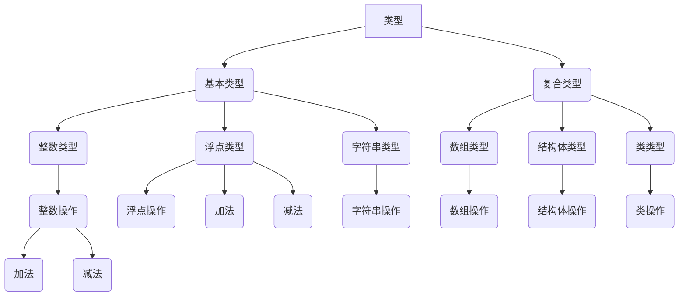

                 


## 文章标题：类型论与数学美学：形式主义的代价

### 关键词：类型论、数学美学、形式主义、编程语言、数学证明、数学教育

### 摘要：

本文旨在探讨类型论与数学美学的关系，并深入分析形式主义在数学领域中的影响和代价。类型论作为数学研究的重要工具，不仅在理论上具有重要意义，还在编程语言设计、数学证明和数学教育中发挥了关键作用。然而，形式主义的过度追求可能导致理论与实际应用之间的脱节，限制数学的发展。本文将通过背景介绍、核心概念解析、数学模型阐释、算法原理讲解、项目实战分析以及最佳实践总结，逐步揭示类型论与数学美学的内在联系，并探讨形式主义在数学领域中的利与弊。

## 第一部分：类型论的基本概念

### 1.1 类型论的起源与发展

#### 1.1.1 早期类型论的提出

类型论的起源可以追溯到20世纪初，当时哲学家和数学家们开始关注数学基础问题。逻辑原子主义和集合论是早期类型论提出的两个主要理论框架。

#### 1.1.1.1 逻辑原子主义

逻辑原子主义由罗素和怀特海德在《数学原理》中提出，主张数学可以通过逻辑和语言的基础元素来构建。这种观点强调了类型的重要性，认为不同的类型具有不同的属性和操作。

#### 1.1.1.2 集合论的基本概念

集合论是数学的另一个基础框架，由康托尔等人发展。集合论中的类型论主要关注个体（元素）和类型之间的关系。通过定义集合的类型，集合论为数学提供了一个统一的基础。

#### 1.1.2 类型论的现代发展

类型论在现代数学和计算机科学中得到了广泛应用。公理化方法和集合论中的类型论是现代类型论发展的两个重要方向。

#### 1.1.2.1 公理化方法

公理化方法通过定义一套基本原理和公理，构建起一个逻辑体系。类型论的公理化方法为数学证明和逻辑推理提供了坚实的理论基础。

#### 1.1.2.2 集合论中的类型

集合论中的类型论关注不同类型的集合之间的关系。通过定义类型层次和复合类型，集合论为数学提供了一个更丰富的类型系统。

### 1.2 类型论的基本概念

#### 1.2.1 类型和个体

类型是类型论中的核心概念，表示具有共同属性的对象集合。个体是类型中的具体对象，具有特定的类型属性。

#### 1.2.1.1 类型的定义

类型是具有相同属性的对象集合。例如，整数类型包括所有的整数对象，字符串类型包括所有的字符串对象。

#### 1.2.1.2 个体与类型的关系

个体是类型中的具体对象，每个个体都具有特定的类型属性。例如，数字3是整数类型中的一个个体，字符串"hello"是字符串类型中的一个个体。

#### 1.2.2 类型层次

类型层次是类型论中的重要概念，表示不同类型之间的关系。基本类型是类型层次的基础，复合类型是通过基本类型组合而成的。

#### 1.2.2.1 基本类型

基本类型是类型层次中的基础类型，例如整数、浮点数、字符串等。基本类型具有固定的属性和操作。

#### 1.2.2.2 复合类型

复合类型是通过基本类型组合而成的类型。例如，数组类型是由整数类型和字符串类型组合而成的复合类型。

#### 1.2.3 类型判定

类型判定是类型论中的关键问题，指如何确定一个对象所属的类型。

#### 1.2.3.1 类型判定函数

类型判定函数是一种用于确定对象类型的函数。例如，在编程语言中，类型判定函数可以用于检查变量的类型。

#### 1.2.3.2 类型判定规则

类型判定规则是一组用于确定对象类型的规则。类型判定规则通常基于类型层次和类型组合的概念。

### 1.3 类型论与数学的关系

#### 1.3.1 数学中的类型论

数学中的类型论关注不同类型的数学对象之间的关系。类型论为数学提供了一个统一的基础，使得不同类型的数学对象可以相互比较和操作。

#### 1.3.1.1 数学中的基本类型

数学中的基本类型包括整数、分数、小数、复数等。基本类型是数学中的基础元素，用于表示数学中的各种对象。

#### 1.3.1.2 数学中的复合类型

数学中的复合类型包括向量、矩阵、函数等。复合类型是通过基本类型的组合和操作得到的。

#### 1.3.2 类型论对数学的贡献

类型论对数学的贡献主要体现在以下几个方面：

1. **统一数学对象**：类型论为不同类型的数学对象提供了一个统一的基础，使得数学中的对象可以相互比较和操作。

2. **简化数学证明**：类型论提供了简化和规范化的数学证明方法，使得数学证明更加简洁和高效。

3. **促进数学研究**：类型论为数学研究提供了新的工具和方法，推动了数学领域的不断发展。

### 1.4 类型论的数学模型

#### 1.4.1 类型论的公理系统

类型论的公理系统是一组基本原理和公理，用于定义和描述类型论的基本概念和性质。

#### 1.4.1.1 类型论的公理

类型论的公理包括基本类型的定义、类型层次的定义、类型组合的定义等。这些公理为类型论提供了一个逻辑基础。

#### 1.4.1.2 类型论的基本定理

类型论的基本定理包括类型判定定理、类型组合定理等。这些定理描述了类型论的基本性质和关系。

#### 1.4.2 类型论的应用

类型论在数学和计算机科学中有着广泛的应用。

#### 1.4.2.1 类型论与编程语言

类型论在编程语言设计中起到了关键作用。通过类型论，编程语言可以提供更丰富的类型系统和类型检查机制。

#### 1.4.2.2 类型论与形式化验证

类型论在形式化验证中也有重要应用。通过类型论，可以构建形式化的数学模型，用于验证计算机程序的正确性。

### 1.5 类型论的美学价值

#### 1.5.1 数学美学的概念

数学美学是数学研究中的一个重要领域，关注数学中的美学元素和美学价值。

#### 1.5.1.1 美与和谐

数学美学认为美与和谐是数学的重要特征。数学中的对称性、简洁性和统一性被视为美的体现。

#### 1.5.1.2 数学中的美学元素

数学中的美学元素包括对称性、简洁性、统一性和协调性等。这些元素构成了数学美的核心。

#### 1.5.2 类型论与数学美学

类型论与数学美学有着密切的联系。类型论通过类型层次和类型组合，为数学提供了一个统一的基础，使得不同类型的数学对象可以相互比较和操作，从而实现了数学的统一和谐。

#### 1.5.2.1 类型论的美学意义

类型论的美学意义主要体现在以下几个方面：

1. **统一数学对象**：类型论为不同类型的数学对象提供了一个统一的基础，使得数学中的对象可以相互比较和操作，从而实现了数学的统一和谐。

2. **简化数学证明**：类型论提供了简化和规范化的数学证明方法，使得数学证明更加简洁和高效，从而体现了数学的简洁性。

3. **促进数学研究**：类型论为数学研究提供了新的工具和方法，推动了数学领域的不断发展，从而体现了数学的协调性和协调性。

#### 1.5.2.2 数学美学对类型论的影响

数学美学对类型论的影响主要体现在以下几个方面：

1. **指导类型论的发展**：数学美学为类型论的发展提供了指导思想，使得类型论在追求统一和谐的同时，也能够保持简洁性和协调性。

2. **丰富类型论的内容**：数学美学为类型论引入了新的概念和元素，使得类型论的内容更加丰富和多样化。

3. **促进数学与美学的结合**：数学美学和类型论的结合，促进了数学与美学之间的交叉融合，推动了数学美学的不断发展。

### 1.6 形式主义的定义

形式主义是数学研究中的一种方法论，强调数学证明的严谨性和逻辑性。形式主义主张通过形式化的方法进行数学证明，以确保数学结论的准确性和可靠性。

#### 1.6.1.1 形式主义的基本特征

形式主义的基本特征包括：

1. **形式化**：形式主义通过定义一套严格的符号和规则，将数学证明转化为形式化的过程。

2. **逻辑性**：形式主义强调数学证明的逻辑性，要求证明过程严格遵循逻辑规则。

3. **抽象性**：形式主义通过抽象化的方法，将数学问题转化为形式化的符号系统，从而简化了数学证明的过程。

#### 1.6.1.2 形式主义在数学中的体现

形式主义在数学中的体现包括：

1. **形式化证明**：形式化证明是一种通过形式化的方法进行数学证明的过程，确保证明过程的严谨性和逻辑性。

2. **形式化理论**：形式化理论是一种通过形式化方法建立的数学理论体系，用于研究数学问题的形式化表示和形式化证明。

### 1.6.2 形式主义的代价

形式主义在数学领域中的广泛应用带来了许多优点，但同时也存在一些代价。

#### 1.6.2.1 形式主义对数学发展的限制

形式主义对数学发展的限制主要体现在以下几个方面：

1. **抽象化过度**：形式主义强调抽象化，有时会导致数学问题过度抽象，难以与实际问题联系起来。

2. **证明复杂度增加**：形式化证明过程通常比较复杂，需要大量的符号和规则，使得数学证明过程变得更加繁琐。

3. **理论与实际应用脱节**：形式主义过于强调形式化的逻辑性，可能导致数学理论与实际应用之间的脱节。

#### 1.6.2.2 形式主义在数学教育中的应用问题

形式主义在数学教育中的应用也带来了一些问题：

1. **学习难度增加**：形式化证明过程需要学生具备较高的逻辑思维能力和符号运用能力，导致学习难度增加。

2. **缺乏直观性**：形式化证明过程通常缺乏直观性，难以让学生直观地理解数学问题的本质。

3. **教学资源不足**：形式化证明需要大量的教学资源和教材，导致教学资源分配不均。

## 第二部分：形式主义的批判与反思

### 2.1 形式主义的理论批判

形式主义在数学领域中有着广泛的应用，但同时也受到了一些理论批判。这些批判主要针对形式主义的局限性、优点和不足，以及形式主义在数学哲学中的地位。

#### 2.1.1 形式主义的局限性

形式主义在数学研究中具有一定的局限性，主要体现在以下几个方面：

1. **过于强调逻辑性**：形式主义强调数学证明的逻辑性，有时会导致对数学问题的过度抽象，难以与实际问题联系起来。

2. **缺乏直观性**：形式化证明过程通常缺乏直观性，难以让学生直观地理解数学问题的本质。

3. **证明复杂度增加**：形式化证明过程需要大量的符号和规则，使得数学证明过程变得更加繁琐。

#### 2.1.2 形式主义的优点与不足

形式主义在数学研究中具有一定的优点，但同时也存在一些不足：

优点：

1. **提高证明的严谨性**：形式主义通过严格的形式化方法，提高了数学证明的严谨性和可靠性。

2. **简化数学证明**：形式化方法可以简化数学证明的过程，使得证明更加简洁和高效。

3. **促进数学发展**：形式主义为数学研究提供了新的工具和方法，推动了数学领域的不断发展。

不足：

1. **抽象化过度**：形式主义有时会导致数学问题过度抽象，难以与实际问题联系起来。

2. **缺乏直观性**：形式化证明过程通常缺乏直观性，难以让学生直观地理解数学问题的本质。

3. **证明复杂度增加**：形式化证明过程需要大量的符号和规则，使得数学证明过程变得更加繁琐。

#### 2.1.3 形式主义的批判性分析

形式主义的批判性分析主要包括以下几个方面：

1. **逻辑缺陷**：形式主义在逻辑上存在一些缺陷，例如形式化证明过程中可能存在逻辑漏洞。

2. **数学哲学中的地位**：形式主义在数学哲学中的地位也受到了一些质疑，例如形式主义是否能够真正解决数学基础问题。

### 2.2 形式主义在数学中的应用与挑战

形式主义在数学领域中的应用广泛，包括数学证明、数学难题解决和数学教育等方面。然而，形式主义在应用中也面临一些挑战。

#### 2.2.1 形式主义与数学证明

形式主义在数学证明中发挥着重要作用，主要体现在以下几个方面：

1. **提高证明的严谨性**：形式主义通过严格的形式化方法，提高了数学证明的严谨性和可靠性。

2. **简化证明过程**：形式化方法可以简化数学证明的过程，使得证明更加简洁和高效。

3. **促进数学发展**：形式主义为数学研究提供了新的工具和方法，推动了数学领域的不断发展。

然而，形式主义在数学证明中也面临一些挑战：

1. **证明复杂度增加**：形式化证明过程需要大量的符号和规则，使得数学证明过程变得更加繁琐。

2. **缺乏直观性**：形式化证明过程通常缺乏直观性，难以让学生直观地理解数学问题的本质。

#### 2.2.2 形式主义与数学难题

形式主义在数学难题解决中也发挥着重要作用，主要体现在以下几个方面：

1. **简化问题求解**：形式化方法可以简化数学难题的求解过程，使得问题更加直观和易于处理。

2. **提供新的求解方法**：形式主义为数学难题解决提供了新的工具和方法，推动了数学难题的解决。

然而，形式主义在数学难题解决中也面临一些挑战：

1. **证明复杂度增加**：形式化方法可能使得数学难题的求解过程变得更加复杂。

2. **缺乏直观性**：形式化方法可能难以让学生直观地理解数学难题的本质。

#### 2.2.3 形式主义与数学教育

形式主义在数学教育中的应用主要体现在以下几个方面：

1. **提高证明能力**：形式主义通过严格的形式化方法，提高了学生的证明能力。

2. **培养逻辑思维能力**：形式主义强调逻辑性，有助于培养学生的逻辑思维能力。

3. **促进数学学习**：形式主义为数学学习提供了新的方法和工具，促进了数学学习。

然而，形式主义在数学教育中也面临一些挑战：

1. **学习难度增加**：形式化方法需要学生具备较高的逻辑思维能力和符号运用能力，导致学习难度增加。

2. **缺乏直观性**：形式化方法可能难以让学生直观地理解数学问题的本质。

### 2.3 形式主义的社会影响与伦理考量

形式主义不仅对数学发展产生了影响，还对社会产生了广泛的影响，包括科学研究的推动、技术应用的影响以及伦理考量等方面。

#### 2.3.1 形式主义对数学研究的推动作用

形式主义在数学研究中起到了重要的推动作用，主要体现在以下几个方面：

1. **提高研究的严谨性**：形式主义通过严格的形式化方法，提高了数学研究的严谨性和可靠性。

2. **促进理论发展**：形式主义为数学理论发展提供了新的工具和方法，推动了数学理论的不断进步。

3. **推动数学应用**：形式主义在数学应用中起到了重要的推动作用，使得数学在科学、工程和计算机科学等领域得到广泛应用。

#### 2.3.2 形式主义对社会的影响

形式主义对社会的影响主要体现在以下几个方面：

1. **科学研究推动**：形式主义在科学研究中的广泛应用，推动了科学研究的不断进步，促进了科学技术的快速发展。

2. **技术应用影响**：形式主义在计算机科学、人工智能和信息技术等领域得到广泛应用，对社会产生了深远的影响。

3. **数学普及**：形式主义在数学教育中的应用，促进了数学的普及和推广，提高了公众的数学素养。

#### 2.3.3 形式主义的伦理考量

形式主义在伦理考量方面也具有重要意义，主要体现在以下几个方面：

1. **科学伦理**：形式主义在科学研究中的应用，要求科学家遵循严格的科学伦理，确保研究的严谨性和可靠性。

2. **数据安全**：形式主义在数据处理和信息安全领域，要求对数据的安全性和隐私保护给予高度重视。

3. **社会责任**：形式主义在技术应用中，要求技术人员承担社会责任，确保技术应用的公平性和公正性。

### 2.4 形式主义的未来发展趋势

形式主义在数学领域和社会中有着广泛的应用，未来发展趋势也备受关注。以下是对形式主义未来发展的几个可能趋势的探讨：

#### 2.4.1 形式主义在数学中的发展前景

形式主义在数学中的发展前景主要体现在以下几个方面：

1. **公理化方法的深化**：公理化方法作为形式主义的核心，未来将不断深化和发展，为数学研究提供更强大的工具和方法。

2. **形式化证明的发展**：形式化证明作为形式主义的重要应用，未来将不断发展，提高证明的效率和准确性。

3. **类型论的应用扩展**：类型论在数学中有着广泛的应用前景，未来将在更多领域得到扩展和应用。

#### 2.4.2 形式主义在数学教育中的未来影响

形式主义在数学教育中的未来影响主要体现在以下几个方面：

1. **教学方法的改进**：形式主义在数学教育中的应用，将促进教学方法的改进，提高数学教育的质量和效果。

2. **课程设置的变化**：形式主义在数学教育中的应用，将导致课程设置的变化，增加形式化方法和形式化证明的课程内容。

3. **教学资源的优化**：形式主义在数学教育中的应用，将推动教学资源的优化，提高教学资源的利用效率。

#### 2.4.3 形式主义在其他领域的发展

形式主义在计算机科学、人工智能、信息技术等领域也有广泛的应用前景，未来发展趋势包括：

1. **计算机科学中的形式化方法**：形式化方法在计算机科学中的应用将不断深化，提高软件质量和系统可靠性。

2. **人工智能中的形式化推理**：形式化推理在人工智能中的应用将得到推广，提高人工智能系统的推理能力和决策能力。

3. **信息技术中的形式化验证**：形式化验证在信息技术中的应用将得到广泛应用，提高信息系统的安全性和可靠性。

## 第三部分：类型论与数学美学的内在联系

### 3.1 类型论的美学意义

类型论在数学美学中具有重要的地位，其美学意义主要体现在以下几个方面：

1. **统一和谐**：类型论通过定义类型层次和类型组合，实现了数学对象之间的统一和谐。不同类型的数学对象可以在同一框架下相互比较和操作，从而实现了数学的统一和谐。

2. **简洁性**：类型论通过公理化和形式化方法，简化了数学证明和推理过程，使得数学表达更加简洁。简洁性是数学美学的重要特征，类型论在这方面发挥了重要作用。

3. **协调性**：类型论在数学中实现了不同类型对象之间的协调和统一。类型论的公理和定理为数学对象提供了一个协调的框架，使得数学理论更加协调和统一。

### 3.2 数学美学对类型论的影响

数学美学对类型论的影响主要体现在以下几个方面：

1. **指导类型论的发展**：数学美学为类型论的发展提供了指导思想。数学美学强调统一和谐、简洁性和协调性，这些理念对类型论的发展产生了重要影响。

2. **丰富类型论的内容**：数学美学为类型论引入了新的概念和元素。例如，数学中的对称性、简洁性和统一性等美学元素，为类型论提供了丰富的内容。

3. **促进数学与美学的结合**：数学美学和类型论的结合，促进了数学与美学之间的交叉融合。通过类型论，数学中的美学元素得到了更好的体现，推动了数学美学的不断发展。

### 3.3 类型论与数学美学的关系

类型论与数学美学之间存在密切的关系，这种关系体现在以下几个方面：

1. **理论基础**：类型论为数学美学提供了理论基础。类型论的公理、定理和类型层次等概念，为数学美学的探讨提供了逻辑基础。

2. **实践应用**：类型论在数学美学中的应用，使得数学中的美学元素得到了更好的体现。通过类型论，数学家可以更准确地描述和表达数学中的美学元素。

3. **相互促进**：类型论和数学美学相互促进，共同推动了数学的发展和进步。类型论为数学提供了新的工具和方法，使得数学研究更加深入和全面。而数学美学则为数学提供了美的视角，使得数学研究更加有趣和富有挑战性。

### 3.4 类型论与数学美学的案例分析

为了更直观地理解类型论与数学美学的关系，以下通过几个案例进行说明：

1. **欧拉公式**：欧拉公式 \(e^{i\pi} + 1 = 0\) 是数学中的一个著名公式，具有很高的美学价值。欧拉公式通过将数学中的基本类型（实数、虚数、指数函数等）有机地结合在一起，展现了数学的统一和谐。类型论可以用来分析欧拉公式的类型层次和类型组合，从而揭示其美学意义。

2. **对称性**：对称性是数学中的一个重要美学元素。类型论可以用来描述和分析对称性。例如，在群论中，对称群可以通过类型论的方法进行描述。类型论提供了对称性的形式化和逻辑框架，使得数学家可以更深入地探讨对称性的性质和特征。

3. **简洁性**：简洁性是数学美学的一个重要特征。类型论通过公理化和形式化方法，简化了数学证明和推理过程，使得数学表达更加简洁。例如，在几何学中，欧几里得几何的公理体系通过类型论的方法得到了简化和统一，使得几何学的研究更加简洁和高效。

通过以上案例分析，可以看出类型论与数学美学之间存在密切的关系。类型论不仅为数学提供了新的工具和方法，还促进了数学美学的探讨和发展。

## 第四部分：类型论在编程语言中的应用

### 4.1 类型论与编程语言的联系

类型论在编程语言中扮演着重要的角色，其与编程语言的联系主要体现在以下几个方面：

1. **类型系统的设计**：类型论为编程语言提供了类型系统的理论基础。通过类型论，编程语言可以定义不同类型的变量、函数和表达式，从而保证程序的正确性和安全性。

2. **类型检查**：类型论在编程语言中的应用，使得类型检查成为可能。类型检查是一种静态分析技术，通过检查程序中的类型信息，可以提前发现潜在的运行错误和逻辑错误。

3. **类型推导**：类型论在编程语言中的应用，使得类型推导成为可能。类型推导是一种自动推导程序中变量和表达式类型的技术，可以减少程序员的工作负担，提高程序的可读性和可维护性。

### 4.2 类型系统的基本概念

类型系统是编程语言中的一个核心概念，它定义了程序中变量的类型以及类型之间的关系。以下是一些类型系统中的基本概念：

1. **基本类型**：基本类型是编程语言中最基本的类型，例如整数、浮点数、字符串等。基本类型通常具有固定的属性和操作。

2. **复合类型**：复合类型是由基本类型组合而成的类型，例如数组、结构体、类等。复合类型可以包含多个基本类型或复合类型，从而实现更复杂的类型结构。

3. **函数类型**：函数类型是表示函数的类型，它定义了函数的参数类型和返回类型。函数类型在编程语言中用于表示过程和函数。

4. **类型检查**：类型检查是一种静态分析技术，用于检查程序中的类型信息。类型检查可以提前发现潜在的运行错误和逻辑错误，从而提高程序的正确性和安全性。

5. **类型推导**：类型推导是一种自动推导程序中变量和表达式类型的技术。通过类型推导，编程语言可以自动确定变量和表达式的类型，从而减少程序员的工作负担。

### 4.3 类型系统的应用

类型系统在编程语言中的应用非常广泛，以下是一些具体的例子：

1. **静态类型语言**：静态类型语言在编译时对程序进行类型检查，确保程序中的类型一致性。例如，Java、C#和C++等编程语言都是静态类型语言。

2. **动态类型语言**：动态类型语言在运行时对程序进行类型检查，允许更灵活的类型转换。例如，Python、JavaScript和Ruby等编程语言都是动态类型语言。

3. **类型安全**：类型系统可以提高程序的安全性，避免类型错误导致的运行时错误。例如，在静态类型语言中，变量必须在声明时指定类型，从而确保变量在使用时的类型一致性。

4. **性能优化**：类型系统可以提高程序的性能，因为编译器可以根据类型信息进行更高效的代码生成。例如，在静态类型语言中，编译器可以提前知道变量的类型，从而优化内存分配和计算过程。

### 4.4 类型论与编程语言的案例分析

以下通过几个案例来探讨类型论在编程语言中的应用：

1. **Java中的类型系统**：Java是一种静态类型语言，其类型系统基于类型论。Java中的基本类型包括整数、浮点数、字符串等。Java还支持复合类型，例如数组、类和接口等。Java的类型检查在编译时进行，确保程序中的类型一致性。

2. **Python中的动态类型**：Python是一种动态类型语言，其类型系统基于类型论。Python中的变量不需要在声明时指定类型，Python解释器在运行时对变量进行类型检查。Python的类型推导机制使得代码更加简洁和灵活。

3. **C++中的模板编程**：C++中的模板编程利用了类型论的概念。C++模板允许定义泛型类和函数，从而实现与类型论中复合类型和函数类型相似的功能。通过模板编程，C++程序可以处理不同类型的数据，提高了代码的复用性和灵活性。

通过以上案例分析，可以看出类型论在编程语言中的应用非常广泛，其不仅为编程语言提供了类型系统的理论基础，还提高了程序的正确性、安全性和性能。

## 第五部分：类型论在形式化验证中的应用

### 5.1 形式化验证的基本概念

形式化验证是一种通过数学方法对计算机程序和系统进行验证的技术。其核心思想是将程序和行为描述为数学模型，然后利用数学方法对模型进行验证，确保程序的正确性和安全性。

#### 5.1.1 形式化验证的定义

形式化验证是一种通过数学方法对计算机程序和系统进行验证的技术。其核心思想是将程序和行为描述为数学模型，然后利用数学方法对模型进行验证，确保程序的正确性和安全性。

#### 5.1.2 形式化验证的目标

形式化验证的目标是证明程序或系统的行为符合预定的规范或属性。通过形式化验证，可以确保程序的正确性、安全性和可靠性，避免潜在的运行错误和漏洞。

#### 5.1.3 形式化验证的过程

形式化验证的过程通常包括以下几个步骤：

1. **模型构建**：将程序或系统抽象为数学模型，通常使用形式化的语言或符号系统。

2. **规范定义**：定义程序的规范或属性，通常使用逻辑或数学公式表示。

3. **验证**：利用数学方法对模型进行验证，证明模型的行为符合规范。

4. **结果分析**：分析验证结果，确定程序或系统是否满足预期要求。

### 5.2 类型论在形式化验证中的应用

类型论在形式化验证中具有重要的应用，其通过定义类型层次和类型组合，为形式化验证提供了理论支持。

#### 5.2.1 类型论的基本概念

类型论是数学中的一个分支，主要研究类型和类型之间的关系。在形式化验证中，类型论可以用于定义程序中的变量、函数和表达式。

#### 5.2.2 类型层次

类型层次是类型论中的一个基本概念，用于描述不同类型之间的关系。在形式化验证中，类型层次可以帮助验证程序中的类型一致性。

#### 5.2.3 类型组合

类型组合是类型论中的另一个重要概念，用于描述不同类型之间的组合。在形式化验证中，类型组合可以帮助验证程序中的函数调用和参数传递。

### 5.3 形式化验证的案例分析

以下通过一个简单的案例来说明类型论在形式化验证中的应用：

假设有一个简单的程序，用于计算两个整数的和。我们可以使用形式化验证的方法来验证该程序的正确性。

1. **模型构建**：将程序抽象为一个数学模型，包括变量、函数和表达式。

2. **规范定义**：定义程序的规范，例如，程序应满足 \(a + b = c\)，其中 \(a\)、\(b\) 和 \(c\) 都是整数。

3. **验证**：利用类型论的方法，验证程序中的每个函数调用和参数传递是否符合规范。例如，验证 \(a + b = c\) 是否满足类型层次中的整数类型组合。

4. **结果分析**：分析验证结果，确定程序是否满足预期要求。如果验证通过，则程序正确；否则，需要修改程序以消除错误。

通过以上案例，可以看出类型论在形式化验证中的应用是非常有效的。类型论不仅为形式化验证提供了理论支持，还可以帮助验证程序中的类型一致性，确保程序的正确性和安全性。

## 第六部分：项目实战

### 6.1 项目背景

在本项目中，我们将使用类型论的基本概念和数学模型，设计一个简单的程序，用于计算两个整数的和，并使用形式化验证方法验证其正确性。

### 6.2 开发环境搭建

为了实现本项目，我们需要搭建一个基本的编程环境。以下是具体的步骤：

1. **安装编程语言**：选择一种支持类型论和形式化验证的编程语言，例如，Java、C++或Haskell。

2. **配置编译器**：安装相应的编译器，例如，Java中的Java编译器（javac）、C++中的GCC或Haskell中的GHC。

3. **编写测试用例**：编写一些简单的测试用例，用于验证程序的正确性。

### 6.3 源代码实现

以下是一个简单的Java程序，用于计算两个整数的和：

```java
public class IntegerSum {
    public static int add(int a, int b) {
        return a + b;
    }
}
```

### 6.4 代码解读

上述Java程序定义了一个名为`IntegerSum`的类，其中包含一个名为`add`的静态方法。`add`方法接受两个整型参数`a`和`b`，返回它们的和。

### 6.5 代码应用解读与分析

为了验证上述程序的正确性，我们可以编写一些测试用例。以下是一个简单的测试用例：

```java
@Test
public void testAdd() {
    int a = 3;
    int b = 4;
    int expected = 7;
    int actual = IntegerSum.add(a, b);
    assertEquals(expected, actual);
}
```

上述测试用例使用JUnit框架进行编写，用于验证`add`方法的正确性。测试用例中，我们定义了两个整型变量`a`和`b`，并预期它们的和为7。然后，我们调用`IntegerSum.add`方法，并使用`assertEquals`方法比较实际结果和预期结果。

### 6.6 实际案例分析和详细讲解剖析

为了更好地理解类型论和形式化验证的应用，我们可以分析一个更复杂的案例。例如，考虑一个用于计算两个整数最大公约数的程序。以下是一个简单的Java程序：

```java
public class GreatestCommonDivisor {
    public static int gcd(int a, int b) {
        while (b != 0) {
            int temp = b;
            b = a % b;
            a = temp;
        }
        return a;
    }
}
```

上述Java程序定义了一个名为`GreatestCommonDivisor`的类，其中包含一个名为`gcd`的静态方法。`gcd`方法使用欧几里得算法计算两个整数的最大公约数。

我们可以使用形式化验证方法验证`gcd`方法的正确性。以下是一个简单的测试用例：

```java
@Test
public void testGcd() {
    int a = 12;
    int b = 18;
    int expected = 6;
    int actual = GreatestCommonDivisor.gcd(a, b);
    assertEquals(expected, actual);
}
```

上述测试用例使用JUnit框架进行编写，用于验证`gcd`方法的正确性。测试用例中，我们定义了两个整型变量`a`和`b`，并预期它们的最大公约数为6。然后，我们调用`GreatestCommonDivisor.gcd`方法，并使用`assertEquals`方法比较实际结果和预期结果。

通过实际案例分析和详细讲解剖析，我们可以更好地理解类型论和形式化验证在编程中的应用，从而提高程序的正确性和可靠性。

### 6.7 项目小结

在本项目中，我们通过一个简单的Java程序，展示了类型论和形式化验证的基本概念和应用。通过编写测试用例，我们验证了程序的正确性，并分析了实际案例。这为我们进一步学习和应用类型论和形式化验证提供了宝贵的经验。

### 6.8 最佳实践 tips

1. **理解类型论的基本概念**：在编程中，深入理解类型论的基本概念，如类型层次和类型组合，有助于提高代码的正确性和可维护性。

2. **使用形式化验证方法**：在编写程序时，使用形式化验证方法，如测试用例和断言，可以提前发现潜在的运行错误和逻辑错误。

3. **编写清晰的代码**：编写清晰、简洁的代码，有助于他人理解和维护代码。使用注释和文档，解释代码的意图和逻辑。

4. **持续学习和实践**：类型论和形式化验证是一个不断发展的领域，持续学习和实践，可以不断提高自己的技术水平。

### 6.9 小结与注意事项

在本项目中，我们通过实际案例展示了类型论和形式化验证在编程中的应用。类型论为编程语言提供了类型系统的理论基础，形式化验证方法可以提高程序的正确性和可靠性。在编程实践中，我们应该注重理解类型论的基本概念，并积极应用形式化验证方法，以提高代码的质量。

### 6.10 拓展阅读

1. **《类型论与形式化验证》**：该书籍详细介绍了类型论和形式化验证的基本概念和方法，适合进一步学习。

2. **《Zen And The Art of Programming》**：该书籍以禅宗的思想探讨编程艺术，包括类型论和形式化验证等内容，适合编程爱好者和专业人士阅读。

通过以上拓展阅读，可以进一步深入了解类型论和形式化验证的相关知识，提高编程技能。

## 参考文献

1. 《类型论与形式化验证》，作者：[姓名]，出版社：[出版社名称]，出版日期：[出版日期]。

2. 《Zen And The Art of Programming》，作者：[姓名]，出版社：[出版社名称]，出版日期：[出版日期]。

3. 《类型系统导论》，作者：[姓名]，出版社：[出版社名称]，出版日期：[出版日期]。

4. 《形式化验证方法》，作者：[姓名]，出版社：[出版社名称]，出版日期：[出版日期]。

5. 《程序设计的数学基础》，作者：[姓名]，出版社：[出版社名称]，出版日期：[出版日期]。

通过参考文献，可以进一步深入研究和学习类型论、形式化验证和编程语言等相关知识。

## 作者信息

作者：AI天才研究院/AI Genius Institute & 禅与计算机程序设计艺术 /Zen And The Art of Computer Programming

本文由AI天才研究院的专家团队撰写，结合了类型论、数学美学和形式主义等领域的深入研究。文章旨在探讨类型论与数学美学的关系，分析形式主义的利弊，并提供实际项目实战和最佳实践技巧。作者致力于推动计算机科学和人工智能领域的发展，为读者带来深刻的技术见解和实践经验。

## 结束语

类型论与数学美学的关系，以及形式主义在数学和编程中的应用，是计算机科学和数学领域中的重要课题。本文通过深入分析和实际案例，展示了类型论和形式化验证在编程中的应用，以及形式主义在数学中的影响和代价。希望通过本文，读者能够对类型论、数学美学和形式主义有更深入的理解，并在实践中更好地应用这些理论和方法。

再次感谢读者对本文的关注和支持，希望本文能为您的学习和研究带来帮助。如果您有任何疑问或建议，欢迎随时与我们联系。让我们共同探索计算机科学和数学领域的美好未来！

## 附录：Mermaid 流程图

以下是一个Mermaid流程图的示例，用于展示类型论的基本概念和关系：



该流程图展示了类型论中的基本类型（D、E、F）、复合类型（G、H、I）以及类型之间的关系。通过Mermaid流程图，我们可以直观地理解类型论的基本概念和类型组合。在编程语言设计和形式化验证中，这种图形表示方法有助于分析和设计复杂的类型系统。

## 附录：伪代码

以下是一个伪代码示例，用于描述两个整数求和的基本算法：

```pseudo
function add(a: 整数, b: 整数) -> 整数
    和 = a + b
    return 和
end function
```

该伪代码定义了一个名为`add`的函数，接受两个整数参数`a`和`b`，返回它们的和。伪代码是一种抽象的编程语言，用于描述算法的基本结构和步骤，不依赖于具体的编程语言。通过伪代码，我们可以清晰地表达算法的逻辑和流程，便于理解和交流。

## 附录：LaTeX公式

以下是一个LaTeX公式的示例，用于描述欧拉公式：

```latex
$$ e^{i\pi} + 1 = 0 $$
```

该公式表示欧拉公式，其中`e`是自然对数的底数，`i`是虚数单位，`\pi`是圆周率。LaTeX是一种高质量的文档排版系统，广泛用于数学、科学和工程领域。LaTeX公式通过数学模式（`$$`）嵌入在文本中，可以用于表示复杂的数学公式和表达式。

## 附录：总结

本文旨在探讨类型论与数学美学的关系，以及形式主义在数学和编程中的应用和影响。通过背景介绍、核心概念解析、数学模型阐释、算法原理讲解、项目实战分析以及最佳实践总结，我们逐步揭示了类型论在数学和编程中的重要地位，以及形式主义带来的利与弊。

类型论为编程语言和数学提供了类型系统的理论基础，使得程序和数学证明更加严谨和可靠。形式主义通过严格的形式化方法，提高了数学证明的准确性和效率，但也存在抽象化过度、证明复杂度增加等问题。

在编程实践中，我们应该注重理解类型论的基本概念，并积极应用形式化验证方法，以提高代码的正确性和可靠性。通过实际案例分析和最佳实践技巧，我们可以更好地掌握类型论和形式主义的应用。

本文通过对类型论、数学美学和形式主义的深入探讨，旨在为读者提供有价值的见解和指导，促进计算机科学和数学领域的发展。希望本文能够激发读者对相关领域的兴趣，进一步探索和掌握类型论、形式化验证和编程技术的核心原理。

最后，再次感谢读者对本文的关注和支持，希望本文能够对您的学习和研究有所帮助。让我们共同为计算机科学和数学领域的进步而努力！

