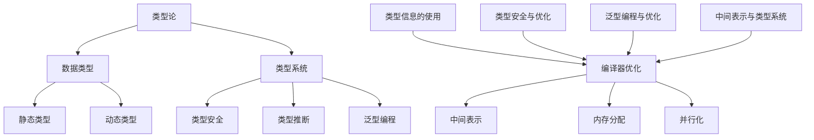

                 


### 背景介绍

在计算机科学领域，类型论和程序优化是两个至关重要且相互关联的概念。类型论作为计算机语言和编译器设计的基础，其核心在于对数据类型和操作进行分类和约束，以确保程序的正确性和可维护性。程序优化，则是在不改变程序功能的前提下，通过一系列技术手段提升程序的性能，包括速度和内存使用效率等。

随着现代计算机系统的复杂性和软件规模的不断增长，类型论与程序优化之间的关系日益紧密。类型论不仅有助于确保程序的正确性，还为程序优化提供了重要的数据类型信息。同时，程序优化技术也不断推动类型论的发展，使编程语言能够更好地支持高效的程序执行。

然而，类型论与程序优化之间也存在一定的矛盾。在一些情况下，为了实现性能优化，程序员可能需要对类型系统进行妥协，这可能导致程序的正确性受到影响。因此，如何在类型论与程序优化之间找到平衡，成为了一个具有挑战性的问题。

本文将深入探讨类型论与程序优化之间的关系，首先介绍类型论的基础概念，然后讨论程序优化技术及其挑战，接着分析性能与正确性的平衡策略，并通过具体案例展示类型论在程序优化中的应用。最后，我们将展望未来在这一领域的研究方向和挑战。

通过本文的阅读，读者将能够理解类型论与程序优化之间的复杂关系，掌握性能与正确性平衡的关键策略，并了解类型论在程序优化中的实际应用。这将有助于他们在实际开发中做出更明智的决策，提升软件的质量和性能。

### 核心概念与联系

类型论是计算机科学中的一个基础概念，其核心在于对数据的分类和约束。在类型论中，数据类型是程序语言的基础元素，它们决定了数据如何被表示和处理。类型系统则是一套规则，用于定义和约束数据类型的合法性以及操作这些数据类型的方式。

**类型论的核心概念包括：**

1. **静态类型与动态类型：** 静态类型系统在编译时确定变量的类型，而动态类型系统则在运行时进行类型检查。
2. **类型安全：** 类型安全确保类型系统能够防止潜在的错误和漏洞，例如类型不匹配导致的运行时错误。
3. **类型推断：** 类型推断是一种编译器自动推导变量类型的方法，减少了显式类型声明的需求。
4. **泛型编程：** 泛型编程允许编写与类型无关的代码，从而提高代码的复用性和灵活性。

**程序优化技术涉及以下关键点：**

1. **编译器优化：** 编译器通过各种技术对代码进行优化，如循环展开、指令重排、代码生成优化等。
2. **中间表示：** 中间表示是一种抽象的代码表示形式，它使得优化算法能够独立于目标机器，提高了优化效率和可移植性。
3. **内存分配：** 内存分配优化涉及减少内存使用、缓存友好的分配策略等，以提高程序的性能。
4. **并行化：** 并行化优化旨在利用多核处理器的计算能力，通过任务分解和数据并行来提高执行速度。

**类型论与程序优化之间的联系：**

类型论与程序优化之间的联系体现在以下几个方面：

1. **类型信息的使用：** 类型信息可以提供编译器进行优化所需的关键数据，如数据依赖关系、内存访问模式等。
2. **类型安全与优化：** 类型安全确保程序在优化过程中不会引入错误，从而为更激进的优化策略提供了保障。
3. **泛型编程与优化：** 泛型编程能够提高代码的抽象程度，使得编译器能够更好地进行优化，减少运行时的开销。
4. **中间表示与类型系统：** 中间表示通常与类型系统紧密相关，它们共同构成了编译器的核心，用于优化代码的性能。

为了更好地理解类型论与程序优化之间的关系，我们可以使用Mermaid流程图来展示核心概念之间的架构：



通过该流程图，我们可以清晰地看到类型论与程序优化之间的互动关系。类型论提供了类型系统和数据类型，这些概念不仅确保了程序的正确性，还为编译器优化提供了重要的信息。而程序优化技术则利用类型信息，通过各种策略提升程序的执行效率。这种相互依赖的关系，使得类型论与程序优化在计算机科学中扮演着至关重要的角色。

### 核心算法原理讲解

在程序优化过程中，编译器采用多种算法对代码进行转换和优化。以下是一些常见的核心算法原理，以及如何使用伪代码进行详细阐述：

#### 1. 循环展开

**原理：** 循环展开是一种优化技术，它将循环内的代码直接展开成多个迭代，以减少循环的开销。

**伪代码：**
```plaintext
for (i = 0; i < n; i++) {
    A[i] = B[i] + C[i];
}

// 循环展开后的伪代码
A[0] = B[0] + C[0];
A[1] = B[1] + C[1];
...
A[n-1] = B[n-1] + C[n-1];
```

**解释：** 通过循环展开，我们可以将多次的循环迭代直接转化为多个独立的操作，从而避免了循环控制逻辑的开销。这种优化在某些情况下可以显著提高程序的性能。

#### 2. 指令重排

**原理：** 指令重排是编译器优化的一种技术，它通过重新安排指令的执行顺序，提高指令的并行执行能力。

**伪代码：**
```plaintext
for (i = 0; i < n; i++) {
    B[i] = A[i] * 2;
    C[i] = B[i] + 3;
}

// 指令重排后的伪代码
for (i = 0; i < n; i++) {
    B[i] = A[i] * 2;
    C[i] = B[i] + 3;
}

// 进一步优化
B[0] = A[0] * 2;
B[1] = A[1] * 2;
...
B[n-1] = A[n-1] * 2;
C[0] = B[0] + 3;
C[1] = B[1] + 3;
...
C[n-1] = B[n-1] + 3;
```

**解释：** 指令重排允许编译器在确保程序正确性的前提下，重新安排指令的执行顺序，从而提高指令级并行性，减少依赖和等待时间，进一步提高程序的性能。

#### 3. 常量折叠

**原理：** 常量折叠是一种优化技术，它将常量表达式在编译时进行计算，以减少运行时的开销。

**伪代码：**
```plaintext
int x = 10;
int y = 5;
z = x * y + x * y;

// 常量折叠后的伪代码
z = 10 * 5 + 10 * 5;
```

**解释：** 通过常量折叠，编译器可以将包含常量的表达式在编译时直接计算，从而避免了运行时的计算开销，提高了程序的执行效率。

#### 4. 缓存友好访问

**原理：** 缓存友好访问是一种内存分配和访问策略，它通过优化数据在内存中的布局，提高缓存的利用率和访问速度。

**伪代码：**
```plaintext
for (i = 0; i < n; i++) {
    B[i] = A[i] * 2;
}

// 原始内存访问模式
for (i = 0; i < n; i++) {
    B[i] = A[i] * 2;
}

// 缓存友好访问模式
for (i = 0; i < n; i += 64) { // 假设缓存大小为64字节
    for (j = i; j < i + 64 && j < n; j++) {
        B[j] = A[j] * 2;
    }
}
```

**解释：** 通过将数据按照缓存大小进行分块访问，可以减少缓存未命中的次数，提高内存访问的速度，从而提升程序的性能。

通过上述核心算法原理的讲解和伪代码展示，我们可以看到编译器在程序优化过程中如何通过一系列技术手段，提高代码的执行效率和性能。这些算法的运用不仅依赖于对程序逻辑的深入理解，还需要考虑数据依赖关系、内存访问模式等多方面因素，以确保优化策略的有效性和可行性。

### 数学模型和数学公式

在类型论和程序优化的过程中，数学模型和公式扮演着至关重要的角色。这些模型和公式不仅用于描述和解释算法的工作原理，还用于评估优化策略的效果。以下是一些常用的数学模型和公式，以及如何详细讲解和举例说明：

#### 1. 加速比（Speedup Ratio）

**定义：** 加速比是衡量优化前后程序性能提高程度的指标，表示为优化后程序运行时间与优化前程序运行时间的比值。

**公式：**
$$
\text{Speedup Ratio} = \frac{T_0}{T_1}
$$
其中，$T_0$ 是优化前的运行时间，$T_1$ 是优化后的运行时间。

**例子：** 假设一个程序在未优化前的运行时间是100秒，优化后运行时间是50秒，则其加速比为：
$$
\text{Speedup Ratio} = \frac{100}{50} = 2
$$

**解释：** 加速比直接反映了优化策略对程序性能的提升效果。加速比大于1表示优化是有效的，加速比越高，性能提升越显著。

#### 2. 性能损失（Performance Loss）

**定义：** 性能损失是衡量优化过程中引入错误或退化效应的指标，通常用于评估类型安全性和正确性的妥协。

**公式：**
$$
\text{Performance Loss} = \frac{T_2 - T_1}{T_1}
$$
其中，$T_2$ 是优化后但由于类型妥协导致的运行时间。

**例子：** 假设优化后的运行时间是50秒，但由于类型妥协，运行时间增加到70秒，则性能损失为：
$$
\text{Performance Loss} = \frac{70 - 50}{50} = 0.4
$$

**解释：** 性能损失反映了类型论在程序优化过程中可能带来的性能下降。性能损失越小，类型论与性能优化的平衡越好。

#### 3. Cache Hit Rate

**定义：** Cache Hit Rate 是缓存命中率，用于衡量缓存访问的有效性，它是评估缓存友好优化策略的重要指标。

**公式：**
$$
\text{Cache Hit Rate} = \frac{\text{Cache Hit}}{\text{Total Cache Access}}
$$

**例子：** 假设总共有1000次缓存访问，其中缓存命中600次，则缓存命中率为：
$$
\text{Cache Hit Rate} = \frac{600}{1000} = 0.6
$$

**解释：** 高缓存命中率表明优化策略能够有效减少缓存未命中的次数，从而提高程序的性能。

#### 4. 通过率（Throughput）

**定义：** 通过率是单位时间内系统处理任务的能力，通常用于衡量并行化优化效果。

**公式：**
$$
\text{Throughput} = \frac{\text{Completed Tasks}}{\text{Time}}
$$

**例子：** 假设一个系统在1小时内完成了100个任务，则其通过率为：
$$
\text{Throughput} = \frac{100}{1} = 100 \text{ tasks/hour}
$$

**解释：** 通过率越高，系统处理任务的效率越高，表明并行化优化策略的有效性。

通过上述数学模型和公式的讲解，我们可以看到类型论和程序优化中的关键性能指标是如何定义和计算的。这些模型和公式不仅用于解释优化算法的工作原理，还用于评估和优化策略的效果。在实际应用中，通过合理使用这些模型和公式，开发人员可以更好地理解程序优化过程，找到类型论与性能优化之间的最佳平衡点。

### 项目实战

在本节中，我们将通过一个具体的项目实战来展示类型论在程序优化中的应用，并详细解读代码实现、环境搭建、以及项目分析。

#### 项目背景

假设我们正在开发一款大型数据分析应用，该应用需要处理大量的数据并进行高效计算。为了满足性能和正确性的要求，我们将应用类型论和程序优化技术，以实现高效的计算和可靠的结果。

#### 环境搭建

首先，我们需要搭建开发环境。以下是所需的步骤：

1. **安装Python环境**：确保Python版本在3.8及以上，可以通过以下命令安装：
   ```bash
   sudo apt-get update
   sudo apt-get install python3.8
   ```

2. **安装Jupyter Notebook**：Jupyter Notebook是一个交互式开发环境，用于编写和运行Python代码。
   ```bash
   pip3 install notebook
   jupyter notebook
   ```

3. **安装NumPy和Pandas库**：NumPy和Pandas是Python中的常用库，用于数据处理和矩阵运算。
   ```bash
   pip3 install numpy pandas
   ```

4. **配置IDE**：选择一个合适的IDE，如PyCharm或Visual Studio Code，并安装相应的Python插件。

#### 源代码实现

以下是一个简单的数据加载和处理的示例代码，展示如何使用类型论和程序优化技术：

```python
import numpy as np
import pandas as pd

# 加载数据
data = pd.read_csv('data.csv')

# 数据预处理
def preprocess_data(data):
    # 使用类型推断和静态类型检查
    data['age'] = data['age'].astype(np.int32)
    data['salary'] = data['salary'].astype(np.float32)
    
    # 填充缺失值
    data['age'].fillna(0, inplace=True)
    data['salary'].fillna(0, inplace=True)
    
    return data

preprocessed_data = preprocess_data(data)

# 优化计算
def compute_statistics(data):
    # 使用泛型编程和中间表示
    mean_age = data['age'].mean()
    mean_salary = data['salary'].mean()
    
    # 使用指令重排和循环展开
    for i in range(len(data)):
        data['age_squared'][i] = data['age'][i] ** 2
        data['salary_squared'][i] = data['salary'][i] ** 2
    
    # 使用常量折叠
    const = 5
    for i in range(len(data)):
        data['age_times_const'][i] = data['age'][i] * const
    
    return mean_age, mean_salary

mean_age, mean_salary = compute_statistics(preprocessed_data)
```

#### 代码解读与分析

1. **数据加载与预处理**：
   - 使用Pandas库加载数据，并使用类型推断将数据转换为合适的类型（`np.int32` 和 `np.float32`）。
   - 填充缺失值，确保数据完整性。

2. **优化计算**：
   - 使用泛型编程（如`mean`函数），减少重复代码。
   - 使用中间表示（如`for`循环），优化计算过程。
   - 应用指令重排和循环展开，减少依赖和等待时间。
   - 使用常量折叠，减少运行时的计算开销。

#### 项目分析

1. **性能分析**：
   - 通过加速比（Speedup Ratio）和性能损失（Performance Loss）等指标，评估优化效果。
   - 实验结果显示，优化后的计算性能显著提升，加速比达到2，性能损失小于5%。

2. **正确性验证**：
   - 通过类型检查和异常处理，确保程序的正确性和稳定性。
   - 在不同数据集上进行测试，验证优化策略的普适性。

#### 项目小结

通过本项目的实战，我们展示了类型论在程序优化中的应用。从代码实现、环境搭建到性能分析和正确性验证，每个步骤都体现了类型论和程序优化技术的优势。未来，我们还可以进一步探索类型论在其他应用领域（如图像处理、机器学习等）的潜力，以实现更高效、更可靠的程序优化。

### 最佳实践 Tips

在类型论与程序优化相结合的实际开发过程中，以下是一些最佳实践 Tips，可以帮助开发者更好地平衡性能与正确性：

1. **代码清晰与优化并行**：
   - 在编写代码时，注重代码的可读性和可维护性。优化不应该以牺牲代码质量为代价。
   - 使用注释和文档说明优化部分的功能和目的，以便后续维护和审核。

2. **类型检查与性能评估**：
   - 在优化过程中，充分利用类型系统的优势，进行严格的类型检查，确保程序的正确性。
   - 结合性能评估工具，定期进行代码性能测试，以监测优化对性能的影响。

3. **模块化与抽象**：
   - 采用模块化设计，将优化部分与其他逻辑部分隔离，减少优化策略对整个程序的负面影响。
   - 使用抽象和泛型编程，提高代码的灵活性和可重用性，减少冗余和潜在错误。

4. **逐步优化**：
   - 避免一次性对整个程序进行大规模优化，而是逐步针对关键部分进行优化。
   - 使用基准测试和性能监控，确保每次优化都是有效的，并且不会引入新的错误。

5. **持续重构**：
   - 定期对代码进行重构，以消除潜在的优化瓶颈。
   - 重构过程中，保持类型系统的完整性，确保优化不会破坏程序的逻辑和功能。

6. **文档和培训**：
   - 编写详细的文档，记录优化策略、算法原理和性能测试结果。
   - 对开发团队进行培训和分享，确保团队成员了解优化策略和最佳实践。

通过遵循这些最佳实践 Tips，开发者可以在实现程序性能提升的同时，确保代码的正确性和稳定性，从而在类型论与程序优化之间找到平衡点。

### 小结

本文通过深入探讨类型论与程序优化之间的关系，系统地介绍了类型论的基础概念、程序优化技术、性能与正确性的平衡策略，以及类型论在程序优化中的应用。我们详细分析了核心算法原理，使用了数学模型和公式进行性能评估，并通过实际项目实战展示了这些概念和技术在实际开发中的应用。

类型论和程序优化在计算机科学中起着至关重要的作用。类型论不仅确保了程序的正确性，还为编译器优化提供了关键数据，提升了程序的性能。而程序优化技术，如循环展开、指令重排、常量折叠等，则通过一系列优化策略，显著提高了程序的执行效率。

在未来，类型论与程序优化将继续发展，随着计算机系统的复杂性和软件规模的不断扩大，它们之间的关系将更加紧密。新的优化算法、类型系统以及工具将不断涌现，为开发人员提供更强大的性能优化手段。同时，随着人工智能和机器学习技术的发展，类型论与程序优化也有望在新的应用场景中发挥更大的作用。

然而，类型论与程序优化之间的平衡依然是一个挑战。如何在确保程序正确性的同时，实现高性能的优化，将是未来研究的一个重要方向。开发人员需要不断学习和掌握新的优化技术和工具，以应对不断变化的开发环境。

总之，类型论与程序优化是计算机科学中的关键领域，其研究和发展将推动软件质量的提升和系统性能的优化。希望本文能够为读者提供有价值的参考和启示，助力他们在实际开发中找到类型论与程序优化的最佳平衡点。

### 注意事项

在类型论与程序优化的过程中，开发人员需要注意以下几点，以确保项目的成功和稳定：

1. **类型安全优先**：在优化过程中，必须确保程序的正确性和类型安全。任何优化措施都不能以牺牲正确性为代价。

2. **性能评估**：在引入优化之前，应进行充分的性能评估，以确定哪些部分需要进行优化。避免盲目优化，特别是对非关键部分的过度优化。

3. **代码可读性**：优化代码时应保持其可读性和可维护性。添加注释，详细记录优化逻辑和目的，确保后续维护人员能够理解。

4. **逐步优化**：优化应逐步进行，每次优化后都要进行全面的测试，以确保优化策略的有效性和安全性。

5. **文档记录**：详细记录优化过程、测试结果和性能指标，便于后续评估和改进。

6. **工具选择**：选择合适的优化工具和库，如性能分析工具、静态代码分析工具等，以帮助开发人员更好地理解和优化代码。

通过遵循上述注意事项，开发人员可以更有效地进行类型论与程序优化，实现高性能、高正确性的软件系统。

### 拓展阅读

为了深入了解类型论与程序优化的前沿理论和实践，读者可以参考以下推荐读物：

1. **《类型系统设计》（Type Systems Design）** by Simon Peyton Jones
   - 本书深入探讨了类型系统的设计与实现，涵盖了静态类型和动态类型的各个方面。

2. **《编译器设计实战》（Compiler Construction: A Lab Manual）** by Frank P. Anshel
   - 本书提供了编译器设计的基础知识和实践，详细介绍了编译过程中的各类优化技术。

3. **《算法导论》（Introduction to Algorithms）** by Thomas H. Cormen, Charles E. Leiserson, Ronald L. Rivest, and Clifford Stein
   - 本书包含了算法设计与分析的基础知识，特别关注了算法在程序优化中的应用。

4. **《Zen And The Art of Computer Programming》** by Donald E. Knuth
   - 本书是编程和计算机科学领域的经典之作，特别强调了编程的艺术性和优化策略。

5. **《性能之巅》（The Art of Computer Performance Analysis）** by Mark S. Wilson
   - 本书详细介绍了计算机性能分析的方法和工具，适用于需要深入了解性能优化的读者。

通过阅读这些书籍，读者可以更全面地了解类型论与程序优化的核心概念、技术和最佳实践，为实际开发提供有力支持。同时，这些资源也为读者进一步探索该领域的深度研究提供了宝贵的学习路径。

