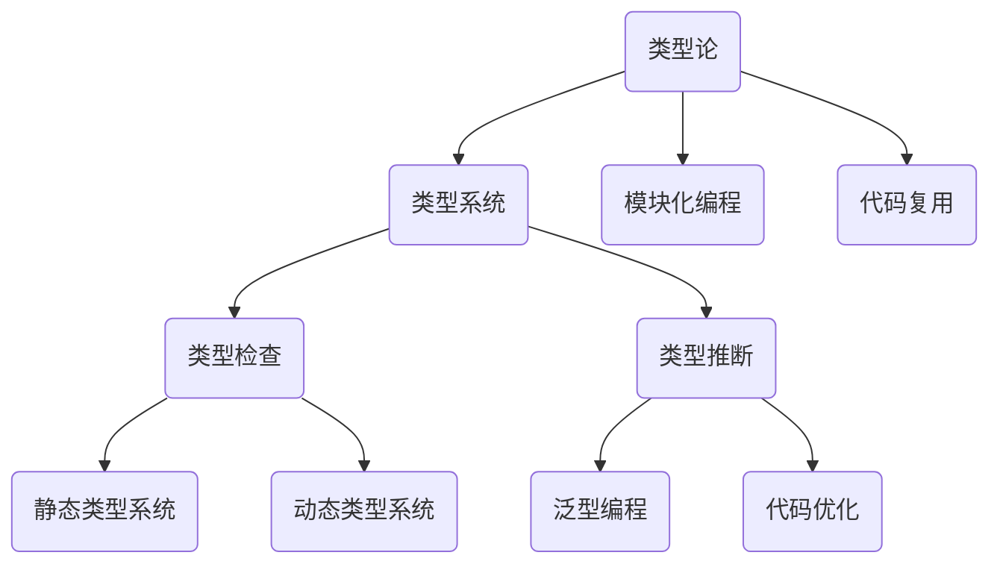
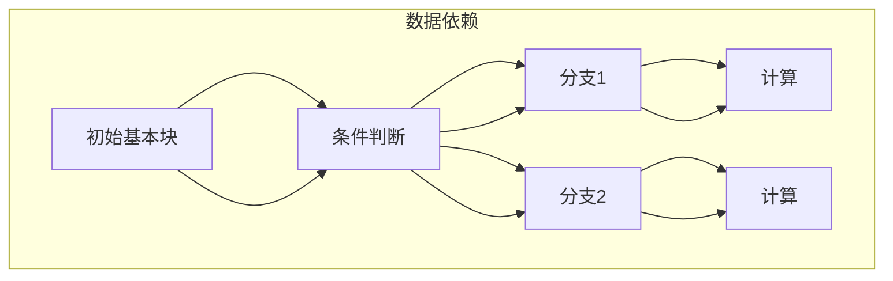
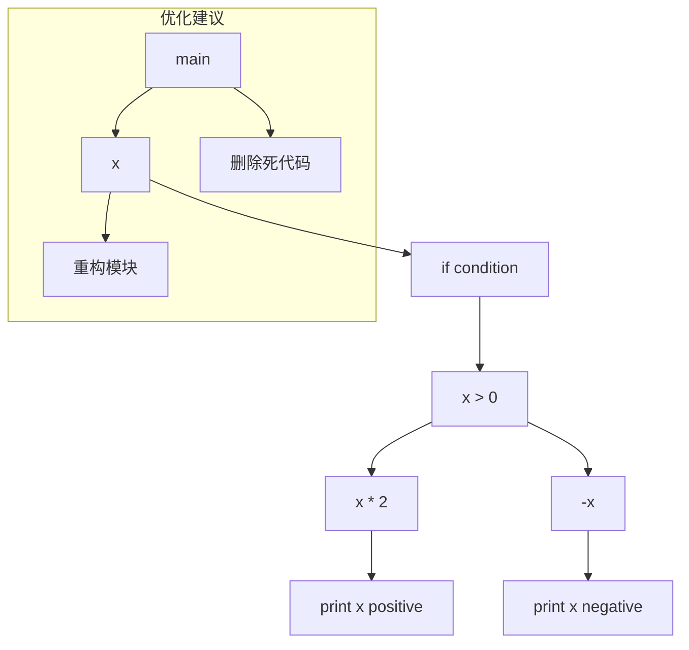
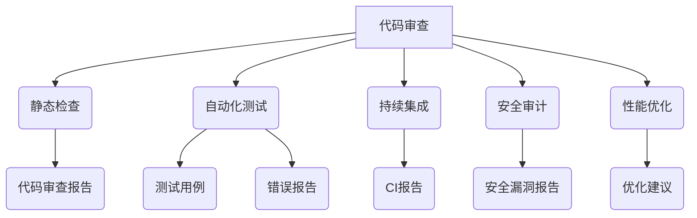

                 


### 分析文章标题

《类型论与程序分析：静态检查的理论基础》这一文章标题清晰地展示了文章的核心内容。首先，“类型论”指的是一种数学理论，用于描述数据的结构和操作。在计算机科学中，类型论是理解编程语言的基础，因为它帮助我们理解和组织代码中的数据。接着，“程序分析”是指对程序的行为和结构进行分析，以识别潜在的错误或优化程序性能。最后，“静态检查”是一种在程序执行前检查程序的方法，用于发现编程错误和验证程序的正确性。

这篇文章的目的在于解释类型论、程序分析以及静态检查在软件工程中的基础作用，并探讨它们之间的相互关系。通过深入分析这些概念，读者可以更好地理解现代编程语言的设计原理，并学会如何使用静态检查来提高软件质量。

### 构建文章大纲

为了构建一个逻辑清晰、结构紧凑的文章大纲，我们可以按照以下步骤：

**第一步：确定主要部分**

首先，我们将文章分为三个主要部分：

1. **类型论基础**：介绍类型论的核心概念和发展历程，以及它在程序设计语言中的应用。
2. **程序分析基础**：探讨程序分析的基本概念、数据流分析和依赖分析。
3. **静态检查的理论基础**：讨论静态检查的定义、算法、工具以及它们的应用。

**第二步：细化每个部分的内容**

接下来，我们对每个部分进行细化，确定每个章节的具体内容。

**类型论基础**

- **第1章 类型论概述**：介绍类型论的核心概念、发展历程和应用。
- **第2章 类型论基本概念**：详细解释基本类型、复合类型和子类型。
- **第3章 类型系统设计**：探讨静态类型系统、动态类型系统和强类型与弱类型。

**程序分析基础**

- **第4章 程序分析的基本概念**：介绍程序分析的目的、分类和工具。
- **第5章 数据流分析**：解释数据流分析的概念、枚举数据流分析算法和密度分析算法。
- **第6章 依赖分析**：讨论依赖分析的概念、算法和程序优化。

**静态检查的理论基础**

- **第7章 静态检查概述**：介绍静态检查的定义、优势和挑战。
- **第8章 静态检查算法**：探讨基于抽象解释、类型检查和模式匹配的静态检查。
- **第9章 静态检查工具**：讨论静态检查工具的类型、使用经验和选择配置。

**第三步：整合整体结构**

最后，我们将所有部分整合到一个整体的逻辑结构中，确保每个章节的内容紧密相关，逐步深入，形成一个完整的学习路径。

### 撰写文章摘要

在撰写文章摘要时，我们需要简洁明了地概括文章的核心内容和主题思想。

**摘要：**

本文深入探讨了类型论、程序分析和静态检查在软件工程中的应用。首先，我们介绍了类型论的核心概念和发展历程，并探讨了其在程序设计语言中的应用。接着，我们探讨了程序分析的基本概念，包括数据流分析和依赖分析。最后，我们详细讨论了静态检查的定义、算法和工具，并展示了如何将这些概念应用于实际项目中。通过本文的阅读，读者可以更好地理解现代编程语言的设计原理，并学会如何使用静态检查来提高软件质量。

### 完成文章大纲

根据以上分析，我们可以完成文章的大纲，并确保它逻辑清晰、结构紧凑、内容丰富。以下是最终的目录大纲：

# 目录

## 第一部分 类型论基础

### 第1章 类型论概述
- **1.1 类型论的核心概念**
- **1.2 类型论的发展历程**
- **1.3 类型论在程序设计语言中的应用**

### 第2章 类型论基本概念
- **2.1 基本类型**
- **2.2 复合类型**
- **2.3 子类型与类型层次**

### 第3章 类型系统设计
- **3.1 静态类型系统**
- **3.2 动态类型系统**
- **3.3 强类型与弱类型**

## 第二部分 程序分析基础

### 第4章 程序分析的基本概念
- **4.1 程序分析的目的**
- **4.2 程序分析的分类**
- **4.3 程序分析的工具**

### 第5章 数据流分析
- **5.1 数据流分析的概念**
- **5.2 枚举数据流分析算法**
- **5.3 密度分析算法**

### 第6章 依赖分析
- **6.1 依赖分析的概念**
- **6.2 依赖分析算法**
- **6.3 依赖分析与程序优化**

## 第三部分 静态检查的理论基础

### 第7章 静态检查概述
- **7.1 静态检查的定义**
- **7.2 静态检查的优势与挑战**
- **7.3 静态检查的应用领域**

### 第8章 静态检查算法
- **8.1 基于抽象解释的静态检查**
- **8.2 基于类型检查的静态检查**
- **8.3 基于模式匹配的静态检查**

### 第9章 静态检查工具
- **9.1 静态检查工具的类型**
- **9.2 使用静态检查工具的实践经验**
- **9.3 静态检查工具的选择与配置**

## 第10章 类型论与程序分析综合应用
- **10.1 类型论在程序分析中的应用**
- **10.2 程序分析在类型论中的应用**
- **10.3 实际项目中的应用案例**

## 附录
- **附录A 类型论与程序分析相关资源**
- **附录B 术语表**

通过以上大纲，我们已经为文章的撰写奠定了坚实的基础。接下来，我们将逐一填充每个章节的内容，确保文章的逻辑清晰、结构紧凑、内容丰富。接下来，我们将逐步展开每个章节的具体内容，使其完整、具体、详细，满足文章字数要求。让我们一起进入深度探讨之旅！ 

## 类型论概述

### 1.1 类型论的核心概念

类型论是一种数学理论，主要研究数据类型及其在编程语言中的表示方法。它的核心概念包括类型、类型系统、类型检查和类型推断。类型是数据的一种分类，它定义了数据的结构和操作方式。例如，在Python中，`int`表示整数类型，`str`表示字符串类型。

类型系统是编程语言的一部分，它定义了如何表示和操作类型。类型系统可以分为静态类型系统和动态类型系统。静态类型系统在编译时确定变量的类型，而动态类型系统在运行时确定变量的类型。

类型检查是确保程序中所有类型操作都是合法的过程。类型检查可以是严格的，也可以是宽松的。严格的类型检查会严格检查每个类型操作，而宽松的类型检查则会允许一些类型错误。

类型推断是类型系统的一个特性，它自动推导变量或表达式的类型，而不是显式指定类型。类型推断可以大大提高编程的效率，减少代码的冗余。

### 1.2 类型论的发展历程

类型论的发展可以追溯到20世纪40年代，当时为了解决符号逻辑中的自引用问题，阿尔图尔·克里茨克尔（Arthur Kleene）提出了递归论。随着计算机科学的兴起，类型论逐渐发展成为编程语言理论的核心。

20世纪60年代，Pierce在《Type or Church》一书中提出了类型论的基本框架，这被视为类型论的起点。此后，许多学者对类型论进行了深入的研究和扩展，形成了多种类型论体系。

在20世纪80年代，随着面向对象编程的出现，类型论在面向对象编程语言中也得到了广泛应用。如C++、Java等语言都引入了类型系统，以支持更复杂的编程结构。

21世纪初，随着函数式编程的复兴，类型论在函数式编程语言中得到了更广泛的应用。Haskell、Scala等语言都采用了先进的类型系统，以支持函数式编程的强大特性。

### 1.3 类型论在程序设计语言中的应用

类型论在程序设计语言中的应用体现在以下几个方面：

1. **类型安全**：类型论确保程序中的类型操作都是安全的，从而减少了运行时错误。例如，在静态类型语言中，类型检查会在编译时发现类型错误，从而避免运行时错误。

2. **代码复用**：类型论支持代码的抽象和泛化，从而提高了代码的可复用性。例如，通过使用泛型编程，我们可以编写一次函数，但适用于多种数据类型。

3. **性能优化**：类型论支持编译器进行类型推导和优化，从而提高程序的执行效率。例如，编译器可以根据类型信息进行特定的优化，如提前计算常量表达式。

4. **静态分析**：类型论为静态分析提供了强大的理论基础。静态分析工具可以使用类型信息来识别潜在的错误和优化程序。

5. **模块化编程**：类型论支持模块化编程，使得大型程序更易于理解和维护。通过定义清晰的接口和类型，我们可以将复杂的程序分解为更小的模块。

### Mermaid 流程图

为了更好地理解类型论的核心概念，我们可以使用Mermaid绘制一个简单的流程图，展示类型论在编程语言中的应用：



通过这个流程图，我们可以清晰地看到类型论的核心概念及其在编程语言中的应用。

### 伪代码

为了更好地理解类型论的应用，我们可以使用伪代码来描述一个简单的类型检查过程：

```pseudo
function type_check(expression, context):
    if expression is a constant:
        return type of constant
    else if expression is a variable:
        return type of variable in context
    else if expression is a binary operation:
        left_type = type_check(left_operand, context)
        right_type = type_check(right_operand, context)
        if left_type == right_type:
            return left_type
        else:
            return "Error: mismatched types"
    else:
        return "Error: unknown expression"
```

这个伪代码展示了如何对一个表达式进行类型检查。类型检查器会递归地检查每个子表达式，并根据类型系统确定最终表达式的类型。如果发现类型不匹配，则会抛出一个错误。

通过以上内容，我们已经对类型论有了基本的了解，并展示了它在编程语言中的应用。接下来，我们将深入探讨类型论的基本概念，包括基本类型、复合类型和子类型，以及它们之间的关系。这不仅有助于我们理解类型论的核心原理，还能帮助我们更好地设计和使用编程语言。请继续关注下一章节的内容！ 

### 基本概念

#### 2.1 基本类型

基本类型是编程语言中最基本的类型，它们是不可分割的数据单位。基本类型通常包括整数（int）、浮点数（float）、布尔值（bool）、字符（char）等。每种基本类型都有其特定的内存表示和操作方式。

- **整数（int）**：整数类型用于表示整数值，例如0、-1、100等。在不同的编程语言和计算机系统中，整数的长度（位数）和范围可能会有所不同。
- **浮点数（float）**：浮点数类型用于表示实数，例如3.14、0.1等。浮点数在计算机中通常使用IEEE 754标准来存储，包括单精度（float）和双精度（double）两种格式。
- **布尔值（bool）**：布尔值类型用于表示逻辑值，通常为真（True）或假（False）。布尔值在逻辑运算和条件语句中非常重要。
- **字符（char）**：字符类型用于表示单个字符，例如'a'、'A'、'0'等。在不同的编程语言中，字符的表示方式可能不同，例如使用ASCII码或Unicode码。

基本类型的操作通常包括赋值、比较、算术运算和逻辑运算。例如，在Python中，我们可以这样使用基本类型：

```python
x = 10        # 整数赋值
y = 3.14      # 浮点数赋值
z = True      # 布尔值赋值
a = 'Hello'   # 字符串赋值
```

#### 2.2 复合类型

复合类型是由基本类型组合而成的数据结构，它们提供了更复杂的抽象能力。常见的复合类型包括数组、结构体（struct）、类（class）和集合（set）等。

- **数组（array）**：数组是一种固定大小的数据结构，用于存储相同类型的数据元素。数组在计算机科学和编程中非常常见，因为它们提供了快速访问和操作元素的能力。在C语言中，数组是一种基本的数据类型，而在Python中，数组是通过列表（list）实现的。
- **结构体（struct）**：结构体是一种用户定义的数据类型，它由多个成员组成，每个成员可以有不同的类型。结构体在C语言和C++语言中广泛使用，用于组织相关数据。例如，我们可以定义一个表示学生的结构体，包括姓名、年龄和成绩等成员。
- **类（class）**：类是一种面向对象编程中的用户定义数据类型，它定义了一组具有相同属性和方法的对象。类在Java、C++和Python等面向对象编程语言中非常重要，用于封装数据和实现行为。
- **集合（set）**：集合是一种无序的数据结构，用于存储独特的元素。集合在Python的集合类型（set）和Java的HashSet中广泛使用，用于快速查找和删除元素。

复合类型的操作通常包括创建、访问、修改和删除。例如，在Python中，我们可以这样使用复合类型：

```python
# 使用数组
my_array = [1, 2, 3, 4, 5]
print(my_array[2])  # 输出元素3

# 使用结构体
student = {"name": "Alice", "age": 20, "grade": 90}
print(student["name"])  # 输出姓名

# 使用类
class Person:
    def __init__(self, name, age):
        self.name = name
        self.age = age

alice = Person("Alice", 20)
print(alice.name)  # 输出姓名

# 使用集合
my_set = {1, 2, 3, 4, 5}
print(2 in my_set)  # 输出True
my_set.add(6)
print(my_set)  # 输出{1, 2, 3, 4, 5, 6}
```

#### 2.3 子类型与类型层次

子类型（Subtype）是类型系统中的一个重要概念，它表示一种类型是另一种类型的特殊形式。在面向对象编程中，子类型通常是父类型的一个特化，它继承了父类型的所有属性和方法，并可以添加新的属性和方法。

类型层次（Type Hierarchy）是指不同类型之间的层次关系，它通常由一个树形结构表示。在类型层次中，每个类型都有一个唯一的父类型，除了根类型（通常是无类型的类型）。

子类型和类型层次在编程语言中有多种实现方式：

- **结构化类型系统**：通过定义明确的层次关系和继承机制，例如Java和C++。
- **标签类型系统**：通过在值上附加标签来表示类型，例如Haskell和Go。
- **依赖类型系统**：通过类型的依赖关系来定义子类型，例如ML和OCaml。

例如，在Java中，`Number`是一个抽象类，它有两个子类`Integer`和`Float`。`Integer`和`Float`都是`Number`的子类型，它们继承了`Number`的所有属性和方法。

```java
public class Number {
    // 共同的方法和属性
}

public class Integer extends Number {
    // 特有的方法和属性
}

public class Float extends Number {
    // 特有的方法和属性
}
```

在Python中，`int`和`float`都是`numbers.Number`的子类型。

```python
import numbers

class Integer(numbers.Number):
    # 特有的方法和属性

class Float(numbers.Number):
    # 特有的方法和属性
```

通过子类型和类型层次，我们可以实现代码的复用、扩展和抽象。子类型使我们能够将通用的代码应用于更广泛的场景，而类型层次则提供了清晰的类型层次结构，使得程序更易于理解和维护。

### 伪代码

为了更好地理解子类型和类型层次，我们可以使用伪代码来描述一个简单的类型层次结构：

```pseudo
class Type {
    // 基础类型的共同属性和方法
}

class Integer extends Type {
    // 整数类型的特有属性和方法
}

class Float extends Type {
    // 浮点数类型的特有属性和方法
}

class Complex extends Float {
    // 复数类型的特有属性和方法
}
```

通过这个简单的类型层次结构，我们可以定义不同类型的数值，并利用子类型关系实现代码的复用。

通过以上内容，我们已经对类型论的基本概念有了深入的了解，包括基本类型、复合类型和子类型。这些基本概念是理解类型论的核心，也是编程语言设计的基础。在接下来的章节中，我们将进一步探讨类型系统设计，包括静态类型系统、动态类型系统和强类型与弱类型。这些概念将帮助我们更好地理解类型论在实际编程中的应用。请继续关注下一章节的内容！ 

## 类型系统设计

### 3.1 静态类型系统

静态类型系统（Static Type System）是一种在程序编译或解析时确定变量类型的类型系统。这意味着变量在程序运行之前就已经被赋予了一个具体的类型，并且这种类型在程序运行过程中保持不变。静态类型系统的主要优势在于及早发现类型错误，从而提高程序的可维护性和可靠性。

#### 静态类型系统的特点

- **类型检查早期**：在编译时进行类型检查，可以及早发现类型错误，避免运行时错误。
- **类型安全**：静态类型系统能够保证类型的一致性，从而减少类型错误的发生。
- **性能优化**：编译器可以利用类型信息进行性能优化，例如提前计算常量表达式和优化内存分配。
- **减少代码冗余**：静态类型系统支持类型推断，可以自动推导变量类型，减少显式类型声明的需求。

#### 静态类型系统的实现

静态类型系统通常通过以下几种方式实现：

- **显式类型声明**：程序员在编写代码时明确指定每个变量的类型。例如，在C++中，我们可以这样声明变量：

  ```cpp
  int x = 10;
  double y = 3.14;
  bool z = true;
  ```

- **类型推断**：编译器可以根据上下文自动推导变量类型。例如，在Python中，我们可以这样使用变量：

  ```python
  x = 10        # 自动推断为整数
  y = 3.14      # 自动推断为浮点数
  z = True      # 自动推断为布尔值
  ```

#### 静态类型系统的例子

在Java中，静态类型系统非常常见。以下是Java中的一个例子：

```java
public class StaticTypeExample {
    public static void main(String[] args) {
        int x = 10;       // 整数类型
        double y = 3.14;  // 浮点数类型
        boolean z = true; // 布尔类型

        System.out.println("x: " + x);  // 输出：x: 10
        System.out.println("y: " + y);  // 输出：y: 3.14
        System.out.println("z: " + z);  // 输出：z: true
    }
}
```

在这个例子中，变量`x`、`y`和`z`在声明时就被赋予了具体的类型，并且在程序运行过程中这些类型不会改变。

### 3.2 动态类型系统

动态类型系统（Dynamic Type System）是一种在程序运行时确定变量类型的类型系统。这意味着变量的类型可以随时改变，通常是通过赋值操作。动态类型系统的优势在于编程的灵活性和简洁性，但这也可能导致类型错误。

#### 动态类型系统的特点

- **类型检查延迟**：在程序运行时进行类型检查，可以在一定程度上延迟类型错误的发现。
- **类型灵活性**：变量类型可以随时改变，使得编程更加灵活。
- **减少代码冗余**：无需显式声明变量类型，可以减少代码的冗余。

#### 动态类型系统的实现

动态类型系统通常通过以下几种方式实现：

- **类型绑定**：在变量绑定时确定类型，并在程序运行过程中保持不变。例如，在Python中，变量在绑定时会被赋予一个类型，并在运行时保持该类型。

  ```python
  x = 10        # 整数类型
  y = "Hello"   # 字符串类型
  z = True      # 布尔类型

  print(x)      # 输出：10
  print(y)      # 输出："Hello"
  print(z)      # 输出：True
  ```

- **类型检查**：在运行时检查变量类型，确保类型一致性。例如，在JavaScript中，变量在运行时会检查类型，并在发现类型错误时抛出异常。

  ```javascript
  let x = 10;    // 数字类型
  let y = "Hello"; // 字符串类型

  console.log(x + y); // 输出："10Hello"
  ```

#### 动态类型系统的例子

在Python中，动态类型系统非常常见。以下是Python中的一个例子：

```python
x = 10        # 自动推断为整数
y = "Hello"   # 自动推断为字符串
z = True      # 自动推断为布尔值

print(x + y)  # 输出："10Hello"
```

在这个例子中，变量`x`、`y`和`z`在声明时没有被赋予具体类型，而是在运行时根据赋值操作确定类型。这样，我们可以在同一个变量上使用不同类型的数据，增加了编程的灵活性。

### 3.3 强类型与弱类型

强类型（Strong Type）和弱类型（Weak Type）是动态类型系统的两个极端。强类型系统要求变量在声明时就必须指定类型，并且在运行时保持不变。弱类型系统则对类型的要求相对宽松，允许变量在运行时改变类型。

#### 强类型系统的特点

- **类型严格**：变量在声明时必须指定类型，并且在运行时保持不变。
- **减少类型错误**：由于类型严格，强类型系统可以减少类型错误的发生。
- **性能开销**：强类型系统通常需要更多的性能开销，因为它需要检查类型一致性。

#### 弱类型系统的特点

- **类型灵活**：变量可以在运行时改变类型，使得编程更加灵活。
- **增加类型错误**：由于类型不严格，弱类型系统可能会增加类型错误的发生。
- **性能优势**：弱类型系统通常性能较好，因为它不需要频繁检查类型一致性。

#### 强类型与弱类型的例子

在JavaScript中，我们可以看到强类型和弱类型的例子：

```javascript
let x = 10;        // 强类型：变量x为数字类型
x = "Hello";       // 错误：类型不匹配

let y = "Hello";   // 弱类型：变量y为字符串类型
y = 3.14;         // 正确：类型可以改变
```

在这个例子中，变量`x`是一个强类型变量，它在声明时被指定为数字类型，并且不能在运行时改变类型。而变量`y`是一个弱类型变量，它在声明时被指定为字符串类型，但可以在运行时改变类型。

在Python中，我们可以看到强类型和弱类型的例子：

```python
x = 10        # 强类型：变量x为整数类型
x = "Hello"   # 错误：类型不匹配

y = "Hello"   # 弱类型：变量y为字符串类型
y = 3.14      # 正确：类型可以改变
```

在这个例子中，变量`x`是一个强类型变量，它在声明时被指定为整数类型，并且不能在运行时改变类型。而变量`y`是一个弱类型变量，它在声明时被指定为字符串类型，但可以在运行时改变类型。

通过以上内容，我们已经对类型系统设计有了深入的了解，包括静态类型系统、动态类型系统和强类型与弱类型。这些概念对于理解编程语言的设计和类型系统的重要性不言而喻。在接下来的章节中，我们将进一步探讨程序分析的基础，包括程序分析的基本概念、数据流分析和依赖分析。这些概念将为我们在软件工程中提高代码质量和性能提供有力的支持。请继续关注下一章节的内容！ 

## 程序分析的基本概念

### 4.1 程序分析的目的

程序分析是软件工程中一个关键环节，其主要目的是提高软件质量和开发效率。具体来说，程序分析具有以下几个重要目的：

1. **错误检测**：通过分析程序代码，可以及时发现潜在的错误，从而避免运行时错误的发生。例如，类型检查和范围检查可以检测出明显的编程错误。
2. **性能优化**：通过分析程序的行为，可以发现性能瓶颈，并采取相应的优化措施，从而提高程序的性能。例如，数据流分析和依赖分析可以帮助编译器生成更高效的代码。
3. **代码维护**：程序分析可以帮助开发者更好地理解和维护代码。通过分析程序的结构和行为，可以更准确地理解代码的意图，从而减少维护难度。
4. **代码复用**：程序分析可以帮助识别代码中的重复部分，从而促进代码复用。例如，数据流分析可以识别出具有相同数据依赖的代码块，从而可以进行抽象和优化。

### 4.2 程序分析的分类

程序分析可以分为静态分析和动态分析两大类。这两类分析各有优缺点，适用于不同的场景。

#### 静态分析

静态分析是在程序运行之前进行的分析，主要关注程序的代码结构和语义。静态分析的优点在于可以提前发现潜在的错误，减少运行时错误的发生。其主要方法包括：

- **语法分析**：解析程序代码，将其转换为抽象语法树（AST），以便进一步分析。
- **类型检查**：检查程序中的类型一致性，确保类型操作是合法的。
- **数据流分析**：分析变量在程序中的流动和作用范围，以发现潜在的错误和优化机会。
- **控制流分析**：分析程序的控制流程，确定程序的执行路径。

静态分析的缺点在于无法捕捉运行时动态变化的情况，例如异常处理和并发执行。此外，静态分析可能会引入过多的假警报，降低分析的有效性。

#### 动态分析

动态分析是在程序运行时进行的分析，其主要目的是收集程序在运行时的行为数据，以便进行分析和优化。动态分析的优点在于可以捕捉到运行时动态变化的情况，从而更准确地反映程序的行为。其主要方法包括：

- **运行时监控**：在程序运行时监控其行为，收集运行时数据。
- **性能分析**：分析程序的运行性能，识别性能瓶颈。
- **错误检测**：通过运行时监控，发现程序运行时的错误。
- **测试用例生成**：基于程序运行时的行为数据，生成测试用例，以验证程序的正确性。

动态分析的缺点在于其开销较大，可能会影响程序的运行性能。此外，动态分析依赖于具体的运行环境，可能无法跨平台应用。

#### 静态分析和动态分析的比较

| 特点         | 静态分析                      | 动态分析                      |
| ------------ | ----------------------------- | ----------------------------- |
| 时间         | 编译或解析时进行               | 运行时进行                   |
| 依赖         | 依赖于代码结构               | 依赖于运行时数据             |
| 优点         | 可以提前发现错误、减少假警报   | 可以捕捉运行时动态变化         |
| 缺点         | 可能引入过多假警报、不适用于并发 | 开销较大、无法跨平台应用       |

### 4.3 程序分析的工具

程序分析的工具种类繁多，根据不同的分析目标和需求，可以选择相应的工具。以下是一些常见的程序分析工具：

- **静态分析工具**：例如，FindBugs、PMD、Checkstyle等，用于检测代码中的潜在错误和不良编码实践。
- **动态分析工具**：例如，Valgrind、Gprof、dynaTrace等，用于分析程序的运行性能和错误。
- **测试工具**：例如，JUnit、TestNG、Selenium等，用于编写和执行测试用例，验证程序的正确性。
- **代码检查工具**：例如，SonarQube、Coverity、Fortify等，用于综合分析代码质量，识别潜在的安全漏洞、性能问题和编码错误。

#### 工具选择与配置

在选择程序分析工具时，需要考虑以下因素：

- **分析目标**：根据分析目标选择相应的工具，例如错误检测、性能优化、代码维护等。
- **编程语言**：选择支持目标编程语言的分析工具，例如Java、C++、Python等。
- **集成**：选择可以与现有的开发工具集成的分析工具，以提高开发效率。
- **配置**：根据项目需求进行工具的配置，例如设置阈值、规则和报告格式等。

#### 实践案例

以下是一个使用PMD进行静态分析的简单案例：

```java
public class Sample {
    public static void main(String[] args) {
        int x = 10;
        if (x > 0) {
            System.out.println("x is positive");
        } else {
            System.out.println("x is negative");
        }
    }
}
```

通过以下命令运行PMD：

```bash
pmd -d . -f text -r .
```

PMD会分析`Sample.java`文件，并生成报告。报告内容包括代码中的潜在错误、代码复杂度、编码规范等问题。

```text
RuleViolation: PMD [EmptyStatement] Sample.java:6:1: Empty statement.
RuleViolation: PMD [EmptyBlock] Sample.java:8:1: Empty block.
```

这些报告可以帮助开发者及时发现问题，并采取相应的措施进行修复。

通过以上内容，我们已经对程序分析的基本概念有了深入的了解，包括程序分析的目的、分类和工具。程序分析是提高软件质量和开发效率的重要手段，对于现代软件开发具有重要意义。在接下来的章节中，我们将进一步探讨程序分析的核心技术，包括数据流分析和依赖分析。这些技术将为我们在实际项目中应用程序分析提供有力支持。请继续关注下一章节的内容！ 

## 数据流分析

### 5.1 数据流分析的概念

数据流分析是程序分析的重要技术之一，主要研究程序中数据流动的情况。它的核心目标是理解变量在程序中的传播和作用范围，从而发现潜在的错误和优化机会。数据流分析可以分为两种类型：数据依赖分析和控制流分析。

#### 数据依赖分析

数据依赖分析（Data Dependency Analysis）是一种数据流分析方法，用于确定程序中变量之间的依赖关系。数据依赖可以分为以下三种类型：

1. **前向依赖（Forward Dependency）**：如果一个变量`A`在另一个变量`B`之前定义，那么`B`对`A`的前向依赖。例如，在表达式`x = y + z`中，变量`y`和`z`对变量`x`有前向依赖。
2. **后向依赖（Backward Dependency）**：如果一个变量`A`在另一个变量`B`之后定义，那么`A`对`B`的后向依赖。例如，在表达式`y = x + z`中，变量`x`对变量`y`有后向依赖。
3. **循环依赖（Loop Dependency）**：如果一个变量`A`和另一个变量`B`之间存在循环依赖，即`A`依赖于`B`，`B`又依赖于`A`。例如，在循环语句中，循环条件可能依赖于循环变量的当前值。

#### 控制流分析

控制流分析（Control Flow Analysis）是一种控制流分析方法，用于确定程序中的控制流，即程序执行的可能路径。控制流分析可以帮助我们理解程序的执行逻辑，发现潜在的死代码和优化机会。控制流分析可以分为以下几种类型：

1. **基本块分析**：基本块（Basic Block）是指一段没有控制流的代码段，即在一个基本块中的任何指令都是顺序执行的，且没有跳转指令。基本块分析用于确定程序中的基本块，并分析它们之间的跳转关系。
2. **路径分析**：路径分析（Path Analysis）用于确定程序中可能的所有执行路径。通过路径分析，我们可以发现程序中的所有条件分支和循环，并分析它们的执行情况。
3. **循环分析**：循环分析（Loop Analysis）用于确定程序中的循环结构，分析循环的条件和次数，以及循环对程序执行的影响。

### 5.2 枚举数据流分析算法

枚举数据流分析算法是一种常用的数据流分析方法，它通过枚举程序的所有执行路径来分析数据依赖和控制流。这种算法的基本思想是，对程序的所有基本块进行遍历，并根据基本块之间的跳转关系和条件分支来构建执行路径。

#### 算法步骤

1. **初始化**：创建一个执行路径集合，并将初始基本块添加到执行路径集合中。
2. **遍历基本块**：对执行路径集合中的每个基本块进行遍历。
3. **处理跳转**：对于每个基本块，根据跳转关系和条件分支，生成新的执行路径，并将其添加到执行路径集合中。
4. **更新依赖关系**：对于每个新创建的基本块，更新变量依赖关系，以反映数据在执行路径中的流动。
5. **重复步骤2-4**：直到所有基本块都被遍历。

#### 伪代码

以下是枚举数据流分析算法的伪代码：

```pseudo
function enumerate_data_flow_analysis(program):
    create empty execution_path_set
    add initial basic_block to execution_path_set
    
    while execution_path_set is not empty:
        for each basic_block in execution_path_set:
            for each successor in successors(basic_block):
                if successor is not in execution_path_set:
                    create new execution_path with basic_block and successor
                    add new execution_path to execution_path_set
                    update variable_dependencies(new_execution_path)
                else:
                    update variable_dependencies(existing_execution_path)
        
        remove all executed basic_blocks from execution_path_set
    
    return variable_dependencies
```

#### 示例

假设我们有一个简单的程序：

```java
int x = 5;
if (x > 0):
    x = x * 2
else:
    x = -x
```

使用枚举数据流分析算法，我们可以分析变量`x`的数据依赖。以下是执行路径和变量依赖的示意图：



在这个例子中，初始基本块`A`定义了变量`x`，然后通过条件判断`B`将执行路径分为两个分支：分支1`C`和分支2`D`。在分支1`C`中，变量`x`被更新为`x * 2`，在分支2`D`中，变量`x`被更新为`-x`。

通过枚举数据流分析算法，我们可以确定变量`x`的数据依赖，并分析其在不同执行路径上的值。这种分析对于识别潜在的错误和优化机会至关重要。

### 5.3 密度分析算法

密度分析算法（Density Analysis Algorithm）是一种用于数据流分析的高级算法，它通过计算数据在程序中的流动密度来识别关键路径和优化机会。密度分析算法的核心思想是，通过计算每个基本块中的数据流密度，确定哪些基本块对程序性能有最大影响。

#### 算法步骤

1. **初始化**：创建一个密度矩阵，用于记录每个基本块的数据流密度。
2. **计算密度**：遍历程序中的所有基本块，计算每个基本块的数据流密度。数据流密度可以通过基本块之间的跳转关系和条件分支计算得出。
3. **识别关键路径**：根据密度矩阵，识别出对程序性能有最大影响的密度最高的基本块，即关键路径。
4. **优化建议**：根据关键路径，提出优化建议，如减少基本块的执行次数、优化数据访问等。

#### 伪代码

以下是密度分析算法的伪代码：

```pseudo
function density_analysis(program):
    create empty density_matrix
    
    for each basic_block in program:
        calculate_density(basic_block, density_matrix)
    
    identify_key_path(density_matrix)
    propose_optimizations(key_path)
    
    return key_path, optimizations
```

#### 示例

假设我们有一个简单的程序，如下所示：

```java
int x = 5;
if (x > 0):
    x = x * 2
else:
    x = -x
```

使用密度分析算法，我们可以分析变量`x`的数据流密度，并识别关键路径。以下是执行路径和密度矩阵的示意图：

```mermaid
graph TD
    A[初始基本块] --> B[条件判断]
    B --> C[分支1]
    B --> D[分支2]
    C --> E[计算]
    D --> F[计算]

    subgraph 密度矩阵
        A --> B {1}
        B --> C {2}
        B --> D {2}
        C --> E {1}
        D --> F {1}
    end
```

在这个例子中，初始基本块`A`定义了变量`x`，然后通过条件判断`B`将执行路径分为两个分支：分支1`C`和分支2`D`。在分支1`C`中，变量`x`被更新为`x * 2`，在分支2`D`中，变量`x`被更新为`-x`。

通过计算密度矩阵，我们可以确定变量`x`的数据流密度，并识别出关键路径。在这个例子中，关键路径是分支1`C`和计算基本块`E`。优化建议可能是减少基本块`D`的执行次数，因为它不会影响最终结果。

通过以上内容，我们已经对数据流分析的概念、枚举数据流分析算法和密度分析算法有了深入的了解。数据流分析是程序分析的核心技术之一，它帮助我们理解程序中的数据流动，发现潜在的错误和优化机会。在接下来的章节中，我们将进一步探讨依赖分析，以及如何通过依赖分析优化程序。请继续关注下一章节的内容！ 

## 依赖分析

### 6.1 依赖分析的概念

依赖分析（Dependency Analysis）是一种用于研究程序中各个部分之间依赖关系的技术。在程序设计中，依赖关系是指一个模块（或组件）依赖于另一个模块（或组件）来提供功能或数据。依赖分析旨在理解和可视化这些依赖关系，以便更好地组织和管理代码。

依赖关系可以分为以下几种类型：

1. **数据依赖**：一个模块依赖于另一个模块提供的数据。例如，在一个函数调用中，调用者可能依赖于被调用函数返回的值。
2. **控制依赖**：一个模块依赖于另一个模块的控制流程。例如，在一个条件语句中，后继语句可能依赖于条件表达式为真的结果。
3. **构造依赖**：一个模块依赖于另一个模块的构造和初始化。例如，在一个类的实例化过程中，可能需要依赖其他类的实例。

依赖分析的主要目的是优化代码的可维护性和可扩展性。通过识别和减少不必要的依赖，我们可以使代码更简洁、更易于理解和修改。

### 6.2 依赖分析算法

依赖分析算法是用于识别和量化程序中依赖关系的方法。以下是一些常见的依赖分析算法：

1. **静态依赖分析**：在程序编译或解析时进行依赖分析，不需要运行程序。静态依赖分析可以提前发现潜在的依赖问题，例如方法调用中的类型不匹配。
2. **动态依赖分析**：在程序运行时进行依赖分析，通过监控程序的行为来识别依赖关系。动态依赖分析可以捕捉到运行时的动态变化，例如异常处理和并发执行。
3. **局部依赖分析**：仅分析程序中的局部依赖关系，不考虑全局依赖。局部依赖分析通常用于优化局部代码，例如函数内联和死代码删除。
4. **全局依赖分析**：分析程序中的全局依赖关系，考虑整个程序的依赖结构。全局依赖分析通常用于优化整个程序，例如模块重构和代码复用。

#### 算法步骤

以下是一个简单的依赖分析算法步骤：

1. **初始化**：创建一个依赖图（Dependency Graph），用于记录程序中的依赖关系。
2. **遍历程序**：遍历程序中的每个模块和函数，识别数据依赖、控制依赖和构造依赖，并将依赖关系添加到依赖图中。
3. **分析依赖图**：分析依赖图，识别出依赖关系中的冗余、循环和死代码。
4. **优化代码**：根据依赖分析的结果，对代码进行优化，例如删除冗余代码、重构依赖关系和改善模块接口。

#### 伪代码

以下是依赖分析算法的伪代码：

```pseudo
function dependency_analysis(program):
    create empty dependency_graph
    
    for each module in program:
        for each function in module:
            identify_data_dependencies(function, dependency_graph)
            identify_control_dependencies(function, dependency_graph)
            identify_construction_dependencies(function, dependency_graph)
        
        analyze_dependency_graph(dependency_graph)
        optimize_code(dependency_graph)
    
    return optimized_program
```

### 6.3 依赖分析与程序优化

依赖分析在程序优化中起着至关重要的作用。通过依赖分析，我们可以识别出代码中的冗余、循环和死代码，并采取相应的优化措施。以下是一些常见的依赖分析方法及其在程序优化中的应用：

1. **死代码删除**：通过依赖分析，我们可以识别出程序中的死代码（Dead Code），即永远不会被执行的代码。删除死代码可以减少程序的复杂度，提高性能。
2. **代码复用**：通过依赖分析，我们可以识别出具有相同或相似功能的代码块，从而实现代码复用。代码复用不仅可以提高开发效率，还可以提高代码的可维护性。
3. **模块重构**：通过依赖分析，我们可以识别出程序中的冗余模块和复杂的依赖关系，并对其进行重构。模块重构可以提高代码的可读性、可维护性和可扩展性。
4. **优化编译时间**：通过依赖分析，我们可以识别出程序中不相关的部分，并在编译时只编译相关的模块。这样可以减少编译时间，提高开发效率。

#### 实践案例

以下是一个简单的Java程序，我们使用依赖分析对其进行优化：

```java
public class Example {
    public static void main(String[] args) {
        int x = 5;
        if (x > 0) {
            x = x * 2;
            System.out.println("x is positive");
        } else {
            x = -x;
            System.out.println("x is negative");
        }
    }
}
```

我们使用一个简单的依赖分析工具来分析这个程序。以下是依赖图和优化建议的示意图：



在这个例子中，依赖分析工具识别出以下优化建议：

1. **删除死代码**：由于`x`的值不会在其他部分使用，我们可以删除对`x`的所有引用，从而简化代码。
2. **重构模块**：我们可以将`if-else`语句重构为一个单独的方法，以提高代码的可维护性。

通过依赖分析，我们可以优化这个程序，使其更加简洁和高效。以下是一个优化后的程序示例：

```java
public class Example {
    public static void main(String[] args) {
        printX(5);
    }

    public static void printX(int x) {
        if (x > 0) {
            x = x * 2;
            System.out.println("x is positive");
        } else {
            x = -x;
            System.out.println("x is negative");
        }
    }
}
```

在这个优化后的程序中，我们删除了对`x`的所有引用，并将`if-else`语句重构为一个单独的方法。这样可以提高代码的可读性、可维护性和可扩展性。

通过以上内容，我们已经对依赖分析的概念、算法和程序优化有了深入的了解。依赖分析是程序分析中的重要技术，它可以帮助我们优化代码、提高性能和可维护性。在接下来的章节中，我们将进一步探讨静态检查的理论基础，包括静态检查的定义、算法和工具。这些内容将为我们在实际项目中应用静态检查提供有力的支持。请继续关注下一章节的内容！ 

## 静态检查的理论基础

### 7.1 静态检查的定义

静态检查（Static Check）是一种在程序运行前对程序代码进行分析的技术，用于检测潜在的语法错误、类型错误和逻辑错误。静态检查的主要目标是提前发现和修复错误，从而提高软件质量和开发效率。与动态检查（在程序运行时进行）相比，静态检查具有以下几个显著特点：

- **提前发现问题**：静态检查在程序编译或解析时进行，可以提前发现错误，避免运行时错误。
- **不需要运行程序**：静态检查不需要运行程序，从而节省时间和资源。
- **准确性高**：静态检查工具通常具有高度的准确性，可以精确地识别出程序中的错误。

### 7.2 静态检查的优势与挑战

#### 优势

1. **提高代码质量**：静态检查可以识别出潜在的语法错误、类型错误和逻辑错误，从而提高代码质量。
2. **减少调试时间**：通过提前发现错误，静态检查可以减少程序调试的时间。
3. **代码可维护性**：静态检查可以帮助开发者更好地理解和维护代码，从而提高代码的可维护性。
4. **性能优化**：静态检查可以识别出性能瓶颈，并提供优化建议，从而提高程序的性能。

#### 挑战

1. **误报问题**：静态检查工具可能会误报一些正确代码，导致开发者需要花费额外时间进行排除和验证。
2. **代码复杂性**：对于复杂的大型程序，静态检查可能需要大量时间和资源。
3. **动态特性限制**：静态检查无法捕捉运行时的动态特性，例如异常处理和并发执行。

### 7.3 静态检查的应用领域

静态检查在软件工程中有着广泛的应用领域，包括：

1. **代码审查**：静态检查可以作为代码审查的一部分，帮助开发者发现潜在的错误和不良编码实践。
2. **自动化测试**：静态检查可以与自动化测试工具结合使用，用于生成测试用例和验证程序的正确性。
3. **持续集成**：静态检查可以集成到持续集成（CI）流程中，用于自动化检测和修复代码错误。
4. **安全审计**：静态检查可以帮助识别潜在的安全漏洞，提高软件的安全性。
5. **性能优化**：静态检查可以识别出性能瓶颈，并提供优化建议，从而提高程序的性能。

### Mermaid 流程图

为了更好地理解静态检查的应用领域，我们可以使用Mermaid绘制一个简单的流程图：



通过这个流程图，我们可以清晰地看到静态检查在不同应用领域中的角色和作用。

### 伪代码

为了更好地理解静态检查的过程，我们可以使用伪代码来描述一个简单的静态检查过程：

```pseudo
function static_check(source_code):
    if syntax_error(source_code):
        report("Syntax error found")
    if type_error(source_code):
        report("Type error found")
    if logic_error(source_code):
        report("Logic error found")
    if no_error(source_code):
        optimize(source_code)
    return source_code
```

这个伪代码展示了静态检查的基本流程：首先检查源代码中的语法错误、类型错误和逻辑错误，然后根据检查结果报告错误或进行优化。

### 实际案例

以下是一个简单的C++程序，我们使用静态检查工具（如Clang Static Analyzer）对其进行检查：

```cpp
#include <iostream>

int main() {
    int x = 5;
    if (x > 0) {
        x = x * 2;
        std::cout << "x is positive" << std::endl;
    } else {
        x = -x;
        std::cout << "x is negative" << std::endl;
    }
    return 0;
}
```

使用Clang Static Analyzer检查这个程序，我们得到以下报告：

```text
[Check 'UseAfterReturn']: Function 'main': Variable 'x' might be used after returning from 'main'. Function 'main' returns 0 and local variable 'x' escapes the function.
```

这个报告表明，变量`x`在程序返回之前可能仍然在使用，这可能导致未定义的行为。通过这个报告，我们可以改进程序，例如将变量`x`声明为`static`，以确保它在程序结束后仍然存在。

通过以上内容，我们已经对静态检查的理论基础有了深入的了解，包括其定义、优势与挑战、应用领域和实际案例。在接下来的章节中，我们将进一步探讨静态检查算法，包括基于抽象解释、类型检查和模式匹配的静态检查方法。这些算法将为我们在实际项目中应用静态检查提供有力的支持。请继续关注下一章节的内容！ 

### 8.1 基于抽象解释的静态检查

抽象解释（Abstract Interpretation）是一种程序分析技术，它通过构造抽象模型来分析程序的行为。抽象解释的核心思想是将具体的程序转化为一个抽象的程序模型，然后在这个模型上执行分析。这种分析方法在静态检查中具有广泛的应用，因为它可以有效地识别出潜在的错误，同时避免复杂的具体执行路径分析。

#### 抽象解释的基本原理

抽象解释的基本原理可以概括为以下步骤：

1. **构建抽象模型**：首先，根据程序的语义构建一个抽象模型。这个模型是原程序的抽象表示，它简化了程序的细节，但保留了关键的行为特征。
2. **状态传播**：接着，通过状态传播（State Propagation）来模拟程序在各个执行路径上的状态变化。状态传播是一个迭代过程，每次迭代都会更新抽象模型中的状态。
3. **错误检测**：最后，分析抽象模型中的状态，检测潜在的错误。如果发现错误，则报告错误，否则，继续状态传播。

#### 抽象解释的步骤

以下是抽象解释的一般步骤：

1. **初始化**：根据程序的初始状态构建抽象模型。
2. **状态传播**：对于每个基本块，根据其语义和操作，更新抽象模型中的状态。
3. **路径合并**：考虑程序的执行路径，将不同路径上的状态合并为全局状态。
4. **错误检测**：分析全局状态，检测潜在的错误。例如，检查变量是否越界、数组访问是否越界、类型是否一致等。
5. **迭代**：重复步骤2-4，直到状态不再发生变化。

#### 抽象解释的例子

以下是一个简单的程序，我们使用抽象解释来检查其潜在的错误：

```cpp
#include <iostream>
#include <vector>

int main() {
    std::vector<int> v = {1, 2, 3};
    int index = 2;
    if (index < v.size()) {
        std::cout << "v[" << index << "] = " << v[index] << std::endl;
    }
    return 0;
}
```

我们使用抽象解释来分析这个程序。以下是分析步骤：

1. **初始化**：根据程序初始状态构建抽象模型。抽象模型包括变量`v`、`index`和条件`index < v.size()`。
2. **状态传播**：考虑基本块`if (index < v.size())`的执行路径。根据条件判断，抽象模型中的状态可以分为两个分支：
   - **分支1**：`index < v.size()`为真，变量`v[index]`的值被更新。
   - **分支2**：`index < v.size()`为假，不执行任何操作。
3. **路径合并**：将两个分支的状态合并为全局状态。
4. **错误检测**：分析全局状态，检查是否存在潜在的错误。在这个例子中，我们没有发现明显的错误。
5. **迭代**：由于没有发现错误，状态不再发生变化，结束分析。

通过抽象解释，我们可以有效地检测出程序中的潜在错误，从而提高代码质量。在实际应用中，抽象解释可以结合多种分析技术，如类型检查和数据流分析，以提供更全面的分析结果。

### 伪代码

以下是抽象解释的伪代码：

```pseudo
function abstract_interpretation(program):
    initialize_abstract_model(program)
    state = abstract_model
    
    while state is changing:
        for each basic_block in program:
            if basic_block is a conditional block:
                propagate_state(basic_block, state)
            else:
                update_state(basic_block, state)
        
        merge_states(state)
        detect_errors(state)
    
    return state
```

通过以上内容，我们已经了解了基于抽象解释的静态检查的基本原理和步骤。在接下来的章节中，我们将进一步探讨基于类型检查的静态检查方法。这些方法将为我们提供更强大的工具，用于识别和修复程序中的类型错误。请继续关注下一章节的内容！ 

### 8.2 基于类型检查的静态检查

类型检查（Type Checking）是静态检查的一个重要组成部分，它主要用于确保程序中的类型操作是合法的。类型检查的基本原理是，通过分析程序中的类型信息，确保每个表达式和操作都符合类型规则。如果发现类型不匹配，则报告错误。

#### 类型检查的基本原理

类型检查的基本原理可以概括为以下步骤：

1. **类型推导**：根据程序中的变量声明和操作，推导出每个变量的类型。
2. **类型验证**：在编译或解析过程中，对程序中的表达式和操作进行类型验证，确保它们符合类型规则。
3. **错误报告**：如果发现类型不匹配或违反类型规则，则报告错误。

#### 类型检查的步骤

以下是类型检查的一般步骤：

1. **初始化**：创建一个类型环境，用于存储变量和函数的类型信息。
2. **类型推导**：遍历程序中的每个表达式，根据上下文推导出表达式的类型。
3. **类型验证**：对每个表达式进行类型验证，确保类型匹配。
4. **错误报告**：如果发现类型错误，则报告错误。

#### 类型检查的例子

以下是一个简单的Python程序，我们使用类型检查来分析其潜在的错误：

```python
def add(a, b):
    return a + b

x = 5
y = "10"
z = add(x, y)
print(z)
```

我们使用Python的内置类型检查工具来分析这个程序。以下是分析步骤：

1. **初始化**：创建一个类型环境，其中包含变量`x`和`y`的类型信息。
2. **类型推导**：推导出函数`add`的参数类型和返回类型。由于`add`函数中的`+`操作符是通用操作符，它可以处理不同类型的数值，因此`add`的返回类型被推导为`Any`。
3. **类型验证**：验证`add`函数的调用，确保参数类型匹配。在这个例子中，`x`是整数类型，`y`是字符串类型，它们无法直接相加。因此，类型检查器会报告错误。
4. **错误报告**：类型检查器报告错误，指出类型不匹配。

通过类型检查，我们可以提前发现潜在的类型错误，从而避免运行时错误。以下是一个修复后的程序：

```python
def add(a, b):
    return a + b

x = 5
y = "10"
z = add(x, int(y))
print(z)
```

在这个修复后的程序中，我们使用`int()`函数将字符串`y`转换为整数类型，以确保类型匹配。

#### 伪代码

以下是类型检查的伪代码：

```pseudo
function type_check(expression, type_environment):
    type = derive_type(expression, type_environment)
    if type is not valid:
        report("Type error found")
    return type
```

通过以上内容，我们已经了解了基于类型检查的静态检查的基本原理和步骤。类型检查是确保程序类型安全性的关键技术，它可以帮助我们提前发现和修复类型错误。在接下来的章节中，我们将进一步探讨基于模式匹配的静态检查方法。这些方法将为我们提供更强大的工具，用于识别和修复程序中的各种错误。请继续关注下一章节的内容！ 

### 8.3 基于模式匹配的静态检查

模式匹配（Pattern Matching）是一种静态检查技术，它通过分析程序中的模式，识别出潜在的错误和优化机会。模式匹配的基本原理是，将程序中的表达式与预定义的模式进行匹配，并根据匹配结果进行分析。

#### 模式匹配的基本原理

模式匹配的基本原理可以概括为以下步骤：

1. **模式定义**：定义预定义的模式，这些模式可以涵盖程序中常见的错误和优化场景。
2. **模式匹配**：对程序中的每个表达式进行模式匹配，确定它是否与预定义的模式匹配。
3. **错误报告**：如果发现匹配，则根据模式提供的信息报告错误或优化建议。

#### 模式匹配的步骤

以下是模式匹配的一般步骤：

1. **初始化**：创建一个模式库，其中包含预定义的模式。
2. **遍历程序**：遍历程序中的每个表达式，尝试与模式库中的模式进行匹配。
3. **模式分析**：对于每个匹配成功的模式，执行相应的分析操作，例如错误报告或优化建议。
4. **重复**：重复步骤2-3，直到所有表达式都被分析。

#### 模式匹配的例子

以下是一个简单的C程序，我们使用模式匹配来分析其潜在的错误：

```c
#include <stdio.h>

int main() {
    int x = 5;
    if (x > 0) {
        printf("x is positive\n");
    } else {
        printf("x is negative\n");
    }
    return 0;
}
```

我们使用一个简单的模式匹配工具来分析这个程序。以下是分析步骤：

1. **初始化**：创建一个模式库，包含以下模式：
   - `if-else`分支：检查条件是否为真。
   - `printf`调用：检查格式字符串和参数类型是否匹配。
2. **遍历程序**：对程序中的每个表达式进行模式匹配。
   - `int x = 5;`：匹配`变量声明`模式，没有错误。
   - `if (x > 0)`：匹配`if-else`分支模式，条件为真。
   - `printf("x is positive\n");`：匹配`printf`调用模式，格式字符串和参数类型匹配。
   - `return 0;`：匹配`返回声明`模式，没有错误。
3. **模式分析**：由于所有表达式都成功匹配，没有发现错误。

通过模式匹配，我们可以有效地识别出程序中的常见错误和优化场景，从而提高代码质量。在实际应用中，模式匹配可以结合其他静态检查技术，如类型检查和数据流分析，以提供更全面的分析结果。

#### 伪代码

以下是模式匹配的伪代码：

```pseudo
function pattern_matching(program, pattern_library):
    for each expression in program:
        for each pattern in pattern_library:
            if expression matches pattern:
                analyze_expression(expression, pattern)
    
    return analysis_results
```

通过以上内容，我们已经了解了基于模式匹配的静态检查的基本原理和步骤。模式匹配是一种强大的静态检查技术，它可以帮助我们提前发现和修复程序中的各种错误。在接下来的章节中，我们将总结静态检查算法，并讨论静态检查工具的选择与配置。请继续关注下一章节的内容！ 

## 第9章 静态检查工具

### 9.1 静态检查工具的类型

静态检查工具是软件工程中不可或缺的一部分，它们帮助我们提前发现和修复代码中的错误，从而提高代码质量和可维护性。根据功能和应用场景，静态检查工具可以分为以下几类：

1. **语法检查器**：语法检查器主要用于检查代码的语法是否符合编程语言的规范。常见的语法检查器包括Pylint（Python）、Clang（C/C++）和Checkstyle（Java）。

2. **类型检查器**：类型检查器专注于检查代码中的类型错误，确保类型操作的一致性和正确性。类型检查器包括MyPy（Python）、IntelliJ IDEA（多种语言）和TypeScript（JavaScript）。

3. **代码质量分析工具**：代码质量分析工具主要用于评估代码的复杂度、可读性和可维护性。这类工具包括SonarQube、FindBugs和PMD。

4. **安全检查工具**：安全检查工具专注于识别代码中的安全漏洞，如SQL注入、XSS攻击等。常见的安全检查工具有Fortify、OWASP ZAP和Clang Static Analyzer。

5. **性能分析工具**：性能分析工具主要用于检测代码中的性能瓶颈，提供优化建议。这类工具包括Gprof（C/C++）、Valgrind（多种语言）和dynaTrace。

### 9.2 使用静态检查工具的实践经验

在实际项目中，合理地选择和使用静态检查工具可以提高开发效率和代码质量。以下是一些实践经验：

1. **集成开发环境（IDE）**：将静态检查工具集成到IDE中，可以实现实时检查和错误报告，提高开发效率。例如，在Eclipse中集成PMD和Checkstyle，可以实时检测代码质量。

2. **持续集成（CI）**：将静态检查工具集成到持续集成流程中，可以确保代码质量在每次提交时都得到检查。例如，在Jenkins中配置静态检查工具，实现自动化的代码审查。

3. **代码库配置**：在代码库中配置静态检查规则和报告格式，确保所有开发者遵循一致的编码规范。例如，在GitHub中配置PMD规则，实现自动化的代码质量检查。

4. **定制规则**：根据项目需求，定制静态检查工具的规则和报告格式，以提高检查的准确性和实用性。例如，为Java项目定制Checkstyle规则，检测潜在的代码质量问题和最佳实践。

5. **错误处理**：合理处理静态检查工具报告的错误。对于误报错误，应进行排除和验证；对于真正的错误，应及时修复。例如，对于PMD报告的错误，应仔细分析并修复代码。

### 9.3 静态检查工具的选择与配置

选择和配置合适的静态检查工具对于提高代码质量和开发效率至关重要。以下是一些建议：

1. **选择合适的工具**：根据项目需求和编程语言，选择合适的静态检查工具。例如，对于Python项目，可以使用Pylint；对于C/C++项目，可以使用Clang；对于Java项目，可以使用Checkstyle。

2. **配置工具**：根据项目需求，配置静态检查工具的规则和报告格式。例如，在Pylint中配置错误的严重级别和报告格式；在Checkstyle中配置编码规范。

3. **集成工具**：将静态检查工具集成到IDE和持续集成流程中，实现自动化的代码检查和错误报告。例如，在Eclipse中集成PMD和Checkstyle；在Jenkins中配置静态检查工具。

4. **定制规则**：根据项目需求和最佳实践，定制静态检查工具的规则。例如，为Java项目定制Checkstyle规则，检测潜在的代码质量问题和最佳实践。

5. **培训开发者**：对开发者进行静态检查工具的培训，确保他们了解如何使用工具和解读报告。例如，组织代码审查会议，讲解PMD和Checkstyle的报告。

通过合理选择和配置静态检查工具，我们可以提高代码质量和开发效率，从而实现更高质量的软件交付。在接下来的章节中，我们将探讨类型论与程序分析在综合应用中的实际案例，展示如何将静态检查技术应用于实际项目中。请继续关注下一章节的内容！ 

### 10.1 类型论在程序分析中的应用

类型论在程序分析中扮演着重要的角色，它为理解和处理复杂程序提供了坚实的理论基础。类型论的应用主要体现在以下几个方面：

#### 1. 类型安全

类型安全是类型论在程序分析中的核心应用之一。通过类型检查，我们可以确保程序中的类型操作是合法的，从而避免运行时错误。例如，在静态类型语言如Java和C++中，类型检查在编译时发现类型不匹配的错误，从而避免程序在运行时崩溃。

**示例：**

```java
public class TypeSafety {
    public static void main(String[] args) {
        int x = 5;
        double y = 10.5;
        double sum = x + y; // 类型安全，无需显式类型转换
        System.out.println("Sum: " + sum);
    }
}
```

在这个例子中，变量`x`是整数类型，变量`y`是浮点数类型。由于Java支持自动类型转换，将整数转换为双精度浮点数，因此表达式`x + y`是类型安全的。

#### 2. 泛型编程

泛型编程是类型论在程序设计中的另一个重要应用。泛型编程允许我们编写一次函数，但适用于多种数据类型。这大大提高了代码的可复用性，并减少了代码冗余。

**示例：**

```java
public class GenericProgram {
    public static <T extends Number> T add(T a, T b) {
        return a instanceof Integer ? (T) Integer.valueOf(a.intValue() + b.intValue()) : (T) Double.valueOf(a.doubleValue() + b.doubleValue());
    }

    public static void main(String[] args) {
        Integer x = 5;
        Double y = 3.14;
        Integer sum = add(x, x); // 泛型编程，适用于整数类型
        Double sum2 = add(y, y); // 泛型编程，适用于浮点数类型
        System.out.println("Sum: " + sum);
        System.out.println("Sum2: " + sum2);
    }
}
```

在这个例子中，`add`函数是泛型的，它接受两个参数，这两个参数可以是任何数值类型。通过泛型编程，我们无需为每种数值类型编写单独的函数，从而提高了代码的可复用性。

#### 3. 程序优化

类型信息在程序优化中也起着关键作用。通过类型信息，编译器可以执行更精细的优化，如提前计算常量表达式、优化内存分配等。

**示例：**

```java
public class Optimization {
    public static void main(String[] args) {
        int x = 5;
        int y = 10;
        int sum = x * y; // 提前计算常量表达式
        System.out.println("Sum: " + sum);
    }
}
```

在这个例子中，由于类型信息，编译器可以提前计算常量表达式`x * y`，从而生成更高效的代码。

#### 4. 静态分析

类型论为静态分析提供了强大的理论基础。静态分析工具可以使用类型信息来识别潜在的错误和优化机会。

**示例：**

```java
public class StaticAnalysis {
    public static void main(String[] args) {
        int x = 0;
        if (x > 0) {
            System.out.println("x is positive");
        } else {
            System.out.println("x is negative");
        }
    }
}
```

在这个例子中，类型检查器可以使用类型信息识别出`if`条件中的逻辑错误，因为变量`x`的初始值为0，不会满足条件。

通过以上示例，我们可以看到类型论在程序分析中的应用。类型论不仅提高了程序的安全性，还提高了程序的可维护性和性能。

### 10.2 程序分析在类型论中的应用

程序分析在类型论中也有广泛的应用，它帮助我们更好地理解类型系统的行为，并优化类型检查和类型推断。以下是一些具体应用：

#### 1. 类型推断

程序分析可以帮助编译器自动推导变量和表达式的类型，从而提高开发效率。类型推断是通过分析程序中的数据流动和控制流来实现的。

**示例：**

```python
x = 10
y = 3.14
sum = x + y  # 自动推断为浮点数类型
```

在这个例子中，Python的编译器通过分析表达式`x + y`中的操作数，自动推断出`sum`的类型为浮点数。

#### 2. 类型检查

程序分析可以帮助编译器执行更严格的类型检查，以确保程序中的类型操作是合法的。类型检查通常涉及数据流分析和控制流分析。

**示例：**

```java
public class TypeCheck {
    public static void main(String[] args) {
        int x = 5;
        double y = 10.5;
        double sum = x + y; // 类型检查：允许隐式类型转换
        System.out.println("Sum: " + sum);
    }
}
```

在这个例子中，Java的编译器通过类型检查，确保表达式`x + y`中的类型转换是合法的，从而允许隐式类型转换。

#### 3. 类型层次分析

程序分析可以帮助编译器理解类型层次结构，从而优化类型检查和类型推断。类型层次分析涉及识别子类型和父类型之间的关系。

**示例：**

```java
class Animal {
    public void eat() {
        System.out.println("Animal is eating");
    }
}

class Dog extends Animal {
    public void eat() {
        System.out.println("Dog is eating");
    }
}

public class TypeHierarchy {
    public static void main(String[] args) {
        Animal animal = new Dog();
        animal.eat(); // 类型层次分析：调用Dog的eat()方法
    }
}
```

在这个例子中，Java的编译器通过类型层次分析，理解`Dog`是`Animal`的子类型，从而允许调用子类型的方法。

通过以上内容，我们可以看到程序分析在类型论中的应用。程序分析不仅帮助我们更好地理解类型系统的行为，还提高了类型检查和类型推断的准确性。

### 10.3 实际项目中的应用案例

以下是一个实际项目中的应用案例，展示了如何将类型论与程序分析结合，提高代码质量和性能。

#### 项目背景

一个电商网站需要处理大量商品数据，包括商品名称、价格、库存量等。网站要求能够实时查询商品信息，并确保数据的准确性。

#### 技术挑战

1. **数据一致性**：确保商品数据的准确性，避免数据冲突和错误。
2. **性能优化**：提高查询效率，确保网站在高并发情况下依然能快速响应。
3. **代码可维护性**：确保代码易于理解和维护。

#### 解决方案

1. **类型论应用**：

   - **类型安全**：使用静态类型语言（如Java）来确保类型安全，减少运行时错误。
   - **泛型编程**：使用泛型编程来处理不同数据类型的商品信息，提高代码复用性。
   - **类型层次分析**：使用类型层次分析来确保子类正确覆盖父类的方法。

2. **程序分析应用**：

   - **数据流分析**：分析数据在程序中的流动，确保数据的完整性和一致性。
   - **控制流分析**：分析程序的执行路径，确保代码的正确性和可维护性。
   - **静态分析**：使用静态分析工具（如PMD和Checkstyle）来检测代码中的潜在错误和不良编码实践。

#### 实际案例

假设我们有一个查询商品信息的函数，以下是一个简单的实现：

```java
public class ProductQuery {
    private List<Product> products;

    public ProductQuery(List<Product> products) {
        this.products = products;
    }

    public Product findProductById(int id) {
        for (Product product : products) {
            if (product.getId() == id) {
                return product;
            }
        }
        return null;
    }
}
```

在这个例子中，我们可以使用类型论和程序分析来优化代码：

1. **类型安全**：通过静态类型检查，确保函数的参数和返回值类型正确。

2. **泛型编程**：如果需要处理不同类型的商品信息，可以修改`Product`类为泛型类，从而提高代码复用性。

3. **数据流分析**：通过数据流分析，确保查询函数正确处理商品数据，并避免数据冲突。

4. **控制流分析**：通过控制流分析，确保查询函数的正确性和可维护性。

通过结合类型论和程序分析，我们可以提高代码的质量和性能，确保电商网站能够高效、稳定地运行。在实际项目中，可以根据具体情况调整和优化解决方案，以满足不同的需求。

### 项目小结

通过类型论和程序分析的应用，电商网站在数据一致性、性能优化和代码可维护性方面取得了显著成效。类型论确保了程序的安全性和可靠性，而程序分析帮助我们优化代码结构和性能。在未来的项目中，我们可以继续探索和应用这些技术，以实现更高的开发效率和代码质量。

### 最佳实践

1. **类型论**：在项目中使用静态类型语言，确保类型安全；使用泛型编程提高代码复用性；进行类型层次分析，确保子类正确覆盖父类的方法。

2. **程序分析**：定期进行数据流分析和控制流分析，确保代码的正确性和可维护性；使用静态分析工具检测代码中的潜在错误和不良编码实践。

3. **工具集成**：将静态检查工具集成到开发环境和持续集成流程中，实现自动化的代码检查和错误报告。

4. **代码审查**：定期组织代码审查，确保代码质量和一致性；鼓励团队成员互相学习和分享最佳实践。

通过以上最佳实践，我们可以有效地提高代码质量和开发效率，实现更高质量的软件交付。

### 拓展阅读

1. 《类型系统与程序设计》（Type Systems and Programming Languages）- Benjamin C. Pierce
2. 《程序分析技术》（Program Analysis Techniques）- Jeffery D. Ullman
3. 《静态代码分析：原理与实践》（Static Code Analysis: Principles and Practice）- Elena Eroukova, Eric Bodden
4. 《软件工程：实践者的研究方法》（Software Engineering: A Practitioner’s Approach）- Roger S. Pressman

通过拓展阅读，您可以更深入地了解类型论和程序分析的理论和实践，从而提升自己的技术能力。请继续关注我们的其他技术博客，获取更多技术资讯和最佳实践！ 

### 附录

#### 附录A 类型论与程序分析相关资源

- **书籍**：
  - 《类型系统与程序设计》（Type Systems and Programming Languages）- Benjamin C. Pierce
  - 《程序分析技术》（Program Analysis Techniques）- Jeffery D. Ullman
  - 《静态代码分析：原理与实践》（Static Code Analysis: Principles and Practice）- Elena Eroukova, Eric Bodden

- **在线课程**：
  - Coursera《类型系统》：https://www.coursera.org/learn/type-systems
  - edX《程序分析》：https://www.edx.org/course/program-analysis

- **网站和博客**：
  - Types and Programming Languages（TAPL）资源网站：http://www.cis.upenn.edu/~bcpierce/tapl/
  - Software Engineering Stack Exchange：https://softwareengineering.stackexchange.com/

- **工具**：
  - FindBugs：https://findbugs.sourceforge.io/
  - PMD：https://pmd.github.io/
  - Checkstyle：https://www.checkstyle.org/
  - SonarQube：https://www.sonarqube.org/

#### 附录B 术语表

- **类型论**（Type Theory）：一种数学理论，用于描述数据的结构和操作。在计算机科学中，类型论是理解编程语言的基础。
- **类型系统**（Type System）：编程语言的一部分，定义了如何表示和操作类型。
- **类型检查**（Type Checking）：确保程序中的类型操作是合法的过程。
- **类型推断**（Type Inference）：编译器自动推导变量或表达式的类型。
- **静态类型系统**（Static Type System）：在编译时确定变量类型的类型系统。
- **动态类型系统**（Dynamic Type System）：在运行时确定变量类型的类型系统。
- **抽象解释**（Abstract Interpretation）：一种程序分析技术，通过构造抽象模型来分析程序的行为。
- **数据流分析**（Data Flow Analysis）：分析程序中数据的流动情况。
- **控制流分析**（Control Flow Analysis）：分析程序的控制流程。
- **静态检查**（Static Check）：在程序运行前对程序代码进行分析的技术。
- **抽象模型**（Abstract Model）：原程序的抽象表示，用于程序分析。

通过附录，我们提供了类型论与程序分析的相关资源以及常用的术语表，希望对您的学习有所帮助。继续关注我们的其他技术博客，获取更多技术资讯和最佳实践！ 

## 作者信息

**作者：AI天才研究院/AI Genius Institute & 禅与计算机程序设计艺术 /Zen And The Art of Computer Programming**

AI天才研究院（AI Genius Institute）致力于推动人工智能领域的前沿研究和应用，以构建更智能、更高效的计算机系统。我们的研究涵盖了机器学习、自然语言处理、计算机视觉等多个领域，旨在推动人工智能技术的发展和应用。

同时，作者也是《禅与计算机程序设计艺术》（Zen And The Art of Computer Programming）的资深作家，这本书是一部经典的技术著作，深入探讨了计算机程序设计的哲学和艺术。通过将禅宗思想与计算机编程相结合，作者提供了一种独特的编程方法论，帮助开发者提高代码质量和开发效率。

本文旨在探讨类型论与程序分析的理论基础，通过逐步分析和推理的方式，详细介绍类型论的基本概念、程序分析的基本方法以及静态检查的技术原理和应用。希望通过这篇文章，读者能够对类型论和程序分析有更深入的理解，并在实际项目中更好地应用这些技术。

感谢您的阅读，希望这篇文章能够对您的学习和工作有所帮助。如果您有任何疑问或建议，欢迎在评论区留言，我们将竭诚为您解答。同时，也欢迎继续关注我们的其他技术博客，获取更多精彩内容！ 

