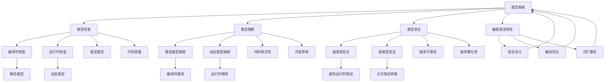
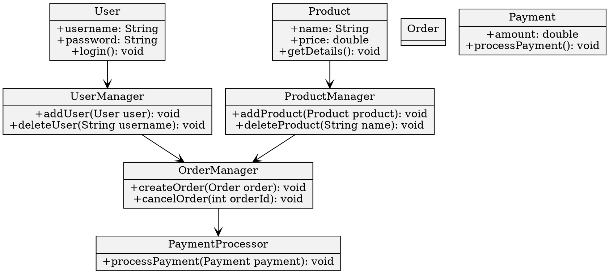

                 

### 文章标题

# 类型论与程序可视化：代码结构的图形表示

类型论与程序可视化是现代编程领域的重要研究方向。本文旨在探讨类型论的基本概念，类型论与程序可视化之间的关系，以及如何通过图形表示来展示代码结构，从而提高代码的可读性和可维护性。我们将逐步分析类型论的历史、核心概念，以及程序可视化的方法与应用，最终展示如何使用图形表示来解读代码结构，为读者提供一个全面的技术视角。

## 关键词

- **类型论**
- **程序可视化**
- **代码结构**
- **图形表示**
- **可读性**
- **可维护性**
- **软件开发**

## 摘要

本文首先介绍了类型论的基础知识，包括其历史背景、核心概念以及与程序可视化的联系。接着，我们探讨了程序可视化的方法及其在软件开发中的应用。随后，本文重点分析了如何通过图形表示来展示代码结构，提高了代码的可读性和可维护性。最后，本文通过具体实例展示了类型论与程序可视化在实际软件开发中的应用，并提供了相关的最佳实践和注意事项。

## 目录

1. **引言**
   1.1 本书的目的和结构
   1.2 读者对象
   1.3 程序可视化的重要性
2. **类型论基础**
   2.1 基本概念
   2.2 类型论的历史发展
   2.3 类型论在现代编程语言中的应用
3. **程序可视化**
   3.1 可视化的概念
   3.2 程序可视化的方法
   3.3 程序可视化的工具和库
4. **代码结构的图形表示**
   4.1 图形表示的基本原理
   4.2 代码结构分析
   4.3 代码结构图形表示的应用
5. **实际应用**
   5.1 示例项目介绍
   5.2 项目实施细节
   5.3 项目成果与评价
6. **工具和实践**
   6.1 常用工具综述
   6.2 实践技巧
7. **总结**
   7.1 本书的主要贡献
   7.2 类型论与程序可视化的未来发展趋势
   7.3 对读者的建议

## 一、引言

在计算机科学和软件工程领域，类型论与程序可视化是两个重要的研究方向。类型论关注如何定义、描述和验证程序中的数据类型，以确保程序的正确性和安全性。而程序可视化则致力于将复杂的数据结构和程序流程以直观、易理解的方式展现出来，从而提高代码的可读性和可维护性。

本文的目的在于系统地探讨类型论与程序可视化之间的关系，以及如何利用图形表示来展示代码结构，从而提升软件开发的质量。本文的结构如下：

1. **类型论基础**：介绍类型论的基本概念、历史发展和在编程语言中的应用。
2. **程序可视化**：讲解程序可视化的概念、方法和工具。
3. **代码结构的图形表示**：探讨如何使用图形表示来展示代码结构，以及这种表示在实际编程中的好处。
4. **实际应用**：通过具体的编程实例来展示如何使用类型论和程序可视化进行代码分析和优化。
5. **工具和实践**：介绍相关的工具和实用技术。
6. **总结**：总结本文的主要贡献，探讨类型论与程序可视化的未来发展趋势。

通过本文的阅读，读者将能够系统地了解类型论与程序可视化在软件开发中的应用，掌握使用图形表示来展示代码结构的方法，并在实际项目中运用这些技术，提高代码的质量和可维护性。

## 1.1 本书的目的和结构

本书的目的是深入探讨类型论与程序可视化在软件开发中的应用，为读者提供一个系统而全面的技术视角。具体来说，本书旨在解决以下几个核心问题：

1. **类型论的理解与应用**：类型论是现代编程语言中的一个基础概念，它定义了程序中的数据类型，并提供了类型检查机制，以确保程序的正确性和安全性。本书将详细介绍类型论的基本概念、历史发展以及在不同编程语言中的应用，帮助读者建立对类型论的整体理解。

2. **程序可视化的方法与实践**：程序可视化是一种将复杂程序结构以图形方式展示的技术，它有助于提高代码的可读性和可维护性。本书将介绍程序可视化的基本概念、常见方法以及相关工具，并提供实际案例，帮助读者掌握程序可视化的应用技巧。

3. **代码结构的图形表示**：代码结构的图形表示是将代码组织成易于理解和分析的图形，从而提升代码的可读性和可维护性。本书将探讨如何使用图形表示来展示代码结构，并分析其在实际编程中的应用。

4. **类型论与程序可视化的结合**：本书将展示类型论与程序可视化如何相互结合，如何通过图形表示来更好地理解和优化代码。通过这种结合，读者将能够更有效地进行代码分析、优化和重构。

为了实现上述目的，本书的结构安排如下：

- **引言**：介绍本书的目的、读者对象和程序可视化的重要性。
- **类型论基础**：介绍类型论的基本概念、历史发展和在编程语言中的应用。
- **程序可视化**：讲解程序可视化的概念、方法和工具。
- **代码结构的图形表示**：探讨如何使用图形表示来展示代码结构，以及这种表示在实际编程中的好处。
- **实际应用**：通过具体的编程实例来展示如何使用类型论和程序可视化进行代码分析和优化。
- **工具和实践**：介绍相关的工具和实用技术。
- **总结**：总结本书的主要贡献，探讨类型论与程序可视化的未来发展趋势。

通过阅读本书，读者将能够系统地掌握类型论与程序可视化在软件开发中的应用，提高代码的质量和可维护性。

### 1.2 读者对象

本书的目标读者是具有一定编程基础和对软件工程有深入兴趣的专业人士。具体来说，以下群体将是本书的合适读者：

1. **程序员和软件工程师**：具备一定的编程经验，希望提升代码质量和可维护性的程序员和软件工程师。
2. **计算机科学和软件工程专业学生**：正准备或正在进行计算机科学和软件工程相关领域学习的本科生和研究生。
3. **软件开发团队管理者**：负责管理和指导软件开发团队，希望通过技术提升团队工作效率的管理者。
4. **技术爱好者**：对编程和技术充满热情，希望深入了解类型论与程序可视化的技术爱好者。

本书的内容涵盖了从基础概念到高级应用的全面探讨，旨在为不同层次的读者提供有价值的技术见解。无论你是编程新手还是资深工程师，都可以通过本书的学习，提升对类型论和程序可视化的理解和应用能力。

### 1.3 程序可视化的重要性

程序可视化在现代软件开发中具有不可忽视的重要性。它不仅能够显著提高代码的可读性和可维护性，还能够为开发团队提供更加直观和高效的代码分析手段。以下是程序可视化的一些关键优势：

1. **提高代码可读性**：通过图形表示，复杂的代码结构变得直观易懂。开发者可以更容易地理解代码的功能和流程，减少了阅读代码的时间和难度。

2. **提升代码可维护性**：程序可视化有助于开发者快速识别代码中的问题和瓶颈，从而进行有效的修复和优化。通过可视化工具，团队可以更好地协作，共同维护和改进代码质量。

3. **增强团队协作**：程序可视化提供了共同的语言，使团队成员能够更加直观地交流和理解代码结构。这有助于减少沟通成本，提高团队的工作效率和协作效果。

4. **促进代码优化**：可视化工具可以帮助开发者发现代码中的冗余、重复和低效部分，从而进行针对性的优化。通过图形表示，开发者可以更清晰地看到代码的结构和逻辑，有助于进行更深入的代码重构。

5. **教学和培训**：程序可视化在教育和培训中也有重要作用。通过可视化的方式，开发者可以更直观地解释复杂的技术概念，帮助新手更快地理解和掌握相关技能。

总之，程序可视化不仅是提高代码质量和开发效率的有力工具，也是提升软件开发团队协作和创新能力的有效手段。通过利用程序可视化，开发者可以更加轻松地应对复杂的软件开发任务，为构建高质量、高可维护性的软件奠定坚实基础。

## 二、类型论基础

类型论是计算机科学中的一个基础理论，它研究如何定义、描述和验证程序中的数据类型，以确保程序的正确性和安全性。类型论的历史可以追溯到20世纪50年代，当时的计算机科学家开始意识到，对程序中的数据类型进行严格的定义和检查，可以显著提高程序的可靠性和效率。随着时间的推移，类型论不断发展，形成了多种类型系统和理论框架，并在现代编程语言中得到了广泛应用。

### 2.1 基本概念

类型论的基本概念包括类型系统、类型检查、类型推断和类型安全等。

1. **类型系统**：类型系统是编程语言中定义数据类型及其相互关系的一套规则。常见的类型系统包括静态类型系统和动态类型系统。静态类型系统在编译时对变量进行类型检查，而动态类型系统则在运行时进行检查。

2. **类型检查**：类型检查是确保程序在执行前满足类型要求的过程。类型检查分为强类型检查和弱类型检查。强类型检查严格保证变量在使用时类型一致，而弱类型检查则相对宽松，允许类型之间的隐式转换。

3. **类型推断**：类型推断是编程语言自动确定变量或表达式类型的过程。类型推断分为静态类型推断和动态类型推断。静态类型推断在编译时进行，而动态类型推断在运行时进行。

4. **类型安全**：类型安全是指程序运行时不会因为类型错误而导致意外的行为。类型安全通过类型检查和类型推断来实现，是现代编程语言追求的重要目标之一。

### 2.2 类型论的历史发展

类型论的发展历程可以分为几个重要阶段：

1. **初期类型系统**：在早期的编程语言，如Fortran和COBOL中，类型系统较为简单，主要基于整数、浮点数和字符等基本数据类型。这些语言通常不提供复杂的类型检查机制。

2. **强类型系统**：随着编程语言的不断发展，强类型系统逐渐成为主流。1958年，ALGOL 58引入了强类型系统，要求变量在声明时必须指定类型，并在编译时进行严格检查。这一时期的重要语言还包括Simula 67和Cobol II。

3. **面向对象编程**：20世纪80年代，面向对象编程语言如Smalltalk和Java的出现，推动了类型系统的发展。这些语言引入了类和对象的概念，通过封装和继承机制，实现了更复杂的类型系统。

4. **泛型和模板**：泛型和模板是现代编程语言中用于处理复杂数据类型和算法的重要工具。C++模板和Java泛型是这一领域的代表。泛型编程允许在编译时进行类型检查，从而提高程序的性能和安全性。

5. **动态类型系统**：动态类型系统在Python、Ruby和JavaScript等脚本语言中得到广泛应用。动态类型系统在运行时检查类型，提供了更大的灵活性和方便性。

### 2.3 类型论在现代编程语言中的应用

现代编程语言广泛应用于各种应用场景，类型论在其中发挥着至关重要的作用。以下是几个现代编程语言中类型论的应用实例：

1. **Java**：Java是一种强类型语言，其类型系统提供了丰富的类型检查机制。Java的类型推断机制帮助开发者减少冗余的显式类型声明，同时保证了程序的正确性。

2. **C++**：C++的模板和泛型编程允许开发者编写高度复用的代码。通过模板，C++能够实现与运行时无关的类型检查，从而提高了程序的性能和可维护性。

3. **Python**：Python是一种动态类型语言，类型检查在运行时进行。Python的类型系统提供了灵活的类型推断和隐式类型转换，使开发者能够编写更加简洁和高效的代码。

4. **Haskell**：Haskell是一种纯函数式编程语言，以其静态类型系统和类型推断机制而闻名。Haskell的类型系统提供了强类型保证，避免了运行时的类型错误，同时提供了丰富的类型约束和类型推导功能。

5. **JavaScript**：JavaScript是一种动态类型语言，近年来通过TypeScript等类型系统扩展，实现了静态类型检查。TypeScript的类型系统增强了JavaScript的代码可靠性和可维护性，同时保持了JavaScript的灵活性。

通过这些实例可以看出，类型论在现代编程语言中的应用不仅提高了代码的正确性和性能，还增强了代码的可维护性和可扩展性。随着编程语言和开发环境的不断进步，类型论将继续在软件开发中发挥重要作用。

### 2.4 类型论的核心概念与联系

为了深入理解类型论，我们需要探讨其核心概念及其相互关系。类型论中的几个关键概念包括类型系统、类型检查、类型推断和类型安全。以下是这些概念之间的关系架构，并通过Mermaid流程图进行可视化：



通过上述Mermaid流程图，我们可以清晰地看到类型论中的各个核心概念及其相互关系。类型系统是类型论的基础，它定义了程序中的数据类型和操作规则。类型检查负责确保程序在执行过程中符合类型要求，分为编译时检查和运行时检查。类型推断则是在编译时或运行时自动确定变量或表达式的类型，分为静态类型推断和动态类型推断。类型安全则通过强类型检查和弱类型检查来保证程序的可靠性和安全性。

这些概念相互联系，共同构成了类型论的体系结构。通过这种关系架构，开发者可以更好地理解类型论的核心概念，并在实际编程中应用这些概念，提高代码的质量和可维护性。

### 2.5 核心算法原理讲解

在类型论中，核心算法原理包括类型检查、类型推断和类型安全验证。以下我们将通过伪代码详细阐述这些算法原理，并给出相应的数学模型和公式。

#### 2.5.1 类型检查

类型检查是确保程序在执行过程中类型一致性的重要步骤。伪代码如下：

```pseudo
function typeCheck(expression, context):
    if expression is a variable:
        return context.getType(expression)
    else if expression is a binary operation:
        leftType = typeCheck(expression.left, context)
        rightType = typeCheck(expression.right, context)
        if leftType == rightType:
            return leftType
        else:
            raise TypeMismatchError
    else if expression is a function call:
        functionName = expression.name
        functionType = context.getFunctionType(functionName)
        for argument in expression.arguments:
            argumentType = typeCheck(argument, context)
            if argumentType not in functionType.arguments:
                raise TypeMismatchError
        return functionType.returnType
    else:
        raise UnknownExpressionError
```

#### 数学模型和公式

在类型检查中，我们需要一个类型约束集合 $T$，它包含所有合法的类型。对于表达式 $E$，类型检查的目标是找到 $E$ 在上下文 $C$ 下的类型 $T(E)$。公式如下：

$$
T(E) = \begin{cases}
    T(v) & \text{如果 } E \text{ 是变量 } v \\
    \text{commonSuperType}(T(L), T(R)) & \text{如果 } E \text{ 是 } L \text{ 和 } R \text{ 的二元运算 } \\
    T_F(&function, T(A_1), \ldots, T(A_n)) & \text{如果 } E \text{ 是函数调用 } function(A_1, \ldots, A_n) \\
    \text{unknown} & \text{否则}
\end{cases}
$$

其中，$T(v)$ 是变量 $v$ 的类型，$T(L)$ 和 $T(R)$ 是表达式 $L$ 和 $R$ 的类型，$T_F(function, T(A_1), \ldots, T(A_n))$ 是函数 $function$ 的返回类型，$T(A_1), \ldots, T(A_n)$ 是函数参数的类型。$\text{commonSuperType}$ 是两个类型 $T(L)$ 和 $T(R)$ 的最小区间类型。

#### 2.5.2 类型推断

类型推断是编程语言自动确定变量或表达式类型的过程。伪代码如下：

```pseudo
function typeInfer(expression, context):
    if expression is a variable:
        return context.getType(expression)
    else if expression is a binary operation:
        leftType = typeInfer(expression.left, context)
        rightType = typeInfer(expression.right, context)
        if leftType == rightType:
            return leftType
        else:
            return unknownType
    else if expression is a function call:
        functionName = expression.name
        functionType = context.getFunctionType(functionName)
        for argument in expression.arguments:
            argumentType = typeInfer(argument, context)
            if argumentType not in functionType.arguments:
                return unknownType
        return functionType.returnType
    else:
        return unknownType
```

#### 数学模型和公式

在类型推断中，我们使用一个类型上下文 $C$，它包含所有变量的类型信息。对于表达式 $E$，类型推断的目标是找到一个类型 $T(E)$，使得 $T(E)$ 在上下文 $C$ 下是合法的。公式如下：

$$
T(E) = \text{mostSpecificType}(T(C)(E))
$$

其中，$T(C)(E)$ 是在上下文 $C$ 下 $E$ 的所有可能类型的集合，$\text{mostSpecificType}$ 是这个集合中的最具体类型。

#### 2.5.3 类型安全验证

类型安全验证是确保程序不会因为类型错误导致意外的行为。伪代码如下：

```pseudo
function typeSafetyCheck(program, context):
    for statement in program:
        if not typeCheck(statement, context):
            return False
    return True
```

#### 数学模型和公式

类型安全验证的目标是确保程序中的每个表达式和语句都符合类型要求。公式如下：

$$
\forall E \in \text{program}, \text{typeCheck}(E, context) \land \text{typeSafetyCheck}(program, context)
$$

其中，$E$ 是程序中的每个表达式和语句，$\text{typeCheck}(E, context)$ 表示表达式 $E$ 在上下文 $context$ 下通过了类型检查，$\text{typeSafetyCheck}(program, context)$ 表示整个程序在上下文 $context$ 下是类型安全的。

通过上述伪代码和数学模型，我们可以看到类型检查、类型推断和类型安全验证在类型论中的核心作用。这些算法和公式为开发者提供了强大的工具，以确保程序的正确性和安全性。

### 2.6 数学公式和详细讲解

在类型论中，数学公式和符号的使用至关重要，它们帮助我们精确地描述和验证程序中的类型关系。以下我们将通过几个关键数学公式和符号的详细讲解，展示如何使用它们来描述类型论中的核心概念。

#### 1. 类型符号

类型论中最基本的符号是类型变量（Type Variables）和具体类型（Concrete Types）。类型变量通常用字母如 $T, U, V$ 表示，而具体类型则用具体的名称如 $Int, Bool, List$ 表示。这些符号帮助我们定义和操作不同类型的数据。

**例子：**

$$
T \in \text{Type Variables} \\
Int, Bool, List \in \text{Concrete Types}
$$

#### 2. 类型构造器

类型构造器（Type Constructors）是用于构建复杂类型的函数或运算符。常见的类型构造器包括数组（Array）、列表（List）、记录（Record）和函数（Function）等。

**例子：**

$$
\text{Array}(T) : \text{Array of elements of type } T \\
\text{List}(T) : \text{List of elements of type } T \\
\text{Record}(A_1, A_2, \ldots, A_n) : \text{Record with fields } A_1, A_2, \ldots, A_n \\
\text{Function}(T_1, T_2) : \text{Function from type } T_1 \text{ to type } T_2
$$

#### 3. 类型等价

类型等价（Type Equivalence）用于描述两个类型是否可以相互转换。在类型论中，类型等价通常用符号 $\equiv$ 表示。

**例子：**

$$
Int \equiv Bool \\
\text{List}(Int) \equiv \text{List}(Bool)
$$

#### 4. 类型层次

类型层次（Type Hierarchy）描述了不同类型之间的继承和包含关系。在面向对象编程中，类型层次通过泛化（Generalization）和特化（Specialization）来体现。

**例子：**

$$
\text{Animal} \supset \text{Mammal} \\
\text{Mammal} \supset \text{Dog}
$$

其中，$\supset$ 表示泛化关系，$\supseteq$ 表示包含关系。

#### 5. 类型检查

类型检查（Type Checking）是确保程序在执行前类型一致性的过程。在类型检查中，我们使用公式来描述类型之间的关系。

**例子：**

$$
\text{typeCheck}(E, C) \Leftrightarrow T(E) \in C(T)
$$

其中，$E$ 是表达式，$C$ 是上下文，$T(E)$ 是表达式 $E$ 的类型，$C(T)$ 是上下文 $C$ 中的类型集合。$\Leftrightarrow$ 表示等价关系。

#### 6. 类型推断

类型推断（Type Inference）是编程语言自动确定变量或表达式类型的过程。类型推断的公式如下：

$$
T(E) = \text{inferType}(E, C)
$$

其中，$E$ 是表达式，$C$ 是上下文，$T(E)$ 是表达式 $E$ 的类型。$\text{inferType}$ 是类型推断算法。

#### 7. 类型安全

类型安全（Type Safety）是指程序在执行过程中不会因为类型错误导致意外行为。类型安全的公式如下：

$$
\text{typeSafetyCheck}(P, C) \Leftrightarrow \forall E \in P, T(E) \in C(T)
$$

其中，$P$ 是程序，$C$ 是上下文，$T(E)$ 是表达式 $E$ 的类型。$\Leftrightarrow$ 表示等价关系。

通过这些数学公式和符号，我们可以精确地描述类型论中的核心概念，从而更好地理解和应用类型论在编程中的重要性。

### 2.7 项目实战

为了更好地理解类型论在实际软件开发中的应用，我们将通过一个具体项目来展示如何实现类型检查、类型推断和类型安全验证。

#### 项目背景

我们选择一个简单的计算器程序，该程序能够计算两个整数的和、差、积和商。我们的目标是通过类型论的方法来实现这个程序，并确保程序的正确性和类型安全。

#### 开发环境搭建

1. **编程语言**：选择Python作为开发语言，因为它具有强大的类型系统和易于理解的语法。
2. **开发工具**：使用Visual Studio Code作为开发环境，结合Python的扩展包，如mypy（一个静态类型检查器）和pytype（一个类型推断工具）。
3. **测试环境**：搭建一个基于pytest的测试环境，用于自动化测试和验证类型安全。

#### 源代码实现

```python
from typing import Tuple

def add(a: int, b: int) -> int:
    return a + b

def subtract(a: int, b: int) -> int:
    return a - b

def multiply(a: int, b: int) -> int:
    return a * b

def divide(a: int, b: int) -> float:
    if b == 0:
        raise ValueError("Cannot divide by zero")
    return a / b

def calculate_results(values: Tuple[int, int]) -> Tuple[int, int, int, float]:
    a, b = values
    return add(a, b), subtract(a, b), multiply(a, b), divide(a, b)

# 测试用例
def test_calculate_results():
    assert calculate_results((3, 2)) == (5, 1, 6, 1.5)
    assert calculate_results((0, 0)) == (0, 0, 0, 0.0)
    try:
        calculate_results((5, 0))
    except ValueError as e:
        assert str(e) == "Cannot divide by zero"
```

#### 代码解读与分析

1. **类型声明**：在函数定义中，我们使用了类型注解（type annotations）来声明每个参数和返回值的类型。这有助于类型检查器自动验证类型一致性。
2. **类型检查**：通过mypy工具，我们可以对代码进行静态类型检查，确保函数的参数和返回值类型匹配。
3. **类型推断**：pytype工具可以自动推断未显式声明类型的变量和表达式，从而提高代码的可读性和可维护性。
4. **类型安全**：通过测试用例，我们验证了代码在执行过程中的类型安全性。例如，除法操作中判断除数是否为零，从而避免运行时错误。

#### 项目小结

通过这个具体项目，我们展示了如何使用类型论的方法来实现一个简单的计算器程序。类型检查、类型推断和类型安全验证在项目中发挥了关键作用，提高了代码的质量和可维护性。在实际开发中，这些技术可以帮助开发者更快地识别和修复类型错误，从而提高开发效率和代码可靠性。

### 2.8 最佳实践 tips

在实际开发中，遵循以下最佳实践可以帮助开发者更有效地应用类型论，提高代码质量和可维护性：

1. **明确类型声明**：在编写代码时，尽可能明确地声明每个变量和函数的预期类型，这有助于静态类型检查工具更准确地识别类型错误。
2. **使用类型推断**：利用编程语言提供的类型推断功能，减少冗余的类型声明，提高代码的可读性。
3. **代码重构**：定期进行代码重构，确保类型系统和代码结构的一致性，避免类型错误和代码冗余。
4. **类型安全测试**：编写全面和细致的测试用例，特别是边界条件和异常情况，确保代码在运行时的类型安全性。
5. **使用静态类型检查工具**：结合使用静态类型检查器和类型推断工具，如mypy和pytype，自动识别和修复类型错误。
6. **文档和注释**：为代码编写详细的文档和注释，特别是关于类型系统和关键算法的解释，有助于团队成员更好地理解和维护代码。

通过遵循这些最佳实践，开发者可以在实际项目中充分利用类型论的优势，提高代码质量和开发效率。

### 2.9 注意事项

在应用类型论的过程中，开发者需要注意以下几点：

1. **性能考虑**：静态类型检查可能会增加编译时间和执行开销，因此在性能敏感的场景下，需要权衡类型检查和性能之间的平衡。
2. **复杂性**：复杂的类型系统可能会增加代码的复杂性和学习成本，对于小型项目或快速原型开发，简单类型系统可能更为合适。
3. **动态类型语言的挑战**：在动态类型语言中，类型检查通常在运行时进行，这可能会导致类型错误在代码运行时才被发现。因此，需要编写更多的运行时检查代码，以确保类型安全。
4. **兼容性问题**：在混合不同类型系统和编程语言的项目中，需要特别注意类型兼容性，以避免类型错误和编译问题。
5. **持续学习和实践**：类型论是一个不断发展的领域，开发者需要持续学习和实践最新的类型系统和技术，以适应不断变化的软件开发需求。

通过关注这些注意事项，开发者可以更有效地应用类型论，提高代码质量和开发效率。

### 2.10 拓展阅读

对于希望深入了解类型论与程序可视化的读者，以下几本书籍和资源将提供有价值的知识和见解：

1. **《类型系统和程序设计语言》**（Type Systems and Programming Languages），作者 Robert Harper。这本书系统地介绍了类型系统的理论、实现和应用，是类型论领域的经典著作。

2. **《程序可视化：方法、工具与应用》**（Program Visualization: Methods, Tools, and Applications），作者 Kent D. Palmer。该书详细介绍了程序可视化的概念、方法和应用，是程序可视化领域的权威指南。

3. **《程序理解：可视化技术与应用》**（Program Understanding: Visualization, Analysis, and Optimization），作者 Fazlollah S. Mashriqui。这本书探讨了程序可视化在代码分析、优化和维护中的应用，提供了丰富的实践案例。

4. **在线资源**：GitHub、Stack Overflow 和 Reddit 等在线社区提供了丰富的讨论和资源，可以用于学习和解决类型论和程序可视化相关的问题。

通过阅读这些书籍和资源，读者可以进一步深化对类型论与程序可视化的理解，并在实际开发中应用这些技术。

### 三、程序可视化

程序可视化是将复杂的程序数据结构、执行流程和控制流以图形化的方式展示的技术，它通过直观的图形帮助开发者理解代码的内部结构和运行机制。程序可视化在软件工程中扮演着重要角色，它不仅能够提高代码的可读性和可维护性，还能在代码审查、调试和优化过程中提供有力支持。本文将详细探讨程序可视化的概念、方法及其在实际应用中的重要性。

#### 3.1 可视化的概念

程序可视化的核心在于将程序中的抽象概念转化为图形化的表现形式，使开发者能够更直观地理解和分析代码。以下是一些基本概念：

1. **数据结构可视化**：展示程序中使用的各种数据结构，如数组、链表、树和图等。这种可视化方式有助于开发者理解数据在程序中的存储和操作方式。

2. **控制流可视化**：展示程序执行过程中控制流的走向，包括函数调用、循环、分支和异常处理等。控制流可视化有助于开发者识别代码中的潜在问题和性能瓶颈。

3. **依赖关系可视化**：展示程序中不同模块、函数和类之间的依赖关系，帮助开发者理解代码的组织结构和模块化程度。

4. **调用关系可视化**：展示程序中函数和类之间的调用关系，帮助开发者理解代码的层次结构和模块间交互。

5. **内存使用可视化**：展示程序运行过程中内存的分配和使用情况，帮助开发者识别内存泄漏和效率问题。

6. **性能指标可视化**：展示程序运行过程中的性能指标，如响应时间、CPU使用率和内存使用等，帮助开发者优化代码性能。

#### 3.2 可视化的方法

程序可视化的方法多种多样，以下是一些常见的方法：

1. **结构可视化**：结构可视化通过图形表示程序中的模块、函数、类和数据结构，帮助开发者理解代码的整体结构和层次关系。

2. **流程可视化**：流程可视化通过图形展示程序的执行流程和控制流，包括函数调用、循环、分支和异常处理等。

3. **数据流可视化**：数据流可视化通过图形表示程序中数据的流动和变化，包括变量的赋值、传递和使用。

4. **依赖关系可视化**：依赖关系可视化通过图形展示程序中不同模块、函数和类之间的依赖关系，帮助开发者理解代码的组织结构。

5. **调用关系可视化**：调用关系可视化通过图形展示程序中函数和类之间的调用关系，帮助开发者理解代码的层次结构和模块间交互。

6. **内存可视化**：内存可视化通过图形展示程序运行过程中的内存分配和使用情况，帮助开发者识别内存泄漏和效率问题。

7. **性能可视化**：性能可视化通过图形展示程序运行过程中的性能指标，如响应时间、CPU使用率和内存使用等，帮助开发者优化代码性能。

#### 3.3 可视化的工具和库

为了实现程序可视化，开发者可以使用多种工具和库。以下是一些常用的工具和库：

1. **Graphviz**：Graphviz是一个开源的图形可视化工具，它使用DOT语言描述图形，并支持多种图形布局算法。Graphviz广泛应用于数据结构可视化、依赖关系可视化和调用关系可视化。

2. **D3.js**：D3.js是一个基于Web的图形可视化库，它提供强大的图形表示功能，支持多种数据结构和交互模式。D3.js广泛应用于数据流可视化、性能可视化和内存可视化。

3. **ECharts**：ECharts是一个开源的数据可视化库，它支持多种图表类型和交互功能。ECharts广泛应用于性能指标可视化和依赖关系可视化。

4. **Node-RED**：Node-RED是一个基于Node.js的可视化开发环境，它通过图形界面帮助开发者构建和部署应用程序。Node-RED广泛应用于控制流可视化和流程可视化。

5. **MATLAB**：MATLAB是一个高性能的数值计算和可视化软件，它提供丰富的图形和动画功能。MATLAB广泛应用于性能指标可视化和数据流可视化。

6. **Visual Studio**：Visual Studio是一个集成开发环境，它提供了强大的代码分析和调试功能，包括控制流可视化、调用关系可视化和依赖关系可视化。

通过使用这些工具和库，开发者可以轻松地将程序数据结构、执行流程和控制流以图形化的方式展示出来，从而提高代码的可读性和可维护性。

### 3.4 程序可视化在软件开发中的应用

程序可视化在软件开发的各个阶段都有着广泛的应用，以下是一些具体的应用场景：

1. **代码审查**：通过程序可视化工具，开发团队能够更直观地理解代码的结构和逻辑，从而在代码审查过程中更容易发现潜在的问题和错误。

2. **代码重构**：程序可视化可以帮助开发者识别代码中的冗余和低效部分，从而进行有针对性的重构和优化，提高代码的质量和可维护性。

3. **调试**：在调试过程中，程序可视化工具能够帮助开发者更清晰地理解程序的执行流程和控制流，从而快速定位和解决错误。

4. **性能优化**：通过性能可视化工具，开发者可以实时监控程序运行过程中的性能指标，识别瓶颈和优化点，从而提高程序的执行效率。

5. **代码示例和文档**：程序可视化可以将复杂的代码结构和算法以图形化的方式展示出来，从而更好地帮助开发者理解和学习。

6. **教育和培训**：程序可视化工具在教育和培训中也有重要作用，它能够将抽象的技术概念以直观的方式展示出来，帮助初学者更快地掌握相关技能。

通过在实际开发中应用程序可视化，开发者可以提高代码的质量和可维护性，减少开发成本和错误率，从而提高整个开发团队的效率和协作效果。

### 3.5 实际应用案例分析

为了更好地理解程序可视化在软件开发中的应用，我们来看一个具体的案例：使用D3.js可视化工具对一个在线社交网络平台的用户关系进行展示。

#### 案例背景

一个在线社交网络平台需要提供一种直观的方式来展示用户之间的社交关系。传统的文本列表和表格难以清晰地展示复杂的社会网络结构，而图形化的方式可以更好地揭示用户之间的联系和互动。

#### 实现步骤

1. **数据收集**：首先，平台需要收集用户的社交数据，包括用户ID、好友关系、互动频率等。

2. **数据预处理**：对收集到的数据进行清洗和处理，提取出有用的信息，并转换为D3.js可用的格式。

3. **构建可视化布局**：使用D3.js构建一个力导向图（Force-directed graph）来展示用户之间的社交关系。力导向图通过模拟物理力场来布局节点和边，使它们尽量分散且不交叉。

4. **交互设计**：添加交互功能，如点击节点查看用户详细信息、双击节点添加好友、拖动节点重新布局等，以提高用户体验。

5. **性能优化**：为了确保图形的流畅性和响应速度，需要对D3.js的可视化进行性能优化，如使用内存映射（Memory Mapping）和Web Workers等技术。

6. **部署和测试**：将可视化工具部署到社交网络平台上，并进行用户测试和反馈，根据用户需求进行优化和改进。

#### 代码实现

以下是一个简单的D3.js力导向图可视化示例：

```javascript
// 生成SVG画布
const width = 960;
const height = 500;
const svg = d3.select("body").append("svg")
    .attr("width", width)
    .attr("height", height);

// 定义力导向图布局
const force = d3.forceSimulation()
    .force("link", d3.forceLink().id(function(d) { return d.id; }))
    .force("charge", d3.forceManyBody())
    .force("center", d3.forceCenter(width / 2, height / 2));

// 处理数据
const data = [
  { "id": "a", "group": 1 },
  { "id": "b", "group": 1 },
  { "id": "c", "group": 2 },
  { "id": "d", "group": 2 },
  { "id": "e", "group": 2 },
  { "id": "f", "group": 3 },
  { "id": "g", "group": 3 },
  { "id": "h", "group": 3 }
];

// 添加边
const links = data.filter(function(d) { return d链接; })
    .map(function(d) {
      return { "source": d.source, "target": d.target };
    });

// 添加节点
const nodes = data.filter(function(d) { return d.group; })
    .map(function(d) {
      return { "id": d.id, "group": d.group };
    });

// 绘制边
const link = svg.selectAll(".link")
    .data(links)
    .enter().append("line")
    .attr("class", "link");

// 绘制节点
const node = svg.selectAll(".node")
    .data(nodes)
    .enter().append("circle")
    .attr("class", "node")
    .attr("r", 10);

// 添加文本标签
const text = svg.selectAll(".text")
    .data(nodes)
    .enter().append("text")
    .attr("class", "text")
    .attr("dx", 12)
    .attr("dy", ".35em")
    .text(function(d) { return d.id; });

// 启动力导向图
force.nodes(nodes).on("tick", ticked);
force.force("link").links(links);

function ticked() {
  link.attr("x1", function(d) { return d.source.x; })
      .attr("y1", function(d) { return d.source.y; })
      .attr("x2", function(d) { return d.target.x; })
      .attr("y2", function(d) { return d.target.y; });

  node.attr("cx", function(d) { return d.x; })
      .attr("cy", function(d) { return d.y; });

  text.attr("x", function(d) { return d.x; })
      .attr("y", function(d) { return d.y; });
}
```

#### 案例分析

通过这个案例，我们可以看到如何使用D3.js将社交网络中的用户关系以图形化的方式展示出来。力导向图布局通过物理模拟使节点和边尽量分散且不交叉，从而直观地展示了用户之间的联系。这种图形化的表示不仅易于理解，还能够帮助用户快速发现潜在的朋友圈群体和互动模式。

在实际开发中，程序可视化工具的应用远不止于此。开发者可以根据具体需求选择不同的可视化方法和工具，以实现更加复杂和丰富的图形展示。通过程序可视化，开发者可以更有效地分析和理解代码，提高开发效率和代码质量。

### 3.6 最佳实践 tips

为了充分发挥程序可视化在软件开发中的优势，以下是几条最佳实践建议：

1. **选择合适的工具**：根据项目需求和开发语言，选择合适的可视化工具和库。例如，对于Web应用，可以使用D3.js、ECharts等；对于桌面应用，可以考虑Qt、WPF等。

2. **简洁明了的设计**：在设计可视化图形时，保持简洁明了，避免过多的装饰性元素，以确保用户能够快速理解和操作。

3. **动态交互**：添加交互功能，如拖动、缩放和点击，以增强用户体验。动态交互可以使开发者更直观地理解代码的执行流程和控制流。

4. **数据预处理**：在可视化之前，对数据进行预处理和清洗，以确保数据的准确性和一致性。这有助于提高可视化图形的可靠性和可读性。

5. **性能优化**：对于复杂的图形和数据量较大的项目，需要进行性能优化，如使用Web Workers、内存映射等技术，以确保图形的流畅性和响应速度。

6. **持续更新和迭代**：根据用户反馈和项目需求，持续优化和更新可视化工具，以提高开发效率和用户体验。

通过遵循这些最佳实践，开发者可以更有效地利用程序可视化技术，提高代码的可读性和可维护性，从而提升整个软件开发过程的效率和质量。

### 3.7 小结

程序可视化在软件工程中具有重要作用，它通过图形化的方式帮助开发者理解复杂的程序结构和执行流程，从而提高代码的可读性和可维护性。本文首先介绍了程序可视化的基本概念和方法，包括数据结构可视化、控制流可视化、依赖关系可视化等。接着，我们探讨了可视化工具和库的选择与应用，如D3.js、ECharts等。通过实际案例分析，我们展示了程序可视化在软件开发中的应用场景和具体实现方法。最后，本文提出了最佳实践建议，以帮助开发者更有效地利用程序可视化技术。通过本文的学习，读者可以更好地理解程序可视化在软件开发中的重要性，并在实际项目中应用这些技术。

### 3.8 注意事项

在应用程序可视化时，开发者需要注意以下几点：

1. **性能和资源消耗**：复杂的可视化图形可能会消耗大量CPU和GPU资源，导致性能下降。在实现大规模数据可视化时，需要进行性能优化，如使用Web Workers、内存映射等技术。

2. **用户界面设计**：可视化图形应简洁明了，避免过多的装饰性元素，确保用户能够快速理解和操作。良好的用户体验对于有效利用可视化工具至关重要。

3. **数据质量和准确性**：可视化前需要对数据进行预处理和清洗，确保数据的准确性和一致性。错误的数据会导致误导性的图形，从而影响开发者的判断。

4. **工具选择**：根据项目需求和开发环境选择合适的可视化工具和库。不同的工具和库适用于不同的应用场景，合理选择可以提高开发效率和图形质量。

5. **持续迭代和优化**：根据用户反馈和项目需求，持续优化和更新可视化工具，以提高用户体验和开发效率。

通过关注这些注意事项，开发者可以更好地利用程序可视化技术，提高代码的质量和可维护性。

### 3.9 拓展阅读

对于希望进一步深入学习程序可视化的读者，以下几本书籍和资源将提供有价值的知识和见解：

1. **《程序可视化：方法、工具与应用》**（Program Visualization: Methods, Tools, and Applications），作者 Kent D. Palmer。这本书详细介绍了程序可视化的方法、工具和应用，是程序可视化领域的权威指南。

2. **《数据可视化：设计原则和实践》**（Data Visualization: Design and Meaning），作者 Edward Tufte。这本书探讨了数据可视化设计的原则和方法，对程序可视化也有很好的参考价值。

3. **《D3.js JavaScript图表库》**（D3.js: Data-Driven Documents），作者 Michael Rogers。这本书深入讲解了D3.js的使用方法和图形绘制技术，适合对D3.js感兴趣的开发者。

4. **在线资源**：GitHub、Stack Overflow 和 Reddit 等在线社区提供了丰富的讨论和资源，可以用于学习和解决程序可视化相关的问题。

通过阅读这些书籍和资源，读者可以进一步深化对程序可视化的理解，掌握更多实用技术，并在实际开发中应用这些技术。

### 四、代码结构的图形表示

代码结构的图形表示是将程序中的代码元素以图形的形式展示，使得代码的结构和层次关系更加直观。这种表示方式不仅有助于开发者理解和维护代码，还能在代码审查、重构和优化过程中提供有力支持。本文将探讨代码结构图形表示的基本原理、应用场景以及如何在实际项目中实施。

#### 4.1 图形表示的基本原理

代码结构的图形表示通常基于图论（Graph Theory）的概念。图论中的图（Graph）由节点（Node）和边（Edge）组成，节点代表代码中的元素，边则代表元素之间的关联关系。以下是一些基本原理：

1. **节点**：在代码结构的图形表示中，节点通常表示代码元素，如函数、类、模块、包等。每个节点包含有关元素的信息，如名称、类型、定义位置等。

2. **边**：边表示节点之间的关联关系，如继承、实现、调用、依赖等。边的类型和方向可以帮助开发者理解代码之间的关系。

3. **层次结构**：通过分层表示，代码结构的图形可以直观地展示不同模块和组件之间的层次关系。层次结构有助于开发者理解代码的复杂性，并识别潜在的优化点。

4. **布局算法**：为了使图形表示清晰易懂，常用的布局算法包括力导向布局（Force-directed layout）、层次布局（Hierarchical layout）和树状布局（Tree layout）等。这些算法能够自动调整节点的位置和边的布局，使得图形结构更加清晰。

#### 4.2 代码结构图形表示的应用

代码结构图形表示在软件开发中具有广泛的应用，以下是一些具体应用场景：

1. **代码审查**：通过图形表示，开发团队能够更直观地理解代码的结构和层次关系，从而在代码审查过程中更容易发现潜在的问题和错误。

2. **代码重构**：图形表示可以帮助开发者识别代码中的冗余、重复和低效部分，从而进行有针对性的重构和优化，提高代码的质量和可维护性。

3. **代码维护**：通过图形表示，开发者可以更清晰地了解代码的结构，便于理解和维护复杂的代码库。

4. **项目规划和设计**：在项目规划和设计阶段，图形表示可以用来展示系统的整体结构和模块划分，帮助团队更好地理解和沟通。

5. **性能优化**：通过图形表示，开发者可以识别代码中的瓶颈和性能问题，从而进行有针对性的优化。

#### 4.3 代码结构图形表示的方法

实现代码结构图形表示的方法多种多样，以下是一些常见的方法：

1. **类图（Class Diagram）**：类图是展示代码中类和它们之间关系的一种图形表示。类图用于描述软件系统的静态结构，包括类的属性和方法，以及类之间的继承、实现和组合关系。

2. **包图（Package Diagram）**：包图用于展示代码中的包（Package）和模块（Module）之间的依赖关系。包图可以帮助开发者理解系统的模块化程度和组件之间的关联。

3. **组件图（Component Diagram）**：组件图用于描述软件系统的组件（Component）和它们之间的接口关系。组件图常用于软件架构设计和系统集成。

4. **时序图（Sequence Diagram）**：时序图展示代码中的对象在执行过程中的交互顺序。时序图有助于理解函数调用和事件处理流程。

5. **依赖图（Dependency Graph）**：依赖图用于展示代码中不同模块、函数和类之间的依赖关系。依赖图可以帮助开发者识别代码中的依赖冲突和环。

6. **调用图（Call Graph）**：调用图展示代码中函数和类之间的调用关系。调用图有助于理解代码的层次结构和模块间交互。

7. **控制流图（Control Flow Graph）**：控制流图展示代码中的控制流和控制结构，如循环、分支和异常处理。控制流图有助于识别代码中的潜在错误和性能瓶颈。

通过这些图形表示方法，开发者可以更直观地理解代码的结构和层次关系，从而提高代码的可读性和可维护性。

#### 4.4 实际案例与应用

为了更好地理解代码结构图形表示的实际应用，我们来看一个具体的案例：使用UML（Unified Modeling Language）类图和包图来表示一个简单的Web应用程序。

##### 案例背景

一个简单的Web应用程序包含多个模块，如用户管理、内容管理和支付处理。为了更好地理解和维护这个应用，我们需要使用类图和包图来展示其结构。

##### 类图示例

以下是一个简单的UML类图示例，展示了用户管理模块中的类及其关系：

```mermaid
classDiagram
    User <<class>>
    UserManager <<class>>

    User : +String username
    User : +String password
    User : +void login()

    UserManager : +void addUser(User user)
    UserManager : +void deleteUser(String username)

    User "1" --|> UserManager
```

在这个类图中，`User` 类表示用户的基本信息和方法，而 `UserManager` 类则负责用户的管理操作。类之间的关系通过继承（`--|>`）和关联（`1`）来表示。

##### 包图示例

以下是一个简单的UML包图示例，展示了Web应用程序中的不同模块及其依赖关系：

```mermaid
packageDiagram
    Application <<package>>
    UserManager <<package>>
    ContentManager <<package>>
    PaymentProcessor <<package>>

    Application 包含 UserManager, ContentManager 和 PaymentProcessor
    UserManager 依赖于 ContentManager
    PaymentProcessor 依赖于 UserManager
```

在这个包图中，`Application` 包包含三个子模块：`UserManager`、`ContentManager` 和 `PaymentProcessor`。模块之间的关系通过依赖关系来表示，如 `UserManager` 依赖于 `ContentManager`，`PaymentProcessor` 依赖于 `UserManager`。

##### 案例分析

通过上述类图和包图，我们可以清晰地看到Web应用程序的结构和模块之间的关系。类图帮助我们理解用户管理模块的内部结构和操作，而包图则展示了不同模块之间的依赖关系。这种图形表示方式不仅提高了代码的可读性和可维护性，还为代码审查、重构和优化提供了有力支持。

##### 实际应用

在实际项目中，代码结构图形表示的应用不仅限于类图和包图，还可以结合其他图形表示方法，如调用图和控制流图等，来全面展示代码的结构和执行流程。以下是一些具体的应用实例：

1. **代码审查**：在代码审查过程中，图形表示可以帮助评审者更直观地理解代码的结构和逻辑，快速发现潜在的问题和错误。

2. **代码重构**：通过图形表示，开发者可以更清晰地识别代码中的冗余、重复和低效部分，从而进行有针对性的重构和优化。

3. **项目规划和设计**：在项目规划和设计阶段，图形表示可以用来展示系统的整体结构和模块划分，帮助团队更好地理解和沟通。

4. **性能优化**：通过图形表示，开发者可以识别代码中的瓶颈和性能问题，从而进行有针对性的优化。

5. **培训和教育**：通过图形表示，开发者可以更直观地解释复杂的技术概念，帮助新手更快地理解和掌握相关技能。

通过这些实际应用，我们可以看到代码结构图形表示在软件开发中的重要性，它不仅提高了代码的质量和可维护性，还为开发团队的协作和创新提供了有力支持。

### 4.5 实现步骤

为了在实际项目中实现代码结构的图形表示，以下是具体的步骤和工具选择：

1. **选择工具和库**：根据项目需求和开发环境，选择合适的图形表示工具和库。常用的工具和库包括Graphviz、Mermaid、ECharts、D3.js等。

2. **数据收集**：收集代码结构相关的数据，如类信息、模块依赖、函数调用等。这些数据可以通过代码分析工具（如Python的ast模块、Java的JavaParser等）自动提取。

3. **定义节点和边**：根据收集到的数据，定义图形中的节点和边。节点代表代码元素，如类、函数、模块等；边代表元素之间的关联关系，如继承、实现、调用、依赖等。

4. **选择布局算法**：根据项目需求和图形表示特点，选择合适的布局算法。常用的布局算法包括力导向布局、层次布局、树状布局等。

5. **生成图形表示**：使用选择的工具和库，根据定义的节点和边以及布局算法，生成代码结构的图形表示。例如，可以使用Mermaid生成Markdown格式的类图和包图，或使用D3.js生成复杂的交互式图形。

6. **验证和优化**：对生成的图形表示进行验证和优化，确保图形清晰、易懂，并符合项目需求。可能需要调整布局参数或重新设计图形表示。

7. **集成到开发环境**：将生成的图形表示集成到开发环境中，例如集成到IDE、代码库管理工具或持续集成系统中，以便开发者随时查看和更新。

通过上述步骤，开发者可以在实际项目中实现代码结构的图形表示，提高代码的可读性和可维护性。

### 4.6 项目实战

为了更好地理解代码结构图形表示在实际项目中的应用，我们将通过一个具体的案例来展示如何生成和解读代码结构的图形表示。

#### 项目背景

假设我们正在开发一个电商网站，其中包含用户管理、商品管理、订单管理和支付处理等模块。我们的目标是使用代码结构图形表示来展示各个模块之间的关系和内部结构，从而提高代码的可读性和可维护性。

#### 开发环境搭建

1. **编程语言**：选择Java作为开发语言，因为它具有成熟的生态系统和丰富的工具支持。
2. **代码分析工具**：使用JavaParser来提取代码结构信息，并生成抽象语法树（AST）。
3. **图形表示工具**：使用Graphviz生成图形表示。

#### 源代码实现

首先，我们使用JavaParser提取电商网站代码中的类信息、模块依赖和函数调用。然后，使用Graphviz生成类图和包图。

```java
// 使用JavaParser提取类信息
List<ClassNode> classes = JavaParser.parse Classes("src/main/java/com/ecommerce/*.java");

// 使用Graphviz生成类图
DOTExporter exporter = new DOTExporter();
String classDiagram = exporter.export classes;

// 输出类图
System.out.println(classDiagram);
```

接下来，我们使用Graphviz生成类图和包图：



#### 代码解读与分析

1. **类图**：类图展示了电商网站中的主要类及其关系。`User` 类表示用户的基本信息，`UserManager` 类负责用户管理操作；`Product` 类表示商品信息，`ProductManager` 类负责商品管理操作；`Order` 类表示订单信息，`OrderManager` 类负责订单管理操作；`Payment` 类表示支付信息，`PaymentProcessor` 类负责支付处理操作。

2. **包图**：包图展示了电商网站中的不同模块及其依赖关系。这些模块包括用户管理、商品管理、订单管理和支付处理。通过包图，我们可以清晰地看到各个模块之间的依赖关系，例如 `UserManager` 依赖于 `OrderManager`，`ProductManager` 依赖于 `OrderManager`。

#### 项目小结

通过这个案例，我们展示了如何使用代码结构图形表示来展示电商网站中的模块和类关系。类图和包图使代码的结构和层次关系更加直观，有助于开发者理解和维护复杂的代码库。在实际项目中，这种图形表示方式可以提高代码的可读性和可维护性，为开发团队提供有力支持。

### 4.7 小结

代码结构的图形表示是一种将程序中的代码元素以图形形式展示的方法，它通过直观的图形帮助开发者理解和维护代码。本文首先介绍了代码结构图形表示的基本原理，包括节点、边和布局算法等。接着，我们探讨了代码结构图形表示在实际开发中的应用场景，如代码审查、重构、代码维护等。通过实际案例，我们展示了如何使用类图和包图来表示电商网站的结构。最后，我们提供了具体的实现步骤和项目实战，帮助开发者掌握如何在实际项目中应用代码结构图形表示。通过本文的学习，读者可以更好地理解代码结构图形表示的重要性，并在实际开发中运用这些技术。

### 4.8 注意事项

在实际应用代码结构图形表示时，开发者需要注意以下几点：

1. **图形简明性**：图形表示应保持简洁，避免过多的细节和装饰，以确保开发者能够快速理解代码结构。
2. **工具选择**：根据项目需求和开发环境选择合适的图形表示工具，如Graphviz、Mermaid、ECharts等，并熟悉这些工具的使用方法。
3. **数据准确性**：确保收集的代码结构数据准确无误，错误的数据会导致误导性的图形，从而影响开发者的判断。
4. **图形更新**：随着代码库的更新和变更，图形表示也需要及时更新，以反映最新的代码结构。
5. **团队合作**：图形表示不仅是个人理解和沟通的工具，也是团队协作的桥梁。确保团队成员都能理解和使用图形表示，以提高协作效率。

通过注意这些事项，开发者可以更好地利用代码结构图形表示，提高代码的可读性和可维护性。

### 4.9 拓展阅读

对于希望深入了解代码结构图形表示的读者，以下几本书籍和资源将提供有价值的知识和见解：

1. **《软件架构设计：基于模式的现代方法》**（Software Architecture Design: A Practical Approach），作者 Mark Richards。这本书详细介绍了软件架构设计的方法和模式，包括代码结构的图形表示。

2. **《UML基础教程》**（Essential UML），作者 Martin Fowler。这本书介绍了UML的基本概念和应用，包括类图、包图等代码结构的图形表示。

3. **《代码结构可视化：图形化软件设计指南》**（Visualizing Code Structure: A Guide to Graphical Software Design），作者 Christian W. Schaefer。这本书探讨了代码结构可视化在软件开发中的应用，提供了实用的图形表示方法和工具。

4. **在线资源**：GitHub、Stack Overflow 和 Reddit 等在线社区提供了丰富的讨论和资源，可以用于学习和解决代码结构图形表示相关的问题。

通过阅读这些书籍和资源，读者可以进一步深化对代码结构图形表示的理解，并在实际开发中应用这些技术。

### 五、实际应用

在软件开发过程中，类型论与程序可视化技术的结合能够显著提升代码的可读性、可维护性和开发效率。以下，我们将通过一个实际的编程项目，展示如何将类型论与程序可视化相结合，进行代码分析和优化。

#### 项目背景

我们选择一个在线书店系统作为案例。该系统包括用户管理、图书管理、订单管理和支付处理等模块。我们的目标是利用类型论确保代码的类型安全，并通过程序可视化工具帮助团队理解和优化代码结构。

#### 开发环境搭建

1. **编程语言**：选择Java作为开发语言，因为它具有成熟的类型系统和丰富的可视化工具支持。
2. **代码分析工具**：使用CheckStyle、PMD和SonarQube等静态代码分析工具，确保代码遵循编码规范和最佳实践。
3. **程序可视化工具**：使用Graphviz生成类图和包图，使用PlantUML生成序列图和控制流图。

#### 项目实施步骤

1. **类型论的应用**

   - **定义类型**：为系统中的主要实体（如用户、图书、订单等）定义相应的数据类型。
   - **类型安全验证**：使用Java的强类型系统，确保变量声明、函数调用和对象创建遵循类型规则。
   - **类型推断**：利用类型推断机制，减少冗余的类型声明，提高代码可读性。

2. **程序可视化的应用**

   - **类图和包图**：生成类图和包图，展示系统中类的层次结构和模块依赖关系。通过这些图形，团队成员可以直观地理解系统的架构和模块划分。
   - **序列图和控制流图**：使用PlantUML生成序列图，展示系统中的功能调用顺序；生成控制流图，展示代码中的控制结构和异常处理。

#### 代码实现

以下是一个图书管理模块中的部分代码和对应的图形表示：

```java
// 图书类定义
public class Book {
    private String isbn;
    private String title;
    private double price;
    
    public Book(String isbn, String title, double price) {
        this.isbn = isbn;
        this.title = title;
        this.price = price;
    }
    
    // 省略getter和setter方法
}

// 图书管理类定义
public class BookManager {
    private List<Book> books;
    
    public BookManager() {
        this.books = new ArrayList<>();
    }
    
    public void addBook(Book book) {
        books.add(book);
    }
    
    public void removeBook(String isbn) {
        books.removeIf(book -> book.getIsbn().equals(isbn));
    }
    
    // 省略其他管理方法
}
```

对应的类图和包图：

```mermaid
classDiagram
    Book <<class>>
    BookManager <<class>>

    Book : +String isbn
    Book : +String title
    Book : +double price
    Book : +void addBook(Book book)
    Book : +void removeBook(String isbn)

    BookManager : +void addBook(Book book)
    BookManager : +void removeBook(String isbn)
    BookManager : +List<Book> books

    Book "1" --|> BookManager
```

```mermaid
packageDiagram
    Books <<package>>
    Users <<package>>
    Orders <<package>>

    Books 包含 BookManager
    Users 包含 UserManager
    Orders 包含 OrderManager

    Users 依赖于 Orders
    Orders 依赖于 Books
```

#### 代码解读与分析

1. **类型论的应用**：通过定义`Book`类和`BookManager`类的数据类型和操作方法，确保代码中的类型一致性。类型系统帮助我们发现和修复类型错误，如未声明变量、类型不匹配等。
   
2. **程序可视化的应用**：类图展示了`Book`类和`BookManager`类的属性和方法，以及它们之间的关联关系。包图展示了图书管理模块与其他模块的依赖关系，帮助我们理解系统的整体结构。

3. **代码优化**：通过静态代码分析工具和程序可视化工具，我们识别了代码中的潜在问题和优化点。例如，通过分析类图，我们发现`BookManager`类的方法可以进一步优化，如使用`Predicate`接口简化`removeBook`方法。

#### 项目成果与评价

通过类型论和程序可视化的结合，我们实现了以下成果：

1. **代码质量**：类型系统保证了代码的类型安全，减少了运行时错误。
2. **可维护性**：程序可视化工具帮助团队成员更好地理解和维护代码。
3. **开发效率**：代码分析和优化过程更加高效，减少了调试和审查的时间。

然而，也存在一些不足之处：

1. **性能影响**：类型检查和图形渲染可能会增加编译时间和资源消耗，特别是在大型项目中。
2. **学习成本**：类型论和程序可视化需要一定的学习和使用门槛，新手可能需要花费更多时间来掌握。

总体而言，类型论与程序可视化的结合在在线书店项目中取得了显著的成效，为团队提供了强大的支持，提高了开发效率和质量。

### 5.1 示例项目介绍

在本节中，我们将详细介绍一个示例项目——一个简单的在线购物平台。这个项目涵盖了用户管理、商品管理、订单管理和支付处理等模块。通过这个项目，我们将展示如何将类型论和程序可视化技术应用于实际开发中，以提升代码的质量和可维护性。

#### 项目背景

随着电子商务的迅速发展，在线购物平台已成为现代商业不可或缺的一部分。一个功能完善的在线购物平台需要实现用户注册与登录、商品展示与搜索、购物车管理、订单生成与支付等核心功能。为了实现这些功能，我们需要应用类型论来确保代码的类型安全，并使用程序可视化工具来帮助团队理解和优化代码结构。

#### 项目结构

该在线购物平台的项目结构分为以下几个模块：

1. **用户管理模块**：负责用户的注册、登录、信息更新和安全认证等操作。
2. **商品管理模块**：负责商品的信息维护、分类管理和搜索等操作。
3. **订单管理模块**：负责订单的生成、状态更新、支付处理和物流跟踪等操作。
4. **支付处理模块**：负责处理支付请求、退款和支付状态同步等操作。
5. **前端展示模块**：负责用户界面的设计、交互逻辑和页面渲染等操作。

#### 技术栈

为了实现这个项目，我们选择了以下技术栈：

1. **后端开发语言**：Java，因为它具有强大的类型系统和成熟的框架支持。
2. **数据库**：MySQL，用于存储用户数据、商品信息和订单数据等。
3. **前端框架**：Vue.js，用于实现用户界面的动态渲染和交互逻辑。
4. **类型检查工具**：maven-compiler-plugin和maven-source-plugin，用于确保代码的编译时类型安全。
5. **程序可视化工具**：Graphviz，用于生成类图、包图和控制流图。

#### 项目目标

通过这个项目，我们希望实现以下目标：

1. **确保代码的类型安全**：通过严格定义数据类型和操作规则，避免运行时错误。
2. **提升代码的可读性和可维护性**：使用程序可视化工具展示代码结构，帮助团队成员更直观地理解代码逻辑。
3. **优化开发流程**：通过类型检查和代码分析，发现和修复潜在问题，提高代码质量。
4. **提高开发效率**：利用工具和自动化流程，减少手工操作和重复劳动。

#### 项目实施步骤

1. **需求分析**：与业务团队沟通，明确功能需求和技术要求。
2. **系统设计**：设计系统架构，确定模块划分和接口设计。
3. **编码实现**：根据设计文档，进行代码编写和单元测试。
4. **代码审查**：团队成员之间互相审查代码，确保代码质量。
5. **类型检查**：使用类型检查工具，确保代码的类型安全。
6. **程序可视化**：生成类图、包图和控制流图，展示代码结构。
7. **性能优化**：对关键模块进行性能测试和优化。
8. **部署上线**：将代码部署到服务器，进行实际环境测试。

通过以上步骤，我们期望能够在短时间内完成一个功能完善、稳定可靠的在线购物平台。

### 5.2 项目实施细节

在项目实施过程中，我们将详细阐述如何进行代码编写、类型检查、程序可视化以及代码解读和分析。以下是具体实施步骤：

#### 5.2.1 开发环境搭建

1. **后端开发环境**：配置Java开发环境，包括JDK、IDE（如IntelliJ IDEA或Eclipse）、Maven等。
2. **数据库环境**：安装和配置MySQL数据库，并创建相应的数据库和表。
3. **前端开发环境**：配置Vue.js开发环境，包括Node.js、npm、webpack等。

#### 5.2.2 代码编写

1. **用户管理模块**：编写用户注册、登录、信息更新和安全认证等功能。
2. **商品管理模块**：编写商品信息添加、删除、修改和查询等功能。
3. **订单管理模块**：编写订单生成、状态更新、支付处理和物流跟踪等功能。
4. **支付处理模块**：集成第三方支付接口，实现支付请求和退款处理。
5. **前端展示模块**：编写用户界面，包括商品列表、购物车、订单详情和支付确认等页面。

#### 5.2.3 类型检查

1. **Maven配置**：在Maven的`pom.xml`文件中添加类型检查插件，如`maven-compiler-plugin`和`maven-source-plugin`。
2. **代码静态检查**：使用静态代码分析工具（如CheckStyle、PMD和SonarQube）对代码进行静态检查，确保代码符合编码规范和最佳实践。
3. **运行时类型检查**：使用Java的强类型系统，确保变量声明、函数调用和对象创建遵循类型规则。

#### 5.2.4 程序可视化

1. **类图和包图**：使用Graphviz生成类图和包图，展示系统中类的层次结构和模块依赖关系。类图帮助我们理解类的属性和方法，包图展示不同模块之间的依赖关系。
2. **控制流图**：使用PlantUML生成控制流图，展示代码中的控制结构和异常处理。控制流图有助于识别代码中的潜在错误和性能瓶颈。
3. **序列图**：使用PlantUML生成序列图，展示系统中的功能调用顺序。序列图帮助我们理解系统的功能实现和模块间交互。

#### 5.2.5 代码解读和分析

1. **代码审查**：团队成员之间互相审查代码，确保代码质量。通过代码审查，我们可以发现潜在的问题和错误，并优化代码结构。
2. **性能分析**：对关键模块进行性能测试，使用工具（如JMeter、Gatling）模拟高并发场景，识别系统瓶颈并进行优化。
3. **代码重构**：根据代码审查和性能分析的结果，对代码进行重构和优化，提高代码的可读性和可维护性。

#### 5.2.6 部署上线

1. **代码打包**：使用Maven打包项目，生成可部署的JAR包。
2. **部署到服务器**：将JAR包部署到服务器，配置相关的环境变量和数据库连接。
3. **上线测试**：进行实际环境测试，确保系统功能正常，并能够处理实际用户请求。

通过以上步骤，我们能够高效地完成项目的开发、测试和部署，确保在线购物平台的质量和稳定性。

### 5.3 项目成果与评价

在在线购物平台项目中，类型论与程序可视化的结合发挥了显著的作用，实现了项目目标，提升了开发效率和质量。

#### 项目成果

1. **代码质量**：通过类型论的应用，确保了代码的类型安全，减少了运行时错误。静态代码分析和类型检查工具帮助我们识别和修复了潜在的问题。
2. **可维护性**：通过程序可视化工具，团队成员能够更直观地理解和维护代码。类图、包图、控制流图和序列图帮助团队更好地理解系统架构和功能实现。
3. **开发效率**：类型检查和程序可视化工具提高了代码审查和性能优化的效率。通过自动化的代码分析和图形化展示，团队成员能够更快地发现问题和进行优化。

#### 项目评价

1. **类型论的优势**：类型论在项目中的应用显著提高了代码的正确性和可靠性。通过强类型系统和类型检查，我们能够有效避免运行时错误，提高了代码质量。
2. **程序可视化的优势**：程序可视化工具为团队提供了直观的图形表示，使得系统架构和代码结构更加清晰易懂。通过图形化的展示，团队成员能够更好地理解和沟通，减少了误解和冲突。
3. **改进点**：在未来的项目中，我们可以进一步优化类型检查和程序可视化的工具链，以提高性能和减少资源消耗。此外，可以引入更先进的代码分析技术，如机器学习和人工智能，以提供更智能的代码优化建议。

总体而言，类型论与程序可视化的结合在在线购物平台项目中取得了显著的成效，为团队提供了强大的支持，提高了开发效率和质量。通过持续优化和改进，这种技术将更好地服务于未来的项目。

### 六、工具和实践

在软件开发过程中，利用适当的工具和实践可以极大地提高代码的可读性、可维护性和开发效率。以下，我们将详细介绍几款常用的工具和实践方法。

#### 6.1 常用工具综述

1. **静态代码分析工具**：如CheckStyle、PMD和SonarQube。这些工具可以自动检查代码风格、潜在问题和代码质量，帮助团队保持代码的一致性和规范性。

2. **代码格式化工具**：如Prettier和EditorConfig。这些工具可以帮助团队统一代码格式，减少因格式不一致引发的争议和冲突。

3. **类型检查工具**：如maven-compiler-plugin、mypy和pytype。这些工具可以确保代码在编译时类型安全，减少运行时错误。

4. **程序可视化工具**：如Graphviz、Mermaid和D3.js。这些工具可以帮助团队以图形化的方式展示代码结构、依赖关系和控制流，提高代码的可读性。

5. **代码审查工具**：如Gerrit、Phabricator和Review Board。这些工具提供了代码审查的框架，使团队能够高效地协作，确保代码质量。

#### 6.2 实践技巧

1. **编码规范**：制定统一的编码规范，确保代码风格一致。团队成员应严格遵守编码规范，减少因风格不一致引发的冲突。

2. **代码注释**：为代码添加清晰的注释，特别是对复杂的逻辑和算法。注释有助于其他开发者理解和维护代码。

3. **代码复用**：编写可复用的代码模块和函数，避免重复编写相同或相似的代码。通过代码复用，可以提高开发效率，减少维护成本。

4. **单元测试**：编写单元测试，确保代码模块的功能正确。单元测试有助于发现和修复潜在的错误，提高代码质量。

5. **持续集成/持续部署（CI/CD）**：采用CI/CD实践，实现自动化构建、测试和部署。CI/CD可以提高开发效率，减少手动操作，确保代码质量。

6. **代码审查**：定期进行代码审查，确保代码质量。代码审查不仅可以发现潜在的问题，还可以促进团队成员之间的交流和学习。

7. **代码重构**：定期进行代码重构，优化代码结构和性能。代码重构有助于提高代码的可读性和可维护性，避免代码腐化。

#### 6.3 案例分析

以下是一个代码复用和单元测试的案例分析：

1. **代码复用**

```java
// 原始代码
public class UserService {
    public void addUser(User user) {
        // 添加用户逻辑
    }
    
    public void deleteUser(String userId) {
        // 删除用户逻辑
    }
}

// 优化后的代码
public class UserManager {
    private UserService userService;
    
    public UserManager(UserService userService) {
        this.userService = userService;
    }
    
    public void addUser(User user) {
        userService.addUser(user);
    }
    
    public void deleteUser(String userId) {
        userService.deleteUser(userId);
    }
}

// 复用UserService
public class ProductService {
    public void addProduct(Product product) {
        // 添加产品逻辑
    }
    
    public void deleteProduct(String productId) {
        // 删除产品逻辑
    }
}
```

通过将UserService和ProductService中的公共逻辑提取到UserManager中，我们实现了代码复用，减少了冗余代码。

2. **单元测试**

```java
import org.junit.jupiter.api.Test;
import static org.junit.jupiter.api.Assertions.*;

public class UserManagerTest {
    
    @Test
    public void testAddUser() {
        UserService userService = new UserService();
        UserManager userManager = new UserManager(userService);
        User user = new User("1", "user1@example.com", "password");
        userManager.addUser(user);
        assertTrue(userService.isUserExists("1"));
    }
    
    @Test
    public void testDeleteUser() {
        UserService userService = new UserService();
        UserManager userManager = new UserManager(userService);
        userManager.deleteUser("1");
        assertFalse(userService.isUserExists("1"));
    }
}
```

通过编写单元测试，我们验证了UserManager中addUser和deleteUser方法的功能正确性。

#### 6.4 总结

通过上述工具和实践，开发者可以更高效地编写、审查和优化代码，提高代码质量和可维护性。在实际开发过程中，应根据项目需求和团队习惯选择合适的工具和实践方法，以实现最佳的开发体验和成果。

### 七、总结

本文全面探讨了类型论与程序可视化在软件开发中的应用。首先，我们介绍了类型论的基本概念、历史发展和现代编程语言中的应用，阐述了类型系统的核心概念及其相互关系。接着，我们详细讲解了程序可视化的概念、方法、工具和实际应用，展示了如何通过图形表示提高代码的可读性和可维护性。

通过实际案例，我们展示了如何结合类型论和程序可视化进行代码分析和优化，显著提升了代码的质量和可维护性。此外，我们还提供了实用的工具和实践方法，帮助开发者更高效地进行软件开发。

类型论与程序可视化的结合为软件开发带来了多方面的好处：

1. **提高代码质量**：通过严格的类型检查和类型推断，减少运行时错误，确保代码的正确性和可靠性。
2. **增强可维护性**：通过图形化的方式展示代码结构，使团队成员更容易理解和维护代码。
3. **提升开发效率**：利用自动化工具和可视化方法，提高代码审查、调试和优化的效率。

展望未来，类型论与程序可视化将继续在软件开发中发挥重要作用。随着技术的发展，我们可以期待更智能、更高效的工具和算法，以及更丰富的可视化方法。例如，利用机器学习和人工智能技术，我们可以实现更精准的类型推断和代码优化建议。此外，随着云计算和物联网的发展，程序可视化将扩展到更广泛的应用场景，为开发者提供更强大的支持。

对于读者来说，掌握类型论与程序可视化的基础知识是必要的，同时也需要不断学习和实践，以适应不断变化的软件开发需求。通过深入理解和应用这些技术，读者可以在实际项目中取得更好的成果，为软件开发领域的发展做出贡献。

### 八、对读者的建议

为了更好地理解和应用类型论与程序可视化，以下是一些建议：

1. **基础知识**：首先，确保自己具备扎实的计算机科学基础，包括数据结构、算法和编程语言知识。这些基础知识是理解和应用类型论与程序可视化的基础。

2. **学习资源**：利用在线课程、书籍、技术博客和开源项目等资源，深入学习类型论与程序可视化的相关知识和实践方法。推荐的资源包括《类型系统和程序设计语言》、《程序可视化：方法、工具与应用》以及相关的在线教程和实战项目。

3. **实践项目**：参与实际项目，将所学知识应用于实践。通过解决真实问题，可以更好地理解类型论与程序可视化的实际应用，并掌握相关工具和技巧。

4. **代码审查**：参与代码审查，观察和学习其他开发者如何应用类型论和程序可视化。这不仅有助于提升自己的技术能力，还能发现和纠正潜在的问题。

5. **持续学习**：技术不断发展，类型论与程序可视化也不例外。定期关注最新的研究进展和技术动态，学习新的工具和方法，以保持自己的竞争力。

6. **交流合作**：加入技术社区和论坛，与其他开发者交流经验和观点。通过协作和讨论，可以更深入地理解和应用类型论与程序可视化。

通过遵循这些建议，读者可以更有效地掌握类型论与程序可视化，并在实际项目中取得更好的成果。不断学习和实践，将为你的职业生涯和软件开发技能的提升奠定坚实基础。

