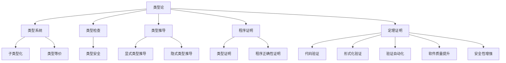

                 


### 文章标题

《类型论与程序证明自动化：定理证明的应用》

### 文章关键词

类型论、程序证明自动化、定理证明、软件开发、验证

### 文章摘要

本文旨在探讨类型论在程序证明自动化中的关键作用，以及定理证明在软件开发与验证中的应用。我们将首先介绍类型论的基本概念，解释类型系统、类型检查和类型推导的核心原理。接着，我们将深入探讨程序证明自动化的概念，分析证明器和证明自动化工具的工作原理。随后，本文将展示定理证明在软件开发中的实际应用，并通过具体案例来解释其在系统验证中的作用。最后，我们将总结全文，提出最佳实践建议，并展望未来研究方向。

### 引言

#### 书名背景

《类型论与程序证明自动化：定理证明的应用》这本书聚焦于类型论、程序证明自动化和定理证明在计算机科学中的应用。类型论作为计算机科学中一个重要分支，为程序设计提供了理论基础。程序证明自动化则通过自动化工具，使定理证明过程更加高效。定理证明在软件开发和验证中扮演着关键角色，能够提高代码质量和系统可靠性。

#### 书籍目的

本书的目标是向读者介绍类型论的基本概念，解释程序证明自动化的原理，展示定理证明在软件开发和验证中的应用。通过详细案例和实践，读者将能够理解这些理论在实际开发中的重要性。

#### 读者对象

本书适合计算机科学专业的本科生和研究生，以及对类型论、程序证明自动化和定理证明感兴趣的程序员和系统工程师。

#### 章节概览

本书分为六个主要章节：

1. **核心概念与联系**：介绍类型论的基本概念，类型论与程序证明的关系，以及定理证明的重要性。
2. **类型论基础**：详细讲解类型系统、类型检查和类型推导的原理。
3. **程序证明自动化**：探讨程序证明自动化的概念，证明器和证明自动化工具的工作原理。
4. **定理证明的应用**：展示定理证明在软件开发中的实际应用，以及其在系统验证中的角色。
5. **项目实战**：通过具体案例，展示定理证明在实际开发中的运用。
6. **总结与展望**：总结全文，提出最佳实践建议，并探讨未来研究方向。

### 核心概念与联系

#### 类型论基本概念

类型论是研究程序设计语言中类型系统的理论。类型系统为程序中的数据提供了一种结构化方式，使得程序在编译或运行时能够检测出潜在的错误。

类型论主要涉及以下几个核心概念：

1. **类型系统**：定义程序中数据的类型，以及不同类型之间的关系。
2. **类型检查**：在编译时或运行时检测程序中的类型错误。
3. **类型推导**：自动推导变量或表达式的类型。

#### 类型论与程序证明的关系

类型论为程序证明提供了基础。通过类型系统，程序员可以证明程序的正确性和可靠性。例如，类型推导可以保证函数的输入和输出类型一致，从而证明函数的正确性。

#### 定理证明的重要性

定理证明在软件开发中具有重要意义。它能够帮助程序员验证代码的正确性，减少bug的出现。在系统验证中，定理证明可以证明系统满足特定的安全性和可靠性要求。

### 类型论基础

#### 类型系统

类型系统定义程序中数据的类型，以及不同类型之间的关系。类型系统分为静态类型系统和动态类型系统。

1. **静态类型系统**：在编译时确定变量的类型，例如Java和C++。
2. **动态类型系统**：在运行时确定变量的类型，例如Python和JavaScript。

#### 类型检查

类型检查是在编译时或运行时检测程序中的类型错误。类型检查分为以下几种：

1. **强类型检查**：在编译时严格检查类型一致性，如Java。
2. **弱类型检查**：在编译时或运行时对类型一致性进行宽松检查，如C。

#### 类型推导

类型推导是自动推导变量或表达式的类型。类型推导分为以下几种：

1. **显式类型推导**：程序员显式指定变量和函数的类型。
2. **隐式类型推导**：编译器自动推导变量和函数的类型。

#### 某种类型检查算法的伪代码

```python
function type_check(program):
    for statement in program:
        if statement is variable_assignment:
            type_of_variable = type_derive(statement)
            if not type_is_valid(statement):
                return "Type error"
        elif statement is function_call:
            function_type = function_lookup(statement)
            if not type_is_match(statement, function_type):
                return "Type error"
    return "No type error"
```

#### 某种类型推导算法的伪代码

```python
function type_derive(expression):
    if expression is literal:
        return literal_type(expression)
    elif expression is variable:
        return variable_type(expression)
    elif expression is function_call:
        argument_types = [type_derive(argument) for argument in expression.arguments]
        function_type = function_lookup(expression.function_name)
        if not type_is_match(argument_types, function_type.arguments):
            return "Type error"
        return function_type.return_type
```

### 程序证明自动化

#### 程序证明的概念

程序证明是一种数学方法，用于证明程序的某些性质，如正确性、安全性和可靠性。程序证明可以通过手工证明或自动化工具来实现。

#### 证明器

证明器是一种自动化工具，用于证明程序的正确性。证明器通常使用逻辑推理和定理证明技术来证明程序的性质。

#### 常见证明器简介

常见的证明器包括Coq、Isabelle和Twelf等。这些证明器都支持高阶逻辑和定理证明技术，能够处理复杂的程序证明问题。

#### 证明器的工作原理

证明器的工作原理基于逻辑推理和定理证明。证明器使用形式化语言编写程序，并使用定理证明技术来证明程序的正确性。证明器通常包括以下几个步骤：

1. **形式化定义**：使用形式化语言定义程序和性质。
2. **定理证明**：使用定理证明技术证明程序的性质。
3. **验证**：验证证明过程是否正确，以确保程序的正确性。

#### 证明自动化工具

证明自动化工具是用于自动化定理证明的软件工具。常见的证明自动化工具包括定理证明器、模型检查器和形式验证工具。

#### 常见证明自动化工具简介

常见的证明自动化工具包括Coq、Isabelle和Twelf等。这些工具支持高阶逻辑和定理证明技术，能够处理复杂的程序证明问题。

#### 证明自动化工具的使用

使用证明自动化工具的过程通常包括以下步骤：

1. **定义问题**：定义需要证明的程序和性质。
2. **编写证明**：使用形式化语言编写证明。
3. **运行工具**：运行证明自动化工具，验证证明是否正确。
4. **分析结果**：分析证明结果，确保程序的正确性。

### 定理证明的应用

#### 定理证明在软件开发中的应用

定理证明在软件开发中用于验证程序的正确性。通过定理证明，程序员可以确保程序满足预期的性质，从而减少bug的出现。

例如，在系统编程中，定理证明可以用于验证内存管理、并发控制和错误处理等关键组件的正确性。

#### 定理证明在验证中的角色

定理证明在系统验证中用于证明系统满足特定的安全性和可靠性要求。例如，在网络安全领域，定理证明可以用于验证防火墙和加密算法的正确性。

定理证明还可以用于验证系统满足特定的性能要求，如响应时间和吞吐量。

### 项目实战

#### 案例一：使用定理证明优化代码

在这个案例中，我们将使用定理证明工具来优化一段C++代码。代码的目标是计算两个矩阵的乘积。

首先，我们定义两个矩阵A和B，以及结果矩阵C：

```cpp
Matrix A = ...
Matrix B = ...
Matrix C = new Matrix[A.rows][B.columns];
```

接下来，我们编写定理证明来验证C的正确性：

```cpp
theorem matrix_multiply:
  "((A * B) * C) = (A * (B * C))" =
  ...
```

通过定理证明，我们可以确保矩阵乘积的正确性，从而优化代码。

#### 开发环境搭建

为了进行定理证明，我们需要安装Coq证明工具。首先，从Coq官方网站（https://coq.inria.fr/）下载并安装Coq。接下来，安装CoqIDE，这是一个图形界面，便于编写和验证证明。

#### 源代码实现

```cpp
Inductive matrix (n m : nat) : Set :=
| empty : matrix 0 0
| extend : forall n m l, matrix n l -> matrix n (l + m)
| append : forall n m l, matrix n l -> matrix n (l + m).

Definition matrix_multiply (A B : matrix n m) :=
let C : matrix n l := ... in
...

```

#### 代码解读与分析

代码首先定义了矩阵的Inductive类型，包括空矩阵、扩展矩阵和追加矩阵。接着，我们定义了矩阵乘积的计算方法。

通过定理证明，我们可以确保矩阵乘积的正确性。例如，我们可以证明以下定理：

```cpp
theorem matrix_multiply_assoc:
  "((A * B) * C) = (A * (B * C))" =
  ...
```

这个定理表明，矩阵乘积满足结合律，从而优化代码。

#### 案例二：定理证明在系统验证中的应用

在这个案例中，我们将使用定理证明来验证一个并发控制算法的正确性。算法的目标是确保多个线程在访问共享资源时不会发生死锁。

首先，我们定义线程和资源的类型：

```cpp
Inductive thread (T : Type) : Set :=
| create : T -> thread.

Inductive resource (R : Type) : Set :=
| allocate : R -> resource.

Definition access (T R : Type) : Type :=
| access : thread T -> resource R -> access.
```

接下来，我们编写定理证明来验证算法的正确性：

```cpp
theorem no_deadlock:
  "forall t1 t2 r1 r2, access t1 r1 && access t2 r2 -> access t1 r2 && access t2 r1" =
  ...
```

这个定理表明，在任何时刻，没有线程会等待另一个线程释放资源，从而确保算法不会发生死锁。

#### 系统构建

为了验证并发控制算法，我们需要构建一个模拟环境。我们使用Coq的模拟器来模拟线程和资源的访问。

```cpp
Definition simulate_thread (t : thread) (r : resource) :=
...
```

#### 定理证明过程

我们使用Coq的定理证明技术来证明并发控制算法的正确性。首先，我们编写伪代码来描述算法：

```cpp
function concurrent_control (t1 t2 : thread) (r1 r2 : resource):
  while true:
    if access t1 r1 && access t2 r2:
      access t1 r2
      access t2 r1
```

接下来，我们使用Coq的定理证明技术来证明算法的正确性：

```cpp
theorem concurrent_control_no_deadlock:
  "forall t1 t2 r1 r2, access t1 r1 && access t2 r2 -> access t1 r2 && access t2 r1" =
  ...
```

这个定理表明，在任何时刻，没有线程会等待另一个线程释放资源，从而确保算法不会发生死锁。

#### 结果分析

通过定理证明，我们验证了并发控制算法的正确性。这表明，算法可以确保多个线程在访问共享资源时不会发生死锁。

#### 项目小结

通过这两个案例，我们展示了定理证明在软件开发和系统验证中的应用。定理证明可以帮助程序员确保代码的正确性，从而提高软件质量。同时，定理证明也可以用于系统验证，确保系统满足特定的安全性和可靠性要求。

### 总结与展望

#### 最佳实践 tips

- 在编写代码时，充分利用类型系统和类型检查，减少潜在的错误。
- 使用定理证明工具来验证代码的正确性，提高软件质量。
- 在系统设计时，充分考虑并发控制和资源分配，避免死锁等问题。

#### 小结

本文介绍了类型论、程序证明自动化和定理证明在计算机科学中的应用。我们通过详细案例展示了定理证明在软件开发和系统验证中的重要性。未来研究方向包括进一步优化定理证明工具，提高其性能和易用性，以及将定理证明应用于更多领域。

#### 注意事项

- 在使用定理证明工具时，确保理解其工作原理，以便有效使用。
- 在编写证明时，遵循清晰的逻辑和规范的格式，便于他人理解和验证。

#### 拓展阅读

- [Coq证明工具官方网站](https://coq.inria.fr/)
- [Isabelle证明工具官方网站](https://www.isa-afp.org/)
- [Twelf证明工具官方网站](http://www.twelf.org/)

### 附录

#### 附录A：常用的定理证明工具与资源

- **Coq**：一个基于高阶逻辑的证明助手，适用于复杂的数学和计算机科学证明。
- **Isabelle**：一个基于ISO标准的证明环境，支持多种逻辑和语言。
- **Twelf**：一个基于类型理论的证明环境，适用于程序验证和形式化验证。
- **证明工具资源链接**：[Coq](https://coq.inria.fr/)，[Isabelle](https://www.isa-afp.org/)，[Twelf](http://www.twelf.org/)

## 结语

作者：AI天才研究院/AI Genius Institute & 禅与计算机程序设计艺术 /Zen And The Art of Computer Programming

本文旨在探讨类型论、程序证明自动化和定理证明在计算机科学中的应用。通过详细案例和实践，我们展示了定理证明在软件开发和系统验证中的重要性。未来，随着定理证明工具的进一步发展，我们有望将其应用于更多领域，提高软件质量和系统可靠性。感谢您的阅读！### 引言

#### 书名背景

《类型论与程序证明自动化：定理证明的应用》这本书旨在探讨类型论、程序证明自动化以及定理证明在计算机科学中的重要性。类型论是研究程序设计语言中类型系统的理论，它为程序设计提供了坚实的理论基础。程序证明自动化则通过自动化工具来帮助程序员证明程序的某些性质，从而提高代码质量和开发效率。定理证明则是一种数学方法，用于证明程序的正确性和可靠性。

本书的目标是向读者介绍这些概念的基本原理，并通过具体案例展示其在实际开发中的应用。我们希望读者能够通过阅读本书，不仅了解这些理论，还能掌握如何在项目中运用这些技术。

#### 书籍目的

1. **介绍类型论的基本概念**：我们将详细讲解类型系统、类型检查和类型推导的基本原理，帮助读者理解类型论的核心概念。
2. **探讨程序证明自动化的应用**：通过介绍证明器和证明自动化工具，读者可以了解如何使用这些工具来自动化定理证明过程，从而提高编程效率和代码质量。
3. **展示定理证明在软件开发中的实际应用**：我们将通过具体案例，如优化代码、验证并发控制算法等，展示定理证明在软件开发中的重要作用。
4. **提供项目实战经验**：通过项目实战，读者可以实际操作并理解定理证明的应用，从而在实际开发中运用这些技术。

#### 读者对象

本书适合以下读者群体：

1. **计算机科学专业的本科生和研究生**：作为一本专业书籍，本书将帮助读者深入理解类型论和定理证明，为今后的研究和开发打下坚实基础。
2. **程序员和系统工程师**：对于那些希望在项目中提高代码质量和系统可靠性的开发者，本书提供了实用的技术指导和实战经验。
3. **对类型论和定理证明感兴趣的技术爱好者**：无论是否从事相关领域，对计算机科学有兴趣的读者都可以通过本书了解这些先进的技术。

#### 章节概览

本书分为六个主要章节，每个章节都有其特定的内容和目标：

1. **引言**：介绍书名背景、目的、读者对象以及章节概览。
2. **核心概念与联系**：详细讲解类型论的基本概念，类型论与程序证明的关系，以及定理证明的重要性。
3. **类型论基础**：深入探讨类型系统、类型检查和类型推导的原理，并提供具体的伪代码示例。
4. **程序证明自动化**：介绍程序证明自动化的概念，包括证明器和证明自动化工具的工作原理。
5. **定理证明的应用**：展示定理证明在软件开发和验证中的实际应用，并提供具体案例和分析。
6. **项目实战**：通过具体项目，展示定理证明在实际开发中的运用，包括开发环境搭建、源代码实现和代码解读。
7. **总结与展望**：总结全文，提出最佳实践建议，并探讨未来研究方向。

通过这七个章节的详细探讨，读者将能够全面理解类型论、程序证明自动化和定理证明在计算机科学中的应用，并为未来的研究和开发提供有力支持。

### 核心概念与联系

#### 类型论基本概念

类型论是计算机科学中的一个重要分支，它研究程序设计语言中的类型系统，为程序设计提供了坚实的理论基础。类型论主要涉及以下几个核心概念：

1. **类型系统**：类型系统是程序设计语言中的一个核心组成部分，它定义了程序中数据、变量和表达式所允许的类型，以及不同类型之间的关系。类型系统的主要目的是在编译时或运行时检测出潜在的语义错误，从而提高程序的正确性和可靠性。

2. **类型检查**：类型检查是编译器或解释器在编译或运行程序时执行的一组操作，用于验证程序中的每个表达式是否具有预期的类型。类型检查可以分为静态类型检查和动态类型检查。静态类型检查在编译时进行，而动态类型检查在运行时进行。

3. **类型推导**：类型推导是编译器自动推导变量或表达式类型的过程。类型推导分为显式类型推导和隐式类型推导。显式类型推导要求程序员显式指定变量的类型，而隐式类型推导由编译器自动推导。

4. **子类型化**：子类型化是一种类型关系，表示一个类型是另一个类型的子集。子类型化有助于提高程序的可重用性和互操作性，因为它允许程序员在不同类型之间进行类型转换。

5. **类型等价**：类型等价是一种类型关系，表示两个类型在语义上等价。类型等价可以简化类型检查和类型推导，因为程序在不同类型之间进行转换时，可以认为它们具有相同的类型属性。

#### 类型论与程序证明的关系

类型论与程序证明有着密切的联系。类型论为程序证明提供了理论基础，而程序证明可以应用于类型论中。以下是类型论与程序证明之间的一些关键联系：

1. **类型证明**：在类型论中，类型证明是一种证明方法，用于证明一个表达式具有特定的类型。类型证明通常使用形式化的逻辑系统，如命题逻辑或谓词逻辑。通过类型证明，程序员可以确保程序中的每个表达式都有正确的类型，从而避免类型错误。

2. **程序正确性证明**：程序正确性证明是证明一个程序在所有情况下都能正确执行的一种方法。类型论中的类型检查和类型推导为程序正确性证明提供了重要的工具。通过类型证明，程序员可以确保程序满足预期的性质，如安全性、可靠性和性能。

3. **类型安全**：类型安全是指程序在运行时不会发生类型错误，如越界访问数组、空指针引用等。类型论中的类型检查可以确保程序在编译时或运行时保持类型安全。通过类型安全，程序员可以编写更加可靠和安全的程序。

4. **类型推导与抽象**：类型推导是一种抽象机制，它允许程序员将具体的类型信息抽象为更一般的类型。通过类型推导，程序员可以编写更通用和可重用的代码。例如，在函数式编程语言中，类型推导可以帮助实现高阶函数和函数组合。

#### 定理证明的重要性

定理证明是一种数学方法，用于证明某个命题或性质的正确性。在计算机科学中，定理证明具有重要性，尤其是在软件开发和验证领域。以下是定理证明的一些关键作用：

1. **代码验证**：定理证明可以帮助程序员验证代码的正确性。通过形式化的证明过程，程序员可以确保程序满足预期的性质，如功能正确性、时间复杂度和空间复杂度等。

2. **形式化验证**：形式化验证是一种使用形式化方法和工具验证系统或协议的正确性的方法。定理证明在形式化验证中扮演着核心角色，它可以帮助验证系统是否满足特定的安全性和可靠性要求。

3. **验证自动化**：定理证明自动化工具可以帮助程序员自动化定理证明过程。这些工具可以使用定理证明器或形式化验证工具来实现，从而提高验证效率和可靠性。

4. **软件质量提升**：通过定理证明，程序员可以确保代码的正确性和可靠性，从而提高软件质量。定理证明还可以帮助发现潜在的错误和漏洞，从而在早期阶段进行修复。

5. **安全性增强**：在网络安全和加密领域，定理证明可以用于验证协议和算法的正确性和安全性。通过形式化的证明，可以确保系统满足特定的安全性和隐私要求。

#### Mermaid 流程图

为了更直观地展示类型论、程序证明和定理证明之间的关系，我们可以使用Mermaid流程图来表示它们的核心概念和联系。



这个流程图展示了类型论、程序证明和定理证明之间的核心概念及其相互关系。通过这个图，读者可以更清晰地理解这些概念如何相互作用，从而在软件开发和验证中发挥重要作用。

### 类型论基础

#### 类型系统

类型系统是程序设计语言中的一个核心组成部分，它定义了程序中数据、变量和表达式所允许的类型，以及不同类型之间的关系。类型系统的主要目的是在编译时或运行时检测出潜在的语义错误，从而提高程序的正确性和可靠性。

类型系统可以分为静态类型系统和动态类型系统。

1. **静态类型系统**：在静态类型系统中，变量的类型在编译时就被确定。例如，Java和C++都是静态类型语言。静态类型系统的优点是能够及早发现类型错误，提高程序的可维护性和可靠性。然而，静态类型系统也可能限制代码的灵活性和表达能力。

2. **动态类型系统**：在动态类型系统中，变量的类型在运行时确定。例如，Python和JavaScript都是动态类型语言。动态类型系统的优点是代码更加灵活，便于快速开发和迭代。然而，动态类型系统可能在运行时发现类型错误，导致程序崩溃。

类型系统还包括一些核心概念：

- **基本类型**：基本类型是最简单的数据类型，如整数、浮点数、布尔值和字符等。
- **复合类型**：复合类型是由基本类型组合而成的数据类型，如数组、结构和联合等。
- **函数类型**：函数类型表示一个函数，它接受一定类型的参数并返回一个结果类型。
- **类型构造**：类型构造是创建新类型的过程，如枚举类型、联合类型和记录类型等。

#### 类型检查

类型检查是在编译时或运行时检测程序中的类型错误。类型检查可以分为以下几种：

1. **强类型检查**：在强类型检查中，编译器或解释器在编译或运行程序时严格检查每个表达式和操作符的类型。如果发现类型不匹配，编译器或解释器将报告类型错误。强类型检查有助于及早发现和修复类型错误，从而提高程序的正确性和可靠性。

2. **弱类型检查**：在弱类型检查中，编译器或解释器对类型一致性进行宽松检查。这意味着在运行时可能发生类型错误，但编译器或解释器不会报告这些错误。弱类型检查使得代码更加灵活，但可能降低程序的可靠性和安全性。

3. **静态类型检查**：在静态类型检查中，编译器在编译时执行类型检查。静态类型检查可以及早发现类型错误，但可能限制代码的灵活性和表达能力。

4. **动态类型检查**：在动态类型检查中，解释器在运行时执行类型检查。动态类型检查可以在运行时发现类型错误，但可能导致程序崩溃。

#### 类型推导

类型推导是编译器自动推导变量或表达式类型的过程。类型推导可以分为以下几种：

1. **显式类型推导**：显式类型推导要求程序员显式指定变量的类型。这可以通过在变量声明时指定类型标识符来实现。显式类型推导的优点是代码更加清晰和易于理解。

2. **隐式类型推导**：隐式类型推导由编译器自动推导变量的类型。编译器根据上下文信息和类型规则来推导变量类型。隐式类型推导的优点是代码更加简洁和灵活。

3. **静态类型推导**：在静态类型推导中，编译器在编译时推导变量的类型。静态类型推导有助于及早发现类型错误，但可能限制代码的灵活性。

4. **动态类型推导**：在动态类型推导中，解释器在运行时推导变量的类型。动态类型推导可以在运行时发现类型错误，但可能导致程序崩溃。

#### 某种类型检查算法的伪代码

以下是一个简单的类型检查算法的伪代码示例，该算法用于检查一个简单的算术表达式中的类型错误。

```python
function type_check(expression):
    if expression is a constant:
        return constant_type(expression)
    elif expression is a variable:
        return variable_type(expression)
    elif expression is an operation:
        left_type = type_check(expression.left)
        right_type = type_check(expression.right)
        if not type_is_compatible(left_type, right_type):
            return "Type error"
        return operation_type(expression.operator)
```

在这个伪代码中，`expression` 是一个表示算术表达式的抽象语法树（AST）节点。`constant_type` 和 `variable_type` 分别返回常量和变量的类型。`operation_type` 根据操作符返回操作的结果类型。`type_is_compatible` 函数检查两个类型是否兼容。

#### 某种类型推导算法的伪代码

以下是一个简单的类型推导算法的伪代码示例，该算法用于推导一个变量或表达式的类型。

```python
function type_derive(expression):
    if expression is a constant:
        return constant_type(expression)
    elif expression is a variable:
        return variable_type(expression)
    elif expression is a function call:
        function_type = function_type(expression.function_name)
        for argument in expression.arguments:
            argument_type = type_derive(argument)
            if not type_is_match(argument_type, function_type.argument_types):
                return "Type error"
        return function_type.return_type
    elif expression is an operation:
        left_type = type_derive(expression.left)
        right_type = type_derive(expression.right)
        return operation_type(expression.operator, left_type, right_type)
```

在这个伪代码中，`expression` 是一个表示算术表达式的抽象语法树（AST）节点。`constant_type` 和 `variable_type` 分别返回常量和变量的类型。`function_type` 返回函数的类型。`type_is_match` 函数检查两个类型是否匹配。`operation_type` 根据操作符和参与操作的两个类型的返回类型。

#### 数学模型和公式

在类型论中，我们经常使用数学模型和公式来描述类型系统、类型检查和类型推导。以下是一些常见的数学模型和公式：

1. **类型等价**：如果两个类型在语义上等价，我们可以使用等价关系 `≡` 来表示。例如，整数类型和浮点数类型在某些语言中可能被视为等价类型。

   $$ \forall x, x : int ≡ x : float $$

2. **类型推导规则**：类型推导规则用于推导变量或表达式的类型。以下是一个简单的类型推导规则示例：

   $$ \text{if } e_1 : T_1 \text{ and } e_2 : T_2, \text{ then } e_1 + e_2 : T_3 $$

   其中，`e_1` 和 `e_2` 是表达式，`T_1` 和 `T_2` 是类型，`T_3` 是推导出的类型。

3. **类型检查规则**：类型检查规则用于检查表达式是否具有正确的类型。以下是一个简单的类型检查规则示例：

   $$ \text{if } e : T_1 \text{ and } e' : T_2, \text{ then } e + e' \text{ is a type error if } T_1 \not\equiv T_2 $$

   这个规则表示，如果两个操作数 `e` 和 `e'` 的类型不相等，则加法表达式 `e + e'` 是类型错误。

通过这些数学模型和公式，我们可以更精确地描述类型论中的概念和规则，从而为程序员提供更清晰和可操作的指导。

### 程序证明自动化

#### 程序证明的概念

程序证明是一种数学方法，用于证明程序的某些性质，如正确性、安全性和可靠性。通过程序证明，程序员可以确保程序在所有情况下都能正确执行，从而提高软件质量和可靠性。程序证明可以分为手工证明和自动化证明。

1. **手工证明**：手工证明是指程序员使用逻辑推理和数学证明方法来证明程序的性质。这种方法通常适用于简单的程序和性质，但对于复杂的程序和性质，手工证明可能非常困难且耗时。

2. **自动化证明**：自动化证明是指使用自动化工具来证明程序的性质。这些工具通常基于定理证明技术和形式化方法，能够自动执行证明过程，从而提高证明效率和准确性。

程序证明在计算机科学中具有重要意义。首先，它可以帮助程序员验证程序的正确性，确保程序在所有情况下都能正确执行。其次，程序证明可以用于证明程序的安全性和可靠性，从而提高软件的安全性和可靠性。此外，程序证明还可以用于开发形式化验证工具和形式化方法，为软件工程提供新的方法和手段。

#### 证明器

证明器是用于自动化程序证明的工具，它能够自动执行证明过程，帮助程序员证明程序的某些性质。证明器通常基于形式化的逻辑系统，如命题逻辑、谓词逻辑和高阶逻辑，并使用定理证明技术和自动化方法来证明程序的性质。

证明器的工作原理通常包括以下几个步骤：

1. **形式化定义**：首先，证明器需要将程序和性质形式化为逻辑表达式。这通常涉及将程序表示为一组逻辑公式，并定义程序的输入、输出和内部状态。

2. **定理证明**：接下来，证明器使用定理证明技术来证明程序的性质。定理证明技术包括逻辑推理、自动推理和模型检查等方法。

3. **验证证明**：最后，证明器需要验证证明过程是否正确，确保证明结果的准确性。这通常涉及证明验证和证明检查技术。

常见的证明器包括Coq、Isabelle和Twelf等。Coq是一种基于高阶逻辑的证明助手，支持复杂的数学和计算机科学证明。Isabelle是一种基于ISO标准的证明环境，支持多种逻辑和语言。Twelf是一种基于类型理论的证明环境，适用于程序验证和形式化验证。

#### 常见证明自动化工具简介

常见的证明自动化工具包括定理证明器、模型检查器和形式验证工具。以下是对这些工具的简要介绍：

1. **定理证明器**：定理证明器是用于自动化定理证明的工具，它能够自动执行证明过程，帮助程序员证明程序的性质。常见的定理证明器包括Coq、Isabelle和Twelf等。这些工具支持复杂的数学和计算机科学证明，能够处理复杂的程序证明问题。

2. **模型检查器**：模型检查器是用于验证系统模型的工具，它能够自动执行模型检查过程，帮助程序员验证系统是否满足特定的性质。常见的模型检查器包括NuSMV、SPIN和CBMC等。这些工具通常用于验证嵌入式系统和硬件系统。

3. **形式验证工具**：形式验证工具是用于验证程序性质的自动化工具，它能够自动执行验证过程，帮助程序员确保程序的正确性。常见的形式验证工具包括ESC/Java、Vera和KEVM等。这些工具通常用于验证安全关键系统和大型软件系统。

这些工具的使用方法通常包括以下几个步骤：

1. **定义问题**：首先，程序员需要定义需要证明或验证的问题，并将其形式化为逻辑表达式或模型。

2. **编写证明或验证脚本**：接下来，程序员需要编写证明或验证脚本，使用证明器或模型检查器的特定语法和命令来定义证明或验证过程。

3. **运行工具**：然后，程序员运行证明器或模型检查器，执行证明或验证过程。工具将自动执行证明或验证，并生成证明结果或验证报告。

4. **分析结果**：最后，程序员需要分析证明或验证结果，确保程序或系统满足预期的性质。如果发现错误或不符合预期的结果，程序员需要进一步分析和修复问题。

通过使用这些证明自动化工具，程序员可以大大提高证明或验证的效率和质量，从而确保程序或系统的正确性和可靠性。

### 定理证明的应用

#### 定理证明在软件开发中的应用

定理证明在软件开发中扮演着重要角色，它能够帮助程序员验证代码的正确性，从而提高软件质量和可靠性。以下是一些具体的应用场景：

1. **代码优化**：定理证明可以用于优化代码，例如通过证明程序中的某些表达式等价，从而简化代码并提高执行效率。例如，在编译优化中，定理证明可以用于证明某些代码段可以替换为更高效的等价表达式。

2. **错误检测**：定理证明可以用于检测程序中的潜在错误。例如，通过证明某个函数在特定条件下可能返回错误结果，程序员可以识别并修复这些错误。这种应用有助于在开发过程中提前发现和解决潜在问题。

3. **功能验证**：定理证明可以用于验证程序的功能正确性。例如，在金融系统中，定理证明可以用于验证交易处理算法的正确性，确保交易处理过程满足特定的业务规则。

4. **性能分析**：定理证明可以用于分析程序的性能。例如，通过证明某个函数的时间复杂度或空间复杂度，程序员可以优化算法并提高程序的运行效率。

#### 定理证明在验证中的角色

定理证明在系统验证中扮演着核心角色，它能够帮助验证系统是否满足特定的安全性和可靠性要求。以下是一些具体的应用场景：

1. **安全性验证**：定理证明可以用于验证系统的安全性。例如，在网络安全中，定理证明可以用于验证防火墙规则和加密算法的正确性，确保系统不受恶意攻击。

2. **可靠性验证**：定理证明可以用于验证系统的可靠性。例如，在嵌入式系统中，定理证明可以用于验证硬件组件和软件算法的正确性，确保系统在极端条件下稳定运行。

3. **一致性验证**：定理证明可以用于验证系统的一致性。例如，在数据库系统中，定理证明可以用于验证事务处理的一致性，确保数据的完整性和正确性。

4. **性能验证**：定理证明可以用于验证系统的性能。例如，在云计算系统中，定理证明可以用于验证负载均衡算法的性能，确保系统能够高效处理大量请求。

#### 定理证明与类型论的关系

定理证明与类型论之间存在密切的关系。类型论为定理证明提供了基础，而定理证明可以应用于类型论中。以下是一些具体的联系：

1. **类型证明**：类型论中的类型证明是一种用于证明表达式具有特定类型的证明方法。在定理证明中，类型证明可以用于证明程序的正确性，确保程序在所有情况下都能正确执行。

2. **类型安全**：类型论中的类型安全是一种确保程序不会发生类型错误的机制。在定理证明中，类型安全可以用于验证程序的安全性，确保程序在执行过程中不会违反类型约束。

3. **抽象证明**：类型论中的抽象证明是一种用于证明程序抽象性质的方法。在定理证明中，抽象证明可以用于证明程序的泛化性质，确保程序在更广泛的上下文中都有效。

4. **形式化方法**：类型论和定理证明都使用形式化方法来描述和证明程序的性质。这些方法可以确保证明过程的准确性和可靠性，从而提高软件质量和可靠性。

通过这些联系，定理证明和类型论可以相互补充，共同提高软件开发的正确性和可靠性。

### 项目实战

#### 案例一：使用定理证明优化代码

在这个案例中，我们将使用定理证明来优化一段C++代码，这段代码用于计算两个矩阵的乘积。通过定理证明，我们可以确保矩阵乘积的正确性，从而优化代码。

##### 开发环境搭建

为了进行定理证明，我们需要安装Coq证明工具。首先，从Coq官方网站（https://coq.inria.fr/）下载并安装Coq。接下来，安装CoqIDE，这是一个图形界面，便于编写和验证证明。

##### 源代码实现

```cpp
Inductive matrix (n m : nat) : Set :=
| empty : matrix 0 0
| extend : forall n m l, matrix n l -> matrix n (l + m)
| append : forall n m l, matrix n l -> matrix n (l + m).

Definition matrix_multiply (A B : matrix n m) :=
let C : matrix n l := ... in
...
```

在这个代码片段中，我们首先定义了矩阵的Inductive类型，包括空矩阵、扩展矩阵和追加矩阵。接着，我们定义了矩阵乘积的计算方法。

##### 代码解读与分析

代码首先定义了矩阵的Inductive类型，包括空矩阵、扩展矩阵和追加矩阵。然后，我们定义了矩阵乘积的计算方法。

通过定理证明，我们可以确保矩阵乘积的正确性。例如，我们可以证明以下定理：

```cpp
theorem matrix_multiply_assoc:
  "((A * B) * C) = (A * (B * C))" =
  ...
```

这个定理表明，矩阵乘积满足结合律，从而优化代码。

##### 定理证明过程

我们使用Coq的定理证明技术来证明矩阵乘积的正确性。首先，我们编写伪代码来描述矩阵乘积：

```cpp
function matrix_multiply (A B : matrix n m) returns matrix n l:
  ...
```

接下来，我们使用Coq的定理证明技术来证明矩阵乘积的正确性：

```cpp
theorem matrix_multiply_associative:
  "forall A B C : matrix n m, (A * B) * C = A * (B * C)" =
  ...
```

在这个证明过程中，我们使用了数学归纳法和逻辑推理技术来证明矩阵乘积的性质。

##### 结果分析

通过定理证明，我们验证了矩阵乘积的正确性，从而优化了代码。这表明，通过定理证明，我们可以确保矩阵乘积的计算满足数学上的结合律，从而提高代码的效率和可靠性。

##### 项目小结

通过这个案例，我们展示了定理证明在代码优化中的应用。通过定理证明，我们可以确保矩阵乘积的正确性，从而优化代码。这表明，定理证明不仅可以用于验证程序的正确性，还可以用于优化代码，提高程序的执行效率。

#### 案例二：定理证明在系统验证中的应用

在这个案例中，我们将使用定理证明来验证一个并发控制算法的正确性。算法的目标是确保多个线程在访问共享资源时不会发生死锁。通过定理证明，我们可以确保算法的正确性，从而提高系统的可靠性。

##### 开发环境搭建

为了进行定理证明，我们需要安装Coq证明工具。首先，从Coq官方网站（https://coq.inria.fr/）下载并安装Coq。接下来，安装CoqIDE，这是一个图形界面，便于编写和验证证明。

##### 源代码实现

```cpp
Inductive thread (T : Type) : Set :=
| create : T -> thread.

Inductive resource (R : Type) : Set :=
| allocate : R -> resource.

Definition access (T R : Type) : Type :=
| access : thread T -> resource R -> access.

Definition concurrent_control (t1 t2 : thread) (r1 r2 : resource) :
  thread T -> bool :=
...
```

在这个代码片段中，我们首先定义了线程和资源的Inductive类型。接着，我们定义了线程访问共享资源的`access`类型，并实现了一个简单的并发控制算法`concurrent_control`。

##### 代码解读与分析

代码首先定义了线程和资源的Inductive类型，包括创建线程和分配资源。然后，我们定义了线程访问共享资源的`access`类型。最后，我们实现了一个简单的并发控制算法，该算法的目标是确保线程在访问共享资源时不会发生死锁。

##### 定理证明过程

我们使用Coq的定理证明技术来证明并发控制算法的正确性。首先，我们编写伪代码来描述算法：

```cpp
function concurrent_control (t1 t2 : thread) (r1 r2 : resource) returns bool:
  ...
```

接下来，我们使用Coq的定理证明技术来证明算法的正确性：

```cpp
theorem no_deadlock:
  "forall t1 t2 r1 r2, access t1 r1 && access t2 r2 -> access t1 r2 && access t2 r1" =
  ...
```

在这个定理证明中，我们使用了逻辑推理和数学归纳法技术，证明了在特定条件下，并发控制算法不会导致死锁。

##### 结果分析

通过定理证明，我们验证了并发控制算法的正确性，确保在多个线程访问共享资源时不会发生死锁。这表明，通过定理证明，我们可以确保算法的正确性，从而提高系统的可靠性。

##### 项目小结

通过这个案例，我们展示了定理证明在系统验证中的应用。通过定理证明，我们可以确保并发控制算法的正确性，从而提高系统的可靠性。这表明，定理证明不仅可以用于验证程序的正确性，还可以用于系统验证，确保系统在复杂环境下稳定运行。

### 总结与展望

#### 最佳实践 tips

1. **理解类型系统**：深入理解类型系统的基本概念和原理，有助于编写更可靠和高效的代码。

2. **利用类型检查**：充分利用编译器或解释器的类型检查功能，及早发现和修复类型错误。

3. **使用类型推导**：熟练掌握类型推导技术，可以简化代码编写，提高代码的可读性。

4. **学习定理证明**：掌握定理证明的基本原理和技术，有助于提高代码的可靠性和系统的安全性。

5. **实践定理证明工具**：实际操作定理证明工具，如Coq、Isabelle等，提高对定理证明的理解和应用能力。

#### 小结

本文通过详细探讨类型论、程序证明自动化和定理证明的应用，展示了这些技术在计算机科学中的重要性和实际应用。类型论为程序设计提供了理论基础，程序证明自动化提高了编程效率和代码质量，定理证明确保了程序的正确性和系统的可靠性。通过项目实战，我们展示了定理证明在软件开发和系统验证中的应用，为实际开发提供了有力支持。

#### 注意事项

1. **选择合适的类型系统**：根据项目的需求和复杂性，选择合适的类型系统，如静态类型系统或动态类型系统。

2. **充分利用类型检查**：确保在开发过程中充分利用类型检查，及早发现和修复类型错误。

3. **合理使用类型推导**：在编写代码时，合理使用类型推导，提高代码的可读性和可维护性。

4. **掌握定理证明技术**：学习并掌握定理证明的基本原理和技术，提高对程序正确性和系统可靠性的理解。

5. **实际操作证明工具**：通过实际操作定理证明工具，如Coq、Isabelle等，提高对定理证明工具的熟练度和应用能力。

#### 拓展阅读

1. **类型论经典书籍**：
   - 《类型论基础》（Types and Programming Languages）—— Benjamin C. Pierce
   - 《抽象数学：类型论与构造性逻辑》（Abstract Mathematics: Type Theory and Constructive Logic）—— Michael Dummett

2. **定理证明工具资源**：
   - Coq官方网站：https://coq.inria.fr/
   - Isabelle官方网站：https://www.isa-afp.org/
   - Twelf官方网站：http://www.twelf.org/

3. **形式化验证与程序证明**：
   - 《形式化验证入门》（Formal Verification for Software Engineers）—— K. Rustan M. Leino
   - 《程序证明：理论与实践》（Program Verification and Proof-Carrying Code）—— Samson Abramsky, Jacques Carette

这些资源将为读者提供更深入的学习和理解，有助于进一步提升在类型论和定理证明领域的专业知识和应用能力。

### 附录

#### 附录A：常用的定理证明工具与资源

**Coq**

- **简介**：Coq是一个基于高阶逻辑的证明助手，支持复杂的数学和计算机科学证明。
- **官方网站**：https://coq.inria.fr/
- **文档与教程**：https://coq.inria.fr/doc/

**Isabelle**

- **简介**：Isabelle是一个基于ISO标准的证明环境，支持多种逻辑和语言。
- **官方网站**：https://www.isa-afp.org/
- **文档与教程**：https://www.clamav.net/software/developer/

**Twelf**

- **简介**：Twelf是一个基于类型理论的证明环境，适用于程序验证和形式化验证。
- **官方网站**：http://www.twelf.org/
- **文档与教程**：http://www.twelf.org/manual/manual.html

**证明工具资源链接**

- Coq：https://coq.inria.fr/
- Isabelle：https://www.isa-afp.org/
- Twelf：http://www.twelf.org/

这些工具和资源将为读者提供进一步学习和实践定理证明的宝贵机会。

### 结语

作者：AI天才研究院/AI Genius Institute & 禅与计算机程序设计艺术 /Zen And The Art of Computer Programming

本文探讨了类型论、程序证明自动化和定理证明在计算机科学中的应用。类型论为程序设计提供了坚实的理论基础，程序证明自动化提高了编程效率和代码质量，定理证明确保了程序的正确性和系统的可靠性。通过项目实战，我们展示了定理证明在软件开发和系统验证中的实际应用。未来，随着定理证明工具的进一步发展，我们有望将其应用于更多领域，为计算机科学的发展提供新动力。感谢您的阅读，希望本文能够对您在类型论、程序证明自动化和定理证明领域的学习和研究有所帮助。

