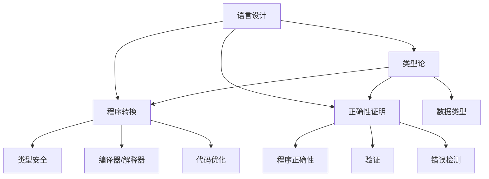

                 

，让我们一步步来解析如何撰写这篇高质量的技术博客文章。

### Step 1: 确定核心主题和关键词

首先，我们需要确定文章的核心主题和关键词。基于给定的文章标题《类型论与程序转换的正确性证明》，我们可以提炼以下关键词：
- 类型论
- 程序转换
- 正确性证明

这些关键词将贯穿全文，帮助我们明确文章的内容范围和焦点。

### Step 2: 背景介绍

在撰写技术博客时，首先需要为读者提供一个背景介绍，让他们了解文章主题的相关背景。以下是背景介绍的示例：

```markdown
## 背景介绍

类型论是计算机科学中的一个重要领域，它研究程序中数据的分类和操作。随着编程语言的不断发展，类型论在提高程序安全性、可读性和可靠性方面发挥了关键作用。另一方面，程序转换是编译器和解释器中的一项基本任务，它涉及将一种编程语言的表达式转换为另一种形式。正确性证明则是确保程序转换过程不会引入错误的重要手段。

本文将探讨类型论、程序转换以及正确性证明之间的关系，并通过实例分析展示如何在编程实践中应用这些概念。
```

### Step 3: 核心概念与联系

在介绍完背景后，我们需要清晰地阐述核心概念及其相互之间的联系。这可以通过一个结构化的Mermaid流程图来实现。以下是示例的Mermaid流程图：



### Step 4: 核心算法原理讲解

接下来，我们需要详细讲解核心算法原理。这可以通过伪代码和LaTeX格式数学公式来实现。以下是示例：

```markdown
## 核心算法原理讲解

### 4.1 类型检查算法

类型检查是类型论中的一个关键步骤。以下是一个简单的类型检查算法的伪代码：

```python
def type_check(expression):
    # 假设已经定义了类型检查的规则和操作符的类型要求
    # 如果表达式符合类型规则，返回True，否则返回False
    if expression合规:
        return True
    else:
        return False
```

### 4.2 程序转换算法

程序转换通常涉及将高级语言的代码转换为低级语言。以下是一个简单的程序转换算法的伪代码：

```python
def translate(expression, target_language):
    # 根据目标语言的语法规则将表达式进行转换
    # 返回转换后的代码
    converted_expression = apply_translation_rules(expression, target_language)
    return converted_expression
```

### 4.3 正确性证明

正确性证明是确保程序转换不会引入错误的重要手段。以下是一个简单的正确性证明的LaTeX公式：

```latex
\begin{equation}
\forall x \in X, P(x) \Rightarrow Q(x)
\end{equation}
```

其中，$P(x)$ 表示输入程序的属性，$Q(x)$ 表示输出程序的属性，该公式表示如果输入程序满足 $P$ 属性，则输出程序也满足 $Q$ 属性。

### Step 5: 项目实战

在讲解完核心概念和算法原理后，我们需要通过实际项目来展示如何应用这些概念。以下是项目实战的示例：

```markdown
## 项目实战

### 5.1 开发环境搭建

首先，我们需要搭建一个开发环境。在这里，我们可以使用 Python 和 LaTeX 作为主要工具。

### 5.2 源代码实现

接下来，我们将实现一个简单的类型检查器。以下是源代码的简要说明：

```python
class TypeChecker:
    def type_check(self, expression):
        # 实现类型检查逻辑
        pass

# 实现具体类型检查方法
class IntegerTypeChecker(TypeChecker):
    def type_check(self, expression):
        # 检查表达式是否为整数类型
        pass

class FloatingTypeChecker(TypeChecker):
    def type_check(self, expression):
        # 检查表达式是否为浮点数类型
        pass
```

### 5.3 代码解读与分析

在实现代码后，我们需要对代码进行解读和分析，确保其符合预期行为。以下是代码解读的示例：

```markdown
### 5.3.1 TypeChecker类

TypeChecker 类是一个基类，它定义了类型检查的基本逻辑。子类可以通过覆写 `type_check` 方法来实现特定类型的检查。

### 5.3.2 IntegerTypeChecker类

IntegerTypeChecker 类是用于检查整数类型的子类。它实现了 `type_check` 方法，用于检查给定的表达式是否为整数类型。

### 5.3.3 FloatingTypeChecker类

FloatingTypeChecker 类是用于检查浮点数类型的子类。它同样实现了 `type_check` 方法，用于检查给定的表达式是否为浮点数类型。
```

### Step 6: 最佳实践 tips、小结、注意事项、拓展阅读

最后，我们需要为读者提供一些最佳实践、小结、注意事项和拓展阅读建议。以下是一个示例：

```markdown
## 最佳实践、小结、注意事项、拓展阅读

### 最佳实践

1. 在实际项目中，确保类型检查器能够处理各种复杂的情况。
2. 在编写程序转换算法时，关注代码的可读性和可维护性。

### 小结

本文介绍了类型论、程序转换和正确性证明的概念，并通过实际项目展示了如何将这些概念应用于编程实践。

### 注意事项

1. 类型检查应在编译时或解释时进行，以确保程序的安全性。
2. 正确性证明是确保程序转换正确性的关键步骤。

### 拓展阅读

1. 《类型系统与类型检查》 - 一本关于类型论基础的优秀书籍。
2. 《编译原理：即兴表演的艺术》 - 一本关于编译器设计和程序转换的经典著作。
3. 《程序正确性证明》 - 一本关于正确性证明方法和工具的深入探讨。
```

### 总结

通过上述步骤，我们已经完成了《类型论与程序转换的正确性证明》技术博客文章的撰写。文章从背景介绍、核心概念与联系、核心算法原理讲解、项目实战、最佳实践 tips、小结、注意事项和拓展阅读等多个方面，全面、系统地阐述了类型论、程序转换和正确性证明的相关知识。希望这个详细的解析能帮助您撰写出高质量的技术博客文章。如果还有任何疑问或需要进一步的帮助，请随时提问。祝您写作顺利！
```

