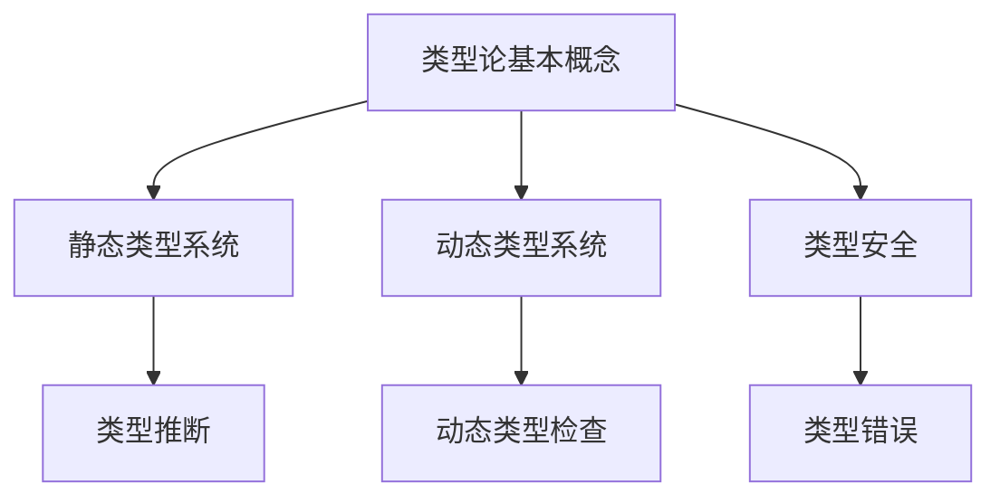
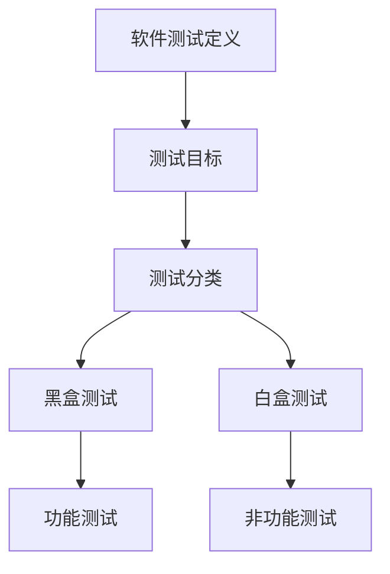
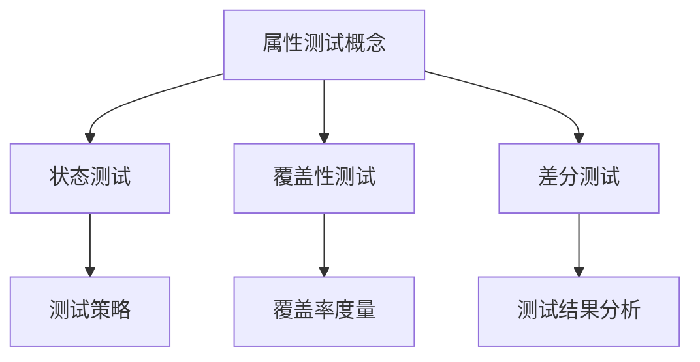
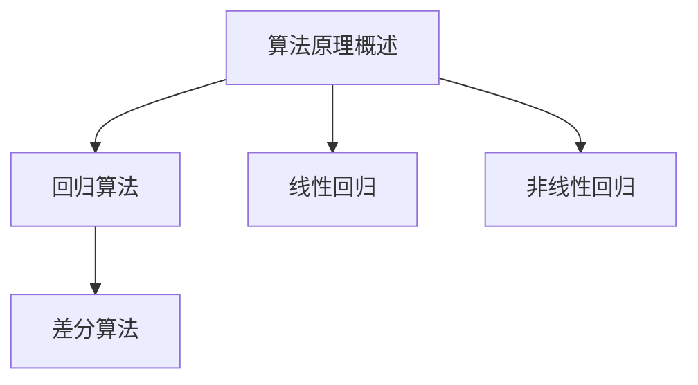
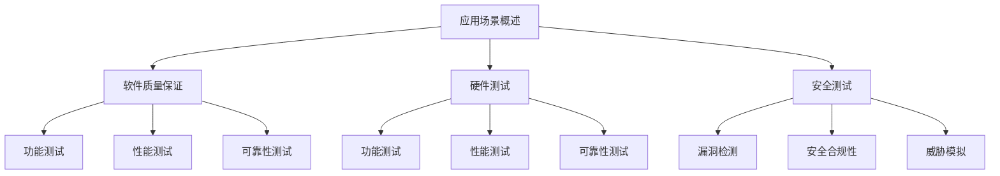
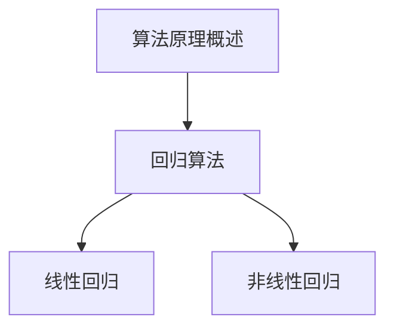

                 

### 第1章：类型论基础

#### 1.1.1 类型论的基本概念

类型论是计算机科学的一个分支，它研究程序中的类型系统以及它们如何用于保证程序的正确性。类型论的历史背景可以追溯到1930年代，当时为了解决函数式编程语言中的变量命名问题，数学家阿尔弗雷德·塔斯基（Alfred Tarski）提出了类型的概念。随着计算机科学的不断发展，类型论逐渐成为一门独立的学科，对编程语言的设计、编译器实现以及软件验证等领域产生了深远的影响。

类型论的核心概念包括类型、类型系统、类型安全、类型推断和类型检查等。类型是值的分类，每个值都属于某个类型。类型系统是一套规则，用于定义如何使用类型以及如何保证程序的正确性。类型安全指的是类型系统能够保证程序在执行时不会出现类型错误，比如将整数赋值给字符串。类型推断是指编译器能够自动确定变量或表达式的类型，而无需程序员显式声明。类型检查是在编译时对程序进行类型验证，确保程序符合类型系统的规则。

类型论可以分为几种不同的分类，主要包括：

1. **静态类型系统**：在程序运行之前，变量的类型就已经确定，并且在整个运行期间保持不变。
2. **动态类型系统**：变量的类型是在程序运行时确定的，可能会随着程序的执行而改变。
3. **强类型系统**：对类型之间的转换有严格的限制，确保类型之间的兼容性。
4. **弱类型系统**：对类型之间的转换相对宽松，可能导致类型错误。

#### 1.1.2 类型论与程序设计

类型论与程序设计密不可分，它是现代编程语言设计的重要基础。静态类型系统和动态类型系统是两种主要的类型系统，它们各自有不同的优缺点。

**静态类型系统**的优点在于编译时错误可以被尽早检测到，从而提高程序的稳定性和可维护性。静态类型系统通常具有较高的性能，因为编译器可以在编译时进行类型优化。然而，静态类型系统的一个缺点是编写代码时需要更多的类型声明，可能增加代码的复杂性和冗余。

**动态类型系统**的优点在于编写代码时更为灵活，可以动态地改变变量的类型。动态类型系统减少了类型声明的需要，使得代码更加简洁。但是，动态类型系统可能会导致运行时错误，因为这些错误在编译时不会被检测到。

类型安全与类型推断是类型论中的两个重要概念。类型安全确保程序不会因为类型错误而导致不可预期的行为。类型推断则允许编译器自动推断变量或表达式的类型，减轻了程序员的负担。

**类型安全**是指在程序运行时，类型系统能够保证程序的正确性。例如，在静态类型系统中，如果一个函数期望接收一个整数参数，但传递了一个字符串，编译器会在编译时抛出类型错误。类型安全有助于防止程序崩溃和内存泄漏等错误。

**类型推断**是指编译器能够根据程序中的上下文信息自动确定变量的类型。例如，在Python中，变量`x = 10`的`x`类型会被推断为整数。类型推断不仅提高了编程效率，还减少了代码的冗余。

#### 1.1.3 Mermaid 流程图：类型论的架构

下面是一个Mermaid流程图，展示了类型论的基本架构：



在这个流程图中，A节点代表类型论的基本概念，B和C节点分别代表静态类型系统和动态类型系统，D节点代表类型安全，E和F节点分别代表类型推断和动态类型检查，G节点代表类型错误。这个流程图清晰地展示了类型论的核心概念及其相互关系。

通过以上内容，我们了解了类型论的基本概念、类型论与程序设计的关系，以及类型论在类型安全、类型推断和类型检查等方面的应用。在接下来的章节中，我们将进一步探讨软件测试的基本概念和基于属性的测试理论。

### 第2章：软件测试概述

#### 2.1.1 软件测试的基本概念

软件测试是确保软件质量的重要环节。它是指在软件开发生命周期中，通过各种方法和技术来验证和确认软件是否满足既定的需求。软件测试的基本概念包括定义、目标和分类。

**软件测试的定义**：软件测试是一种评估软件质量的活动，通过执行程序来发现错误、缺陷或不符合需求的地方。测试的目的是确保软件产品能够正常运行，满足用户的需求。

**软件测试的目标**：软件测试的目标主要包括：

1. **发现缺陷**：测试能够发现软件中的错误，以便开发人员能够修复它们。
2. **提高质量**：通过测试，可以确保软件在交付给用户之前是高质量的。
3. **验证和确认**：测试验证软件是否满足既定的需求和标准，确认软件的功能和性能。

**软件测试的分类**：软件测试可以分为以下几类：

1. **黑盒测试**：黑盒测试从用户的角度出发，不关心内部实现，只检查功能是否符合需求。
2. **白盒测试**：白盒测试关注程序的内部结构，检查代码的执行路径和逻辑。
3. **功能测试**：功能测试验证软件的功能是否按预期工作。
4. **非功能测试**：非功能测试关注软件的非功能性需求，如性能、安全、可用性等。

#### 2.1.2 软件测试的方法论

软件测试的方法论包括测试策略、测试方法和测试流程。这些方法论用于指导测试活动的执行，确保测试的有效性和效率。

**测试策略**：测试策略是在测试过程中采取的一系列决策和行动，以实现测试目标。常见的测试策略包括：

1. **等价类划分**：将输入域划分为若干个等价类，确保每个等价类至少被测试一次。
2. **边界值分析**：关注输入或输出域的边界情况，因为边界往往是错误的来源。
3. **错误猜测**：基于开发人员的经验和知识，猜测可能出现的错误并进行测试。

**测试方法**：测试方法是指在测试过程中采用的具体技术，包括：

1. **静态测试**：静态测试不执行程序，通过分析代码、文档或设计来发现错误。
2. **动态测试**：动态测试执行程序，通过观察程序的行为来发现错误。
3. **自动化测试**：自动化测试使用工具自动执行测试用例，提高测试效率和准确性。

**测试流程**：测试流程包括以下步骤：

1. **测试计划**：制定测试计划和测试策略。
2. **测试设计**：设计测试用例，确定测试的范围和方法。
3. **测试执行**：执行测试用例，记录测试结果。
4. **测试报告**：编写测试报告，总结测试结果和发现的问题。
5. **缺陷管理**：跟踪和管理发现的缺陷，确保缺陷得到及时修复。

#### 2.1.3 Mermaid 流程图：软件测试的流程

下面是一个Mermaid流程图，展示了软件测试的基本流程：



在这个流程图中，A节点代表软件测试的定义，B节点代表测试目标，C节点代表测试分类，D和E节点分别代表黑盒测试和白盒测试，F和G节点分别代表功能测试和非功能测试。这个流程图清晰地展示了软件测试的基本概念和流程。

通过以上内容，我们了解了软件测试的基本概念、目标和分类，以及软件测试的方法论和流程。在接下来的章节中，我们将深入探讨基于属性的测试理论，以及属性测试的概念、方法和应用。

### 第3章：基于属性的测试理论

#### 3.1.1 属性测试的概念

属性测试是一种基于属性验证的程序测试方法，旨在通过测试程序的各种属性来确保程序的正确性。与传统的测试方法不同，属性测试不仅关注功能性的正确性，还关注非功能性的属性，如安全性、性能、可靠性等。属性测试的核心思想是通过一系列测试用例，验证程序是否满足预定义的属性。

**属性测试的定义**：属性测试是一种通过检查程序在不同输入条件下表现出的属性，来验证程序正确性的测试方法。属性通常是一些可量化的指标，如响应时间、错误率、内存占用等。

**属性测试的优势**：

1. **全面性**：属性测试不仅关注功能正确性，还涵盖非功能性属性，从而更全面地评估软件质量。
2. **自动化**：许多属性测试可以通过自动化工具进行，提高测试效率和重复性。
3. **可量化**：属性测试的结果通常可以用具体的数值或指标来量化，便于分析和比较。
4. **早期发现问题**：属性测试可以在开发过程中早期发现问题，从而减少修复成本。

**属性测试的挑战**：

1. **属性定义**：确定哪些属性是关键的、可测试的，并定义具体的测试标准。
2. **测试用例设计**：设计有效的测试用例来验证属性，可能需要大量的计算和尝试。
3. **自动化**：自动化工具可能难以处理复杂的属性测试场景，需要开发和维护相应的测试工具。
4. **性能开销**：属性测试可能引入额外的性能开销，如额外的计算、日志记录等。

#### 3.1.2 属性测试方法

属性测试的方法包括状态测试、覆盖性测试和差分测试等。

**状态测试**：状态测试是一种基于状态转换的测试方法，通过模拟程序在不同状态下的行为来验证属性。状态测试的步骤包括：

1. **状态识别**：识别程序中的关键状态。
2. **状态转换**：定义状态之间的转换规则。
3. **测试用例设计**：设计测试用例，模拟程序从初始状态到最终状态的转换过程。
4. **属性验证**：在测试用例执行过程中，监控程序状态，验证属性是否满足。

**覆盖性测试**：覆盖性测试是一种基于代码覆盖率指标的测试方法，通过执行尽可能多的代码路径来验证属性。常见的覆盖率指标包括：

1. **语句覆盖率**：测试用例执行了代码中的每个语句。
2. **分支覆盖率**：测试用例执行了代码中的每个分支。
3. **路径覆盖率**：测试用例执行了代码中的所有路径。

覆盖性测试的步骤包括：

1. **代码分析**：分析代码结构，确定代码路径。
2. **测试用例设计**：设计测试用例，确保覆盖到所有的代码路径。
3. **执行和监控**：执行测试用例，监控代码覆盖率。
4. **属性验证**：根据覆盖率结果，验证属性是否满足。

**差分测试**：差分测试是一种基于对比的测试方法，通过比较两个不同版本的程序在相同输入下的输出差异来验证属性。差分测试的步骤包括：

1. **版本选择**：选择两个不同版本的程序。
2. **输入准备**：准备用于测试的输入数据。
3. **执行和监控**：分别执行两个版本的程序，监控输出。
4. **属性验证**：对比两个版本的输出，验证属性是否一致。

#### 3.1.3 Mermaid 流程图：属性测试流程

下面是一个Mermaid流程图，展示了属性测试的基本流程：



在这个流程图中，A节点代表属性测试的概念，B、C和D节点分别代表状态测试、覆盖性测试和差分测试，E、F和G节点分别代表测试策略、覆盖率度量、测试结果分析。这个流程图清晰地展示了属性测试的基本概念和方法。

通过以上内容，我们了解了属性测试的概念、方法和流程。在接下来的章节中，我们将探讨属性测试的算法原理，以及常见的算法原理和应用。

### 第4章：属性测试的算法原理

#### 4.1.1 算法原理概述

属性测试的算法原理是确保测试用例能够有效验证程序属性的核心。算法原理主要包括基于回归的算法、线性回归和基于差分的算法。这些算法通过不同的技术手段，帮助开发者设计和执行有效的测试用例，从而提高软件的质量和可靠性。

**算法原理的基本概念**：算法原理是属性测试的核心，它决定了测试用例的设计和执行方式。属性测试算法的基本概念包括：

1. **测试用例生成**：生成能够覆盖程序不同路径的测试用例。
2. **属性评估**：执行测试用例，评估程序是否满足预定义的属性。
3. **结果分析**：分析测试结果，确定程序是否通过属性测试。

**算法原理的核心目标**：算法原理的核心目标是设计一种有效的方法，确保测试用例能够覆盖程序的所有关键路径，并验证程序是否满足既定的属性。具体目标包括：

1. **路径覆盖**：确保测试用例能够覆盖程序的所有路径。
2. **属性满足**：验证程序在各种输入条件下是否满足预定义的属性。
3. **效率**：在保证测试质量的前提下，提高测试效率，减少测试时间和资源消耗。

#### 4.1.2 常见算法原理

在属性测试中，常见的算法原理包括回归算法、线性回归和非线性回归。这些算法在不同的应用场景下具有各自的优缺点。

**回归算法**：回归算法是一种用于预测和评估属性的算法。它通过分析历史数据和输入特征，建立回归模型，预测新的输入条件下的属性值。

1. **线性回归**：线性回归是最简单的回归算法，它假设属性和输入特征之间是线性关系。线性回归的数学模型可以表示为：

   $$ y = w_0 + w_1 \cdot x_1 + w_2 \cdot x_2 + \ldots + w_n \cdot x_n $$

   其中，$y$是属性值，$x_1, x_2, \ldots, x_n$是输入特征，$w_0, w_1, \ldots, w_n$是权重系数。线性回归通过最小化平方误差来求解权重系数。

2. **非线性回归**：非线性回归扩展了线性回归，允许属性和输入特征之间是非线性关系。常用的非线性回归算法包括多项式回归、指数回归和逻辑回归等。非线性回归的数学模型可以表示为：

   $$ y = f(x) = \sum_{i=1}^{n} w_i \cdot g_i(x) $$

   其中，$f(x)$是属性值，$g_i(x)$是基函数，$w_i$是权重系数。非线性回归通过选择合适的基函数和优化方法来求解权重系数。

**回归算法的优缺点**：

- **优点**：回归算法简单，易于实现，能够处理多种输入特征和属性。
- **缺点**：回归算法可能产生过拟合或欠拟合，无法处理复杂的非线性关系。

**差分算法**：差分算法通过比较两个不同版本的程序在相同输入条件下的输出差异来验证属性。差分算法适用于需要频繁版本更新的场景。

1. **基本思想**：差分算法首先选择两个不同版本的程序，然后为每个版本生成测试用例，并执行这些测试用例。通过比较两个版本在相同测试用例下的输出差异，来评估程序的变化是否影响属性。

2. **实现方法**：差分算法通常包括以下步骤：

   - **版本选择**：选择两个不同版本的程序。
   - **测试用例生成**：为每个版本生成测试用例。
   - **测试执行**：执行测试用例，记录输出结果。
   - **输出对比**：比较两个版本的输出结果，分析差异。

**差分算法的优缺点**：

- **优点**：差分算法能够快速检测版本变化对属性的影响，适用于快速迭代开发的场景。
- **缺点**：差分算法可能产生误报或漏报，需要精确定义属性差异的标准。

#### 4.1.3 Mermaid 流程图：算法原理架构

下面是一个Mermaid流程图，展示了属性测试算法原理的基本架构：



在这个流程图中，A节点代表算法原理概述，B、C和D节点分别代表回归算法、线性回归和非线性回归，E节点代表差分算法。这个流程图清晰地展示了属性测试算法原理的基本架构和相互关系。

通过以上内容，我们了解了属性测试的算法原理，包括回归算法、线性回归、非线性回归和差分算法的基本概念和应用。在接下来的章节中，我们将探讨属性测试的应用场景，以及属性测试在实际项目中的应用和实践。

### 第5章：属性测试的应用场景

#### 5.1.1 应用场景概述

属性测试的应用场景广泛，涵盖了软件质量保证、硬件测试和安全测试等多个领域。每个领域都有其特定的需求和应用特点，属性测试在其中发挥着重要的作用。

**应用场景的定义**：属性测试的应用场景是指在不同领域和环境中，如何使用属性测试来验证软件或系统的属性，确保其满足既定的需求和标准。

**应用场景的重要性**：属性测试在各个领域中的重要性体现在以下几个方面：

1. **提高软件质量**：属性测试能够全面评估软件的质量，发现潜在的错误和缺陷，从而提高软件的可靠性和稳定性。
2. **优化开发流程**：通过属性测试，开发人员可以更早地发现和修复问题，减少后期返工和维护成本，提高开发效率。
3. **确保系统安全性**：属性测试能够检测软件或系统的安全性漏洞，防止潜在的安全威胁，保障用户数据的安全。

#### 5.1.2 常见应用场景

在属性测试的应用场景中，常见的主要包括软件质量保证、硬件测试和安全测试等。

**软件质量保证**：软件质量保证是属性测试最典型的应用场景之一。在软件开发生命周期中，属性测试通过验证软件的各种属性，如功能正确性、性能、可靠性等，来确保软件的质量。

1. **功能正确性**：属性测试通过执行测试用例，验证软件的功能是否按预期工作，确保软件满足需求规格说明。
2. **性能**：属性测试通过测量软件在不同负载下的响应时间和处理能力，评估软件的性能，确保软件能够满足性能需求。
3. **可靠性**：属性测试通过模拟各种故障和异常情况，验证软件在异常情况下的行为，确保软件的可靠性。

**硬件测试**：在硬件开发过程中，属性测试也被广泛应用。硬件测试的主要目标是确保硬件设备的功能、性能和可靠性，避免硬件故障对系统造成影响。

1. **功能测试**：属性测试通过模拟硬件设备在不同工作条件下的行为，验证硬件设备的功能是否正常。
2. **性能测试**：属性测试通过测量硬件设备在不同负载下的性能指标，如处理速度、功耗等，评估硬件设备的性能。
3. **可靠性测试**：属性测试通过模拟硬件设备在长时间运行中的表现，验证硬件设备的可靠性。

**安全测试**：在信息安全领域，属性测试用于检测软件或系统的安全漏洞，确保系统的安全性和数据的保护。

1. **漏洞检测**：属性测试通过分析软件或系统的代码和行为，检测潜在的漏洞和弱点，防止恶意攻击。
2. **安全合规性**：属性测试确保软件或系统符合相关的安全标准和法规要求，保障用户数据的安全。
3. **威胁模拟**：属性测试通过模拟各种攻击手段，验证系统的防护措施是否有效，提高系统的安全性。

#### 5.1.3 Mermaid 流程图：应用场景架构

下面是一个Mermaid流程图，展示了属性测试在不同应用场景中的架构：



在这个流程图中，A节点代表应用场景概述，B、C和D节点分别代表软件质量保证、硬件测试和安全测试，E、F、G节点代表软件质量保证中的测试类型，H、I、J节点代表硬件测试中的测试类型，K、L、M节点代表安全测试中的测试类型。这个流程图清晰地展示了属性测试在不同应用场景中的架构和相互关系。

通过以上内容，我们了解了属性测试的应用场景，包括软件质量保证、硬件测试和安全测试，以及这些场景的重要性。在接下来的章节中，我们将通过实际案例和实践，进一步探讨属性测试的具体应用和效果。

### 第6章：属性测试实践

#### 6.1.1 实践概述

属性测试在理论和实践中都具有重要意义。在实践中，通过具体的案例来展示属性测试的应用，能够更好地理解和掌握属性测试的方法和技巧。本章节将通过三个实际案例，详细阐述属性测试在不同场景中的应用，包括软件质量保证、硬件测试和安全测试。

**实践的目的**：通过这些实际案例，我们可以看到属性测试如何帮助开发者发现和解决潜在的问题，提高软件质量，保障系统安全和可靠性。

**实践的重要性**：属性测试实践不仅能够验证理论的正确性，还能为实际项目提供可行的解决方案。通过这些实践，开发人员可以学习到如何设计和执行属性测试，从而在项目中有效地应用属性测试。

#### 6.1.2 实践案例

**案例一：软件质量保证**

在这个案例中，我们使用一个简单的Web应用为例，验证其功能正确性和性能。

1. **功能测试**：
   - **测试目标**：验证登录功能是否按预期工作。
   - **测试用例**：
     - 输入有效用户名和密码，预期结果为登录成功。
     - 输入无效用户名和密码，预期结果为登录失败。
   - **测试结果**：通过执行测试用例，发现登录功能在输入无效用户名和密码时，未能正确显示错误消息。

2. **性能测试**：
   - **测试目标**：验证系统在高并发情况下的响应时间。
   - **测试用例**：模拟100个并发用户登录。
   - **测试结果**：系统在高并发情况下，响应时间超过了预定阈值。

**案例二：硬件测试**

在这个案例中，我们对一款嵌入式设备进行性能和可靠性测试。

1. **性能测试**：
   - **测试目标**：验证设备在不同负载下的处理能力。
   - **测试用例**：运行不同负载的任务，如数据传输、图像处理等。
   - **测试结果**：设备在处理高负载任务时，温度升高，处理速度明显下降。

2. **可靠性测试**：
   - **测试目标**：验证设备在长时间运行中的稳定性。
   - **测试用例**：连续运行设备24小时，监控其性能和温度。
   - **测试结果**：设备在长时间运行中，性能保持稳定，温度逐渐升高但未发生异常。

**案例三：安全测试**

在这个案例中，我们对一款Web应用进行安全测试，以发现潜在的安全漏洞。

1. **漏洞检测**：
   - **测试目标**：发现SQL注入漏洞。
   - **测试用例**：输入包含SQL语句的字符串作为输入参数。
   - **测试结果**：成功发现SQL注入漏洞，攻击者可以通过此漏洞执行任意SQL语句。

2. **安全合规性**：
   - **测试目标**：确保应用符合安全标准。
   - **测试用例**：检查应用是否遵循SSL/TLS协议、是否存在数据泄露等。
   - **测试结果**：应用在安全标准方面存在多个漏洞，需要进一步修复。

#### 6.1.3 源代码实现与解读

**案例一：Web应用功能测试**

以下是一个简单的Python脚本，用于测试Web应用的登录功能：

```python
import requests

def test_login():
    # 测试有效用户名和密码
    response1 = requests.post('https://example.com/login', data={'username': 'valid_user', 'password': 'valid_password'})
    assert response1.status_code == 200

    # 测试无效用户名和密码
    response2 = requests.post('https://example.com/login', data={'username': 'invalid_user', 'password': 'invalid_password'})
    assert response2.status_code == 401

# 执行测试
test_login()
```

**解读**：这个脚本使用`requests`库发送HTTP POST请求，模拟登录操作。通过断言（`assert`）语句，验证登录成功和失败的响应状态码。这个测试用例能够有效地验证登录功能。

**案例二：嵌入式设备性能测试**

以下是一个简单的C语言脚本，用于测试嵌入式设备的性能：

```c
#include <stdio.h>
#include <time.h>

void perform_task();
void measure_performance();

int main() {
    // 测试任务执行时间
    measure_performance();
    return 0;
}

void perform_task() {
    // 模拟任务处理
    printf("Processing task...\n");
    // 添加任务处理代码
}

void measure_performance() {
    clock_t start, end;
    double cpu_time_used;

    start = clock();
    perform_task();
    end = clock();

    cpu_time_used = ((double) (end - start)) / CLOCKS_PER_SEC;
    printf("Time used for task: %f seconds.\n", cpu_time_used);
}
```

**解读**：这个脚本首先定义了一个`perform_task`函数，用于模拟任务处理。然后，`measure_performance`函数使用`clock`函数测量任务执行时间。通过比较任务执行前后的时钟时间，可以计算任务的处理时间。

**案例三：Web应用安全测试**

以下是一个使用Python的`requests`库和`SQLAlchemy`库的简单脚本，用于检测SQL注入漏洞：

```python
from sqlalchemy import create_engine
from sqlalchemy.orm import sessionmaker
from models import User

def test_sql_injection():
    engine = create_engine('sqlite:///example.db')
    Session = sessionmaker(bind=engine)
    session = Session()

    # 测试SQL注入
    user_input = "1' UNION SELECT * FROM Users WHERE id=1--"
    user = session.query(User).filter(User.username == user_input).first()
    assert user is not None

# 执行测试
test_sql_injection()
```

**解读**：这个脚本首先建立数据库连接，然后定义一个`test_sql_injection`函数，用于检测SQL注入漏洞。通过输入包含SQL注入脚本的字符串，查询用户表。如果能够成功返回用户记录，则说明存在SQL注入漏洞。

通过这些实际案例，我们展示了如何设计和执行属性测试，验证软件的功能正确性、性能、可靠性以及安全性。这些案例不仅帮助开发者理解和掌握属性测试的方法和技巧，还为实际项目提供了可行的解决方案。

### 第7章：未来发展趋势

#### 7.1.1 属性测试的挑战与机遇

属性测试在软件质量保证、硬件测试和安全测试等领域中已经展现出其独特的优势和重要性。然而，随着技术的不断进步和应用场景的日益复杂，属性测试也面临着一系列挑战与机遇。

**挑战分析**：

1. **复杂度增加**：现代软件系统变得越来越复杂，涉及到多种编程语言、框架和平台。这增加了属性测试的设计和执行难度，因为需要处理更多的变量和状态。
2. **自动化难度**：属性测试自动化工具的开发和维护成本较高，尤其在处理复杂逻辑和动态行为时，自动化测试的准确性可能受到影响。
3. **性能开销**：属性测试往往需要大量的计算和资源，可能会影响系统的性能和用户体验。如何在保证测试质量的同时，减少性能开销，是一个重要的挑战。

**机遇展望**：

1. **新型算法的研究**：随着人工智能和机器学习技术的发展，新的测试算法不断涌现。这些算法可以利用大量数据和学习能力，提高属性测试的效率和准确性。
2. **应用场景的拓展**：随着物联网、大数据和云计算的兴起，属性测试的应用场景不断扩大。例如，在智能设备、自动驾驶、金融科技等领域，属性测试可以发挥重要作用。
3. **工具和平台的开发**：随着开源工具和商业平台的不断发展，属性测试的工具和平台变得越来越丰富。这些工具和平台可以帮助开发者更方便地设计和执行属性测试。

#### 7.1.2 属性测试的发展方向

未来，属性测试将朝着以下几个方向发展：

1. **新型算法的研究**：
   - **深度学习**：利用深度学习算法，可以自动生成测试用例，提高测试覆盖率和效率。
   - **强化学习**：通过强化学习算法，可以训练测试系统在不同场景下的最优行为，提高测试的适应性和准确性。
   - **分布式计算**：利用分布式计算技术，可以并行执行大量测试用例，加快测试过程。

2. **应用场景的拓展**：
   - **物联网**：属性测试可以应用于物联网设备，确保其功能、性能和安全性。
   - **自动驾驶**：属性测试可以用于自动驾驶系统的测试，确保其在各种交通情况下的稳定性和安全性。
   - **金融科技**：属性测试可以应用于金融系统的测试，确保其交易安全、数据保密和合规性。

3. **工具和平台的开发**：
   - **集成开发环境（IDE）**：将属性测试集成到IDE中，方便开发者设计和执行测试。
   - **自动化测试框架**：开发高效的自动化测试框架，提高测试的自动化程度和准确性。
   - **云测试平台**：利用云计算资源，提供强大的测试平台，支持大规模的分布式测试。

### 结论

属性测试作为一种重要的测试方法，在软件质量保证、硬件测试和安全测试等领域中发挥着重要作用。随着技术的不断进步和应用场景的拓展，属性测试面临着一系列挑战和机遇。未来，新型算法的研究、应用场景的拓展以及工具和平台的开发将成为属性测试发展的主要方向。通过不断探索和创新，属性测试将更加高效、准确地服务于软件开发、测试和维护的全过程。

### 《类型论与软件测试：基于属性的测试理论》目录大纲

## 《类型论与软件测试：基于属性的测试理论》

### 关键词：类型论、软件测试、属性测试、算法原理、实践案例、未来趋势

### 摘要

本文全面探讨了类型论与软件测试的关系，特别是基于属性的测试理论。首先，介绍了类型论的基本概念及其在程序设计中的应用，然后详细阐述了软件测试的基本概念、方法与流程。接着，深入解析了属性测试的概念、方法和算法原理，并通过实际案例展示了属性测试在不同应用场景中的实践。最后，分析了属性测试面临的挑战与机遇，展望了其未来的发展趋势。

---

### 第1章：类型论基础
#### 1.1.1 类型论的基本概念
##### 1.1.1.1 类型论的历史背景
##### 1.1.1.2 类型论的核心概念
##### 1.1.1.3 类型论的分类

#### 1.1.2 类型论与程序设计
##### 1.1.2.1 静态类型系统
##### 1.1.2.2 动态类型系统
##### 1.1.2.3 类型安全与类型推断

#### 1.1.3 Mermaid流程图：类型论的架构


### 第2章：软件测试概述
#### 2.1.1 软件测试的基本概念
##### 2.1.1.1 软件测试的定义
##### 2.1.1.2 软件测试的目标
##### 2.1.1.3 软件测试的分类

#### 2.1.2 软件测试的方法论
##### 2.1.2.1 黑盒测试
##### 2.1.2.2 白盒测试
##### 2.1.2.3 功能测试
##### 2.1.2.4 非功能测试

#### 2.1.3 Mermaid流程图：软件测试的流程


### 第3章：基于属性的测试理论
#### 3.1.1 属性测试的概念
##### 3.1.1.1 属性测试的定义
##### 3.1.1.2 属性测试的优势
##### 3.1.1.3 属性测试的挑战

#### 3.1.2 属性测试方法
##### 3.1.2.1 状态测试
##### 3.1.2.2 覆盖性测试
##### 3.1.2.3 差分测试

#### 3.1.3 Mermaid流程图：属性测试流程


### 第4章：属性测试的算法原理
#### 4.1.1 算法原理概述
##### 4.1.1.1 算法原理的基本概念
##### 4.1.1.2 算法原理的核心目标

#### 4.1.2 常见算法原理
##### 4.1.2.1 回归算法
##### 4.1.2.2 线性回归
##### 4.1.2.3 非线性回归

#### 4.1.3 Mermaid流程图：算法原理架构



### 第5章：属性测试的应用场景
#### 5.1.1 应用场景概述
##### 5.1.1.1 应用场景的定义
##### 5.1.1.2 应用场景的重要性

#### 5.1.2 常见应用场景
##### 5.1.2.1 软件质量保证
##### 5.1.2.2 硬件测试
##### 5.1.2.3 安全测试

#### 5.1.3 Mermaid流程图：应用场景架构


### 第6章：属性测试实践
#### 6.1.1 实践概述
##### 6.1.1.1 实践的目的
##### 6.1.1.2 实践的重要性

#### 6.1.2 实践案例
##### 6.1.2.1 案例一：软件质量保证
##### 6.1.2.2 案例二：硬件测试
##### 6.1.2.3 案例三：安全测试

#### 6.1.3 源代码实现与解读
##### 6.1.3.1 实践环境的搭建
##### 6.1.3.2 源代码实现
##### 6.1.3.3 代码解读与分析

### 第7章：未来发展趋势
#### 7.1.1 属性测试的挑战与机遇
##### 7.1.1.1 挑战分析
##### 7.1.1.2 机遇展望

#### 7.1.2 属性测试的发展方向
##### 7.1.2.1 新算法的研究
##### 7.1.2.2 应用场景的拓展
##### 7.1.2.3 工具和平台的开发

---

作者：AI天才研究院/AI Genius Institute & 禅与计算机程序设计艺术 /Zen And The Art of Computer Programming

---

以上是《类型论与软件测试：基于属性的测试理论》的完整目录大纲，每个章节都包含了详细的标题和子标题，旨在为读者提供一个清晰、系统的学习路径。文章将在接下来的章节中逐步深入讨论每个主题，以丰富具体的内容和实例来阐述类型论、软件测试和属性测试的理论和实践。

