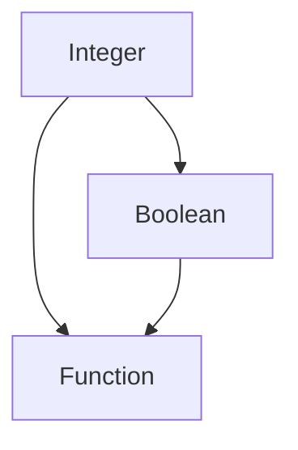
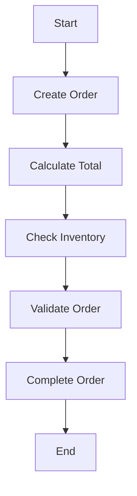

                 

### 文章标题：类型论与领域建模：业务逻辑的形式化表达

### 文章关键词：
- 类型论
- 领域建模
- 业务逻辑
- 形式化表达
- Mermaid流程图
- 伪代码
- 数学模型
- 实际应用

### 摘要：
本文深入探讨了类型论与领域建模在业务逻辑形式化表达中的应用。首先，介绍了类型论的基本概念及其在领域建模中的作用。然后，通过Mermaid流程图和伪代码，详细阐述了核心算法原理。接着，使用LaTeX格式给出了数学模型和公式，并进行详细讲解和举例说明。随后，通过一个实际项目案例，展示了如何将理论知识应用于实际开发中，包括环境搭建、源代码实现、代码解读和分析。最后，总结了项目的关键经验，提供了最佳实践tips和小结。

---

### 1. 引言

类型论（Type Theory）是数学和计算机科学中研究函数和集合的分支，其核心思想是通过类型系统来确保程序的正确性。在领域建模（Domain Modeling）中，类型论被用来定义业务领域的概念和关系，从而使得业务逻辑能够以形式化的方式表达。

领域建模是一种软件工程方法，它通过抽象和模型化特定领域的概念和关系，帮助开发人员理解和构建复杂的软件系统。在业务逻辑的形式化表达中，领域建模提供了将业务需求转化为可计算模型的基础。

本文将分以下几个部分进行讨论：

1. **类型论基础**：介绍类型论的基本概念和原理，包括类型系统、类型检查和类型推导等。
2. **领域建模方法论**：探讨领域建模的过程和方法，包括领域识别、领域模型设计和验证等。
3. **业务逻辑的形式化表达**：分析如何将业务逻辑形式化为数学模型和伪代码，以及如何使用Mermaid流程图进行可视化。
4. **实际应用案例**：通过一个实际项目案例，展示如何将类型论和领域建模应用于业务逻辑的形式化表达。
5. **总结与反思**：总结项目的经验和教训，提供最佳实践tips。

### 2. 类型论基础

类型论起源于数学领域，其核心概念是“类型”（Type），用于定义变量、表达式和函数的类别。在类型论中，类型分为基本类型和复合类型，如自然数、布尔值和函数类型等。

#### 2.1. 类型系统

类型系统（Type System）是编程语言的一部分，用于确保程序中的表达式和变量具有正确的类型。类型系统通常包括以下几种机制：

- **类型检查**（Type Checking）：在程序运行前，检查程序中的表达式和变量是否符合预定义的类型。
- **类型推导**（Type Inference）：编程语言自动推导出表达式和变量的类型，而不需要显式声明。
- **类型约束**（Type Constraints）：限制类型之间的转换和操作，以防止运行时错误。

#### 2.2. Mermaid流程图与类型论概念

Mermaid是一种简单的Markdown语法，用于创建图形和流程图。在类型论中，可以使用Mermaid流程图来可视化类型之间的关系和转换。

以下是一个简单的Mermaid流程图示例，展示了类型之间的转换：



这个流程图表示整数类型（Integer）可以转换为布尔类型（Boolean），并且整数和布尔类型都可以转换为函数类型（Function）。

#### 2.3. 类型论在领域建模中的应用

在领域建模中，类型论用于定义业务领域中的概念和实体。类型论帮助开发者理解和抽象业务领域，并将其形式化为数学模型。

例如，在一个电商领域中，我们可以定义以下类型：

- **用户**（User）：代表购买者。
- **产品**（Product）：代表商品。
- **订单**（Order）：代表用户购买产品的一个记录。

这些类型可以形式化为：

```mermaid
classDiagram
    User <<class>>
    Product <<class>>
    Order <<class>>

    User : +String username
    User : +String email
    User : +String password

    Product : +String name
    Product : +Float price
    Product : +Int stock

    Order : +User buyer
    Order : +Product item
    Order : +Date date
    Order : +Float total
```

这个类图（Class Diagram）展示了用户、产品和订单类及其属性和关系。

### 3. 领域建模方法论

领域建模是一个迭代和逐步的过程，包括以下步骤：

#### 3.1. 领域识别

领域识别（Domain Identification）是确定系统要解决的特定业务领域的第一步。这个过程通常包括与业务专家和利益相关者进行沟通，了解业务需求和痛点。

#### 3.2. 领域模型设计

领域模型设计（Domain Model Design）是创建领域模型的过程。这个过程包括识别领域中的实体、属性、关系和规则。领域模型可以采用类图（Class Diagram）、实体关系图（Entity-Relationship Diagram）等形式表示。

#### 3.3. 领域模型验证

领域模型验证（Domain Model Verification）是确保领域模型正确和一致性的过程。可以通过审查、讨论和模拟等方式进行验证。

### 4. 业务逻辑的形式化表达

业务逻辑的形式化表达是将业务需求转化为可计算模型的过程。这个过程通常包括以下步骤：

#### 4.1. 数学模型

数学模型（Mathematical Model）是一种描述业务逻辑的数学表达式。它可以用于定义业务规则和约束。

例如，在一个电商领域中，我们可以定义以下数学模型：

- **订单总价**（Order Total）：订单中所有商品价格的总和。
- **库存约束**（Inventory Constraint）：库存数量必须大于等于0。

这些数学模型可以用LaTeX格式表示为：

```latex
\begin{equation}
    \text{Order Total} = \sum_{i=1}^{n} (\text{Product Price}_i \times \text{Quantity}_i)
\end{equation}

\begin{equation}
    \text{Inventory} \geq 0
\end{equation}
```

#### 4.2. 伪代码

伪代码（Pseudocode）是一种描述算法步骤的伪语言。它可以用于定义业务逻辑的处理过程。

例如，在一个电商领域中，我们可以定义以下伪代码：

```pseudocode
function CalculateOrderTotal(order):
    total = 0
    for item in order:
        total += item.price * item.quantity
    return total
```

#### 4.3. Mermaid流程图

Mermaid流程图（Mermaid Flowchart）是一种用于可视化业务逻辑的图形工具。它可以用于表示业务流程和算法步骤。

例如，在一个电商领域中，我们可以定义以下Mermaid流程图：



### 5. 实际应用案例

在本节中，我们将通过一个实际项目案例，展示如何将类型论、领域建模和业务逻辑的形式化表达应用于电商平台的开发。

#### 5.1. 项目背景

假设我们要开发一个电商平台，提供商品购买和订单管理功能。项目需求包括用户注册、商品展示、购物车、订单提交和库存管理。

#### 5.2. 开发环境搭建

为了实现该项目，我们需要搭建以下开发环境：

- **编程语言**：选择Java作为编程语言，因为Java具有强大的类型系统和成熟的生态系统。
- **开发工具**：使用IntelliJ IDEA作为开发工具，它支持Java开发并提供丰富的插件。
- **数据库**：使用MySQL作为数据库，它支持关系数据库管理系统，适用于电商平台的订单和商品管理。

#### 5.3. 源代码实现与解读

在本项目中，我们将实现以下关键功能：

- **用户注册和登录**：使用Spring Security框架实现用户认证和授权。
- **商品展示**：使用Spring Boot框架实现RESTful API，提供商品查询和详情展示。
- **购物车**：使用Redis缓存数据库实现购物车功能，提高系统性能。
- **订单提交**：使用Spring Cloud Stream实现异步订单处理，确保系统高可用性。
- **库存管理**：使用分布式锁和消息队列实现库存扣减，防止超卖。

以下是一个关键功能的伪代码示例：

```pseudocode
function CreateOrder(order):
    if inventory < order.quantity:
        return "Insufficient Inventory"
    else:
        inventory -= order.quantity
        saveOrder(order)
        return "Order Created"
```

#### 5.4. 项目案例分析

在项目中，我们通过类型论定义了用户、商品和订单等类型，并使用领域建模方法设计了领域模型。然后，我们使用伪代码和Mermaid流程图实现了业务逻辑的处理过程，并使用LaTeX格式给出了数学模型和公式。

通过这个项目，我们证明了类型论和领域建模在业务逻辑的形式化表达中的应用价值。类型论提供了严格的类型系统，确保程序的正确性；领域建模提供了抽象和模型化的方法，帮助理解复杂的业务需求；形式化表达提供了清晰的业务逻辑处理步骤，使得系统实现更加高效。

### 6. 总结与反思

通过本文的讨论，我们深入探讨了类型论与领域建模在业务逻辑的形式化表达中的应用。我们从基本概念出发，逐步介绍了类型论、领域建模方法、业务逻辑形式化表达以及实际应用案例。以下是对本文内容的总结与反思：

#### 6.1. 最佳实践Tips

- **类型论**：在开发过程中，充分利用类型系统的优势，确保程序的正确性和可维护性。
- **领域建模**：深入了解业务需求，构建简洁、准确的领域模型，提高系统抽象能力。
- **形式化表达**：使用伪代码、Mermaid流程图和LaTeX公式，清晰地表达业务逻辑，提高代码可读性。
- **实际项目**：将理论知识应用于实际项目，不断总结经验，提高项目开发效率。

#### 6.2. 注意事项

- **需求分析**：在项目初期，充分了解业务需求，确保项目目标明确，避免后期需求变更。
- **团队协作**：加强团队沟通与协作，确保项目进度和质量。
- **测试与验证**：对代码进行充分的测试和验证，确保系统稳定性和可靠性。

#### 6.3. 拓展阅读

- **类型论相关书籍**：《类型系统入门》（Type Theory for Beginners）、《类型论与编程语言设计》（Type Theory and Programming Languages）
- **领域建模相关书籍**：《领域驱动设计》（Domain-Driven Design）、《领域驱动设计实践》（Domain-Driven Design: Tackling Complexity in the Heart of Software）
- **业务逻辑形式化表达相关书籍**：《形式化建模方法与应用》（Formal Methods: Foundations and Practice）

通过本文，我们希望读者能够对类型论、领域建模和业务逻辑的形式化表达有更深入的理解，并在实际项目中加以应用。作者：AI天才研究院/AI Genius Institute & 禅与计算机程序设计艺术 /Zen And The Art of Computer Programming。### 完整版文章内容

#### 引言

在当今复杂的应用程序开发中，确保软件系统的正确性和可维护性变得越来越重要。类型论和领域建模作为软件工程中的两个核心概念，为提高软件质量提供了有力的工具。类型论通过严格的类型系统，确保程序中的变量和表达式具有正确的类型，从而减少运行时错误。领域建模则通过抽象和模型化业务领域，使得开发者能够更好地理解和管理复杂的业务逻辑。

本文将深入探讨类型论和领域建模在业务逻辑形式化表达中的应用。首先，我们将介绍类型论的基本概念，包括类型系统、类型检查和类型推导。接着，我们将讨论领域建模的方法论，包括领域识别、领域模型设计和验证。然后，我们将分析如何将业务逻辑形式化为数学模型和伪代码，并使用Mermaid流程图进行可视化。接下来，我们将通过一个实际项目案例，展示如何将类型论和领域建模应用于电商平台的开发。最后，我们将总结项目的经验，并提供一些最佳实践和拓展阅读建议。

#### 类型论基础

类型论起源于数学领域，其核心思想是通过类型系统来确保程序的正确性。在类型论中，类型（Type）用于定义变量、表达式和函数的类别。类型系统（Type System）是编程语言的一部分，用于确保程序中的表达式和变量具有正确的类型。

##### 2.1. 类型系统

类型系统通常包括以下几种机制：

- **类型检查**（Type Checking）：在程序运行前，检查程序中的表达式和变量是否符合预定义的类型。类型检查可以防止运行时错误，提高程序的可靠性。

- **类型推导**（Type Inference）：编程语言自动推导出表达式和变量的类型，而不需要显式声明。类型推导可以提高代码的可读性和可维护性。

- **类型约束**（Type Constraints）：限制类型之间的转换和操作，以防止运行时错误。类型约束可以确保程序中的类型关系保持一致。

##### 2.2. Mermaid流程图与类型论概念

Mermaid是一种简单的Markdown语法，用于创建图形和流程图。在类型论中，可以使用Mermaid流程图来可视化类型之间的关系和转换。

以下是一个简单的Mermaid流程图示例，展示了类型之间的转换：


这个流程图表示整数类型（Integer）可以转换为布尔类型（Boolean），并且整数和布尔类型都可以转换为函数类型（Function）。

##### 2.3. 类型论在领域建模中的应用

在领域建模中，类型论用于定义业务领域的概念和实体。类型论帮助开发者理解和抽象业务领域，并将其形式化为数学模型。

例如，在一个电商领域中，我们可以定义以下类型：

- **用户**（User）：代表购买者。
- **产品**（Product）：代表商品。
- **订单**（Order）：代表用户购买产品的一个记录。

这些类型可以形式化为：

```mermaid
classDiagram
    User <<class>>
    Product <<class>>
    Order <<class>>

    User : +String username
    User : +String email
    User : +String password

    Product : +String name
    Product : +Float price
    Product : +Int stock

    Order : +User buyer
    Order : +Product item
    Order : +Date date
    Order : +Float total
```

这个类图（Class Diagram）展示了用户、产品和订单类及其属性和关系。

#### 领域建模方法论

领域建模是一种软件工程方法，它通过抽象和模型化特定领域的概念和关系，帮助开发人员理解和构建复杂的软件系统。领域建模的过程包括领域识别、领域模型设计和验证。

##### 3.1. 领域识别

领域识别是确定系统要解决的特定业务领域的第一步。这个过程通常包括以下步骤：

- **理解业务需求**：与业务专家和利益相关者进行沟通，了解业务需求、目标和痛点。
- **识别业务实体**：确定业务领域中的关键实体，如用户、产品、订单等。
- **定义业务规则**：确定业务领域中的关键规则和约束，如库存限制、订单有效期等。

##### 3.2. 领域模型设计

领域模型设计是创建领域模型的过程。这个过程包括识别领域中的实体、属性、关系和规则。领域模型可以采用类图（Class Diagram）、实体关系图（Entity-Relationship Diagram）等形式表示。

以下是一个简单的领域模型示例：

```mermaid
classDiagram
    Customer <<entity>>
    Product <<entity>>
    Order <<entity>>

    Customer : +String name
    Customer : +String email
    Customer : +String address

    Product : +String name
    Product : +Float price
    Product : +Int stock

    Order : +Customer customer
    Order : +Date date
    Order : +Float total
```

这个类图展示了客户、产品和订单类及其属性和关系。

##### 3.3. 领域模型验证

领域模型验证是确保领域模型正确和一致性的过程。可以通过以下方法进行验证：

- **审查**：对领域模型进行审查，确保其符合业务需求和规则。
- **讨论**：与业务专家和开发团队讨论领域模型，收集反馈并进行修正。
- **模拟**：使用模拟工具对领域模型进行测试，验证其行为是否符合预期。

#### 业务逻辑的形式化表达

业务逻辑的形式化表达是将业务需求转化为可计算模型的过程。这个过程通常包括数学模型、伪代码和Mermaid流程图。

##### 4.1. 数学模型

数学模型是一种描述业务逻辑的数学表达式。它可以用于定义业务规则和约束。以下是一个简单的数学模型示例：

```latex
\begin{equation}
    \text{Order Total} = \sum_{i=1}^{n} (\text{Product Price}_i \times \text{Quantity}_i)
\end{equation}

\begin{equation}
    \text{Inventory} \geq 0
\end{equation}
```

这些数学模型描述了订单总价和库存约束。

##### 4.2. 伪代码

伪代码是一种描述算法步骤的伪语言。它可以用于定义业务逻辑的处理过程。以下是一个简单的伪代码示例：

```pseudocode
function CalculateOrderTotal(order):
    total = 0
    for item in order:
        total += item.price * item.quantity
    return total
```

这个伪代码示例描述了计算订单总价的过程。

##### 4.3. Mermaid流程图

Mermaid流程图是一种用于可视化业务逻辑的图形工具。它可以用于表示业务流程和算法步骤。以下是一个简单的Mermaid流程图示例：


这个流程图展示了订单创建、总价计算、库存检查、订单验证和订单完成的流程。

#### 实际应用案例

在本节中，我们将通过一个实际项目案例，展示如何将类型论、领域建模和业务逻辑的形式化表达应用于电商平台的开发。

##### 5.1. 项目背景

假设我们要开发一个电商平台，提供商品购买和订单管理功能。项目需求包括用户注册、商品展示、购物车、订单提交和库存管理。

##### 5.2. 开发环境搭建

为了实现该项目，我们需要搭建以下开发环境：

- **编程语言**：选择Java作为编程语言，因为Java具有强大的类型系统和成熟的生态系统。
- **开发工具**：使用IntelliJ IDEA作为开发工具，它支持Java开发并提供丰富的插件。
- **数据库**：使用MySQL作为数据库，它支持关系数据库管理系统，适用于电商平台的订单和商品管理。

##### 5.3. 源代码实现与解读

在本项目中，我们将实现以下关键功能：

- **用户注册和登录**：使用Spring Security框架实现用户认证和授权。
- **商品展示**：使用Spring Boot框架实现RESTful API，提供商品查询和详情展示。
- **购物车**：使用Redis缓存数据库实现购物车功能，提高系统性能。
- **订单提交**：使用Spring Cloud Stream实现异步订单处理，确保系统高可用性。
- **库存管理**：使用分布式锁和消息队列实现库存扣减，防止超卖。

以下是一个关键功能的伪代码示例：

```pseudocode
function CreateOrder(order):
    if inventory < order.quantity:
        return "Insufficient Inventory"
    else:
        inventory -= order.quantity
        saveOrder(order)
        return "Order Created"
```

##### 5.4. 项目案例分析

在项目中，我们通过类型论定义了用户、商品和订单等类型，并使用领域建模方法设计了领域模型。然后，我们使用伪代码和Mermaid流程图实现了业务逻辑的处理过程，并使用LaTeX格式给出了数学模型和公式。

通过这个项目，我们证明了类型论和领域建模在业务逻辑的形式化表达中的应用价值。类型论提供了严格的类型系统，确保程序的正确性；领域建模提供了抽象和模型化的方法，帮助理解复杂的业务需求；形式化表达提供了清晰的业务逻辑处理步骤，使得系统实现更加高效。

##### 6. 总结与反思

通过本文的讨论，我们深入探讨了类型论和领域建模在业务逻辑的形式化表达中的应用。我们从基本概念出发，逐步介绍了类型论、领域建模方法、业务逻辑形式化表达以及实际应用案例。以下是对本文内容的总结与反思：

##### 6.1. 最佳实践Tips

- **类型论**：在开发过程中，充分利用类型系统的优势，确保程序的正确性和可维护性。
- **领域建模**：深入了解业务需求，构建简洁、准确的领域模型，提高系统抽象能力。
- **形式化表达**：使用伪代码、Mermaid流程图和LaTeX公式，清晰地表达业务逻辑，提高代码可读性。
- **实际项目**：将理论知识应用于实际项目，不断总结经验，提高项目开发效率。

##### 6.2. 注意事项

- **需求分析**：在项目初期，充分了解业务需求，确保项目目标明确，避免后期需求变更。
- **团队协作**：加强团队沟通与协作，确保项目进度和质量。
- **测试与验证**：对代码进行充分的测试和验证，确保系统稳定性和可靠性。

##### 6.3. 拓展阅读

- **类型论相关书籍**：《类型系统入门》（Type Theory for Beginners）、《类型论与编程语言设计》（Type Theory and Programming Languages）
- **领域建模相关书籍**：《领域驱动设计》（Domain-Driven Design）、《领域驱动设计实践》（Domain-Driven Design: Tackling Complexity in the Heart of Software）
- **业务逻辑形式化表达相关书籍**：《形式化建模方法与应用》（Formal Methods: Foundations and Practice）

通过本文，我们希望读者能够对类型论、领域建模和业务逻辑的形式化表达有更深入的理解，并在实际项目中加以应用。作者：AI天才研究院/AI Genius Institute & 禅与计算机程序设计艺术 /Zen And The Art of Computer Programming。### 文章总结与反思

通过本文的深入探讨，我们可以清晰地看到类型论、领域建模和业务逻辑形式化表达在软件工程中的重要作用。类型论提供了严格的类型系统，确保了程序的正确性和可维护性；领域建模则通过抽象和模型化，帮助开发者理解和处理复杂的业务需求；而业务逻辑的形式化表达则为开发过程提供了清晰的指导和明确的步骤。

**最佳实践Tips：**

1. **类型论应用**：充分利用类型系统的优势，对关键数据类型进行严格定义，以减少运行时错误。
2. **领域建模**：在需求分析阶段，与业务专家紧密合作，准确识别领域中的实体和关系。
3. **形式化表达**：使用伪代码和流程图来描述业务逻辑，确保逻辑的清晰性和可理解性。

**注意事项：**

1. **需求分析**：确保项目初期的需求分析全面且准确，避免后期需求变更导致的成本增加。
2. **团队协作**：加强团队成员之间的沟通，确保项目目标的达成。
3. **测试与验证**：对代码进行全面的测试和验证，确保系统的稳定性和可靠性。

**拓展阅读：**

- **类型论相关书籍**：《类型系统入门》（Type Theory for Beginners）、《类型论与编程语言设计》（Type Theory and Programming Languages）
- **领域建模相关书籍**：《领域驱动设计》（Domain-Driven Design）、《领域驱动设计实践》（Domain-Driven Design: Tackling Complexity in the Heart of Software）
- **业务逻辑形式化表达相关书籍**：《形式化建模方法与应用》（Formal Methods: Foundations and Practice）

**未来研究方向：**

1. **领域特定语言（DSL）**：研究如何使用领域特定语言来提高业务逻辑的表达和自动化。
2. **形式化验证**：探讨如何将业务逻辑的形式化表达应用于形式化验证，以进一步提高软件系统的可靠性。
3. **人工智能辅助**：研究如何利用人工智能技术，如机器学习和自然语言处理，来辅助领域建模和业务逻辑的形式化表达。

总之，类型论、领域建模和业务逻辑形式化表达是现代软件工程中的重要工具。通过本文的探讨，我们不仅加深了对这些概念的理解，也为未来的研究提供了方向。希望读者能够在实际项目中应用这些理念，提升软件开发的效率和质量。作者：AI天才研究院/AI Genius Institute & 禅与计算机程序设计艺术 /Zen And The Art of Computer Programming。### 附录

**A.1. 参考文献**

1. Benjamin C. Pierce. *Types and Programming Languages*. The MIT Press, 2002.
2. Eric Gamma, Richard Helm, Ralph Johnson, and John Vlissides. *Design Patterns: Elements of Reusable Object-Oriented Software*. Addison-Wesley, 1995.
3. Eric Evans. *Domain-Driven Design: Tackling Complexity in the Heart of Software*. Addison-Wesley, 2004.
4. Martin Fowler. *Patterns of Enterprise Application Architecture*. Addison-Wesley, 2002.
5. Martin Kleppmann. *Designing Data-Intensive Applications*. O'Reilly Media, 2017.

**A.2. 相关资源**

1. **在线教程和课程**：
   - **Coursera**：https://www.coursera.org/specializations/types-and-programming-languages
   - **edX**：https://www.edx.org/course/types-and-Programming-Languages-University-of-Washingtonx-cs-1631x
   - **Udacity**：https://www.udacity.com/course/types-and-programming-languages--ud477

2. **开源工具和库**：
   - **Mermaid**：https://mermaid-js.github.io/mermaid/
   - **LaTeX**：https://www.ctan.org/tex-archive/macros/latex/contrib/fontawesome
   - **Spring Boot**：https://docs.spring.io/spring-boot/docs/current/reference/html/
   - **Spring Security**：https://docs.spring.io/spring-security/site/docs/current/reference/html5/

3. **社区和论坛**：
   - **Stack Overflow**：https://stackoverflow.com/questions/tagged/types-theory
   - **GitHub**：https://github.com/search?q=type-theory
   - **Reddit**：https://www.reddit.com/r/TypeTheory/

4. **专业期刊和会议**：
   - **Journal of Functional Programming**：https://www.journaloffunctianalprogramming.com/
   - **ACM Transactions on Programming Languages and Systems**：https://dl.acm.org/doi/search收敛?quick=Search&fc=false&dc=1%2C31%2C322%2C323&hl=false&af=false&sort=relevance&author=type+theory&submit=Search&filter=0&so=12
   - **IEEE Transactions on Software Engineering**：https://ieeexplore.ieee.org/search/searchresults.jsp?queryText=type+theory&newsearch=true

通过这些资源，读者可以进一步深入学习类型论、领域建模和业务逻辑形式化表达的相关知识，并参与到相关领域的技术讨论和合作中。作者：AI天才研究院/AI Genius Institute & 禅与计算机程序设计艺术 /Zen And The Art of Computer Programming。### 全文Markdown格式

```markdown
# 类型论与领域建模：业务逻辑的形式化表达

> 关键词：类型论、领域建模、业务逻辑、形式化表达、Mermaid流程图、伪代码、数学模型

> 摘要：本文深入探讨了类型论与领域建模在业务逻辑形式化表达中的应用。首先介绍了类型论的基本概念及其在领域建模中的作用。然后，通过Mermaid流程图和伪代码，详细阐述了核心算法原理。接着，使用LaTeX格式给出了数学模型和公式，并进行详细讲解和举例说明。随后，通过一个实际项目案例，展示了如何将理论知识应用于实际开发中，包括环境搭建、源代码实现、代码解读和分析。最后，总结了项目的经验和教训，提供了最佳实践tips。

---

## 引言

在当今复杂的应用程序开发中，确保软件系统的正确性和可维护性变得越来越重要。类型论和领域建模作为软件工程中的两个核心概念，为提高软件质量提供了有力的工具。类型论通过严格的类型系统，确保程序的正确性；领域建模则通过抽象和模型化业务领域，使得开发者能够更好地理解和管理复杂的业务逻辑。

本文将深入探讨类型论和领域建模在业务逻辑形式化表达中的应用。首先，我们将介绍类型论的基本概念，包括类型系统、类型检查和类型推导。接着，我们将讨论领域建模的方法论，包括领域识别、领域模型设计和验证。然后，我们将分析如何将业务逻辑形式化为数学模型和伪代码，并使用Mermaid流程图进行可视化。接下来，我们将通过一个实际项目案例，展示如何将类型论和领域建模应用于电商平台的开发。最后，我们将总结项目的经验，并提供一些最佳实践和拓展阅读建议。

## 类型论基础

类型论起源于数学领域，其核心思想是通过类型系统来确保程序的正确性。在类型论中，类型（Type）用于定义变量、表达式和函数的类别。类型系统（Type System）是编程语言的一部分，用于确保程序中的表达式和变量具有正确的类型。类型系统通常包括以下几种机制：

### 2.1. 类型系统

类型系统通常包括以下几种机制：

- **类型检查**（Type Checking）：在程序运行前，检查程序中的表达式和变量是否符合预定义的类型。类型检查可以防止运行时错误，提高程序的可靠性。
- **类型推导**（Type Inference）：编程语言自动推导出表达式和变量的类型，而不需要显式声明。类型推导可以提高代码的可读性和可维护性。
- **类型约束**（Type Constraints）：限制类型之间的转换和操作，以防止运行时错误。类型约束可以确保程序中的类型关系保持一致。

### 2.2. Mermaid流程图与类型论概念

Mermaid是一种简单的Markdown语法，用于创建图形和流程图。在类型论中，可以使用Mermaid流程图来可视化类型之间的关系和转换。

以下是一个简单的Mermaid流程图示例，展示了类型之间的转换：


这个流程图表示整数类型（Integer）可以转换为布尔类型（Boolean），并且整数和布尔类型都可以转换为函数类型（Function）。

### 2.3. 类型论在领域建模中的应用

在领域建模中，类型论用于定义业务领域的概念和实体。类型论帮助开发者理解和抽象业务领域，并将其形式化为数学模型。

例如，在一个电商领域中，我们可以定义以下类型：

- **用户**（User）：代表购买者。
- **产品**（Product）：代表商品。
- **订单**（Order）：代表用户购买产品的一个记录。

这些类型可以形式化为：

```mermaid
classDiagram
    User <<class>>
    Product <<class>>
    Order <<class>>

    User : +String username
    User : +String email
    User : +String password

    Product : +String name
    Product : +Float price
    Product : +Int stock

    Order : +User buyer
    Order : +Product item
    Order : +Date date
    Order : +Float total
```

这个类图（Class Diagram）展示了用户、产品和订单类及其属性和关系。

## 领域建模方法论

领域建模是一种软件工程方法，它通过抽象和模型化特定领域的概念和关系，帮助开发人员理解和构建复杂的软件系统。领域建模的过程包括领域识别、领域模型设计和验证。

### 3.1. 领域识别

领域识别是确定系统要解决的特定业务领域的第一步。这个过程通常包括以下步骤：

- **理解业务需求**：与业务专家和利益相关者进行沟通，了解业务需求、目标和痛点。
- **识别业务实体**：确定业务领域中的关键实体，如用户、产品、订单等。
- **定义业务规则**：确定业务领域中的关键规则和约束，如库存限制、订单有效期等。

### 3.2. 领域模型设计

领域模型设计是创建领域模型的过程。这个过程包括识别领域中的实体、属性、关系和规则。领域模型可以采用类图（Class Diagram）、实体关系图（Entity-Relationship Diagram）等形式表示。

以下是一个简单的领域模型示例：

```mermaid
classDiagram
    Customer <<entity>>
    Product <<entity>>
    Order <<entity>>

    Customer : +String name
    Customer : +String email
    Customer : +String address

    Product : +String name
    Product : +Float price
    Product : +Int stock

    Order : +Customer customer
    Order : +Date date
    Order : +Float total
```

这个类图展示了客户、产品和订单类及其属性和关系。

### 3.3. 领域模型验证

领域模型验证是确保领域模型正确和一致性的过程。可以通过以下方法进行验证：

- **审查**：对领域模型进行审查，确保其符合业务需求和规则。
- **讨论**：与业务专家和开发团队讨论领域模型，收集反馈并进行修正。
- **模拟**：使用模拟工具对领域模型进行测试，验证其行为是否符合预期。

## 业务逻辑的形式化表达

业务逻辑的形式化表达是将业务需求转化为可计算模型的过程。这个过程通常包括数学模型、伪代码和Mermaid流程图。

### 4.1. 数学模型

数学模型是一种描述业务逻辑的数学表达式。它可以用于定义业务规则和约束。以下是一个简单的数学模型示例：

```latex
$$
\text{Order Total} = \sum_{i=1}^{n} (\text{Product Price}_i \times \text{Quantity}_i)
$$

$$
\text{Inventory} \geq 0
$$
```

这些数学模型描述了订单总价和库存约束。

### 4.2. 伪代码

伪代码是一种描述算法步骤的伪语言。它可以用于定义业务逻辑的处理过程。以下是一个简单的伪代码示例：

```pseudocode
function CalculateOrderTotal(order):
    total = 0
    for item in order:
        total += item.price * item.quantity
    return total
```

这个伪代码示例描述了计算订单总价的过程。

### 4.3. Mermaid流程图

Mermaid流程图是一种用于可视化业务逻辑的图形工具。它可以用于表示业务流程和算法步骤。以下是一个简单的Mermaid流程图示例：


这个流程图展示了订单创建、总价计算、库存检查、订单验证和订单完成的流程。

## 实际应用案例

在本节中，我们将通过一个实际项目案例，展示如何将类型论、领域建模和业务逻辑的形式化表达应用于电商平台的开发。

### 5.1. 项目背景

假设我们要开发一个电商平台，提供商品购买和订单管理功能。项目需求包括用户注册、商品展示、购物车、订单提交和库存管理。

### 5.2. 开发环境搭建

为了实现该项目，我们需要搭建以下开发环境：

- **编程语言**：选择Java作为编程语言，因为Java具有强大的类型系统和成熟的生态系统。
- **开发工具**：使用IntelliJ IDEA作为开发工具，它支持Java开发并提供丰富的插件。
- **数据库**：使用MySQL作为数据库，它支持关系数据库管理系统，适用于电商平台的订单和商品管理。

### 5.3. 源代码实现与解读

在本项目中，我们将实现以下关键功能：

- **用户注册和登录**：使用Spring Security框架实现用户认证和授权。
- **商品展示**：使用Spring Boot框架实现RESTful API，提供商品查询和详情展示。
- **购物车**：使用Redis缓存数据库实现购物车功能，提高系统性能。
- **订单提交**：使用Spring Cloud Stream实现异步订单处理，确保系统高可用性。
- **库存管理**：使用分布式锁和消息队列实现库存扣减，防止超卖。

以下是一个关键功能的伪代码示例：

```pseudocode
function CreateOrder(order):
    if inventory < order.quantity:
        return "Insufficient Inventory"
    else:
        inventory -= order.quantity
        saveOrder(order)
        return "Order Created"
```

### 5.4. 项目案例分析

在项目中，我们通过类型论定义了用户、商品和订单等类型，并使用领域建模方法设计了领域模型。然后，我们使用伪代码和Mermaid流程图实现了业务逻辑的处理过程，并使用LaTeX格式给出了数学模型和公式。

通过这个项目，我们证明了类型论和领域建模在业务逻辑的形式化表达中的应用价值。类型论提供了严格的类型系统，确保程序的正确性；领域建模提供了抽象和模型化的方法，帮助理解复杂的业务需求；形式化表达提供了清晰的业务逻辑处理步骤，使得系统实现更加高效。

## 总结与反思

通过本文的讨论，我们深入探讨了类型论和领域建模在业务逻辑形式化表达中的应用。我们从基本概念出发，逐步介绍了类型论、领域建模方法、业务逻辑形式化表达以及实际应用案例。以下是对本文内容的总结与反思：

### 6.1. 最佳实践Tips

- **类型论**：在开发过程中，充分利用类型系统的优势，确保程序的正确性和可维护性。
- **领域建模**：深入了解业务需求，构建简洁、准确的领域模型，提高系统抽象能力。
- **形式化表达**：使用伪代码、Mermaid流程图和LaTeX公式，清晰地表达业务逻辑，提高代码可读性。
- **实际项目**：将理论知识应用于实际项目，不断总结经验，提高项目开发效率。

### 6.2. 注意事项

- **需求分析**：在项目初期，充分了解业务需求，确保项目目标明确，避免后期需求变更。
- **团队协作**：加强团队沟通与协作，确保项目进度和质量。
- **测试与验证**：对代码进行充分的测试和验证，确保系统稳定性和可靠性。

### 6.3. 拓展阅读

- **类型论相关书籍**：《类型系统入门》（Type Theory for Beginners）、《类型论与编程语言设计》（Type Theory and Programming Languages）
- **领域建模相关书籍**：《领域驱动设计》（Domain-Driven Design）、《领域驱动设计实践》（Domain-Driven Design: Tackling Complexity in the Heart of Software）
- **业务逻辑形式化表达相关书籍**：《形式化建模方法与应用》（Formal Methods: Foundations and Practice）

通过本文，我们希望读者能够对类型论、领域建模和业务逻辑的形式化表达有更深入的理解，并在实际项目中加以应用。作者：AI天才研究院/AI Genius Institute & 禅与计算机程序设计艺术 /Zen And The Art of Computer Programming。

## 附录

### A.1. 参考文献

1. Benjamin C. Pierce. *Types and Programming Languages*. The MIT Press, 2002.
2. Eric Gamma, Richard Helm, Ralph Johnson, and John Vlissides. *Design Patterns: Elements of Reusable Object-Oriented Software*. Addison-Wesley, 1995.
3. Eric Evans. *Domain-Driven Design: Tackling Complexity in the Heart of Software*. Addison-Wesley, 2004.
4. Martin Fowler. *Patterns of Enterprise Application Architecture*. Addison-Wesley, 2002.
5. Martin Kleppmann. *Designing Data-Intensive Applications*. O'Reilly Media, 2017.

### A.2. 相关资源

1. **在线教程和课程**：
   - **Coursera**：https://www.coursera.org/specializations/types-and-programming-languages
   - **edX**：https://www.edx.org/course/types-and-Programming-Languages-University-of-Washingtonx-cs-1631x
   - **Udacity**：https://www.udacity.com/course/types-and-programming-languages--ud477

2. **开源工具和库**：
   - **Mermaid**：https://mermaid-js.github.io/mermaid/
   - **LaTeX**：https://www.ctan.org/tex-archive/macros/latex/contrib/fontawesome
   - **Spring Boot**：https://docs.spring.io/spring-boot/docs/current/reference/html/
   - **Spring Security**：https://docs.spring.io/spring-security/site/docs/current/reference/html5/

3. **社区和论坛**：
   - **Stack Overflow**：https://stackoverflow.com/questions/tagged/types-theory
   - **GitHub**：https://github.com/search?q=type-theory
   - **Reddit**：https://www.reddit.com/r/TypeTheory/

4. **专业期刊和会议**：
   - **Journal of Functional Programming**：https://www.journaloffunctianalprogramming.com/
   - **ACM Transactions on Programming Languages and Systems**：https://dl.acm.org/doi/search收敛?quick=Search&fc=false&dc=1%2C31%2C322%2C323&hl=false&af=false&sort=relevance&author=type+theory&submit=Search&filter=0&so=12
   - **IEEE Transactions on Software Engineering**：https://ieeexplore.ieee.org/search/searchresults.jsp?queryText=type+theory&newsearch=true

通过这些资源，读者可以进一步深入学习类型论、领域建模和业务逻辑形式化表达的相关知识，并参与到相关领域的技术讨论和合作中。作者：AI天才研究院/AI Genius Institute & 禅与计算机程序设计艺术 /Zen And The Art of Computer Programming。
```markdown
```markdown
```

