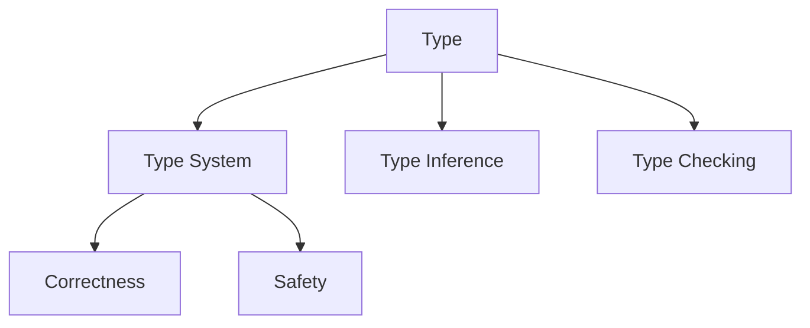
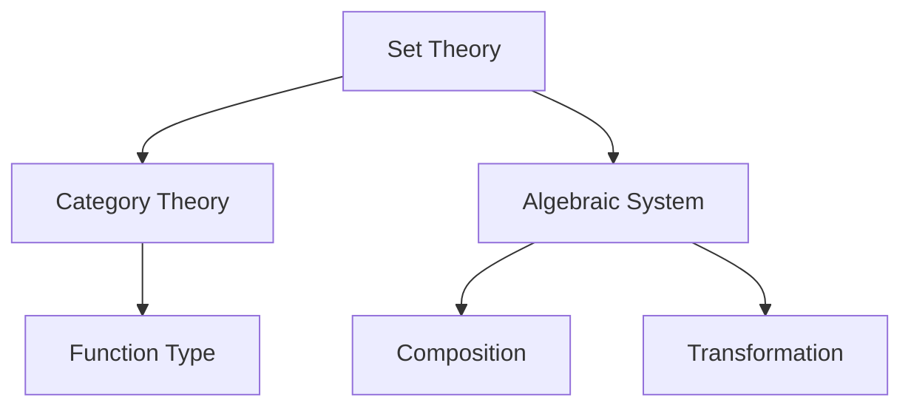
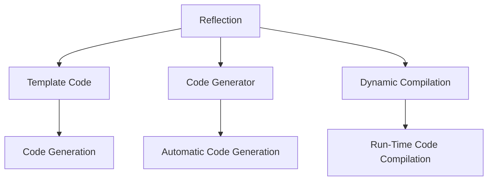
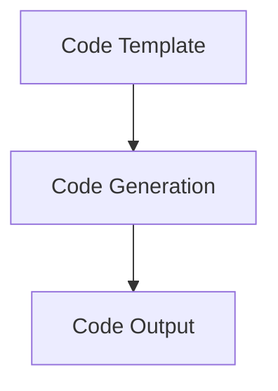
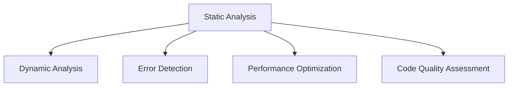

                 


### 文章标题
《类型论在元编程中的应用：代码生成与分析》

### 文章关键词
- 类型论
- 元编程
- 代码生成
- 代码分析
- 类型推导

### 文章摘要
本文将深入探讨类型论在元编程领域的应用，特别是代码生成与代码分析方面。我们将首先介绍类型论的基础知识，包括其基本概念和数学基础。接着，我们将阐述元编程与类型论之间的密切关系，并详细分析类型论在元编程中的应用场景。随后，我们将分别探讨代码生成和代码分析的技术，通过伪代码和数学公式详细阐述其核心算法原理。最后，我们将通过实际应用案例展示类型论在Web、移动和嵌入式开发中的应用，并提供项目实战和最佳实践建议。

## 第1章 类型论基础

### 1.1 类型论的基本概念

类型论是计算机科学中研究类型系统的一门学科，它探讨了程序中的类型以及类型之间的关系。类型论的基本概念包括：

- **类型（Type）**：类型是程序元素（如变量、函数、表达式）的抽象表示，用来描述数据的不同种类。
- **类型系统（Type System）**：类型系统是编程语言中定义和执行类型检查的机制，确保程序的正确性和安全性。
- **类型推导（Type Inference）**：类型推导是编译器自动推断程序元素类型的过程，无需显式声明类型。
- **类型检查（Type Checking）**：类型检查是在编译或运行时验证程序元素的类型是否正确的过程。

#### Mermaid流程图：类型论的基本概念


#### 伪代码：类型推导的基本算法
```python
def infer_type(expression):
    # 基于表达式的结构和上下文，推断其类型
    if isinstance(expression, NumberLiteral):
        return "Number"
    elif isinstance(expression, BooleanLiteral):
        return "Boolean"
    # 其他类型的推导规则
    else:
        return "Unknown"
```

#### 数学公式：类型论的基本数学模型
$$
\begin{aligned}
    T(x) &= \text{类型}(x) \\
    \text{type\_check}(e, T) &= \begin{cases}
        \text{true}, & \text{如果表达式e的类型为T} \\
        \text{false}, & \text{否则}
    \end{cases}
\end{aligned}
$$

### 1.2 类型论的数学基础

类型论有着坚实的数学基础，包括集合论、范畴论和代数系统。这些数学工具帮助我们更准确地描述类型和类型之间的关系。

- **集合论（Set Theory）**：集合论是类型论的基础，用于定义类型和类型系统的结构。
- **范畴论（Category Theory）**：范畴论提供了一种更抽象的方式来描述类型论的概念，如函数类型和类型之间的转换。
- **代数系统（Algebraic System）**：代数系统用于描述类型论中的组合和转换操作。

#### Mermaid流程图：类型论的数学基础


### 1.3 类型论的历史与发展

类型论的历史可以追溯到20世纪中叶，其发展经历了多个阶段：

- **早期类型论**：1940年代至1950年代，以Alonzo Church的λ演算和Type Theory为代表。
- **静态类型语言**：1960年代至1970年代，以Algol 60和Simula为代表，静态类型系统开始广泛应用于编程语言。
- **类型检查优化**：1980年代至1990年代，类型推导和类型检查优化成为研究热点，以Java和C#为代表。
- **动态类型和静态类型融合**：21世纪初，动态类型语言如Python和JavaScript逐渐流行，同时静态类型语言也在不断改进类型系统。

#### 类型论的发展历程
- **1940年代**：Alonzo Church提出λ演算，奠定了类型论的基础。
- **1950年代**：Type Theory在算法设计和形式验证中得到应用。
- **1960年代**：静态类型系统开始广泛应用于编程语言。
- **1970年代**：类型检查优化成为编译器设计的研究方向。
- **1980年代**：Java和C#等语言的兴起，推动了类型系统的进一步发展。
- **21世纪初**：动态类型语言与静态类型语言的融合，如TypeScript的出现。

## 第2章 元编程与类型论

### 2.1 元编程概述

元编程（Meta Programming）是指程序能够自己编写、生成或修改代码的能力。元编程的关键技术包括：

- **反射（Reflection）**：程序能够查看和修改自己的结构和行为。
- **模板代码（Template Code）**：通过模板技术生成代码，减少重复编码。
- **代码生成器（Code Generator）**：自动生成代码的工具。
- **动态编译（Dynamic Compilation）**：在程序运行时编译代码。

#### Mermaid流程图：元编程的核心技术


### 2.2 类型论与元编程的关系

类型论与元编程之间有着密切的联系：

- **类型论提供了元编程的基础**：通过类型系统，元编程能够确保生成的代码具有正确的类型。
- **元编程扩展了类型论的应用**：元编程技术使得类型论的应用更加灵活和广泛。

#### 类型论与元编程的相互作用
- **类型推导**：在元编程中，类型推导帮助确保生成的代码类型正确。
- **类型检查**：类型检查确保在运行时生成的代码不会引发类型错误。
- **类型安全**：类型论为元编程提供了类型安全，减少了运行时错误。

### 2.3 类型论在元编程中的应用场景

类型论在元编程中具有广泛的应用场景：

- **代码生成**：类型论帮助生成具有类型安全的代码。
- **代码分析**：类型论用于分析程序的结构和行为，优化代码。
- **静态类型检查**：类型论确保程序在编译时不会出现类型错误。

#### 类型论在元编程中的应用场景
- **框架和库**：如TypeScript和Swift，利用类型论提高代码质量和开发效率。
- **动态语言**：如Python和JavaScript，通过类型推导提高代码的可读性和性能。
- **嵌入式系统**：类型论帮助确保嵌入式系统的代码安全和高效。

## 第3章 代码生成技术

### 3.1 代码生成概述

代码生成（Code Generation）是指通过程序或工具自动生成代码的过程。代码生成的重要特性包括：

- **自动化**：减少手动编码的工作量，提高开发效率。
- **可重用性**：生成代码具有通用性，可重复使用。
- **灵活性**：可以根据不同的需求和场景定制生成代码。

#### Mermaid流程图：代码生成的基本流程


### 3.2 类型论在代码生成中的应用

类型论在代码生成中扮演重要角色：

- **类型推导**：确保生成的代码类型正确。
- **类型检查**：在生成代码前进行类型检查，防止运行时错误。
- **类型安全**：提高代码的可靠性和安全性。

#### 类型论在代码生成中的应用
- **模板语言**：如Java的String模板和Python的Jinja2，结合类型论提高模板代码的准确性。
- **编译器**：如C++的Template Haskell，利用类型论生成编译时优化的代码。

### 3.3 代码生成器的构建与优化

构建高效的代码生成器需要考虑以下几个方面：

- **性能优化**：减少生成代码的执行时间和空间占用。
- **可扩展性**：支持不同类型和场景的代码生成。
- **错误处理**：确保生成代码的正确性和鲁棒性。

#### 代码生成器的构建与优化
- **模板引擎**：使用模板引擎，如Apache Velocity和FreeMarker，构建代码生成器。
- **抽象语法树（AST）**：使用AST对代码进行分析和生成，提高性能和灵活性。
- **代码优化**：采用代码优化技术，如代码压缩和合并，减少生成代码的大小。

## 第4章 代码分析技术

### 4.1 代码分析概述

代码分析（Code Analysis）是指对程序代码进行静态或动态分析的过程。代码分析的主要目标包括：

- **性能优化**：识别代码中的性能瓶颈，提供改进建议。
- **错误检测**：发现代码中的潜在错误和异常。
- **代码质量**：评估代码的可维护性和可读性。

#### Mermaid流程图：代码分析的基本流程


### 4.2 类型论在代码分析中的应用

类型论在代码分析中发挥着重要作用：

- **类型推导**：帮助分析程序元素的数据流和依赖关系。
- **类型检查**：验证代码的类型正确性，防止运行时错误。
- **抽象解释**：基于类型信息进行抽象化处理，提高分析效率。

#### 类型论在代码分析中的应用
- **静态类型语言**：如Java和C#，类型论用于静态分析，提高代码质量。
- **动态类型语言**：如Python和JavaScript，通过动态类型推导进行代码分析。

### 4.3 代码分析器的构建与优化

构建高效的分析器需要考虑以下几个方面：

- **性能优化**：减少分析时间，提高工具的可用性。
- **可扩展性**：支持多种编程语言和不同的分析需求。
- **准确性**：确保分析结果的准确性和可靠性。

#### 代码分析器的构建与优化
- **抽象语法树（AST）**：使用AST对代码进行分析，提高性能和准确性。
- **分析算法**：采用有效的算法和优化技术，提高分析效率。
- **用户界面**：提供友好的用户界面，便于用户查看和分析结果。

## 第5章 实际应用案例

### 5.1 类型论在Web开发中的应用

类型论在Web开发中的应用包括：

- **前端开发**：使用TypeScript进行类型推导和类型检查，提高代码质量和开发效率。
- **后端开发**：使用Scala等静态类型语言，利用类型论进行代码生成和分析，优化性能和安全性。

#### 实际案例
- **案例1**：使用TypeScript构建React应用程序，利用类型推导确保组件的类型正确。
- **案例2**：使用Scala构建RESTful API，通过类型检查提高代码质量和安全性。

### 5.2 类型论在移动开发中的应用

类型论在移动开发中的应用包括：

- **原生开发**：使用Kotlin等静态类型语言，利用类型论进行代码生成和分析，优化性能。
- **跨平台开发**：使用Flutter和React Native等框架，结合类型论提高代码质量和开发效率。

#### 实际案例
- **案例1**：使用Kotlin开发Android应用程序，利用类型检查减少编译错误。
- **案例2**：使用Flutter构建跨平台应用程序，利用类型推导提高代码可维护性。

### 5.3 类型论在嵌入式开发中的应用

类型论在嵌入式开发中的应用包括：

- **硬件驱动开发**：使用C语言和静态类型检查，确保驱动程序的稳定性和可靠性。
- **实时系统开发**：使用Ada等静态类型语言，利用类型论保证系统的实时性和安全性。

#### 实际案例
- **案例1**：使用C语言开发嵌入式设备的驱动程序，利用类型检查减少硬件故障。
- **案例2**：使用Ada开发飞机控制系统，利用类型论确保系统的安全性和可靠性。

## 第6章 未来展望

### 6.1 类型论在编程语言设计中的应用

类型论在编程语言设计中的应用前景广阔：

- **新编程语言**：类型论为新编程语言的设计提供了理论支持，如Swift和Kotlin。
- **类型系统增强**：类型论可以帮助现有编程语言改进类型系统，提高代码质量和安全性。

#### 未来展望
- **动态类型与静态类型的融合**：随着类型推导技术的进步，动态类型和静态类型将逐步融合，提高编程效率。
- **类型论在函数式编程中的发展**：类型论在函数式编程领域具有巨大的潜力，未来有望成为主流编程范式。

### 6.2 类型论在人工智能中的应用

类型论在人工智能领域具有广泛的应用前景：

- **机器学习**：类型论可以帮助优化机器学习算法的代码，提高模型的可解释性和可靠性。
- **自然语言处理**：类型论可以用于分析自然语言处理的代码，提高模型的准确性和效率。

#### 未来展望
- **类型安全的人工智能**：类型论将有助于提高人工智能系统的类型安全性，减少错误和漏洞。
- **类型论与深度学习的结合**：类型论与深度学习的结合有望推动人工智能技术的发展。

### 6.3 类型论在未来的发展

类型论在未来将继续发展：

- **类型理论的扩展**：类型论将不断扩展，以适应新兴的编程范式和领域需求。
- **交叉领域的研究**：类型论与其他领域的交叉研究将推动计算机科学的进步。

#### 未来展望
- **类型论在分布式系统中的应用**：类型论将有助于提高分布式系统的可靠性、安全性和性能。
- **类型论与量子计算的融合**：类型论与量子计算的融合有望推动量子编程的发展。

## 总结

类型论在元编程中的应用具有广泛的前景，包括代码生成和分析等方面。本文介绍了类型论的基础知识，探讨了元编程与类型论的关系，并详细分析了代码生成和代码分析的技术。通过实际应用案例，我们展示了类型论在Web、移动和嵌入式开发中的应用。未来，类型论将继续发展，为编程语言设计、人工智能和量子计算等领域提供理论支持。希望本文能够帮助读者深入理解类型论在元编程中的应用，为编程实践提供有益的启示。

### 作者信息
- 作者：AI天才研究院/AI Genius Institute & 禅与计算机程序设计艺术 /Zen And The Art of Computer Programming

### 最佳实践 Tips

1. 在开发过程中，充分利用类型推导和类型检查，提高代码质量和开发效率。
2. 在代码生成和分析中，遵循类型安全的原则，确保系统的稳定性和可靠性。
3. 定期学习新的编程语言和框架，关注类型论在新兴领域的应用。
4. 与团队成员分享类型论的知识，提高团队的整体技术水平。
5. 实践是检验真理的唯一标准，通过实际项目验证类型论的应用效果。

### 小结

本文从类型论的基础知识出发，深入探讨了类型论在元编程中的应用，包括代码生成和分析。通过实际应用案例，展示了类型论在不同开发领域的重要性。未来，类型论将继续发展，为编程语言设计、人工智能和量子计算等领域提供理论支持。希望本文能为读者提供有益的启示，推动计算机科学的发展。

### 注意事项

1. 类型论虽然具有强大的能力，但并不意味着它可以解决所有问题。在实际开发中，仍需结合具体需求和场景进行综合考虑。
2. 类型论的应用需要一定的技术背景和经验积累。初学者应先掌握基础概念，逐步深入理解。
3. 类型论在不同编程语言和框架中的应用存在差异。开发者应熟悉所选语言和框架的类型系统，充分利用其特性。
4. 类型论的应用需要平衡性能和安全性。在实际开发中，应根据具体需求进行权衡和优化。

### 拓展阅读

1. 《类型系统和类型理论》 - 【作者】：Martin Odersky
2. 《编译原理：艺术与科学》 - 【作者】：J. D. Ullman
3. 《深入理解计算机系统》 - 【作者】：Dale A.

