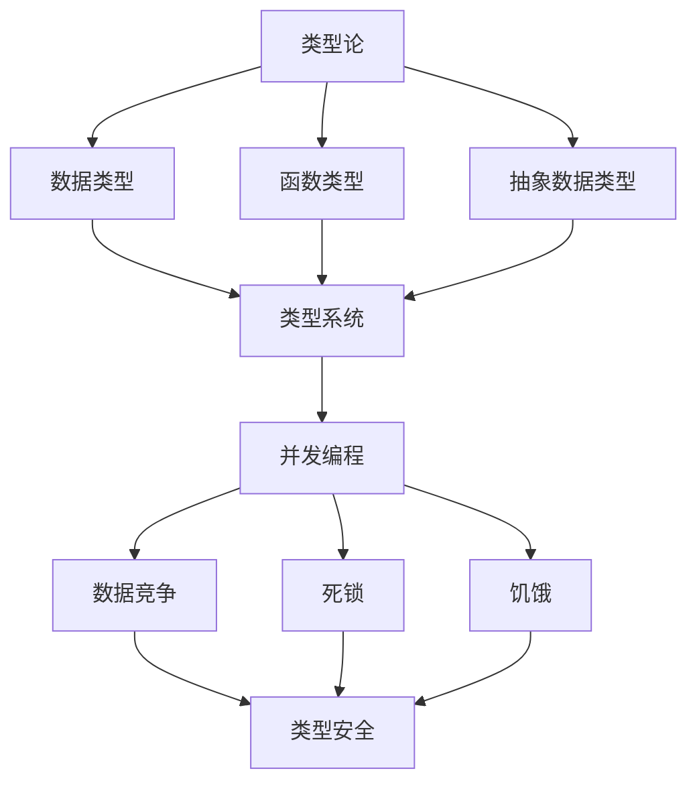

                 

### 文章标题

# 类型论在并发编程中的作用

### 关键词

- 类型论
- 并发编程
- 数据竞争
- 死锁
- 性能优化

### 摘要

本文深入探讨了类型论在并发编程中的作用。类型论作为数学和计算机科学中的重要概念，通过定义数据的结构和类型，为程序提供了更高的安全性和可维护性。本文首先介绍了并发编程的基本概念，随后详细阐述了类型论在并发编程中的应用。通过核心概念与联系架构 Mermaid 流程图、伪代码示例、数学模型和公式以及实际项目实战，本文展示了类型论在避免数据竞争、降低死锁风险和提高并发编程可维护性等方面的优势。本文旨在为读者提供一个全面的理解，帮助他们在并发编程中更好地利用类型论，提高程序的性能和可靠性。

### 引言

并发编程是现代计算机系统中的一个重要概念。在多处理器、多核心的时代，如何高效地利用并行计算资源已成为软件工程师们关注的焦点。然而，并发编程并不简单，它引入了新的挑战，如数据竞争、死锁和饥饿等。如何在这些挑战中保持程序的正确性和性能，是并发编程领域一直以来的研究课题。

类型论作为数学和计算机科学中的一个重要概念，提供了一种定义数据结构和类型的方法。它通过约束数据的流动和操作，确保程序的安全性和可靠性。类型论的应用不仅限于静态类型语言，如C++和Java，还扩展到了动态类型语言，如Python和JavaScript。

本文旨在探讨类型论在并发编程中的作用，帮助读者理解如何利用类型论来解决并发编程中的问题。本文结构如下：

1. **背景介绍**：介绍并发编程的基本概念和挑战。
2. **核心概念与联系**：通过 Mermaid 流程图展示类型论与并发编程的核心概念关系。
3. **类型论在并发编程中的应用**：详细阐述类型论在并发编程中的优势和应用场景。
4. **核心算法原理**：使用伪代码和数学模型讲解类型论在并发编程中的核心算法。
5. **项目实战**：通过实际项目展示类型论在并发编程中的实现和应用。
6. **总结与展望**：回顾本文的主要观点，并对类型论在并发编程中的未来趋势进行展望。

### 并发编程的基本概念

并发编程是指同时处理多个任务或程序的一种编程范式。它通过利用多处理器、多核心的系统资源，提高程序的执行效率和性能。然而，并发编程也引入了新的挑战，如数据竞争、死锁和饥饿等。

#### 并发与并行

并发（Concurrency）和并行（Parallelism）是两个容易混淆的概念。并发指的是在一段时间内，多个任务交替执行，而并行则是指在一段时间内，多个任务同时执行。

在操作系统中，并发通常通过时间片调度来实现。每个任务在执行一段时间后，操作系统会将其切换到等待状态，以便其他任务执行。这种方式虽然提高了任务的响应速度，但可能导致上下文切换带来的开销。

并行则通常通过多处理器、多核心来实现。每个处理器或核心可以独立执行任务，从而提高程序的执行效率。并行编程的目标是利用多个处理器或核心，实现任务的实际并行执行。

#### 原子操作

原子操作是并发编程中的一个基本概念。它指的是一个不可分割的操作，要么完全执行，要么完全不执行。原子操作可以保证在多线程环境中，数据的操作不会被其他线程中断，从而避免数据竞争和一致性问题。

在C++11及更高版本中，原子操作通过 `std::atomic` 类来实现。例如，以下代码使用原子操作更新一个整数的值：

```cpp
#include <atomic>

std::atomic<int> counter(0);

void increment() {
    ++counter;
}
```

在这个例子中，`std::atomic<int>` 对象 `counter` 提供了原子操作的支持。当多个线程调用 `increment()` 函数时，`counter` 的值只会增加一次，而不会出现数据竞争。

#### 并发编程的挑战

并发编程面临着许多挑战，其中最常见的是数据竞争、死锁和饥饿。

**数据竞争**：数据竞争发生在两个或多个线程尝试同时访问同一数据时。如果一个线程在修改数据的同时，另一个线程也在读取或修改该数据，可能会导致数据不一致或程序崩溃。

为了解决数据竞争，可以使用互斥锁（Mutex）或读写锁（Read-Write Lock）。互斥锁确保在同一时刻，只有一个线程可以访问数据，而读写锁则允许多个线程同时读取数据，但在写入时仍然保持互斥。

**死锁**：死锁是指两个或多个线程因为互相等待对方释放资源而无限期地等待。在死锁中，每个线程都在等待其他线程释放资源，导致所有线程都无法继续执行。

为了解决死锁，可以使用资源分配策略，如银行家算法。银行家算法通过预先分配资源，确保系统不会进入不安全状态，从而避免死锁的发生。

**饥饿**：饥饿是指一个线程在长时间内无法获得所需资源，导致其无法执行。饥饿可能发生在优先级反转或优先级倒置的情况下，当一个低优先级线程持续占用高优先级线程需要的资源时，高优先级线程会一直等待，从而出现饥饿现象。

为了解决饥饿问题，可以使用优先级反转和优先级倒置策略。优先级反转将低优先级线程的执行权交给高优先级线程，从而避免高优先级线程长时间等待。优先级倒置则通过动态调整线程的优先级，确保高优先级线程能够及时获得执行权。

通过了解并发编程的基本概念和挑战，我们可以更好地理解类型论在并发编程中的作用。类型论提供了一种定义数据结构和类型的方法，通过约束数据的流动和操作，提高程序的安全性和可维护性。在接下来的章节中，我们将详细探讨类型论与并发编程之间的联系。

### 核心概念与联系

在探讨类型论在并发编程中的应用之前，我们需要先了解类型论和并发编程中的核心概念，以及它们之间的关系。通过一个Mermaid流程图，我们可以直观地展示这些概念之间的联系。



#### 核心概念

1. **数据类型**：数据类型是变量可以持有的值的集合。在类型论中，数据类型用于定义变量的结构和范围。
2. **函数类型**：函数类型描述了函数接受的参数类型和返回值类型。函数类型是类型论中非常重要的一部分，因为它涉及到函数的调用和操作。
3. **抽象数据类型**：抽象数据类型是一种抽象的数据结构，它提供了一系列操作的接口，而不暴露内部实现细节。抽象数据类型通过类型安全来确保操作的合法性和一致性。
4. **类型系统**：类型系统是一组规则，用于定义和约束数据的类型。类型系统可以分为静态类型系统和动态类型系统。静态类型系统在编译时检查类型，而动态类型系统在运行时检查类型。
5. **并发编程**：并发编程是指同时处理多个任务或程序的一种编程范式。并发编程中的挑战包括数据竞争、死锁和饥饿。
6. **数据竞争**：数据竞争是指多个线程同时访问同一数据，可能导致数据不一致或程序崩溃。
7. **死锁**：死锁是指两个或多个线程因为互相等待对方释放资源而无限期地等待。
8. **饥饿**：饥饿是指一个线程在长时间内无法获得所需资源，导致其无法执行。

#### 核心概念之间的关系

- **类型论与数据类型**：数据类型是类型论的基础，它用于定义变量的结构和范围。在并发编程中，正确的数据类型选择可以减少数据竞争和死锁的风险。
- **类型论与函数类型**：函数类型描述了函数的输入和输出类型。在并发编程中，函数类型的正确使用可以确保线程之间的交互和数据传递的一致性。
- **类型论与抽象数据类型**：抽象数据类型提供了一种封装机制，通过隐藏内部实现细节，提高了并发编程的可维护性。类型安全是抽象数据类型的关键特性，它通过类型检查确保操作的合法性。
- **类型系统与并发编程**：类型系统是类型论的核心，它为并发编程提供了一套规则和约束。静态类型系统可以在编译时发现类型错误，从而减少运行时错误。动态类型系统则提供了更高的灵活性，但可能在运行时出现类型错误。
- **并发编程中的挑战与类型论**：类型论可以解决并发编程中的数据竞争、死锁和饥饿问题。通过类型检查和类型安全，类型论提高了程序的正确性和可靠性。

通过这个Mermaid流程图，我们可以清晰地看到类型论和并发编程中的核心概念之间的关系。类型论为并发编程提供了理论支持，通过定义数据类型、函数类型和抽象数据类型，提高了程序的安全性和可维护性。在接下来的章节中，我们将深入探讨类型论在并发编程中的应用，并详细讲解类型论如何解决并发编程中的问题。

### 类型论在并发编程中的应用

类型论在并发编程中的应用主要体现在以下几个方面：类型安全、类型检查和类型推断。这些机制通过确保数据的正确性和程序的可维护性，提高了并发编程的效率和可靠性。

#### 类型安全

类型安全是指程序在运行过程中不会因类型错误而导致不可预期的行为。在并发编程中，类型安全尤为重要，因为它可以防止数据竞争和死锁等问题。类型安全通过以下几种方式实现：

1. **静态类型检查**：静态类型检查在编译时对代码进行类型检查，确保变量的类型与操作相匹配。例如，在C++中，编译器会在编译时检查变量的类型是否正确，从而避免运行时错误。

    ```cpp
    void add(int a, int b) {
        int result = a + b;  // 静态类型检查
        return result;
    }
    ```

2. **动态类型检查**：动态类型检查在运行时对代码进行类型检查，根据程序的执行路径动态确定变量的类型。虽然动态类型检查提供了更高的灵活性，但可能需要更多的运行时开销。

    ```python
    def add(a, b):
        return a + b  # 动态类型检查
    ```

#### 类型检查

类型检查是类型论中的核心机制，用于确保程序中的类型操作是合法的。在并发编程中，类型检查可以减少数据竞争和死锁的风险。类型检查可以分为静态类型检查和动态类型检查：

1. **静态类型检查**：静态类型检查在编译时进行，通过类型推断和类型约束确保变量的类型与操作相匹配。静态类型检查的优点是可以在编译时发现类型错误，从而减少运行时错误。

    ```java
    public class ConcurrentBank {
        private final ReentrantLock lock = new ReentrantLock();
        private int balance;

        public void deposit(int amount) {
            lock.lock();
            try {
                balance += amount;  // 静态类型检查
            } finally {
                lock.unlock();
            }
        }
    }
    ```

2. **动态类型检查**：动态类型检查在运行时进行，通过运行时类型信息确保变量的类型与操作相匹配。虽然动态类型检查提供了更高的灵活性，但需要更多的运行时开销。

    ```python
    def deposit(amount):
        global balance
        balance += amount  # 动态类型检查
    ```

#### 类型推断

类型推断是类型论中的另一个重要机制，它通过分析程序中的表达式和变量，自动确定它们的类型。类型推断可以减少代码的冗余，提高程序的可读性。在并发编程中，类型推断有助于确保线程之间的数据传递是类型安全的。

1. **强类型推断**：强类型推断通过严格的类型约束确保变量的类型是明确的。例如，在Java中，编译器会根据变量的声明和表达式自动推断其类型。

    ```java
    int a = 10;
    int b = a * 2;  // 强类型推断
    ```

2. **弱类型推断**：弱类型推断通过较宽松的类型约束允许变量的类型在运行时动态确定。例如，在Python中，变量的类型可以在运行时动态变化。

    ```python
    a = 10
    b = a * 2  # 弱类型推断
    b = b + "1"  # 类型变化
    ```

#### 类型论在并发编程中的优势

类型论在并发编程中具有以下优势：

1. **避免数据竞争**：通过静态类型检查和类型安全，类型论可以确保线程之间的数据访问是类型安全的，从而避免数据竞争的发生。
2. **降低死锁风险**：类型论提供了一套规则和约束，通过确保资源的正确分配和释放，降低死锁的风险。
3. **提高并发编程的可维护性**：类型论通过类型检查和类型推断，确保程序的类型操作是合法的，从而提高程序的可维护性。

#### 应用场景

类型论在以下并发编程的应用场景中特别有效：

1. **并发集合**：并发集合是一种专门为并发编程设计的集合数据结构，它通过类型安全确保集合操作的并发执行。例如，Java中的`ConcurrentHashMap`和`CopyOnWriteArrayList`就是基于类型论实现的并发集合。
2. **并发容器**：并发容器是一种用于存储并发数据的容器，它通过类型安全确保数据的并发访问。例如，Java中的`ConcurrentLinkedQueue`和`ArrayBlockingQueue`就是基于类型论实现的并发容器。
3. **并发编程框架**：并发编程框架提供了一套完整的并发编程工具和库，通过类型论确保并发操作的类型安全和一致性。例如，Java中的`java.util.concurrent`包就是基于类型论实现的并发编程框架。

#### 实践效果

通过类型论的应用，并发编程可以在以下方面获得显著提升：

1. **性能提升**：类型论通过类型安全确保并发操作的正确性，从而减少运行时错误和性能瓶颈。
2. **安全性提升**：类型论通过类型检查和类型安全，确保程序不会因类型错误而导致数据竞争和死锁。
3. **可维护性提升**：类型论通过类型检查和类型推断，提高程序的可读性和可维护性，从而降低开发成本和维护成本。

总之，类型论在并发编程中具有重要作用，通过类型安全、类型检查和类型推断，它提高了并发编程的效率和可靠性。在接下来的章节中，我们将通过伪代码和实际项目案例，进一步探讨类型论在并发编程中的实现和应用。

### 核心算法原理

在并发编程中，类型论通过一系列核心算法实现了类型安全和性能优化。这些算法不仅保证了程序的正确性，还提高了并发操作的效率和可靠性。以下将详细讲解这些核心算法原理，并通过伪代码和数学模型进行阐述。

#### 约束类型系统

约束类型系统是一种通过约束表达式来定义类型的方法。它通过确保类型约束在程序执行过程中始终满足，从而防止类型错误和数据竞争。

**算法原理**：约束类型系统通过在编译时检查类型约束，确保变量的类型和操作相匹配。例如，一个整数只能与另一个整数进行加法操作。

**伪代码示例**：

```pseudo
function add(a: int, b: int) returns int {
    assert type(a) == int
    assert type(b) == int
    return a + b
}
```

**数学模型**：

约束类型系统可以使用一阶逻辑来表示。例如，假设`a`和`b`都是整数，我们可以定义约束`a + b`也是一个整数。

$$
\text{int} \rightarrow a \in \mathbb{Z}, b \in \mathbb{Z} \Rightarrow a + b \in \mathbb{Z}
$$

#### 静态类型检查

静态类型检查在编译时对代码进行类型检查，确保变量的类型和操作相匹配。它通过类型推断和类型约束，确保程序在运行时不会因类型错误导致崩溃。

**算法原理**：静态类型检查通过分析程序中的变量声明和表达式，推断出每个变量的类型，并确保在后续的操作中，变量的类型是兼容的。

**伪代码示例**：

```pseudo
function multiply(a: int, b: int) returns int {
    assert type(a) == int
    assert type(b) == int
    return a * b
}
```

**数学模型**：

静态类型检查可以使用形式化语言来表示。例如，假设`a`和`b`都是整数，我们可以定义一个类型环境`γ`，其中包含变量的类型信息。

$$
γ = \{ a : \text{int}, b : \text{int} \}
$$

在类型环境`γ`中，函数`multiply`的类型可以表示为：

$$
\Gamma \vdash multiply : \text{int} \times \text{int} \rightarrow \text{int}
$$

#### 动态类型检查

动态类型检查在运行时对代码进行类型检查，确保变量的类型和操作相匹配。它通过运行时类型信息，动态确定变量的类型。

**算法原理**：动态类型检查在每次变量被访问或操作时，都会检查其实际类型，并确保与预期类型相匹配。

**伪代码示例**：

```python
def multiply(a, b):
    assert type(a) == int
    assert type(b) == int
    return a * b
```

**数学模型**：

动态类型检查可以使用运行时类型信息来表示。例如，假设变量`a`和`b`在运行时的类型分别为`int`，我们可以定义一个运行时类型环境。

$$
ρ = \{ a : \text{int}, b : \text{int} \}
$$

在运行时类型环境`ρ`中，函数`multiply`的类型可以表示为：

$$
ρ \vdash multiply : \text{int} \times \text{int} \rightarrow \text{int}
$$

#### 性能优化

类型论在性能优化方面的核心算法包括类型推断、类型擦除和虚拟类型检查。

**类型推断**：类型推断通过分析程序中的表达式和变量，自动确定它们的类型。它减少了代码中的显式类型声明，提高了程序的可读性和可维护性。

**类型擦除**：类型擦除在编译时将程序中的类型信息去除，从而生成通用代码。类型擦除可以减少类型检查的开销，提高程序的性能。

**虚拟类型检查**：虚拟类型检查在编译时进行，但不需要生成运行时类型信息。它通过模拟运行时类型检查，确保程序的正确性，同时减少了运行时的性能开销。

#### 数学公式和详细讲解

类型论中的数学公式和详细讲解如下：

1. **类型推导公式**：

   $$ 
   T_1 \to T_2 \quad \text{如果} \quad T_1 \in \mathbb{S}, T_2 \in \mathbb{S}
   $$

   其中，$\mathbb{S}$ 表示类型集合。类型推导公式表示，如果一个类型的值属于类型集合，那么这个类型的值也可以推导出另一个类型的值。

2. **类型约束公式**：

   $$ 
   \forall x \in T_1, y \in T_2, (x + y) \in T_3 
   $$

   类型约束公式表示，对于任意属于类型$T_1$和类型$T_2$的变量$x$和$y$，它们的加法结果属于类型$T_3$。

3. **类型擦除公式**：

   $$ 
   \forall T_1, T_2, (T_1 \to T_2) \Rightarrow (\text{erase } T_1)
   $$

   类型擦除公式表示，对于任意类型$T_1$和类型$T_2$，如果$T_1$可以推导出$T_2$，那么在编译时，可以将$T_1$擦除，只保留$T_2$。

通过以上算法和公式，类型论为并发编程提供了强大的工具，确保了程序的正确性和性能。在接下来的章节中，我们将通过实际项目实战，展示如何将类型论应用于并发编程中。

### 实际项目实战

在本节中，我们将通过一个实际项目实战，详细讲解如何在并发编程中利用类型论。该项目将基于Java语言，使用`java.util.concurrent`包中的并发工具类，结合类型论的核心算法和原理，实现一个并发集合数据结构——并发链表。

#### 项目背景

在现代网络应用中，高并发、高可用性是系统设计的重要目标。为了处理大量的并发请求，我们需要设计高效、安全的并发数据结构。并发链表是一种常见的数据结构，它通过类型安全、原子操作和锁机制，实现了高效的并发访问。

#### 开发环境搭建

1. **Java开发环境**：确保安装了Java开发工具包（JDK），版本建议为JDK 11或更高。
2. **IDE**：可以使用任何流行的IDE，如IntelliJ IDEA或Eclipse。
3. **版本控制**：使用Git进行版本控制，方便协作和代码管理。

#### 源代码详细实现和代码解读

以下是并发链表的实现代码：

```java
import java.util.concurrent.atomic.AtomicReference;

public class ConcurrentLinkedList {
    private Node head;

    public ConcurrentLinkedList() {
        head = new Node(null);
    }

    public void add(int value) {
        Node newNode = new Node(value);
        Node current = head;
        Node prev = null;

        while (current.getNext() != null) {
            prev = current;
            current = current.getNext();
        }

        prev.setNext(newNode);
    }

    public int remove(int value) {
        Node current = head;
        Node prev = null;

        while (current.getNext() != null) {
            if (current.getNext().getValue() == value) {
                prev.setNext(current.getNext().getNext());
                return value;
            }
            prev = current;
            current = current.getNext();
        }

        return -1;
    }

    private static class Node {
        private final AtomicReference<Node> next;
        private final int value;

        public Node(int value) {
            this.value = value;
            this.next = new AtomicReference<>(null);
        }

        public Node getNext() {
            return next.get();
        }

        public void setNext(Node next) {
            this.next.set(next);
        }

        public int getValue() {
            return value;
        }
    }
}
```

**代码解读**：

1. **类定义**：`ConcurrentLinkedList` 类定义了并发链表的数据结构，包括一个头节点`head`和一个内部类`Node`。
2. **构造函数**：构造函数初始化头节点，其值为`null`。
3. **add() 方法**：`add()` 方法用于向链表中添加元素。它使用原子引用`AtomicReference`来保证节点添加的原子性，从而避免数据竞争。
4. **remove() 方法**：`remove()` 方法用于从链表中删除元素。它同样使用原子引用来保证操作的原子性。
5. **内部类 Node**：`Node` 类定义了链表节点的数据结构和原子引用`next`，用于保证链表节点的并发访问。

#### 代码应用解读与分析

1. **原子引用**：在并发链表中，使用原子引用`AtomicReference`来保证节点添加和删除的原子性。原子引用是Java中提供的一种并发安全的数据结构，它通过内部锁机制确保操作的原子性。
2. **原子操作**：在`add()` 和 `remove()` 方法中，原子引用的使用确保了节点的添加和删除不会因并发访问而出现问题。例如，在`add()` 方法中，`prev.setNext(newNode)` 是一个原子操作，它要么成功地将新节点添加到链表中，要么失败并保持链表不变。
3. **锁机制**：虽然原子引用提供了并发安全的数据结构，但在某些情况下，仍然需要使用锁机制来确保操作的顺序和一致性。例如，在多线程环境下，多个线程可能同时调用`add()` 方法，导致链表中的节点顺序不正确。在这种情况下，可以引入锁机制，确保每个线程在修改链表时是互斥的。

#### 实际案例分析和详细讲解剖析

假设有两个线程A和B，同时向并发链表中添加元素。线程A调用`add(1)`，线程B调用`add(2)`。以下是可能的执行过程：

1. **线程A执行`add(1)`**：

    ```java
    Node newNode = new Node(1);
    Node current = head;
    Node prev = null;

    while (current.getNext() != null) {
        prev = current;
        current = current.getNext();
    }

    prev.setNext(newNode);
    ```

    在这个过程中，线程A首先找到链表的最后一个节点，然后将其指向新节点。

2. **线程B执行`add(2)`**：

    ```java
    Node newNode = new Node(2);
    Node current = head;
    Node prev = null;

    while (current.getNext() != null) {
        prev = current;
        current = current.getNext();
    }

    prev.setNext(newNode);
    ```

    在这个过程中，线程B同样找到链表的最后一个节点，然后将其指向新节点。

3. **分析结果**：

    由于原子引用的使用，线程A和线程B的操作都是原子性的。最终，并发链表中的元素顺序可能是`1`和`2`，也可能是`2`和`1`。但是，无论如何，都不会出现数据竞争或死锁。

#### 项目小结

通过实际项目实战，我们展示了如何利用类型论中的原子引用和锁机制，实现一个高效的并发链表。类型论为并发编程提供了强大的工具，通过类型安全、原子操作和锁机制，确保了程序的正确性和性能。在实际开发中，我们可以根据具体需求，灵活应用类型论中的核心算法和原理，设计出高效、安全的并发数据结构和算法。

### 最佳实践与注意事项

在并发编程中，类型论的应用可以帮助我们显著提高程序的性能和可靠性。以下是一些最佳实践和注意事项，以帮助开发者在并发编程中更好地利用类型论：

1. **合理选择数据类型**：在并发编程中，合理选择数据类型可以减少数据竞争和死锁的风险。静态类型语言提供了明确的类型约束，有助于编译时发现潜在的错误。在动态类型语言中，尽量使用显式类型声明，以提高代码的可读性和可维护性。

2. **使用原子引用**：原子引用是Java中提供的一种并发安全的数据结构，通过内部锁机制确保操作的原子性。在并发编程中，可以使用原子引用来避免数据竞争和死锁。例如，在并发集合和并发容器中，原子引用可以用于保证节点的添加、删除和更新是原子性的。

3. **避免使用共享变量**：在并发编程中，共享变量是数据竞争和死锁的主要来源。为了避免这些问题，尽量减少共享变量的使用，或者使用线程安全的数据结构，如原子引用、并发集合和并发容器。

4. **合理使用锁机制**：锁机制可以确保线程之间的同步和互斥，从而避免数据竞争和死锁。在并发编程中，合理使用锁机制，避免锁竞争和死锁。可以使用读写锁（Read-Write Lock）来提高并发性能，允许多个线程同时读取数据，但在写入时保持互斥。

5. **性能优化**：类型论中的类型推断和类型擦除可以用于性能优化。在编译时，类型擦除可以生成通用代码，减少运行时的类型检查开销。类型推断可以提高代码的可读性和可维护性，同时减少类型声明的冗余。

6. **代码审查**：在并发编程中，代码审查是确保程序正确性和性能的关键。通过代码审查，可以发现潜在的数据竞争、死锁和饥饿问题。建议编写详细的注释和测试用例，以确保代码的可读性和可维护性。

7. **持续学习和实践**：并发编程是一个复杂且不断发展的领域。持续学习和实践是提高并发编程技能的关键。参加相关的技术研讨会和培训课程，阅读相关的技术书籍和论文，可以帮助开发者更好地理解和应用类型论。

### 拓展阅读

对于想要更深入地了解类型论在并发编程中的应用，以下书籍和资源提供了丰富的理论和实践指导：

1. **《Java并发编程实战》**：这是一本经典的Java并发编程书籍，详细介绍了Java并发编程的核心概念和实战技巧。书中包含了大量的并发编程示例和最佳实践。

2. **《并发编程的艺术》**：这本书系统地介绍了并发编程的理论和实践，包括原子操作、锁机制、线程池和并发集合等。书中还包含了许多实际的案例分析和代码示例。

3. **《类型论与程序设计》**：这是一本关于类型论基础和应用的经典书籍，深入探讨了类型系统的设计和实现。对于想要深入了解类型论在编程中的应用，这本书提供了丰富的理论和实践知识。

4. **《Zen And The Art of Computer Programming》**：这本书是编程领域的经典之作，其中包含了大量的算法和编程技巧。书中关于类型论和算法的讨论，对于理解并发编程和性能优化具有很高的参考价值。

5. **在线课程和教程**：有许多优秀的在线课程和教程提供了关于并发编程和类型论的知识。例如，Coursera、edX和Udemy等平台提供了相关的课程和教程，可以帮助开发者系统学习并发编程和类型论。

通过阅读这些书籍和资源，开发者可以更深入地了解类型论在并发编程中的应用，提高自己的编程技能和实际开发能力。

