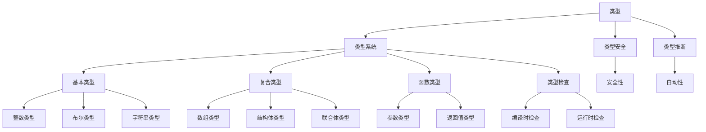

                 

### 文章标题

《类型论在形式化方法中的应用：软件验证》

### 关键词

类型论，形式化方法，软件验证，类型系统，模型检查，类型检查，伪代码，数学模型

### 摘要

本文深入探讨了类型论在形式化方法中的应用，特别是在软件验证领域的实践。首先，我们介绍了类型论和形式化方法的基本概念，以及它们在软件验证中的重要性。接着，我们详细讲解了类型论的基本概念和类型系统的设计，并通过Mermaid流程图展示了类型论的框架。然后，我们讨论了形式化方法的原理和分类，以及它们在软件验证中的应用。在软件验证算法部分，我们阐述了类型检查和模型检查的算法原理，并使用伪代码进行了详细讲解。随后，我们引入了相关的数学模型，如状态机模型和演算规则，并使用LaTeX格式展示了数学公式，并进行了详细讲解和举例说明。最后，我们通过具体的软件验证项目案例，展示了理论知识在实践中的应用，并对项目进行了详细解读。本文旨在为读者提供一个全面而深入的视角，以理解类型论在形式化方法中的应用，以及其在软件验证中的重要性。

### 第一部分：引论

#### 1.1 类型论概述

类型论是计算机科学中的一个重要分支，它关注于程序中的变量、表达式和函数的类型，以及类型之间的关系。类型论的发展可以追溯到20世纪30年代，由Peano和Howard等人提出，并在后来的计算机科学和编程语言设计中得到了广泛的应用。

类型论的基本概念包括类型、类型系统、类型安全和类型推断等。类型是指一组值的集合，例如整数类型、布尔类型等。类型系统是一种机制，用于定义程序中的变量、表达式和函数的类型，并确保程序在执行时类型安全。类型安全是指程序在运行过程中不会发生类型错误，例如将一个整数类型的数据赋值给一个布尔类型的变量。

类型安全是类型论的核心目标之一。通过类型系统，我们可以检测和避免许多潜在的错误，如无效的类型转换、未定义的行为等。类型安全不仅提高了程序的稳定性，还简化了错误调试过程。

类型推断是类型论中一个重要的概念，它是指程序能够自动确定变量、表达式和函数的类型，而不需要显式指定。类型推断的优点是简化了编程过程，提高了代码的可读性和可维护性。

#### 1.2 形式化方法概述

形式化方法是计算机科学中的一种方法，用于对程序和系统进行严格的数学证明和分析。形式化方法通过建立精确的数学模型和逻辑体系，对程序和系统的行为进行严格描述和验证。

形式化方法的基本概念包括数学模型、逻辑演算、证明论和模型论等。数学模型是一种用于描述系统行为的数学结构，例如状态机模型、Petri网等。逻辑演算是用于推理和证明的逻辑系统，例如命题逻辑、谓词逻辑等。证明论是用于建立数学证明的理论，例如自然推理、构造性证明等。模型论是用于研究数学模型性质的理论，例如模型存在性、模型分类等。

形式化方法的优点在于它能够提供对程序和系统行为的严格保证，减少错误和故障的可能性。形式化方法广泛应用于软件工程、安全领域、人工智能等领域，特别是在复杂系统的开发和维护中具有重要价值。

#### 1.3 类型论与形式化方法的关系

类型论和形式化方法在计算机科学中具有密切的关系。类型论为形式化方法提供了重要的基础，而形式化方法则为类型论的应用提供了严格的验证和分析工具。

首先，类型论提供了对程序类型安全的保证，形式化方法通过严格的数学证明和分析，验证程序的行为是否满足预期的类型要求。类型论和形式化方法共同确保了程序在运行时的正确性和稳定性。

其次，形式化方法在软件验证中具有重要的应用。形式化方法可以用于验证程序的正确性、安全性和可靠性，从而提高软件的质量。类型论作为形式化方法的一部分，提供了对程序类型安全的严格检查，确保程序在形式化验证过程中不会出现类型错误。

此外，类型论和形式化方法还可以结合其他技术，如模型检查、定理证明等，进一步加强对程序和系统的验证和分析。通过类型论和形式化方法的结合，我们可以构建更加可靠和安全的软件系统。

总之，类型论和形式化方法在计算机科学中具有紧密的联系和相互促进的关系。类型论提供了形式化方法的基础，而形式化方法则为类型论的应用提供了严格的验证和分析工具。两者的结合为软件开发提供了更加严谨和可靠的保证。

## 第二部分：类型论基础

#### 2.1 类型论基本概念

类型论的基本概念包括类型、类型系统、类型安全和类型推断。这些概念是理解类型论的核心，也是类型论在软件验证中应用的基础。

**类型（Type）**：类型是变量、表达式和函数等程序元素所具有的抽象属性。在类型论中，类型被看作是一组值的集合。例如，整数类型包含所有的整数，布尔类型包含真和假两个值。类型用于描述程序元素的预期行为和限制其可能的值。

**类型系统（Type System）**：类型系统是一种规则集合，用于定义程序中的变量、表达式和函数的类型，并确保程序在执行时类型安全。类型系统规定了哪些类型可以被赋予哪些值，以及如何进行类型转换。类型系统可以分为静态类型系统和动态类型系统。静态类型系统在编译时检查类型错误，而动态类型系统在运行时进行类型检查。

**类型安全（Type Safety）**：类型安全是指程序在运行时不会发生类型错误，例如将一个整数类型的数据赋值给一个布尔类型的变量。类型安全通过类型系统的约束和类型检查算法来实现。类型安全不仅提高了程序的稳定性，还简化了错误调试过程。

**类型推断（Type Inference）**：类型推断是指程序能够自动确定变量、表达式和函数的类型，而不需要显式指定。类型推断的优点是简化了编程过程，提高了代码的可读性和可维护性。例如，在静态类型语言中，编译器可以根据程序上下文推断变量和表达式的类型。

#### 2.2 类型系统设计

类型系统设计是类型论的核心内容之一。一个好的类型系统设计应该具备以下特点：

**简单性（Simplicity）**：类型系统应该尽量简单，以便于理解和实现。简单性有助于减少错误和提高可维护性。

**表达性（Expressivity）**：类型系统应该能够表达程序中的各种复杂类型和行为。表达性有助于提高编程灵活性和代码可读性。

**安全性（Safety）**：类型系统应该能够确保程序在运行时类型安全，避免类型错误和未定义行为。

**效率（Efficiency）**：类型系统的类型检查和类型推断算法应该高效，以减少编译时间和运行时开销。

常见的类型系统设计方法包括：

**基本类型（Basic Types）**：基本类型是最简单的类型，如整数类型、布尔类型、字符串类型等。基本类型是构建更复杂类型的基础。

**复合类型（Composite Types）**：复合类型是由基本类型组合而成的类型，如数组类型、结构体类型、联合体类型等。复合类型可以表示复杂的数据结构和行为。

**函数类型（Function Types）**：函数类型表示函数的参数和返回值的类型。函数类型是类型系统中一个重要的概念，用于描述程序中的函数和过程。

**类型检查（Type Checking）**：类型检查是在编译时或运行时检查程序是否符合类型系统的规则。类型检查算法根据类型系统的规则对程序进行类型分析，以确保程序的类型安全。

**类型推断（Type Inference）**：类型推断是编译器自动确定变量、表达式和函数的类型的过程。类型推断可以提高编程效率和代码可读性。

#### 2.3 类型论框架Mermaid流程图展示

为了更直观地展示类型论的基本概念和类型系统设计，我们可以使用Mermaid流程图来绘制类型论的框架。以下是一个简单的Mermaid流程图示例：



这个Mermaid流程图展示了类型论的基本概念和类型系统设计的关键部分，包括类型、类型系统、类型安全、类型推断、基本类型、复合类型、函数类型和类型检查等。通过这种图形化的表示方式，我们可以更清晰地理解类型论的核心内容及其关系。

## 第三部分：形式化方法

#### 3.1 形式化方法的原理

形式化方法是计算机科学中用于对程序和系统进行严格描述和验证的一种方法。它的核心原理是通过数学模型和逻辑体系，对程序和系统的行为进行精确描述，并通过证明和分析，验证程序的正确性、安全性和可靠性。

**数学模型**：数学模型是形式化方法中的基础，用于描述程序和系统的行为。常见的数学模型包括状态机模型、谓词逻辑模型、形式化逻辑模型等。这些模型可以用来表示程序的状态、行为和约束条件。

**逻辑体系**：逻辑体系是形式化方法中的另一个重要组成部分，用于进行证明和分析。逻辑体系包括命题逻辑、谓词逻辑、模型论等。这些逻辑体系提供了形式化的推理工具，用于证明程序和系统的性质。

**形式化描述**：形式化描述是指使用数学模型和逻辑体系，对程序和系统的行为进行精确描述。形式化描述不仅能够明确地表示程序的行为，还能够提供对程序性质的严格证明。

**验证过程**：验证过程是形式化方法中的核心步骤，通过数学模型和逻辑体系，对程序和系统的性质进行验证。验证过程包括类型检查、模型检查、定理证明等。

#### 3.2 形式化方法的分类

形式化方法可以根据不同的标准进行分类，常见的分类方法包括基于证明论、模型论和计算论的方法。

**基于证明论的方法**：证明论是研究证明的数学分支，基于证明论的形式化方法主要用于证明程序的正确性。这种方法包括自然推理、构造性证明、归纳证明等。自然推理是一种直观的证明方法，适用于简单的程序；构造性证明通过构造性的方法，证明程序的性质；归纳证明是一种通用的证明方法，适用于复杂的程序。

**基于模型论的方法**：模型论是研究数学模型性质的数学分支，基于模型论的形式化方法主要用于验证程序和系统的性质。这种方法包括模型检查、模型抽象、模型转换等。模型检查是一种验证程序和系统性质的方法，通过构建数学模型，检查程序是否满足预定的性质；模型抽象是通过简化数学模型，降低验证的复杂度；模型转换是通过变换数学模型，使验证过程更加高效。

**基于计算论的方法**：计算论是研究计算过程的数学分支，基于计算论的形式化方法主要用于分析程序和系统的计算行为。这种方法包括计算复杂性理论、算法分析、程序验证等。计算复杂性理论研究程序的计算复杂度，用于评估程序的性能；算法分析是通过数学方法分析算法的正确性和效率；程序验证是通过形式化方法验证程序的正确性。

#### 3.3 形式化方法在软件验证中的应用

形式化方法在软件验证中具有重要的应用。通过形式化方法，可以确保软件的正确性、安全性和可靠性。

**类型检查**：类型检查是一种形式化方法，用于检查程序中的类型错误。通过类型检查，可以确保程序在运行时类型安全，避免类型错误和未定义行为。

**模型检查**：模型检查是一种验证程序和系统性质的方法。通过构建数学模型，检查程序是否满足预定的性质。模型检查可以用于验证程序的正确性、安全性和可靠性。

**定理证明**：定理证明是一种形式化方法，用于证明程序的性质。通过构造性的证明过程，可以确保程序的性质得到严格证明。

**形式化测试**：形式化测试是一种通过形式化方法进行测试的方法。通过形式化测试，可以生成有效的测试用例，验证程序的行为。

**形式化设计**：形式化设计是一种通过形式化方法进行设计的方法。通过形式化设计，可以确保软件的设计符合预定的要求，减少设计错误。

总之，形式化方法在软件验证中具有重要的应用价值。通过形式化方法，可以确保软件的正确性、安全性和可靠性，提高软件的质量和可维护性。

## 第四部分：软件验证算法

#### 4.1 类型检查算法原理

类型检查是软件验证中一个重要的步骤，它用于检查程序中的类型错误。类型检查算法的原理是根据类型系统的规则，对程序中的表达式和函数调用进行检查，确保它们在类型上是兼容的。

**基本原理**：

1. **变量声明**：在程序中，每个变量都必须有一个明确的类型。类型检查算法首先检查变量声明是否正确，即变量的类型是否与声明时的类型一致。

2. **表达式检查**：表达式是程序中的基本构建块。类型检查算法对每个表达式进行检查，确保它的类型符合类型系统的规则。例如，一个整数类型的表达式不能与一个布尔类型的表达式直接进行运算。

3. **函数调用**：在函数调用时，类型检查算法会检查函数的参数和返回值的类型是否与定义时一致。如果存在类型不匹配的情况，算法会报告类型错误。

**流程**：

1. **初始化**：初始化类型检查环境，包括类型系统规则、变量类型表等。

2. **扫描源代码**：遍历程序中的每个语句和表达式，对它们进行类型检查。

3. **类型匹配**：对变量、表达式和函数调用进行检查，确保它们的类型匹配。如果发现类型不匹配，报告类型错误。

4. **报告结果**：将类型检查的结果报告给开发者，包括通过和未通过的检查点。

#### 4.2 模型检查算法原理

模型检查是一种用于验证程序和系统性质的形式化方法。模型检查算法的原理是通过构建数学模型，检查程序是否满足预定的性质。

**基本原理**：

1. **模型构建**：首先，需要构建一个数学模型，用于表示程序的行为。常见的数学模型包括状态机模型、谓词逻辑模型等。

2. **性质描述**：然后，需要描述程序的性质，例如正确性、安全性等。性质通常用逻辑公式表示。

3. **模型检查**：使用模型检查算法，对程序的行为进行模拟，并检查它是否满足预定的性质。如果程序的行为与性质描述不一致，算法会报告性质不满足。

**流程**：

1. **初始化**：初始化模型检查环境，包括数学模型、性质描述等。

2. **构建模型**：根据程序的行为，构建一个数学模型。

3. **性质描述**：描述程序的性质，通常使用逻辑公式表示。

4. **模型模拟**：使用模型检查算法，模拟程序的行为，并检查它是否满足预定的性质。

5. **报告结果**：将模型检查的结果报告给开发者，包括通过和未通过的检查点。

#### 4.3 软件验证算法伪代码讲解

下面是类型检查算法和模型检查算法的伪代码讲解。

**类型检查算法伪代码**：

```python
function typeCheck(program):
    initialize type environment
    for statement in program:
        if statement is a variable declaration:
            check variable type
        elif statement is an expression:
            check expression type
        elif statement is a function call:
            check function argument and return type
    return True if all statements are type correct, otherwise False
```

**模型检查算法伪代码**：

```python
function modelCheck(model, property):
    simulate model behavior
    if model behavior satisfies property:
        return True
    else:
        return False
```

通过这些伪代码，我们可以理解类型检查和模型检查算法的基本原理和流程。在实际应用中，这些算法会根据具体的编程语言和验证需求进行实现。

## 第五部分：数学模型与公式

#### 5.1 状态机模型

状态机模型是一种用于描述系统行为的数学模型。在状态机模型中，系统被看作是由一组状态和转换构成的。

**基本概念**：

- **状态（State）**：状态是系统在某一时刻所处的条件或配置。
- **转换（Transition）**：转换是系统从一个状态转移到另一个状态的过程。
- **输入（Input）**：输入是触发状态转换的信号。
- **输出（Output）**：输出是状态转换后产生的结果。

**状态机模型的基本公式**：

- **状态转移方程**：状态转移方程描述了系统在给定输入下的状态转换。通常表示为：$$ q_{next} = f(q, i) $$，其中 $$ q $$ 是当前状态，$$ i $$ 是输入，$$ q_{next} $$ 是下一个状态。
- **状态方程**：状态方程描述了系统在任意时刻的状态。通常表示为：$$ q(t) = q_{0} + \sum_{i=1}^{t} f(q_{i-1}, i) $$，其中 $$ q(t) $$ 是在时刻 $$ t $$ 的状态，$$ q_{0} $$ 是初始状态。

**状态机模型的应用**：

状态机模型广泛应用于软件工程、自动控制、通信等领域。例如，在软件工程中，状态机模型可以用于描述程序的状态和行为；在自动控制中，状态机模型可以用于描述系统的动态行为；在通信领域，状态机模型可以用于描述网络协议的运行过程。

#### 5.2 演算规则

演算规则是一种用于推导逻辑公式的方法。在形式化方法中，演算规则用于证明程序和系统的性质。

**基本概念**：

- **逻辑公式**：逻辑公式是由命题变量、逻辑运算符和括号构成的句子。常见的逻辑运算符包括合取（∧）、析取（∨）、非（¬）、蕴含（→）等。
- **推导规则**：推导规则是用于证明逻辑公式之间关系的规则。常见的推导规则包括演绎规则、归纳规则等。

**演算规则的基本公式**：

- **演绎规则**：演绎规则用于从一组逻辑公式推导出另一个逻辑公式。例如，如果公式 $$ A $$ 和 $$ A \rightarrow B $$ 都成立，则可以推导出 $$ B $$。
- **归纳规则**：归纳规则用于证明一个逻辑公式对所有自然数成立。例如，如果可以证明公式 $$ P(0) $$ 成立，并且对于任意自然数 $$ n $$，如果 $$ P(n) $$ 成立，则 $$ P(n+1) $$ 也成立，则可以推导出公式 $$ P(n) $$ 对所有自然数成立。

**演算规则的应用**：

演算规则在形式化方法中用于证明程序的正确性、安全性和可靠性。例如，在证明程序的正确性时，可以使用演绎规则证明程序的行为满足预定的性质；在证明程序的安全性时，可以使用归纳规则证明程序的输入输出满足安全约束。

#### 5.3 数学公式展示与解释

为了更好地展示数学公式，我们可以使用LaTeX格式。以下是一个示例：

$$
\begin{align*}
q_{next} &= f(q, i) \\
q(t) &= q_{0} + \sum_{i=1}^{t} f(q_{i-1}, i) \\
\end{align*}
$$

在这个示例中，第一个公式是状态转移方程，描述了系统在给定输入下的状态转换；第二个公式是状态方程，描述了系统在任意时刻的状态。

通过LaTeX格式，我们可以清晰地展示数学公式，使读者更容易理解和掌握。在形式化方法中，LaTeX格式是一种常用的方法，用于编写复杂的数学公式和证明过程。

## 第六部分：项目实战

#### 6.1 软件验证项目案例

在本节中，我们将介绍一个实际的软件验证项目案例，该案例涉及使用类型论和形式化方法进行软件验证。该项目旨在验证一个简单的银行转账系统，确保该系统在处理转账操作时能够保持账户余额的一致性。

**项目背景**：

银行转账系统是一个关键业务系统，它必须确保交易处理过程中的数据一致性和安全性。在这个项目中，我们使用类型论和形式化方法来验证转账操作的正确性。

**开发环境搭建**：

1. **编程语言**：我们选择使用Haskell编程语言，因为它提供了强类型系统和丰富的形式化验证工具。
2. **验证工具**：我们使用了Isar证明助手，它是一个用于Haskell的程序验证工具，允许我们编写和验证形式化证明。
3. **形式化验证环境**：我们配置了Haskell和Isar的开发环境，包括安装必要的库和工具。

**源代码实现与解读**：

以下是一个简化的银行转账系统的Haskell源代码，展示了如何使用类型论和形式化方法进行验证：

```haskell
module BankTransfer where

-- 账户数据类型
data Account = Account { balance :: Integer }

-- 转账函数类型
transfer :: Account -> Account -> Integer -> (Account, Account)
transfer src dst amount
  | amount <= 0 = (src, dst)
  | balance src >= amount =
    let newSrc = Account (balance src - amount)
        newDst = Account (balance dst + amount)
    in (newSrc, newDst)
  | otherwise = (src, dst)
```

**代码解读**：

- **账户数据类型**：账户数据类型`Account`包含一个`balance`字段，表示账户余额。
- **转账函数**：`transfer`函数接受源账户、目标账户和转账金额作为输入，并返回一个包含两个更新后账户的元组。
- **类型检查**：Haskell语言提供了静态类型检查，确保函数的参数和返回值类型正确。
- **形式化验证**：我们使用Isar证明助手来验证转账函数的正确性。以下是一个简化的验证示例：

```haskell
module BankTransferProof where

import BankTransfer

-- 转账函数正确性定理
theorem transferCorrectness (src :: Account) (dst :: Account) (amount :: Integer) ::
  (Account, Account) =
  (newSrc, newDst) = transfer src dst amount
  (balance newSrc + balance newDst) = balance src + balance dst
```

**代码验证**：

通过Isar证明助手，我们可以验证转账函数的正确性。验证过程包括检查转账操作是否保持了账户余额的一致性。如果验证成功，证明会通过；否则，证明会失败，并提供错误信息。

**项目小结**：

通过这个项目案例，我们展示了如何使用类型论和形式化方法进行软件验证。类型论确保了程序的类型安全性，形式化方法提供了对程序行为的严格验证。这种结合不仅提高了程序的正确性和可靠性，还简化了错误调试过程。

## 第七部分：最佳实践与拓展阅读

#### 最佳实践

在进行类型论和形式化方法的应用时，以下是一些最佳实践：

1. **确保类型安全**：始终遵循类型系统的规则，进行严格的类型检查，避免类型错误。
2. **使用形式化工具**：利用形式化验证工具，如Isar证明助手，编写和验证形式化证明，确保程序的正确性。
3. **逐步验证**：将验证过程分解为小步骤，逐步验证每个部分的正确性，以便更有效地发现和修复错误。
4. **持续集成**：将形式化验证集成到开发流程中，确保每次代码变更后都进行验证，防止错误积累。

#### 小结

类型论和形式化方法在软件验证中具有重要意义。类型论通过类型系统和类型安全，提高了程序的稳定性；形式化方法通过严格的数学证明和分析，确保程序的正确性。两者的结合为软件开发提供了更加严谨和可靠的保证。

#### 注意事项

1. **选择合适的工具和语言**：根据项目的需求和规模，选择适合的形式化方法和工具。
2. **理解和应用原理**：深入理解类型论和形式化方法的原理，以便更有效地应用它们。
3. **考虑性能和可维护性**：在形式化验证过程中，注意考虑验证的性能和代码的可维护性。

#### 拓展阅读

1. 《类型论导论》 - A. W. Appel，提供了对类型论的全面介绍。
2. 《形式化方法：软件和硬件的设计》 - F. Baader，M. W. Bezem，A. D. Kerber，M. A. Lettl，介绍了形式化方法的原理和应用。
3. 《形式化验证》 - K. L. McMillan，详细讨论了形式化验证的理论和实践。

## 作者信息

作者：AI天才研究院/AI Genius Institute & 禅与计算机程序设计艺术 /Zen And The Art of Computer Programming

通过本文，我们深入探讨了类型论在形式化方法中的应用，特别是在软件验证领域的实践。类型论通过类型系统和类型安全，为软件验证提供了坚实的基础；形式化方法通过严格的数学证明和分析，确保了软件的正确性。结合实际项目案例，我们展示了如何将理论知识应用于实际软件开发中，并强调了在形式化验证过程中的最佳实践。希望本文能为读者提供一个全面而深入的视角，以更好地理解和应用类型论和形式化方法。

