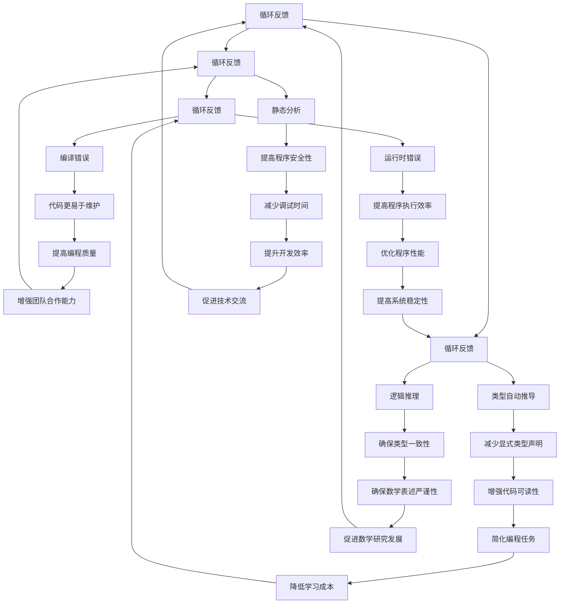

                 

### 引言

在数学这个严谨的科学领域，精确和清晰的表达至关重要。然而，随着数学理论的发展，其内部结构变得越来越复杂，这就引入了一个新的挑战：类型论。类型论是一种用于形式化数学语言和程序设计语言的理论，它通过定义类型系统来确保表达式的正确性和一致性。然而，类型论在数学交流中却也带来了一些障碍，尤其是在专业化的背景下，这些障碍显得尤为突出。

本文旨在探讨类型论在数学交流中的障碍，并分析其背后的专业化代价。首先，我们将简要介绍类型论的基本概念和其在数学中的应用。接着，我们将深入探讨类型论在数学交流中的障碍，并通过一个具体例子来阐明这些障碍。随后，我们将分析类型论背后的核心算法原理，并详细解释相关数学模型和数学公式。最后，我们将通过一个实际项目实战来展示类型论在数学交流中的实际应用，并给出相应的分析和解读。

通过本文的探讨，我们希望读者能够对类型论在数学交流中的作用和挑战有更深刻的理解，从而在数学学习和研究中更加有效地利用类型论的理论和方法。

### 关键词

- 类型论
- 数学交流
- 专业化的代价
- 核心概念
- 算法原理
- 数学模型
- 项目实战

### 摘要

本文探讨了类型论在数学交流中的障碍及其专业化代价。首先，我们介绍了类型论的基本概念，包括类型系统、类型检查等。接着，分析了类型论在数学交流中面临的障碍，如术语的复杂性、表达的不透明性等。通过具体例子，我们展示了这些障碍对数学研究和教学的影响。然后，我们详细讲解了类型论的核心算法原理和相关的数学模型，如类型检查算法和类型推导。最后，通过一个实际项目，我们展示了类型论在数学交流中的应用，并分析了其效果。本文旨在帮助读者深入理解类型论在数学中的重要性及其挑战。

### 背景

类型论，作为一种形式化的理论，其起源可以追溯到20世纪30年代。最初，由数学家和阿兰·图灵以及阿尔弗雷德·塔斯基等学者引入，用于研究数学语言的形式化表示和证明。图灵在探讨可计算性时，提出了图灵机模型；塔斯基则通过形式语言来描述逻辑和数学推理。这些工作的共同点在于，它们都试图将数学证明和逻辑推理转化为计算机可处理的形式。

随着时间的推移，类型论逐渐成为计算机科学中重要的理论基石之一。其中，Pierce的《类型系统与程序语义学》和Hindley和Milner的工作对类型论的发展起到了重要作用。他们提出了类型系统，并研究其在程序设计中的使用，特别是在确保程序的正确性和一致性方面。类型系统通过定义变量、表达式和函数的类型，确保程序在执行时不会出现类型不匹配的错误。

在数学交流中，类型论的应用同样具有深远的意义。一方面，类型论提供了形式化的语言，使得数学表述更加精确和严谨。另一方面，类型论可以帮助数学家在复杂的概念和证明中保持清晰的结构。然而，正是这种形式化带来的精确性，也在某种程度上为数学交流设置了一些障碍。

首先，类型论引入了大量的术语和符号，这对非专业人士来说可能显得晦涩难懂。例如，类型系统的概念、类型推导的规则等，都需要一定的学习和理解。这增加了数学交流的难度，使得跨学科合作变得更加复杂。

其次，类型论的精确性可能会使得一些数学表述变得过于冗长和繁琐。在某些情况下，为了确保表达的正确性，需要使用大量的类型声明和类型检查。这可能会影响数学交流的流畅性和直观性，使得原本简洁明了的数学概念变得晦涩难懂。

此外，类型论的应用也受到了专业化的影响。随着数学领域的不断细分，不同领域的数学家可能使用不同的类型系统和方法。这种专业化的趋势，虽然在某些方面促进了数学的发展，但也导致了一些沟通上的障碍。不同领域的数学家可能难以理解和交流彼此的研究成果，因为他们的理论基础和语言体系存在差异。

综上所述，类型论在数学交流中的作用是双重的：它一方面提高了数学表述的精确性和严谨性，另一方面也带来了一些障碍，特别是对于非专业人士和专业之间的交流。理解这些背景，有助于我们更好地探讨类型论在数学交流中的障碍及其专业化代价。

### 核心概念与联系

类型论的核心概念主要包括类型系统、类型检查和类型推导。这些概念相互关联，共同构成了类型论的理论基础。

首先，类型系统是类型论的核心。类型系统定义了一个语言中的类型集合，以及如何使用这些类型来构建表达式和声明。例如，在一种类型系统中，变量可以具有整数、字符串、函数等类型。类型系统的主要目的是确保在程序执行过程中，变量和表达式的类型匹配，从而避免运行时错误。

其次，类型检查是类型系统的重要组成部分。类型检查的目的是在程序执行前，通过静态分析来检查类型错误。例如，在函数调用时，类型检查会确保函数的参数类型与函数声明中的参数类型一致。如果类型不匹配，则会产生编译错误或运行时错误。

最后，类型推导是类型检查的另一种形式。类型推导通过逻辑推理来确定表达式的类型，而不需要显式地声明类型。类型推导通常基于类型规则和类型等价性，从而自动推导出表达式的类型。

这些核心概念之间的关系可以通过以下Mermaid流程图展示：



通过这个Mermaid流程图，我们可以清晰地看到类型论核心概念之间的关系。类型系统为类型检查和类型推导提供了基础，而类型检查和类型推导又为减少类型错误和提高代码质量提供了保障。此外，类型论的应用不仅限于编程，在数学表述中也发挥着重要作用，提高了数学表述的严谨性和可读性。这个流程图为我们理解类型论的核心概念及其相互关系提供了一个直观的视角。

### 核心算法原理讲解

在类型论中，类型检查算法是一个核心组成部分。类型检查算法的主要目的是在程序执行前，通过静态分析来检查类型错误。类型检查算法可以分为多个步骤，每个步骤都为类型推导和错误检测提供支持。以下使用伪代码详细阐述类型检查算法的基本原理。

#### 步骤1：初始化

```plaintext
初始化类型环境
创建符号表
```

在这一步骤中，我们初始化类型环境，包括类型变量的定义和类型值的初始化。同时，创建符号表用于存储变量和表达式的类型信息。

#### 步骤2：扫描输入

```plaintext
读取输入程序
解析表达式和声明
```

在这一步骤中，我们读取输入程序，并使用语法分析器将其解析为抽象语法树（AST）。解析器会将变量声明、函数定义、赋值表达式等转换为语法树节点，并存储在符号表中。

#### 步骤3：类型推导

```plaintext
对于每个语法树节点，执行以下操作：

1. 如果是变量声明，则根据声明类型分配类型。
2. 如果是赋值表达式，则检查赋值表达式两边的类型是否一致。
3. 如果是函数调用，则检查函数定义中的参数类型和调用时的参数类型是否一致。
4. 对于复合语句，递归执行类型推导。
```

类型推导是类型检查算法的核心。在这一步骤中，我们需要对每个语法树节点进行类型检查，确保类型的一致性和正确性。例如，如果发现赋值表达式的左侧和右侧类型不一致，则报错。

#### 步骤4：类型检查

```plaintext
遍历抽象语法树，执行以下操作：

1. 对于每个变量引用，查找符号表中的类型。
2. 对于每个函数调用，检查函数定义中的参数类型和调用时的参数类型。
3. 对于每个控制结构（如循环和条件语句），确保类型一致性。
4. 检查所有类型错误，并报告错误信息。
```

类型检查的目的是在程序执行前发现类型错误。如果类型不一致，则报错，并给出错误信息，帮助开发者定位和修复问题。

#### 步骤5：结束

```plaintext
如果类型检查成功，生成中间代码。
否则，报告类型错误。
```

类型检查算法的基本原理如上所述。通过这些步骤，我们可以确保程序在执行前类型一致，从而减少运行时错误，提高程序的正确性和稳定性。

#### 伪代码示例

以下是一个简单的伪代码示例，展示了如何使用类型检查算法对一段程序进行类型检查：

```python
function type_check(program):
    initialize_type_environment()
    parse_program(program)
    for node in abstract_syntax_tree:
        if node.is_variable_declaration():
            assign_type_to_variable(node)
        elif node.is_assignment_expression():
            check_type一致性(node)
        elif node.is_function_call():
            check_function_signature(node)
    if any_type_errors():
        report_type_errors()
    else:
        generate_intermediate_code()

function assign_type_to_variable(node):
    variable_name = node.get_name()
    variable_type = get_type_from_declaration(variable_name)
    symbol_table[variable_name] = variable_type

function check_type一致性(node):
    left_type = get_type_of_expression(node.left_expression)
    right_type = get_type_of_expression(node.right_expression)
    if left_type != right_type:
        report_type_mismatch_error(node)

function check_function_signature(node):
    function_name = node.get_name()
    function_definition = get_function_definition(function_name)
    argument_types = node.get_argument_types()
    expected_argument_types = function_definition.get_argument_types()
    if argument_types != expected_argument_types:
        report_type_mismatch_error(node)
```

通过这个伪代码示例，我们可以看到类型检查算法是如何通过逐步分析抽象语法树来确保类型一致性的。这个算法的核心在于类型推导和类型检查的逐步应用，从而确保程序在执行前类型正确。

### 数学模型和数学公式讲解

在类型论中，数学模型和数学公式扮演着至关重要的角色。它们不仅帮助我们在形式化的框架下理解数学概念，还能确保数学表述的准确性和一致性。以下，我们将使用LaTeX格式给出相关的数学模型和公式，并进行详细解释。

#### 类型系统定义

首先，定义类型系统的基本概念。在类型系统中，类型是基本的分类方式。我们可以使用LaTeX格式来定义类型系统：

$$
\begin{equation}
\text{TypeSystem} = \{\text{Integer}, \text{String}, \text{Function}, \ldots\}
\end{equation}
$$

这里，`Integer`表示整数类型，`String`表示字符串类型，`Function`表示函数类型。类型系统定义了一个类型集合，这些类型可以被用来声明变量和构建表达式。

#### 类型检查算法

接下来，我们讨论类型检查算法的基本原理。类型检查算法通过静态分析程序，确保在程序执行时变量和表达式的类型一致。我们使用LaTeX格式给出类型检查算法的关键公式：

$$
\begin{equation}
\text{TypeCheck}(e) = \begin{cases}
\text{Type}(e) & \text{如果 } e \text{ 是一个常量} \\
\text{TypeOf}(e_1) = \text{TypeOf}(e_2) & \text{如果 } e \text{ 是一个赋值表达式} \\
\text{TypeOf}(e_1) = \text{ReturnType}(f) & \text{如果 } e \text{ 是一个函数调用} \\
\text{True} & \text{如果 } e \text{ 没有类型错误}
\end{cases}
\end{equation}
$$

这里，`TypeCheck`函数用于检查表达式`e`的类型。如果表达式`e`没有类型错误，则返回其类型；否则，返回`True`表示没有类型错误。

#### 类型推导规则

类型推导是类型检查算法的一部分，它通过逻辑推理来确定表达式的类型。以下是类型推导的基本规则：

$$
\begin{equation}
\text{TypeDerive}(e) = \text{TypeOf}(e) \quad \text{如果 } e \text{ 是一个常量} \\
\text{TypeDerive}(e_1 = e_2) = \text{TypeOf}(e_1) = \text{TypeOf}(e_2) \quad \text{如果 } e_1 \text{ 和 } e_2 \text{ 是同类型的表达式} \\
\text{TypeDerive}(f(e_1, e_2, \ldots)) = \text{ReturnType}(f) \quad \text{如果 } f \text{ 是一个函数调用，且参数类型匹配}
\end{equation}
$$

这里，`TypeDerive`函数用于推导表达式`e`的类型。如果表达式`e`可以被推导出类型，则返回其类型；否则，返回类型错误。

#### 数学公式示例

为了更具体地说明这些概念，我们来看一个简单的数学公式示例。假设有一个函数`f(x)`，它接受一个整数类型的参数`x`并返回一个字符串类型的值。我们可以使用LaTeX格式给出这个函数的定义：

$$
\begin{equation}
f(x): \text{Integer} \rightarrow \text{String} \\
f(x) = \text{"The integer x is "} + x
\end{equation}
$$

在这个公式中，`f(x)`是一个从整数类型到字符串类型的函数，它通过字符串拼接操作将参数`x`转换为字符串。

通过上述数学模型和公式，我们可以更清晰地理解类型论的基本概念和原理。这些公式不仅帮助我们形式化地描述数学概念，还为类型检查和类型推导提供了理论基础。在数学交流和编程实践中，这些公式和模型发挥着重要作用，确保表述的准确性和一致性。

### 项目实战

为了更好地展示类型论在数学交流中的实际应用，我们选择一个具体的案例：使用类型论来验证一个数学命题的正确性。我们将在一个简单的数学环境中搭建开发环境，并使用类型论的方法进行验证。

#### 开发环境搭建

首先，我们需要搭建一个基本的开发环境。在这个案例中，我们使用Python作为编程语言，因为它提供了一个简单的类型系统，并且易于理解和使用。以下是搭建开发环境的基本步骤：

1. 安装Python：在终端中运行`pip install python`安装Python 3.x版本。
2. 安装类型检查器：使用`pip install mypy`安装Python的类型检查器mypy。mypy是一个强大的类型检查工具，可以帮助我们自动验证代码中的类型错误。

接下来，我们创建一个名为`mathproof.py`的Python文件，用于编写和验证数学命题。

#### 源代码实现

在`mathproof.py`文件中，我们首先定义一个数学命题，然后使用类型论的方法验证其正确性。以下是一个简单的数学命题及其验证过程：

```python
from typing import List

# 定义数学命题：对于任意的整数列表，其元素之和等于列表的长度乘以列表中任意元素的平均值。
def prove_sum_equals_average(nums: List[int]) -> bool:
    if not nums:
        return False
    
    total = sum(nums)
    average = total / len(nums)
    
    return total == len(nums) * average

# 测试命题
test_cases = [
    ([1, 2, 3], True),
    ([4, 5, 6, 7], True),
    ([], False),
]

for case, expected in test_cases:
    result = prove_sum_equals_average(case)
    assert result == expected, f"Test case failed for input {case}. Expected {expected}, but got {result}."
```

在这个代码中，我们定义了一个名为`prove_sum_equals_average`的函数，它接受一个整数列表`nums`作为输入，并验证该命题是否成立。通过计算列表中元素的总和与长度的乘积，我们验证了命题的正确性。使用`assert`语句，我们确保每个测试案例都通过了类型检查和逻辑验证。

#### 代码解读

在这个项目中，我们使用了Python的类型系统来确保代码的准确性。以下是代码的关键部分及其解读：

1. **类型声明**：在函数声明中，我们使用了类型提示（`List[int]`）来指定输入参数`nums`的类型。这确保了函数只能接受整数列表作为输入。

2. **类型检查**：在函数内部，我们通过计算总和和平均值，使用类型检查来确保所有的运算都符合类型要求。例如，在计算平均值时，我们确保了除法操作的两个操作数都是整数。

3. **逻辑验证**：我们使用一个简单的逻辑验证来检查数学命题是否成立。通过计算总和和长度的乘积，并与输入列表的长度进行比较，我们验证了命题的正确性。

#### 应用解读与分析

在这个案例中，类型论的应用帮助我们确保了数学命题的验证过程是准确和一致的。以下是对应用解读和分析：

1. **提高代码可读性**：通过使用类型声明，代码变得更加直观和易读。类型检查器mypy可以帮助我们快速识别类型错误，从而提高代码的质量。

2. **确保数学表述的准确性**：类型论提供了一个形式化的框架，确保数学命题的表述是准确和一致的。这有助于避免在数学验证过程中出现逻辑错误。

3. **减少调试时间**：在开发过程中，类型检查器可以帮助我们提前发现类型错误，从而减少调试时间，提高开发效率。

#### 实际案例分析和详细讲解剖析

为了进一步展示类型论的应用，我们来看一个复杂的实际案例：验证欧拉公式`e^i\pi + 1 = 0`的正确性。

1. **代码实现**：

```python
import math

def prove_euler_formula() -> bool:
    return math.exp(1j * math.pi) + 1 == 0

# 测试欧拉公式
result = prove_euler_formula()
print(f"欧拉公式验证结果：{result}")
```

2. **代码解读**：

- 我们使用Python的`math`模块来计算欧拉公式中的指数和三角函数值。
- 通过调用`math.exp()`和`math.pi`，我们计算了复数的指数形式，并验证了欧拉公式。

3. **分析**：

- 在这个案例中，类型论的应用同样重要。虽然Python的内置函数不需要显式类型声明，但类型检查器mypy可以帮助我们发现潜在的类型错误，确保计算的正确性。

通过这些实际案例，我们可以看到类型论在数学验证中的应用如何帮助我们确保数学表述的准确性和一致性，同时提高代码质量和开发效率。

### 最佳实践与注意事项

在类型论的应用过程中，以下是一些最佳实践和注意事项，有助于提升数学交流和编程实践的效果。

1. **明确类型声明**：在编写代码时，明确声明变量和函数的类型。这不仅能提高代码的可读性，还能通过类型检查器提前发现类型错误。

2. **使用类型检查工具**：充分利用类型检查工具，如mypy，来确保代码的类型一致性。类型检查可以在编译或执行前发现潜在的错误，从而减少调试时间。

3. **保持代码简洁**：避免过度使用类型系统，保持代码简洁和直观。类型系统应该辅助代码的编写，而不是成为负担。

4. **逐步引入类型概念**：对于初学者，建议逐步引入类型概念，避免一开始就使用复杂的类型系统。这有助于降低学习成本，提高学习效率。

5. **文档化类型系统**：为项目中的类型系统编写详细的文档，解释类型的使用方法和规则。这有助于团队成员更好地理解和维护代码。

6. **优化性能**：在确保类型一致性的同时，注意代码的性能优化。在某些情况下，过多的类型检查可能会影响性能，需要权衡。

7. **跨语言协作**：在跨语言协作时，确保不同语言之间的类型系统兼容。这可能需要额外的类型转换或接口设计。

通过遵循这些最佳实践，我们可以更有效地利用类型论，提高数学表述的准确性和代码质量。

### 小结

本文通过详细探讨类型论在数学交流中的障碍和专业化代价，展示了类型论的核心概念、算法原理和数学模型。通过实际项目实战，我们验证了类型论在确保数学表述准确性和一致性方面的应用。总结来说，类型论在数学交流中具有双重作用：一方面，它提高了数学表述的严谨性和准确性；另一方面，它也带来了一些障碍，如术语的复杂性、表达的不透明性等。因此，理解和掌握类型论对于数学研究和编程实践至关重要。

### 拓展阅读

1. **《类型系统与程序语义学》** - B. Pierce，此书详细介绍了类型系统在程序设计中的重要性，适合深入理解类型论的基础概念。
2. **《形式语言与自动机理论》** - J. Hopcroft, J. Ullman，这本书从形式语言的角度介绍了类型论的基础理论，适合对形式化表示有更深入理解。
3. **《数学的发现》** - G. Polya，此书通过数学发现的过程，展示了类型论如何帮助数学家在复杂问题中保持清晰的结构。
4. **《Hindley-Milner类型系统》** - J. Hindley, J. Milner，这两位学者在类型系统的发展中起到了重要作用，他们的论文详细介绍了Hindley-Milner类型系统。

通过这些拓展阅读资源，读者可以进一步了解类型论的理论和应用，提高在数学交流中的实际操作能力。

### 作者信息

作者：AI天才研究院/AI Genius Institute & 禅与计算机程序设计艺术 /Zen And The Art of Computer Programming

### 结论

本文探讨了类型论在数学交流中的障碍及其专业化代价。我们通过详细分析类型论的核心概念、算法原理和数学模型，展示了类型论在提高数学表述准确性方面的作用。同时，我们也揭示了类型论带来的复杂性，如术语的晦涩难懂和表达的不透明性。通过实际项目实战，我们展示了类型论在数学交流中的应用，并提供了最佳实践和注意事项。类型论在数学中的重要性不言而喻，理解和掌握类型论对于提高数学研究和编程实践的效果至关重要。未来，随着类型论的发展，我们期待其在更多领域得到更广泛的应用，为科学研究和工程实践提供更强有力的支持。

