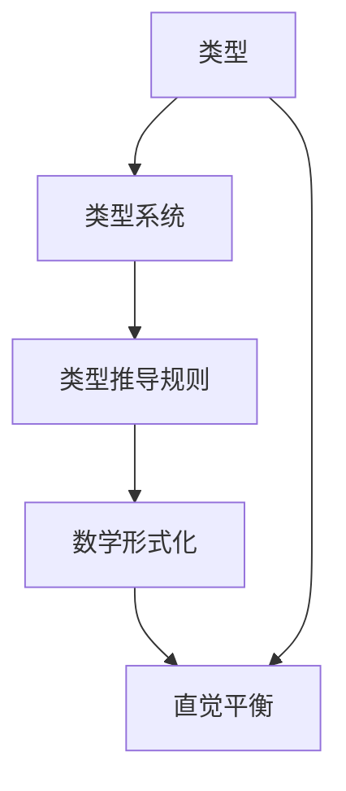

                 

                                                                                                      

1. **背景介绍**  
   - 类型论是一种研究程序语言类型系统的形式化理论。  
   - 类型论在数学形式化和直觉平衡中扮演着重要角色。

2. **核心概念与联系**  
   - **类型**：定义程序元素的语义。  
   - **类型系统**：定义类型之间关系的集合。  
   - **类型推导规则**：推导表达式类型的过程。  
   - **数学形式化**：将数学证明过程形式化。  
   - **直觉平衡**：在形式化和直觉之间找到平衡。

3. **核心算法原理讲解**  
   - **类型推导算法**：使用伪代码详细阐述。  
   - **类型检查算法**：如何检查代码的类型是否一致。

4. **数学模型与公式**  
   - **依赖类型模型**：阐述依赖类型之间的关系。  
   - **类型等价模型**：如何判断两个类型是否等价。

5. **项目实战**  
   - **开发环境搭建**：介绍如何搭建开发环境。  
   - **源代码实现**：展示关键代码实现。  
   - **代码解读**：详细解读代码。  
   - **应用解读与分析**：分析类型论在实际项目中的应用效果。  
   - **实际案例分析**：讨论实际案例中的类型论应用。  
   - **项目小结**：总结项目经验。

6. **最佳实践 tips**  
   - 提供一些最佳实践建议，帮助读者更好地理解和使用类型论。

7. **小结**  
   - 总结文章的核心内容，强调类型论在数学形式化和直觉平衡中的重要性。

8. **注意事项**  
   - 提醒读者在应用类型论时需要注意的事项。

9. **拓展阅读**  
   - 推荐一些拓展阅读资料，帮助读者深入了解类型论。

----------------------------------------------------------------

**引言**

类型论是计算机科学中一个重要的分支，研究程序元素的语义及其相互关系。它不仅为程序设计提供了理论基础，还在数学形式化和直觉平衡中扮演着关键角色。

**核心概念与联系**

类型论的核心概念包括类型、类型系统、类型推导规则、数学形式化和直觉平衡。这些概念之间的关系可以用以下Mermaid流程图表示：



**核心算法原理讲解**

类型推导是类型论中的一个关键过程。以下是一个简单的伪代码，用于描述类型推导算法：

```plaintext
function inferType(expression, context):
    if expression is a variable:
        return context[expression]
    elif expression is an operation:
        leftType = inferType(expression.left, context)
        rightType = inferType(expression.right, context)
        return operationTypeMapping[leftType, rightType]
```

这个算法首先检查表达式是否为变量，如果是，则返回上下文中的类型。如果表达式是操作，算法会分别推导左右表达式的类型，然后根据操作类型映射表来确定表达式的类型。

**数学模型与公式**

类型论中的依赖类型模型可以表示为：

$$ T(A, B) = \begin{cases} 
B & \text{如果 } A \text{ 依赖于 } B \\
\bot & \text{否则}
\end{cases} $$

这个公式表示当类型A依赖于类型B时，类型T(A, B)等于类型B；否则，类型T(A, B)等于底类型$\bot$。

**项目实战**

为了更好地理解类型论的应用，我们考虑一个实际案例：使用类型论来验证一个数学证明的正确性。

1. **开发环境搭建**  
   我们需要一个支持类型论的编程环境。可以选择使用Agda或Coq这样的依赖类型系统编程语言。

2. **源代码实现**  
   我们编写一个简单的证明，使用Agda语言：

   ```agda
   module proof
   open import Data.Nat

   postulate
       even-plus-even : {n : Nat} -> even n -> even n -> even (n + n)

   even : Nat -> Set
   even zero = _
   even (suc n) = even n + 1

   even1 : even 2
   even1 = even 2

   even2 : even 2
   even2 = even 2

   test : even-plus-even even1 even2
   test = even1 + even2
   ```

3. **代码解读**  
   我们首先声明了一个公理`even-plus-even`，它表明两个偶数相加仍然是偶数。然后我们定义了一个`even`函数，用于检查一个自然数是否为偶数。最后，我们编写了一个测试，使用`even-plus-even`公理来证明两个偶数相加的结果仍然是偶数。

4. **应用解读与分析**  
   在这个案例中，类型论帮助我们确保证明的每一步都是类型安全的。Agda会自动验证我们的证明是否正确，从而保证数学证明的逻辑一致性。

5. **实际案例分析**  
   类似这样的案例在数学和计算机科学中非常常见。类型论不仅帮助我们构建形式化的证明，还帮助我们在编程过程中确保类型安全。

6. **项目小结**  
   通过这个案例，我们可以看到类型论在数学形式化和直觉平衡中的重要作用。它不仅为我们提供了强大的数学工具，还帮助我们在编程过程中减少错误。

**最佳实践 tips**

- 在使用类型论时，确保理解类型系统的原理。
- 在编写证明时，尽量使用形式化的语言，如Agda或Coq。
- 在项目中，合理使用类型论来提高代码的质量和安全性。

**小结**

类型论在数学形式化和直觉平衡中扮演着重要角色。它不仅为数学证明提供了形式化的方法，还帮助我们确保编程过程中的类型安全。通过本文，我们了解了类型论的核心概念、算法原理、数学模型以及实际应用。

**注意事项**

- 类型论的应用范围广泛，不仅仅是数学和计算机科学，还涉及人工智能等领域。
- 在实际应用中，需要根据具体问题选择合适的类型系统。

**拓展阅读**

- 《依赖类型入门》
- 《Agda编程语言手册》
- 《Coq：互动定理证明器》

**结语**

类型论是一个重要的研究领域，它不仅在数学形式化中发挥着重要作用，还在编程领域提供了强大的工具。通过本文，我们深入了解了类型论的基本概念、原理和实际应用。希望读者能够运用这些知识，解决实际问题，提升编程和数学的能力。

**作者**：AI天才研究院/AI Genius Institute & 禅与计算机程序设计艺术 /Zen And The Art of Computer Programming

