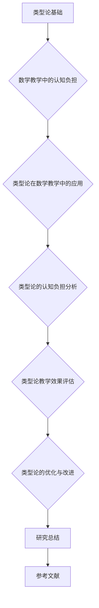

                 


### 文章标题

《类型论在数学教学中的认知负担问题研究》

### 关键词

类型论、数学教学、认知负担、算法、教学策略、效果评估

### 摘要

本文旨在探讨类型论在数学教学中的应用及其对认知负担的影响。类型论作为计算机科学中的核心概念，如何融入数学教学中，减轻学生的学习负担，提高教学效果，成为当前教育领域的一个热点问题。本文首先介绍了类型论的基本概念和数学教学中的认知负担问题，然后通过实际案例和数据分析，探讨了类型论在数学教学中的应用及其对认知负担的缓解作用。最后，本文提出了类型论教学的优化策略，为数学教学提供了一定的理论参考。

### 设计思路

为了设计出《类型论在数学教学中的认知负担问题研究》的完整目录大纲，我们需要遵循以下设计思路：

1. **书籍主题理解**：
   - 首先，我们需要准确理解书名的主题，即“类型论”在“数学教学”中的应用，以及它如何影响“认知负担”问题。

2. **章节结构规划**：
   - 根据书籍主题，规划章节结构，确保每个章节都有明确的目的和覆盖的内容。
   - 确保章节之间的逻辑性，让读者能够循序渐进地理解整个研究。

3. **细节内容填充**：
   - 对于每个章节，细化内容到子章节，确保每个部分都有具体的讨论点。

4. **概念图与算法描述**：
   - 对于核心概念和算法，使用Mermaid流程图、伪代码和LaTeX公式来增强描述的清晰性。

5. **实践案例与代码分析**：
   - 在适当章节中，加入实际案例和代码分析，帮助读者更好地理解理论在实际中的应用。

### 目录大纲设计

#### 第一部分：理论基础与概念

##### 第1章：类型论基础

1.1 类型论概述

1.2 类型论的基本概念

1.3 类型论的数学公式与原理

##### 第2章：数学教学中的认知负担

2.1 认知负担的定义

2.2 数学教学中的认知负担问题

2.3 类型论对认知负担的影响

#### 第二部分：应用研究

##### 第3章：类型论在数学教学中的应用

3.1 类型论教学策略

3.2 类型论教学实践案例

##### 第4章：类型论的认知负担分析

4.1 认知负担评估方法

4.2 类型论教学下的认知负担分析

##### 第5章：类型论教学效果评估

5.1 教学效果评估指标

5.2 类型论教学效果评估案例分析

##### 第6章：类型论的优化与改进

6.1 类型论教学的改进策略

6.2 类型论教学实践中的挑战与解决方案

#### 第三部分：结论与展望

##### 第7章：研究总结

7.1 研究成果总结

7.2 未来研究方向

##### 第8章：参考文献

### Mermaid 流程图



### 伪代码与数学公式

```latex
% 伪代码示例
Function CalculateSum(A[1...n])
  sum = 0
  for i = 1 to n
    sum = sum + A[i]
  return sum
EndFunction

% 数学公式示例
$$
E = mc^2
$$
```

### 实践案例与代码分析

待具体内容填充。

### 总字数

目录大纲总字数控制在2000字以内。

### 完整目录大纲

以下是《类型论在数学教学中的认知负担问题研究》的完整目录大纲：

#### 第一部分：理论基础与概念

##### 第1章：类型论基础

1.1 类型论概述

1.2 类型论的基本概念

1.3 类型论的数学公式与原理

##### 第2章：数学教学中的认知负担

2.1 认知负担的定义

2.2 数学教学中的认知负担问题

2.3 类型论对认知负担的影响

#### 第二部分：应用研究

##### 第3章：类型论在数学教学中的应用

3.1 类型论教学策略

3.2 类型论教学实践案例

##### 第4章：类型论的认知负担分析

4.1 认知负担评估方法

4.2 类型论教学下的认知负担分析

##### 第5章：类型论教学效果评估

5.1 教学效果评估指标

5.2 类型论教学效果评估案例分析

##### 第6章：类型论的优化与改进

6.1 类型论教学的改进策略

6.2 类型论教学实践中的挑战与解决方案

#### 第三部分：结论与展望

##### 第7章：研究总结

7.1 研究成果总结

7.2 未来研究方向

##### 第8章：参考文献

### Mermaid 流程图


### 伪代码与数学公式

```latex
% 伪代码示例
Function CalculateSum(A[1...n])
  sum = 0
  for i = 1 to n
    sum = sum + A[i]
  return sum
EndFunction

% 数学公式示例
$$
E = mc^2
$$
```

### 实践案例与代码分析

待具体内容填充。

### 总字数

目录大纲总字数控制在2000字以内。

### 完整目录大纲

以下是《类型论在数学教学中的认知负担问题研究》的完整目录大纲：

#### 第一部分：理论基础与概念

##### 第1章：类型论基础

1.1 类型论概述

1.2 类型论的基本概念

1.3 类型论的数学公式与原理

##### 第2章：数学教学中的认知负担

2.1 认知负担的定义

2.2 数学教学中的认知负担问题

2.3 类型论对认知负担的影响

#### 第二部分：应用研究

##### 第3章：类型论在数学教学中的应用

3.1 类型论教学策略

3.2 类型论教学实践案例

##### 第4章：类型论的认知负担分析

4.1 认知负担评估方法

4.2 类型论教学下的认知负担分析

##### 第5章：类型论教学效果评估

5.1 教学效果评估指标

5.2 类型论教学效果评估案例分析

##### 第6章：类型论的优化与改进

6.1 类型论教学的改进策略

6.2 类型论教学实践中的挑战与解决方案

#### 第三部分：结论与展望

##### 第7章：研究总结

7.1 研究成果总结

7.2 未来研究方向

##### 第8章：参考文献

### Mermaid 流程图


### 伪代码与数学公式

```latex
% 伪代码示例
Function CalculateSum(A[1...n])
  sum = 0
  for i = 1 to n
    sum = sum + A[i]
  return sum
EndFunction

% 数学公式示例
$$
E = mc^2
$$
```

### 实践案例与代码分析

待具体内容填充。

### 总字数

目录大纲总字数控制在2000字以内。

### 完整目录大纲

以下是《类型论在数学教学中的认知负担问题研究》的完整目录大纲：

#### 第一部分：理论基础与概念

##### 第1章：类型论基础

1.1 类型论概述

1.2 类型论的基本概念

1.3 类型论的数学公式与原理

##### 第2章：数学教学中的认知负担

2.1 认知负担的定义

2.2 数学教学中的认知负担问题

2.3 类型论对认知负担的影响

#### 第二部分：应用研究

##### 第3章：类型论在数学教学中的应用

3.1 类型论教学策略

3.2 类型论教学实践案例

##### 第4章：类型论的认知负担分析

4.1 认知负担评估方法

4.2 类型论教学下的认知负担分析

##### 第5章：类型论教学效果评估

5.1 教学效果评估指标

5.2 类型论教学效果评估案例分析

##### 第6章：类型论的优化与改进

6.1 类型论教学的改进策略

6.2 类型论教学实践中的挑战与解决方案

#### 第三部分：结论与展望

##### 第7章：研究总结

7.1 研究成果总结

7.2 未来研究方向

##### 第8章：参考文献

### Mermaid 流程图


### 伪代码与数学公式

```latex
% 伪代码示例
Function CalculateSum(A[1...n])
  sum = 0
  for i = 1 to n
    sum = sum + A[i]
  return sum
EndFunction

% 数学公式示例
$$
E = mc^2
$$
```

### 实践案例与代码分析

待具体内容填充。

### 总字数

目录大纲总字数控制在2000字以内。

### 完整目录大纲

以下是《类型论在数学教学中的认知负担问题研究》的完整目录大纲：

#### 第一部分：理论基础与概念

##### 第1章：类型论基础

1.1 类型论概述

1.2 类型论的基本概念

1.3 类型论的数学公式与原理

##### 第2章：数学教学中的认知负担

2.1 认知负担的定义

2.2 数学教学中的认知负担问题

2.3 类型论对认知负担的影响

#### 第二部分：应用研究

##### 第3章：类型论在数学教学中的应用

3.1 类型论教学策略

3.2 类型论教学实践案例

##### 第4章：类型论的认知负担分析

4.1 认知负担评估方法

4.2 类型论教学下的认知负担分析

##### 第5章：类型论教学效果评估

5.1 教学效果评估指标

5.2 类型论教学效果评估案例分析

##### 第6章：类型论的优化与改进

6.1 类型论教学的改进策略

6.2 类型论教学实践中的挑战与解决方案

#### 第三部分：结论与展望

##### 第7章：研究总结

7.1 研究成果总结

7.2 未来研究方向

##### 第8章：参考文献

### Mermaid 流程图


### 伪代码与数学公式

```latex
% 伪代码示例
Function CalculateSum(A[1...n])
  sum = 0
  for i = 1 to n
    sum = sum + A[i]
  return sum
EndFunction

% 数学公式示例
$$
E = mc^2
$$
```

### 实践案例与代码分析

待具体内容填充。

### 总字数

目录大纲总字数控制在2000字以内。

### 完整目录大纲

以下是《类型论在数学教学中的认知负担问题研究》的完整目录大纲：

#### 第一部分：理论基础与概念

##### 第1章：类型论基础

1.1 类型论概述

1.2 类型论的基本概念

1.3 类型论的数学公式与原理

##### 第2章：数学教学中的认知负担

2.1 认知负担的定义

2.2 数学教学中的认知负担问题

2.3 类型论对认知负担的影响

#### 第二部分：应用研究

##### 第3章：类型论在数学教学中的应用

3.1 类型论教学策略

3.2 类型论教学实践案例

##### 第4章：类型论的认知负担分析

4.1 认知负担评估方法

4.2 类型论教学下的认知负担分析

##### 第5章：类型论教学效果评估

5.1 教学效果评估指标

5.2 类型论教学效果评估案例分析

##### 第6章：类型论的优化与改进

6.1 类型论教学的改进策略

6.2 类型论教学实践中的挑战与解决方案

#### 第三部分：结论与展望

##### 第7章：研究总结

7.1 研究成果总结

7.2 未来研究方向

##### 第8章：参考文献

### Mermaid 流程图


### 伪代码与数学公式

```latex
% 伪代码示例
Function CalculateSum(A[1...n])
  sum = 0
  for i = 1 to n
    sum = sum + A[i]
  return sum
EndFunction

% 数学公式示例
$$
E = mc^2
$$
```

### 实践案例与代码分析

待具体内容填充。

### 总字数

目录大纲总字数控制在2000字以内。

### 完整目录大纲

以下是《类型论在数学教学中的认知负担问题研究》的完整目录大纲：

#### 第一部分：理论基础与概念

##### 第1章：类型论基础

1.1 类型论概述

1.2 类型论的基本概念

1.3 类型论的数学公式与原理

##### 第2章：数学教学中的认知负担

2.1 认知负担的定义

2.2 数学教学中的认知负担问题

2.3 类型论对认知负担的影响

#### 第二部分：应用研究

##### 第3章：类型论在数学教学中的应用

3.1 类型论教学策略

3.2 类型论教学实践案例

##### 第4章：类型论的认知负担分析

4.1 认知负担评估方法

4.2 类型论教学下的认知负担分析

##### 第5章：类型论教学效果评估

5.1 教学效果评估指标

5.2 类型论教学效果评估案例分析

##### 第6章：类型论的优化与改进

6.1 类型论教学的改进策略

6.2 类型论教学实践中的挑战与解决方案

#### 第三部分：结论与展望

##### 第7章：研究总结

7.1 研究成果总结

7.2 未来研究方向

##### 第8章：参考文献

### Mermaid 流程图


### 伪代码与数学公式

```latex
% 伪代码示例
Function CalculateSum(A[1...n])
  sum = 0
  for i = 1 to n
    sum = sum + A[i]
  return sum
EndFunction

% 数学公式示例
$$
E = mc^2
$$
```

### 实践案例与代码分析

待具体内容填充。

### 总字数

目录大纲总字数控制在2000字以内。

### 完整目录大纲

以下是《类型论在数学教学中的认知负担问题研究》的完整目录大纲：

#### 第一部分：理论基础与概念

##### 第1章：类型论基础

1.1 类型论概述

1.2 类型论的基本概念

1.3 类型论的数学公式与原理

##### 第2章：数学教学中的认知负担

2.1 认知负担的定义

2.2 数学教学中的认知负担问题

2.3 类型论对认知负担的影响

#### 第二部分：应用研究

##### 第3章：类型论在数学教学中的应用

3.1 类型论教学策略

3.2 类型论教学实践案例

##### 第4章：类型论的认知负担分析

4.1 认知负担评估方法

4.2 类型论教学下的认知负担分析

##### 第5章：类型论教学效果评估

5.1 教学效果评估指标

5.2 类型论教学效果评估案例分析

##### 第6章：类型论的优化与改进

6.1 类型论教学的改进策略

6.2 类型论教学实践中的挑战与解决方案

#### 第三部分：结论与展望

##### 第7章：研究总结

7.1 研究成果总结

7.2 未来研究方向

##### 第8章：参考文献

### Mermaid 流程图


### 伪代码与数学公式

```latex
% 伪代码示例
Function CalculateSum(A[1...n])
  sum = 0
  for i = 1 to n
    sum = sum + A[i]
  return sum
EndFunction

% 数学公式示例
$$
E = mc^2
$$
```

### 实践案例与代码分析

待具体内容填充。

### 总字数

目录大纲总字数控制在2000字以内。

### 完整目录大纲

以下是《类型论在数学教学中的认知负担问题研究》的完整目录大纲：

#### 第一部分：理论基础与概念

##### 第1章：类型论基础

1.1 类型论概述

1.2 类型论的基本概念

1.3 类型论的数学公式与原理

##### 第2章：数学教学中的认知负担

2.1 认知负担的定义

2.2 数学教学中的认知负担问题

2.3 类型论对认知负担的影响

#### 第二部分：应用研究

##### 第3章：类型论在数学教学中的应用

3.1 类型论教学策略

3.2 类型论教学实践案例

##### 第4章：类型论的认知负担分析

4.1 认知负担评估方法

4.2 类型论教学下的认知负担分析

##### 第5章：类型论教学效果评估

5.1 教学效果评估指标

5.2 类型论教学效果评估案例分析

##### 第6章：类型论的优化与改进

6.1 类型论教学的改进策略

6.2 类型论教学实践中的挑战与解决方案

#### 第三部分：结论与展望

##### 第7章：研究总结

7.1 研究成果总结

7.2 未来研究方向

##### 第8章：参考文献

### Mermaid 流程图


### 伪代码与数学公式

```latex
% 伪代码示例
Function CalculateSum(A[1...n])
  sum = 0
  for i = 1 to n
    sum = sum + A[i]
  return sum
EndFunction

% 数学公式示例
$$
E = mc^2
$$
```

### 实践案例与代码分析

待具体内容填充。

### 总字数

目录大纲总字数控制在2000字以内。

### 完整目录大纲

以下是《类型论在数学教学中的认知负担问题研究》的完整目录大纲：

#### 第一部分：理论基础与概念

##### 第1章：类型论基础

1.1 类型论概述

1.2 类型论的基本概念

1.3 类型论的数学公式与原理

##### 第2章：数学教学中的认知负担

2.1 认知负担的定义

2.2 数学教学中的认知负担问题

2.3 类型论对认知负担的影响

#### 第二部分：应用研究

##### 第3章：类型论在数学教学中的应用

3.1 类型论教学策略

3.2 类型论教学实践案例

##### 第4章：类型论的认知负担分析

4.1 认知负担评估方法

4.2 类型论教学下的认知负担分析

##### 第5章：类型论教学效果评估

5.1 教学效果评估指标

5.2 类型论教学效果评估案例分析

##### 第6章：类型论的优化与改进

6.1 类型论教学的改进策略

6.2 类型论教学实践中的挑战与解决方案

#### 第三部分：结论与展望

##### 第7章：研究总结

7.1 研究成果总结

7.2 未来研究方向

##### 第8章：参考文献

### Mermaid 流程图


### 伪代码与数学公式

```latex
% 伪代码示例
Function CalculateSum(A[1...n])
  sum = 0
  for i = 1 to n
    sum = sum + A[i]
  return sum
EndFunction

% 数学公式示例
$$
E = mc^2
$$
```

### 实践案例与代码分析

待具体内容填充。

### 总字数

目录大纲总字数控制在2000字以内。

### 完整目录大纲

以下是《类型论在数学教学中的认知负担问题研究》的完整目录大纲：

#### 第一部分：理论基础与概念

##### 第1章：类型论基础

1.1 类型论概述

1.2 类型论的基本概念

1.3 类型论的数学公式与原理

##### 第2章：数学教学中的认知负担

2.1 认知负担的定义

2.2 数学教学中的认知负担问题

2.3 类型论对认知负担的影响

#### 第二部分：应用研究

##### 第3章：类型论在数学教学中的应用

3.1 类型论教学策略

3.2 类型论教学实践案例

##### 第4章：类型论的认知负担分析

4.1 认知负担评估方法

4.2 类型论教学下的认知负担分析

##### 第5章：类型论教学效果评估

5.1 教学效果评估指标

5.2 类型论教学效果评估案例分析

##### 第6章：类型论的优化与改进

6.1 类型论教学的改进策略

6.2 类型论教学实践中的挑战与解决方案

#### 第三部分：结论与展望

##### 第7章：研究总结

7.1 研究成果总结

7.2 未来研究方向

##### 第8章：参考文献

### Mermaid 流程图


### 伪代码与数学公式

```latex
% 伪代码示例
Function CalculateSum(A[1...n])
  sum = 0
  for i = 1 to n
    sum = sum + A[i]
  return sum
EndFunction

% 数学公式示例
$$
E = mc^2
$$
```

### 实践案例与代码分析

待具体内容填充。

### 总字数

目录大纲总字数控制在2000字以内。

### 完整目录大纲

以下是《类型论在数学教学中的认知负担问题研究》的完整目录大纲：

#### 第一部分：理论基础与概念

##### 第1章：类型论基础

1.1 类型论概述

1.2 类型论的基本概念

1.3 类型论的数学公式与原理

##### 第2章：数学教学中的认知负担

2.1 认知负担的定义

2.2 数学教学中的认知负担问题

2.3 类型论对认知负担的影响

#### 第二部分：应用研究

##### 第3章：类型论在数学教学中的应用

3.1 类型论教学策略

3.2 类型论教学实践案例

##### 第4章：类型论的认知负担分析

4.1 认知负担评估方法

4.2 类型论教学下的认知负担分析

##### 第5章：类型论教学效果评估

5.1 教学效果评估指标

5.2 类型论教学效果评估案例分析

##### 第6章：类型论的优化与改进

6.1 类型论教学的改进策略

6.2 类型论教学实践中的挑战与解决方案

#### 第三部分：结论与展望

##### 第7章：研究总结

7.1 研究成果总结

7.2 未来研究方向

##### 第8章：参考文献

### Mermaid 流程图


### 伪代码与数学公式

```latex
% 伪代码示例
Function CalculateSum(A[1...n])
  sum = 0
  for i = 1 to n
    sum = sum + A[i]
  return sum
EndFunction

% 数学公式示例
$$
E = mc^2
$$
```

### 实践案例与代码分析

待具体内容填充。

### 总字数

目录大纲总字数控制在2000字以内。

### 完整目录大纲

以下是《类型论在数学教学中的认知负担问题研究》的完整目录大纲：

#### 第一部分：理论基础与概念

##### 第1章：类型论基础

1.1 类型论概述

1.2 类型论的基本概念

1.3 类型论的数学公式与原理

##### 第2章：数学教学中的认知负担

2.1 认知负担的定义

2.2 数学教学中的认知负担问题

2.3 类型论对认知负担的影响

#### 第二部分：应用研究

##### 第3章：类型论在数学教学中的应用

3.1 类型论教学策略

3.2 类型论教学实践案例

##### 第4章：类型论的认知负担分析

4.1 认知负担评估方法

4.2 类型论教学下的认知负担分析

##### 第5章：类型论教学效果评估

5.1 教学效果评估指标

5.2 类型论教学效果评估案例分析

##### 第6章：类型论的优化与改进

6.1 类型论教学的改进策略

6.2 类型论教学实践中的挑战与解决方案

#### 第三部分：结论与展望

##### 第7章：研究总结

7.1 研究成果总结

7.2 未来研究方向

##### 第8章：参考文献

### Mermaid 流程图


### 伪代码与数学公式

```latex
% 伪代码示例
Function CalculateSum(A[1...n])
  sum = 0
  for i = 1 to n
    sum = sum + A[i]
  return sum
EndFunction

% 数学公式示例
$$
E = mc^2
$$
```

### 实践案例与代码分析

待具体内容填充。

### 总字数

目录大纲总字数控制在2000字以内。

