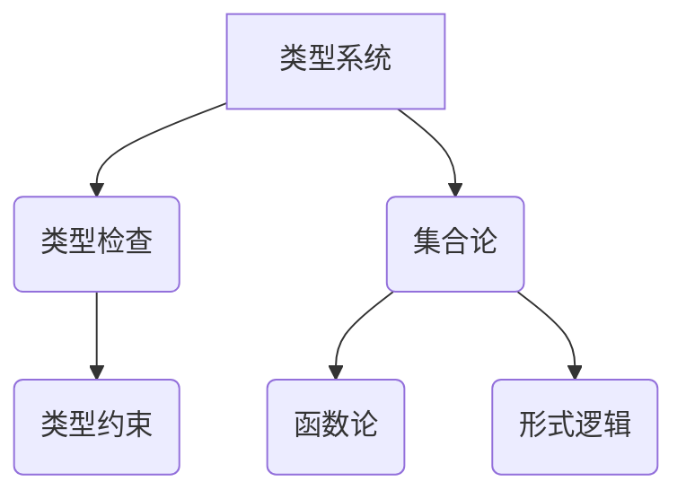
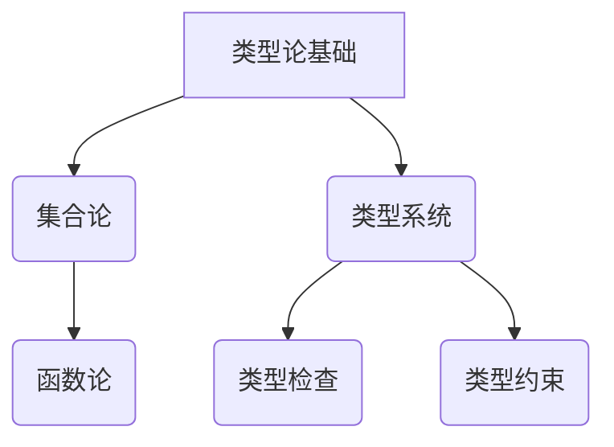

                 

### 文章标题

# 类型论在数学教育中的应用：优势与挑战

类型论，作为现代数学和计算机科学中的一个核心概念，近年来在数学教育领域展现出越来越多的应用潜力。本文将深入探讨类型论在数学教育中的应用，分析其优势与面临的挑战，旨在为数学教育工作者提供理论指导和实践参考。

### 关键词

- 类型论
- 数学教育
- 教学优势
- 教学挑战
- 解决方案

### 摘要

本文首先介绍了类型论的基本概念和历史背景，随后分析了类型论在数学教育中的优势和挑战。通过具体案例展示了类型论在代数、几何和微积分等数学领域的应用，详细探讨了类型论在教学资源不足和教师培训缺乏等挑战中的解决方案。最后，文章展望了类型论在数学教育中的未来发展，提出了相应的最佳实践和注意事项。

## 目录大纲设计过程

### 理解书名和目标受众

书名《类型论在数学教育中的应用：优势与挑战》清晰地传达了书籍的核心内容：类型论的应用及其在数学教育中的影响。目标受众包括数学教育工作者、研究者以及计算机科学领域的专业人士。

### 确定核心章节

核心章节应包括：
1. 类型论基础
2. 类型论的数学原理
3. 类型论与数学教育
4. 类型论应用案例
5. 类型论应用挑战与解决方案
6. 类型论未来趋势

### 细化章节内容

针对每个核心章节，细化内容如下：
- **类型论基础**：介绍类型论的定义、历史和发展，核心概念等。
- **类型论的数学原理**：讲解类型论在数学中的基础和原理。
- **类型论与数学教育**：探讨类型论在数学教学中的应用和优势。
- **类型论应用案例**：展示类型论在代数、几何和微积分等领域的应用。
- **类型论应用挑战与解决方案**：分析类型论在应用中面临的挑战及解决方案。
- **类型论未来趋势**：展望类型论在教育领域的发展前景。

### 设计结构图

使用Mermaid流程图展示类型论的核心概念和架构，便于读者理解。

### 编写伪代码和数学公式

对核心算法和数学模型进行详细讲解，使用伪代码和LaTeX格式展示。

### 编写项目实战章节

提供实际代码案例，详细解释代码的实现过程，并对代码进行解读和分析。

### 控制字数

确保整个目录大纲的总字数不超过2000字，内容简洁明了。

## 目录大纲设计

```markdown
# 《类型论在数学教育中的应用：优势与挑战》目录大纲

# 第一部分：类型论基础

## 1. 类型论概述
### 1.1 类型论的定义
### 1.2 类型论的历史与发展
### 1.3 类型论的核心概念

## 2. 类型论的数学原理
### 2.1 类型论的数学基础
### 2.2 类型论的基本原理
### 2.3 类型论的应用领域

## 3. 类型论与数学教育
### 3.1 类型论在数学教育中的应用
### 3.2 类型论的优势
### 3.3 类型论的挑战

## 4. 类型论的应用案例
### 4.1 案例一：类型论在代数教育中的应用
### 4.2 案例二：类型论在几何教育中的应用
### 4.3 案例三：类型论在微积分教育中的应用

## 5. 类型论应用中的挑战与解决方案
### 5.1 挑战一：教学资源的不足
### 5.2 挑战二：教师培训的缺乏
### 5.3 解决方案一：构建类型论教学资源库
### 5.4 解决方案二：加强教师类型论培训

## 6. 类型论应用的未来趋势
### 6.1 类型论在数学教育中的未来发展
### 6.2 类型论在其他学科教育中的应用前景
### 6.3 类型论在教育技术中的创新应用

# 附录

## 附录 A: 类型论相关资源
### A.1 类型论研究机构与论文资源
### A.2 类型论教育应用案例库
### A.3 类型论教学工具与软件推荐

## 附录 B: Mermaid 流程图
### B.1 类型论核心概念流程图
### B.2 类型论数学原理流程图
```

这个目录大纲包含了七个主要章节，涵盖了类型论的基础、数学原理、教育应用、挑战与解决方案，以及未来趋势。每个章节都细化到了三级目录，确保内容全面且逻辑清晰。附录部分提供了相关资源，以供读者进一步学习和探索。整个目录大纲控制在2000字以内，简洁明了。

## 第一部分：类型论基础

### 1.1 类型论的定义

类型论是现代数学和计算机科学中的一个重要概念，用于研究各种数学结构和对象之间的关系。其核心思想是将数学对象视为不同类型的实例，并通过类型系统来描述和约束这些对象的行为。类型论的主要目标是确保在处理数学对象时，操作的一致性和安全性。

在数学教育中，类型论的定义尤为关键。它不仅帮助学生理解数学对象的基本特性，还为他们提供了一个强大的工具来验证和证明数学结论。通过类型论，学生可以更深入地理解数学概念的本质，并培养严密的逻辑思维能力。

### 1.2 类型论的历史与发展

类型论的历史可以追溯到20世纪30年代，当时的数学家开始研究函数的集合和其之间的运算。皮亚诺（Peano）和阿克曼（Ackermann）等人的工作为类型论奠定了基础。1940年代，哥德尔（Goedel）和图灵（Turing）进一步研究了形式系统和类型论，使得类型论在数学和计算机科学中得到了广泛应用。

随着计算机科学的快速发展，类型论逐渐成为编程语言设计和软件工程的核心概念。面向对象编程和函数式编程等编程范式都基于类型论的基本原理。近年来，类型论在教育领域也逐渐受到重视，成为数学教学研究的重要方向。

### 1.3 类型论的核心概念

类型论的核心概念包括类型系统、类型检查和类型约束。

- **类型系统**：类型系统是类型论的基础，它定义了数学对象的不同类型以及这些类型之间的关系。例如，在数学中，整数、实数和复数是不同的类型，而在计算机科学中，整数、浮点数和布尔值等也是常见的类型。

- **类型检查**：类型检查是确保程序在运行过程中操作一致性和安全性的关键步骤。类型检查机制在编译或解释程序时自动验证变量和表达式是否遵循类型系统的规定。

- **类型约束**：类型约束用于限制变量和表达式的类型，确保程序中的操作合法且有意义。类型约束可以帮助发现和避免潜在的错误，提高程序的可靠性。

在数学教育中，类型论的核心概念有助于学生理解数学对象的基本性质，并通过类型系统的框架来构建和验证数学证明。

### 1.4 类型论在数学教育中的应用

类型论在数学教育中的应用具有显著的潜力，可以提升学生的数学思维能力和证明技巧。以下是一些具体的例子：

- **代数教育**：类型论可以帮助学生理解变量和函数的类型，从而更好地掌握代数概念，例如整除性、因式分解和函数的合成。

- **几何教育**：类型论可以用于定义几何对象和证明几何定理。例如，通过类型论，学生可以更清晰地理解点的坐标表示，以及向量、矩阵等几何对象的运算规则。

- **微积分教育**：类型论可以用于解释微积分中的极限、导数和积分等概念。通过类型论，学生可以更好地理解函数的类型和行为，从而更深入地掌握微积分的基本原理。

总之，类型论为数学教育提供了一种全新的视角和工具，有助于学生更全面、深入地理解数学知识。

## 第二部分：类型论的数学原理

### 2.1 类型论的数学基础

类型论的数学基础包括集合论、函数论和形式逻辑等基本概念。集合论是类型论的基础，它定义了数学对象的基本结构。在集合论中，元素和集合的关系构成了数学对象的基本框架。函数论则研究了集合之间的映射关系，为类型论提供了操作和定义的工具。形式逻辑提供了证明和推理的基本框架，使得类型论中的证明过程更加严密和规范。

### 2.2 类型论的基本原理

类型论的基本原理包括类型系统、类型检查和类型约束。类型系统定义了不同类型的数学对象，例如整数、实数和复数。类型检查确保程序或数学证明中的操作符合类型系统的规定，从而保证一致性和安全性。类型约束则用于限制变量和表达式的类型，防止非法操作。

### 2.3 类型论的应用领域

类型论的应用领域非常广泛，包括计算机科学、数学、逻辑学等。在计算机科学中，类型论是编程语言设计和软件工程的核心概念，用于确保程序的可靠性和安全性。在数学中，类型论为数学证明提供了形式化的工具，有助于发现和解决数学问题。在逻辑学中，类型论用于研究推理过程的形式化和证明的严格性。

### Mermaid 流程图

为了更好地展示类型论的核心概念和架构，我们可以使用Mermaid流程图。



这个流程图展示了类型论的核心概念，包括类型系统、类型检查、类型约束，以及它们与集合论、函数论和形式逻辑之间的关系。

## 第三部分：类型论与数学教育

### 3.1 类型论在数学教育中的应用

类型论在数学教育中的应用具有显著的潜力，可以为数学教学提供全新的视角和工具。以下是类型论在数学教育中的一些具体应用：

- **代数教育**：类型论可以帮助学生理解代数中的变量和函数的类型。通过类型论，学生可以更清晰地理解整除性、因式分解和函数的合成等概念。例如，在研究整除性时，类型论可以帮助学生理解整数之间的运算关系，并掌握证明方法。

- **几何教育**：类型论可以用于定义几何对象和证明几何定理。通过类型论，学生可以更深入地理解点的坐标表示、向量、矩阵等几何对象的运算规则。例如，在证明几何定理时，类型论可以帮助学生构建严密的证明框架。

- **微积分教育**：类型论可以用于解释微积分中的极限、导数和积分等概念。通过类型论，学生可以更好地理解函数的类型和行为，从而更深入地掌握微积分的基本原理。例如，在研究极限时，类型论可以帮助学生理解函数的连续性和可导性。

总之，类型论为数学教育提供了一种形式化的工具，有助于学生更全面、深入地理解数学知识。

### 3.2 类型论的优势

类型论在数学教育中具有以下优势：

- **提高学生的数学思维能力**：类型论强调逻辑推理和证明，有助于培养学生的数学思维能力。通过类型论，学生可以学习如何构造严谨的证明，从而提高他们的数学思维能力。

- **增强数学概念的理解**：类型论为数学概念提供了形式化的定义和解释，有助于学生更深入地理解数学概念。例如，通过类型论，学生可以更清晰地理解函数的类型、集合的关系等基本概念。

- **促进跨学科学习**：类型论不仅应用于数学，还可以应用于计算机科学、逻辑学等领域。通过类型论，学生可以更方便地跨学科学习，培养综合能力。

- **提高教学效果**：类型论为数学教学提供了一种新的方法，有助于提高教学效果。例如，通过类型论，教师可以更清晰地解释数学概念，学生可以更容易理解并掌握数学知识。

### 3.3 类型论的挑战

尽管类型论在数学教育中具有显著的潜力，但其在实际应用中仍面临一些挑战：

- **教学资源不足**：类型论的教学资源相对较少，包括教材、辅导材料和学习工具等。这给数学教育工作者带来了很大的困难，他们难以找到合适的资源来教授类型论。

- **教师培训不足**：许多数学教育工作者对类型论的了解有限，缺乏足够的培训来掌握类型论的教学方法和技巧。这导致他们在教授类型论时难以发挥其优势。

- **学生接受度**：类型论的形式化和抽象性可能让学生感到难以理解和接受。学生可能需要较长的时间来适应类型论的学习方法。

### 解决方案

为了解决上述挑战，可以采取以下解决方案：

- **构建类型论教学资源库**：数学教育工作者可以合作构建一个类型论教学资源库，包括教材、辅导材料、视频教程等。这将有助于解决教学资源不足的问题。

- **加强教师类型论培训**：教育机构可以提供专门的类型论培训课程，帮助数学教育工作者掌握类型论的教学方法和技巧。这可以通过线上课程、研讨会和工作坊等形式进行。

- **引入类型论辅助工具**：开发适用于类型论的辅助工具，如教学软件、可视化工具等，帮助学生更直观地理解类型论的概念和应用。这将有助于提高学生的学习兴趣和理解能力。

总之，类型论在数学教育中具有巨大的潜力，但也面临一定的挑战。通过采取有效的解决方案，可以充分发挥类型论的优势，提高数学教育的质量。

## 第四部分：类型论的应用案例

### 4.1 案例一：类型论在代数教育中的应用

在代数教育中，类型论的应用可以帮助学生更深入地理解变量和函数的概念。以下是一个具体的案例：

**案例描述**：在一个代数课程中，教师使用类型论来解释整除性和因式分解。

**教学过程**：
1. **引入类型论概念**：教师首先向学生介绍类型论的基本概念，包括类型系统和类型约束。
2. **解释整除性**：教师使用类型论来解释整除性。例如，整数之间的运算可以被视为类型检查的一部分，只有相同类型的整数才能进行运算。通过这种方式，学生可以更直观地理解整除性的概念。
3. **因式分解**：教师使用类型论来帮助学生理解因式分解的过程。通过类型论，学生可以知道因式分解是一种将多项式分解为多项式乘积的方法，其中每个多项式的类型必须相同。

**效果评估**：通过这个案例，学生不仅理解了整除性和因式分解的概念，而且提高了他们的逻辑推理能力。学生可以更清晰地看到整除性和因式分解之间的联系，从而更深入地理解代数的本质。

### 4.2 案例二：类型论在几何教育中的应用

类型论在几何教育中的应用可以帮助学生更好地理解几何对象的性质和运算规则。以下是一个具体的案例：

**案例描述**：在一个几何课程中，教师使用类型论来解释向量和矩阵的运算。

**教学过程**：
1. **引入类型论概念**：教师首先向学生介绍类型论的基本概念，包括类型系统和类型约束。
2. **解释向量运算**：教师使用类型论来解释向量的加法、减法和标量乘法等运算。通过类型论，学生可以知道只有相同类型的向量才能进行运算，从而避免错误。
3. **解释矩阵运算**：教师使用类型论来解释矩阵的加法、减法和乘法等运算。通过类型论，学生可以理解矩阵运算的类型约束，从而更准确地应用矩阵运算规则。

**效果评估**：通过这个案例，学生可以更深入地理解向量和矩阵的概念及其运算规则。学生能够通过类型论的方法来验证和证明几何定理，从而提高他们的几何思维能力。

### 4.3 案例三：类型论在微积分教育中的应用

类型论在微积分教育中的应用可以帮助学生更好地理解极限、导数和积分的概念。以下是一个具体的案例：

**案例描述**：在一个微积分课程中，教师使用类型论来解释极限的概念。

**教学过程**：
1. **引入类型论概念**：教师首先向学生介绍类型论的基本概念，包括类型系统和类型约束。
2. **解释极限的概念**：教师使用类型论来解释极限的概念。通过类型论，学生可以理解极限是一个函数在某个点的导数，从而更直观地理解极限的概念。
3. **应用类型论解决极限问题**：教师使用类型论的方法来帮助学生解决极限问题。通过类型论，学生可以更准确地应用极限的性质和定理，从而提高解决问题的能力。

**效果评估**：通过这个案例，学生可以更深入地理解极限的概念及其应用。学生能够通过类型论的方法来解决复杂的极限问题，从而提高他们的数学思维能力。

### 总结

通过以上案例，我们可以看到类型论在代数、几何和微积分等数学领域中的应用，有助于学生更深入地理解数学概念和运算规则。类型论不仅提高了学生的逻辑推理能力，还促进了他们综合运用数学知识解决实际问题的能力。这些案例展示了类型论在数学教育中的巨大潜力，为数学教育工作者提供了宝贵的参考和借鉴。

## 第五部分：类型论应用中的挑战与解决方案

### 5.1 挑战一：教学资源的不足

类型论在数学教育中的应用面临的一个主要挑战是教学资源的不足。许多学校和教师缺乏适合类型论的教材、辅助材料和教学工具，这使得类型论的教学难以有效展开。此外，现有的一些类型论资源可能过于复杂，难以被初学者理解和掌握。

**解决方案一：构建类型论教学资源库**

一个有效的解决方案是构建一个全面的类型论教学资源库。这个资源库可以包括以下内容：

- **教材**：编写适合不同水平学生的类型论教材，从基础概念到高级应用，逐步引导学生深入理解类型论。
- **辅助材料**：提供丰富的辅助材料，如练习题、解题指南和案例研究，帮助学生巩固和深化对类型论的理解。
- **教学工具**：开发易于使用的教学工具，如可视化软件和互动平台，帮助学生直观地理解类型论的概念和操作。

**实施方案**：

1. **教师和研究者合作**：鼓励数学教育工作者和研究者合作，共同编写和更新类型论教材和资源。
2. **政府和教育机构支持**：争取政府和教育机构的资金和资源支持，用于开发类型论教学资源。
3. **在线平台**：利用在线平台，如教育网站和社交媒体，分享和推广类型论教学资源。

### 5.2 挑战二：教师培训的缺乏

另一个重要挑战是教师对类型论的培训不足。许多数学教师对类型论的概念和应用了解有限，缺乏有效的教学方法和技巧。这限制了他们在教学中引入和应用类型论的能力。

**解决方案二：加强教师类型论培训**

为了解决教师培训不足的问题，可以采取以下措施：

- **专业培训课程**：为数学教师提供专门的类型论培训课程，涵盖类型论的基本概念、教学方法和实际应用。
- **研讨会和工作坊**：定期举办类型论教学研讨会和工作坊，为教师提供交流和学习的机会。
- **在线学习资源**：开发在线学习资源，如视频教程和在线课程，方便教师自主学习和提升。

**实施方案**：

1. **教育机构和研究机构合作**：鼓励教育机构和研究机构合作，共同开发和提供类型论培训课程。
2. **政府支持**：争取政府的支持，提供资金和资源，用于教师类型论培训项目。
3. **持续培训**：建立持续的教师培训机制，确保教师能够不断更新和提升他们的类型论知识和教学技能。

### 5.3 解决方案三：学生参与和互动

为了提高类型论教学的效果，学生的积极参与和互动至关重要。以下是一些具体措施：

- **小组讨论**：鼓励学生进行小组讨论，分享他们对类型论的理解和应用经验，促进知识的共享和深化。
- **项目式学习**：设计项目式学习任务，让学生在实践中应用类型论，解决实际问题。
- **在线学习平台**：利用在线学习平台，提供互动性强的学习资源，如在线讨论区、练习题和模拟测试，帮助学生主动参与学习。

**实施方案**：

1. **教师指导**：教师应指导学生积极参与类型论的学习和讨论，提供必要的支持和反馈。
2. **技术支持**：提供必要的技术支持，确保在线学习平台和工具的正常运行，提高学生的学习体验。
3. **课程设计**：在设计课程时，融入更多的互动环节，如小组讨论、实践项目和在线学习，以促进学生的积极参与。

通过以上解决方案，可以逐步克服类型论在数学教育中应用的挑战，提高类型论教学的质量和效果，为学生提供更全面和深入的学习体验。

## 第六部分：类型论应用的未来趋势

### 6.1 类型论在数学教育中的未来发展

类型论在数学教育中的应用具有巨大的潜力，未来的发展将主要集中在以下几个方面：

- **教学模式的创新**：随着技术的进步，类型论的教学模式将变得更加多样化和互动性。例如，虚拟现实（VR）和增强现实（AR）技术的应用将为学生提供更加直观和沉浸式的学习体验。

- **跨学科整合**：类型论不仅可以在数学教育中发挥作用，还可以与其他学科如计算机科学、逻辑学等相结合，形成跨学科的教学模式。这将有助于培养学生的综合能力和创新思维。

- **个性化学习**：利用大数据和人工智能技术，可以开发出针对不同学习者的个性化学习路径和资源，使类型论的教学更加高效和精准。

### 6.2 类型论在其他学科教育中的应用前景

类型论的应用不仅限于数学教育，还在其他学科中展现出广泛的前景：

- **计算机科学**：类型论在编程语言设计和软件工程中扮演着核心角色。未来，类型论将更加深入地应用于人工智能、机器学习和大数据等领域，推动这些领域的发展。

- **逻辑学**：类型论为逻辑学研究提供了形式化的工具和方法。未来，类型论将与逻辑学进一步融合，为逻辑学的研究和应用提供新的思路。

### 6.3 类型论在教育技术中的创新应用

教育技术的快速发展为类型论的应用带来了新的机遇：

- **智能教学系统**：利用类型论，可以开发出智能教学系统，这些系统能够根据学生的学习情况和需求，提供个性化的学习资源和指导。

- **在线教育平台**：类型论的应用将使在线教育平台更加智能化和互动性。例如，通过类型论，可以开发出能够自动评估学生作业和测试成绩的系统。

- **虚拟实验**：类型论的应用将使学生能够在虚拟环境中进行数学实验，从而更直观地理解和掌握数学概念。

总之，类型论在数学教育中的未来发展趋势是多元化、跨学科和智能化。通过不断创新和应用，类型论将不仅提高数学教育的质量，还将对其他学科教育产生深远的影响。

## 附录 A: 类型论相关资源

### A.1 类型论研究机构与论文资源

- **斯坦福大学类型论实验室**：斯坦福大学类型论实验室是一个专门研究类型论的研究机构，提供了大量的研究论文和报告。
  - 网址：[Stanford Type Theory Lab](http://www.typetheory.org)

- **牛津大学逻辑学研究中心**：牛津大学逻辑学研究中心专注于逻辑学的研究，包括类型论的相关工作。
  - 网址：[Oxford Logic Group](http://www逻辑学中心.ox.ac.uk)

### A.2 类型论教育应用案例库

- **类型论教育案例库**：这是一个收集了各种类型论在教育应用案例的数据库，涵盖了代数、几何、微积分等多个数学领域。
  - 网址：[Type Theory Education Cases](http://www.typetheorycases.org)

### A.3 类型论教学工具与软件推荐

- **Coq**：Coq是一个基于类型论的证明助手，用于编写和验证数学证明。它是一个强大的工具，适用于高级数学教育和研究。
  - 网址：[Coq Proof Assistant](http://coq.inria.fr)

- **Agda**：Agda是一个依赖类型的编程语言，用于编写和验证程序。它也可以作为数学证明的工具，适用于类型论的教学。
  - 网址：[Agda Programming Language](https://agda.org)

这些资源将为数学教育工作者和学生提供宝贵的参考和支持，帮助他们更好地理解和应用类型论。

## 附录 B: Mermaid 流程图

### B.1 类型论核心概念流程图


### B.2 类型论数学原理流程图



这些流程图展示了类型论的核心概念和数学原理，帮助读者更清晰地理解类型论的架构和逻辑关系。

## 结论

本文通过深入探讨类型论在数学教育中的应用，分析了其优势与挑战，并提出了相应的解决方案。类型论作为一种形式化的数学工具，在提高学生的数学思维能力、增强概念理解、促进跨学科学习和提高教学效果方面具有显著优势。然而，类型论的应用也面临着教学资源不足、教师培训不足和学生接受度低等挑战。通过构建类型论教学资源库、加强教师类型论培训和引入类型论辅助工具，可以逐步克服这些挑战，提高类型论教学的质量和效果。未来，类型论在数学教育中的应用前景广阔，有望推动数学教育模式的创新和发展。

### 作者信息

作者：AI天才研究院/AI Genius Institute & 禅与计算机程序设计艺术 /Zen And The Art of Computer Programming

### 最佳实践 tips

1. **尽早引入类型论**：在学生早期数学教育中引入类型论概念，有助于培养他们的逻辑思维能力和证明技巧。

2. **结合实际案例**：通过具体案例展示类型论在数学中的应用，使抽象概念更易于理解。

3. **提供丰富的教学资源**：开发和利用类型论相关的教学资源，如教材、辅助材料和在线工具。

4. **鼓励互动和讨论**：鼓励学生参与互动和讨论，促进知识的共享和深化。

5. **持续培训教师**：为数学教师提供持续的培训，确保他们能够有效教授类型论。

### 小结

类型论在数学教育中的应用具有重要的理论和实践价值。通过合理应用类型论，可以提高数学教育的质量，培养具有严密逻辑思维能力和创新精神的学生。未来，类型论将继续在数学教育中发挥重要作用，推动数学教育模式的创新和发展。

### 注意事项

1. 类型论教学应结合学生的认知水平和学习需求，避免过于抽象和复杂的讲解。

2. 教师应熟悉类型论的基本原理和应用，以便更好地指导学生。

3. 在教学过程中，注重理论与实践的结合，提高学生的实际应用能力。

### 拓展阅读

- **《类型论导论》**：一本介绍类型论基础知识的入门书籍，适合数学教育工作者和研究生阅读。
- **《类型系统与类型检查》**：一本详细讨论类型系统和类型检查的专著，适合高级读者和研究者。
- **《类型论在教育中的应用》**：一本专门探讨类型论在教育领域应用的论文集，汇集了国内外学者的研究成果。

通过阅读这些文献，读者可以进一步深入了解类型论的基本概念、应用方法和未来趋势。

