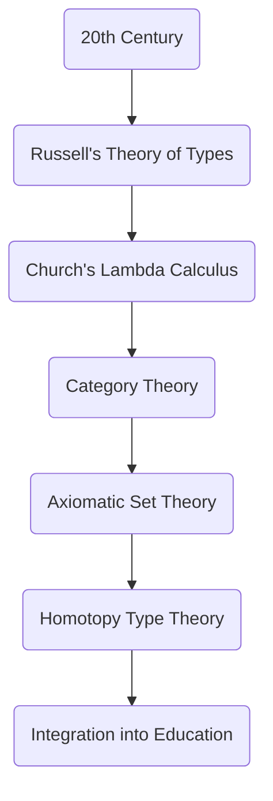
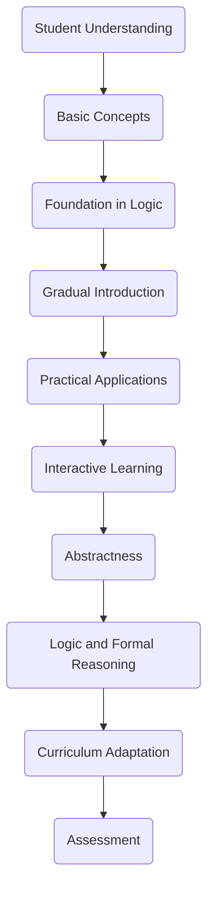
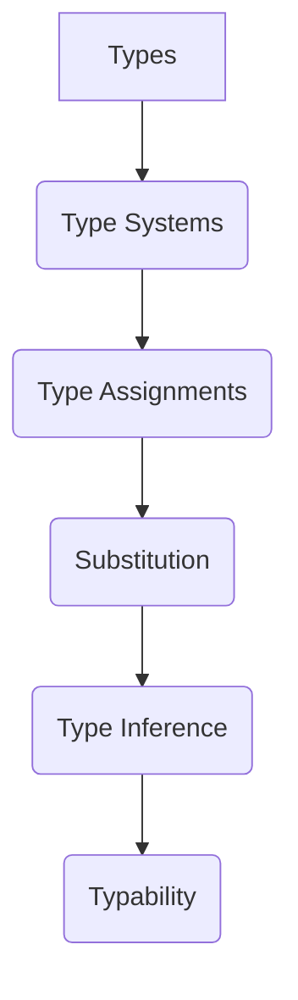
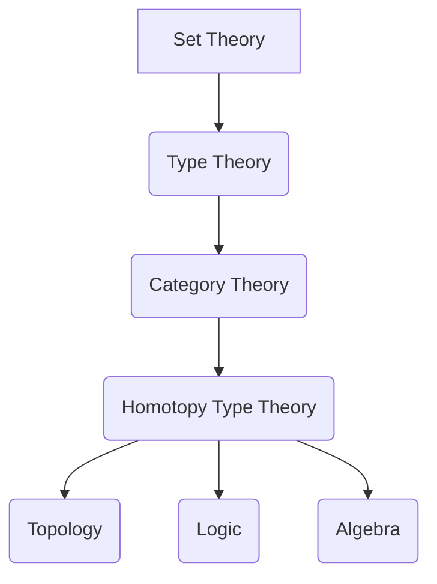
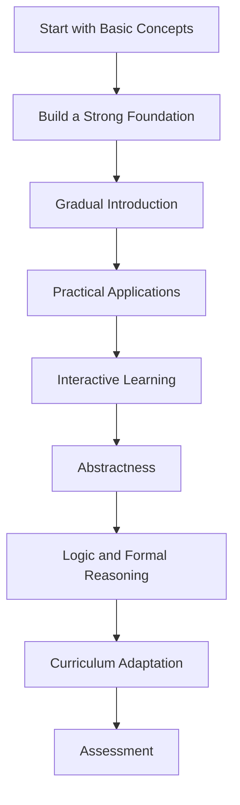
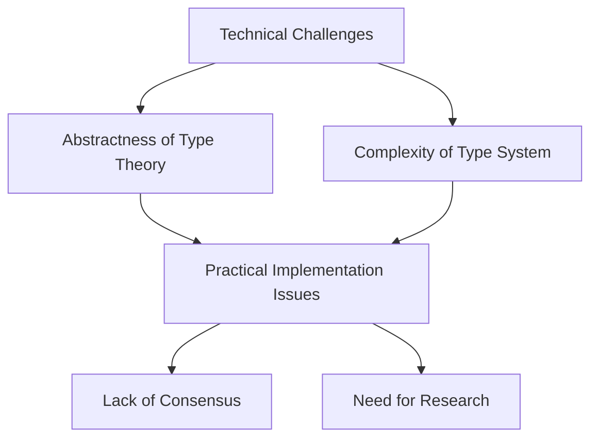
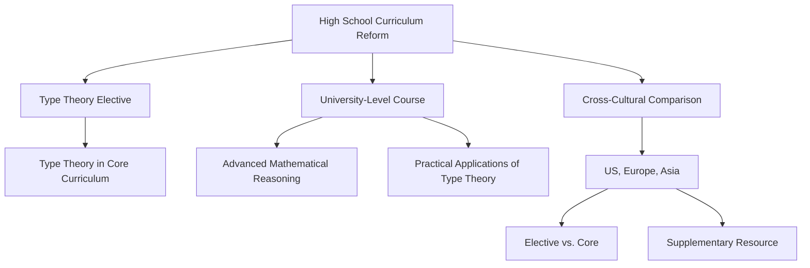
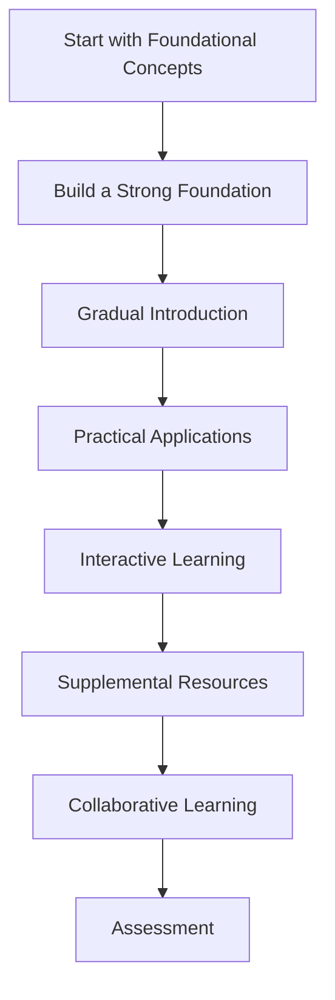
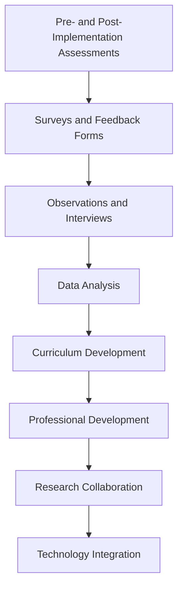

                 

### Introduction to the Book and Context

#### 1.1 Introduction to the Book

**Rationale for Mathematics Education Reform**

Mathematics education has traditionally been a cornerstone of intellectual development, equipping students with critical thinking skills and logical reasoning abilities. However, as the world becomes increasingly complex, the need for a more flexible and adaptive approach to mathematics education has become evident. The traditional methods, often focused on rote memorization and abstract problem-solving, are no longer sufficient to prepare students for the challenges of the 21st century.

The rationale for mathematics education reform stems from several key factors. Firstly, there is a growing recognition of the need to foster creativity and innovation in students. Traditional mathematics education often stifles these qualities by emphasizing routine and repetitive tasks. Secondly, there is an increasing demand for interdisciplinary knowledge, where students need to understand the interconnectedness of different subjects. Mathematics plays a crucial role in bridging these disciplines. Lastly, the rapid advancement of technology has changed the landscape of education, requiring new pedagogical approaches that integrate digital tools and resources.

**The Role of Type Theory in Reform**

Type theory offers a promising avenue for mathematics education reform. At its core, type theory is a framework that classifies mathematical entities into different types based on their properties and relationships. This classification system provides a structured approach to understanding mathematical concepts, making them more accessible and intuitive for students.

One of the key advantages of type theory is its ability to formalize and clarify mathematical concepts. By defining types and their interactions, type theory can help students grasp complex ideas more easily. For example, in set theory, the concept of a function can be defined more precisely using type theory, thereby eliminating ambiguity and providing a clearer understanding of the concept.

Furthermore, type theory promotes a more structured and logical approach to mathematics. Traditional mathematics often relies on intuition and abstract reasoning, which can be challenging for some students. Type theory provides a set of rules and principles that guide mathematical reasoning, making it more systematic and less reliant on personal intuition.

**Structure and Purpose of the Book**

This book aims to explore the integration of type theory into mathematics education reform. It is structured to provide a comprehensive overview of the topic, starting from the foundational concepts of type theory and gradually building up to its applications in mathematics education.

The book is divided into several chapters, each addressing different aspects of type theory and its role in education. Chapter 1 introduces the book's context and rationale for reform. Chapter 2 provides a detailed explanation of the foundational concepts of type theory. Chapter 3 discusses the integration of type theory into mathematics education, exploring teaching approaches and strategies. Chapter 4 addresses the challenges and controversies surrounding the implementation of type theory in education. Chapter 5 presents case studies of mathematics education reform that incorporate type theory. Chapter 6 provides practical methods for implementing type theory in education. Finally, Chapter 7 evaluates the outcomes of type theory in education and discusses future directions.

Through this structured approach, the book aims to provide a thorough understanding of type theory and its potential to transform mathematics education.

#### 1.2 Historical Context of Type Theory

**Early Development of Type Theory**

The origins of type theory can be traced back to the early 20th century, with significant contributions from pioneers such as Bertrand Russell and Alonzo Church. Russell's work on the foundations of mathematics, particularly his development of the theory of types, was a pivotal moment in the evolution of type theory. Russell's theory aimed to avoid the paradoxes that plagued naive set theory, by introducing a hierarchy of types to prevent the formation of self-referential entities.

Alonzo Church, in his lambda calculus, provided another foundational approach to type theory. Church's lambda calculus is a formal system for representing computable functions, where types are used to ensure the well-formedness of expressions. This approach has had a lasting impact on computer science and has been instrumental in the development of type systems in programming languages.

**Evolution of Type Theory in Mathematics**

Over the decades, type theory has evolved and integrated into various branches of mathematics. Category theory, for example, has been significantly influenced by type theory. Category theory provides a framework for understanding structures and their relationships, and it often uses type-theoretic concepts to define and analyze these structures.

In set theory, type theory has been used to address some of the foundational issues that arose from naive set theory. The development of axiomatic set theory, particularly Zermelo-Fraenkel set theory (ZF), incorporated type-theoretic ideas to provide a more robust and consistent foundation for mathematics.

The evolution of homotopy type theory (HTT) represents a more recent development in type theory. HTT combines ideas from type theory with homotopy theory, offering a new foundation for mathematics that is both intuitive and formal. HTT has been influential in areas such as topology, logic, and computer science, providing new tools and perspectives for mathematical research.

**Challenges in Integrating Type Theory into Education**

Despite its potential, integrating type theory into mathematics education comes with several challenges. One of the main challenges is the complexity of type theory itself. Type theory involves abstract concepts and formal systems that can be difficult for students to grasp, particularly if they are not familiar with logic and formal reasoning.

Another challenge is the existing curriculum and pedagogical methods. Traditional mathematics education often emphasizes abstract and symbolic manipulation, which can be at odds with the more intuitive and structural approach of type theory. Adapting existing teaching materials and methods to incorporate type theory requires significant effort and careful planning.

Moreover, there is a lack of consensus on the best ways to introduce type theory into the classroom. Educators and researchers are exploring various strategies, from introducing type theory as an elective course to integrating it into existing math curriculum. However, there is no one-size-fits-all solution, and the effectiveness of these approaches varies depending on the context and the specific goals of the education reform.

**Mermaid Diagram: Historical Evolution of Type Theory**

Below is a Mermaid diagram illustrating the historical evolution of type theory:

This diagram provides a visual representation of the key developments in type theory, from its early origins to its current applications in mathematics and education. It highlights the interconnectedness of these concepts and their evolution over time.

#### 1.3 Type Theory and Mathematics Education

**Introducing Type Theory in the Classroom**

Introducing type theory into the classroom requires a thoughtful approach to ensure that students can grasp the concepts and appreciate their value. Here are some strategies for effectively introducing type theory:

1. **Start with Basic Concepts**: Begin by introducing fundamental concepts such as types, terms, and typing rules. Use concrete examples to illustrate these concepts, making them more tangible for students.

2. **Build a Strong Foundation**: Type theory builds upon foundational concepts from logic and set theory. Ensure that students have a solid understanding of these concepts before diving into type theory.

3. **Gradual Introduction**: Introduce type theory gradually, starting with simpler concepts and gradually building up to more complex ideas. This helps students build a strong foundation and understand how different concepts are related.

4. **Practical Applications**: Illustrate the practical applications of type theory in mathematics and computer science. For example, explain how type theory is used in the development of programming languages and in the formal verification of software systems.

5. **Interactive Learning**: Use interactive tools and visualizations to help students understand the abstract concepts of type theory. Mermaid diagrams and interactive simulations can be particularly useful in visualizing type systems and their behavior.

**Challenges and Solutions**

Integrating type theory into mathematics education poses several challenges:

1. **Abstractness**: Type theory is inherently abstract, which can be difficult for students to grasp. To address this, use intuitive examples and analogies to bridge the gap between abstract concepts and real-world applications.

2. **Logic and Formal Reasoning**: Type theory requires a strong foundation in logic and formal reasoning. Students may need additional support to develop these skills. Offer supplemental materials and tutoring sessions to help students build these foundational skills.

3. **Curriculum Adaptation**: Adapting existing mathematics curricula to include type theory requires careful planning and coordination. Collaborate with educators and administrators to develop a coherent and effective integration plan.

4. **Assessment**: Developing appropriate assessment methods to evaluate students' understanding of type theory can be challenging. Use a mix of traditional tests and project-based assessments to provide a comprehensive evaluation of students' knowledge and skills.

**Mermaid Diagram: Type Theory in Mathematics Education**

The following Mermaid diagram illustrates the integration of type theory into mathematics education:

This diagram highlights the key steps and challenges in integrating type theory into mathematics education, from building a strong foundation to assessing student understanding.

### Foundations of Type Theory

#### 2.1 Core Concepts and Principles

**Types and Type Systems**

At the heart of type theory is the concept of types, which classify mathematical entities based on their properties and relationships. Types provide a framework for organizing and reasoning about mathematical structures, making it easier to understand and analyze complex concepts.

A type system is a set of rules and conventions that define how types can be used and combined in a formal system. These rules ensure that mathematical expressions are well-formed and meaningful. In type theory, every expression is associated with a type, and the type system enforces this association through typing rules.

**Type Assignments and Substitutions**

Type assignments are the process of associating types with mathematical entities. For example, in a type system for arithmetic expressions, the number `5` might be assigned the type `Nat`, representing natural numbers. Similarly, the variable `x` might be assigned the type `Int`, representing integers.

Substitution is a fundamental operation in type theory, allowing types to be replaced with other types under certain conditions. This operation is crucial for ensuring that mathematical expressions remain well-typed after modifications. For example, if `x` is of type `Int`, substituting `x` with `5` in an expression maintains the type of the expression as `Int`.

**Type Inference and Typability**

Type inference is the process of automatically determining the type of an expression based on its context and the rules of the type system. This is in contrast to explicit type declarations, where the type of an expression is explicitly specified by the programmer.

Typability is a decision problem in type theory, which asks whether a given expression can be assigned a type according to the rules of the type system. Type inference and typability are closely related and are fundamental to the practical application of type theory in programming languages and formal verification.

**Mermaid Diagram: Core Concepts of Type Theory**

Below is a Mermaid diagram illustrating the core concepts of type theory:

This diagram provides a visual representation of the key concepts and relationships in type theory, highlighting the interplay between types, type systems, and typing rules.

#### 2.2 Type Theory in Mathematics

**Type Theory and Set Theory**

Type theory and set theory are two fundamental frameworks for organizing and understanding mathematical structures. While they share some similarities, they also have significant differences that make each framework valuable in its own right.

In set theory, mathematical entities are represented as sets, which are collections of distinct objects. Sets are defined by their members, and the relationship between sets is defined by set operations such as union, intersection, and complement. Set theory provides a powerful framework for understanding and manipulating collections of objects, making it an essential tool in many areas of mathematics.

Type theory, on the other hand, classifies mathematical entities into different types based on their properties and relationships. Types are used to define the structure and behavior of mathematical objects, ensuring that expressions are well-formed and meaningful. Type theory provides a more abstract and formal approach to mathematics, which can help clarify complex concepts and highlight underlying patterns.

**Type Theory and Category Theory**

Category theory is another mathematical framework that has been significantly influenced by type theory. Category theory provides a general language for describing and analyzing mathematical structures, focusing on the relationships between objects and the mappings between them.

Type theory has been instrumental in the development of category theory. Category theory often uses type-theoretic concepts to define and analyze categories, functors, and natural transformations. Type theory provides a structured approach to understanding categories, making it easier to reason about and manipulate these mathematical structures.

**Applications of Type Theory in Mathematics**

Type theory has found numerous applications in various branches of mathematics, including topology, logic, and algebra. Here are a few examples:

1. **Homotopy Type Theory (HTT)**: HTT combines ideas from type theory and homotopy theory to offer a new foundation for mathematics. HTT provides a framework for understanding and formalizing concepts from topology, allowing mathematicians to explore new areas of research and provide rigorous proofs for existing theorems.

2. **Formal Verification**: Type theory has been used in formal verification, a process that ensures the correctness of software systems by constructing formal proofs. By using type theory, developers can verify that their code adheres to specified properties and requirements, reducing the likelihood of errors and bugs.

3. **Computer Science**: Type theory is a fundamental concept in computer science, where it is used to define the structure and behavior of programming languages. Type systems in programming languages are based on type theory, ensuring that programs are well-formed and preventing certain classes of errors.

**Mermaid Diagram: Type Theory in Mathematics**

The following Mermaid diagram provides a visual representation of the applications of type theory in mathematics:

This diagram illustrates the interconnectedness of type theory with other mathematical frameworks and its diverse applications across different areas of mathematics.

### Type Theory in Mathematics Education

#### 3.1 Teaching Approaches and Strategies

**Traditional Mathematics Education Methods**

Traditional mathematics education methods have long been the cornerstone of teaching mathematical concepts to students. These methods emphasize rote memorization, abstract problem-solving, and a focus on mathematical symbols and notation. Teachers typically present mathematical concepts in a sequential and hierarchical manner, building on previously learned concepts to introduce new ideas.

One of the key features of traditional mathematics education is the use of textbooks and worksheets that contain exercises designed to reinforce concepts through practice. These exercises often involve solving problems that require applying mathematical principles to real-world scenarios or abstract problems. Traditional education also relies heavily on quizzes and tests to assess students' understanding of the material.

**Introducing Type Theory in the Classroom**

Introducing type theory into the traditional mathematics classroom requires a thoughtful approach to ensure that students can grasp the concepts and appreciate their value. Here are some strategies for effectively introducing type theory:

1. **Start with Basic Concepts**: Begin by introducing fundamental concepts such as types, terms, and typing rules. Use concrete examples to illustrate these concepts, making them more tangible for students.

2. **Build a Strong Foundation**: Type theory builds upon foundational concepts from logic and set theory. Ensure that students have a solid understanding of these concepts before diving into type theory.

3. **Gradual Introduction**: Introduce type theory gradually, starting with simpler concepts and gradually building up to more complex ideas. This helps students build a strong foundation and understand how different concepts are related.

4. **Practical Applications**: Illustrate the practical applications of type theory in mathematics and computer science. For example, explain how type theory is used in the development of programming languages and in the formal verification of software systems.

5. **Interactive Learning**: Use interactive tools and visualizations to help students understand the abstract concepts of type theory. Mermaid diagrams and interactive simulations can be particularly useful in visualizing type systems and their behavior.

**Challenges in Teaching Type Theory**

Teaching type theory presents several challenges that educators must address to ensure students can successfully learn and apply the concepts:

1. **Abstractness**: Type theory is inherently abstract, which can be difficult for students to grasp. To address this, use intuitive examples and analogies to bridge the gap between abstract concepts and real-world applications.

2. **Logic and Formal Reasoning**: Type theory requires a strong foundation in logic and formal reasoning. Students may need additional support to develop these skills. Offer supplemental materials and tutoring sessions to help students build these foundational skills.

3. **Curriculum Adaptation**: Adapting existing mathematics curricula to include type theory requires careful planning and coordination. Collaborate with educators and administrators to develop a coherent and effective integration plan.

4. **Assessment**: Developing appropriate assessment methods to evaluate students' understanding of type theory can be challenging. Use a mix of traditional tests and project-based assessments to provide a comprehensive evaluation of students' knowledge and skills.

**Mermaid Diagram: Teaching Type Theory**

The following Mermaid diagram illustrates the key steps and challenges in teaching type theory:

This diagram provides a visual representation of the strategies and challenges involved in teaching type theory in a mathematics classroom.

### Challenges and Controversies in Type Theory Integration

**Technical Challenges**

Integrating type theory into mathematics education comes with several technical challenges that need to be addressed to ensure the successful implementation of this approach. One of the primary technical challenges is the abstract nature of type theory. Type theory is built on a foundation of logic and formal reasoning, which can be difficult for students who are not familiar with these concepts. The abstractness of type theory requires educators to develop teaching materials and strategies that can make these concepts more accessible and intuitive for students.

Another technical challenge is the complexity of the type system itself. Type theory involves a set of rules and principles that govern how types are defined, assigned, and manipulated. These rules can be intricate and may require significant cognitive effort to understand and apply. Educators must design curricula that gradually introduce these concepts, providing students with the necessary background knowledge and skills to grasp the complexity of type theory.

**Practical Implementation Issues**

Practical implementation issues also pose significant challenges in integrating type theory into mathematics education. One of the key issues is the existing curriculum and pedagogical methods. Traditional mathematics education methods, which emphasize abstract problem-solving and symbolic manipulation, may not align well with the more structured and logical approach of type theory. This misalignment requires educators to rethink and adapt their teaching strategies to integrate type theory seamlessly into the existing curriculum.

Moreover, the availability of suitable teaching materials and resources is another practical concern. While there are resources available for teaching type theory, these resources may not be comprehensive or tailored to the specific needs of mathematics education. Developing and curating high-quality teaching materials that cater to the unique requirements of type theory in education is essential for its successful implementation.

**Lack of Consensus**

A lack of consensus among educators and researchers about the best ways to introduce type theory into the classroom further complicates its integration into mathematics education. There are varying opinions on the optimal approaches for teaching type theory, ranging from introducing it as an elective course to gradually integrating it into the core mathematics curriculum. This lack of consensus can lead to fragmented and inconsistent implementations, making it difficult to evaluate the effectiveness of type theory in education.

Additionally, there is a need for research to establish the long-term impact of type theory on students' mathematical understanding and skills. Without comprehensive and empirical research, it is challenging to make informed decisions about the best ways to implement type theory in education.

**Mermaid Diagram: Challenges and Controversies in Type Theory Integration**

The following Mermaid diagram provides a visual representation of the challenges and controversies in integrating type theory into mathematics education:

This diagram illustrates the interconnectedness of the challenges and controversies in integrating type theory into mathematics education, highlighting the technical, practical, and consensus-related issues that need to be addressed.

### Case Studies in Mathematics Education Reform

**Case Study 1: Implementing Type Theory in a High School Mathematics Curriculum**

One notable example of integrating type theory into mathematics education is a high school mathematics curriculum reform implemented in a school in the United States. The goal of this reform was to enhance students' understanding of mathematical concepts and improve their logical reasoning skills through the introduction of type theory.

The implementation began with a pilot program in which type theory was introduced as an elective course. The curriculum included modules on basic type theory concepts, such as types, terms, and typing rules. Students were also exposed to practical applications of type theory in areas such as set theory and algebra.

The pilot program was well-received by both students and teachers. Students reported that the structured approach of type theory made it easier for them to understand complex mathematical concepts. Teachers noted that the program helped students develop better logical reasoning skills and a deeper understanding of the underlying principles of mathematics.

Building on the success of the pilot program, the school expanded the integration of type theory into the core mathematics curriculum. Type theory concepts were gradually introduced in various courses, starting with algebra and progressing to more advanced topics such as calculus and geometry. The implementation required significant collaboration between mathematics educators and curriculum developers to ensure that the type theory content was appropriately integrated into the existing curriculum.

**Case Study 2: Using Type Theory in a University-Level Mathematics Course**

Another example of using type theory in mathematics education is a university-level mathematics course offered by a renowned institution in Europe. The course, titled "Advanced Mathematical Reasoning," aimed to equip students with the skills necessary for rigorous mathematical research and proof writing.

Type theory was integrated into the course as a foundational concept, providing students with a structured approach to understanding and constructing mathematical proofs. The course included modules on basic type theory concepts, such as types, terms, and type inference.

The course also incorporated practical applications of type theory in areas such as category theory and homotopy theory. Students were encouraged to use type theory to analyze and solve problems in these advanced mathematical domains.

The course was well-received by students, who appreciated the structured and logical approach that type theory provided to mathematical reasoning. Faculty members noted that students who had taken the course demonstrated improved abilities in mathematical proof writing and logical reasoning.

**Case Study 3: A Cross-Cultural Comparison of Type Theory Integration**

A cross-cultural comparison study was conducted to examine the integration of type theory in mathematics education in different educational systems. The study involved schools in the United States, Europe, and Asia.

The results of the study indicated that type theory can be successfully integrated into mathematics education across different cultures and educational systems. However, the study also highlighted some differences in the approaches taken by different schools.

For example, in the United States, type theory was more commonly introduced as an elective course, while in Europe, it was more frequently integrated into core mathematics curriculum. In Asia, type theory was often incorporated as a supplementary resource to support students' understanding of advanced mathematical concepts.

The study also found that student engagement and success with type theory varied depending on the educational context. Factors such as cultural attitudes towards mathematics, the existing curriculum structure, and the availability of resources all played a role in determining the effectiveness of type theory integration.

**Mermaid Diagram: Case Studies in Mathematics Education Reform**

The following Mermaid diagram provides a visual representation of the key findings from the case studies on integrating type theory into mathematics education:

This diagram illustrates the various approaches to integrating type theory in mathematics education across different contexts and highlights the similarities and differences in these approaches.

### Methods for Implementing Type Theory in Education

**Practical Steps for Integrating Type Theory into the Classroom**

Integrating type theory into mathematics education requires a strategic and thoughtful approach to ensure that students can effectively learn and apply the concepts. Here are some practical steps for implementing type theory in the classroom:

1. **Start with Foundational Concepts**: Begin by introducing foundational concepts such as types, terms, and typing rules. Use concrete examples to illustrate these concepts, making them more tangible for students. Ensure that students have a solid understanding of these concepts before moving on to more complex ideas.

2. **Build a Strong Foundation**: Type theory builds upon foundational concepts from logic and set theory. Ensure that students have a strong grasp of these concepts before introducing type theory. This foundational knowledge will help students better understand and apply type theory.

3. **Gradual Introduction**: Introduce type theory gradually, starting with simpler concepts and gradually building up to more complex ideas. This approach helps students build a strong foundation and understand how different concepts are related. For example, start with basic type systems and gradually introduce more advanced concepts such as dependent types.

4. **Practical Applications**: Illustrate the practical applications of type theory in mathematics and computer science. For example, explain how type theory is used in the development of programming languages and in the formal verification of software systems. Practical applications help students see the relevance and value of type theory in real-world contexts.

5. **Interactive Learning**: Use interactive tools and visualizations to help students understand the abstract concepts of type theory. Mermaid diagrams and interactive simulations can be particularly useful in visualizing type systems and their behavior. Interactive learning engages students and helps them grasp complex concepts more easily.

6. **Supplemental Resources**: Provide supplemental resources such as textbooks, online tutorials, and video lectures to support students' learning. These resources can provide additional explanations and examples, helping students reinforce their understanding of type theory.

7. **Collaborative Learning**: Encourage collaborative learning activities such as group discussions and problem-solving sessions. Collaborative learning helps students develop their logical reasoning skills and provides opportunities for them to learn from each other.

8. **Assessment**: Develop appropriate assessment methods to evaluate students' understanding of type theory. Use a mix of traditional tests and project-based assessments to provide a comprehensive evaluation of students' knowledge and skills.

**Mermaid Diagram: Methods for Implementing Type Theory in Education**

The following Mermaid diagram provides a visual representation of the practical steps for implementing type theory in education:

This diagram illustrates the key steps and strategies for successfully integrating type theory into mathematics education.

### Outcome Evaluation and Future Directions

**Evaluating the Impact of Type Theory Integration**

Evaluating the impact of integrating type theory into mathematics education is crucial for understanding its effectiveness and informing future practices. Several key metrics can be used to assess the outcomes of type theory integration:

1. **Academic Performance**: One of the primary indicators of the success of type theory integration is students' academic performance. Assessments such as standardized tests, quizzes, and final exams can provide insights into students' understanding of mathematical concepts and their ability to apply type theory principles.

2. **Logical Reasoning Skills**: Type theory is designed to enhance logical reasoning skills. Evaluating students' logical reasoning abilities through problem-solving tasks, proof writing assignments, and critical thinking exercises can help measure the development of these skills.

3. **Engagement and Motivation**: Student engagement and motivation are vital for successful learning. Surveys and feedback forms can be used to gather data on students' perceptions of type theory and its integration into the curriculum.

4. **Long-Term Effects**: Longitudinal studies can provide insights into the long-term impact of type theory integration on students' mathematical abilities and their career paths.

**Data Collection and Analysis**

To evaluate the impact of type theory integration, data must be collected systematically and analyzed rigorously. Here are some steps for effective data collection and analysis:

1. **Pre- and Post-Implementation Assessments**: Administer pre-implementation assessments to establish a baseline of students' mathematical abilities and logical reasoning skills. Follow up with post-implementation assessments to measure changes over time.

2. **Surveys and Feedback Forms**: Collect qualitative data through surveys and feedback forms to gain insights into students' experiences with type theory and their perceptions of its effectiveness.

3. **Observations and Interviews**: Observations and interviews with educators can provide valuable insights into the challenges and successes of implementing type theory in the classroom.

4. **Data Analysis**: Analyze the collected data using statistical methods to identify trends and correlations. This analysis can help identify areas of success and areas that may require further improvement.

**Future Directions for Research and Practice**

Based on the evaluation outcomes, several future directions can be identified for the integration of type theory into mathematics education:

1. **Curriculum Development**: Continue to develop and refine type-theoretic curriculum materials that are accessible and engaging for students. This includes integrating type theory into existing mathematics courses and creating specialized courses that focus on type theory.

2. **Professional Development**: Provide professional development opportunities for educators to enhance their understanding of type theory and its applications in mathematics education. This can include workshops, conferences, and online courses.

3. **Research Collaboration**: Foster collaboration between mathematicians, computer scientists, and educators to explore the potential of type theory in various educational contexts and to develop innovative teaching methods.

4. **Technology Integration**: Leverage technology to enhance the learning experience. Develop interactive tools, simulations, and digital resources that can help students visualize and understand type theory concepts more effectively.

**Mermaid Diagram: Outcome Evaluation and Future Directions**

The following Mermaid diagram provides a visual representation of the evaluation process and future directions for type theory integration in mathematics education:

This diagram highlights the key steps in evaluating the impact of type theory integration and outlines potential future directions for research and practice.

