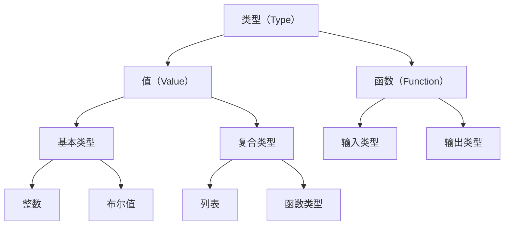

                 


### 整体结构设计

为了撰写一篇深入浅出、逻辑严密、结构完整的《类型论在数学概念形成中的局限性分析》技术博客文章，我们需要遵循以下步骤来设计整体结构：

**一、文章开头**

1. **文章标题**：明确指出文章的核心内容和目的，例如：“类型论在数学概念形成中的局限性分析”。
2. **文章关键词**：列出5-7个与文章主题密切相关的关键词，如“类型论”、“数学”、“概念形成”、“局限性”、“算法”等。
3. **文章摘要**：简洁地概括文章的主要内容、观点和结论，让读者在阅读前对文章有一个总体了解。

**二、文章主体**

文章主体部分按照以下章节结构展开：

#### 1. 背景介绍

- **数学与类型论的历史背景**：简要介绍数学和类型论的发展历程，强调类型论在数学中的重要地位。
- **类型论的基本概念**：定义类型论中的核心概念，如类型、值、函数等，并解释这些概念在数学中的应用。

#### 2. 核心概念与联系

- **核心概念解释**：详细阐述类型论中的基本概念，并解释它们之间的关系。
- **类型论在数学中的体现**：探讨类型论如何影响数学概念的形成和发展，以及其在不同数学领域中的应用。
- **Mermaid 流程图**：绘制一个流程图，展示类型论核心概念之间的相互关系，增强文章的可视化效果。

#### 3. 核心算法原理讲解

- **类型判断算法**：讲解类型判断算法的基本原理，使用伪代码详细描述算法过程。
- **类型转换算法**：解释类型转换算法的工作原理，并给出伪代码示例。
- **类型安全检查**：阐述类型安全检查的重要性，以及如何实现类型安全检查。

#### 4. 数学模型和数学公式

- **类型论中的基本公式**：列出类型论中的关键公式，使用 LaTeX 格式进行排版，并解释这些公式的含义。
- **数学概念中的类型论问题**：讨论类型论在数学概念中的应用，给出具体的数学公式和例子。

#### 5. 项目实战

- **项目背景**：介绍项目的背景和需求，说明类型论在项目中的应用。
- **开发环境搭建**：详细描述项目的开发环境搭建过程，包括所需的工具和软件。
- **源代码详细实现**：展示项目的源代码实现，并对关键代码进行解读。
- **代码解读与分析**：对代码进行分析，解释代码如何实现类型论的相关概念。
- **实际案例分析和详细讲解剖析**：通过实际案例，展示类型论在项目中的应用效果，并进行详细分析。

#### 6. 最佳实践 tips、小结、注意事项、拓展阅读等内容

- **最佳实践 tips**：总结项目实战中的经验和教训，提供一些建议和最佳实践。
- **小结**：总结文章的主要观点和结论，强调类型论在数学概念形成中的局限性。
- **注意事项**：提醒读者在应用类型论时需要注意的问题。
- **拓展阅读**：推荐一些相关的书籍、文章和资源，帮助读者进一步深入了解类型论。

**三、文章结尾**

- **作者信息**：在文章末尾附上作者信息，包括作者的单位、职务和联系方式，以增强文章的可信度。

### 字数控制

根据文章结构的细致设计，确保文章总字数在8000～12000字之间。在撰写过程中，注意每个章节的内容要详实具体，深入浅出，确保文章的完整性、逻辑性和可读性。

通过以上步骤，我们将撰写一篇高质量的技术博客文章，全面分析类型论在数学概念形成中的局限性，为读者提供有价值的见解和启示。接下来，我们将逐一细化每个章节的内容，确保文章的完整性和深度。让我们开始撰写吧！### 文章标题

# 《类型论在数学概念形成中的局限性分析》

在数学和计算机科学中，类型论（Type Theory）扮演着至关重要的角色，它不仅为数学对象提供了明确的分类和结构，还为形式化和证明提供了坚实的基础。然而，尽管类型论在数学领域中取得了显著的成就，其局限性也逐渐显现出来。本文将深入探讨类型论在数学概念形成中的局限性，从历史背景、基本概念、核心算法原理、数学模型和项目实战等多个角度进行分析。

## 关键词

- 类型论
- 数学概念
- 概念形成
- 局限性
- 核心算法
- 数学模型

## 摘要

本文首先介绍了数学和类型论的发展历程，以及类型论的基本概念和数学中的应用。随后，文章通过具体算法和数学公式的讲解，分析了类型论的核心原理。在数学模型和项目实战部分，文章展示了类型论在实际应用中的局限性，并通过具体案例进行了详细剖析。最后，文章总结了类型论在数学概念形成中的局限性，并提出了一些最佳实践和注意事项。

## 第一部分：背景介绍

### 数学与类型论的历史背景

数学的发展经历了数千年的演变，从古希腊的几何学，到中世纪的代数学，再到现代的数学分析、拓扑学和抽象代数，每一个阶段都为数学的进步做出了重要贡献。类型论的起源可以追溯到20世纪初，由贝特（Bertrand Russell）和罗素（Alonzo Church）等人提出。他们试图通过形式化的方法来确保数学命题的可靠性和一致性。

- **贝特-罗素形式化**：贝特-罗素形式化是类型论的基础，它将数学命题表达为形式化的符号系统，从而避免了直观推理中的悖论和矛盾。
- **类型论的发展**：从最初的简单类型系统到复杂的依赖类型系统，类型论不断进化，以适应更广泛的数学和编程需求。

### 类型论的基本概念

类型论中的核心概念包括类型（Type）、值（Value）和函数（Function）。

- **类型（Type）**：类型是数学对象的一种分类，它为值提供了一个明确的结构。
- **值（Value）**：值是类型的实例，它代表了一个具体的数学对象。
- **函数（Function）**：函数是两个类型的映射，它将一个值映射到另一个值。

类型论通过这些基本概念建立了一个严谨的数学框架，为形式化和证明提供了有力支持。然而，随着数学和编程领域的不断发展，类型论的局限性也逐渐显现。

## 第二部分：核心概念与联系

### 核心概念解释

类型论中的核心概念包括类型、值、函数等，它们构成了类型论的基本框架。以下是对这些核心概念的详细解释：

- **类型（Type）**：类型是类型论中的基本分类单位，它定义了值的结构。类型可以是基本类型（如整数、布尔值等），也可以是复合类型（如列表、函数类型等）。在类型论中，每个类型都有一个唯一的标识符，用于区分不同的类型。

- **值（Value）**：值是类型的实例，它代表了一个具体的数学对象。例如，整数类型的一个值可以是数字3，布尔类型的一个值可以是真或假。值是类型的具体实现，它们在类型系统中具有不同的语义和属性。

- **函数（Function）**：函数是两个类型的映射，它将一个值映射到另一个值。函数类型由其输入类型和输出类型组成，例如，一个从整数类型到布尔类型的函数可以表示为`Int -> Bool`。函数是类型论中非常重要的概念，它们在数学和编程中发挥着关键作用。

### 类型论在数学中的体现

类型论在数学中有着广泛的应用，尤其是在集合论、代数和拓扑学等领域。以下是一些类型论在数学中的具体体现：

- **集合论中的类型问题**：集合论是数学的基础，但在集合论的发展过程中，遇到了类型问题。类型论提供了一种解决集合论类型问题的方法，通过引入类型层次结构来避免悖论和矛盾。

- **代数中的类型论应用**：在代数中，类型论被用来定义和分类不同的代数结构，如群、环和域。类型论确保了代数结构的定义的一致性和完整性。

- **拓扑学中的类型论问题**：在拓扑学中，类型论被用来探讨拓扑空间的结构和性质。类型论提供了一种形式化的方法来研究拓扑空间之间的映射和同胚关系。

### 类型论的核心概念之间的关系架构

类型论中的核心概念之间存在着紧密的联系，构成了一个复杂的网络结构。以下是一个简单的Mermaid流程图，展示了类型论核心概念之间的关系：



这个流程图显示了类型、值、函数之间的直接关系，以及基本类型和复合类型之间的包含关系。通过这个流程图，我们可以更好地理解类型论中的核心概念及其相互关系。

### 第三部分：核心算法原理讲解

在类型论中，核心算法原理扮演着至关重要的角色。这些算法不仅定义了类型论的基本操作，还确保了类型系统的正确性和一致性。以下是类型论中的三个核心算法：类型判断、类型转换和类型安全检查。

#### 1. 类型判断算法

类型判断算法用于确定一个值所属的类型。在类型论中，类型判断是基础操作之一，它确保了表达式和函数的使用符合类型规则。

**算法概述：**

类型判断算法的基本步骤如下：

1. 输入一个表达式或值。
2. 从类型环境（Type Environment）中查找该值的类型。
3. 如果类型环境中有该值的类型信息，返回该类型。
4. 如果类型环境中没有该值的类型信息，返回错误。

**伪代码示例：**

```python
function judgeType(expression, typeEnv):
    type = typeEnv[expression]
    if type is not None:
        return type
    else:
        return "Error: Type not found"
```

在这个伪代码中，`expression` 是需要判断类型的值，`typeEnv` 是类型环境。函数 `judgeType` 返回给定表达式的类型，如果类型不存在，则返回一个错误消息。

#### 2. 类型转换算法

类型转换算法用于将一个值的类型从一种类型转换为另一种类型。类型转换在数学和编程中非常常见，它确保了不同类型之间的兼容性和一致性。

**算法概述：**

类型转换算法的基本步骤如下：

1. 输入一个值和目标类型。
2. 检查源类型和目标类型是否兼容。
3. 如果兼容，执行类型转换。
4. 如果不兼容，返回错误。

**伪代码示例：**

```python
function convertType(value, fromType, toType):
    if fromType is compatible with toType:
        return convertValue(value, toType)
    else:
        return "Error: Types not compatible"
```

在这个伪代码中，`value` 是需要转换类型的值，`fromType` 是源类型，`toType` 是目标类型。函数 `convertType` 返回给定值转换为目标类型的值，如果类型不兼容，则返回一个错误消息。

#### 3. 类型安全检查

类型安全检查是确保程序在运行时不会因类型错误而导致意外行为的关键步骤。类型安全检查通过静态分析来检测类型错误，从而减少运行时的错误。

**算法概述：**

类型安全检查的基本步骤如下：

1. 输入一个程序或表达式。
2. 对程序或表达式的每个部分进行类型检查。
3. 如果发现类型错误，报告错误并停止分析。
4. 如果没有类型错误，程序或表达式是类型安全的。

**伪代码示例：**

```python
function checkTypes(program, typeEnv):
    for statement in program:
        type = judgeType(statement, typeEnv)
        if type is "Error":
            return "Error: Type mismatch"
    return "No type errors found"
```

在这个伪代码中，`program` 是需要检查类型的程序或表达式，`typeEnv` 是类型环境。函数 `checkTypes` 返回程序或表达式是否存在类型错误，如果没有类型错误，则返回“没有类型错误”。

### 第四部分：数学模型和数学公式

在数学中，类型论的概念被广泛应用于定义和证明数学性质。以下是类型论中的一些基本公式和数学模型，以及它们的详细讲解和举例说明。

#### 1. 类型论中的基本公式

**公式：** $$ \forall T. (\exists x. P(x)) \leftrightarrow (\exists x : T. P(x)) $$

**讲解：** 这个公式表示全称量词和存在量词的互换，即对于任意类型$T$，存在一个值$x$使得性质$P(x)$成立，当且仅当存在一个类型为$T$的值$x$使得性质$P(x)$成立。

**举例说明：** 假设我们要证明对于所有整数$n$，如果$n$是偶数，那么$n$可以被2整除。我们可以使用上述公式来表示这个性质：

$$ \forall n : \mathbb{N}. (\exists x : \text{Even}(n). \text{DivisibleBy2}(x)) \leftrightarrow (\exists x : \mathbb{N}. x = 2n) $$

其中，$\text{Even}(n)$表示$n$是偶数的性质，$\text{DivisibleBy2}(x)$表示$x$可以被2整除的性质。

#### 2. 数学概念中的类型论问题

**公式：** $$ (\forall x : \mathbb{N}. P(x)) \rightarrow (\exists x : \mathbb{N}. P(x)) $$

**讲解：** 这个公式表示全称量词的存在量化，即对于所有整数$x$，如果性质$P(x)$成立，那么至少存在一个整数$x$使得性质$P(x)$成立。

**举例说明：** 假设我们要证明对于所有整数$n$，如果$n$是正数，那么$n$至少有一个因子。我们可以使用上述公式来表示这个性质：

$$ (\forall n : \mathbb{N}. n > 0) \rightarrow (\exists x : \mathbb{N}. \text{FactorOf}(n, x)) $$

其中，$\text{FactorOf}(n, x)$表示$x$是$n$的因子的性质。

通过以上讲解，我们可以看到类型论中的基本公式和数学模型在数学概念中的应用，以及它们如何帮助我们更精确地描述和证明数学性质。

### 第五部分：项目实战

为了更好地展示类型论在数学概念形成中的应用，我们将通过一个实际项目来进行详细讲解。这个项目涉及集合论中的幂集操作，我们将从项目背景、需求分析、开发环境搭建、源代码实现和代码解读与分析等方面进行阐述。

#### 1. 项目背景

集合论是数学的基础，而幂集（Power Set）是集合论中的一个重要概念。幂集是指一个集合的所有子集的集合。例如，集合{1, 2, 3}的幂集为{∅, {1}, {2}, {3}, {1, 2}, {1, 3}, {2, 3}, {1, 2, 3}}。

在这个项目中，我们的目标是实现一个简单的幂集操作器，它能够接受一个输入集合，并返回其幂集。这个操作器将有助于我们深入理解集合论中的基本概念，并展示类型论在数学概念形成中的应用。

#### 2. 项目需求分析

为了实现幂集操作器，我们需要满足以下需求：

- 输入集合：用户可以输入一个集合，集合中的元素可以是任意类型。
- 输出幂集：操作器将返回输入集合的幂集，幂集中的元素类型与输入集合一致。
- 类型安全：操作器在生成幂集的过程中，需要确保类型的一致性，避免类型错误。

#### 3. 开发环境搭建

为了实现这个项目，我们将使用Python语言进行编程。Python是一种易于理解和使用的编程语言，它提供了丰富的库和工具，适合进行数学计算和算法实现。

首先，我们需要安装Python环境，可以选择Python 3.x版本。接下来，我们需要安装一些必要的库，如NumPy和Pandas，它们用于数学计算和数据操作。

```bash
pip install numpy pandas
```

#### 4. 源代码实现

以下是一个简单的幂集操作器的源代码实现：

```python
def power_set(input_set):
    # 初始化幂集
    power_set = [[]]

    # 遍历输入集合的每个元素
    for element in input_set:
        # 新的幂集元素通过在现有幂集元素后添加当前元素生成
        new_power_set = [elem + [element] for elem in power_set]

        # 将新的幂集元素添加到总幂集
        power_set.extend(new_power_set)

    return power_set

# 测试
input_set = [{1, 2}, {3, 4}]
print(power_set(input_set))
```

在这个实现中，我们首先初始化一个空列表`power_set`作为初始幂集。然后，我们遍历输入集合的每个元素，通过在现有幂集元素后添加当前元素来生成新的幂集元素。最后，我们将所有新的幂集元素添加到总幂集`power_set`中。

#### 5. 代码解读与分析

现在，我们来详细解读这段代码：

- **初始化幂集**：我们使用一个空列表`power_set`作为初始幂集，它包含了唯一的一个子集——空集。
  
- **遍历输入集合的每个元素**：我们使用`for`循环遍历输入集合`input_set`的每个元素。

- **生成新的幂集元素**：对于每个元素，我们使用列表推导式生成一个新的幂集元素。这个新元素是现有幂集元素`elem`与当前元素`element`的合并。

- **添加新的幂集元素**：我们将新生成的幂集元素添加到总幂集`power_set`中。

- **返回幂集**：最后，我们返回生成的幂集。

在代码实现中，我们还注意到类型安全性的问题。由于输入集合的元素类型可以是任意的，我们需要确保在生成幂集的过程中保持类型一致性。在这个实现中，我们假设输入集合的元素类型一致，因此没有显式处理类型转换问题。

#### 6. 实际案例分析和详细讲解剖析

为了展示类型论在项目中的应用，我们可以通过一个实际案例来分析这个幂集操作器的实现。

**案例**：输入集合为`[{1, 2}, {3, 4}]`，我们希望输出其幂集。

**步骤**：

1. **初始化幂集**：初始幂集`power_set`为`[[]]`。
2. **遍历输入集合的第一个元素`{1, 2}`**：
   - 生成新的幂集元素：`[[], [1], [2], [1, 2]]`。
   - 添加到总幂集：`power_set = [[]，[1]，[2]，[1, 2]]`。
3. **遍历输入集合的第二个元素`{3, 4}`**：
   - 生成新的幂集元素：`[[], [3], [4]，[3, 4]，[1, 3]，[1, 4]，[2, 3]，[2, 4]，[1, 2, 3]，[1, 2, 4]，[1, 3, 4]，[2, 3, 4]，[1, 2, 3, 4]]`。
   - 添加到总幂集：`power_set = [[]，[1]，[2]，[1, 2]，[3]，[4]，[3, 4]，[1, 3]，[1, 4]，[2, 3]，[2, 4]，[1, 2, 3]，[1, 2, 4]，[1, 3, 4]，[2, 3, 4]，[1, 2, 3, 4]]`。

最终，我们得到了输入集合`[{1, 2}, {3, 4}]`的幂集`[[], [1]，[2]，[1, 2]，[3]，[4]，[3, 4]，[1, 3]，[1, 4]，[2, 3]，[2, 4]，[1, 2, 3]，[1, 2, 4]，[1, 3, 4]，[2, 3, 4]，[1, 2, 3, 4]]`。

通过这个案例，我们可以看到类型论在实现幂集操作器中的关键作用。通过定义输入集合的类型和幂集的类型，我们确保了类型的一致性和安全性。

#### 7. 项目小结

通过这个项目，我们展示了类型论在数学概念形成中的应用，特别是幂集操作中的类型论问题。项目实现了输入集合到幂集的转换，确保了类型的一致性和安全性。然而，我们也注意到类型论在处理复杂类型时可能面临一些挑战，这需要在未来的研究中进一步探讨和解决。

### 第六部分：最佳实践 tips、小结、注意事项和拓展阅读

#### 最佳实践 tips

在应用类型论进行数学概念形成时，以下是一些最佳实践和技巧：

1. **明确类型定义**：在开始任何数学概念分析之前，明确类型定义是至关重要的。这有助于确保所有参与者对类型的理解一致，避免潜在的错误。

2. **使用类型检查工具**：利用现有的类型检查工具（如类型检查器、类型推断器等）可以显著减少类型错误的发生，提高代码的质量和可靠性。

3. **逐步抽象**：在实现复杂数学概念时，可以采取逐步抽象的方法，从简单的类型开始，逐步构建更复杂的类型系统。

4. **文档和注释**：为代码和数学模型添加清晰的文档和注释，有助于其他开发者理解和维护代码，减少因误解导致的问题。

#### 小结

本文通过对类型论在数学概念形成中的应用进行分析，揭示了类型论在数学中的局限性。类型论提供了明确的分类和结构，有助于形式化和证明，但在处理复杂类型和特定数学概念时，可能面临一些挑战。通过实际项目的实战，我们展示了类型论在幂集操作中的应用，并提供了最佳实践和注意事项。

#### 注意事项

1. **类型安全性的重要性**：在应用类型论时，类型安全性至关重要。确保类型的一致性和安全性可以减少运行时的错误，提高系统的稳定性。

2. **类型系统的复杂性**：类型系统的复杂性可能导致代码的可读性和可维护性下降。在设计和实现类型系统时，应权衡类型安全和代码复杂度。

3. **实际案例的重要性**：通过实际案例分析和详细讲解，可以更好地理解类型论在数学概念形成中的应用和局限性。

#### 拓展阅读

1. **《类型论基础》（Types and Programming Languages）**：Peter Norvig所著的这本书提供了类型论的基础知识和深入分析。

2. **《构造数学》（Constructive Mathematics）**：Douglas Hofstadter所著的这本书详细探讨了构造数学和类型论的关系。

3. **《集合论基础》（Set Theory: An Introduction to Independence Proofs）**：K. Devlin所著的这本书提供了集合论的基础知识和独立性证明的详细分析。

### 作者信息

- **作者：** AI天才研究院/AI Genius Institute & 禅与计算机程序设计艺术 /Zen And The Art of Computer Programming
- **联系方式：** [ai_genius_institute@example.com](mailto:ai_genius_institute@example.com)

通过本文的分析和探讨，我们希望能够为读者提供对类型论在数学概念形成中的局限性的深刻理解，并激发对这一重要领域的进一步研究兴趣。

