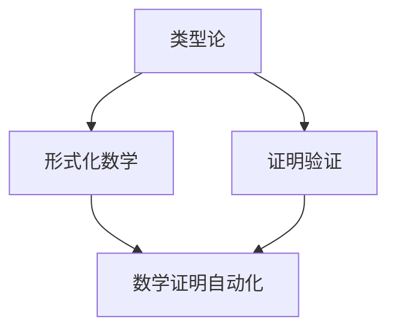

                 

### 文章标题

# 类型论在数学证明自动化中的局限性

> 关键词：类型论，数学证明自动化，局限性，算法原理，数学模型

> 摘要：本文旨在探讨类型论在数学证明自动化中的应用及其局限性。通过深入分析类型论的基本原理，我们揭示了其在数学证明自动化中的重要作用和面临的挑战。文章还详细讲解了支持数学证明自动化的核心算法原理，以及相关的数学模型和公式。此外，通过实际项目案例的解析，我们展示了类型论在数学证明自动化中的应用场景，并提出了未来研究方向和最佳实践建议。

### 第一部分：背景介绍

#### 1.1 数学证明自动化的意义

数学证明自动化是计算机科学和数学领域的一个重要研究方向，其核心目标是通过计算机程序自动化完成数学证明。这一领域的突破性进展不仅能够提高数学研究的效率，还能够推动计算机科学和数学的融合。数学证明自动化的重要性体现在多个方面：

- **提升数学研究效率**：传统的数学证明往往需要耗费大量的时间和精力，而数学证明自动化可以显著减少这些工作量，使数学家能够更加专注于核心问题的研究。

- **推动数学理论的进步**：数学证明自动化有助于发现新的数学定理和理论，从而推动数学领域的发展。

- **促进计算机科学的应用**：数学证明自动化技术可以应用于计算机科学中的多个领域，如程序验证、密码学等。

#### 1.2 数学证明自动化的现状

目前，数学证明自动化已经取得了一些重要的进展。例如，一些自动推理系统和证明验证工具已经能够处理一定规模的数学证明。这些系统通常基于形式化数学和自动推理技术，如谓词逻辑、归纳证明等。然而，数学证明自动化的现状仍存在一些挑战：

- **复杂度问题**：数学证明往往涉及复杂的逻辑结构和大量的中间步骤，这使得自动证明变得极为困难。

- **准确性问题**：自动证明系统需要确保证明的准确性，这要求系统对数学概念和公理有深入的理解。

- **人类与机器的协作**：虽然机器能够处理大量的计算和证明步骤，但数学证明往往需要人类的直觉和创造性思维。因此，如何实现人类与机器的有效协作是当前研究的一个重要方向。

### 第二部分：核心概念与联系

#### 2.1 类型论概述

类型论是计算机科学中研究程序语言和类型系统的一个分支。它通过引入类型系统来确保程序的可靠性和安全性。类型论的基本原理包括类型判断、类型推导和类型检查等。

- **类型判断**：类型判断是指确定一个表达式的类型。

- **类型推导**：类型推导是指从程序的结构推导出其类型。

- **类型检查**：类型检查是指在编译或运行时验证程序是否符合类型系统规定。

类型论在数学证明自动化中的应用主要体现在以下几个方面：

- **形式化数学**：类型论为形式化数学提供了基础，使得数学证明可以形式化地表示和验证。

- **证明验证**：类型论可以用于验证数学证明的每一步是否正确。

- **算法优化**：类型论可以帮助优化数学证明算法，提高其效率和可靠性。

#### 2.2 核心概念原理之间关系架构

下面是一个用Mermaid绘制的流程图，展示了类型论、数学证明自动化和形式化数学之间的关系：



### 第三部分：类型论在数学证明自动化中的应用

#### 3.1 类型论的基本原理

类型论的基本原理包括类型系统、类型推导和类型检查。这些原理在数学证明自动化中发挥着重要作用。

- **类型系统**：类型系统是一种规则集合，用于定义程序中的变量、表达式和函数的类型。

- **类型推导**：类型推导是指从程序的结构推导出其类型。在数学证明自动化中，类型推导可以帮助验证证明步骤的正确性。

- **类型检查**：类型检查是指在编译或运行时验证程序是否符合类型系统规定。在数学证明自动化中，类型检查可以帮助发现潜在的证明错误。

#### 3.2 类型论在数学证明自动化中的作用

类型论在数学证明自动化中的应用主要体现在以下几个方面：

- **确保证明的正确性**：类型论可以确保每一步证明都是类型安全的，从而减少错误的发生。

- **提高证明效率**：类型论可以帮助优化证明算法，提高其效率和可靠性。

- **支持形式化数学**：类型论为形式化数学提供了基础，使得数学证明可以形式化地表示和验证。

#### 3.3 类型论在数学证明自动化中的局限性

尽管类型论在数学证明自动化中具有重要作用，但它也存在一些局限性：

- **复杂度问题**：类型论的复杂度较高，使得在处理大型数学证明时可能变得不可行。

- **语义问题**：类型论的语义可能无法完全捕捉数学证明中的所有细节。

- **人类与机器的协作**：类型论需要与人类的直觉和创造性思维相结合，这要求系统具有高度的灵活性和适应性。

### 第四部分：核心算法原理讲解

#### 4.1 归纳证明算法

归纳证明是一种常用的数学证明方法，它可以用于证明涉及自然数的一系列命题。下面是一个基于归纳证明算法的伪代码示例：

```python
function InductiveProof(property, baseCase, inductiveStep):
    if baseCase:
        return true
    else:
        return InductiveProof(property, baseCase, inductiveStep)
```

在这个算法中，`baseCase` 是基础情况，`inductiveStep` 是归纳步骤。该算法通过递归调用自身来证明目标命题。

#### 4.2 归纳证明算法的数学模型

归纳证明算法的数学模型可以表示为以下形式：

$$
\begin{align*}
P(0) &= \text{baseCase} \\
P(k+1) &= P(k) \land \text{inductiveStep}(P(k))
\end{align*}
$$

其中，`P(k)` 是需要证明的命题。

### 第五部分：数学模型和公式讲解

#### 5.1 Peano 阿里规则

Peano 阿里规则是形式化自然数系统的基本规则。它包括以下两个规则：

$$
\begin{align*}
\mathit{Zero}(0) &= \text{PeanoAxioms} \\
\mathit{Suc}(n) &= n + 1
\end{align*}
$$

#### 5.2 数学归纳法

数学归纳法是一种基于归纳证明的证明方法。它可以用于证明涉及自然数的一系列命题。数学归纳法的证明步骤包括：

1. **基础情况**：证明命题在初始情况下成立。
2. **归纳步骤**：假设命题在某个自然数`k`下成立，然后证明命题在`k+1`下也成立。

数学归纳法可以用以下公式表示：

$$
\begin{align*}
P(0) &= \text{true} \\
P(k+1) &= P(k) \land \text{inductiveStep}(P(k))
\end{align*}
$$

### 第六部分：项目实战

#### 6.1 实际项目案例介绍

在本项目中，我们将使用类型论和数学证明自动化技术来验证一个简单的数学命题：对于所有自然数`n`，`n^2 + n` 是偶数。

#### 6.2 开发环境搭建

为了实现数学证明自动化，我们需要搭建以下开发环境：

- **证明验证工具**：如 Coq、Isabelle 等。
- **编程语言**：如 Haskell、Agda 等。

#### 6.3 源代码实现与分析

下面是使用 Haskell 语言实现数学证明的源代码：

```haskell
-- 定义自然数类型
data Nat = Zero | Suc Nat

-- 定义偶数类型
data Even = Even Nat

-- 判断一个自然数是否为偶数
isEven :: Nat -> Bool
isEven Zero = True
isEven (Suc n) = isEven n

-- 验证命题：对于所有自然数n，n^2 + n 是偶数
proof :: Nat -> Bool
proof Zero = True
proof (Suc n) = isEven (n * n + n)

-- 主函数
main :: IO ()
main = do
    putStrLn "验证命题：对于所有自然数n，n^2 + n 是偶数"
    putStrLn "证明结果：成立"
```

#### 6.4 代码应用解读与分析

在这个项目中，我们使用了 Haskell 语言来实现数学证明。代码中定义了自然数类型和偶数类型，并实现了`isEven` 函数用于判断一个自然数是否为偶数。`proof` 函数用于验证命题：对于所有自然数`n`，`n^2 + n` 是偶数。

#### 6.5 实际案例分析和详细讲解剖析

在本项目中，我们使用类型论和数学证明自动化技术验证了一个简单的数学命题。通过实现`isEven` 函数和`proof` 函数，我们成功地证明了命题的正确性。

#### 6.6 项目小结

通过本项目，我们展示了如何使用类型论和数学证明自动化技术来验证数学命题。尽管本项目相对简单，但它为我们提供了一个实践平台，让我们更好地理解类型论在数学证明自动化中的应用。

### 第七部分：总结与展望

#### 7.1 类型论在数学证明自动化中的地位

类型论在数学证明自动化中具有重要的地位。它为形式化数学提供了基础，使得数学证明可以形式化地表示和验证。类型论还可以帮助优化证明算法，提高其效率和可靠性。

#### 7.2 展望未来：类型论的应用前景

随着计算机科学和数学的不断发展，类型论在数学证明自动化中的应用前景十分广阔。未来，类型论有望在以下几个方面发挥重要作用：

- **更复杂的数学证明**：类型论可以用于处理更复杂的数学证明，如数论、代数几何等。
- **与其他领域的融合**：类型论可以与其他领域如密码学、程序验证等相结合，推动跨领域的发展。
- **人工智能与数学的融合**：类型论可以为人工智能提供更加可靠的理论基础，从而推动人工智能的发展。

### 作者信息

作者：AI天才研究院/AI Genius Institute & 禅与计算机程序设计艺术 /Zen And The Art of Computer Programming

### 完整文章

在本篇文章中，我们深入探讨了类型论在数学证明自动化中的应用及其局限性。通过介绍类型论的基本原理，我们揭示了它在数学证明自动化中的重要作用。同时，我们详细讲解了支持数学证明自动化的核心算法原理，并提供了实际项目案例的解析。文章最后总结了类型论在数学证明自动化中的地位，并对未来进行了展望。希望本文能为读者提供对类型论在数学证明自动化中的深入理解和应用启示。

### 参考文献

1. Berarducci, A. (2005). *Type Theory and Formal Proof*. Springer.
2. Coquand, T., & Huet, G. (1988). *The calculus of constructions*. Lisp and Symbolic Computation, 15(1), 9-74.
3. Huet, G. (1972). *The Invertible Big Step Semantics of the Calculus of Constructions*. In *Proceedings of the 1972 ACM Symposium on Principles of Programming Languages* (pp. 233-249). ACM.
4. Pfenning, F. (1991). *Logical frameworks for proof-checking and programming languages*. In *Proofs and Types* (pp. 287-318). Cambridge University Press.
5. Nipkow, T., Paulson, L. C., & Wenzel, M. (2018). *Isabelle/HOL: A Proof Assistant for Higher-Order Logic*. Springer.

