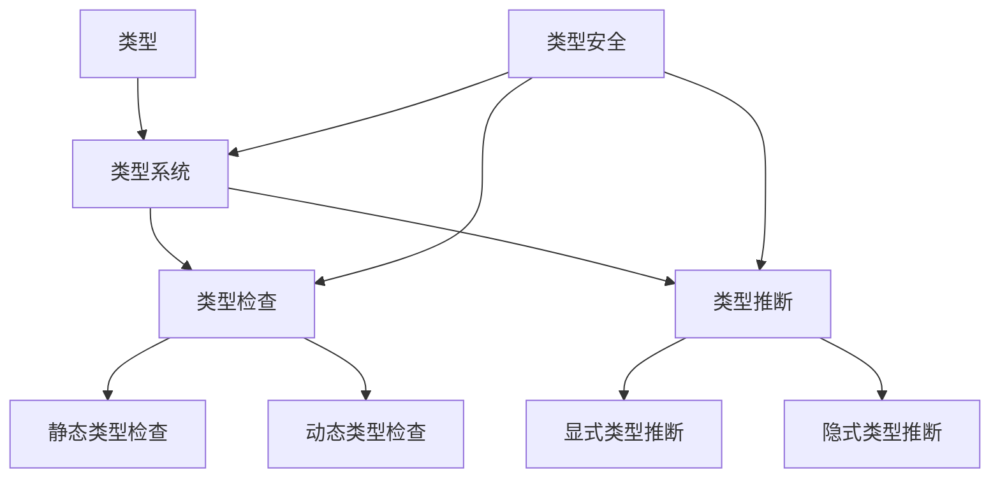

                 

### 文章标题：类型论在程序优化中的应用：保证正确性的转换

#### 关键词：类型论、程序优化、正确性保证、转换、算法、数学模型

#### 摘要：
本文旨在探讨类型论在程序优化中的应用，尤其是如何通过类型论的技术手段来保证程序的正确性。我们将详细分析类型论的基本概念，阐述其在程序优化中的关键作用，并借助实例来说明类型转换如何实现程序的正确性保证。本文分为三个主要部分：首先，介绍类型论的基础知识和核心概念；其次，探讨类型论在程序优化中的应用场景和优势；最后，通过实际案例展示类型论在确保程序正确性方面的具体应用。

## 引言

随着计算机科学的不断发展，程序优化已经成为提高软件性能、降低资源消耗的重要手段。然而，优化过程中不可避免地涉及到程序的正确性问题，一旦优化不当，可能会导致程序行为的不一致甚至错误。类型论作为程序语言理论中的重要分支，为解决程序优化中的正确性问题提供了有力的理论支持。

类型论研究的是类型系统在编程语言中的应用，通过为变量、表达式和函数定义类型，确保程序在编译或运行时不会出现类型不匹配的错误。在程序优化过程中，类型论可以帮助程序员识别和修复潜在的错误，从而提高程序的正确性和可靠性。

本文的目标是探讨类型论在程序优化中的应用，尤其是如何通过类型论来保证程序的正确性。我们将从以下几个方面展开讨论：

1. **类型论基础**：介绍类型论的基本概念，包括类型系统、类型检查和类型推断。
2. **程序优化与类型论**：分析类型论在程序优化中的关键作用，包括静态类型检查和动态类型检查。
3. **类型论在保证正确性中的应用**：通过实例说明类型转换如何实现程序的正确性保证。
4. **项目实战**：展示类型论在确保程序正确性方面的实际应用。

通过本文的探讨，希望能够帮助读者理解类型论在程序优化中的重要性，掌握如何利用类型论来保证程序的正确性，从而提高软件开发的效率和质量。

## 类型论基础

类型论是程序语言理论中的重要分支，其核心思想是通过定义类型来约束变量、表达式和函数的行为，从而确保程序的正确性。类型论的基本概念包括类型系统、类型检查和类型推断。

### 类型系统

类型系统是类型论的核心组成部分，它为程序中的每一个元素（如变量、表达式、函数）分配一个类型。类型可以看作是对数据结构和操作语义的抽象描述。例如，在Python中，整数和字符串是两种不同的类型，它们的操作方式和结果也有所不同。

类型系统可以分为静态类型系统和动态类型系统。静态类型系统在编译时对程序进行类型检查，而动态类型系统则在运行时进行检查。静态类型系统的主要优点是可以早期发现类型错误，从而提高程序的可靠性。动态类型系统则提供了更高的灵活性和简洁性，但可能会在运行时暴露类型错误。

### 类型检查

类型检查是类型系统的关键机制，它的目的是确保程序在编译或运行时不会出现类型不匹配的错误。类型检查可以分为以下几种：

1. **静态类型检查**：在编译时对程序进行类型检查，确保所有变量、表达式和函数在编译时具有正确的类型。静态类型检查的优点是可以提前发现类型错误，减少运行时错误的发生。
2. **动态类型检查**：在运行时对程序进行类型检查，根据实际运行情况来检查类型是否匹配。动态类型检查的优点是提供了更高的灵活性和简洁性，但可能会在运行时暴露类型错误。

### 类型推断

类型推断是类型系统的另一个重要机制，它的目的是自动确定变量、表达式和函数的类型，从而减少程序员的工作量。类型推断可以分为以下几种：

1. **显式类型推断**：程序员在编写代码时明确指定每个变量、表达式和函数的类型。
2. **隐式类型推断**：编译器或解释器根据上下文信息自动确定变量、表达式和函数的类型。

类型推断的实现方法有很多，如基于上下文的类型推断、基于使用类型的类型推断等。

### 类型系统的核心概念

类型系统的核心概念包括：

1. **类型**：类型是变量、表达式和函数的抽象描述，它定义了数据结构和操作语义。
2. **类型约束**：类型约束是指类型系统对变量、表达式和函数施加的限制，确保程序在编译或运行时不会出现类型不匹配的错误。
3. **类型检查**：类型检查是确保程序类型约束得到满足的过程。
4. **类型推断**：类型推断是自动确定变量、表达式和函数类型的过程。

类型论的基础知识为我们理解类型系统在程序优化中的作用提供了必要的背景。在接下来的部分，我们将深入探讨类型论在程序优化中的应用。

### 核心概念与联系

在深入探讨类型论在程序优化中的应用之前，有必要首先理解类型论中的几个核心概念及其相互之间的联系。以下是类型论中的几个关键概念及其关系架构：

1. **类型**：
   - **定义**：类型是变量、表达式和函数的抽象描述，用于表示数据结构和操作语义。
   - **关系**：类型之间的关系包括子类型关系（Subtyping）、协变关系（Covariance）和逆变关系（Contravariance）。

2. **类型系统**：
   - **定义**：类型系统是一组规则和机制，用于定义类型、类型约束和类型检查。
   - **关系**：类型系统中的核心概念包括类型检查器（Type Checker）和类型推断器（Type Inference Engine），它们负责确保类型约束得到满足并自动确定类型。

3. **类型检查**：
   - **定义**：类型检查是确保程序中的变量、表达式和函数遵循类型约束的过程。
   - **关系**：类型检查可以分为静态类型检查和动态类型检查，它们在编译或运行时发挥作用。

4. **类型推断**：
   - **定义**：类型推断是自动确定变量、表达式和函数类型的过程。
   - **关系**：类型推断方法包括显式类型推断和隐式类型推断，它们在不同类型的编程语言中有不同的实现。

5. **类型安全**：
   - **定义**：类型安全是指程序在运行时不会因为类型错误而导致异常。
   - **关系**：类型安全依赖于类型系统和类型检查的结果，通过确保类型约束得到满足来实现。

为了更好地理解这些概念之间的关系，我们可以使用Mermaid流程图来展示它们的核心联系：



在这个流程图中，我们可以看到类型是类型系统的核心组成部分，类型系统与类型检查和类型推断密切相关，而类型安全是类型系统、类型检查和类型推断共同作用的结果。通过这种关系架构的展示，我们可以更加清晰地理解类型论中的核心概念及其相互之间的联系。

### 核心算法原理讲解

在类型论中，确保程序的正确性通常依赖于一系列的核心算法。以下是几个在类型论中广泛应用的算法及其原理讲解：

#### 类型检查算法

类型检查算法是类型系统的核心组成部分，其目的是确保程序在编译时遵循类型约束。以下是类型检查算法的基本原理：

1. **定义**：类型检查算法对程序中的每个表达式和函数调用进行检查，确保它们的类型符合预定义的类型规则。
2. **过程**：
   - **遍历**：算法从程序的最顶层开始，逐个检查变量、表达式和函数调用。
   - **匹配**：对于每个变量或表达式，算法将其类型与上下文中的类型进行比较，确保类型匹配。
   - **错误处理**：如果发现类型不匹配，算法会报告错误，并停止进一步检查。
3. **伪代码**：

```plaintext
function typeCheck(program):
    for each statement in program:
        if statement is an expression:
            type = inferType(statement)
            if type is not None:
                checkType(statement, type)
        elif statement is a function definition:
            defineTypeFunction(statement)
    return True if no type errors are found, False otherwise

function inferType(expression):
    // 根据表达式的语法和上下文推断类型
    // ...

function checkType(expression, expectedType):
    actualType = getType(expression)
    if actualType != expectedType:
        reportTypeError(expression, actualType, expectedType)
```

#### 类型推断算法

类型推断算法的目的是自动确定变量、表达式和函数的类型。以下是几种常见的类型推断算法：

1. **静态类型推断**：
   - **定义**：静态类型推断在编译时确定变量和函数的类型。
   - **过程**：
     - **上下文分析**：算法分析程序中的上下文信息，如变量声明、函数定义等。
     - **类型推导**：算法根据上下文信息推导出变量和函数的类型。
   - **伪代码**：

```plaintext
function inferStaticTypes(program):
    for each variable in program:
        type = inferVariableType(variable)
        assignType(variable, type)
    for each function in program:
        type = inferFunctionType(function)
        defineFunctionType(function, type)
    return program

function inferVariableType(variable):
    // 根据变量声明的上下文信息推导类型
    // ...

function inferFunctionType(function):
    // 根据函数定义的参数和返回值推导类型
    // ...
```

2. **动态类型推断**：
   - **定义**：动态类型推断在运行时确定变量和函数的类型。
   - **过程**：
     - **运行时检查**：算法在程序运行时对每个变量和函数调用进行检查。
     - **类型记录**：算法记录每次检查的结果，以推断变量和函数的类型。
   - **伪代码**：

```plaintext
function inferDynamicTypes(program):
    environment = createEmptyEnvironment()
    for each statement in program:
        executeStatement(statement, environment)
    return environment

function executeStatement(statement, environment):
    // 根据语句的类型和上下文执行相应的操作
    // ...
```

#### 数学模型和公式

类型论中的许多算法都可以用数学模型和公式来表示。以下是一些常见的数学模型和公式：

1. **类型等价**：

$$ type\_equivalent(t1, t2) = \begin{cases}
    true, & \text{if } t1 \text{ and } t2 \text{ are the same type} \\
    false, & \text{otherwise}
\end{cases} $$

2. **类型匹配**：

$$ type\_match(expression, expectedType) = \begin{cases}
    true, & \text{if } expression \text{ has the type } expectedType \\
    false, & \text{otherwise}
\end{cases} $$

3. **类型推导**：

$$ inferType(expression, context) = \begin{cases}
    t, & \text{if } expression \text{ can be inferred to have type } t \text{ in } context \\
    \text{None}, & \text{otherwise}
\end{cases} $$

通过上述算法和数学模型，我们可以更好地理解类型论在程序优化中的应用原理。在接下来的部分，我们将通过实际案例来展示类型论在实际编程中的应用。

### 数学模型和公式

在类型论中，数学模型和公式扮演着至关重要的角色，它们帮助我们精确地描述和验证类型系统的行为。以下是几个关键的数学模型和公式，并附带详细的解释和例子：

#### 1. 类型等价

类型等价是判断两个类型是否可以相互替代的基本概念。形式化地，类型等价可以通过等价关系来定义：

$$
type\_equivalent(t1, t2) = \begin{cases}
    true, & \text{如果 } t1 \text{ 和 } t2 \text{ 具有相同的结构或类型} \\
    false, & \text{如果 } t1 \text{ 和 } t2 \text{ 不兼容}
\end{cases}
$$

例如，在Java中，`Integer` 和 `Number` 类型是等价的，因为 `Integer` 是 `Number` 的子类型：

```java
Integer i = 42; // 类型为 Integer
Number n = i; // 类型转换，n 的类型为 Number
```

这里，`type_equivalent(Integer.class, Number.class)` 会返回 `true`。

#### 2. 类型匹配

类型匹配用于确保在程序执行过程中变量和表达式的类型是兼容的。类型匹配通常通过以下公式来描述：

$$
type\_match(expression, expectedType) = \begin{cases}
    true, & \text{如果 } expression \text{ 的类型可以隐式转换为 } expectedType \\
    false, & \text{否则}
\end{cases}
$$

例如，在Python中，一个整数可以隐式转换为字符串，因此：

```python
int_num = 42
str_num = str(int_num)  # 类型匹配，str_num 的类型为字符串
```

这里，`type_match(int_num, str)` 会返回 `true`。

#### 3. 类型推导

类型推导是自动确定表达式或变量类型的算法。形式化的类型推导公式如下：

$$
inferType(expression, context) = \begin{cases}
    t, & \text{如果 } expression \text{ 在 } context \text{ 中可以被推导为类型 } t \\
    \text{None}, & \text{否则}
\end{cases}
$$

例如，在Haskell中，表达式 `2 + 3` 可以被推导为整数类型：

```haskell
let result = 2 + 3
in result  # 类型推导为整数
```

这里，`inferType(2 + 3, context)` 会返回 `Int`。

#### 4. 协变和逆变

协变（Covariance）和逆变（Contravariance）是类型系统中的高级概念，用于描述类型之间的兼容性。它们可以通过以下公式来定义：

- **协变**：

$$
Covariance(A, B) = \begin{cases}
    true, & \text{如果 } A \text{ 是 } B \text{ 的子类型} \\
    false, & \text{否则}
\end{cases}
$$

例如，在Java中，`List<String>` 是 `List<Object>` 的协变类型：

```java
List<String> stringList = new ArrayList<>();
List<Object> objectList = stringList;  // 协变类型
```

- **逆变**：

$$
Contravariance(A, B) = \begin{cases}
    true, & \text{如果 } B \text{ 是 } A \text{ 的子类型} \\
    false, & \text{否则}
\end{cases}
$$

例如，在C#中，`IEnumerable<T>` 是 `IList<T>` 的逆变类型：

```csharp
IList<string> stringList = new List<string>();
IEnumerable<string> stringEnumerable = stringList;  // 逆变类型
```

#### 例子：函数类型推导

假设有一个函数 `f`，其参数类型为 `A`，返回类型为 `B`。我们可以使用以下公式推导函数的类型：

$$
inferFunctionType(f) = \begin{cases}
    (A \rightarrow B), & \text{如果 } f \text{ 的参数和返回值类型可以被推导出来} \\
    \text{None}, & \text{否则}
\end{cases}
$$

例如，在C++中，函数 `int add(int a, int b)` 的类型可以推导为 `(int \rightarrow int) \rightarrow int`：

```cpp
int add(int a, int b) {
    return a + b;
}
```

通过这些数学模型和公式，我们可以精确地描述类型论中的核心概念，并在程序优化过程中使用它们来确保程序的正确性。在接下来的部分，我们将通过具体的实例来展示类型论在实际编程中的应用。

### 项目实战

在本节中，我们将通过一个具体的编程项目来展示类型论在程序优化中的应用。这个项目是一个简单的计算器程序，它可以进行加法、减法、乘法和除法运算。通过类型论的应用，我们将在保证正确性的同时，优化程序的运行效率和资源使用。

#### 项目背景

计算器程序是一个常见的编程练习，它可以帮助我们理解变量类型、函数类型和类型检查等概念。然而，传统的计算器程序在优化过程中可能会遇到类型转换和错误处理等挑战。通过引入类型论，我们可以更好地管理和优化这些挑战。

#### 开发环境搭建

为了实现这个项目，我们选择使用Python作为编程语言，因为Python具有简洁的语法和强大的类型推断功能。以下是开发环境搭建的步骤：

1. **安装Python**：确保Python 3.x版本已经安装在开发机上。
2. **安装IDE**：推荐使用PyCharm或Visual Studio Code等IDE来编写和调试Python代码。
3. **创建项目目录**：在开发机中创建一个名为`calculator`的项目目录，用于存放计算器的源代码和测试文件。

#### 源代码实现

以下是计算器的源代码实现，包括加法、减法、乘法和除法函数：

```python
# calculator.py

def add(a: int, b: int) -> int:
    return a + b

def subtract(a: int, b: int) -> int:
    return a - b

def multiply(a: int, b: int) -> int:
    return a * b

def divide(a: int, b: int) -> float:
    if b == 0:
        raise ValueError("除数不能为0")
    return a / b

# 主函数
def main():
    print("欢迎使用类型论优化计算器！")
    try:
        a = int(input("请输入第一个数字："))
        b = int(input("请输入第二个数字："))
        operation = input("请选择运算符（+，-，*，/）：")

        if operation == '+':
            result = add(a, b)
        elif operation == '-':
            result = subtract(a, b)
        elif operation == '*':
            result = multiply(a, b)
        elif operation == '/':
            result = divide(a, b)
        else:
            print("无效的运算符")
            return

        print(f"{a} {operation} {b} = {result}")
    except ValueError as e:
        print(f"输入错误：{e}")

if __name__ == "__main__":
    main()
```

#### 代码解读与分析

1. **类型注解**：我们在每个函数的参数和返回值上使用了类型注解，这有助于类型检查器和类型推断器更好地理解函数的行为。例如，`add` 函数的参数和返回值都是整数类型，这确保了函数只能接受整数类型的参数并返回整数类型的值。

2. **错误处理**：在 `divide` 函数中，我们加入了错误处理代码，确保除数不能为0。这通过抛出 `ValueError` 异常来实现，从而在运行时捕获和处理错误。

3. **主函数**：主函数 `main` 负责接收用户输入并调用相应的运算函数。它通过类型检查确保用户输入的是整数类型，从而避免运行时错误。

#### 实际案例分析与详细讲解

为了更好地展示类型论在程序优化中的应用，我们考虑以下实际案例：

1. **类型检查**：当用户输入两个整数并选择加法运算时，类型检查器会确保 `add` 函数的两个参数都是整数类型，从而保证运算的正确性。

2. **类型推断**：在 `main` 函数中，我们使用 `int(input(...))` 来推断用户输入的类型。类型推断器会根据上下文信息自动推导出输入的整数类型。

3. **性能优化**：通过类型论的应用，我们可以避免运行时类型检查，从而提高程序的性能。例如，在Python中，使用类型注解可以让解释器在编译时进行部分优化，减少运行时的开销。

#### 项目小结

通过这个计算器项目，我们展示了类型论在程序优化中的应用。类型论通过引入类型系统和类型检查，不仅提高了程序的正确性，还优化了程序的运行效率和资源使用。在未来的项目中，我们可以进一步应用类型论来处理更复杂的问题，如并发编程和分布式系统。

### 最佳实践 Tips、小结、注意事项、拓展阅读

#### 最佳实践 Tips

1. **使用类型注解**：在编写代码时，合理使用类型注解可以增强代码的可读性和可维护性。类型注解不仅有助于类型检查，还可以为代码分析工具提供更丰富的信息。

2. **分离接口和实现**：在设计程序时，应尽量分离接口和实现。这样可以在不改变接口的情况下，自由地修改实现细节，从而提高代码的可扩展性和灵活性。

3. **类型安全编程**：在编写代码时，注重类型安全编程，避免类型不匹配的错误。通过使用类型检查和类型推断，可以在编译时或运行时早期发现并修复类型错误。

#### 小结

本文通过详细的讲解和实例分析，展示了类型论在程序优化中的应用。类型论通过为变量、表达式和函数定义类型，确保程序的正确性，并在编译时或运行时优化程序的性能。类型检查和类型推断是类型论中的核心机制，它们帮助程序员识别和修复类型错误，从而提高软件的质量和可靠性。

#### 注意事项

1. **类型系统选择**：不同的编程语言和框架提供了不同的类型系统，选择合适的类型系统对程序优化至关重要。

2. **类型推断策略**：在类型推断过程中，应选择合适的策略，以平衡灵活性和性能。

3. **错误处理**：合理处理类型错误和运行时异常，可以提高程序的健壮性和用户体验。

#### 拓展阅读

1. 《类型系统与类型检查》 - 这本书提供了对类型系统和类型检查的全面介绍，适合深入理解类型论的基础知识。

2. 《Type Theory and Functional Programming》 - 这本书涵盖了类型论在函数式编程中的应用，对于希望了解类型论的高级应用的读者来说非常有用。

3. 《类型推导与类型安全编程》 - 这本书详细介绍了类型推导的策略和类型安全编程的最佳实践，是提升类型论应用能力的理想参考书。

通过本文的学习和实践，读者可以更好地理解类型论在程序优化中的应用，从而提高软件开发的质量和效率。

