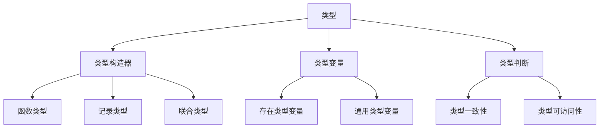

                 

## 文章标题

### 类型论在程序理解与维护中的应用

#### 关键词

- 类型论
- 程序理解
- 程序维护
- 静态类型语言
- 动态类型语言

#### 摘要

本文深入探讨类型论在程序理解与维护中的应用。首先，我们将回顾类型论的历史背景和基本概念，通过Mermaid流程图展示类型论的核心概念与联系。接下来，我们将详细分析静态类型语言与动态类型语言的类型系统，介绍类型推断和类型检查机制。在此基础上，本文将探讨类型论在程序理解中的应用，包括程序语义、程序抽象和程序验证。随后，我们将讨论类型论在程序维护中的应用，如改善代码可读性、可扩展性和错误修复。最后，本文将通过项目实战案例，展示如何利用类型论进行程序重构，并提供一些最佳实践和拓展阅读建议。

## 目录大纲

1. **引言**
   - 背景介绍
   - 核心概念与联系
   - 文章结构

2. **类型论基础**
   - 历史背景
   - 基本概念
   - Mermaid流程图：类型论的核心概念与联系

3. **静态类型语言与类型系统**
   - 基本概念
   - 类型系统
   - 类型推断机制
   - 类型检查机制

4. **动态类型语言与类型系统**
   - 基本概念
   - 类型系统
   - 类型推断
   - 类型检查

5. **类型论在程序理解中的应用**
   - 程序语义
   - 程序抽象
   - 程序验证

6. **类型论在程序维护中的应用**
   - 代码可维护性
   - 可读性
   - 可扩展性
   - 错误修复

7. **类型论在程序修复中的应用**
   - 错误定位
   - 错误修复
   - 程序调试

8. **类型论在程序重构中的应用**
   - 代码重构
   - 优化代码结构
   - 优化代码复杂度

9. **项目实战**
   - 开发环境搭建
   - 源代码实现与解读
   - 代码应用分析与解读
   - 实际案例分析
   - 项目小结

10. **最佳实践与拓展阅读**
    - 最佳实践
    - 小结
    - 注意事项
    - 拓展阅读

## 引言

### 背景介绍

在计算机科学领域，类型论（Type Theory）是一种用于描述程序语言语义的理论。类型论的核心思想是，通过定义数据的类型和操作这些数据的方法，可以更好地理解和验证程序的正确性。类型论在编程语言设计、编译器实现、程序验证和软件工程中都有着广泛的应用。

类型论的历史可以追溯到20世纪30年代，当时数学家阿尔弗雷德·诺思·怀特海德（Alfred North Whitehead）和伯兰特·罗素（Bertrand Russell）提出了形式逻辑和集合论，以解决数学基础问题。此后，类型论逐渐发展成为一个独立的领域，其重要性在编程语言研究中日益凸显。

在现代软件工程中，类型论的应用主要体现在以下几个方面：

1. **程序理解**：类型论提供了强大的工具，可以帮助开发者更好地理解程序的运行时行为，从而提高代码的可读性和可维护性。
2. **程序验证**：通过类型系统，可以验证程序的某些性质，如类型安全性和内存安全性，从而减少程序出错的可能性。
3. **编译器优化**：类型论可以帮助编译器进行代码生成和优化，提高程序的运行效率。
4. **软件工程**：类型论的概念和方法可以应用于软件设计和开发过程中，提高软件的质量和可维护性。

### 核心概念与联系

类型论的核心概念包括类型（Type）、类型构造器（Type Constructor）、类型变量（Type Variable）和类型判断（Type Judgment）。这些概念通过Mermaid流程图可以直观地展示其关系。

- **类型（Type）**：类型是程序中数据的不同形式的集合。类型可以是原始类型，如整数、布尔值，也可以是复合类型，如数组、函数。
- **类型构造器（Type Constructor）**：类型构造器是一种操作，用于组合其他类型来创建新的类型。常见的类型构造器包括函数类型、记录类型和联合类型。
- **类型变量（Type Variable）**：类型变量是一种占位符，用于表示一类类型。类型变量通常用大写字母表示，如`A`、`B`。
- **类型判断（Type Judgment）**：类型判断是一种逻辑表达式，用于判断一个表达式是否属于某个类型。类型判断通常表示为`E : T`，其中`E`是一个表达式，`T`是一个类型。

### 文章结构

本文将按照以下结构展开：

1. **类型论基础**：介绍类型论的历史背景和基本概念，通过Mermaid流程图展示类型论的核心概念与联系。
2. **静态类型语言与类型系统**：分析静态类型语言的基本概念、类型系统和类型推断机制。
3. **动态类型语言与类型系统**：讨论动态类型语言的基本概念、类型系统和类型推断。
4. **类型论在程序理解中的应用**：探讨类型论在程序语义、程序抽象和程序验证中的应用。
5. **类型论在程序维护中的应用**：分析类型论在代码可维护性、可读性和可扩展性方面的作用。
6. **类型论在程序修复中的应用**：介绍类型论在错误定位、错误修复和程序调试中的应用。
7. **类型论在程序重构中的应用**：探讨类型论在代码重构中的作用。
8. **项目实战**：通过实际项目展示类型论的应用。
9. **最佳实践与拓展阅读**：提供一些实用的最佳实践和进一步阅读的资料。

通过本文的深入探讨，读者将能够理解类型论在程序理解与维护中的重要性，并掌握如何在实际项目中应用类型论。接下来，我们将进入类型论的基础知识部分，对类型论的历史背景和基本概念进行详细介绍。

