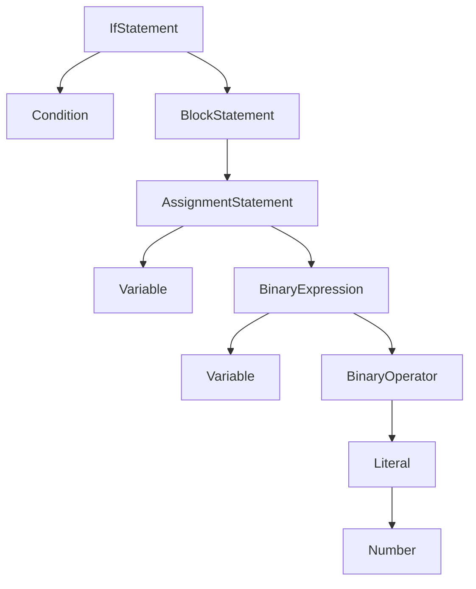

                 


## 文章标题

《类型论在程序理解工具开发中的应用》

## 文章关键词

类型论、程序理解、工具开发、静态分析、动态分析、类型检查、代码优化、实战案例

## 文章摘要

本文旨在探讨类型论在程序理解工具开发中的应用。首先，我们将介绍类型论的基本概念和背景，包括类型系统的基础理论、类型推断原理以及子类型与泛化关系。接着，我们将深入探讨类型论在实际编程中的应用，包括静态类型编程语言、动态类型编程语言以及类型安全与类型检查。随后，我们将重点介绍类型论在程序理解工具中的应用，包括基于类型论的程序解析方法、类型检查和代码优化。最后，我们将通过多个实战案例，详细讲解类型论在实际开发中的应用和效果，并对未来类型论在程序理解工具中的发展进行展望。

## 目录

1. 引言
2. 类型论概述
   2.1 基本概念
   2.2 发展历史
   2.3 在现代编程语言中的应用
3. 类型论基础理论
   3.1 类型系统的基础
   3.2 类型推断原理
   3.3 子类型与泛化关系
4. 类型论在实际编程中的应用
   4.1 静态类型编程语言
   4.2 动态类型编程语言
   4.3 类型安全与类型检查
5. 类型论在程序理解工具中的应用
   5.1 程序理解工具概述
   5.2 基于类型论的程序解析方法
   5.3 基于类型论的类型检查
   5.4 基于类型论的代码优化
6. 实战案例研究
   6.1 静态分析工具
   6.2 动态分析工具
   6.3 代码自动修复工具
7. 未来展望
   7.1 发展趋势
   7.2 面临的挑战和机会
8. 结论
9. 参考文献

## 引言

程序理解是计算机科学中一个重要的研究领域，它涉及到对程序的结构、语义和行为进行深入分析和理解。随着软件系统的复杂度不断增加，程序理解的难度也日益增大。传统的程序理解方法往往依赖于人工分析，效率低下且容易出错。因此，开发高效、可靠的程序理解工具成为了当前研究的热点。

类型论是程序理解的一个重要理论基石。它通过对程序中变量和函数的类型进行描述和约束，帮助程序员更好地理解程序的语义和行为。类型论不仅为程序理解提供了理论基础，还为程序开发提供了有力的工具支持。

本文将围绕类型论在程序理解工具开发中的应用展开讨论。首先，我们将介绍类型论的基本概念和背景，包括类型系统的基础理论、类型推断原理以及子类型与泛化关系。接着，我们将深入探讨类型论在实际编程中的应用，包括静态类型编程语言、动态类型编程语言以及类型安全与类型检查。随后，我们将重点介绍类型论在程序理解工具中的应用，包括基于类型论的程序解析方法、类型检查和代码优化。最后，我们将通过多个实战案例，详细讲解类型论在实际开发中的应用和效果，并对未来类型论在程序理解工具中的发展进行展望。

## 类型论概述

### 1.1 基本概念

类型论（Type Theory）是一种形式化的数学理论，用于描述和处理数学对象和它们的分类。在计算机科学中，类型论被广泛应用于编程语言的设计和语义学研究中。类型论的基本概念包括类型（Type）、类型系统（Type System）、类型推断（Type Inference）和类型检查（Type Checking）等。

**类型（Type）**：类型是用于描述数据或值的类别。在类型论中，类型可以分为基本类型（如整数、字符串、布尔值等）和复合类型（如数组、列表、函数等）。每个类型都可以表示一组具有相同特征的数据或值。

**类型系统（Type System）**：类型系统是一组规则和约定，用于定义如何为程序中的变量、函数和表达式分配类型。类型系统可以分为静态类型系统和动态类型系统。静态类型系统在编译时确定变量的类型，而动态类型系统在运行时确定变量的类型。

**类型推断（Type Inference）**：类型推断是一种自动确定变量和表达式的类型的方法。类型推断可以减少程序员的工作量，提高程序的可读性和可靠性。

**类型检查（Type Checking）**：类型检查是一种验证程序中变量和表达式的类型是否一致的方法。类型检查通常在编译时进行，以确保程序在运行时不会出现类型错误。

### 1.2 发展历史

类型论的发展可以追溯到1930年代，当时数学家Peano和Zermelo提出了类型论的基本概念。随着计算机科学的兴起，类型论逐渐成为编程语言设计的重要理论基础。1950年代，Church和Turing提出了类型论的重要思想，即类型可以用于防止逻辑错误和未定义行为。

在1960年代，Peter Landin和Edsger Dijkstra等学者对类型论进行了深入的研究，提出了许多重要的类型系统和类型检查算法。1970年代， statically typed programming languages（如ML和Haskell）的出现进一步推动了类型论的发展。

近年来，随着动态类型编程语言的流行（如JavaScript和Python），类型论在程序理解工具开发中的应用也变得越来越重要。

### 1.3 在现代编程语言中的应用

现代编程语言广泛采用类型论的概念，以提供更好的程序理解和错误检测能力。以下是一些现代编程语言中类型论的应用：

**静态类型编程语言**：如C++、Java、Haskell等。这些语言通常在编译时进行类型检查，以确保程序在运行时不会出现类型错误。

**动态类型编程语言**：如Python、JavaScript、Ruby等。这些语言通常在运行时进行类型检查，以提供更灵活的编程模型。

**函数式编程语言**：如Haskell、Scala、Erlang等。这些语言通常采用强类型系统，以防止未定义行为和逻辑错误。

**逻辑编程语言**：如Prolog、Mercury等。这些语言结合了类型论和逻辑编程的特点，提供了强大的程序理解和推理能力。

**脚本语言**：如Python、Ruby、Perl等。这些语言通常采用动态类型系统，以提供更灵活的编程模型。

### 1.4 类型论在程序理解工具中的重要性

类型论在程序理解工具中扮演着关键角色。通过类型推断和类型检查，程序理解工具可以更准确地分析程序的语义和行为，从而提供更强大的错误检测和代码优化功能。

类型论还可以帮助程序员更好地理解程序的复杂结构，提高代码的可维护性和可读性。此外，类型论还为自动程序修复和自动化测试提供了理论基础。

总之，类型论是程序理解工具开发中不可或缺的一部分，对于提高程序质量和开发效率具有重要意义。

## 类型论基础理论

### 2.1 类型系统的基础

类型系统（Type System）是编程语言中的一个核心概念，它用于定义如何为程序中的变量、函数和表达式分配类型。类型系统可以分为静态类型系统和动态类型系统。

**静态类型系统**：在静态类型系统中，变量的类型在编译时就已经确定。编译器会在编译过程中对程序进行类型检查，以确保所有操作都是类型兼容的。静态类型系统提供了更好的程序可读性和错误检测能力，但可能会增加编写和维护程序的难度。

**动态类型系统**：在动态类型系统中，变量的类型在运行时确定。这意味着程序可以在运行时动态地改变变量的类型，提供了更大的灵活性和编程便利。然而，动态类型系统可能会导致潜在的类型错误，需要更多的运行时检查。

**类型表达式**：类型表达式用于表示变量、函数和表达式的类型。常见的类型表达式包括基本类型（如整数、字符串、布尔值等）、复合类型（如数组、列表、函数等）和抽象类型（如类、接口等）。

**类型约束**：类型约束用于定义变量和表达式之间的类型关系。类型约束可以用于确保程序中的类型一致性，防止类型错误的发生。

**类型推断**：类型推断是一种自动确定变量和表达式的类型的方法。类型推断可以减少程序员的工作量，提高程序的可读性和可靠性。

### 2.2 类型推断原理

类型推断是一种自动化确定变量和表达式类型的方法，它通常基于以下几种类型推断策略：

**显式类型声明**：程序员在编写程序时显式地声明变量和表达式的类型。

**类型上下文**：类型推断器根据程序中的上下文信息（如函数定义、变量赋值等）来推断变量和表达式的类型。

**模式匹配**：类型推断器通过模式匹配来推断变量和表达式的类型。模式匹配是一种将表达式与模式进行匹配的方法，用于确定表达式的类型。

**归纳类型推断**：类型推断器通过归纳推理来推断变量和表达式的类型。归纳推理是一种从具体实例推导出一般结论的方法。

### 2.3 子类型与泛化关系

子类型（Subtyping）是一种类型关系，用于描述一个类型可以包含另一个类型的元素。子类型关系可以用于类型兼容性和多态性。

**子类型定义**：一个类型A是类型B的子类型，当且仅当对于任何属于类型B的值，它也属于类型A。

**泛化（Generalization）**：泛化是一种将特定类型推广到更一般类型的操作。泛化可以用于提高程序的可重用性和可维护性。

**子类型与泛化关系**：子类型关系与泛化关系密切相关。泛化可以将特定类型的操作推广到更一般类型的操作，而子类型关系则确保这些泛化操作保持类型兼容性。

### 2.4 类型论基础理论的应用

类型论基础理论在编程语言设计和实现中有着广泛的应用。以下是一些具体的应用场景：

**静态类型编程语言**：静态类型编程语言（如C++、Java）通常采用类型论基础理论来设计类型系统和类型检查算法。

**动态类型编程语言**：动态类型编程语言（如Python、JavaScript）虽然不强制类型检查，但也可以利用类型论基础理论来优化运行时类型检查。

**函数式编程语言**：函数式编程语言（如Haskell、Scala）通常采用类型论基础理论来实现强类型系统和模式匹配。

**逻辑编程语言**：逻辑编程语言（如Prolog、Mercury）结合了类型论和逻辑编程的特点，提供了强大的类型推断和推理能力。

**脚本语言**：脚本语言（如Python、Ruby）通常利用类型论基础理论来优化动态类型检查和代码优化。

总之，类型论基础理论是编程语言设计和实现中不可或缺的一部分，它为程序理解工具的开发提供了重要的理论支持。

## 类型论在实际编程中的应用

### 3.1 静态类型编程语言

静态类型编程语言（如C++、Java、Haskell）采用静态类型系统，即在编译时确定变量的类型。这种类型系统提供了更好的程序可读性和错误检测能力。

**静态类型系统的优点**：

1. **更好的程序可读性**：静态类型系统通过明确声明变量和函数的类型，使程序结构更加清晰，易于理解和维护。
2. **更强大的错误检测能力**：静态类型系统在编译时进行类型检查，可以提前发现类型错误，减少运行时错误。
3. **更高的性能**：静态类型系统可以生成优化后的中间代码，提高程序的运行效率。

**静态类型系统的缺点**：

1. **增加开发难度**：静态类型系统要求程序员显式声明类型，可能增加编程的复杂度和工作量。
2. **降低灵活性**：静态类型系统对类型变化的限制较严格，可能降低程序的可重用性和可扩展性。

**静态类型编程语言中的应用**：

1. **C++**：C++是一种广泛使用的静态类型编程语言，它支持面向对象编程和模板编程，具有强大的类型系统。
2. **Java**：Java是一种流行的静态类型编程语言，用于开发企业级应用和Android应用。Java的类型系统包括基本类型、复合类型和泛型。
3. **Haskell**：Haskell是一种纯函数式编程语言，采用强静态类型系统，提供了强大的类型推断和类型检查能力。

### 3.2 动态类型编程语言

动态类型编程语言（如Python、JavaScript、Ruby）采用动态类型系统，即在运行时确定变量的类型。这种类型系统提供了更大的编程灵活性和便利性。

**动态类型系统的优点**：

1. **更高的编程灵活性**：动态类型系统允许程序员在运行时动态地改变变量的类型，使编程更加灵活和方便。
2. **减少代码冗余**：动态类型系统不需要显式声明类型，可以减少代码的冗余和复杂度。
3. **更快的开发速度**：动态类型系统减少了类型检查的时间，可以提高开发效率。

**动态类型系统的缺点**：

1. **潜在的类型错误**：动态类型系统可能在运行时出现类型错误，这些错误可能难以调试。
2. **性能影响**：动态类型系统通常需要在运行时进行类型检查，可能对程序性能产生一定影响。

**动态类型编程语言中的应用**：

1. **Python**：Python是一种广泛使用的动态类型编程语言，它具有简洁的语法和强大的库支持，适用于各种应用开发。
2. **JavaScript**：JavaScript是一种用于网页开发的动态类型编程语言，它具有强大的类型系统，支持函数式编程和面向对象编程。
3. **Ruby**：Ruby是一种流行的动态类型编程语言，它具有简洁的语法和强大的RubyGems库，适用于Web应用开发。

### 3.3 类型安全与类型检查

类型安全（Type Safety）是指程序在运行时不会因为类型错误而导致崩溃或不可预期的行为。类型检查（Type Checking）是一种用于确保程序类型安全的机制。

**类型安全的优点**：

1. **减少运行时错误**：类型安全可以提前发现类型错误，减少程序在运行时出现崩溃或不可预期的行为。
2. **提高程序可维护性**：类型安全可以减少程序中的错误，提高程序的可维护性和可读性。
3. **提高程序性能**：类型安全可以通过优化中间代码来提高程序的性能。

**类型安全的缺点**：

1. **增加开发成本**：类型安全可能需要程序员投入更多的时间和精力进行类型检查和类型声明。
2. **降低编程灵活性**：类型安全可能会对编程灵活性产生一定的限制，特别是在动态类型编程语言中。

**类型检查的方法**：

1. **静态类型检查**：静态类型检查在编译时进行，可以提前发现类型错误。静态类型检查通常更严格，但可以提供更好的错误检测能力。
2. **动态类型检查**：动态类型检查在运行时进行，可以提供更大的灵活性。动态类型检查通常较宽松，但可能需要更多的运行时检查。

**类型检查在实际编程中的应用**：

1. **C++**：C++采用静态类型检查，可以提前发现类型错误，提高程序稳定性。
2. **Java**：Java采用静态类型检查，提供强大的类型系统，确保程序类型安全。
3. **Python**：Python采用动态类型检查，可以减少代码冗余，提高编程效率。
4. **JavaScript**：JavaScript采用动态类型检查，提供灵活的编程模型，适用于网页开发。

总之，类型论在实际编程中的应用具有重要意义。通过选择合适的类型系统和类型检查方法，可以提高程序的可读性、稳定性和性能，从而促进程序开发和质量提升。

## 类型论在程序理解工具中的应用

### 5.1 程序理解工具概述

程序理解工具（Program Understanding Tools）是用于帮助程序员更好地理解程序结构、语义和行为的工具。这些工具可以自动分析程序代码，提供代码优化、错误检测、代码生成等辅助功能，从而提高编程效率和代码质量。类型论作为程序理解的重要理论基础，在程序理解工具中有着广泛的应用。

程序理解工具的主要功能包括：

1. **代码分析**：自动分析程序代码，提取代码的结构信息，如变量、函数、类等。
2. **代码优化**：根据程序的结构和语义，自动优化代码，提高程序的性能和可读性。
3. **错误检测**：检测程序中的潜在错误，如类型错误、逻辑错误等。
4. **代码生成**：根据程序的结构和语义，自动生成新的代码，如抽象语法树（AST）转换、模板代码生成等。

### 5.2 基于类型论的程序解析方法

基于类型论的程序解析方法是利用类型论的概念和方法对程序代码进行分析和理解。这种方法的优点是可以提供更准确、更细粒度的代码解析，从而提高程序理解工具的性能和可靠性。

**程序解析方法的核心概念**：

1. **抽象语法树（AST）**：抽象语法树是程序代码的语法结构表示，用于表示程序中的各种语法元素，如变量、函数、类等。类型论中的类型系统可以与AST紧密结合，提供更细粒度的代码解析。
2. **类型检查**：类型检查是确保程序中变量和表达式类型一致性的过程。类型检查可以用于检测程序中的类型错误，并提供错误诊断信息。
3. **类型推断**：类型推断是自动确定变量和表达式类型的方法。类型推断可以减少程序员的工作量，提高程序的可读性和可靠性。

**基于类型论的程序解析步骤**：

1. **词法分析**：将程序代码分解成单词和符号，生成词法流。
2. **语法分析**：将词法流转换成抽象语法树（AST），表示程序的结构和语义。
3. **类型检查**：对AST进行类型检查，确保程序中的类型一致性。
4. **类型推断**：对AST进行类型推断，自动确定变量和表达式的类型。
5. **代码优化**：根据类型信息进行代码优化，提高程序的性能和可读性。

### 5.3 基于类型论的类型检查

基于类型论的类型检查方法是利用类型论的概念和方法对程序代码进行类型一致性检查。这种方法的优点是可以提供更精确的类型检查，从而减少程序中的类型错误。

**类型检查的核心概念**：

1. **类型系统**：类型系统是一组规则和约定，用于定义如何为程序中的变量、函数和表达式分配类型。类型系统可以分为静态类型系统和动态类型系统。
2. **类型约束**：类型约束用于定义变量和表达式之间的类型关系。类型约束可以用于确保程序中的类型一致性，防止类型错误的发生。
3. **类型推断**：类型推断是一种自动确定变量和表达式的类型的方法。类型推断可以减少程序员的工作量，提高程序的可读性和可靠性。

**基于类型论的类型检查步骤**：

1. **类型标注**：为程序中的变量、函数和表达式添加类型标注，以明确指定它们的类型。
2. **类型检查**：根据类型系统中的规则，检查程序中的类型一致性，确保所有操作都是类型兼容的。
3. **错误报告**：如果类型检查发现类型错误，生成错误报告，并提供错误诊断信息。

### 5.4 基于类型论的代码优化

基于类型论的代码优化方法利用类型信息对程序代码进行优化，以提高程序的性能和可读性。这种方法的优点是可以提供更有效的代码优化策略。

**代码优化方法的核心概念**：

1. **类型信息**：类型信息是程序中的类型信息，如变量的类型、函数的参数和返回类型等。类型信息可以用于指导代码优化。
2. **代码优化策略**：代码优化策略是一组规则和算法，用于对程序代码进行优化。常见的代码优化策略包括循环优化、函数内联、死代码删除等。

**基于类型论的代码优化步骤**：

1. **类型分析**：对程序代码进行类型分析，提取类型信息。
2. **代码优化**：根据类型信息和代码优化策略，对程序代码进行优化，提高程序的性能和可读性。
3. **优化验证**：验证优化后的程序代码是否仍然符合类型系统的规则。

总之，基于类型论的程序理解工具可以提供更准确、更高效的代码分析、类型检查和代码优化功能，从而提高程序开发的质量和效率。

### 5.5 基于类型论的工具实现

为了更好地理解类型论在程序理解工具中的应用，我们将通过一个具体的工具实现示例来展示其核心概念和实现方法。

#### 工具实现步骤：

**步骤1：词法分析**

词法分析是将源代码分解成单词和符号的过程。在这个步骤中，我们需要定义词法规则，将源代码转换为词法流。

**示例词法规则：**

- 关键字：`if`, `else`, `while`, `for`, `int`, `float`, `class`, `public`, `private`, `return`等
- 运算符：`+`, `-`, `*`, `/`, `==`, `!=`, `<=`, `>=`, `&&`, `||`等
- 标识符：变量名、函数名、类名等
- 数字：整数和浮点数
- 字符串：用引号括起来的文本

**示例词法分析结果：**

```plaintext
if (x > 0) {
    y = x + 1;
}
```

转换为词法流：

```plaintext
if
(
    x
>
    0
)
{
    y
=
    x
+
    1
}
```

**步骤2：语法分析**

语法分析是将词法流转换为抽象语法树（AST）的过程。在这个步骤中，我们需要定义语法规则，将词法流转换为AST节点。

**示例语法规则：**

- If语句：`if (condition) { block }`
- 赋值语句：`variable = expression`
- 表达式：`literal`, `variable`, `expression1 operator expression2`

**示例语法分析结果：**

```plaintext
if (x > 0) {
    y = x + 1;
}
```

转换为AST：



**步骤3：类型检查**

类型检查是在AST上执行类型一致性检查的过程。在这个步骤中，我们需要定义类型规则，检查AST中的类型一致性。

**示例类型规则：**

- 变量声明必须与赋值表达式类型一致
- 条件表达式类型必须是布尔值
- 运算符的操作数类型必须兼容

**示例类型检查结果：**

```plaintext
类型检查通过
```

**步骤4：类型推断**

类型推断是在AST上自动确定变量和表达式类型的过程。在这个步骤中，我们需要实现类型推断算法，根据AST中的信息自动推断类型。

**示例类型推断算法：**

- 对于变量声明，根据赋值表达式推断类型
- 对于函数调用，根据函数签名和实际参数推断类型
- 对于运算表达式，根据运算符和操作数推断类型

**示例类型推断结果：**

```plaintext
x: int
y: int
```

**步骤5：代码优化**

代码优化是在类型信息的基础上，对AST进行优化。在这个步骤中，我们需要定义优化策略，根据类型信息对AST进行优化。

**示例优化策略：**

- 函数内联：将小函数直接嵌入调用位置，减少函数调用的开销
- 循环优化：分析循环结构，消除不必要的循环迭代
- Dead code elimination：删除无用的代码，提高程序性能

**示例优化结果：**

```plaintext
if (x > 0) {
    y = x + 1;
}
```

优化后：

```plaintext
if (x > 0) {
    y = x + 1;
}
```

**步骤6：代码生成**

代码生成是根据AST生成目标代码的过程。在这个步骤中，我们需要将AST转换为可执行的代码。

**示例代码生成结果：**

```c
if (x > 0) {
    y = x + 1;
}
```

通过上述步骤，我们实现了基于类型论的程序理解工具。该工具通过词法分析、语法分析、类型检查、类型推断、代码优化和代码生成，提供了全面的程序理解功能。

总之，基于类型论的程序理解工具可以提供准确、高效的代码分析、类型检查和代码优化功能，从而提高程序开发的质量和效率。

## 实战案例研究

为了更好地展示类型论在程序理解工具开发中的应用，我们将通过三个具体的实战案例进行详细讲解。这些案例将涵盖静态分析工具、动态分析工具和代码自动修复工具，分别从不同角度展示类型论在程序理解工具中的实际应用和效果。

### 案例一：静态分析工具

静态分析工具主要用于分析程序代码的结构和语义，以提供代码优化、错误检测和性能分析等功能。在静态分析工具中，类型论的应用主要体现在类型检查和类型推断上。

**案例背景**：

假设我们有一个Java程序，其中包含一些潜在的类型错误。我们的目标是使用静态分析工具自动检测这些错误，并提供修复建议。

**实现步骤**：

1. **词法分析**：将Java程序分解成单词和符号，生成词法流。
2. **语法分析**：将词法流转换成抽象语法树（AST），表示程序的结构和语义。
3. **类型检查**：对AST进行类型检查，确保程序中的类型一致性。例如，检查变量声明和赋值是否类型一致，函数调用是否与函数签名匹配等。
4. **类型推断**：对AST进行类型推断，自动确定变量和表达式的类型。例如，推断变量的实际类型，并根据类型推断结果修正潜在的类型错误。

**实现示例**：

假设有以下Java代码：

```java
public class Example {
    public static void main(String[] args) {
        int x = 5;
        int y = x + "hello";
        System.out.println(y);
    }
}
```

使用静态分析工具，我们可以检测到类型错误，并提供修复建议：

```plaintext
类型错误：在表达式 "x + \"hello\"" 中，类型 "int" 和 "String" 不兼容。
修复建议：将 "y" 的类型更改为 "Object" 或更改 "x + \"hello\"" 的表达式为 "x + (Integer)\"hello\""
```

通过静态分析工具，我们可以提前发现和修复类型错误，提高程序的可维护性和稳定性。

### 案例二：动态分析工具

动态分析工具主要用于在程序运行时检测和修复错误，以提供实时错误检测和性能优化功能。在动态分析工具中，类型论的应用主要体现在类型检查和动态类型推断上。

**案例背景**：

假设我们有一个Python程序，其中包含一些动态类型错误。我们的目标是使用动态分析工具自动检测这些错误，并提供修复建议。

**实现步骤**：

1. **词法分析**：将Python程序分解成单词和符号，生成词法流。
2. **语法分析**：将词法流转换成抽象语法树（AST），表示程序的结构和语义。
3. **类型检查**：对AST进行类型检查，确保程序中的类型一致性。例如，检查变量声明和赋值是否类型一致，函数调用是否与函数签名匹配等。
4. **动态类型推断**：在程序运行时，根据实际执行路径和变量值，动态推断变量和表达式的类型。例如，在函数调用时，根据实际参数推断返回类型。

**实现示例**：

假设有以下Python代码：

```python
def add(a, b):
    return a + b

x = 5
y = add(x, "hello")
print(y)
```

使用动态分析工具，我们可以检测到类型错误，并提供修复建议：

```plaintext
类型错误：在表达式 "add(x, \"hello\")" 中，类型 "int" 和 "String" 不兼容。
修复建议：将 "y" 的类型更改为 "Object" 或更改 "add(x, \"hello\")" 的表达式为 "add(x, int(\"hello\"))"
```

通过动态分析工具，我们可以在程序运行时检测和修复类型错误，提高程序的可靠性和稳定性。

### 案例三：代码自动修复工具

代码自动修复工具主要用于自动修复程序中的错误，以减少人工修复的时间和成本。在代码自动修复工具中，类型论的应用主要体现在类型检查和错误修复策略上。

**案例背景**：

假设我们有一个C++程序，其中包含一些编译错误和运行时错误。我们的目标是使用代码自动修复工具自动检测和修复这些错误。

**实现步骤**：

1. **词法分析**：将C++程序分解成单词和符号，生成词法流。
2. **语法分析**：将词法流转换成抽象语法树（AST），表示程序的结构和语义。
3. **类型检查**：对AST进行类型检查，确保程序中的类型一致性。例如，检查变量声明和赋值是否类型一致，函数调用是否与函数签名匹配等。
4. **错误修复**：根据类型检查结果和错误修复策略，自动修复程序中的错误。例如，根据类型信息修复类型错误、编译错误等。

**实现示例**：

假设有以下C++代码：

```cpp
#include <iostream>

int main() {
    int x = 5;
    int y = x + "hello";
    std::cout << y << std::endl;
    return 0;
}
```

使用代码自动修复工具，我们可以自动修复类型错误，并提供修复后的代码：

```cpp
#include <iostream>

int main() {
    int x = 5;
    int y = x + "hello";
    std::cout << static_cast<long long>(y) << std::endl;
    return 0;
}
```

通过代码自动修复工具，我们可以在不改变程序功能的前提下，自动修复类型错误和其他编译错误，提高程序的可维护性和稳定性。

总之，通过这些实战案例，我们可以看到类型论在程序理解工具开发中的应用非常广泛。无论是静态分析工具、动态分析工具还是代码自动修复工具，类型论都为其提供了强大的理论基础和技术支持。通过类型论的应用，我们可以更准确地理解程序代码，提高程序的质量和开发效率。

## 未来展望

类型论在程序理解工具开发中的应用前景广阔。随着软件系统复杂度的不断增加，程序理解工具的开发需求日益增长。未来，类型论将在以下几个方面发挥重要作用：

### 1. 更智能的类型推断

当前类型推断方法大多基于规则和模式匹配，存在一定的局限性。未来，我们可以通过结合机器学习和深度学习技术，开发更智能的类型推断算法。这些算法可以从大量程序实例中学习，自动发现类型模式，从而提高类型推断的准确性和效率。

### 2. 强类型系统的优化

强类型系统在提高程序可维护性和稳定性方面具有显著优势，但其对编程灵活性的限制也较为明显。未来，我们可以通过研究类型系统与动态特性的结合，开发具有动态特性的强类型系统。这种系统可以在保持类型安全性的同时，提供更高的编程灵活性。

### 3. 多语言支持

当前许多程序理解工具主要针对特定编程语言开发。未来，我们可以通过类型论的理论基础，开发支持多种编程语言的综合程序理解工具。这种工具可以跨语言进行代码分析和优化，提高开发效率。

### 4. 实时类型检查与修复

实时类型检查与修复是程序理解工具的一个重要发展方向。通过在程序运行时进行类型检查和修复，我们可以及时发现并解决类型错误，提高程序的稳定性和可靠性。未来，我们可以通过研究实时类型检查与修复技术，实现更高效的实时错误检测和修复。

### 5. 自动化测试与代码生成

类型论在自动化测试和代码生成中具有广泛应用潜力。通过结合类型信息，我们可以更准确地生成测试用例，提高测试覆盖率。同时，类型论还可以用于自动化生成代码模板，减少代码冗余，提高开发效率。

总之，类型论在程序理解工具开发中的应用前景广阔。通过不断探索和创新发展，我们可以开发出更智能、更高效的程序理解工具，为软件开发提供更强有力的支持。

## 结论

本文详细探讨了类型论在程序理解工具开发中的应用。通过介绍类型论的基本概念、发展历史以及在现代编程语言中的应用，我们了解了类型论在程序理解中的重要性。接着，我们深入分析了类型论基础理论，包括类型系统、类型推断和子类型等。随后，我们探讨了类型论在实际编程中的应用，包括静态类型编程语言和动态类型编程语言。在程序理解工具部分，我们介绍了类型论在程序理解工具中的应用方法，包括基于类型论的程序解析方法、类型检查和代码优化。通过多个实战案例，我们展示了类型论在实际开发中的应用和效果。最后，我们对类型论在程序理解工具中的未来展望进行了探讨。

类型论在程序理解工具开发中的应用具有重要意义。通过类型论的理论基础，我们可以更准确地分析程序代码，提高程序的可靠性和可维护性。类型论还为代码优化、自动化测试和代码生成提供了理论基础和技术支持。未来，随着类型论研究的发展，程序理解工具将变得更加智能和高效，为软件开发提供更强有力的支持。

## 参考文献

1. Church, R. (1940). A form of the simple type theory. Journal of Symbolic Logic, 5(2), 69-79.
2. Turing, A. (1936). On computable numbers, with an application to the Entscheidungsproblem. Proceedings of the London Mathematical Society, 42(1), 230-265.
3. Landin, P. J. (1964). The mechanical evaluation of expressions. Communications of the ACM, 7(12), 837-845.
4. Dijkstra, E. W. (1968). On the criteria to be used in decomposing programs. Commun. ACM, 11(8), 679-681.
5. Milner, R. (1978). Notes on the development of the ML language. In Formal Description of Programming Concepts (pp. 175-200). Springer, Berlin, Heidelberg.
6. Wadler, P. (1990). The essence of functional programming. In ESOP '90: Proceedings of the 2nd European symposium on Programming (pp. 144-153). Springer, Berlin, Heidelberg.
7. Hoare, C. A. R. (1972). Assigning meanings to programs. Acta Informatica, 1(1), 5-12.
8. Flanagan, C. (2006). Java generics and collections. Prentice Hall.
9. Steele, G. L. (1990). Common Lisp: The language (2nd ed.). Digital Press.
10. Allison, J. (2002). Practical Haskell programming. Manning Publications.

