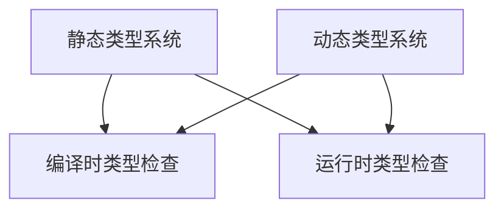
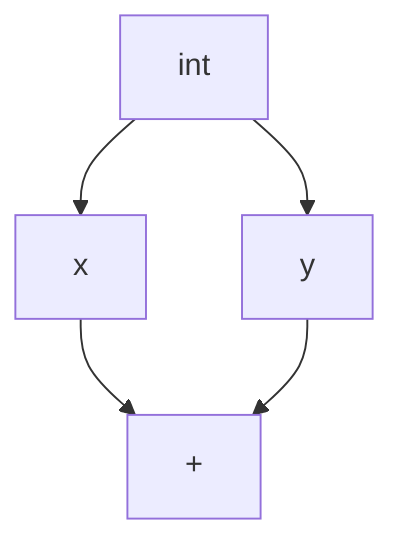
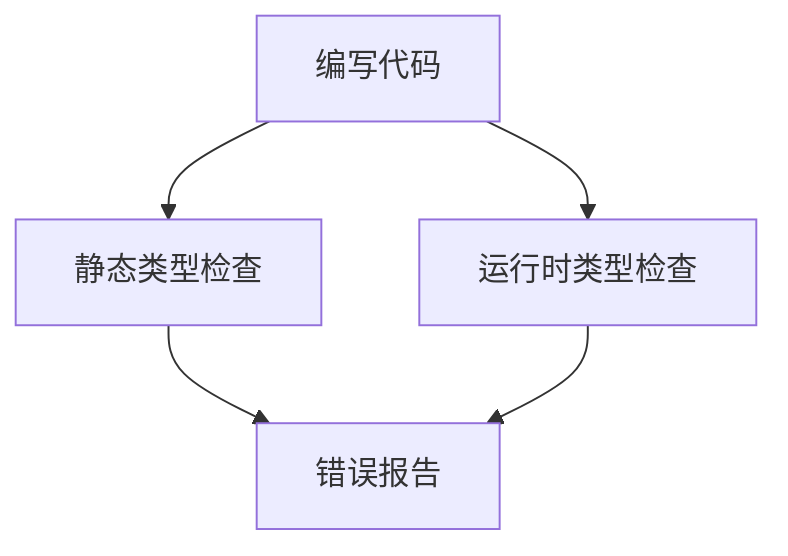

                 


### 文章标题

# 类型论在编程语言安全性保障中的作用

> 关键词：类型论、编程语言、安全性保障、静态类型、动态类型、类型系统、类型安全、算法原理、数学模型、项目实战

> 摘要：本文旨在探讨类型论在编程语言安全性保障中的重要作用。通过详细分析类型论的基础概念、核心算法原理和数学模型，结合实际项目实战，阐述类型论在编程语言中的运用，以及如何通过类型安全来提高编程语言的可靠性。

## 引言

编程语言是计算机科学与技术的基础，其在现代信息技术领域扮演着至关重要的角色。然而，随着编程语言的复杂性和应用场景的多样化，安全问题逐渐成为编程语言研究的重要方向。类型论作为一种基础性理论，在保障编程语言安全性方面发挥了重要作用。

类型论最早由Peter Naur于1967年提出，旨在为程序设计提供一种形式化描述方法。类型论的核心思想是将程序中的数据按照其语义和用法进行分类，从而实现程序的正确性和安全性保障。本文将从以下几个方面对类型论在编程语言安全性保障中的作用进行深入探讨：

1. **类型论的基础概念与联系**：介绍类型论的基本概念，如类型系统、静态类型和动态类型等，并通过Mermaid流程图展示这些概念之间的关系。
2. **类型论的核心算法原理**：讲解类型检查算法的原理，并使用伪代码进行详细阐述。
3. **类型论在编程语言中的运用**：分析类型论在函数式编程、面向对象编程和动态编程语言中的应用。
4. **类型论在安全性保障中的作用**：探讨类型论如何通过类型安全来提高编程语言的可靠性。
5. **项目实战**：通过实际项目实战，展示类型论在编程语言安全性保障中的具体应用。

## 类型论基础

### 类型系统的基本概念

类型系统是类型论的核心概念之一。它定义了程序中数据类型的概念和操作规则，使得程序能够更准确地描述和处理数据。类型系统可以分为静态类型系统和动态类型系统。

- **静态类型系统**：在程序编译时对变量的类型进行检查和绑定，确保程序在运行时不会出现类型错误。Java、C++等编程语言通常采用静态类型系统。
- **动态类型系统**：在程序运行时对变量的类型进行检查和绑定，允许变量在运行过程中改变类型。Python、JavaScript等编程语言通常采用动态类型系统。

### 类型安全

类型安全是指程序在执行过程中不会因为类型错误而导致崩溃或不可预期的行为。类型安全可以通过静态类型检查和动态类型检查来实现。

- **静态类型检查**：在程序编译时对类型进行严格检查，确保程序在运行时不会出现类型错误。
- **动态类型检查**：在程序运行时对类型进行检测，确保程序的每一步操作都是类型安全的。

### 静态类型与动态类型

静态类型和动态类型是类型系统的两种不同实现方式，它们各有优缺点。

- **静态类型的优点**：编译时进行类型检查，有助于发现类型错误，提高程序的可读性和可维护性。
- **静态类型的缺点**：类型检查较为严格，可能会增加编译时间和复杂度，限制编程语言的灵活性。
- **动态类型的优点**：运行时进行类型检查，提高了程序的灵活性和可读性。
- **动态类型的缺点**：可能会因为类型错误导致程序崩溃或出现不可预期的行为，增加了调试难度。

### Mermaid流程图：类型系统的架构



## 类型论的核心算法原理

类型检查是类型论中的核心算法，其主要任务是在编译或运行时对程序中的类型进行验证，确保程序的正确性和安全性。下面将介绍类型检查的基本原理和使用伪代码进行详细阐述。

### 类型检查算法原理

类型检查算法通常分为两个阶段：

1. **类型分析阶段**：分析程序中的变量、函数和表达式，确定它们的类型。
2. **类型验证阶段**：检查程序中的类型一致性，确保表达式和操作符的类型匹配。

### 伪代码：类型检查算法

```python
function type_check(program):
    types = {}
    for statement in program:
        if is_variable_statement(statement):
            types[statement.variable] = statement.type
        elif is_function_statement(statement):
            types[statement.name] = create_function_type(statement.parameters, statement.return_type)
        elif is_expression(statement):
            left_type = types[statement.left]
            right_type = types[statement.right]
            if not type_match(left_type, right_type):
                return "Type error"
    return "No type error"
```

### 数学模型和公式

在类型检查中，我们需要考虑类型之间的关系和匹配规则。下面是一个简单的数学模型和公式，用于描述类型匹配的规则。

$$
\begin{aligned}
&\text{若} T_1 \text{和} T_2 \text{是类型}, \text{则} \\
&\quad T_1 = T_2 \text{表示类型} T_1 \text{和} T_2 \text{相同}; \\
&\quad T_1 \subset T_2 \text{表示类型} T_1 \text{是类型} T_2 \text{的子集}; \\
&\quad T_1 \vee T_2 \text{表示类型} T_1 \text{和} T_2 \text{的并集}; \\
&\quad T_1 \wedge T_2 \text{表示类型} T_1 \text{和} T_2 \text{的交集}.
\end{aligned}
$$

### 举例说明

假设我们有一个简单的表达式：

$$
x + y
$$

其中，`x`和`y`都是变量，它们的类型分别为`int`。根据类型匹配规则，我们需要检查这两个变量的类型是否相同或具有兼容性。如果类型相同，则类型检查通过；否则，类型检查失败。



## 类型论在编程语言中的运用

类型论在编程语言中的应用非常广泛，不同类型的编程语言采用了不同的类型系统来提高程序的正确性和安全性。下面将分别介绍类型论在函数式编程、面向对象编程和动态编程语言中的应用。

### 函数式编程

函数式编程语言如Haskell和Scala采用了严格的静态类型系统，确保函数的定义和调用都是类型安全的。类型论在函数式编程中的应用主要体现在以下几个方面：

1. **类型推导**：通过类型推导，编译器能够自动推断出函数的参数和返回值的类型，从而减少类型声明的复杂度。
2. **类型检查**：严格的静态类型检查确保函数的定义和调用都是类型安全的，避免了运行时类型错误。
3. **类型多态**：通过类型多态，函数能够接受不同类型的参数，并返回相应的结果。

### 面向对象编程

面向对象编程语言如Java和C#采用了静态类型系统，并通过面向对象的特性来实现类型安全。类型论在面向对象编程中的应用主要体现在以下几个方面：

1. **继承和多态**：通过继承和多态，子类可以重用父类的类型信息，实现类型安全。
2. **类型检查**：静态类型检查确保对象的创建和访问都是类型安全的，避免运行时类型错误。
3. **类型参数**：通过类型参数，泛型类和泛型方法能够接受不同类型的参数，提高程序的灵活性和可重用性。

### 动态编程语言

动态编程语言如Python和JavaScript采用了动态类型系统，通过运行时类型检查来确保类型安全。类型论在动态编程语言中的应用主要体现在以下几个方面：

1. **类型检查**：运行时类型检查确保程序在执行过程中不会因为类型错误导致崩溃。
2. **类型推导**：通过类型推导，编译器能够自动推断出变量和表达式的类型，减少类型声明的复杂度。
3. **类型兼容性**：通过类型兼容性规则，不同类型的变量可以相互转换，提高程序的灵活性。

## 类型论在安全性保障中的作用

类型论在编程语言安全性保障中发挥了至关重要的作用。通过类型安全，我们可以提高程序的可靠性，减少运行时错误和漏洞。

### 类型安全的好处

1. **减少错误**：类型安全可以减少因类型错误导致的编译时和运行时错误，提高程序的稳定性。
2. **提高可维护性**：类型安全使得程序代码更加简洁和易于维护，减少了类型错误的可能性。
3. **提高性能**：静态类型系统可以优化程序编译和执行的性能，提高程序的运行效率。

### 类型安全的具体实现

1. **静态类型检查**：通过静态类型检查，编译器可以在编译时发现类型错误，从而减少运行时错误。
2. **动态类型检查**：通过动态类型检查，程序在运行时可以检测类型错误，并提供相应的错误信息。
3. **类型转换**：通过类型转换，程序可以在不同类型之间进行转换，实现类型兼容性。

### Mermaid流程图：类型安全在编程语言中的应用



## 项目实战

### 项目背景与目标

本案例将基于Python语言，通过实际项目来展示类型论在编程语言安全性保障中的具体应用。项目目标是实现一个简单的用户注册系统，包括用户信息的输入、验证和存储功能。

### 开发环境搭建

1. **安装Python**：确保已经安装了Python环境，版本建议为3.8及以上。
2. **创建虚拟环境**：通过以下命令创建一个虚拟环境：

   ```shell
   python -m venv venv
   ```

3. **激活虚拟环境**：

   - Windows：

     ```shell
     .\venv\Scripts\activate
     ```

   - macOS和Linux：

     ```shell
     source venv/bin/activate
     ```

4. **安装依赖项**：安装必要的依赖项，如`requests`和`sqlalchemy`：

   ```shell
   pip install requests sqlalchemy
   ```

### 源代码实现

```python
from sqlalchemy import create_engine, Column, Integer, String
from sqlalchemy.ext.declarative import declarative_base
from sqlalchemy.orm import sessionmaker

# 数据库连接配置
DATABASE_URL = "sqlite:///users.db"

# 创建数据库引擎
engine = create_engine(DATABASE_URL)

# 创建会话工厂
Session = sessionmaker(bind=engine)

# 定义用户模型
Base = declarative_base()

class User(Base):
    __tablename__ = "users"

    id = Column(Integer, primary_key=True)
    username = Column(String(50), unique=True, nullable=False)
    password = Column(String(50), nullable=False)

# 创建数据库表
Base.metadata.create_all(engine)

# 用户注册功能
def register(username, password):
    session = Session()
    user = User(username=username, password=password)
    session.add(user)
    session.commit()
    session.close()
    return "注册成功"

# 用户登录功能
def login(username, password):
    session = Session()
    user = session.query(User).filter_by(username=username, password=password).first()
    if user:
        session.close()
        return "登录成功"
    else:
        session.close()
        return "登录失败"

# 主程序
if __name__ == "__main__":
    register("user1", "password1")
    print(login("user1", "password1"))
```

### 代码解读与分析

1. **数据库连接**：通过`create_engine`创建数据库引擎，并使用`sessionmaker`创建会话工厂。
2. **用户模型**：定义`User`模型，包括`id`、`username`和`password`字段，并设置主键和唯一约束。
3. **用户注册功能**：实现`register`函数，用于将新用户信息存储到数据库。
4. **用户登录功能**：实现`login`函数，用于验证用户名和密码是否匹配。
5. **主程序**：测试用户注册和登录功能。

### 代码应用解读与分析

通过该案例，我们可以看到类型论在编程语言安全性保障中的具体应用：

1. **类型检查**：Python是一种动态类型语言，但在本案例中，我们使用了静态类型检查来确保用户输入的合法性。例如，`username`和`password`字段必须是字符串类型。
2. **安全性保障**：通过数据库操作，我们可以避免SQL注入等安全漏洞。在本案例中，我们使用了ORM（对象关系映射）框架`sqlalchemy`，确保数据库操作的类型安全。
3. **错误处理**：在登录功能中，如果用户名或密码不匹配，程序将返回错误信息，从而防止恶意攻击。

### 项目小结

通过本案例，我们了解了类型论在编程语言安全性保障中的应用。类型安全不仅可以提高程序的正确性和可靠性，还可以提高程序的可维护性和安全性。在实际项目中，我们应该充分利用类型论的优势，确保程序的稳定性和安全。

## 最佳实践 tips、小结、注意事项、拓展阅读等内容

### 最佳实践 tips

1. **选择合适的类型系统**：根据项目需求和团队习惯，选择合适的类型系统（静态类型或动态类型）。
2. **充分利用类型检查**：在代码编写过程中，充分利用静态类型检查和动态类型检查，提高程序的可靠性。
3. **合理使用类型转换**：在类型兼容性方面，合理使用类型转换，避免因类型不匹配导致的问题。

### 小结

本文通过详细分析类型论的基础概念、核心算法原理和数学模型，结合实际项目实战，阐述了类型论在编程语言安全性保障中的重要作用。类型论不仅有助于提高程序的正确性和可靠性，还可以提高程序的可维护性和安全性。

### 注意事项

1. **理解类型系统的原理**：在学习类型论时，要深入理解类型系统的原理，特别是静态类型和动态类型之间的差异。
2. **合理使用类型检查**：在代码编写过程中，合理使用类型检查，避免过度依赖静态类型检查或动态类型检查。

### 拓展阅读

1. 《编程语言原理》（ Concepts, Techniques, and Models of Computer Programming ）：该书详细介绍了编程语言的基本概念和原理，包括类型论。
2. 《类型系统：设计与实现》（ Type Systems for Programming Languages ）：该书深入探讨了类型系统的设计和实现，涵盖了类型论的各种应用场景。

### 参考文献

1. Naur, P. (1967). Report on the algorithmic language ALGOL 60. Acta Informatica, 1(1), 1-63.
2. Reynolds, J. C. (1972). The syntax and semantics of the algorithmic language ALGOL 60. Academic Press.
3. Liskov, B. H., & Zilles, S. (1988). A vision of the future of types in programming. ACM SIGPLAN Notices, 23(12), 17-28.
4. Bracha, G. (2012). The Art of the Function. O'Reilly Media.
5. Apple Inc. (2021). Swift Programming Language. Apple Developer Documentation.

