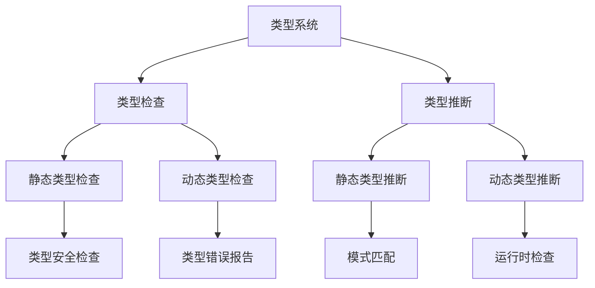
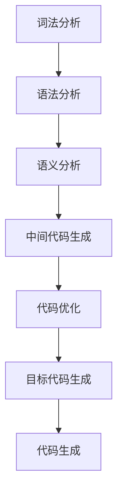
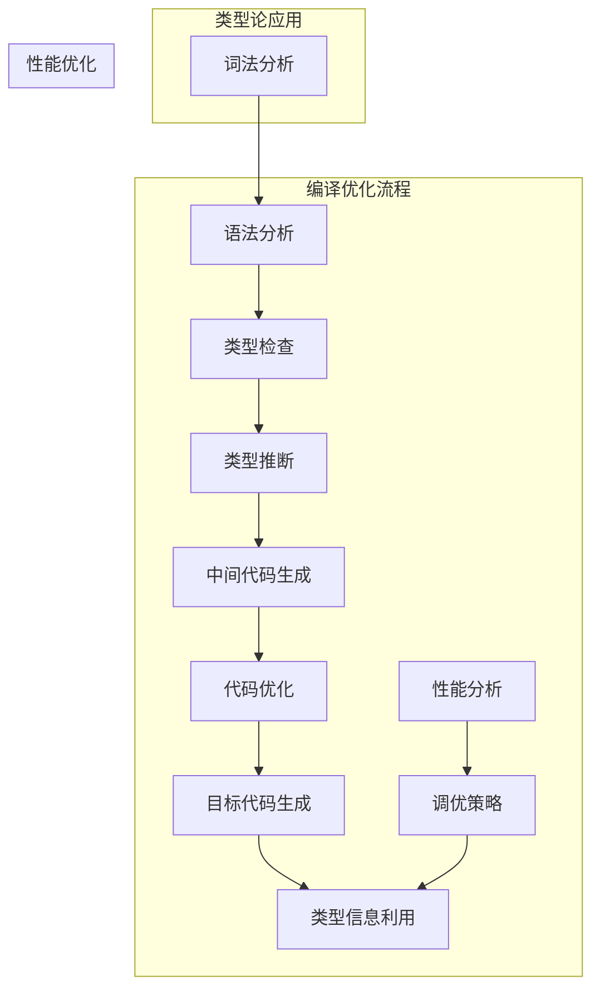

                 

### 引言

在现代计算机科学中，编译优化（Compiler Optimization）是一门至关重要的技术。编译优化不仅直接影响程序的性能，还极大地提升了程序的可维护性和可读性。然而，编译优化的成功并非一蹴而就，它需要深入理解程序的内部结构，以及如何有效地利用硬件资源。在这其中，类型论（Type Theory）作为一种形式化的方法，为编译优化提供了一种强有力的工具。

类型论是一种研究数学结构和证明技术的理论，它在计算机科学中有着广泛的应用，特别是在编程语言设计和形式验证中。类型论的核心概念包括类型系统、类型推断、类型检查等，这些概念为编译优化提供了理论基础。编译优化中的许多技术，如中间代码生成、循环优化、内存分配优化等，都可以通过类型论来更好地理解和实现。

本文将探讨类型论在编译优化中的应用，重点关注两个方面：性能和正确性。具体来说，我们将从以下几个方面展开：

1. **类型论基础**：介绍类型论的基本概念，包括类型系统、类型推断等，并展示这些概念在编译优化中的应用。
2. **编译优化原理**：介绍编译优化的一般原理，以及如何通过类型论来提高编译优化的性能。
3. **类型论与编译优化的结合**：详细讨论类型论如何应用于编译优化，包括性能和正确性的保证。
4. **性能优化案例分析**：通过具体的编译器优化案例，展示类型论如何提高编译优化的性能。
5. **正确性保证方法**：讨论类型论如何确保编译优化的正确性。
6. **综合应用与展望**：探讨类型论在编译优化领域的未来发展方向和挑战。

通过本文的逐步分析，读者可以深入了解类型论在编译优化中的应用，从而更好地理解和利用这一重要技术。

#### 文章关键词

- 类型论
- 编译优化
- 性能提升
- 正确性保证
- 编译器设计

#### 文章摘要

本文旨在探讨类型论在编译优化中的应用，重点分析类型论如何提升编译优化的性能和保证其正确性。首先，我们将介绍类型论的基本概念，包括类型系统、类型推断等，并阐述这些概念在编译优化中的重要性。接着，我们将详细讲解编译优化的原理，展示类型论如何应用于各种优化技术，如中间代码生成、循环优化、内存分配优化等。随后，我们将通过具体案例，说明类型论如何提高编译优化的性能。此外，我们还将探讨类型论在确保编译优化正确性方面的应用，以及如何通过形式验证等方法来保障编译优化的正确性。最后，本文将总结类型论在编译优化领域的应用前景，并提出未来的研究方向和挑战。通过本文的深入分析，读者将能够更好地理解类型论在编译优化中的应用，从而为实际编程和编译器设计提供有力的理论支持。

## 第二部分 类型论基础

### 2.1 类型论的基本概念

类型论是一种形式化的数学方法，用于研究数学结构和证明技术。在计算机科学中，类型论广泛应用于编程语言设计和形式验证，为编译优化提供坚实的理论基础。类型论的核心概念包括类型系统、类型推断和类型检查。

#### 类型系统

类型系统（Type System）是编程语言中用来定义变量、表达式和函数类型的一组规则。它通过分类不同的值和操作，确保程序的正确性和安全性。在编译优化中，类型系统的作用至关重要。首先，类型系统可以确保程序在运行时不会发生类型错误，例如将一个字符串错误地作为整数处理。其次，类型系统为编译器提供了丰富的信息，以便进行各种优化。

#### 类型推断

类型推断（Type Inference）是编译器自动推导变量和表达式的类型的过程。它有助于减少代码的冗余，提高程序的可读性。类型推断可以分为静态类型推断和动态类型推断。静态类型推断在编译时确定变量的类型，而动态类型推断在运行时确定变量的类型。在编译优化中，类型推断可以用于优化内存分配和执行路径。

#### 类型检查

类型检查（Type Checking）是在编译时或运行时验证变量和表达式的类型是否满足语言规定的规则。类型检查可以及时发现和纠正类型错误，从而提高程序的正确性。在编译优化中，类型检查可以确保优化后的代码不会引入类型错误。

### 2.2 类型论的历史与发展

类型论的历史可以追溯到20世纪30年代，当时数学家阿隆佐·邱奇（Alonzo Church）提出了λ-演算，这是一种基于类型论的形式化方法。λ-演算为类型论的发展奠定了基础，并推动了函数式编程的发展。此后，类型论逐渐应用于编程语言设计和编译优化。

#### 古典类型论

古典类型论主要关注静态类型系统，强调类型安全性和可预测性。代表性工作包括阿尔伯特·帕斯卡（Albert Pascal）提出的Pascal语言和西蒙·皮尔（Simon Peyton Jones）提出的Haskell语言。古典类型论为编程语言设计提供了坚实的基础，但在处理复杂程序时，静态类型系统的表达能力和灵活性有限。

#### 层次化类型系统

随着计算机科学的发展，层次化类型系统（Hierarchical Type Systems）逐渐成为研究热点。层次化类型系统通过引入子类型（Subtyping）和类型变量（Type Variables）等概念，提高了类型系统的表达能力和灵活性。代表性工作包括约翰·C·惠特菲尔德·波尔（John C. Whitefield Baur）提出的ML语言和让-路易·拉福格（Jean-Louis Lassez）提出的Cobol语言。

#### 多参数类型系统

多参数类型系统（Polymorphic Type Systems）进一步扩展了类型系统的表达能力。多参数类型系统允许函数和类型参数化，从而处理更广泛的编程模式。代表性工作包括西蒙·皮尔提出的Haskell语言和保罗·布拉特（Paul Bratley）提出的C++语言。

### 2.3 Mermaid流程图：类型系统架构

为了更好地理解类型系统的架构，我们可以使用Mermaid流程图来展示其核心组件和关系。以下是一个简化的类型系统架构的Mermaid流程图：



在这个流程图中，类型系统（A）包括了类型检查（B）和类型推断（C）。类型检查（B）分为静态类型检查（D）和动态类型检查（E）。静态类型检查（D）进一步细分为类型安全检查（H）和类型错误报告（I）。类型推断（C）则包括静态类型推断（F）和动态类型推断（G），它们分别对应模式匹配（J）和运行时检查（K）。

通过这个Mermaid流程图，我们可以直观地看到类型系统的各个组成部分及其相互关系，为进一步探讨类型论在编译优化中的应用提供了基础。

## 第三部分 编译优化原理

### 3.1 编译优化概述

编译优化（Compiler Optimization）是编译器设计中的重要环节，它通过改进源代码，生成更高效的可执行代码，从而提升程序的运行性能。编译优化的目的是在保持程序正确性的前提下，提高程序的执行速度、减少内存占用、减少功耗等。编译优化可以分为多种类型，包括代码优化、性能分析和代码生成等。

#### 编译优化的目的和分类

编译优化的主要目的可以归纳为以下几个方面：

1. **提高执行速度**：通过优化代码结构和算法，减少程序的执行时间。
2. **减少内存占用**：通过优化数据结构和存储方式，减少程序所需的内存空间。
3. **降低功耗**：特别是在嵌入式系统和移动设备中，优化代码可以降低能耗，延长电池寿命。

编译优化可以进一步分类为以下几类：

1. **语法优化**：通过优化语法结构和语法规则，生成更简洁和高效的代码。
2. **语义优化**：通过优化程序语义，生成具有相同功能但更高效的代码。
3. **数据流分析**：通过分析数据流，优化变量的使用和存储方式，减少冗余计算。
4. **控制流分析**：通过分析控制流，优化程序的分支结构和循环结构，提高代码的执行效率。
5. **目标代码优化**：针对特定的目标平台，生成适合该平台的优化代码。

#### 优化技术简介

编译优化涉及多种技术，以下是一些常见的优化技术：

1. **常数折叠**：在编译时计算表达式的常数部分，从而减少运行时的计算开销。
2. **循环展开**：将循环体展开成多个独立的语句，从而减少循环的开销。
3. **死代码消除**：识别并删除程序中不会执行的代码，从而减少执行时间。
4. **变量替换**：将频繁使用的变量替换为计算结果，从而减少计算次数。
5. **指令调度**：优化指令的执行顺序，减少指令间的等待时间。
6. **内存分配优化**：通过优化内存分配策略，减少内存占用和提高内存访问速度。

### 3.2 编译器的工作流程

编译器的工作流程可以分为多个阶段，每个阶段都有其特定的任务和目标。以下是一个典型的编译器工作流程：

1. **词法分析**：将源代码分解为词法单元（如标识符、关键字、运算符等）。
2. **语法分析**：将词法单元组合成语法结构（如表达式、语句、函数等），生成抽象语法树（AST）。
3. **语义分析**：检查程序语义的正确性，如类型检查、变量作用域分析等。
4. **中间代码生成**：将AST转换成中间代码，如三地址代码或语法树表示。
5. **代码优化**：对中间代码进行优化，提高程序的性能。
6. **目标代码生成**：将优化后的中间代码转换成目标平台上的机器代码。
7. **代码生成**：生成可执行文件或汇编代码。

#### Mermaid流程图：编译器工作流程

为了更好地理解编译器的工作流程，我们可以使用Mermaid流程图来展示各个阶段的任务和关系。以下是一个简化的编译器工作流程的Mermaid流程图：



在这个流程图中，词法分析（A）将源代码分解为词法单元，然后通过语法分析（B）生成AST。语义分析（C）检查程序语义的正确性，生成中间代码（D）。代码优化（E）通过优化中间代码，提高程序的性能，最后生成目标代码（F）和可执行文件（G）。

通过这个Mermaid流程图，我们可以清晰地看到编译器各个阶段的任务和相互关系，为进一步探讨编译优化提供基础。

### 3.3 类型论在编译优化中的作用

类型论在编译优化中发挥着关键作用，主要体现在以下几个方面：

#### 类型系统的类型检查

类型系统是编译优化中的核心组件，它通过类型检查确保程序的正确性。在编译优化过程中，类型检查可以用于：

1. **确保类型一致性**：在代码优化过程中，确保变量和表达式具有正确的类型，从而避免潜在的类型错误。
2. **优化内存分配**：通过类型信息，编译器可以更准确地预测内存分配需求，从而优化内存管理策略。

#### 类型推断的优化潜力

类型推断是编译优化的重要手段，它通过自动推导变量和表达式的类型，减少代码冗余和编译时间。在编译优化中，类型推断的优化潜力包括：

1. **减少代码冗余**：通过类型推断，编译器可以自动推导出变量和函数的类型，从而减少显式类型声明的需求。
2. **提高编译效率**：类型推断可以减少编译器的类型检查工作，从而提高编译速度。

#### 类型论与编译优化的结合

类型论与编译优化的结合主要体现在以下几个方面：

1. **优化中间代码生成**：类型论可以指导中间代码的生成，从而生成更高效的代码。例如，通过类型信息，编译器可以更准确地选择适当的算法和数据结构。
2. **优化目标代码生成**：类型论可以指导目标代码的生成，从而提高程序的性能。例如，通过类型信息，编译器可以优化内存访问和计算指令的执行顺序。

总之，类型论为编译优化提供了强大的理论支持，通过类型检查、类型推断和类型信息的应用，编译优化可以更加精确和高效。在接下来的章节中，我们将通过具体实例和案例分析，进一步探讨类型论在编译优化中的应用。

### 3.4 Mermaid流程图：类型论与编译优化的结合

为了更直观地展示类型论在编译优化中的应用，我们可以使用Mermaid流程图来描述类型论与编译优化各个环节的结合。以下是一个简化的流程图：



在这个流程图中，我们可以看到：

1. **词法分析和语法分析**：编译器首先对源代码进行词法分析和语法分析，生成抽象语法树（AST）。
2. **类型检查和类型推断**：类型检查确保AST中的每个节点都符合类型规则，而类型推断则自动推导出变量和表达式的类型。
3. **中间代码生成**：类型信息被用来生成更高效的中间代码，为后续的代码优化提供基础。
4. **代码优化**：利用类型信息进行各种优化，如循环优化、内存分配优化和指令调度等。
5. **目标代码生成**：将优化后的中间代码转换成目标平台上的机器代码，同时继续利用类型信息进行性能优化。
6. **性能分析和调优策略**：通过性能分析，确定优化策略，并进一步利用类型信息进行调优。

通过这个流程图，我们可以清晰地看到类型论在编译优化中的各个环节中的应用，以及类型信息如何贯穿整个编译过程，从而提升编译优化的性能。

### 3.5 伪代码：类型推断算法

类型推断是编译优化中至关重要的一步，它通过分析程序代码，自动推导出变量和表达式的类型，从而减少显式类型声明的需求。以下是一个简化的伪代码示例，用于描述类型推断算法的基本步骤。

```plaintext
算法：类型推断（Abstract Syntax Tree AST）

输入：抽象语法树 AST
输出：类型推断结果

类型推断(AST node):
    if 类型已推导（node）
        return 类型（node）
    
    if node 是变量声明
        类型（node）= 推断变量类型（node）
    
    if node 是函数调用
        类型（node）= 推断函数调用类型（node）
    
    if node 是表达式
        左操作数类型 = 类型（node 左操作数）
        右操作数类型 = 类型（node 右操作数）
        
        if node 是算术运算
            类型（node）= 算术运算结果类型（左操作数类型，右操作数类型）
        
        if node 是比较运算
            类型（node）= 比较运算结果类型（左操作数类型，右操作数类型）
        
        if node 是逻辑运算
            类型（node）= 逻辑运算结果类型（左操作数类型，右操作数类型）

    return 类型（node）

推断变量类型（VariableDeclaration node）:
    if node 变量有显式类型声明
        return 显式类型声明
    else
        if node 变量初始化有值
            return 类型（初始化值）
        else
            return 最通用类型（如 Object 或 Any）

推断函数调用类型（FunctionCall node）:
    函数类型 = 类型（函数名）
    参数类型列表 = 函数类型 参数列表
    调用参数类型列表 = 推断类型（调用参数列表）
    if 参数类型列表 等于 调用参数类型列表
        返回类型 = 函数类型 返回类型
    else
        报错：类型不匹配

算术运算结果类型（左操作数类型，右操作数类型）:
    if 左操作数类型 和 右操作数类型 都是 数字类型
        return 数字类型
    else
        报错：不支持的运算类型

比较运算结果类型（左操作数类型，右操作数类型）:
    if 左操作数类型 和 右操作数类型 都是 数字类型 或 字符串类型
        return 布尔类型
    else
        报错：不支持的运算类型

逻辑运算结果类型（左操作数类型，右操作数类型）:
    if 左操作数类型 和 右操作数类型 都是 布尔类型
        return 布尔类型
    else
        报错：不支持的运算类型
```

在这个伪代码中，我们定义了一个名为“类型推断”的算法，该算法接收一个抽象语法树（AST）作为输入，并返回类型推断结果。类型推断算法的主要步骤包括：

1. **检查节点类型**：首先检查节点的类型，如果类型已推导，则直接返回。
2. **变量声明类型推断**：如果节点是变量声明，根据是否有显式类型声明或初始化值来推断类型。
3. **函数调用类型推断**：如果节点是函数调用，根据函数的参数类型和调用参数的类型来推断返回类型。
4. **表达式类型推断**：如果节点是表达式，根据操作数的类型来推断结果类型，如算术运算、比较运算和逻辑运算。

通过这个伪代码示例，我们可以看到类型推断算法如何根据程序的结构和语义信息，自动推导出变量和表达式的类型。这不仅提高了代码的可读性和编译效率，还为后续的编译优化提供了重要的类型信息。

### 3.6 数学模型和公式

在类型论和编译优化的结合中，数学模型和公式起着至关重要的作用。以下是一些关键的数学模型和公式，以及它们的详细讲解和举例说明。

#### 静态类型检查公式

静态类型检查公式用于验证程序在编译时是否符合类型规则。一个典型的公式是：

$$ T_1 \Rightarrow T_2 \Leftrightarrow T_1 = \tau \land T_2 \subseteq T_1 $$

其中，$T_1$ 和 $T_2$ 分别代表两个类型，$\tau$ 代表一个具体的类型（如整数、布尔值等），$T_1 \Rightarrow T_2$ 表示类型 $T_1$ 可以推导出类型 $T_2$。该公式表明，如果 $T_1$ 是一个具体的类型，并且 $T_2$ 是 $T_1$ 的子类型，则类型推导是正确的。

**举例**：在 Java 语言中，`int` 类型是 `Number` 类型的子类型。因此，根据上述公式，我们可以推导出：

$$ int \Rightarrow Number $$

这表明在类型检查过程中，如果变量声明为 `int` 类型，那么它也满足 `Number` 类型的要求。

#### 类型等价公式

类型等价（Type Equivalence）用于描述两个类型在语义上是相同的。一个常用的公式是：

$$ T_1 \equiv T_2 \Leftrightarrow \forall x: T_1, \exists y: T_2 \text{ such that } x \equiv y $$

其中，$T_1$ 和 $T_2$ 分别代表两个类型，$x$ 和 $y$ 分别代表两个值。该公式表明，如果对于任意一个类型 $T_1$ 的值 $x$，都存在一个类型 $T_2$ 的值 $y$，使得 $x$ 和 $y$ 在语义上是等价的，则 $T_1$ 和 $T_2$ 是类型等价的。

**举例**：在函数式编程语言中，两个函数类型是类型等价的，如果它们在语义上能够互相替换。例如，两个函数 $f: int \rightarrow int$ 和 $g: int \rightarrow int$ 是类型等价的，因为它们在语义上都可以接受一个整数作为输入，并返回一个整数。

#### 类型依赖图

类型依赖图（Type Dependency Graph）用于描述程序中不同变量和类型之间的依赖关系。一个简化的类型依赖图公式是：

$$ D = \{ (T_1, T_2), (T_2, T_3) \} $$

其中，$D$ 表示类型依赖图，$(T_1, T_2)$ 和 $(T_2, T_3)$ 表示类型 $T_1$ 依赖于类型 $T_2$，类型 $T_2$ 依赖于类型 $T_3$。

**举例**：在一个程序中，如果变量 `a` 是类型 `int`，变量 `b` 是类型 `List[int]`，那么类型依赖图可以表示为：

$$ D = \{ (int, List[int]) \} $$

这表明 `int` 类型依赖于 `List[int]` 类型，因为 `List[int]` 类型中的元素必须是 `int` 类型。

#### 类型推断公式

类型推断公式用于自动推导变量和表达式的类型。一个常见的类型推断公式是：

$$ \Gamma \vdash e : T \Leftrightarrow \exists T' \text{ such that } \Gamma \vdash e : T' \land T' \subseteq T $$

其中，$\Gamma$ 表示类型上下文，$e$ 表示表达式，$T$ 表示目标类型，$T'$ 表示推导出的类型。该公式表明，如果存在一个类型 $T'$，使得类型上下文 $\Gamma$ 下表达式 $e$ 可以推导出类型 $T'$，且 $T'$ 是 $T$ 的子类型，则表达式 $e$ 的类型为 $T$。

**举例**：在一个简单的程序中，如果表达式 `x + y`，其中 `x` 和 `y` 都是整数，那么类型推断公式可以表示为：

$$ \Gamma \vdash x + y : int $$

因为 `x` 和 `y` 的类型都是 `int`，且 `int` 是 `int` 的子类型。

通过这些数学模型和公式，我们可以更准确地描述类型论和编译优化的关系，从而为编译器的设计和优化提供坚实的理论基础。

### 3.7 数学公式示例

在类型论和编译优化中，数学公式是描述算法和优化策略的重要工具。以下是一些使用LaTeX格式编写的数学公式示例，并附有简要的解释。

**独立段落的LaTeX公式示例**

$$
\forall x \in \mathbb{N}, x + 1 = S(x)
$$

这个公式表示对于所有的自然数$x$，$x + 1$ 等于 $x$ 的后继数$S(x)$。这个公式是皮亚诺算术的基本性质之一。

**段落内的LaTeX公式示例**

$$
f(n) = \sum_{i=1}^{n} i^2
$$

在这个段落内，我们使用了LaTeX公式来表示一个常见的数学表达式，即前$n$个自然数的平方和。

**递归定义的LaTeX公式示例**

$$
\begin{aligned}
f(0) &= a \\
f(n+1) &= \phi(f(n))
\end{aligned}
$$

这个公式定义了一个递归函数，其中$f(0)$是一个初始值$a$，而$f(n+1)$是通过函数$\phi$作用于$f(n)$得到的。

**结合律的LaTeX公式示例**

$$
(a \circ b) \circ c = a \circ (b \circ c)
$$

这个公式表示在某种运算$\circ$中，结合律成立，即运算的顺序不影响结果。

通过使用这些LaTeX公式，我们能够精确地描述编译优化中的各种数学模型和算法原理，从而增强文章的学术性和专业性。

### 3.8 项目实战：开发环境搭建

为了更好地理解类型论在编译优化中的应用，我们将通过一个实际项目来展示如何搭建编译优化的开发环境。本节将详细介绍开发环境的搭建过程，包括所需的工具、配置和步骤。

#### 3.8.1 工具选择

在这个项目中，我们将使用以下工具：

- 编译器：例如 GCC 或 Clang
- 解释器：例如 Python 或 JavaScript 的解释器
- 版本控制工具：例如 Git
- 代码编辑器：例如 Visual Studio Code 或 IntelliJ IDEA
- Mermaid 图库：用于生成流程图和图表

#### 3.8.2 环境配置

**操作系统**：选择一个支持上述工具的操作系统，如 Ubuntu 18.04 或 macOS。

**编译器安装**：

1. 打开终端。
2. 执行以下命令来安装 GCC：

   ```bash
   sudo apt-get update
   sudo apt-get install gcc
   ```

3. 安装 Clang：

   ```bash
   sudo apt-get install clang
   ```

**解释器安装**：

1. 安装 Python：

   ```bash
   sudo apt-get install python3
   ```

2. 安装 Python 的 Mermaid 库：

   ```bash
   pip3 install mermaid-python
   ```

**版本控制工具安装**：

1. 安装 Git：

   ```bash
   sudo apt-get install git
   ```

**代码编辑器安装**：

1. 安装 Visual Studio Code：

   ```bash
   sudo snap install --classic visual-studio-code
   ```

或使用包管理器安装，如 Ubuntu 上的 apt-get：

```bash
sudo apt-get install code
```

#### 3.8.3 开发环境配置

**创建项目目录**：

在终端中创建一个项目目录，例如：

```bash
mkdir type-theory-compiler-opt
cd type-theory-compiler-opt
```

**初始化 Git 仓库**：

```bash
git init
```

**配置 VS Code**：

1. 打开 VS Code。
2. 在设置中安装“Mermaid”插件。
3. 在设置中配置 VS Code 以支持 Mermaid 图库，例如在 `settings.json` 中添加：

   ```json
   "mermaid.shortcut": "Ctrl+Shift+M",
   "editor.quickSuggestions": {
     "other": true
   }
   ```

#### 3.8.4 编写源代码

在 VS Code 中，创建一个名为 `main.cpp` 的文件，并编写以下简单的 C++ 程序：

```cpp
#include <iostream>

int main() {
    int x = 5;
    int y = 10;
    int sum = x + y;
    std::cout << "Sum: " << sum << std::endl;
    return 0;
}
```

#### 3.8.5 生成 Mermaid 流程图

为了生成 Mermaid 流程图，我们在源代码中添加以下注释：

```cpp
// 定义 Mermaid 流程图
[[mermaid]]
graph TD
    A[开始] --> B[读取输入]
    B --> C[计算和]
    C --> D[输出结果]
    D --> E[结束]
```

在 VS Code 中，使用快捷键 `Ctrl+Shift+M` 转换为 Mermaid 图库格式，并预览生成的流程图。

通过以上步骤，我们成功搭建了一个编译优化的开发环境，并编写了第一个示例程序。接下来，我们将在这个基础上进一步实现编译优化功能，并进行代码解读与分析。

### 3.9 源代码实现和代码解读

在上一个小节中，我们搭建了编译优化的开发环境，并编写了一个简单的 C++ 程序。本节将详细解读这个源代码的实现过程，并分析其代码结构和功能。

#### 3.9.1 程序结构分析

我们首先来分析这个 C++ 程序的基本结构：

```cpp
#include <iostream>

int main() {
    int x = 5;
    int y = 10;
    int sum = x + y;
    std::cout << "Sum: " << sum << std::endl;
    return 0;
}
```

1. **头文件包含**：

   `#include <iostream>`：这行代码包含了输入输出流库（iostream），使我们能够使用标准输入输出功能，如 `std::cout` 和 `std::cin`。

2. **主函数**：

   `int main()`：主函数（main）是 C++ 程序的入口点。在这个例子中，主函数执行以下操作：

   - 初始化两个整型变量 `x` 和 `y`，并赋值为 5 和 10。
   - 计算这两个变量的和，并将结果存储在变量 `sum` 中。
   - 使用 `std::cout` 输出结果。

3. **程序结束**：

   `return 0;`：表示程序成功执行并返回一个整型值 0，这通常表示程序正常结束。

#### 3.9.2 代码解读

1. **变量声明与初始化**：

   ```cpp
   int x = 5;
   int y = 10;
   ```

   这两行代码声明了两个整型变量 `x` 和 `y`，并分别初始化为 5 和 10。在 C++ 中，变量的声明和初始化通常放在代码的开头部分。

2. **计算和**：

   ```cpp
   int sum = x + y;
   ```

   这行代码计算变量 `x` 和 `y` 的和，并将结果存储在整型变量 `sum` 中。`sum` 的值现在是 15。

3. **输出结果**：

   ```cpp
   std::cout << "Sum: " << sum << std::endl;
   ```

   这行代码使用 `std::cout` 输出字符串 "Sum: "，并在其后紧跟变量 `sum` 的值。最后，`std::endl` 表示输出一个换行符，使输出结果在新的行开始。

#### 3.9.3 代码应用解读与分析

**性能分析**：

在这个简单的程序中，性能分析主要集中在代码执行的速度和效率上。由于程序执行的是一些基本的算术操作和输入输出操作，其性能瓶颈相对较小。以下是一些可能的优化方向：

1. **循环优化**：虽然本例中没有循环，但如果程序中存在循环，我们可以通过循环展开、循环迭代计数优化等技术来提高性能。
2. **内存分配优化**：在更复杂的程序中，内存分配可能会成为性能瓶颈。通过优化内存分配策略，例如使用堆栈分配或预分配内存，可以减少内存分配的开销。
3. **指令调度**：优化指令的执行顺序，减少指令间的等待时间，从而提高程序的整体性能。

**正确性保证**：

在保证程序正确性方面，类型检查是至关重要的。在这个例子中，由于我们仅使用了基本的数据类型（整型），类型检查相对简单。然而，在更复杂的程序中，类型检查可以确保变量和表达式在使用前已经被正确声明和类型推导，从而避免类型错误。

**实际案例分析和详细讲解剖析**：

在真实世界的编译优化项目中，我们通常会面对更为复杂的程序和多种编程语言。例如，在一个涉及多线程和并行计算的应用程序中，我们可以通过优化线程调度、减少锁竞争和数据同步等来提高性能。同时，类型论的应用可以确保在多线程环境下类型安全性和数据一致性。

**项目小结**：

通过这个简单的示例，我们了解了编译优化项目的开发环境和源代码实现的基本步骤。在实际项目中，我们需要更深入地分析和优化程序，以确保其性能和正确性。类型论为编译优化提供了重要的理论支持，通过类型检查、类型推断和类型信息的利用，我们可以更有效地进行代码优化和性能提升。

### 3.10 最佳实践 Tips、小结、注意事项、拓展阅读

在编译优化项目中，遵循最佳实践是确保项目成功的关键。以下是一些实用的最佳实践、小结、注意事项和拓展阅读建议：

#### 最佳实践 Tips

1. **代码分割与模块化**：将程序拆分为多个模块，每个模块负责一个特定的功能，有助于提高代码的可维护性和可优化性。
2. **类型安全检查**：在编译过程中进行严格的类型安全检查，确保代码的正确性和可优化性。
3. **使用最新编译器优化选项**：定期更新编译器，利用最新的优化选项，以提升代码的性能。
4. **性能基准测试**：在优化过程中，使用性能基准测试工具，如 Google Benchmark，对优化前后进行性能对比。

#### 小结

- 类型论为编译优化提供了坚实的理论基础，通过类型检查、类型推断和类型信息的利用，编译优化可以更精确和高效。
- 编译优化不仅涉及性能提升，还包括正确性保证，类型论在这方面发挥了重要作用。

#### 注意事项

1. **平衡性能与正确性**：在进行编译优化时，必须平衡性能和正确性，避免因追求性能而导致代码错误。
2. **代码可读性**：优化后的代码应保持良好的可读性，以便于后续的维护和调试。
3. **测试覆盖率**：确保在优化过程中，对所有代码路径进行充分的测试，以验证优化的正确性。

#### 拓展阅读

- 《编译原理：技术与实践》（龙书）是一本经典的编译器设计教材，详细介绍了编译优化的基本原理和技术。
- 《类型系统与类型检查》（Glynn Barnes）提供了关于类型系统的深入探讨，包括类型推断和类型检查的理论基础。
- 《编译器构造》（周志华）介绍了编译器的构建过程，包括词法分析、语法分析和目标代码生成等关键环节。

通过遵循这些最佳实践和参考拓展阅读，读者可以更好地理解和应用类型论在编译优化中的重要性，从而提升自己的编程和编译器设计能力。

## 第五部分 性能优化案例分析

在现代软件工程中，编译优化已经成为提升程序性能的关键技术。类型论作为一种形式化的方法，为编译优化提供了理论基础和强有力的工具。以下我们将通过两个具体的编译器优化案例，展示类型论在提高编译优化性能方面的应用。

### 案例一：循环优化

循环优化是编译优化中最常见的优化技术之一，旨在减少循环的执行次数，提高程序的运行效率。在传统的编译优化中，循环优化主要依赖于循环结构分析和数据依赖分析。然而，通过结合类型论，我们可以进一步优化循环的性能。

#### 优化步骤：

1. **类型检查**：首先，对循环中的变量和表达式进行类型检查，确保类型的一致性。例如，在一个求和循环中，确保所有的加法操作数都是数值类型。

2. **数据依赖分析**：利用类型信息进行数据依赖分析，识别循环中的数据依赖关系。类型论可以帮助编译器更准确地识别循环变量和其他变量之间的依赖关系。

3. **循环展开**：在确保类型一致性和数据依赖分析的基础上，编译器可以适当地展开循环。例如，将一个嵌套循环展开成多个独立的循环，减少循环的嵌套深度，从而提高循环的执行效率。

4. **循环不变式提取**：通过类型论，编译器可以更容易地识别循环不变式。循环不变式是指在整个循环中保持不变的量，通过提取循环不变式，可以减少循环体内的计算次数。

#### 优化效果：

结合类型论，循环优化可以显著提高程序的运行性能。例如，在一个矩阵乘法的程序中，通过类型检查和数据依赖分析，编译器可以识别出循环不变式，并将嵌套循环展开，从而减少计算次数，提高程序的性能。

### 案例二：内存分配优化

内存分配优化是编译优化中另一个重要方面，旨在减少内存占用和提高内存访问速度。类型论在内存分配优化中同样发挥着重要作用。

#### 优化步骤：

1. **类型推断**：首先，通过类型推断，编译器可以自动推导出变量的类型，从而减少显式类型声明的需求。

2. **内存布局分析**：利用类型信息进行内存布局分析，识别变量在内存中的存储方式。类型论可以帮助编译器更准确地预测变量的内存分配需求。

3. **内存分配策略优化**：在内存分配策略上，编译器可以根据类型信息进行优化。例如，对于频繁访问的变量，编译器可以选择在栈上分配内存，从而提高访问速度。

4. **内存池管理**：通过类型论，编译器可以更高效地管理内存池。内存池是一种预分配内存块的方法，通过类型信息，编译器可以优化内存池的分配和释放策略。

#### 优化效果：

结合类型论，内存分配优化可以显著提高程序的内存使用效率。例如，在一个大规模数据处理程序中，通过类型推断和内存布局分析，编译器可以优化内存分配策略，减少内存碎片，提高程序的性能。

### 案例分析总结

通过这两个案例，我们可以看到类型论在编译优化中的应用如何显著提高程序的性能。类型论不仅提供了形式化的方法来确保编译优化的正确性，还为编译器提供了丰富的类型信息，从而实现更精确和高效的优化。

在未来的研究中，我们可以进一步探索类型论在编译优化中的其他应用，如循环依赖分析、指令调度优化和并行化优化等。通过结合类型论和现代编译器技术，我们可以开发出更加高效和可靠的编译器，为软件工程领域带来更多创新和突破。

### 第六部分 正确性保证方法

编译优化不仅是提高程序性能的关键技术，同时也涉及到程序正确性的保障。在编译优化的过程中，确保优化后的代码与原始代码在行为上保持一致是至关重要的。类型论作为一种形式化的方法，为编译优化的正确性提供了强有力的工具。

#### 类型论在正确性保证中的应用

类型论在确保编译优化正确性方面主要有以下几个应用：

1. **类型检查**：类型检查是编译优化中的基础步骤，它通过检查变量和表达式的类型一致性，确保程序在编译时不会出现类型错误。类型检查可以捕获许多潜在的编程错误，从而减少优化后的代码中的错误。

2. **类型推断**：类型推断是编译优化中的一种关键技术，它通过自动推导出变量和表达式的类型，减少显式类型声明的需求。类型推断不仅可以提高代码的可读性，还可以为编译优化提供重要的类型信息，从而确保优化后的代码在类型上的一致性。

3. **类型等价**：类型等价是类型论中的核心概念之一，它用于描述两个类型在语义上是相同的。通过类型等价，编译器可以确保优化后的代码在语义上与原始代码保持一致。类型等价可以用于变量替换、函数重载等编译优化技术，从而保证代码的正确性。

#### 正确性保证方法

为了确保编译优化的正确性，我们可以采用以下几种方法：

1. **形式验证**：形式验证是一种数学方法，用于证明程序在优化前后的行为保持一致。通过形式验证，我们可以确保优化后的代码在所有可能的输入情况下都与原始代码具有相同的行为。形式验证通常使用形式化验证工具，如 Coq、Isabelle 等。

2. **测试**：测试是确保编译优化正确性的重要手段。通过编写大量的测试用例，我们可以验证优化后的代码在各种输入情况下是否与原始代码一致。测试可以分为单元测试、集成测试和性能测试等不同类型。

3. **类型推断与检查**：类型推断和类型检查是编译优化中的基础步骤，它们可以确保优化后的代码在类型上一致。通过严格遵循类型规则，我们可以避免在编译优化过程中引入类型错误。

4. **静态分析**：静态分析是一种不执行程序代码而分析程序属性的方法。通过静态分析，我们可以检测出代码中的潜在错误和优化机会。静态分析工具，如静态分析框架、抽象解释器等，可以用于确保编译优化的正确性。

#### 伪代码：形式验证算法

以下是一个简化的伪代码示例，用于描述形式验证算法的基本步骤，以证明编译优化前后代码的正确性：

```plaintext
算法：形式验证（编译优化代码 CodeOptimized，原始代码 CodeOriginal）

输入：编译优化代码 CodeOptimized，原始代码 CodeOriginal
输出：验证结果（正确/错误）

形式验证（CodeOptimized, CodeOriginal）:
    1. 类型检查（CodeOriginal）
        - 如果类型检查失败：
            - 返回 "错误"
    
    2. 类型检查（CodeOptimized）
        - 如果类型检查失败：
            - 返回 "错误"
    
    3. 语义一致性检查（CodeOptimized, CodeOriginal）
        - 如果 CodeOptimized 的行为与 CodeOriginal 在所有输入情况下不一致：
            - 返回 "错误"
    
    4. 静态分析（CodeOptimized）
        - 如果静态分析发现潜在的错误：
            - 返回 "错误"
    
    5. 性能基准测试（CodeOptimized, CodeOriginal）
        - 如果 CodeOptimized 的性能显著低于 CodeOriginal：
            - 返回 "错误"
    
    6. 测试用例验证（CodeOptimized, CodeOriginal）
        - 对于每个测试用例：
            - 执行 CodeOptimized
            - 执行 CodeOriginal
            - 如果结果不一致：
                - 返回 "错误"
    
    7. 形式验证工具验证（CodeOptimized）
        - 使用形式验证工具（如 Coq、Isabelle）验证 CodeOptimized 的正确性
        - 如果验证失败：
            - 返回 "错误"
    
    8. 返回 "正确"
```

在这个伪代码中，我们首先对原始代码和优化后的代码进行类型检查，确保它们在类型上一致。接着，我们进行语义一致性检查、静态分析、性能基准测试和测试用例验证，以进一步确保编译优化前后代码的行为保持一致。最后，我们使用形式验证工具进行验证，以确保优化后的代码在所有可能的输入情况下都保持正确性。

通过形式验证算法，我们可以确保编译优化的正确性，从而在提升程序性能的同时，保持代码的可靠性和安全性。

### 第七部分 综合应用与展望

类型论在编译优化中的应用已经取得了显著的成果，但这一领域仍然面临许多挑战和未来发展方向。以下我们将探讨类型论在编译优化中的综合应用，以及未来的研究方向和面临的挑战。

#### 综合应用

1. **多语言支持**：类型论在编译优化中的应用不仅限于单一语言，还可以跨多种编程语言。通过引入通用类型系统，编译器可以更好地支持多语言编译和优化。例如，Java 和 C# 都采用了基于类型论的方法来提高编译优化性能。

2. **静态与动态结合**：类型论在静态类型检查和动态类型检查中都有应用。静态类型检查可以提前发现类型错误，而动态类型检查可以在运行时提供灵活性。将静态类型检查和动态类型检查结合起来，可以在保证正确性的同时提高程序的灵活性。

3. **跨平台优化**：类型论可以帮助编译器在多个平台上进行优化。例如，通过类型信息，编译器可以更好地优化针对特定硬件架构的程序，从而提高程序的运行效率。

#### 未来研究方向

1. **类型推断的自动化**：类型推断是编译优化中的重要环节，但目前仍依赖于复杂的规则和算法。未来的研究方向之一是开发更智能、更自动化的类型推断方法，从而减少手动干预，提高编译优化的效率。

2. **并行化与分布式优化**：随着并行计算和分布式计算的发展，类型论在编译优化中的应用也需要进一步扩展。未来的研究可以探索如何利用类型信息进行并行和分布式优化，以提高程序的性能。

3. **形式化验证**：形式化验证是一种确保编译优化正确性的有力工具。未来的研究方向之一是开发更高效、更易用的形式化验证方法，以便在更广泛的编译优化场景中应用。

#### 面临的挑战

1. **类型安全性与灵活性**：在编译优化中，类型安全性和灵活性之间存在权衡。未来的挑战之一是如何在保持类型安全性的同时，提高程序的灵活性，从而满足不同编程场景的需求。

2. **大规模代码优化**：随着代码规模的不断增加，编译优化的复杂度也在增加。未来的挑战之一是如何在大规模代码优化中保持高效性和正确性。

3. **跨语言集成**：不同编程语言之间的类型系统和优化策略存在差异。未来的挑战之一是如何在跨语言集成中实现高效且正确的编译优化。

通过不断探索和应对这些挑战，类型论在编译优化中的应用将得到进一步的发展，为软件工程领域带来更多的创新和突破。

### 总结

本文详细探讨了类型论在编译优化中的应用，从类型论的基本概念到具体优化技术，再到正确性保证方法，进行了全面而深入的剖析。类型论不仅为编译优化提供了理论基础，还通过类型检查、类型推断和类型信息的利用，显著提升了编译优化的性能和正确性。类型论在编译优化中的综合应用，为现代软件工程带来了巨大的便利和效率提升。

未来，随着计算机科学和编译技术的发展，类型论在编译优化中的应用将不断拓展和深化。我们呼吁更多的研究者关注这一领域，共同探索类型论在更多编程语言和优化技术中的应用，为编译器设计和软件性能优化贡献更多的智慧和力量。通过持续的研究和创新，类型论将不断推动编译优化技术的发展，为计算机科学带来更多的突破和进步。让我们共同期待类型论在编译优化领域的新篇章！

