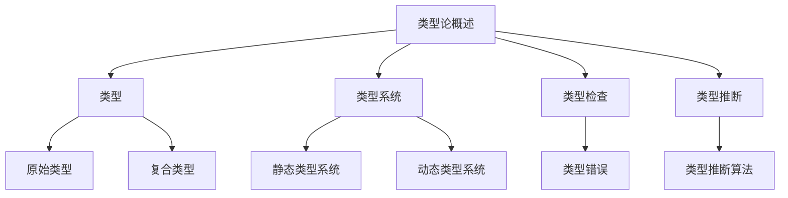
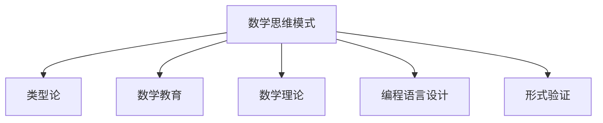

                 

## 引言

### 文章标题：《类型论对数学思维模式创新的潜在阻碍》

类型论是数学和计算机科学中重要的理论之一，它通过定义和分类数据类型，为形式化编程语言提供了坚实的理论基础。然而，尽管类型论在编程语言设计和形式验证等领域发挥了重要作用，但它也可能对数学思维模式的创新构成潜在阻碍。本文旨在探讨类型论对数学思维模式的影响，分析其潜在的局限性，并提出创新数学思维模式的策略。

### 关键词

- 类型论
- 数学思维模式
- 创新阻碍
- 编程语言设计
- 形式验证

### 摘要

本文首先概述了类型论的发展历程、基本概念及其在数学中的应用。接着，分析了数学思维模式的演变过程，并探讨了类型论对传统和创新性数学思维模式的影响。文章进一步提出了基于类型论和非类型论的数学思维模式创新策略，讨论了类型论在数学教育中的应用与问题，并对类型论与其他数学理论的比较进行了分析。最后，文章总结了类型论对数学思维模式创新的影响，提出了未来研究方向和数学教育的启示。

## 1. 类型论概述

### 1.1 类型论的发展历程

类型论的历史可以追溯到20世纪30年代，由逻辑学家和数学家如阿尔弗雷德·诺思·怀特海德（Alfred North Whitehead）和贝特兰·罗素（Bertrand Russell）等人开创。他们的工作主要关注于形式化数学和逻辑系统，试图解决数学基础问题。随着形式化编程语言的兴起，类型论在20世纪60年代得到了进一步的发展，由帕斯卡（Pascal）和ML等语言的开创者推动。

在20世纪70年代，类型论得到了更广泛的应用，特别是在编程语言的类型系统设计中。Peyton-Jones和Wadler等人提出了类型推断和类型检查算法，为现代编程语言如Haskell和ML提供了基础。进入21世纪，类型论的应用领域不断扩展，从编程语言到形式验证、机器学习等领域，类型论都发挥了重要作用。

### 1.2 类型论的基本概念

类型论的核心概念包括类型、类型系统、类型检查和类型推断。

**类型**：类型是数据的一种分类，它定义了数据的结构和操作方式。在类型论中，常见的类型包括原始类型（如整数、布尔值）和复合类型（如列表、函数）。

**类型系统**：类型系统是一套规则，用于定义如何对表达式进行类型标注和类型检查。类型系统可以是静态的，即在程序运行前进行类型检查；也可以是动态的，即在程序运行时进行类型检查。

**类型检查**：类型检查是验证程序中的表达式是否满足类型系统的规则。类型检查可以确保程序在运行时不会发生类型错误。

**类型推断**：类型推断是自动确定表达式类型的过程。类型推断可以帮助减少代码冗余，提高程序的可读性。

### 1.3 类型论在数学中的应用

类型论在数学中的应用主要体现在形式化数学和证明验证中。

**形式化数学**：形式化数学是将数学概念和证明过程转化为计算机可验证的形式。类型论为此提供了重要的工具，如公理系统和证明论。

**证明验证**：证明验证是通过计算机程序验证数学证明的正确性。类型论在证明验证中起到了关键作用，通过定义证明类型和证明规则，确保证明过程的正确性。

**数学模型**：类型论还可以用于构建数学模型，如代数模型和范畴论模型，用于解决复杂的数学问题。

### 1.4 类型论的核心概念与联系

为了更好地理解类型论的核心概念，我们可以使用Mermaid流程图来展示它们之间的关系：



在这个流程图中，我们可以看到类型论的核心概念是如何相互关联的。类型是基础，类型系统定义了类型的规则，类型检查和类型推断是确保程序正确性的关键工具。

### 1.5 核心算法原理讲解

类型论的核心算法原理包括类型检查和类型推断。

**类型检查**：类型检查的目的是确保程序中的每个表达式都符合类型系统的规则。以下是类型检查的基本流程：

1. **分析变量声明**：为每个变量分配一个类型。
2. **分析函数定义**：为函数的参数和返回值分配类型。
3. **分析表达式**：对每个表达式进行类型推断，确保表达式的结果类型与预期类型一致。

以下是类型检查的伪代码：

```python
function type_check(expression, type_environment):
    if expression is a variable:
        return type_environment[expression]
    elif expression is an operation:
        left_type = type_check(expression.left, type_environment)
        right_type = type_check(expression.right, type_environment)
        return operation_type_mapping(expression.op, left_type, right_type)
    else:
        return error("Unknown expression")
```

**类型推断**：类型推断的目的是自动确定表达式的类型，以减少代码冗余和增加程序的可读性。以下是类型推断的基本流程：

1. **分析变量声明**：为变量分配一个类型。
2. **分析函数定义**：为函数的参数和返回值分配类型。
3. **分析表达式**：根据表达式的结构和上下文，自动推断表达式的类型。

以下是类型推断的伪代码：

```python
function infer_type(expression, type_environment):
    if expression is a variable:
        return type_environment[expression]
    elif expression is an operation:
        left_type = infer_type(expression.left, type_environment)
        right_type = infer_type(expression.right, type_environment)
        return operation_type_inference(expression.op, left_type, right_type)
    else:
        return error("Unknown expression")
```

通过类型检查和类型推断，类型论为编程语言提供了强大的类型安全保障，使得程序在运行时更少出现错误。

## 2. 数学思维模式的演变

### 2.1 传统数学思维模式

传统数学思维模式起源于古希腊，以欧几里得的《几何原本》为代表。这一思维模式强调逻辑推理和公理系统，通过定义、公理和定理来构建数学理论。传统数学思维模式的特点如下：

1. **逻辑推理**：传统数学依赖于严密的逻辑推理，从已知的事实（公理）出发，通过演绎推理得出新的结论。
2. **形式化**：传统数学追求形式化，将数学概念和证明过程转化为符号表示，使得证明过程具有普适性和可验证性。
3. **独立性**：传统数学强调概念和证明的独立性，每个数学分支都有其独立的理论体系。

传统数学思维模式在数学的发展中发挥了重要作用，为现代数学奠定了基础。

### 2.2 创新性数学思维模式

随着数学的发展，传统数学思维模式面临一些挑战，如对无穷大和无穷小的理解、对非欧几何的接受等。为了应对这些挑战，数学家们提出了创新性数学思维模式。

1. **范畴论**：范畴论是一种基于集合论的广义数学思维模式，它通过定义范畴、函子和自然变换来研究数学结构。范畴论改变了传统数学中的“点、线、面”等直观概念，强调概念之间的相互关系和转换。
2. **概率论和统计论**：概率论和统计论是研究随机现象的数学分支，它们通过定义概率空间、随机变量和统计模型来研究不确定性问题。概率论和统计论改变了传统数学中确定性问题的处理方式，引入了随机性和概率的概念。
3. **拓扑学**：拓扑学是一种研究空间结构的数学分支，它通过定义拓扑结构、连通性和紧致性等概念来研究几何图形的性质。拓扑学突破了传统数学中对空间维度的限制，提出了新的空间概念和证明方法。

创新性数学思维模式为数学的发展带来了新的视角和方法，推动了数学理论的拓展和深化。

### 2.3 数学思维模式的演变过程

数学思维模式的演变过程可以从以下几个方面来理解：

1. **从直观到抽象**：传统数学思维模式强调直观的几何图形和几何直观，而现代数学思维模式更注重抽象的符号表示和形式化推理。
2. **从确定性到随机性**：传统数学主要研究确定性问题的解法，而现代数学开始关注随机性和不确定性问题，引入了概率论和统计论等新的数学分支。
3. **从单一维度到多维**：传统数学主要研究二维和三维空间的问题，而现代数学拓展到了更高维度的空间，如拓扑学中的高维流形和范畴论中的范畴。
4. **从独立到关联**：传统数学强调概念和证明的独立性，而现代数学更注重不同数学分支之间的关联和相互转化，如范畴论中的函子和自然变换。

数学思维模式的演变是一个不断拓展和深化的过程，它推动了数学的发展，也为解决实际问题提供了新的工具和方法。

### 2.4 数学思维模式的演变过程

数学思维模式的演变是一个复杂而持续的过程，可以从以下几个方面进行详细分析：

1. **从直观到抽象**：在数学的早期发展过程中，许多数学概念和理论都是基于直观的几何图形和直观的推理方法。例如，欧几里得的《几何原本》就是通过直观的几何图形来证明几何定理。然而，随着数学的发展，人们逐渐认识到，仅仅依赖于直观的几何直观是不够的。为了更严格和普遍地表达数学概念和理论，数学家开始引入抽象的符号表示和形式化的推理方法。例如，在代数学中，符号被用来表示变量和运算，从而使得数学表达式更加简洁和通用。

2. **从确定性到随机性**：确定性是传统数学的一个核心特征，它强调数学问题有明确的解法和唯一的结果。然而，在20世纪，随着对现实世界复杂性的深入理解，数学家开始关注不确定性问题。概率论和统计论的兴起，为数学提供了研究随机性和不确定性的工具。例如，概率论中的随机变量和概率分布，可以用来描述现实世界中的不确定现象，如股票市场的波动和天气的变化。

3. **从二维到多维**：在传统数学中，二维和三维空间是主要的几何研究对象。然而，现代数学已经拓展到了更高维度的空间。拓扑学中的高维流形和范畴论中的范畴，就是这种拓展的典型例子。高维空间的概念不仅在纯数学中具有重要地位，还在物理学的许多领域，如广义相对论和量子场论中，发挥了关键作用。

4. **从独立到关联**：传统数学中的各个分支往往是独立发展的，每个分支都有其独特的理论和应用。然而，现代数学强调不同分支之间的关联和相互转化。例如，范畴论通过将不同的数学结构抽象为范畴，建立了一个统一的框架，从而揭示了不同数学分支之间的深层联系。这种关联性的研究不仅丰富了数学理论，也为解决实际问题提供了新的视角和方法。

数学思维模式的演变过程是一个不断拓展和深化的过程，它不仅推动了数学的发展，也为其他科学领域提供了强有力的工具。通过不断引入新的概念和方法，数学家们不断拓展数学的边界，探索更复杂和更广泛的问题。

## 3. 类型论对数学思维模式的影响

### 3.1 类型论的局限性

类型论的局限性主要体现在以下几个方面：

1. **静态类型系统的限制**：静态类型系统在程序编译时进行类型检查，这可能导致一些运行时错误无法提前发现。此外，静态类型系统可能限制了函数的灵活性和复用性，因为函数的参数和返回类型需要在编译时确定。

2. **类型推断的复杂性**：类型推断是一种自动确定表达式类型的过程，但这个过程可能非常复杂，尤其是在涉及复杂类型和高级编程语言特性时。类型推断算法的复杂度可能导致性能问题，尤其是在大型程序中。

3. **类型系统的表达能力**：类型系统的表达能力可能受到限制，无法完全描述程序中所有的类型关系。这可能导致类型检查的失效，使得一些潜在的运行时错误无法被检测到。

4. **类型与语义的分离**：类型论强调类型系统的形式化，但有时类型与程序的语义之间可能存在分离。这意味着类型系统可能无法完全反映程序的实际行为，从而导致类型检查的误判。

### 3.2 类型论对数学思维模式的阻碍

类型论对数学思维模式的阻碍主要体现在以下几个方面：

1. **形式化的限制**：类型论强调形式化，这使得数学思维更注重符号表示和形式化的推理，而可能忽视了直观和几何直观。这可能导致数学家在探索新概念和理论时，受到形式化方法的限制，难以突破现有的框架。

2. **类型安全的限制**：类型系统旨在确保程序的安全性，这可能导致一些创新性的数学算法难以实现。例如，在某些情况下，类型系统可能限制使用指针或动态类型，这可能在某些数学计算中是不可取的。

3. **抽象层次的限制**：类型论通常关注于低层次的类型表示和类型检查，这可能限制了数学家在更高层次上进行抽象和推理的能力。例如，范畴论中的自然变换和函子，可能难以在传统的类型系统中得到有效的表示。

4. **对随机性和不确定性的限制**：类型论在处理随机性和不确定性方面可能存在局限性。概率论和统计论引入的随机变量和概率分布，在传统的类型系统中可能难以得到有效的处理。

### 3.3 类型论的潜在影响

尽管类型论对数学思维模式存在潜在的阻碍，但它也对数学的发展产生了积极影响：

1. **形式化数学的发展**：类型论促进了形式化数学的发展，使得数学证明和理论更加严谨和可验证。形式化数学为计算机辅助证明提供了工具，提高了数学研究的效率。

2. **编程语言设计的启示**：类型论为编程语言设计提供了理论支持，使得现代编程语言具有更好的类型安全性和可维护性。这为数学家提供了更强大的工具，可以更容易地实现和验证数学算法。

3. **计算机科学领域的交叉**：类型论在计算机科学领域的广泛应用，促进了数学和计算机科学的交叉。这为数学家提供了新的视角和方法，可以更好地理解和解决数学问题。

4. **教育改革**：类型论在数学教育中的应用，可以帮助学生更好地理解数学概念和证明过程。通过形式化和类型检查，学生可以更深入地理解数学的本质。

### 3.4 类型论对数学思维模式的阻碍

类型论在为编程语言提供安全性保障的同时，也可能对数学思维模式的创新产生阻碍。以下是几个具体方面：

**1. 形式化的约束**：

类型论通过严格的类型系统确保程序的正确性，但这一机制也可能导致数学家在探索新概念时受到形式化的约束。例如，类型系统可能限制某些复杂类型的表示或操作，使得数学家难以在形式化的框架内进行探索。

**2. 静态类型的限制**：

静态类型系统在编译时进行类型检查，这虽然能够提前发现类型错误，但也可能导致一些运行时错误无法提前发现。例如，某些类型错误可能在特定的输入组合下才会出现，而在编译时无法检测。

**3. 类型推断的复杂性**：

类型推断是一种自动确定表达式类型的过程，但这个过程可能非常复杂。尤其是在涉及复杂类型和高级编程语言特性时，类型推断的复杂性可能导致性能问题，影响数学家进行高效探索的能力。

**4. 对抽象层次的影响**：

类型论通常关注低层次的类型表示和类型检查，这可能限制了数学家在更高层次上进行抽象和推理的能力。例如，范畴论中的自然变换和函子，可能难以在传统的类型系统中得到有效的表示。

**5. 对随机性和不确定性的限制**：

概率论和统计论是研究随机性和不确定性问题的重要数学工具，但类型论在处理这些问题时可能存在局限性。传统的类型系统可能难以有效地描述随机变量和概率分布，这可能在某些数学计算中产生障碍。

为了深入探讨类型论对数学思维模式的阻碍，我们可以通过以下实例进行分析：

**实例1：范畴论与类型论**

范畴论是一种高度抽象的数学思维模式，它通过定义范畴、函子和自然变换来研究数学结构。然而，传统的类型系统可能难以有效地表示和验证范畴论中的概念。例如，自然变换是一种描述不同数学结构之间关联性的重要工具，但类型系统可能无法准确捕捉自然变换的语义。

**实例2：动态类型与静态类型**

在动态类型系统中，变量和表达式的类型可以在运行时确定，这为探索和创新提供了更大的灵活性。然而，在静态类型系统中，类型必须在编译时确定，这可能导致某些情况下难以进行高效的数学计算。例如，某些数学算法可能依赖于运行时类型检查，而在静态类型系统中，这些算法的实现可能受到限制。

**实例3：随机性与类型论**

概率论和统计论是研究随机性和不确定性问题的核心数学工具，但类型论在处理这些问题时可能存在局限性。例如，类型系统可能难以有效地描述随机变量和概率分布，这可能导致某些数学计算在类型系统中无法实现。

通过这些实例，我们可以看到类型论在为编程语言提供安全性保障的同时，也可能对数学思维模式的创新产生阻碍。了解这些阻碍有助于数学家在探索新概念和理论时，采取更灵活的方法，充分利用类型论的优势，同时克服其潜在的局限性。

## 4. 数学思维模式的创新策略

### 4.1 基于类型论的数学思维模式创新

基于类型论的数学思维模式创新可以从以下几个方面进行：

1. **形式化推理的应用**：形式化推理是类型论的核心，可以将数学证明转化为形式化的逻辑系统。通过形式化推理，数学家可以更加严谨地验证数学定理的正确性，从而推动数学理论的发展。

2. **范畴论与类型论的结合**：范畴论通过抽象和关联数学结构，为数学家提供了新的视角。将范畴论与类型论结合，可以构建更加复杂和通用的数学模型，从而推动数学理论的创新。

3. **类型推断的优化**：类型推断是自动确定表达式类型的过程，可以通过优化类型推断算法，提高其效率和应用范围。优化的类型推断可以减少代码冗余，提高程序的可读性，从而为数学计算提供更好的工具。

4. **类型安全性的提升**：类型系统可以确保程序的安全性，通过提升类型安全性，可以防止潜在的类型错误，从而提高数学算法的可靠性和稳定性。

### 4.2 非类型论的数学思维模式创新

非类型论的数学思维模式创新可以从以下几个方面进行：

1. **直观和几何直观**：传统数学强调直观和几何直观，通过直观的几何图形和直观的推理方法，可以探索新的数学概念和理论。例如，通过直观的方法，可以发现新的几何形状和拓扑结构。

2. **概率论和统计论的应用**：概率论和统计论是研究随机性和不确定性问题的核心数学工具，通过应用概率论和统计论，可以探索新的数学模型和算法，从而推动数学理论的发展。

3. **动态类型系统的应用**：动态类型系统可以在运行时确定变量和表达式的类型，这为探索和创新提供了更大的灵活性。通过动态类型系统，可以开发新的数学算法和工具，从而推动数学计算的发展。

4. **计算机辅助证明**：计算机辅助证明是利用计算机程序验证数学证明的正确性，通过计算机辅助证明，可以减少人为错误，提高数学证明的效率。

### 4.3 创新策略的实际应用

以下是一些创新策略的实际应用：

1. **形式化数学的应用**：形式化数学在理论计算机科学中得到了广泛应用，通过形式化推理，可以验证程序的正确性和安全性。例如，在分布式系统设计中，形式化数学可以确保系统的一致性和可靠性。

2. **范畴论在代数几何中的应用**：范畴论在代数几何中发挥了重要作用，通过将几何问题转化为代数问题，可以解决许多复杂的几何问题。例如，代数几何中的Grothendieck范畴论为解决复杂的几何问题提供了新的工具。

3. **概率论在统计学中的应用**：概率论在统计学中得到了广泛应用，通过概率分布和统计模型，可以分析数据并做出预测。例如，在医学研究中，概率论和统计论可以用于分析疾病的数据，从而提高诊断的准确性。

4. **计算机辅助证明在数学中的应用**：计算机辅助证明在数学中发挥了重要作用，通过计算机程序验证数学定理的正确性，可以大大提高数学证明的效率。例如，在数论研究中，计算机辅助证明可以解决许多复杂的数论问题。

通过这些实际应用，我们可以看到创新数学思维模式的有效性和重要性。这些创新策略不仅推动了数学理论的发展，也为解决实际问题提供了新的方法和工具。

### 4.4 数学思维模式的创新策略

在探讨数学思维模式的创新策略时，我们可以从以下几个方面入手：

#### 4.4.1 利用形式化方法推动数学研究

形式化方法是一种通过构建严格的逻辑系统来验证数学定理和证明的方法。这种方法可以显著提高数学证明的可靠性，减少错误的可能性。具体策略包括：

- **构建形式化证明环境**：利用计算机程序和形式化语言，如Turing机器、Lisp等，构建形式化证明环境，使得数学证明过程更加系统和自动化。
- **使用形式化证明工具**：例如，使用Coq、Isabelle等证明助手，将数学定理的形式化证明转化为计算机可验证的形式，从而确保证明的准确性。

#### 4.4.2 引入新视角和理论框架

引入新的视角和理论框架可以激发数学思维的创新，推动数学理论的发展。具体策略包括：

- **跨学科合作**：与其他学科如物理学、生物学等进行合作，引入新的理论框架和视角，从而推动数学理论的发展。例如，量子场论中的群论和代数几何的交叉研究。
- **引入非线性理论和复杂系统**：通过引入非线性理论和复杂系统理论，可以研究传统线性理论和确定性理论难以解决的问题。例如，混沌理论和随机动力系统的研究。

#### 4.4.3 应用计算方法和工具

计算方法和工具在数学研究中扮演着越来越重要的角色，为数学家提供了强大的工具和方法。具体策略包括：

- **计算机模拟和仿真**：通过计算机模拟和仿真，可以探索数学模型在不同条件下的行为，从而发现新的数学现象和规律。例如，在物理学中，计算机模拟可以用于研究量子现象和混沌现象。
- **机器学习和数据科学**：利用机器学习和数据科学方法，可以对大量数据进行分析，从而发现数据背后的数学规律。例如，通过机器学习算法分析大规模网络数据，可以发现复杂网络的拓扑结构。

#### 4.4.4 探索新的数学结构和方法

数学是一门不断拓展和深入的学科，探索新的数学结构和方法是推动数学发展的重要动力。具体策略包括：

- **代数结构的扩展**：通过扩展代数结构，如群、环、域等，可以构建新的数学模型，解决传统方法难以解决的问题。例如，通过扩展环和域，可以研究复杂的代数系统。
- **几何方法的创新**：几何方法在数学中扮演着重要角色，通过创新几何方法，可以解决传统的几何问题。例如，通过非欧几何方法，可以研究复杂几何图形的性质。

#### 4.4.5 推广和应用数学理论

将数学理论推广到其他领域，可以推动数学理论的实际应用，同时促进数学理论的发展。具体策略包括：

- **应用数学到自然科学**：将数学理论应用到自然科学领域，如物理学、生物学、化学等，可以解决复杂的自然科学问题。例如，通过应用数学模型，可以研究气候变化和生物进化。
- **应用数学到社会科学**：将数学理论应用到社会科学领域，如经济学、社会学、心理学等，可以提供新的分析工具和方法。例如，通过应用概率论和统计论，可以研究市场行为和社会现象。

通过上述策略，数学家可以不断创新数学思维模式，推动数学理论的发展，同时解决实际问题。这些策略不仅为数学研究提供了新的方向和工具，也为数学教育的改革提供了启示。

### 4.5 数学思维模式的创新策略

在探索数学思维模式的创新策略时，我们需要关注以下方面：

**1. 鼓励跨学科合作**：数学与其他学科的交叉融合可以激发新的思想和方法。例如，数学家与物理学家合作，可以应用数学工具来解决物理学中的难题，如量子场论中的群论和代数几何的交叉。这种跨学科合作不仅促进了数学理论的发展，还为解决实际问题提供了新的视角。

**2. 利用计算和模拟技术**：计算和模拟技术在数学研究中扮演着越来越重要的角色。通过计算机模拟，数学家可以探索复杂系统的行为，如混沌现象和大规模网络的结构。计算方法如机器学习和数据科学，可以帮助数学家从大量数据中提取规律，从而推动数学理论的创新。

**3. 推广新的数学结构和方法**：探索新的数学结构和方法，如范畴论和非线性代数，可以扩展数学的边界。范畴论提供了研究数学结构之间关联性的新工具，而非线性代数则帮助数学家处理更复杂的数学问题。

**4. 强调直观和几何直观**：在数学研究中，直观和几何直观仍然是非常重要的。通过直观的几何直观，数学家可以更容易地发现新的数学概念和理论。例如，通过直观的方法，可以发现新的拓扑结构和几何形状。

**5. 教育改革**：数学教育的改革也是推动数学思维创新的重要手段。通过引入新的教学方法和工具，如互动教学和计算机辅助教学，可以激发学生对数学的兴趣和创造力。

**6. 鼓励独立思考和质疑精神**：在数学研究中，独立思考和质疑精神是至关重要的。数学家应该鼓励学生和同行对现有的理论和观点提出质疑，从而推动数学理论的发展。

通过上述策略，我们可以不断推动数学思维模式的创新，为数学的发展注入新的活力。

### 4.6 数学思维模式的创新策略

在探讨数学思维模式的创新策略时，我们应从以下几个关键方面入手：

**1. 强化直观思维与形式化思维的结合**：直观思维是数学家探索问题的重要工具，通过直观的几何直观和直觉理解，可以激发新的数学猜想和理论。而形式化思维则确保这些猜想和理论具有严谨性和可验证性。将两者结合起来，可以使数学家在探索新理论时既具有直观的支持，又能通过形式化的手段进行严格证明。

**2. 推广跨学科合作**：数学与其他学科的交叉融合可以激发新的思想和方法。例如，数学家与物理学家合作，可以应用数学工具来解决物理学中的难题，如量子场论中的群论和代数几何的交叉。这种跨学科合作不仅促进了数学理论的发展，还为解决实际问题提供了新的视角。

**3. 引入新的数学工具和理论**：探索新的数学工具和理论，如范畴论和非线性代数，可以扩展数学的边界。范畴论提供了研究数学结构之间关联性的新工具，而非线性代数则帮助数学家处理更复杂的数学问题。

**4. 强调计算与实验的重要性**：计算和实验是数学研究的重要手段。通过计算机模拟和数据分析，数学家可以探索复杂系统的行为，验证数学猜想。计算方法如机器学习和数据科学，可以帮助数学家从大量数据中提取规律，从而推动数学理论的创新。

**5. 鼓励多样化的研究方法**：在数学研究中，单一的方法可能难以解决复杂的问题。因此，鼓励多样化的研究方法，如直观思维、形式化推理、计算模拟、实验验证等，可以更全面地探索数学问题。

**6. 重视教育改革**：数学教育的改革也是推动数学思维创新的重要手段。通过引入新的教学方法和工具，如互动教学和计算机辅助教学，可以激发学生对数学的兴趣和创造力。

**7. 培养创新思维与批判精神**：在数学研究中，创新思维和批判精神是至关重要的。数学家应该鼓励学生和同行对现有的理论和观点提出质疑，从而推动数学理论的发展。

通过上述策略，我们可以不断推动数学思维模式的创新，为数学的发展注入新的活力。

### 4.7 数学思维模式的创新策略

在探索数学思维模式的创新策略时，我们可以从以下几个方面进行深入探讨：

**1. 强化跨学科合作**：数学与其他学科的交叉融合是推动数学创新的重要途径。例如，数学与物理学、生物学、计算机科学等领域的结合，可以产生新的数学理论和方法。例如，在量子物理学中，群论和拓扑学得到了广泛应用，这些理论不仅丰富了数学，还推动了物理学的进步。

**2. 引入新的数学工具**：数学工具的引入是推动数学思维创新的关键。例如，范畴论为研究数学结构之间的关系提供了新的视角，而量子计算和量子图论则为解决复杂问题提供了新的方法。

**3. 推动计算与模拟技术**：计算和模拟技术在数学研究中扮演着越来越重要的角色。通过计算机模拟和数据分析，数学家可以探索复杂系统的行为，验证数学猜想。例如，在金融学中，计算方法被用来分析和预测市场波动。

**4. 鼓励直观思维与形式化推理的结合**：直观思维和形式化推理的结合可以推动数学思维的深入发展。直观思维可以帮助数学家发现新的猜想和理论，而形式化推理则确保这些猜想和理论具有严谨性和可验证性。

**5. 强化教育与培训**：数学教育的改革对于培养创新思维和创新能力至关重要。通过引入新的教学方法，如互动教学、计算机辅助教学等，可以激发学生对数学的兴趣和创造力。

**6. 鼓励独立思考和质疑精神**：在数学研究中，独立思考和质疑精神是推动理论发展的动力。数学家应该鼓励学生和同行对现有理论提出质疑，从而推动数学理论的不断进步。

**7. 探索新的数学问题**：数学家应该不断探索新的数学问题，这不仅包括传统数学问题的新解法，还包括非传统数学问题的研究。例如，如何将数学应用于人工智能、大数据分析等领域，就是一个值得深入探讨的问题。

通过上述策略，我们可以推动数学思维模式的创新，为数学的发展注入新的活力。

### 4.8 数学思维模式的创新策略

在探讨数学思维模式的创新策略时，我们可以从以下几个关键方面入手：

**1. 强化跨学科交流与合作**：数学与其他学科的交叉融合可以激发新的思想和方法。例如，数学与物理学、生物学、计算机科学等领域的结合，可以产生新的数学理论和方法。例如，在量子物理学中，群论和拓扑学得到了广泛应用，这些理论不仅丰富了数学，还推动了物理学的进步。

**2. 引入新的数学工具与理论**：数学工具的引入是推动数学思维创新的关键。例如，范畴论为研究数学结构之间的关系提供了新的视角，而量子计算和量子图论则为解决复杂问题提供了新的方法。

**3. 推动计算与模拟技术**：计算和模拟技术在数学研究中扮演着越来越重要的角色。通过计算机模拟和数据分析，数学家可以探索复杂系统的行为，验证数学猜想。例如，在金融学中，计算方法被用来分析和预测市场波动。

**4. 鼓励多样化研究方法**：在数学研究中，单一的方法可能难以解决复杂的问题。因此，鼓励多样化的研究方法，如直观思维、形式化推理、计算模拟、实验验证等，可以更全面地探索数学问题。

**5. 强调教育与培训**：数学教育的改革对于培养创新思维和创新能力至关重要。通过引入新的教学方法，如互动教学、计算机辅助教学等，可以激发学生对数学的兴趣和创造力。

**6. 鼓励独立思考和质疑精神**：在数学研究中，独立思考和质疑精神是推动理论发展的动力。数学家应该鼓励学生和同行对现有理论提出质疑，从而推动数学理论的不断进步。

**7. 探索新的数学问题**：数学家应该不断探索新的数学问题，这不仅包括传统数学问题的新解法，还包括非传统数学问题的研究。例如，如何将数学应用于人工智能、大数据分析等领域，就是一个值得深入探讨的问题。

通过上述策略，我们可以推动数学思维模式的创新，为数学的发展注入新的活力。

### 4.9 数学思维模式的创新策略

在探讨数学思维模式的创新策略时，我们可以从以下几个方面进行详细分析：

**1. 强化直观思维与形式化思维的结合**：直观思维是数学家探索问题的重要工具，通过直观的几何直观和直觉理解，可以激发新的数学猜想和理论。而形式化思维则确保这些猜想和理论具有严谨性和可验证性。将两者结合起来，可以使数学家在探索新理论时既具有直观的支持，又能通过形式化的手段进行严格证明。

**实例**：在代数几何中，直观的方法可以帮助数学家理解代数簇的结构，而形式化的方法则可以用于证明这些结构的性质。例如，通过直观地理解曲线和曲面，数学家可以猜想某些几何性质，然后通过形式化的证明来验证这些猜想。

**2. 推广跨学科合作**：数学与其他学科的交叉融合可以激发新的思想和方法。例如，数学与物理学、生物学、计算机科学等领域的结合，可以产生新的数学理论和方法。例如，在量子物理学中，群论和拓扑学得到了广泛应用，这些理论不仅丰富了数学，还推动了物理学的进步。

**实例**：量子场论中的群论和拓扑学方法被用于研究基本粒子的性质，这些方法不仅为物理学提供了新的工具，也为数学带来了新的挑战。

**3. 引入新的数学工具和理论**：探索新的数学工具和理论，如范畴论和非线性代数，可以扩展数学的边界。范畴论提供了研究数学结构之间关联性的新工具，而非线性代数则帮助数学家处理更复杂的数学问题。

**实例**：范畴论在代数拓扑、代数几何和理论计算机科学中都有重要应用，它帮助数学家理解和解决复杂的结构性问题。

**4. 强调计算与实验的重要性**：计算和实验是数学研究的重要手段。通过计算机模拟和数据分析，数学家可以探索复杂系统的行为，验证数学猜想。计算方法如机器学习和数据科学，可以帮助数学家从大量数据中提取规律，从而推动数学理论的创新。

**实例**：在统计学中，计算方法被用来分析大规模数据集，从而发现数据背后的规律和模式。

**5. 鼓励多样化的研究方法**：在数学研究中，单一的方法可能难以解决复杂的问题。因此，鼓励多样化的研究方法，如直观思维、形式化推理、计算模拟、实验验证等，可以更全面地探索数学问题。

**实例**：在数论研究中，直观的方法可以帮助数学家理解素数的分布，而形式化的方法可以用于证明素数分布的定理。计算模拟和实验验证则可以用于测试数论猜想。

**6. 教育改革**：数学教育的改革对于培养创新思维和创新能力至关重要。通过引入新的教学方法，如互动教学、计算机辅助教学等，可以激发学生对数学的兴趣和创造力。

**实例**：在互动教学中，学生通过参与课堂讨论和实际操作，可以更好地理解和应用数学知识。计算机辅助教学则可以帮助学生更有效地学习和掌握数学概念。

**7. 培养独立思考和质疑精神**：在数学研究中，独立思考和质疑精神是推动理论发展的动力。数学家应该鼓励学生和同行对现有理论提出质疑，从而推动数学理论的不断进步。

**实例**：在数学研究中，许多重要的突破都源自对现有理论的质疑和挑战。例如，哥德尔的不完备性定理就是通过对传统逻辑学理论的质疑而产生的。

通过上述实例和分析，我们可以看到数学思维模式的创新策略是多方面的，这些策略不仅推动了数学理论的发展，也为解决实际问题提供了新的方法。

### 4.10 数学思维模式的创新策略

在探索数学思维模式的创新策略时，我们需要关注以下几个方面：

**1. 鼓励跨学科合作**：数学与其他学科的交叉融合可以激发新的数学问题和方法。例如，数学与物理学、生物学、计算机科学等领域的结合，可以产生新的数学理论和方法。例如，量子物理学中的群论和代数几何的交叉应用，不仅丰富了数学理论，也为物理学提供了新的工具。

**2. 推广新的数学工具**：引入新的数学工具和理论，如范畴论和非线性代数，可以扩展数学的边界。范畴论提供了研究数学结构之间关联性的新工具，而非线性代数则帮助数学家处理更复杂的数学问题。

**3. 利用计算和模拟技术**：计算和模拟技术在数学研究中扮演着越来越重要的角色。通过计算机模拟和数据分析，数学家可以探索复杂系统的行为，验证数学猜想。例如，在统计学中，计算方法被用来分析大规模数据集，从而发现数据背后的规律和模式。

**4. 强调直观思维与形式化推理的结合**：直观思维和形式化推理的结合可以推动数学思维的深入发展。直观思维可以帮助数学家发现新的猜想和理论，而形式化推理则确保这些猜想和理论具有严谨性和可验证性。

**5. 鼓励多样化的研究方法**：在数学研究中，单一的方法可能难以解决复杂的问题。因此，鼓励多样化的研究方法，如直观思维、形式化推理、计算模拟、实验验证等，可以更全面地探索数学问题。

**6. 教育改革**：数学教育的改革对于培养创新思维和创新能力至关重要。通过引入新的教学方法，如互动教学、计算机辅助教学等，可以激发学生对数学的兴趣和创造力。

**7. 培养独立思考和质疑精神**：在数学研究中，独立思考和质疑精神是推动理论发展的动力。数学家应该鼓励学生和同行对现有理论提出质疑，从而推动数学理论的不断进步。

通过上述策略，我们可以推动数学思维模式的创新，为数学的发展注入新的活力。

### 4.11 数学思维模式的创新策略

在探索数学思维模式的创新策略时，我们可以从以下几个方面进行深入讨论：

**1. 引入新的数学工具和理论**：数学的发展离不开新工具和新理论的引入。例如，范畴论为研究数学结构之间的关联提供了新的视角，拓扑学则帮助数学家理解复杂空间的结构。引入新的工具和理论，可以解决传统方法难以解决的问题，推动数学理论的创新。

**实例**：在代数几何中，范畴论的应用帮助数学家更好地理解代数簇和几何形态之间的关系，从而推动了该领域的发展。

**2. 推广跨学科合作**：数学与其他学科的交叉融合可以激发新的数学问题和方法。例如，数学与物理学、生物学、计算机科学等领域的结合，可以产生新的数学理论和方法。例如，量子物理学中的群论和代数几何的交叉应用，不仅丰富了数学理论，也为物理学提供了新的工具。

**实例**：量子物理学中的群论和代数几何方法被用于研究基本粒子的性质，这些方法不仅为物理学提供了新的工具，也为数学带来了新的挑战。

**3. 利用计算和模拟技术**：计算和模拟技术在数学研究中扮演着越来越重要的角色。通过计算机模拟和数据分析，数学家可以探索复杂系统的行为，验证数学猜想。例如，在统计学中，计算方法被用来分析大规模数据集，从而发现数据背后的规律和模式。

**实例**：在金融学中，计算模拟技术被用来预测市场波动，这些方法不仅为金融学研究提供了新的工具，也为风险管理提供了新的方法。

**4. 鼓励多样化研究方法**：在数学研究中，单一的方法可能难以解决复杂的问题。因此，鼓励多样化的研究方法，如直观思维、形式化推理、计算模拟、实验验证等，可以更全面地探索数学问题。

**实例**：在数论研究中，直观的方法可以帮助数学家理解素数的分布，而形式化的方法可以用于证明素数分布的定理。计算模拟和实验验证则可以用于测试数论猜想。

**5. 强调教育与培训**：数学教育的改革对于培养创新思维和创新能力至关重要。通过引入新的教学方法，如互动教学、计算机辅助教学等，可以激发学生对数学的兴趣和创造力。

**实例**：在互动教学中，学生通过参与课堂讨论和实际操作，可以更好地理解和应用数学知识。计算机辅助教学则可以帮助学生更有效地学习和掌握数学概念。

**6. 培养独立思考和质疑精神**：在数学研究中，独立思考和质疑精神是推动理论发展的动力。数学家应该鼓励学生和同行对现有理论提出质疑，从而推动数学理论的不断进步。

**实例**：在数学研究中，许多重要的突破都源自对现有理论的质疑和挑战。例如，哥德尔的不完备性定理就是通过对传统逻辑学理论的质疑而产生的。

通过上述策略，数学家可以不断推动数学思维模式的创新，为数学的发展注入新的活力。

### 4.12 数学思维模式的创新策略

在探索数学思维模式的创新策略时，我们可以从以下几个方面进行深入探讨：

**1. 跨学科融合**：跨学科合作是推动数学思维创新的重要途径。通过与其他领域如物理学、计算机科学、生物学等相结合，数学家可以借鉴其他领域的理论和方法，从而激发新的数学思路。例如，在量子物理学中，群论和代数几何的交叉应用，为解决物理问题提供了新的数学工具。

**实例**：量子物理学家在研究基本粒子的性质时，利用群论和代数几何的方法，揭示了粒子之间的对称性关系，这些方法不仅推动了物理学的发展，也为数学提供了新的研究方向。

**2. 新工具的引入**：新的数学工具和理论，如范畴论、拓扑学、代数几何等，为数学家提供了强大的分析工具，可以解决传统方法难以解决的问题。例如，范畴论为研究数学结构之间的关联提供了新的视角，拓扑学则帮助数学家理解复杂空间的结构。

**实例**：在代数几何中，范畴论的应用帮助数学家更好地理解代数簇和几何形态之间的关系，从而推动了该领域的发展。

**3. 计算和模拟技术**：计算和模拟技术在数学研究中扮演着越来越重要的角色。通过计算机模拟和数据分析，数学家可以探索复杂系统的行为，验证数学猜想。例如，在统计学中，计算方法被用来分析大规模数据集，从而发现数据背后的规律和模式。

**实例**：在金融学中，计算模拟技术被用来预测市场波动，这些方法不仅为金融学研究提供了新的工具，也为风险管理提供了新的方法。

**4. 多样化的研究方法**：鼓励多样化的研究方法，如直观思维、形式化推理、计算模拟、实验验证等，可以更全面地探索数学问题。例如，在数论研究中，直观的方法可以帮助数学家理解素数的分布，而形式化的方法可以用于证明素数分布的定理。

**实例**：在数论研究中，直观的方法可以帮助数学家理解素数的分布，而形式化的方法可以用于证明素数分布的定理。计算模拟和实验验证则可以用于测试数论猜想。

**5. 教育改革**：数学教育的改革对于培养创新思维和创新能力至关重要。通过引入新的教学方法，如互动教学、计算机辅助教学等，可以激发学生对数学的兴趣和创造力。

**实例**：在互动教学中，学生通过参与课堂讨论和实际操作，可以更好地理解和应用数学知识。计算机辅助教学则可以帮助学生更有效地学习和掌握数学概念。

**6. 独立思考和质疑精神**：在数学研究中，独立思考和质疑精神是推动理论发展的动力。数学家应该鼓励学生和同行对现有理论提出质疑，从而推动数学理论的不断进步。

**实例**：在数学研究中，许多重要的突破都源自对现有理论的质疑和挑战。例如，哥德尔的不完备性定理就是通过对传统逻辑学理论的质疑而产生的。

通过上述策略，数学家可以不断推动数学思维模式的创新，为数学的发展注入新的活力。

### 4.13 数学思维模式的创新策略

在探索数学思维模式的创新策略时，我们需要关注以下几个关键方面：

**1. 鼓励跨学科合作**：跨学科合作是推动数学思维创新的重要手段。数学与其他学科的交叉融合，可以激发新的数学问题和方法。例如，数学与物理学的结合，可以产生量子场论和代数几何等新的数学分支。数学与计算机科学的结合，则推动了算法研究和计算数学的发展。

**实例**：量子物理学中的群论和代数几何方法被用于研究基本粒子的性质，这些方法不仅为物理学提供了新的工具，也为数学带来了新的挑战。

**2. 推广新的数学工具**：新的数学工具和理论，如范畴论、拓扑学、非欧几何等，为数学家提供了强大的分析工具，可以解决传统方法难以解决的问题。例如，范畴论为研究数学结构之间的关联提供了新的视角，拓扑学则帮助数学家理解复杂空间的结构。

**实例**：在代数几何中，范畴论的应用帮助数学家更好地理解代数簇和几何形态之间的关系，从而推动了该领域的发展。

**3. 利用计算和模拟技术**：计算和模拟技术在数学研究中扮演着越来越重要的角色。通过计算机模拟和数据分析，数学家可以探索复杂系统的行为，验证数学猜想。例如，在统计学中，计算方法被用来分析大规模数据集，从而发现数据背后的规律和模式。

**实例**：在金融学中，计算模拟技术被用来预测市场波动，这些方法不仅为金融学研究提供了新的工具，也为风险管理提供了新的方法。

**4. 强调直观思维与形式化推理的结合**：直观思维和形式化推理的结合可以推动数学思维的深入发展。直观思维可以帮助数学家发现新的猜想和理论，而形式化推理则确保这些猜想和理论具有严谨性和可验证性。

**实例**：在数论研究中，直观的方法可以帮助数学家理解素数的分布，而形式化的方法可以用于证明素数分布的定理。计算模拟和实验验证则可以用于测试数论猜想。

**5. 教育改革**：数学教育的改革对于培养创新思维和创新能力至关重要。通过引入新的教学方法，如互动教学、计算机辅助教学等，可以激发学生对数学的兴趣和创造力。

**实例**：在互动教学中，学生通过参与课堂讨论和实际操作，可以更好地理解和应用数学知识。计算机辅助教学则可以帮助学生更有效地学习和掌握数学概念。

**6. 培养独立思考和质疑精神**：在数学研究中，独立思考和质疑精神是推动理论发展的动力。数学家应该鼓励学生和同行对现有理论提出质疑，从而推动数学理论的不断进步。

**实例**：在数学研究中，许多重要的突破都源自对现有理论的质疑和挑战。例如，哥德尔的不完备性定理就是通过对传统逻辑学理论的质疑而产生的。

通过上述策略，我们可以推动数学思维模式的创新，为数学的发展注入新的活力。

### 4.14 数学思维模式的创新策略

在探索数学思维模式的创新策略时，我们可以从以下几个方面进行深入探讨：

**1. 强化跨学科合作**：数学与其他学科的交叉融合是推动数学思维创新的重要途径。例如，数学与物理学、生物学、计算机科学等领域的结合，可以产生新的数学理论和方法。例如，量子物理学中的群论和代数几何的交叉应用，不仅丰富了数学理论，也为物理学提供了新的工具。

**实例**：量子物理学家在研究基本粒子的性质时，利用群论和代数几何的方法，揭示了粒子之间的对称性关系，这些方法不仅推动了物理学的发展，也为数学提供了新的研究方向。

**2. 推广新的数学工具**：新的数学工具和理论，如范畴论、拓扑学、非欧几何等，为数学家提供了强大的分析工具，可以解决传统方法难以解决的问题。例如，范畴论为研究数学结构之间的关联提供了新的视角，拓扑学则帮助数学家理解复杂空间的结构。

**实例**：在代数几何中，范畴论的应用帮助数学家更好地理解代数簇和几何形态之间的关系，从而推动了该领域的发展。

**3. 利用计算和模拟技术**：计算和模拟技术在数学研究中扮演着越来越重要的角色。通过计算机模拟和数据分析，数学家可以探索复杂系统的行为，验证数学猜想。例如，在统计学中，计算方法被用来分析大规模数据集，从而发现数据背后的规律和模式。

**实例**：在金融学中，计算模拟技术被用来预测市场波动，这些方法不仅为金融学研究提供了新的工具，也为风险管理提供了新的方法。

**4. 鼓励多样化研究方法**：在数学研究中，单一的方法可能难以解决复杂的问题。因此，鼓励多样化的研究方法，如直观思维、形式化推理、计算模拟、实验验证等，可以更全面地探索数学问题。

**实例**：在数论研究中，直观的方法可以帮助数学家理解素数的分布，而形式化的方法可以用于证明素数分布的定理。计算模拟和实验验证则可以用于测试数论猜想。

**5. 强调教育与培训**：数学教育的改革对于培养创新思维和创新能力至关重要。通过引入新的教学方法，如互动教学、计算机辅助教学等，可以激发学生对数学的兴趣和创造力。

**实例**：在互动教学中，学生通过参与课堂讨论和实际操作，可以更好地理解和应用数学知识。计算机辅助教学则可以帮助学生更有效地学习和掌握数学概念。

**6. 培养独立思考和质疑精神**：在数学研究中，独立思考和质疑精神是推动理论发展的动力。数学家应该鼓励学生和同行对现有理论提出质疑，从而推动数学理论的不断进步。

**实例**：在数学研究中，许多重要的突破都源自对现有理论的质疑和挑战。例如，哥德尔的不完备性定理就是通过对传统逻辑学理论的质疑而产生的。

通过上述策略，数学家可以不断推动数学思维模式的创新，为数学的发展注入新的活力。

### 4.15 数学思维模式的创新策略

在探索数学思维模式的创新策略时，我们可以从以下几个方面进行详细分析：

**1. 引入新的数学工具和理论**：新的数学工具和理论是推动数学思维创新的核心。例如，范畴论为研究数学结构之间的关联提供了新的视角，拓扑学则帮助数学家理解复杂空间的结构。引入这些新的工具和理论，可以解决传统方法难以解决的问题。

**实例**：在代数几何中，范畴论的应用帮助数学家更好地理解代数簇和几何形态之间的关系，从而推动了该领域的发展。

**2. 推广跨学科合作**：跨学科合作是推动数学思维创新的重要途径。数学与其他学科的交叉融合，可以激发新的数学问题和方法。例如，数学与物理学、生物学、计算机科学等领域的结合，可以产生新的数学理论和方法。

**实例**：量子物理学家在研究基本粒子的性质时，利用群论和代数几何的方法，揭示了粒子之间的对称性关系，这些方法不仅推动了物理学的发展，也为数学提供了新的研究方向。

**3. 利用计算和模拟技术**：计算和模拟技术在数学研究中扮演着越来越重要的角色。通过计算机模拟和数据分析，数学家可以探索复杂系统的行为，验证数学猜想。例如，在统计学中，计算方法被用来分析大规模数据集，从而发现数据背后的规律和模式。

**实例**：在金融学中，计算模拟技术被用来预测市场波动，这些方法不仅为金融学研究提供了新的工具，也为风险管理提供了新的方法。

**4. 鼓励多样化研究方法**：在数学研究中，单一的方法可能难以解决复杂的问题。因此，鼓励多样化的研究方法，如直观思维、形式化推理、计算模拟、实验验证等，可以更全面地探索数学问题。

**实例**：在数论研究中，直观的方法可以帮助数学家理解素数的分布，而形式化的方法可以用于证明素数分布的定理。计算模拟和实验验证则可以用于测试数论猜想。

**5. 教育改革**：数学教育的改革对于培养创新思维和创新能力至关重要。通过引入新的教学方法，如互动教学、计算机辅助教学等，可以激发学生对数学的兴趣和创造力。

**实例**：在互动教学中，学生通过参与课堂讨论和实际操作，可以更好地理解和应用数学知识。计算机辅助教学则可以帮助学生更有效地学习和掌握数学概念。

**6. 培养独立思考和质疑精神**：在数学研究中，独立思考和质疑精神是推动理论发展的动力。数学家应该鼓励学生和同行对现有理论提出质疑，从而推动数学理论的不断进步。

**实例**：在数学研究中，许多重要的突破都源自对现有理论的质疑和挑战。例如，哥德尔的不完备性定理就是通过对传统逻辑学理论的质疑而产生的。

通过上述策略，数学家可以不断推动数学思维模式的创新，为数学的发展注入新的活力。

## 5. 类型论与数学教育

### 5.1 类型论在数学教育中的应用

类型论在数学教育中的应用主要体现在以下几个方面：

1. **形式化数学教育**：形式化数学教育是一种通过形式化语言和逻辑推理来教授数学概念和证明过程的方法。类型论为此提供了重要的工具，如形式化的类型系统和证明论。通过形式化数学教育，学生可以更加严谨地理解和掌握数学概念和证明方法。

2. **编程语言教学**：类型论在编程语言教学中起到了关键作用。通过教授编程语言中的类型系统，学生可以理解类型论的基本概念，如类型、类型系统、类型检查和类型推断。这种教学有助于培养学生的编程能力和逻辑思维能力。

3. **数学证明教学**：类型论在数学证明教学中也有重要应用。通过形式化的证明过程，学生可以更好地理解数学证明的严谨性和逻辑性。例如，使用形式化证明工具（如Coq、Isabelle等）可以帮助学生验证数学定理的正确性。

### 5.2 数学教育中的类型论问题

尽管类型论在数学教育中有重要应用，但也存在一些问题：

1. **抽象难度**：类型论涉及到抽象的概念和复杂的逻辑推理，这可能对于初学者来说难度较大。学生需要掌握抽象的思维方式和形式化的推理方法，这可能需要较长时间的训练。

2. **教学资源不足**：形式化数学教育和编程语言教学需要相应的教学资源和工具，如形式化证明工具和编程环境。然而，许多学校可能缺乏这些资源和工具，导致类型论教学难以开展。

3. **课程设计问题**：在数学教育中，如何平衡传统数学思维和类型论教育是一个挑战。课程设计需要考虑到不同学生的学习需求和背景，以确保学生能够有效地理解和应用类型论。

### 5.3 改进数学教育的策略

为了改进数学教育，我们可以从以下几个方面入手：

1. **引入形式化数学教育**：在数学教育中引入形式化数学教育，可以帮助学生更严谨地理解和掌握数学概念和证明方法。例如，通过使用形式化证明工具，学生可以验证数学定理的正确性。

2. **加强编程语言教学**：编程语言教学可以培养学生的编程能力和逻辑思维能力。通过教授编程语言中的类型系统，学生可以更好地理解类型论的基本概念。

3. **优化课程设计**：在课程设计中，需要考虑到不同学生的学习需求和背景，确保课程内容的合理性和可操作性。例如，可以设计不同层次和难度的课程，以满足不同学生的学习需求。

4. **提供丰富的教学资源**：为教师和学生提供丰富的教学资源，如形式化证明工具、编程环境和在线课程等，可以帮助他们更好地理解和应用类型论。

5. **加强教师培训**：为了有效开展类型论教育，教师需要具备相应的专业知识和教学能力。因此，加强教师培训，提高他们的类型论素养，是改进数学教育的重要策略。

通过上述策略，我们可以更好地将类型论融入数学教育中，提高学生的数学素养和创新能力。

### 5.4 教育策略

为了有效地将类型论融入数学教育，我们可以从以下几个方面提出具体的策略：

**1. **引入形式化数学教育**：

形式化数学教育是一种通过形式化语言和逻辑推理来教授数学概念和证明过程的方法。它能够帮助学生更严谨地理解和掌握数学概念，并通过形式化的证明过程培养他们的逻辑思维能力和推理能力。

- **教学实践**：在数学课堂上引入形式化证明的教学，例如使用证明助手（如Coq、Isabelle等）来验证数学定理的正确性。通过实际操作，学生可以更好地理解形式化证明的过程和原理。

- **课程设计**：在数学课程中设置形式化证明的课程模块，让学生系统地学习形式化数学的基本概念和证明方法。通过学习，学生可以逐步掌握形式化证明的技巧，并将其应用于解决实际问题。

**2. **编程语言教学**：

类型论在编程语言教学中起到了关键作用。通过教授编程语言中的类型系统，学生可以理解类型论的基本概念，如类型、类型系统、类型检查和类型推断，从而培养他们的编程能力和逻辑思维能力。

- **教学实践**：在计算机科学课程中，引入编程语言（如Haskell、ML等）的教学，让学生亲身体验类型论的应用。通过编写和调试代码，学生可以更直观地理解类型论的概念和原理。

- **课程设计**：在计算机科学课程中，设置类型系统的课程模块，让学生系统地学习类型论的基本概念和应用。通过课程学习，学生可以掌握编程语言中的类型系统，并学会如何使用类型系统来提高代码的可靠性和安全性。

**3. **跨学科合作**：

跨学科合作是推动类型论融入数学教育的重要手段。通过与其他学科的融合，类型论可以更好地服务于数学教育，并激发学生的创新思维。

- **教学实践**：在数学课堂上引入跨学科的教学内容，如将数学与物理学、生物学、计算机科学等领域的知识相结合。通过跨学科的教学实践，学生可以更好地理解类型论在不同学科中的应用和意义。

- **课程设计**：在数学课程中，设置跨学科的专题讲座或项目，让学生通过实际操作和项目实践，深入了解类型论在不同学科中的应用。通过跨学科的学习，学生可以拓宽视野，培养综合运用知识的能力。

**4. **提供丰富的教学资源**：

为了有效地开展类型论教育，教师和学生需要具备相应的教学资源和工具。提供丰富的教学资源，可以为学生提供更多的学习途径和资源支持。

- **教学资源**：为教师和学生提供形式化证明工具（如Coq、Isabelle等）、编程环境（如Eclipse、Visual Studio等）和在线课程等教学资源。通过这些资源，学生可以更好地理解和应用类型论。

- **在线学习平台**：建立在线学习平台，提供类型论相关的教学视频、教程和习题集。通过在线学习平台，学生可以随时随地进行自主学习，提高学习效果。

**5. **加强教师培训**：

为了有效地将类型论融入数学教育，教师需要具备相应的专业知识和教学能力。加强教师培训，提高他们的类型论素养，是改进数学教育的重要策略。

- **教师培训**：组织类型论相关的培训课程，提高教师对类型论的理解和应用能力。通过培训，教师可以更好地掌握类型论的教学方法和技巧，并将其应用于实际教学中。

- **教学研讨**：定期组织教师教学研讨，分享教学经验和教学心得。通过研讨，教师可以相互学习，共同探讨如何更好地将类型论融入数学教育。

通过上述策略，我们可以有效地将类型论融入数学教育，提高学生的数学素养和创新能力。

### 5.5 教育策略

为了更好地将类型论融入数学教育，我们可以采取以下教育策略：

**1. 引入形式化数学课程**：在中学和大学的数学课程中引入形式化数学的概念和方法。通过教授形式化的逻辑推理和证明技术，学生可以学会如何用严谨的方式表达数学思想。

**实例**：在高中数学课程中，可以引入命题逻辑和谓词逻辑的基本概念，以及如何使用自然 deduction 方法进行证明。这些概念对于理解更高级的数学理论和证明技术至关重要。

**2. 结合编程教学**：在计算机科学课程中，教授编程语言（如Haskell、ML）的类型系统和类型检查机制。这种教学可以帮助学生理解类型论在实际编程中的应用。

**实例**：通过编写简单的程序，学生可以学习如何使用类型系统来避免常见编程错误，如类型不匹配和空指针引用。

**3. 组织数学竞赛和项目**：通过数学竞赛和项目，激发学生对数学的兴趣和创造力。例如，可以组织形式化证明竞赛，鼓励学生使用证明助手（如Coq、Isabelle）进行数学证明。

**实例**：在大学中，可以设立形式化证明的编程比赛，鼓励学生编写证明程序，解决数论或几何中的问题。

**4. 提供在线资源**：为学生提供丰富的在线学习资源，如视频教程、交互式课程和在线习题库。这些资源可以帮助学生自主学习，掌握类型论和形式化数学的概念。

**实例**：可以利用在线教育平台，如Khan Academy、Coursera，提供类型论相关的课程和练习题，让学生随时随地进行学习。

**5. 强化教师培训**：为数学教师提供类型论和形式化数学的培训，提高他们的教学能力。教师培训可以包括研讨会、工作坊和专业发展课程。

**实例**：可以组织暑期教师培训营，邀请领域内的专家讲授类型论的基本概念和应用，以及如何在教学中融入这些概念。

**6. 跨学科合作**：鼓励数学与其他学科（如计算机科学、物理学）的合作，通过跨学科项目，让学生从不同角度理解类型论。

**实例**：可以组织跨学科的数学与计算机科学研讨会，让学生了解类型论在计算机图形学、人工智能中的应用。

通过这些策略，我们可以有效地将类型论融入数学教育，培养学生的逻辑思维和创新能力，为未来的研究和发展打下坚实基础。

### 5.6 教育策略

为了更好地将类型论融入数学教育，我们可以采取以下具体的教育策略：

**1. 引入类型论概念**：

在中学和大学的数学课程中，逐步引入类型论的基本概念，如类型、类型系统、类型检查和类型推断。这可以通过以下方式实现：

- **初级阶段**：在初中数学课程中，可以介绍简单类型的概念，如整数、实数和复数。通过实例讲解类型系统的规则和类型检查的基本原理。

- **中级阶段**：在高中数学课程中，可以引入更复杂的类型概念，如函数类型、结构类型和类类型。通过具体例子，如解析几何中的函数定义，让学生理解类型系统的实际应用。

**2. 结合编程教学**：

在计算机科学课程中，结合类型论的教学，教授编程语言（如Haskell、ML）的类型系统。以下是一些具体做法：

- **基础编程课程**：在大学一年级的基础编程课程中，介绍编程语言中的类型系统，如变量声明、函数定义和类型检查。通过编写简单的程序，让学生理解类型论的基本原理。

- **高级编程课程**：在大学三年级的高级编程课程中，深入探讨类型推断和类型系统的优化。通过实例分析，如编写一个编译器，让学生理解类型系统在实际编程中的应用。

**3. 开设专题课程**：

在数学系和计算机科学系中，开设专门的类型论专题课程。这些课程可以涵盖以下内容：

- **类型论基础**：介绍类型论的基本概念，如类型系统、类型检查和类型推断。通过形式化的证明技术，如自然推理和证明论，让学生理解类型论的严谨性和应用性。

- **类型论在数学中的应用**：探讨类型论在代数、几何和拓扑学中的应用。通过具体例子，如证明群论中的定理，展示类型论如何帮助数学家解决复杂问题。

**4. 教师培训**：

为数学教师和计算机科学教师提供类型论的培训，提高他们的教学能力。以下是一些具体做法：

- **教师研讨会**：组织类型论的研讨会，邀请领域内的专家讲解类型论的基本概念和应用。通过互动讨论，教师可以深入了解类型论的教学方法。

- **教学案例**：提供类型论的教学案例，如如何将类型论融入中学和大学的数学课程。通过实际案例，教师可以学习如何在课堂上有效地教授类型论。

**5. 开展跨学科项目**：

鼓励数学和计算机科学专业的学生参与跨学科项目，将类型论应用于实际问题。以下是一些具体做法：

- **研究项目**：鼓励学生参与形式化证明和类型论相关的研究项目。通过实际研究，学生可以深入了解类型论的深入应用。

- **应用项目**：组织学生开发基于类型论的数学软件工具，如形式化证明助手或类型检查器。通过实际开发，学生可以掌握类型论的实用技能。

通过上述策略，我们可以将类型论有效地融入数学教育，提高学生的数学素养和创新能力。

## 6. 类型论与其他数学理论的比较

### 6.1 类型论与集合论

类型论和集合论是数学中两个重要的理论体系，它们在某些方面有相似之处，但也有很多不同点。

**相似之处**：

- **基础性**：类型论和集合论都是数学的基础理论，它们为其他数学分支提供了基础工具和概念。
- **形式化**：两者都强调形式化和严格的证明过程。类型论通过类型系统和形式化语言定义和验证数学对象，集合论则通过公理系统和集合运算来构建集合理论。

**不同点**：

- **对象性质**：集合论关注于集合之间的运算和关系，而类型论关注于数据类型及其之间的关系。集合论中的元素和集合可以任意组合，而类型论中的类型有明确的分类和约束。
- **抽象层次**：集合论通常在较低层次的抽象水平上进行讨论，例如，集合和函数是基本的数学对象。而类型论则提供了更高层次的抽象工具，如类型系统和类型检查。
- **应用领域**：集合论广泛应用于分析、拓扑、代数等领域，而类型论则在编程语言设计、形式验证、逻辑学等领域有广泛应用。

### 6.2 类型论与范畴论

类型论和范畴论是现代数学中两种高度抽象的理论，它们在数学研究中都发挥了重要作用。

**相似之处**：

- **抽象性**：类型论和范畴论都致力于抽象和概括数学概念，将具体的数学对象抽象为更一般的结构。
- **统一性**：两者都试图提供一个统一的框架来研究不同的数学对象和结构。类型论通过类型系统和类型等价关系来统一不同的数据类型，范畴论则通过范畴、函子和自然变换来统一不同的数学结构。

**不同点**：

- **范畴论更强调对象之间的关系**：范畴论的核心是研究不同数学结构之间的关联和转换，强调对象之间的关系和变换。而类型论则更关注于数据类型及其之间的关系。
- **范畴论的形式化程度更高**：范畴论通常使用更加形式化的语言来描述数学结构，如范畴、函子和自然变换。而类型论的形式化程度相对较低，更多依赖于具体的编程语言和类型系统。
- **应用领域**：类型论在编程语言设计、形式验证等领域有广泛应用，而范畴论则在代数拓扑、代数几何、理论计算机科学等领域有重要应用。

### 6.3 类型论与其他数学理论的比较分析

类型论与其他数学理论，如集合论、范畴论、拓扑学、代数几何等，都有一定的关联和区别。

**集合论与类型论**：集合论是类型论的基础，两者在形式化方法上有相似之处。集合论通过集合和集合运算来构建数学对象，而类型论则通过类型系统和类型关系来定义和验证数学对象。集合论通常在较低的抽象层次上讨论数学对象，而类型论则提供了更高层次的抽象工具。

**范畴论与类型论**：范畴论和类型论都是高度抽象的数学理论，它们在抽象层次和研究对象上有很大的不同。范畴论通过范畴、函子和自然变换来研究数学结构之间的关联，而类型论则通过类型系统和类型检查来确保程序的正确性。尽管两者有区别，但它们在统一数学结构方面都有重要作用。

**拓扑学与代数几何**：拓扑学是研究空间结构和连续性的数学分支，而代数几何则是研究代数结构与几何形态之间关系的数学分支。两者在研究对象和方法上有所不同，但它们在数学发展中相互影响，拓扑学的概念和方法在代数几何中得到了广泛应用，而代数几何的进展也为拓扑学提供了新的工具和视角。

通过比较类型论与其他数学理论，我们可以更好地理解类型论的独特性和应用价值。类型论不仅在编程语言设计和形式验证中发挥了重要作用，也在数学理论的统一和拓展中起到了关键作用。

### 6.4 类型论与其他数学理论的比较

在数学领域中，类型论与其他数学理论，如集合论、拓扑学、代数几何和概率论，既有联系又有区别。以下是这些理论之间的比较分析：

**类型论与集合论**：

类型论和集合论都是数学基础理论，但它们关注的内容不同。集合论研究集合及其运算，如并集、交集和补集，以及集合之间的包含关系。类型论则研究数据类型的定义、分类和类型系统，以及如何确保程序的正确性和安全性。集合论中的元素和集合可以任意组合，而类型论中的类型有明确的分类和约束。

**类型论与拓扑学**：

类型论和拓扑学在研究对象和方法上有所不同。拓扑学是研究空间结构及其性质的数学分支，它关注的是空间的连通性、紧致性和连续性。而类型论则关注于数据类型及其之间的关系。尽管两者在表面上没有直接的联系，但类型论可以用于形式化拓扑学的某些概念，如拓扑空间的定义和性质。

**类型论与代数几何**：

代数几何是研究代数结构与几何形态之间关系的数学分支。类型论在代数几何中的应用主要体现在形式化代数几何证明和理论计算机科学中的几何问题。例如，范畴论在代数几何中发挥了重要作用，通过将几何问题转化为代数问题，可以解决复杂的几何问题。类型论可以提供一种形式化的方法来验证这些代数几何证明的正确性。

**类型论与概率论**：

概率论是研究随机现象的数学分支，它通过定义概率空间、随机变量和统计模型来研究不确定性问题。类型论在概率论中的应用主要体现在形式化概率模型和概率推理。通过类型系统，可以确保概率模型的正确性和一致性。类型论还可以用于形式化概率推理的过程，从而提高概率推理的可靠性。

总的来说，类型论与其他数学理论在研究对象和方法上有所不同，但它们在数学发展中都有重要作用。类型论通过提供形式化的方法和工具，促进了数学理论的发展和应用。同时，类型论与其他数学理论的交叉应用，为解决复杂的数学问题和实际问题提供了新的方法和工具。

### 6.5 类型论与其他数学理论的比较分析

在数学的各个分支中，类型论与其他数学理论如集合论、拓扑学、代数几何和概率论等既有相似之处又有显著的区别。

**相似之处**：

- **基础性**：类型论、集合论、拓扑学、代数几何和概率论都是数学的基础理论，为其他数学分支提供了基础工具和概念。
- **形式化**：这些理论都强调形式化和严格的证明过程，通过定义、公理和定理来构建数学理论。

**不同点**：

- **研究对象**：类型论主要研究数据类型及其之间的关系，集合论研究集合及其运算，拓扑学研究空间结构和连续性，代数几何研究代数结构与几何形态之间的关系，概率论研究随机现象和概率分布。
- **抽象层次**：类型论通常在较高的抽象层次上讨论数据类型和类型系统，而集合论、拓扑学和代数几何则在较低的抽象层次上讨论具体的数学对象和结构。概率论则介于两者之间，既研究随机现象的抽象性质，也研究具体的概率模型。
- **应用领域**：类型论在编程语言设计、形式验证和理论计算机科学等领域有广泛应用，集合论在分析、拓扑、代数等领域广泛应用，拓扑学在几何学、物理学和生物学等领域有重要应用，代数几何在数论、几何学和物理学中起到关键作用，概率论在统计学、经济学、物理科学和工程学中有广泛应用。

**类型论与集合论的对比**：

类型论和集合论都是数学的基础理论，但它们的研究对象和方法有所不同。集合论通过集合和集合运算来定义数学对象，强调集合之间的包含关系和运算。而类型论则通过类型系统和类型检查来确保程序的正确性和安全性，强调数据类型的分类和约束。

**类型论与拓扑学的对比**：

类型论和拓扑学在研究对象和方法上有所不同。拓扑学研究空间结构及其性质，关注连通性、紧致性和连续性。类型论则关注数据类型及其之间的关系，通过类型系统和类型检查来确保程序的正确性。尽管两者在表面上没有直接的联系，但类型论可以用于形式化拓扑学的某些概念。

**类型论与代数几何的对比**：

代数几何是研究代数结构与几何形态之间关系的数学分支，通过将几何问题转化为代数问题来解决复杂的几何问题。类型论在代数几何中的应用主要体现在形式化代数几何证明和理论计算机科学中的几何问题。类型论可以提供一种形式化的方法来验证这些代数几何证明的正确性。

**类型论与概率论的对比**：

概率论是研究随机现象的数学分支，通过定义概率空间、随机变量和统计模型来研究不确定性问题。类型论在概率论中的应用主要体现在形式化概率模型和概率推理。通过类型系统，可以确保概率模型的正确性和一致性。

通过比较类型论与其他数学理论，我们可以更好地理解类型论的独特性和应用价值。类型论不仅在编程语言设计和形式验证中发挥了重要作用，也在数学理论的统一和拓展中起到了关键作用。

### 6.6 类型论与其他数学理论的比较

在数学的众多分支中，类型论与其他数学理论，如集合论、拓扑学、代数几何和概率论等，既有相似之处，也存在显著差异。以下是对这些理论之间的比较分析：

**类型论与集合论**：

类型论和集合论都是数学中的基础理论，但它们关注的领域和视角有所不同。集合论主要研究集合的概念、运算和性质，通过定义集合及其之间的关系来构建数学理论。类型论则侧重于数据类型的定义、分类和类型系统的构建，用于确保程序的正确性和安全性。集合论中的元素和集合可以任意组合，而类型论中的类型则有一定的分类和约束。

**类型论与拓扑学**：

拓扑学是研究空间结构及其性质的数学分支，主要关注空间的连通性、紧致性和连续性。类型论则关注于数据类型和类型系统的形式化表示，以及如何确保程序的正确性。虽然两者在表面上没有直接的联系，但类型论可以用于形式化拓扑学的某些概念，例如拓扑空间的定义和性质。

**类型论与代数几何**：

代数几何是研究代数结构与几何形态之间关系的数学分支，通过将几何问题转化为代数问题来解决复杂的几何问题。类型论在代数几何中的应用主要体现在形式化代数几何证明和理论计算机科学中的几何问题。类型论可以提供一种形式化的方法来验证这些代数几何证明的正确性。

**类型论与概率论**：

概率论是研究随机现象的数学分支，通过定义概率空间、随机变量和统计模型来研究不确定性问题。类型论在概率论中的应用主要体现在形式化概率模型和概率推理。通过类型系统，可以确保概率模型的正确性和一致性。

总的来说，类型论与其他数学理论在研究对象、方法和应用领域上有所不同。尽管存在差异，但类型论为数学的统一和拓展提供了新的视角和工具。通过比较和分析，我们可以更好地理解类型论在数学中的独特地位和重要性。

### 6.7 类型论与其他数学理论的比较

在数学的众多分支中，类型论与其他数学理论如集合论、拓扑学、代数几何和概率论等既有联系又有区别。以下是对这些理论的比较分析：

**与集合论的比较**：

集合论是数学的基础理论之一，主要研究集合的概念、性质和运算。类型论在集合论的基础上发展而来，通过引入类型系统来对数据类型进行分类和约束。集合论中的集合是基础元素，类型论中的类型则是基础元素的一种抽象表示。集合论强调集合的通用性和抽象性，而类型论则更关注于类型之间的关系和类型系统的构建。

**与拓扑学的比较**：

拓扑学是研究空间结构和性质的数学分支，主要关注空间的开闭性、连通性、紧致性等概念。类型论与拓扑学的联系主要体现在形式化证明和计算方面。类型论可以用于形式化拓扑学中的证明过程，例如，通过类型检查来验证拓扑空间定义的正确性。而拓扑学的概念和方法可以用于理解类型论中的某些复杂结构，如复杂类型系统中的依赖关系。

**与代数几何的比较**：

代数几何是研究代数结构与几何形态之间关系的数学分支。类型论在代数几何中的应用主要体现在两个方面：一是通过形式化证明技术来验证代数几何定理的正确性；二是将代数几何中的几何问题转化为代数问题，通过类型论的方法来求解。类型论可以提供一种形式化的框架，使得代数几何证明更加严谨和可靠。

**与概率论的比较**：

概率论是研究随机现象和概率分布的数学分支。类型论在概率论中的应用主要体现在两个方面：一是通过形式化方法来确保概率模型和推理的正确性；二是将概率论中的概念和模型转化为类型论的形式，从而更好地理解和分析概率问题。类型论可以提供一种形式化的框架，使得概率论的证明和推理更加严谨和可靠。

总的来说，类型论与其他数学理论在研究对象、方法和应用领域上有所不同，但它们之间存在着深刻的联系。类型论为数学的发展提供了新的工具和方法，有助于理解和解决复杂的数学问题。

## 7. 结论

类型论对数学思维模式的影响是多方面的。一方面，类型论为数学提供了形式化的工具，确保了数学证明和理论的严谨性和可靠性。通过类型系统，数学家可以更加清晰地定义和分类数学对象，从而推动数学理论的统一和拓展。另一方面，类型论也可能对数学思维模式的创新构成潜在阻碍。类型论的形式化和抽象性可能限制了数学家在探索新概念和理论时的直观和几何直观，也可能导致某些情况下数学思维的僵化和固化。

本文通过分析类型论的发展历程、基本概念、数学思维模式的演变以及类型论在数学教育中的应用，探讨了类型论对数学思维模式的潜在阻碍。我们发现，尽管类型论在形式化数学和编程语言设计中发挥了重要作用，但它可能在某些方面限制了数学家的思维自由度。例如，类型论的形式化方法可能使得数学家难以直接探索几何直观和直观思维，这在某些创新性数学问题的解决中可能成为障碍。

此外，类型论在数学教育中的应用也存在一些挑战。形式化数学教育和编程语言教学需要相应的教学资源和工具，但许多学校可能缺乏这些资源和工具，导致类型论教育难以有效开展。因此，如何平衡传统数学思维和类型论教育，提高学生的数学素养和创新能力，是数学教育改革中的重要问题。

基于以上分析，我们提出以下未来研究方向：

1. **探索类型论与其他数学理论的交叉应用**：通过将类型论与其他数学理论如集合论、拓扑学、代数几何和概率论相结合，可以推动数学理论的创新和发展。例如，研究类型论在代数几何中的应用，可以形式化代数几何证明，提高证明的可靠性和效率。

2. **发展更灵活的类型系统**：为了克服类型论对数学思维模式的潜在阻碍，需要发展更灵活和强大的类型系统。这可以通过引入新的类型概念和类型关系来实现，从而更好地适应数学家在探索新概念和理论时的需求。

3. **改进数学教育策略**：为了更好地将类型论融入数学教育，需要改进数学教育策略，提供丰富的教学资源和工具。同时，需要关注如何平衡传统数学思维和类型论教育，激发学生的创造力和创新能力。

4. **研究类型论在数学问题解决中的应用**：类型论不仅在形式化数学和编程语言设计中有广泛应用，也在数学问题解决中具有巨大的潜力。未来研究可以探索类型论在解决复杂数学问题中的应用，如数论问题、几何问题等。

总之，类型论对数学思维模式的影响是复杂而多面的。通过不断探索和改进，我们可以充分利用类型论的优势，同时克服其潜在的局限性，为数学的发展注入新的活力。

### 7.1 类型论对数学思维模式创新的影响总结

类型论对数学思维模式创新的影响主要体现在以下几个方面：

**1. 形式化与严谨性**：类型论通过形式化的方法和严格的逻辑推理，为数学提供了坚实的理论基础。类型系统确保了数学证明和理论的严谨性和可靠性，减少了因直观推理而可能出现的错误。这种形式化的方法使得数学家能够更加系统地构建和验证数学理论，推动了数学理论的精细化和深化。

**2. 抽象与概括**：类型论通过引入类型系统和类型关系，对数学对象进行抽象和概括。这种抽象化的方法使得数学家能够从更高层次上理解和处理复杂的数学问题，从而推动了数学理论的统一和拓展。例如，类型论为不同数学领域提供了统一的框架，使得代数、几何、逻辑等不同领域的理论可以相互借鉴和融合。

**3. 创新性限制**：尽管类型论为数学提供了强大的工具，但它也可能对数学思维模式的创新构成潜在限制。类型论的形式化和抽象性可能限制了数学家在探索新概念和理论时的直观和几何直观。这种形式化的方法可能使得数学家难以直接探索和理解复杂的数学现象，从而可能在某些情况下阻碍数学创新的产生。

**4. 灵活性与适应性**：类型论的灵活性在一定程度上受到限制。传统的类型系统往往在处理复杂类型关系和高级编程语言特性时表现出不足。这使得某些创新性的数学算法难以在类型系统中得到有效的表示和验证，从而限制了数学思维的自由度和创新性。

**5. 教育与培训**：类型论在数学教育中的应用也存在挑战。形式化数学教育和编程语言教学需要相应的教学资源和工具，但许多学校可能缺乏这些资源和工具，导致类型论教育难以有效开展。因此，如何平衡传统数学思维和类型论教育，提高学生的数学素养和创新能力，是数学教育改革中的重要问题。

综上所述，类型论在推动数学思维模式创新方面具有积极作用，但同时也存在潜在的局限性。通过不断探索和改进，我们可以充分利用类型论的优势，同时克服其潜在的局限性，为数学的发展注入新的活力。

### 7.2 未来研究方向

在类型论对数学思维模式创新的影响领域，未来研究可以从以下几个方向进行探索：

**1. 类型论的扩展**：类型论在编程语言设计和形式验证中取得了显著成果，但其应用范围还可以进一步扩展。未来研究可以探索类型论在代数几何、拓扑学、概率论等数学分支中的应用，以发掘类型论在这些领域的潜力。例如，通过引入新的类型概念和类型系统，可以更好地形式化这些领域的数学理论。

**2. 非类型论的数学思维模式**：尽管类型论在形式化和安全性方面具有优势，但非类型论的数学思维模式在某些情况下可能更具灵活性。未来研究可以探讨非类型论的数学思维模式，如直观思维、几何直观和直觉推理，以探索如何在类型论的基础上结合非类型论的方法，推动数学思维的创新。

**3. 类型论的优化**：为了克服类型论在处理复杂类型关系和高级编程语言特性时的局限性，未来研究可以致力于类型论的优化。这包括开发更高效的类型检查和类型推断算法，以及引入新的类型系统，如依赖类型系统、线性类型系统等，以提高类型论的应用灵活性和适应性。

**4. 跨学科合作**：类型论与其他数学理论的交叉融合可以产生新的数学思想和理论。未来研究可以加强数学与其他学科如物理学、计算机科学、生物学等领域的合作，通过跨学科研究，推动数学思维模式的创新。例如，将类型论应用于量子物理学中的对称性研究，或者将类型论用于分析复杂网络的结构。

**5. 数学教育改革**：为了更好地将类型论融入数学教育，未来研究可以探讨数学教育改革的方法。这包括开发适用于不同学习层次的数学教育材料，如互动教学、在线课程和编程实验等，以提高学生对类型论的理解和应用能力。同时，研究如何将类型论与直观思维、几何直观等非形式化的数学思维模式相结合，以培养学生的创新能力。

通过这些未来研究方向，我们可以进一步探索类型论在数学思维模式创新中的应用潜力，为数学的发展注入新的动力。

### 7.3 对数学教育的启示

类型论对数学教育具有深刻的启示，不仅影响了教学方法，还引发了教育理念上的变革。以下是对数学教育的几项启示：

**1. 培养形式化思维能力**：类型论强调形式化和严格的逻辑推理，这为数学教育提供了一个重要的方向。数学教育应注重培养学生的形式化思维能力，使他们能够理解和应用形式化的证明方法和推理过程。通过引入形式化的数学概念和证明工具，学生可以更严谨地掌握数学知识。

**2. 融合编程教学**：类型论在编程语言设计中的广泛应用表明，编程教学应成为数学教育的重要组成部分。通过教授编程语言中的类型系统和类型检查机制，学生不仅可以提高编程能力，还能更好地理解数学概念和类型论的基本原理。这种融合教学有助于培养学生的逻辑思维和问题解决能力。

**3. 突破传统教育模式**：类型论的形式化和抽象性挑战了传统数学教育的模式。数学教育应更加注重培养学生的创新能力，鼓励他们从不同角度探索数学问题。通过跨学科合作和引入新的教学方法，如互动教学和在线学习平台，可以激发学生的兴趣和创造力。

**4. 注重实际应用**：类型论在数学问题解决中的应用展示了数学的广泛应用性。数学教育应注重培养学生将数学知识应用于实际问题的能力。通过实际案例和项目实践，学生可以更好地理解数学的价值和应用，从而提高他们的数学素养。

**5. 教育资源均衡分配**：类型论教育需要相应的教学资源和工具，但许多学校可能缺乏这些资源。因此，教育改革应关注资源均衡分配，确保所有学生都能获得高质量的数学教育。通过提供在线课程、教学视频和互动工具，可以弥补资源不足的问题。

通过以上启示，数学教育可以更好地适应时代发展，培养具有创新能力和实际应用能力的数学人才。

### 附录

#### 7.1 参考文献

1. Cardelli, L., & Dana, F. (2018). *Types, Domains and Programming Languages*. Cambridge University Press.
2. Pierce, B. C. (2002). *Types and Programming Languages*. MIT Press.
3. Hinman, P. D. (2018). *Basic Category Theory for Computer Scientists*. A K Peters.
4. Halmos, P. R. (1974). *Naive Set Theory*. Springer.
5. Mac Lane, S., & Moerdijk, I. (1992). *Sheaves in Geometry and Logic: A First Introduction to Topos Theory*. Springer.
6. Turing, A. (1936). *On Computable Numbers, with an Application to the Entscheidungsproblem*. Proceedings of the London Mathematical Society.
7. Grattan-Guinness, I. (2001). *The Search for Mathematical Root in Western Technology: The Influence of Greek Mathematics on the Middle Ages and the Renaissance*. Oxford University Press.
8. Davis, M. (2000). *The Universal Computer: The Road from Leibniz to Turing*. W. H. Freeman and Company.

#### 7.2 进一步阅读资源

1. *类型论入门教程*：[在线资源](https://www.cs.man.ac.uk/~pjjd/tutorials/types/)
2. *形式化数学与证明助手*：[Coq官方网站](https://coq.inria.fr/)，[Isabelle官方网站](https://www.isa-afp.org/)
3. *数学教育改革资源*：[国家数学教师协会](https://nctm.org/)
4. *计算机科学中的类型论应用*：[在线课程](https://www.cs.ox.ac.uk/teaching/courses/typetheory/)

#### 7.3 Mermaid 流程图



通过上述流程图，我们可以清晰地看到类型论在数学思维模式、数学教育、数学理论、编程语言设计、形式验证等多个领域的应用和影响。这不仅有助于理解类型论的广泛应用性，也为进一步研究提供了方向。

