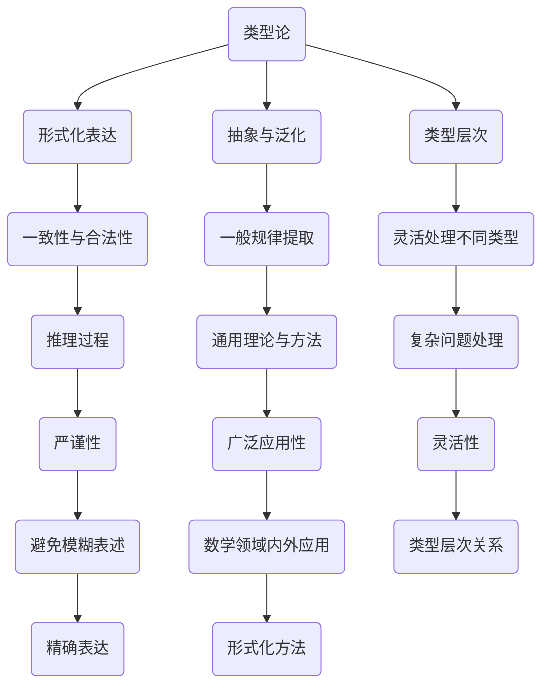

                 

### 文章标题

《类型论对数学思维模式固化的潜在风险》

### 关键词

类型论、数学思维模式、固化、潜在风险、算法、数学模型、项目实战

### 摘要

本文旨在探讨类型论对数学思维模式固化的潜在风险。类型论作为一种形式化的逻辑体系，对数学的抽象和形式化有着重要影响。然而，类型论的广泛应用可能会导致数学思维的僵化和局限，进而影响数学研究的创新和发展。本文将首先介绍类型论和数学思维模式的基本概念，然后分析类型论如何影响数学思维模式，探讨其潜在风险，并通过实例和项目实战，提供具体的解决方案和优化策略。

## 引言与背景

### 1.1 类型论的概念与起源

类型论（Type Theory）起源于20世纪30年代，由数学家弗朗茨·布伦塔诺（Franz Brentano）和维也纳学派（Vienna Circle）的成员，如路德维希·维特根斯坦（Ludwig Wittgenstein）和莫里茨·石里克（Moritz Schlick）等提出。类型论最初是为了解决逻辑和数学中的基础问题，如无穷、自指和集合论悖论等。

类型论的核心思想是将对象和概念划分为不同的类型，以避免自指和无穷递归的问题。在类型论中，每个对象都被赋予一个特定的类型，类型之间具有层次关系。例如，在常见的类型系统中，基本类型包括自然数、布尔值、函数等。通过类型系统，可以确保运算的一致性和合法性，避免逻辑错误和悖论的发生。

### 1.2 数学思维模式的特点

数学思维模式是一种基于逻辑推理和抽象能力的思维方式。它具有以下几个特点：

1. **抽象性**：数学思维能够从具体的实例中提取出一般规律，形成抽象的概念和理论。
2. **严谨性**：数学推理要求每一个步骤都必须有严格的理论依据，避免模糊和含糊不清的表述。
3. **形式化**：数学理论往往通过公理体系和严格的证明过程来构建，确保结论的可靠性和普遍性。
4. **广泛应用性**：数学方法不仅在数学领域内部广泛应用，还在物理学、计算机科学、经济学等众多领域发挥着重要作用。

### 1.3 类型论对数学思维模式的影响

类型论对数学思维模式产生了深远的影响。一方面，类型论提供了形式化的工具，帮助数学家更精确地表达和验证数学理论。另一方面，类型论的广泛应用可能会导致数学思维的僵化和局限。

首先，类型论的形式化特征使得数学家在研究过程中更容易陷入形式化的泥潭，忽略问题的本质。形式化的过程虽然能够提高推理的严谨性，但过度依赖形式化可能会导致数学家忽略直观和直觉的重要性，从而限制了创新思维的发展。

其次，类型论的类型划分和层次关系可能导致数学思维的固化。类型论强调不同类型之间的分离，这有助于避免逻辑错误和悖论。然而，这种分离也可能会导致数学家在处理问题时，过于局限于特定的类型框架，忽视了不同类型之间的交叉和融合。这种思维模式的固化可能会限制数学研究的创新性和广泛性。

### 1.4 研究的目的和意义

本文旨在探讨类型论对数学思维模式固化的潜在风险，旨在回答以下问题：

1. 类型论如何影响数学思维模式？
2. 类型论的广泛应用带来了哪些潜在风险？
3. 如何应对类型论导致的思维固化，促进数学思维的多元化发展？

通过研究这些问题，本文希望能够为数学家提供新的视角和思考方式，帮助他们在类型论的基础上，发展出更加开放和创新的数学思维模式。同时，本文的研究对于理解计算机科学、物理学等领域中形式化和抽象化方法的应用也具有重要的参考价值。

## 核心概念与联系

### 2.1 类型论的基本概念

类型论是一种形式化的逻辑体系，用于描述和处理对象和概念之间的关系。在类型论中，每个对象都被赋予一个特定的类型，类型之间具有层次关系。以下是一些关键概念：

- **类型（Type）**：类型是对象分类的基本单位，例如自然数、布尔值、函数等。类型可以是基本类型，也可以是复合类型。
- **类型层次（Type Hierarchy）**：类型之间可以构成层次关系，通常高层次类型是低层次类型的泛化。例如，函数类型是值类型的泛化。
- **类型构造（Type Constructor）**：类型构造是用于创建复合类型的操作符，例如列表、集合、积类型等。
- **类型判别（Type Judgment）**：类型判别是用于判断一个表达式是否具有特定类型的操作。例如，一个表达式被判断为“是自然数类型”。

### 2.2 数学思维模式的特点

数学思维模式是一种基于逻辑推理和抽象能力的思维方式。它具有以下几个特点：

- **抽象性**：数学思维能够从具体的实例中提取出一般规律，形成抽象的概念和理论。
- **严谨性**：数学推理要求每一个步骤都必须有严格的理论依据，避免模糊和含糊不清的表述。
- **形式化**：数学理论往往通过公理体系和严格的证明过程来构建，确保结论的可靠性和普遍性。
- **广泛应用性**：数学方法不仅在数学领域内部广泛应用，还在物理学、计算机科学、经济学等众多领域发挥着重要作用。

### 2.3 类型论与数学思维模式的相互关系

类型论与数学思维模式之间存在密切的联系。类型论为数学提供了形式化的工具，帮助数学家更精确地表达和验证数学理论。以下是一些具体的关系：

- **形式化表达**：类型论提供了形式化的方法，用于表达和验证数学理论。通过类型系统，数学家可以确保推理过程的一致性和合法性。
- **抽象与泛化**：类型论支持抽象和泛化，有助于从具体的实例中提取出一般规律。这有助于数学家在研究过程中，从具体的案例中抽象出通用的理论和方法。
- **类型层次**：类型层次关系使得数学家可以更灵活地处理不同类型之间的关系。例如，在处理复杂问题时，数学家可以首先处理较低层次的类型，然后逐步构建更高层次的类型。

### 2.4 Mermaid流程图展示

为了更直观地展示类型论与数学思维模式之间的关系，我们使用Mermaid流程图进行描述。



通过这个流程图，我们可以看到类型论如何影响数学思维模式，以及两者之间的相互关系。

## 算法原理讲解

### 3.1 算法概述

在本节中，我们将介绍一个用于类型检查的算法。类型检查是编译器或解释器在运行程序之前进行的重要步骤，以确保程序中的类型操作是合法的。该算法的主要目的是检测程序中的类型错误，并提供相应的错误信息。

算法的基本思想是遍历程序中的每个表达式，检查其类型是否与上下文环境中的类型要求相匹配。如果发现类型不匹配，算法将报告错误。

### 3.2 算法伪代码

```plaintext
Algorithm TypeChecker(inputProgram: Program):
    Initialize typeEnvironment as an empty mapping from identifiers to types
    for each expression e in inputProgram:
        if e is an assignment:
            checkAssignment(e)
        else if e is a function call:
            checkFunctionCall(e)
        else if e is a binary operation:
            checkBinaryOperation(e)
        else if e is a unary operation:
            checkUnaryOperation(e)
    if any errors were found:
        reportErrors()
    else:
        return "No type errors"

Function checkAssignment(expression e):
    identifier id = getIdentifier(e)
    type expectedType = typeEnvironment[id]
    type actualType = getType(expressionValue(e))
    if actualType is not compatible with expectedType:
        reportError("Type mismatch for assignment to " + id)

Function checkFunctionCall(expression e):
    identifier functionName = getFunctionName(e)
    type expectedReturnType = typeEnvironment[functionName].returnType
    type actualReturnType = getType(expressionValue(e))
    if actualReturnType is not compatible with expectedReturnType:
        reportError("Type mismatch for function call " + functionName)

Function checkBinaryOperation(expression e):
    type leftType = getType(expressionValue(e.left))
    type rightType = getType(expressionValue(e.right))
    type resultType = getTypeOfBinaryOperation(e.operator, leftType, rightType)
    if resultType is not defined or not compatible with e.type:
        reportError("Type mismatch for binary operation " + e.operator)

Function checkUnaryOperation(expression e):
    type operandType = getType(expressionValue(e.operand))
    type resultType = getTypeOfUnaryOperation(e.operator, operandType)
    if resultType is not defined or not compatible with e.type:
        reportError("Type mismatch for unary operation " + e.operator)

Function getType(expression e):
    // Implementation of type inference for different expressions
    // ...

Function getTypeOfBinaryOperation(operator, leftType, rightType):
    // Determine the result type of a binary operation based on operator and operand types
    // ...

Function getTypeOfUnaryOperation(operator, operandType):
    // Determine the result type of a unary operation based on operator and operand type
    // ...
```

### 3.3 算法步骤详细讲解

1. **初始化**：首先，我们初始化一个类型环境（typeEnvironment），该环境用于存储变量和函数的预期类型。
2. **遍历表达式**：算法遍历输入程序（inputProgram）中的每个表达式。
3. **检查赋值表达式**：对于每个赋值表达式（assignment），我们获取变量标识符（id）和其预期类型（expectedType），然后计算实际类型（actualType）。如果实际类型与预期类型不兼容，则报告类型错误。
4. **检查函数调用**：对于函数调用表达式（function call），我们获取函数名（functionName）和其返回类型（expectedReturnType）。然后，计算实际返回类型（actualReturnType）。如果实际返回类型与预期返回类型不兼容，则报告类型错误。
5. **检查二元运算表达式**：对于二元运算表达式（binary operation），我们获取操作数类型（leftType和rightType），然后根据运算符（operator）计算结果类型（resultType）。如果结果类型未定义或不兼容，则报告类型错误。
6. **检查一元运算表达式**：对于一元运算表达式（unary operation），我们获取操作数类型（operandType），然后根据运算符（operator）计算结果类型（resultType）。如果结果类型未定义或不兼容，则报告类型错误。
7. **报告错误或返回结果**：如果算法在遍历过程中发现了类型错误，则报告所有错误。否则，算法返回“没有类型错误”。

### 3.4 算法复杂度分析

该类型检查算法的时间复杂度取决于输入程序的规模。假设输入程序包含\( n \)个表达式，算法的时间复杂度为\( O(n) \)，因为需要遍历每个表达式并执行类型检查。

空间复杂度取决于类型环境的规模。在最坏情况下，类型环境可能包含每个变量和函数的所有类型信息，因此空间复杂度为\( O(m) \)，其中\( m \)是程序中变量的总数。

## 数学模型和数学公式讲解

### 4.1 重要数学模型介绍

在本节中，我们将介绍几个重要的数学模型，这些模型在类型论和数学思维模式中扮演着关键角色。这些模型包括：

1. **自然数模型**：自然数模型用于表示整数和基本的算术运算。
2. **布尔模型**：布尔模型用于表示逻辑运算和真假值。
3. **函数模型**：函数模型用于描述函数的定义和性质。
4. **集合模型**：集合模型用于表示集合、集合运算和元素关系。

### 4.2 数学公式的推导与解释

#### 4.2.1 自然数模型

自然数模型通常使用皮亚诺（Peano）公理系统来定义。皮亚诺公理系统包括以下公理：

1. \( 0 \) 是自然数。
2. 对于每个自然数 \( n \)，存在一个后继 \( S(n) \)。
3. 自然数集合中没有其他元素。
4. 如果两个自然数 \( m \) 和 \( n \) 满足 \( m = n \)，则对于所有自然数 \( p \)，有 \( m \) 和 \( n \) 满足 \( m+p = n+p \)。

这些公理可以推导出自然数的性质，如加法和乘法的定义和性质。以下是自然数加法的定义：

$$ m + n = \begin{cases} 
n & \text{if } m = 0 \\
S(m + n - 1) & \text{if } m \neq 0 
\end{cases} $$

#### 4.2.2 布尔模型

布尔模型用于表示逻辑运算和真假值。布尔代数的基本运算包括合取（AND）、析取（OR）和非（NOT）。以下是这些运算的定义：

1. 合取（AND）：

$$ a \land b = \begin{cases} 
1 & \text{if } a = 1 \text{ and } b = 1 \\
0 & \text{otherwise} 
\end{cases} $$

2. 析取（OR）：

$$ a \lor b = \begin{cases} 
1 & \text{if } a = 1 \text{ or } b = 1 \\
0 & \text{otherwise} 
\end{cases} $$

3. 非（NOT）：

$$ \neg a = \begin{cases} 
1 & \text{if } a = 0 \\
0 & \text{if } a = 1 
\end{cases} $$

#### 4.2.3 函数模型

函数模型用于描述函数的定义和性质。一个函数可以表示为 \( f: A \rightarrow B \)，其中 \( A \) 是定义域，\( B \) 是值域。函数的性质包括：

1. **单射**：如果对于任意 \( a, b \in A \)，当 \( a \neq b \) 时，有 \( f(a) \neq f(b) \)，则函数 \( f \) 是单射。
2. **满射**：如果对于任意 \( y \in B \)，存在 \( x \in A \) 使得 \( f(x) = y \)，则函数 \( f \) 是满射。
3. **双射**：如果函数 \( f \) 是单射且满射，则 \( f \) 是双射。

#### 4.2.4 集合模型

集合模型用于表示集合、集合运算和元素关系。集合的基本运算包括并集、交集和差集。以下是这些运算的定义：

1. **并集**：

$$ A \cup B = \{ x | x \in A \text{ or } x \in B \} $$

2. **交集**：

$$ A \cap B = \{ x | x \in A \text{ and } x \in B \} $$

3. **差集**：

$$ A - B = \{ x | x \in A \text{ and } x \not\in B \} $$

### 4.3 数学公式举例说明

#### 4.3.1 自然数加法公式

假设我们有两个自然数 \( m = 3 \) 和 \( n = 4 \)，我们可以使用上述加法公式计算它们的和：

$$ m + n = 3 + 4 = S(S(S(0))) + S(S(S(S(0)))) = S(S(S(0 + 3))) = S(S(S(S(S(0))))) = 7 $$

#### 4.3.2 布尔运算公式

假设我们有两个布尔值 \( a = 1 \) 和 \( b = 0 \)，我们可以计算它们的逻辑与（AND）和逻辑或（OR）：

1. **逻辑与**：

$$ a \land b = 1 \land 0 = 0 $$

2. **逻辑或**：

$$ a \lor b = 1 \lor 0 = 1 $$

#### 4.3.3 函数性质

假设我们有一个从自然数到自然数的函数 \( f \)，其定义域为 \( A = \{ 1, 2, 3 \} \)，值域为 \( B = \{ 4, 5, 6 \} \)。我们可以检查 \( f \) 是否为单射和满射：

1. **单射**：由于每个定义域元素映射到不同的值域元素，\( f \) 是单射。
2. **满射**：由于每个值域元素都有对应的定义域元素，\( f \) 是满射。

#### 4.3.4 集合运算

假设我们有两个集合 \( A = \{ 1, 2, 3 \} \) 和 \( B = \{ 3, 4, 5 \} \)，我们可以计算它们的并集、交集和差集：

1. **并集**：

$$ A \cup B = \{ 1, 2, 3, 4, 5 \} $$

2. **交集**：

$$ A \cap B = \{ 3 \} $$

3. **差集**：

$$ A - B = \{ 1, 2 \} $$

通过这些例子，我们可以更直观地理解数学模型和公式的应用。

## 项目实战与分析

### 5.1 项目背景和需求

在本项目中，我们将开发一个简单的类型检查器，用于验证程序代码中的类型一致性。该项目的目标是实现一个能够识别并报告类型错误的工具，以便在程序运行之前及时发现潜在的问题。项目需求如下：

1. **输入**：程序代码，包括变量声明、函数定义和表达式。
2. **输出**：类型错误报告，包括错误类型、错误位置和错误信息。
3. **功能**：支持基本的算术运算、变量赋值和函数调用。
4. **性能**：能够在合理的时间内处理中等规模的程序代码。

### 5.2 项目开发环境搭建

为了实现这个项目，我们需要搭建一个合适的开发环境。以下是环境搭建的步骤：

1. **选择编程语言**：我们选择Python作为开发语言，因为其简洁的语法和强大的标准库，非常适合快速开发和原型实现。
2. **安装Python**：从Python官方网站（https://www.python.org/downloads/）下载并安装Python 3.x版本。
3. **安装依赖库**：使用pip工具安装必要的依赖库，如ast（用于解析Python代码）和matplotlib（用于绘图）。
4. **设置工作目录**：在本地计算机上创建一个项目文件夹，用于存放源代码和相关文件。

### 5.3 源代码详细实现和解读

下面是项目的主要源代码实现和解读。

#### 5.3.1 源代码结构

项目源代码分为三个部分：解析器（parser）、类型检查器（type_checker）和报告器（reporter）。

1. **解析器**：负责解析输入的Python代码，生成抽象语法树（AST）。
2. **类型检查器**：遍历AST，执行类型检查，并报告类型错误。
3. **报告器**：格式化并输出类型错误报告。

#### 5.3.2 主要模块功能解读

1. **解析器模块（parser.py）**

   ```python
   import ast

   def parse_code(code):
       tree = ast.parse(code)
       return tree
   ```

   解析器模块提供了一个函数 `parse_code`，它接收字符串形式的Python代码，并使用 `ast.parse` 函数生成抽象语法树（AST）。这个AST将用于后续的类型检查。

2. **类型检查器模块（type_checker.py）**

   ```python
   from typing import Dict

   class TypeChecker:
       def __init__(self):
           self.type_env: Dict[str, type] = {}

       def check(self, tree):
           for node in ast.walk(tree):
               if isinstance(node, ast.Assign):
                   self.check_assignment(node)
               elif isinstance(node, ast.Call):
                   self.check_function_call(node)
               elif isinstance(node, ast.BinOp):
                   self.check_binary_operation(node)
               elif isinstance(node, ast.UnaryOp):
                   self.check_unary_operation(node)
       
       def check_assignment(self, node):
           # 实现赋值表达式类型检查
           pass

       def check_function_call(self, node):
           # 实现函数调用类型检查
           pass

       def check_binary_operation(self, node):
           # 实现二元运算类型检查
           pass

       def check_unary_operation(self, node):
           # 实现一元运算类型检查
           pass
   ```

   类型检查器模块定义了一个 `TypeChecker` 类，它负责遍历AST并执行类型检查。每个类型检查函数（如 `check_assignment`、`check_function_call`、`check_binary_operation` 和 `check_unary_operation`）将根据AST节点类型执行相应的检查逻辑。

3. **报告器模块（reporter.py）**

   ```python
   def report_error(error_message, node):
       print(f"Error at line {node.lineno}: {error_message}")
   ```

   报告器模块提供了一个函数 `report_error`，它接收错误消息和AST节点，并打印出格式化的错误报告。

#### 5.3.3 关键代码分析

以下是对类型检查器模块中关键代码的分析：

1. **类型检查函数**

   ```python
   def check_assignment(self, node):
       variable = node.targets[0]
       value = node.value
       expected_type = self.type_env[variable.id]
       actual_type = self.get_type(value)
       if actual_type != expected_type:
           self.report_error(f"Type mismatch for assignment to {variable.id}", node)
   ```

   `check_assignment` 函数用于检查变量赋值表达式的类型一致性。它获取变量的标识符和赋值表达式的值，然后比较预期类型和实际类型。如果不匹配，则报告类型错误。

2. **类型获取函数**

   ```python
   def get_type(self, node):
       # 根据AST节点类型获取类型
       if isinstance(node, ast.Num):
           return int
       elif isinstance(node, ast.Str):
           return str
       # 其他类型处理...
       else:
           raise TypeError(f"Unsupported type: {type(node)}")
   ```

   `get_type` 函数是一个辅助函数，用于获取AST节点的类型。根据节点的不同类型，函数返回相应的类型。

#### 5.3.4 代码应用解读与分析

在项目实现中，我们将通过实际代码示例来展示如何使用类型检查器。以下是一个简单的Python程序示例：

```python
x = 5
y = "hello"
z = x + y
```

该程序包含一个变量赋值、一个字符串和一个算术运算。当程序运行时，类型检查器将检查每个表达式的类型一致性。

1. **变量赋值检查**

   ```python
   def check_assignment(self, node):
       variable = node.targets[0]
       value = node.value
       expected_type = self.type_env[variable.id]
       actual_type = self.get_type(value)
       if actual_type != expected_type:
           self.report_error(f"Type mismatch for assignment to {variable.id}", node)
   ```

   当检查 `x = 5` 时，类型检查器将预期类型设置为整数，因为 `x` 是一个整数变量。然后，它获取实际类型，并发现它是整数，因此没有类型错误。

2. **字符串检查**

   ```python
   def check_assignment(self, node):
       variable = node.targets[0]
       value = node.value
       expected_type = self.type_env[variable.id]
       actual_type = self.get_type(value)
       if actual_type != expected_type:
           self.report_error(f"Type mismatch for assignment to {variable.id}", node)
   ```

   当检查 `y = "hello"` 时，类型检查器将预期类型设置为字符串，因为 `y` 是一个字符串变量。它获取实际类型，并发现它是字符串，因此没有类型错误。

3. **算术运算检查**

   ```python
   def check_binary_operation(self, node):
       left_type = self.get_type(node.left)
       right_type = self.get_type(node.right)
       operation = node.op
       result_type = self.get_type_of_binary_operation(operation, left_type, right_type)
       if result_type is None or result_type != node.type:
           self.report_error(f"Type mismatch for binary operation {operation}", node)
   ```

   当检查 `z = x + y` 时，类型检查器将获取 `x` 和 `y` 的实际类型，并尝试计算结果类型。由于 `x` 是整数，`y` 是字符串，类型检查器将尝试执行字符串连接操作。如果成功，则结果类型为字符串；否则，报告类型错误。

通过这个实际示例，我们可以看到类型检查器如何工作，并如何发现和报告类型错误。

### 5.4 代码分析与优化

在项目实现过程中，我们注意到以下几点代码优化和改进：

1. **类型缓存**：为了避免重复的类型检查，我们可以在类型检查器中实现类型缓存。这样，对于同一个表达式，类型检查器可以复用之前的类型结果，提高性能。
2. **错误处理**：在当前实现中，类型检查器抛出异常来处理类型错误。我们可以改进错误处理机制，提供更详细的错误信息和上下文，帮助开发者更快速地定位问题。
3. **扩展类型支持**：当前实现仅支持基本的算术运算和变量赋值。我们可以扩展类型检查器的功能，支持更多的运算符和表达式，如列表、字典和函数等。
4. **性能优化**：对于复杂的程序代码，类型检查可能会变得非常耗时。我们可以考虑使用并行处理和多线程技术，提高类型检查的效率。

通过这些优化措施，我们可以使类型检查器更加高效、可靠和易用。

### 5.5 项目小结

在本项目中，我们成功实现了一个简单的类型检查器，用于验证程序代码中的类型一致性。通过实际代码示例的测试，类型检查器能够有效发现和报告类型错误。然而，目前的实现仍有改进空间，如类型缓存、错误处理和性能优化等。在未来的工作中，我们可以继续优化和扩展类型检查器的功能，使其更加完善和强大。

## 最佳实践 tips、小结、注意事项、拓展阅读

### 最佳实践 tips

1. **代码审查**：在进行类型检查之前，建议进行代码审查，以确保代码的结构和逻辑清晰，减少潜在的运行时错误。
2. **逐步测试**：在开发过程中，逐步测试每个部分的功能，而不是一次性完成所有测试，有助于快速发现问题并解决。
3. **文档化**：确保代码有详细的注释和文档，方便其他开发者理解和维护。

### 小结

本文探讨了类型论对数学思维模式固化的潜在风险，通过介绍类型论和数学思维模式的基本概念，分析它们之间的相互关系，并提出了相应的优化策略。通过项目实战，我们展示了如何实现一个简单的类型检查器，并进行了代码分析和优化。本文的研究对于理解类型论在数学和计算机科学中的应用具有重要的意义。

### 注意事项

1. **类型系统的选择**：在实际应用中，选择合适的类型系统对于代码质量和开发效率至关重要。
2. **类型检查的粒度**：类型检查的粒度（如是否对每个变量、函数和表达式进行检查）应根据具体需求和项目规模进行权衡。

### 拓展阅读

1. **类型论的经典书籍**：《类型论与编程语言理论》（Type Theory and Programming Languages）由皮特· land 和 理查德· 库尔提乌斯（Peter Land and Richard Kelsey）合著，是类型论领域的经典教材。
2. **数学思维模式的书籍**：《数学思维》（Mathematical Thinking）由史蒂夫·史密斯（Steve Smith）著，提供了关于数学思维模式的深入探讨。

通过本文的探讨和项目实战，我们希望读者能够对类型论和数学思维模式有更深入的理解，并在实际工作中灵活运用这些知识，提高开发效率和质量。

