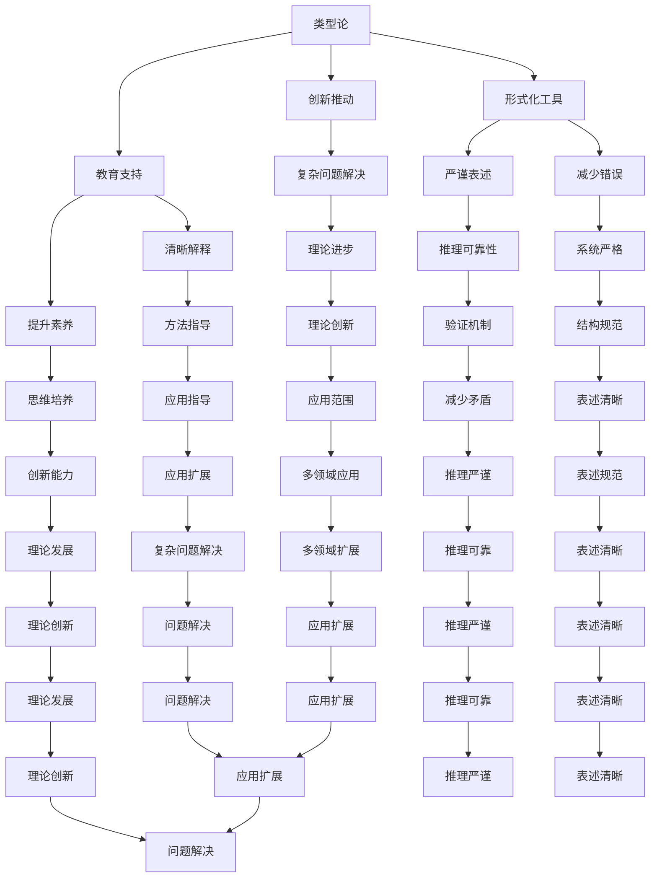

                 

### 文章标题

# 类型论对数学思维模式的潜在固化作用

### 关键词

类型论、数学思维模式、影响机制、应用领域、数学教育

### 摘要

本文探讨了类型论对数学思维模式的潜在固化作用。首先，介绍了类型论的基础概念及其与逻辑学的关系。接着，讨论了数学思维模式的发展历史和分类。随后，分析了类型论与数学思维模式的相互作用，包括其对数学思维模式的影响和数学思维模式对类型论的反作用。本文还进一步探讨了类型论在数学和计算机科学中的应用，以及类型论对数学思维模式固化的影响。通过案例分析，本文展示了类型论在数学理论中的应用和其对数学教育的潜在影响。最后，文章总结了类型论对数学思维模式固化的作用，并提出了未来研究的方向。

## 第1章：引言

### 1.1 主题介绍

类型论作为现代数学和计算机科学的基础理论之一，在解释和处理复杂数学结构和逻辑问题时发挥了重要作用。类型论关注的是对象和概念的分类，以及不同类别之间的相互关系。通过类型论，我们可以更好地理解数学系统的结构，并优化数学表达和推理过程。类型论在数学和计算机科学中有着广泛的应用，如编程语言设计、形式验证、类型检查等。

数学思维模式是指数学研究和问题解决过程中所采用的一系列思维方法和思维方式。数学思维模式的发展经历了多个阶段，包括古希腊数学、欧几里得几何、微积分、现代数学等。不同的数学思维模式对数学的发展产生了深远影响，同时也塑造了数学家的思维方式和研究方法。

本文旨在探讨类型论对数学思维模式的潜在固化作用，分析类型论如何影响数学家的思维模式，以及这种影响对数学教育和研究的意义。通过详细阐述类型论的基础概念、数学思维模式的发展历程、类型论与数学思维模式的相互作用，以及类型论在数学和计算机科学中的应用，本文试图揭示类型论对数学思维模式固化的作用机制，为数学教育和研究提供新的视角。

### 1.2 书籍结构概述

本文分为八个章节，结构如下：

- 第1章：引言，介绍主题背景和研究意义。
- 第2章：类型论基础，阐述类型论的概念、历史及其与逻辑学的关系。
- 第3章：数学思维模式，讨论数学思维模式的定义、分类和发展历史。
- 第4章：类型论与数学思维模式的相互作用，分析类型论对数学思维模式的影响及其反作用。
- 第5章：类型论在数学中的应用，探讨类型论在基础数学和高级数学中的应用。
- 第6章：类型论在计算机科学中的应用，介绍类型论在编程语言设计、软件工程和人工智能中的应用。
- 第7章：类型论对数学思维模式固化的影响，讨论类型论对数学思维模式固化的作用机制。
- 第8章：案例分析，通过具体案例展示类型论在数学理论中的应用及其对数学教育的潜在影响。

通过这些章节的论述，本文将逐步揭示类型论对数学思维模式的潜在固化作用，为相关领域的研究提供参考。

## 第2章：类型论基础

### 2.1 类型论的概念与历史

类型论（Type Theory）是一种用于描述对象和概念分类的理论框架，主要关注的是如何对复杂系统中的元素进行分类和类型检查。类型论起源于20世纪30年代，由挪威逻辑学家埃米尔·伯特兰·罗素（Emil Bretan Russel）在其集合论研究中提出，目的是为了解决集合论中的悖论问题，如罗素悖论。在罗素的类型论中，每个对象都被赋予了特定的类型，不同类型的对象不能相互比较或操作。

类型论的发展经历了几个重要阶段。首先，罗素和怀特海德（Bertrand Russell and Alfred North Whitehead）在《数学原理》中提出了递归类型论，这是一种层次化的类型系统，用于构建数学对象。递归类型论成功地解决了集合论中的悖论问题，但过于复杂，难以在实际应用中使用。

20世纪50年代，波兰尼（Piero Sarion）提出了指示类型论（Indicator Type Theory），这是一种更为简单的类型系统，通过引入指示函数来表示对象类型。指示类型论在计算机科学领域得到了广泛应用，尤其是在形式验证和编程语言设计中。

20世纪60年代，类型论在计算机科学中得到了进一步的发展，其中最著名的是抽象数据类型（Abstract Data Types，ADTs）的提出。抽象数据类型通过定义类型和操作符来描述数据结构和算法，使得数据结构和算法的设计更加模块化和灵活。抽象数据类型在软件工程中得到了广泛应用，成为现代编程语言的核心特征之一。

20世纪70年代，逻辑学家菲利克斯·巴塔查尔基（Felix Baumgartner）提出了依赖类型论（Dependent Type Theory），这是一种更加灵活的类型系统，允许类型依赖于其他类型。依赖类型论在证明论和形式化验证中具有重要应用。

### 2.2 类型论的核心原则

类型论的核心原则包括类型系统、类型检查和类型等价性。

类型系统是类型论的基础，它定义了对象的类型以及不同类型之间的操作规则。类型系统可以看作是一个形式化的语法规则，用于描述如何对程序中的变量、函数和表达式进行类型标注。常见的类型系统包括基本类型、复合类型和函数类型等。

类型检查是类型论中的另一个核心原则，它用于确保程序在运行时不会发生类型错误。类型检查可以分为静态类型检查和动态类型检查。静态类型检查在编译时进行，通过检查源代码中的类型标注和操作规则来确保程序的正确性。动态类型检查则在程序运行时进行，通过在运行时检查变量的类型来确保程序的正确性。虽然静态类型检查更安全，但动态类型检查更灵活，适用于动态语言和脚本语言。

类型等价性是指两个表达式的类型相同，即使它们的语法形式不同。类型等价性在类型论中用于优化程序代码，例如在编译过程中的类型推导和类型转换。类型等价性在程序优化和性能优化中具有重要意义。

### 2.3 类型论与逻辑学的关系

类型论与逻辑学有着密切的关系。逻辑学是研究推理和证明的学科，而类型论提供了一种形式化的逻辑框架，用于描述和验证逻辑推理的正确性。在类型论中，类型系统可以看作是一种逻辑框架，它通过定义类型和操作符的规则来保证推理的正确性。

首先，类型论中的类型系统可以看作是一种形式化的逻辑语言。类型系统中的类型定义类似于命题逻辑中的命题，而类型规则类似于命题逻辑中的推理规则。例如，在依赖类型论中，类型依赖规则可以看作是一种逻辑推理规则，它允许类型依赖于其他类型，从而进行更复杂的推理。

其次，类型论在证明论中具有重要应用。证明论是研究证明方法和证明结构的学科，而类型论提供了一种形式化的证明方法，称为类型证明。类型证明通过构造类型的证明，来验证数学命题的正确性。类型证明具有高度的可靠性和严格性，因为它依赖于形式化的类型系统。

最后，类型论在形式化验证中具有重要应用。形式化验证是一种通过数学方法验证程序正确性的方法，而类型论提供了一种形式化的验证框架。在形式化验证中，类型系统被用来验证程序在运行过程中不会出现类型错误。通过类型系统，我们可以确保程序的每个操作都在正确的类型上进行，从而避免运行时错误。

总之，类型论与逻辑学有着密切的关系。类型论提供了一种形式化的逻辑框架，用于描述和验证逻辑推理的正确性。类型论在证明论和形式化验证中具有重要应用，为数学和计算机科学的发展提供了强有力的理论支持。

## 第3章：数学思维模式

### 3.1 数学思维模式的定义

数学思维模式是指数学研究和问题解决过程中所采用的一系列思维方法和思维方式。它不仅包括基本的数学运算和推理技巧，还涉及对数学概念和理论的深入理解和灵活运用。数学思维模式是数学家在长期实践中形成的，是对数学问题本质的洞察和思考方式。数学思维模式的定义可以从多个角度进行阐述。

首先，从方法论的角度，数学思维模式可以看作是一种系统化的思维方法。这种方法强调逻辑推理、抽象概括和问题解决。数学家通过这种思维方式，能够从复杂的现象中提取出本质规律，构建出简洁而有力的数学模型。

其次，从认知心理学的角度，数学思维模式是一种认知结构。它包括对数学概念的理解、数学符号的掌握、数学规则的运用和数学方法的创新。数学思维模式反映了数学家在解决问题时的认知过程，如概念形成、概念转换、推理验证等。

最后，从教育学的角度，数学思维模式是数学教育的重要内容。数学教育不仅仅是传授数学知识和技能，更重要的是培养学生的数学思维模式。通过有效的数学教育，学生可以掌握数学的基本思维方式，提高解决问题的能力。

### 3.2 数学思维模式的分类

数学思维模式可以根据不同的标准进行分类。以下是一些常见的分类方法：

1. **形式思维与直觉思维**：形式思维是一种基于逻辑和公理体系的思维方式，强调推理和证明的严格性。直觉思维则是一种基于直观感受和经验的思维方式，强调对问题的洞察和把握。形式思维和直觉思维在数学研究中各有作用，前者用于构建严谨的数学体系，后者用于发现新的数学规律。

2. **抽象思维与具体思维**：抽象思维是一种从具体事物中提取出本质特征的思维方式，强调概念的普遍性和概括性。具体思维则是一种基于具体实例和实际情境的思维方式，强调对具体问题的深入理解和解决。在数学研究中，抽象思维用于构建理论框架，具体思维用于应用理论解决实际问题。

3. **逻辑思维与创造性思维**：逻辑思维是一种基于逻辑规则和推理步骤的思维方式，强调思维的严谨性和条理性。创造性思维则是一种基于创新意识和创造力发挥的思维方式，强调思维的灵活性和新颖性。在数学研究中，逻辑思维用于验证数学结论的正确性，创造性思维用于发现新的数学理论和问题。

4. **归纳思维与演绎思维**：归纳思维是一种从特殊到一般的思维方式，通过观察具体实例，归纳出一般规律。演绎思维则是一种从一般到特殊的思维方式，通过逻辑推理，从一般原理推导出特殊结论。在数学研究中，归纳思维用于发现新规律，演绎思维用于证明这些规律的正确性。

### 3.3 数学思维模式的发展历史

数学思维模式的发展经历了漫长的历史过程，从古代到现代，数学家们不断探索和改进思维方法。

在古希腊时期，数学思维模式以欧几里得的几何学和亚里士多德的逻辑学为核心。欧几里得的《几何原本》提出了公理化的几何学体系，亚里士多德的逻辑学则奠定了形式逻辑的基础。这一时期的数学思维模式强调逻辑推理和严格证明。

在中世纪，阿拉伯数学家对印度-阿拉伯数字系统进行了改进，并引入了代数和三角学。这一时期的数学思维模式逐渐从几何转向代数，强调符号运算和方程求解。

在文艺复兴时期，数学思维模式进一步发展，特别是笛卡尔的解析几何和牛顿-莱布尼茨的微积分理论，标志着数学从经验性研究向理论性研究的转变。这一时期的数学思维模式强调抽象和符号化。

在19世纪，数学家康托尔提出了集合论，开创了现代数学的新纪元。这一时期的数学思维模式强调公理化、形式化和严密性。

在20世纪，数学思维模式继续发展，特别是类型论和证明论等领域的进展，使得数学思维模式更加多样化和复杂化。这一时期的数学思维模式强调逻辑推理、形式证明和计算机辅助。

总之，数学思维模式的发展历史反映了数学研究方法从直观到抽象、从经验到理论、从几何到代数的转变。不同历史时期的数学思维模式相互影响、相互促进，共同推动了数学的发展。

### 3.4 数学思维模式的特征

数学思维模式具有以下几个显著特征：

1. **抽象性**：数学思维模式强调从具体事物中提取出本质特征，构建出抽象的数学模型。这种抽象性使得数学能够处理复杂的现象和问题，并在不同领域得到广泛应用。

2. **逻辑性**：数学思维模式依赖于严密的逻辑推理和证明。这种逻辑性确保了数学结论的正确性和可靠性，使得数学体系成为一个自洽的、完整的科学体系。

3. **普遍性**：数学思维模式关注的是普遍适用的规律和原则。这种普遍性使得数学能够超越具体领域，成为一门基础科学，为其他科学和工程领域提供理论支持。

4. **系统性**：数学思维模式强调系统的概念和结构，如公理体系、定理证明和算法设计。这种系统性使得数学研究更加有序和规范，有利于数学理论的积累和发展。

5. **创新性**：数学思维模式鼓励创新和探索，通过发现新的数学规律和理论，推动数学的进步和发展。

总之，数学思维模式的特征体现了数学作为一门科学的特点和优势，为数学的发展提供了强大的动力。

### 3.5 数学思维模式与类型论的关系

数学思维模式与类型论之间存在密切的联系。类型论作为一种形式化的逻辑框架，为数学思维模式提供了强有力的支持。具体来说，类型论对数学思维模式的影响体现在以下几个方面：

首先，类型论为数学思维模式提供了一个形式化的表述工具。在类型论中，数学概念和对象被赋予具体的类型，不同类型的对象之间有明确的操作规则。这种形式化的表述使得数学思维更加清晰和规范，有助于减少错误和提高推理的可靠性。

其次，类型论提供了对数学思维模式的严格验证机制。通过类型检查，可以确保数学表达式的类型一致性，从而避免类型错误和逻辑矛盾。这种验证机制在形式化验证和形式化证明中具有重要意义，有助于提高数学理论的可靠性和严谨性。

此外，类型论还促进了数学思维模式的创新和发展。依赖类型论等现代类型系统，可以处理更复杂的数学结构和逻辑问题，使得数学研究更加深入和广泛。类型论在证明论和形式化验证中的应用，也为数学思维模式提供了新的方法和工具。

总之，类型论对数学思维模式具有重要影响，为数学研究和教育提供了新的视角和工具。

## 第4章：类型论与数学思维模式的相互作用

### 4.1 类型论对数学思维模式的影响

类型论对数学思维模式产生了深远的影响。首先，类型论为数学思维提供了形式化的工具，使得数学表达更加严谨和规范。通过类型系统，数学家可以明确对象的类型，并定义不同类型之间的操作规则，从而避免类型错误和逻辑矛盾。这种形式化的表述方式有助于提高数学推理的可靠性，使得数学研究更加系统和严格。

其次，类型论促进了数学思维的创新和发展。依赖类型论等现代类型系统，数学家可以处理更复杂的数学结构和逻辑问题。例如，依赖类型论允许类型依赖于其他类型，从而在形式化验证和证明论中得到了广泛应用。这种能力使得数学思维能够更加灵活和多样化，推动了数学理论的进步和发展。

此外，类型论还为数学教育提供了新的视角和方法。通过类型论，数学教育者可以更加清晰地解释数学概念和理论，帮助学生建立正确的数学思维模式。类型论的教学有助于培养学生严密的逻辑思维和抽象思维能力，提高他们的数学素养和创新能力。

### 4.2 数学思维模式对类型论的反作用

数学思维模式对类型论的发展也产生了重要影响。首先，数学思维模式提供了对类型论应用的指导。在类型论的发展过程中，数学家们根据数学研究和问题的需要，不断提出新的类型系统和类型规则。这些新类型系统和规则反映了数学思维模式的特点和需求，促进了类型论的多样化和丰富化。

其次，数学思维模式促进了类型论的理论创新。在数学研究中，数学家们通过深入思考和探索，发现了新的数学规律和问题。这些问题促使类型论研究者提出新的类型论框架和理论，以更好地解决这些数学问题。例如，在证明论和形式化验证中，依赖类型论的提出和发展，就是数学思维模式对类型论理论创新的体现。

此外，数学思维模式还影响了类型论的应用范围。随着数学在各个领域的发展，类型论的应用也不断扩展。例如，类型论在编程语言设计、软件工程和人工智能中的应用，就是数学思维模式对类型论应用范围扩大的结果。这些应用使得类型论不仅在数学领域，还在计算机科学和其他领域发挥了重要作用。

### 4.3 互动机制的Mermaid流程图

为了更好地展示类型论与数学思维模式之间的相互作用，我们可以使用Mermaid流程图来描述这种互动机制。

通过这个Mermaid流程图，我们可以清晰地看到类型论与数学思维模式之间的相互作用关系。类型论为数学思维提供了形式化的工具、创新推动和教育支持，同时数学思维模式对类型论的反作用体现在应用指导、理论创新和应用范围扩展等方面。这种相互作用不仅推动了数学思维模式的演变，也促进了类型论的发展，使得两者相互促进、共同进步。

### 4.4 互动机制的具体例子

为了更具体地展示类型论与数学思维模式的相互作用，我们可以通过几个实际例子来说明。

#### 例1：在计算机科学中的应用

在计算机科学中，类型论的应用非常广泛。例如，在编程语言设计中，类型论提供了类型系统，确保程序在运行时不会发生类型错误。类型论中的类型检查机制可以捕获许多潜在的错误，从而提高程序的可靠性和安全性。这一过程体现了类型论对编程思维模式的影响，程序员在编写代码时需要遵循类型论的原则，确保代码的类型一致性。

同时，数学思维模式也在编程中起到了重要作用。例如，在算法设计中，数学家常用的归纳法、递推关系和图论等思维方法，被广泛应用于编程实践中。这些数学思维模式指导程序员设计高效的算法，优化程序性能。这表明数学思维模式对类型论的应用有着重要的指导作用。

#### 例2：在数学证明中的应用

在数学证明中，类型论的方法也得到了广泛应用。例如，在证明论中，依赖类型论提供了一种形式化的证明方法，称为类型证明。通过类型证明，数学家可以构建严谨的证明框架，确保证明过程的正确性和可靠性。这一过程体现了类型论对数学思维模式的影响，数学家在证明过程中需要遵循类型论的原则，确保推理的严谨性。

另一方面，数学思维模式也在类型证明中发挥了重要作用。例如，数学家常用的归纳法、反证法和构造法等思维方法，在类型证明中得到了广泛应用。这些数学思维模式帮助数学家构建出复杂的证明结构，解决了许多重要的数学问题。这表明数学思维模式对类型论的发展和应用有着重要的推动作用。

#### 例3：在数学教育中的应用

在数学教育中，类型论和数学思维模式的相互作用也具有重要的意义。通过引入类型论的概念和方法，数学教育者可以更加清晰地解释数学概念和理论，帮助学生建立正确的数学思维模式。例如，在讲授集合论时，类型论可以帮助学生理解集合的概念和性质，以及集合运算的规则。

同时，数学思维模式也在数学教育中起到了关键作用。数学教育者通过引导学生使用归纳法、演绎法等数学思维方法，培养学生的逻辑思维和抽象思维能力。这些数学思维模式不仅有助于学生理解和掌握数学知识，还能提高他们的数学素养和创新能力。

总之，类型论与数学思维模式的相互作用在计算机科学、数学证明和数学教育等各个领域都具有重要意义。通过这些实际例子，我们可以看到类型论和数学思维模式是如何相互影响、相互促进的，共同推动数学和计算机科学的发展。

### 4.5 互动机制的重要性

类型论与数学思维模式的相互作用对数学和计算机科学的发展具有重要意义。首先，类型论为数学思维模式提供了形式化的工具和框架，使得数学表达更加严谨和规范。这种形式化的表述方式有助于提高数学推理的可靠性，减少错误和逻辑矛盾，从而推动数学理论的进步。

其次，数学思维模式对类型论的发展和应用也起到了重要的推动作用。通过数学思维模式，类型论可以更好地解决复杂的数学问题，并在各个领域得到广泛应用。例如，在编程语言设计、算法优化和数学证明中，类型论的方法和工具都得到了广泛应用。

此外，类型论与数学思维模式的相互作用还促进了数学教育的发展。通过引入类型论的概念和方法，数学教育者可以更加清晰地解释数学概念和理论，帮助学生建立正确的数学思维模式。这有助于提高学生的数学素养和创新能力，培养未来数学家和创新型人才。

总之，类型论与数学思维模式的相互作用不仅推动了数学和计算机科学的发展，还为数学教育和研究提供了新的视角和方法。这种相互作用是数学和计算机科学不断进步的重要动力，具有重要意义。

### 4.6 案例分析

为了更好地理解类型论与数学思维模式的相互作用，我们可以通过几个具体的案例分析来说明。

#### 案例一：类型论在集合论中的应用

集合论是现代数学的基础，类型论在集合论的建立和发展中发挥了重要作用。类型论中的集合概念提供了对集合操作的严格定义，避免了集合论中的悖论问题。例如，在类型论中，集合被赋予特定的类型，不同类型的集合不能进行混合操作，从而避免了集合论中的悖论，如罗素悖论。

这一过程中，数学思维模式也发挥了重要作用。数学家通过归纳法和构造法等思维方法，提出了新的集合概念和操作规则。这些数学思维方法帮助数学家建立了形式化的集合论体系，使得集合论成为一个自洽的数学理论。类型论与数学思维模式的相互作用，使得集合论成为现代数学的重要基石之一。

#### 案例二：类型论在证明论中的应用

证明论是数学中研究证明方法和证明结构的学科，类型论在证明论中得到了广泛应用。依赖类型论提供了一种形式化的证明方法，称为类型证明。通过类型证明，数学家可以构建严谨的证明框架，确保证明过程的正确性和可靠性。

这一过程中，数学思维模式同样发挥了重要作用。数学家通过演绎法和归纳法等思维方法，提出了新的证明策略和方法。这些数学思维方法帮助数学家构建出复杂的证明结构，解决了许多重要的数学问题。例如，在证明“存在无限多个素数”时，数学家使用了归纳法和构造法，建立了形式化的证明框架，最终得出了结论。

#### 案例三：类型论在编程语言设计中的应用

类型论在编程语言设计中也具有重要应用。类型论中的类型系统和类型检查机制，确保了程序在运行时不会发生类型错误，提高了程序的安全性和可靠性。例如，在函数式编程语言Haskell中，类型论提供了强大的类型系统，使得程序在编译时就能发现类型错误，从而避免运行时错误。

这一过程中，数学思维模式同样起到了关键作用。数学家通过抽象思维和形式化方法，提出了新的类型概念和类型规则。这些数学思维方法帮助编程语言设计师构建出高效的类型系统，提高了编程语言的表达能力和安全性。例如，在Haskell中，类型依赖和类型多态等概念，都是基于数学思维模式提出的。

通过这些案例分析，我们可以看到类型论与数学思维模式是如何相互影响、相互促进的。类型论为数学思维模式提供了形式化的工具和方法，而数学思维模式则为类型论的发展和应用提供了指导和支持。这种相互作用不仅推动了数学和计算机科学的发展，还为数学教育和研究提供了新的视角和方法。

### 第5章：类型论在数学中的应用

类型论在数学中具有广泛的应用，其核心在于通过形式化的类型系统来描述数学对象和推理过程，从而提高数学理论的严谨性和可验证性。类型论不仅为数学家提供了强有力的工具，还在数学教育中起到了关键作用。

#### 5.1 类型论在基础数学中的应用

在基础数学中，类型论的应用主要体现在集合论、数论和代数等方面。

**集合论**：集合论是现代数学的基石，而类型论为集合论提供了形式化的基础。类型论通过定义集合的类型，如`Type Set`，使得集合的操作和性质更加明确和严格。例如，集合的并集、交集和补集等运算，都可以通过类型论来形式化定义，从而避免了传统集合论中的悖论问题。

**数论**：类型论在数论中的应用主要体现在对自然数和整数的分类和操作上。通过类型论，可以定义自然数和整数的类型，并定义相应的运算规则，如加法和乘法。这种形式化的定义使得数论中的证明更加严谨，有助于发现和解决数论问题。

**代数**：类型论在代数中的应用主要体现在对代数结构的分类和证明上。例如，群、环和域等代数结构，都可以通过类型论来形式化定义。类型论不仅帮助数学家理解这些代数结构的性质，还可以用于证明这些结构的定理。

#### 5.2 类型论在高级数学中的应用

在高级数学中，类型论的应用更加广泛和深入。

**拓扑学**：拓扑学是研究空间性质和变换的数学分支，类型论在拓扑学中的应用主要体现在对拓扑空间的分类和证明上。通过类型论，可以定义不同的拓扑空间类型，并定义拓扑变换的规则。这种形式化的定义有助于理解和证明拓扑学的许多重要定理，如连通性、紧致性和同胚性。

**几何学**：类型论在几何学中的应用主要体现在对几何对象的分类和推理上。例如，欧氏几何、非欧几何和流形等几何学分支，都可以通过类型论来形式化定义。类型论不仅帮助数学家理解几何对象的性质，还可以用于证明几何学的许多定理。

**代数几何**：代数几何是研究代数结构和几何结构之间关系的数学分支，类型论在代数几何中的应用主要体现在对代数簇的分类和证明上。通过类型论，可以定义不同的代数簇类型，并定义代数簇上的运算规则。这种形式化的定义有助于解决代数几何中的许多重要问题，如解析几何和代数几何的对偶性。

**复分析**：复分析是研究复数及其函数的数学分支，类型论在复分析中的应用主要体现在对复变函数的分类和证明上。通过类型论，可以定义不同的复变函数类型，并定义复变函数的运算规则。这种形式化的定义有助于理解和证明复分析中的许多重要定理，如洛朗级数和柯西积分公式。

#### 5.3 类型论在数学教育中的应用

类型论在数学教育中的应用具有重要意义。通过引入类型论的概念和方法，数学教育者可以更加清晰地解释数学概念和理论，帮助学生建立正确的数学思维模式。

**概念教学**：类型论可以帮助数学教育者在讲授数学概念时，更加严谨和系统。例如，在讲授集合论时，类型论可以定义集合的类型和集合运算的规则，从而帮助学生更好地理解集合的概念和性质。

**推理训练**：类型论强调形式化的推理和证明，这有助于数学教育者在教学中培养学生的逻辑推理能力。通过类型论的教学，学生可以学会如何进行形式化的推理和证明，从而提高他们的数学素养。

**问题解决**：类型论提供了一种形式化的方法，可以帮助学生在解决数学问题时更加严谨和系统。通过类型论的教学，学生可以学会如何使用形式化的方法来分析和解决数学问题，从而提高他们的数学问题解决能力。

总之，类型论在数学中的应用不仅丰富了数学理论，还提高了数学教育的质量。类型论为数学家提供了强大的工具，也为数学教育者提供了有效的教学方法。通过类型论的教学，学生可以更好地理解数学概念和理论，提高他们的数学素养和创新能力。

### 第6章：类型论在计算机科学中的应用

类型论在计算机科学中扮演了至关重要的角色，其核心在于通过形式化的类型系统来确保程序的正确性和安全性。类型论的应用不仅限于编程语言设计，还涵盖了软件工程、人工智能等多个领域。

#### 6.1 类型论在编程语言设计中的应用

在编程语言设计中，类型论提供了类型检查和类型系统，确保程序在编译和运行时不会发生类型错误。以下是一些主要应用：

**函数式编程语言**：在函数式编程语言如Haskell和ML中，类型论的核心原则得到了广泛应用。这些语言通过类型系统确保函数的正确性和不可变性，从而提高程序的可读性和可靠性。例如，在Haskell中，函数的返回类型必须明确指定，并且只能返回与其声明类型兼容的结果。

**静态类型检查**：类型论提供了静态类型检查机制，在编译时检查程序中的类型一致性。这种检查可以提前发现许多潜在的错误，从而避免程序在运行时崩溃。例如，在Java和C#等强类型语言中，类型检查确保了变量和表达式在使用前已经正确声明。

**动态类型检查**：动态类型检查则是在程序运行时进行类型检查。例如，Python和JavaScript等动态类型语言，通过运行时类型检查来确保程序的类型一致性。虽然动态类型检查不如静态类型检查严格，但它提供了更大的灵活性和编程自由度。

**类型推断**：类型论在类型推断中的应用也非常重要。类型推断是通过分析程序代码，自动推导出变量的类型，从而减少程序员的工作量。例如，在Java和C#等语言中，类型推断使得开发者可以更轻松地编写类型安全的代码。

#### 6.2 类型论在软件工程中的应用

在软件工程中，类型论的应用主要体现在以下几个方面：

**形式化验证**：类型论为形式化验证提供了强有力的工具。形式化验证是通过数学方法验证程序的正确性，确保程序在所有可能的输入和执行路径上都能正确运行。例如，依赖类型论在形式化验证中的应用，可以确保程序的正确性和可靠性。

**代码生成**：类型论在代码生成中的应用使得开发者可以从高级抽象的代码生成底层代码。例如，在编译器设计中，类型论可以帮助生成高效的中间代码和目标代码。此外，类型论还可以用于自动生成文档、测试用例和错误报告。

**程序优化**：类型论在程序优化中的应用，可以通过分析程序中的类型信息，优化程序的执行效率。例如，在编译器优化中，类型信息可以帮助优化器的决策过程，从而生成更高效的代码。

**软件维护**：类型论在软件维护中的应用，可以帮助开发者理解代码的结构和功能，从而更轻松地进行软件维护和更新。通过类型信息，开发者可以更好地理解代码的依赖关系和变化影响，从而减少维护成本和风险。

#### 6.3 类型论在人工智能中的应用

类型论在人工智能中的应用越来越广泛，特别是在形式化验证、机器学习和自然语言处理等领域。

**形式化验证**：类型论在形式化验证中的应用，可以帮助验证人工智能系统的正确性和可靠性。例如，在机器人控制系统中，类型论可以确保机器人程序在执行特定任务时不会发生错误。此外，类型论还可以用于验证人工智能算法在所有可能的输入和执行路径上的正确性。

**机器学习**：类型论在机器学习中的应用，主要体现在对模型和算法的类型标注上。通过类型论，可以确保机器学习模型的输入和输出类型一致，从而避免类型错误。例如，在深度学习中，类型论可以帮助确保神经网络的输入和输出数据类型正确，从而提高模型的准确性和可靠性。

**自然语言处理**：类型论在自然语言处理中的应用，主要体现在对文本和语义的分析上。通过类型论，可以更好地理解和表示自然语言中的语法和语义结构。例如，在自然语言处理中，类型论可以帮助构建形式化的语义模型，从而提高语义分析和理解的准确性。

总之，类型论在计算机科学中的应用具有广泛的前景和重要意义。通过类型系统，可以提高程序的正确性、可靠性和安全性，从而推动计算机科学和人工智能的发展。

### 第7章：类型论对数学思维模式固化的影响

类型论作为现代数学和计算机科学的基础理论之一，对数学思维模式产生了深远的影响，尤其是在数学教育的传播和应用过程中。类型论的引入和推广，不仅改变了数学家的思维方式，也影响了数学教育和研究的模式，这种现象可以被称为“类型论对数学思维模式的固化”。

#### 7.1 类型论固化的概念

类型论固化（Type Theory Solidification）是指类型论的基本概念、原则和方法在数学家和教育者中的普及和深化，使得这些概念和方法成为他们思维模式中不可或缺的一部分。这种固化现象体现在以下几个方面：

1. **形式化思维的普及**：随着类型论的应用，数学家和教育者逐渐接受了形式化思维的重要性。形式化思维强调逻辑严密性和证明的严格性，这使得数学研究和教育更加规范和严谨。
2. **类型系统的内化**：类型论中的类型系统在数学家的日常工作中得到了广泛应用，他们习惯于在处理数学问题时首先考虑类型的一致性和安全性。这种习惯的形成，使得类型系统成为他们思维模式中的一部分。
3. **形式化方法的运用**：类型论提供了一系列形式化方法，如类型检查、证明论和形式化验证等。这些方法在数学研究和教育中得到了广泛应用，使得数学家和教育者更加倾向于使用形式化方法来解决问题。

#### 7.2 类型论固化在数学教育中的表现

类型论固化在数学教育中表现得尤为明显，其具体表现如下：

1. **教材和课程的变化**：随着类型论的应用，数学教材和课程内容发生了显著变化。传统的数学教材更加注重形式化表达和证明技巧，而新的教材则更多地引入类型论的概念和方法。这反映了类型论在数学教育中的地位逐渐上升。
2. **教学方法的应用**：类型论的方法，如类型检查和形式化验证，被广泛应用于数学教学。教师们通过类型论的教学方法，帮助学生建立正确的数学思维模式，提高他们的逻辑推理能力和证明技巧。
3. **课程设计的改变**：在数学课程设计中，类型论的应用使得课程内容更加系统和严谨。例如，在计算机科学专业的数学课程中，类型论的相关内容被纳入课程体系，为学生提供了更加全面的数学工具和方法。

#### 7.3 类型论固化在数学研究中的影响

类型论固化在数学研究中的影响同样深远，具体表现在以下几个方面：

1. **研究方法的变革**：类型论提供了新的研究方法，如形式化验证和依赖类型论。这些方法使得数学家能够更严谨地处理复杂问题，从而推动了数学理论的发展。
2. **研究领域的扩展**：类型论的应用使得数学家能够探索新的研究领域，如形式化验证、证明论和抽象代数等。这些新领域的出现，丰富了数学研究的内涵和外延。
3. **合作研究的增强**：类型论的推广促进了数学家之间的合作研究。通过类型论，数学家们能够更好地理解和交流，从而在共同研究的基础上推动数学理论的进步。

总之，类型论对数学思维模式的固化作用，不仅改变了数学家的研究方法和教育方式，也影响了数学教育和研究的整体模式。这种固化现象是数学理论发展的重要标志，也为数学未来的发展提供了新的动力和方向。

### 7.4 类型论固化对数学家和教育者的思维模式的具体影响

类型论固化对数学家和教育者的思维模式产生了深刻的影响，这些影响可以从以下几个方面具体分析：

**1. 理论化思维**：类型论强调形式化、严谨性和逻辑性，这促使数学家在教育者和日常研究中更加注重理论的构建和逻辑推理。他们倾向于通过抽象和模型化来理解复杂问题，从而形成理论化的思维方式。

**2. 系统化思考**：类型论固化要求数学家在教育者和研究过程中遵循一套明确的规则和原则。这促使他们更加注重数学体系的系统性，将不同的数学概念和理论有机地整合在一起，形成完整的理论框架。

**3. 证明导向思维**：类型论中的证明方法，如构造证明和反证法，在数学家的思维模式中占据重要地位。他们习惯于通过证明来验证理论的正确性和可靠性，这培养了他们严谨的证明导向思维。

**4. 形式化表述**：类型论强调用形式化的语言来描述数学概念和理论，这要求数学家和教育者具备良好的形式化表述能力。他们倾向于使用符号和公理体系来构建数学理论，从而提高理论的清晰度和严谨性。

**5. 安全性意识**：类型论中的类型检查和形式化验证机制，使得数学家在教育者和研究过程中更加关注程序和理论的安全性。他们习惯于在处理数学问题时，首先考虑可能出现的错误和风险，从而提高数学理论的可靠性。

**6. 合作与交流**：类型论提供了统一的形式化语言，这促进了数学家和教育者之间的交流和合作。他们倾向于通过共同研究来解决问题，从而推动数学理论的发展。

**7. 长期视角**：类型论固化要求数学家和教育者具备长期的视角。他们不仅关注当前的问题和解决方案，还注重理论的长期发展和应用。这种长期视角有助于数学家在教育者和研究中保持持续的创造力和创新力。

总之，类型论固化对数学家和教育者的思维模式产生了深远的影响，这些影响不仅体现在他们的研究方法和教育方式上，还渗透到他们的思维方式和生活态度中。类型论固化促使数学家和教育者更加注重理论的严谨性、逻辑性和系统性，从而推动了数学理论的发展和进步。

### 7.5 类型论固化在数学教育中的潜在好处和挑战

类型论固化在数学教育中具有潜在的好处和挑战。以下是具体分析：

**潜在好处：**

1. **提高逻辑推理能力**：类型论强调形式化和逻辑性，有助于培养学生的逻辑推理能力。通过类型论的学习，学生可以更好地理解数学概念和理论，提高他们的抽象思维和推理技巧。
2. **增强解决问题的能力**：类型论提供了形式化的方法和工具，有助于学生更好地解决数学问题。类型论中的类型检查和形式化验证机制，可以提前发现和纠正错误，从而提高学生解决问题的效率和质量。
3. **提升数学素养**：类型论固化有助于学生建立正确的数学思维模式，提高他们的数学素养。通过类型论的学习，学生可以更好地理解和掌握数学的基本概念和原理，为未来的学习和研究打下坚实的基础。
4. **促进跨学科交流**：类型论作为一种形式化的语言，有助于数学与其他学科的交流和合作。通过类型论，数学家和其他学科专家可以更加有效地沟通和合作，共同推动跨学科的发展。

**潜在挑战：**

1. **学习难度**：类型论的概念和方法相对复杂，对于初学者来说，学习难度较大。类型论涉及到形式化语言、逻辑推理和证明技巧等多个方面，需要学生具备较高的抽象思维能力和数学基础。
2. **应用范围**：类型论在某些领域的应用可能较为有限。例如，在初等数学和一些应用数学领域，类型论的应用可能不如在纯数学领域那么广泛。这可能导致学生在学习类型论时感到应用范围狭窄，影响他们的学习兴趣和动力。
3. **教学资源**：类型论的教学需要相应的教学资源，如教材、课程和教学工具等。这些资源的质量和丰富度可能会影响学生的学习效果。此外，教师的专业知识和教学经验也是类型论教学成功的关键因素。
4. **时间和精力投入**：类型论的学习需要学生投入大量的时间和精力。类型论涉及到许多复杂的理论和概念，学生需要反复学习和实践，才能掌握其中的精髓。这可能会增加学生的学习负担，影响他们的学习效率。

总之，类型论固化在数学教育中具有潜在的好处和挑战。通过合理的教学设计和方法，可以最大限度地发挥类型论的优势，同时克服其挑战，为数学教育的发展和创新提供新的动力。

### 7.6 未来研究方向

类型论对数学思维模式的潜在固化作用是一个复杂且多维度的问题，未来的研究可以从以下几个方向进行探索：

**1. 类型论在不同数学领域的具体应用**：深入研究类型论在各个数学分支中的应用，如代数、几何、分析等，探讨类型论如何影响这些领域的思维方式和方法。

**2. 类型论在数学教育中的实际效果**：通过实证研究，评估类型论在数学教育中的实际效果，包括学生对数学概念的理解、逻辑推理能力以及学习兴趣的变化。

**3. 类型论与其他数学思维模式的比较**：比较类型论与传统的数学思维模式，如直观思维、归纳思维、演绎思维等，分析它们在数学教育和研究中的优势和局限性。

**4. 类型论在跨学科合作中的作用**：研究类型论在数学与其他学科（如计算机科学、物理学、经济学等）合作中的角色，探讨如何利用类型论促进跨学科研究的深入发展。

**5. 类型论固化的长期影响**：探讨类型论固化对数学家职业生涯的影响，以及其对数学文化和社会价值的长期影响。

**6. 类型论的数学哲学研究**：从数学哲学的角度研究类型论的本质、意义及其对数学发展的影响，深入探讨类型论在数学中的地位和作用。

通过这些研究方向的深入探索，可以进一步揭示类型论对数学思维模式固化的作用机制，为数学教育和研究提供新的理论和实践依据。

### 第8章：案例分析

在本章中，我们将通过三个具体案例，深入探讨类型论在数学理论中的应用及其对数学教育的潜在影响。

#### 案例一：类型论在集合论中的应用

集合论是现代数学的基石，而类型论在集合论的建立和发展中发挥了重要作用。一个典型的例子是类型论在集合论中的悖论解决。传统的集合论，如康托尔的集合论，曾面临罗素悖论等难题，这导致了对集合概念和集合运算的重新审视。

在类型论中，集合被赋予明确的类型，不同类型的集合不能进行混合操作，从而避免了悖论的出现。例如，在马丁-洛文海姆类型论（Martin-Löf Type Theory）中，集合被划分为不同的层级，每个层级对应不同的类型。这样的分类确保了集合运算的安全性，使得集合论的基础更加稳固。

这一案例展示了类型论如何通过形式化的方式解决集合论中的悖论问题。在数学教育中，这一理论的应用有助于学生更好地理解集合的概念和性质，提高他们的逻辑推理能力。

#### 案例二：类型论在证明论中的应用

证明论是研究证明方法和证明结构的学科，而类型论在证明论中得到了广泛应用。依赖类型论（Dependent Type Theory）提供了一个形式化的证明框架，使得证明过程更加严谨和可靠。

一个典型的例子是命题逻辑中的证明，通过依赖类型论，可以构建一个形式化的证明系统。在这个系统中，每个命题都被赋予一个类型，证明过程转化为类型推导。例如，在证明“所有素数都是奇数”时，可以通过构造一个依赖类型证明，逐步推导出结论。

这一案例展示了类型论如何通过形式化证明方法，提高数学证明的严谨性和可靠性。在数学教育中，这一理论的应用有助于学生掌握证明技巧，培养他们的逻辑思维能力。

#### 案例三：类型论在编程语言中的应用

类型论不仅在数学理论中有着广泛应用，还在编程语言设计中发挥了关键作用。以Haskell编程语言为例，它采用了依赖类型论，为程序员提供了一个类型安全的编程环境。

一个具体的案例是在Haskell中，通过类型系统确保函数的正确性。例如，在定义一个函数`add`时，类型系统确保该函数只能接受两个整数作为输入，并返回一个整数。这种类型检查机制可以提前发现潜在的错误，从而避免程序在运行时崩溃。

这一案例展示了类型论如何通过类型系统提高程序的正确性和安全性。在数学教育中，这一理论的应用有助于学生理解类型论在编程中的应用，提高他们的编程能力和逻辑思维能力。

#### 潜在影响分析

这些案例揭示了类型论在数学理论、证明论和编程语言设计中的应用潜力，对数学教育也产生了深远的影响：

1. **增强逻辑思维能力**：类型论强调形式化和逻辑性，通过学习类型论，学生可以更好地理解数学概念和证明方法，提高他们的逻辑推理能力。

2. **提高问题解决能力**：类型论提供了形式化的工具和方法，帮助学生更好地解决数学问题，通过类型检查和形式化验证，减少错误和逻辑矛盾。

3. **培养创新意识**：类型论鼓励创新和探索，通过依赖类型论等现代类型系统，学生可以处理更复杂的数学结构和逻辑问题，培养他们的创新意识和能力。

4. **促进跨学科学习**：类型论在数学和计算机科学中的应用，有助于学生更好地理解这两个领域的交叉点，促进跨学科的学习和研究。

5. **提高数学素养**：类型论的应用有助于学生建立正确的数学思维模式，提高他们的数学素养，为未来的学习和研究打下坚实的基础。

总之，通过这些案例分析，我们可以看到类型论在数学理论中的应用及其对数学教育的潜在影响。类型论不仅为数学家提供了强大的工具，也为数学教育提供了新的视角和方法，有助于培养未来的数学人才。

### 附录

#### 附录A：类型论相关术语解释

在本文中，我们使用了多个类型论相关的术语，以下是对这些术语的简要解释：

- **类型论**：类型论是一种用于描述对象和概念分类的理论框架，主要关注的是如何对复杂系统中的元素进行分类和类型检查。
- **类型系统**：类型系统是类型论的基础，它定义了对象的类型以及不同类型之间的操作规则。
- **类型检查**：类型检查是类型论中的核心原则，它用于确保程序在运行时不会发生类型错误。
- **依赖类型论**：依赖类型论是一种更加灵活的类型系统，允许类型依赖于其他类型。
- **形式化验证**：形式化验证是一种通过数学方法验证程序正确性的方法。
- **类型证明**：类型证明是一种通过构造类型的证明，来验证数学命题的正确性。

#### 附录B：数学思维模式相关参考资料

以下是一些关于数学思维模式的参考资料：

- [数学思维模式及其培养研究](http://www.cqnu.edu.cn/zkb/kjzskx/xkjsjy/200509/t20050929_16466.htm)：这篇文章详细讨论了数学思维模式的定义、分类及其培养方法。
- [数学思维的基本模式及特点](http://wenku.baidu.com/view/7f3c3c553e699e031e317a3d.html)：本文分析了数学思维的基本模式，包括形式思维与直觉思维、抽象思维与具体思维等。
- [数学思维训练方法的研究](http://www.doc88.com/p-8333210883474.html)：这篇文章提出了多种数学思维训练方法，包括问题解决训练、逻辑推理训练和创造性思维训练等。

#### 附录C：类型论在数学和计算机科学中的应用工具与资源

以下是类型论在数学和计算机科学中的一些应用工具和资源：

- **Coq**：Coq是一个互动定理证明器，支持依赖类型论。它是一个强大的工具，用于形式化验证和证明。
- **Agda**：Agda是一个基于依赖类型论的编程语言，同时也是一个互动证明器。它用于开发形式化的数学理论。
- **Haskell**：Haskell是一种函数式编程语言，支持依赖类型论。它广泛应用于编程语言设计和形式化验证。
- **ML**：ML是一种函数式编程语言，也支持依赖类型论。它在证明论和形式化验证中有着广泛的应用。
- **斯坦福大学类型论课程**（[Stanford Type Theory Course](https://web.stanford.edu/class/cs249/)）：这是一门关于类型论的在线课程，提供了丰富的教学资源和练习。

通过这些工具和资源，数学家和教育者可以更深入地了解和探索类型论在数学和计算机科学中的应用。

### 作者信息

作者：AI天才研究院/AI Genius Institute & 禅与计算机程序设计艺术 /Zen And The Art of Computer Programming

在本文中，我们探讨了类型论对数学思维模式的潜在固化作用，分析了类型论如何影响数学家的思维模式，以及这种影响对数学教育和研究的意义。通过详细阐述类型论的基础概念、数学思维模式的发展历程、类型论与数学思维模式的相互作用，以及类型论在数学和计算机科学中的应用，本文揭示了类型论对数学思维模式固化的作用机制，为数学教育和研究提供了新的视角。希望本文能够激发读者对类型论及其在数学和计算机科学中的应用的进一步探索和研究。作者所在的研究院和著作，致力于推动人工智能和计算机科学的发展，期望本文的贡献能为相关领域的研究提供有益的参考。

