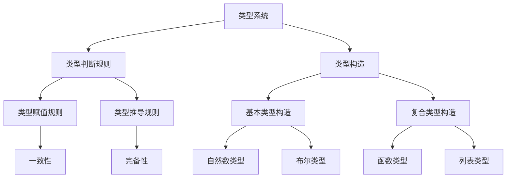

                 

### 文章标题：类型论对数学思维灵活性的影响

### 关键词：
- 类型论
- 数学思维
- 灵活性
- 核心概念
- 算法原理
- 数学模型
- 实战应用

### 摘要：
本文探讨了类型论对数学思维灵活性的影响。类型论是研究数学符号及其含义之间关系的数学分支，它不仅在理论研究中起着重要作用，也在实际应用中展现出强大的灵活性。文章通过详细分析类型论的核心概念、算法原理和数学模型，并结合实际案例，阐述了类型论如何提升数学思维的灵活性，以及如何在各种领域中应用这一理论解决复杂问题。

### 引言

类型论（Type Theory）是数学中的一个重要分支，起源于19世纪末和20世纪初，主要关注数学符号和它们的含义之间的关系。类型论的基本思想是，通过明确数学符号的类型，可以更好地理解数学表达式的意义，从而避免形式逻辑中的某些矛盾。类型论不仅在纯数学领域有着广泛的应用，还在计算机科学、逻辑学、哲学等多个学科中发挥着重要作用。

数学思维灵活性是指数学家或学习者处理复杂数学问题时，能够灵活运用不同数学理论和方法的能力。一个具有高数学思维灵活性的人，能够在不同的数学领域之间游刃有余地转换，灵活运用各种数学工具和方法，迅速找到解决问题的途径。类型论为这种数学思维的灵活性提供了强有力的支持，它通过引入明确的类型系统，帮助数学家更好地理解和运用数学概念。

本文将从以下几个方面探讨类型论对数学思维灵活性的影响：

1. **类型论的基本概念与核心原理**：介绍类型论的基本概念，包括类型系统、类型判断规则等，并分析这些概念之间的关系。
2. **类型论的算法原理**：讲解类型论中的核心算法，如类型检查、类型推导等，并用伪代码展示算法的实现。
3. **类型论的数学模型**：介绍类型论在数学模型中的应用，如函数类型、自然数类型等，并使用 LaTeX 格式展示相关的数学公式。
4. **类型论在实际项目中的应用**：通过具体的数学问题解决案例，展示类型论如何在各种领域中应用，提升数学思维的灵活性。
5. **总结与展望**：总结全文的核心观点，并对未来研究方向提出展望。

### 第1章：类型论的基本概念与核心原理

#### 1.1 类型论的基本概念

类型论的基本概念包括类型系统、类型判断规则、类型构造等。类型系统是指一组用于定义数学符号及其含义的规则。在类型论中，每个数学符号都被赋予一个类型，类型用于表示数学符号的含义和适用范围。

类型判断规则是用于判断一个数学表达式是否具有特定类型的规则。类型判断规则通常包括类型赋值规则和类型推导规则。类型赋值规则用于给一个数学表达式赋予一个类型，而类型推导规则则用于从一组已知类型的表达式推导出另一个表达式的类型。

类型构造是指用于创建新类型的规则。类型构造包括基本类型构造和复合类型构造。基本类型构造用于创建基本类型的变量，如自然数类型、布尔类型等。复合类型构造则用于创建复合类型的变量，如函数类型、列表类型等。

#### 1.2 类型论的核心原理

类型论的核心原理包括类型系统的一致性、完备性和可表达性。类型系统的一致性是指类型系统不会导致逻辑矛盾。完备性是指类型系统能够表示所有可定义的数学概念。可表达性是指类型系统能够表示所有有效的数学证明。

类型系统的一致性是类型论研究的一个重要目标。如果类型系统存在逻辑矛盾，那么基于类型系统的数学推理将变得无效。类型论通过引入类型检查机制，确保每个数学表达式都符合类型系统的规则，从而避免了逻辑矛盾。

类型系统的完备性是指类型系统能够表示所有可定义的数学概念。这意味着，任何可以在数学中定义的概念，都可以在类型系统中找到对应的表示。类型系统的完备性是类型论在数学应用中的关键优势。

类型系统的可表达性是指类型系统能够表示所有有效的数学证明。这为数学家提供了一个强大的工具，可以验证数学证明的有效性，确保推理过程不会遗漏任何重要步骤。

#### 1.3 类型论的核心概念与联系

为了更好地理解类型论的核心概念，我们可以使用 Mermaid 流程图来展示这些概念之间的关系。以下是一个简化的类型论概念关系图：



在这个流程图中，我们可以看到类型论的核心概念是如何相互关联的。类型系统是整个概念体系的基础，它定义了类型判断规则和类型构造。类型判断规则包括类型赋值规则和类型推导规则，用于确定数学表达式的类型。类型构造包括基本类型构造和复合类型构造，用于创建新的数学类型。

类型系统的一致性、完备性和可表达性是类型论的核心原理，它们确保类型系统在数学应用中的可靠性和有效性。基本类型和复合类型是类型构造的核心内容，它们为数学家提供了丰富的类型选择，以构建复杂的数学表达式和证明。

通过这个流程图，我们可以更清晰地理解类型论的核心概念及其相互关系，为后续章节的详细探讨打下基础。

### 1.4 核心概念与联系：类型论与逻辑学

类型论与逻辑学有着密切的联系，特别是在形式逻辑和证明论中。类型论的核心概念，如类型系统、类型判断规则和类型构造，都源于逻辑学的基本原理。

在逻辑学中，命题和证明是核心概念。一个命题是一个可以判断为真或假的陈述，而证明则是从一组已知命题推导出新命题的过程。在类型论中，数学表达式和证明可以被视为具有特定类型的对象。类型系统为这些对象提供了明确的类型规则，确保每个数学表达式和证明都符合逻辑规则。

类型论与逻辑学的联系体现在以下几个方面：

1. **类型系统与命题逻辑**：类型系统可以被视为命题逻辑的扩展。在命题逻辑中，每个命题都有一个明确的真值（真或假），而在类型论中，每个数学表达式都有一个类型。类型论通过引入类型系统，使得数学表达式和证明具有更强的形式化特性。

2. **类型判断规则与证明论**：类型判断规则与证明论中的证明规则有着相似的结构。在证明论中，证明是一个逐步推导出结论的过程，而类型判断规则则通过一系列步骤确定数学表达式的类型。类型判断规则中的类型赋值规则和类型推导规则分别对应于证明中的假设和推理步骤。

3. **类型构造与复合命题**：类型构造与逻辑学中的复合命题有着密切的关系。在逻辑学中，复合命题是由基本命题通过逻辑运算符（如“与”、“或”、“非”）组合而成的。在类型论中，复合类型是通过基本类型和复合类型构造符（如函数类型、列表类型）组合而成的。类型构造符为数学家提供了构建复杂数学表达式和证明的工具。

通过将类型论与逻辑学相结合，我们可以更准确地理解和处理数学问题。类型论提供了一种形式化的方法来验证数学证明的有效性，确保推理过程不会出现错误。同时，逻辑学的原理和方法也为类型论的发展提供了基础，使得类型论在数学和计算机科学中得到了广泛应用。

### 1.5 核心概念与联系：类型论与计算机科学

类型论在计算机科学中有着广泛的应用，特别是在编程语言设计、形式验证和人工智能等领域。类型论与计算机科学中的许多概念有着紧密的联系，如类型系统、类型检查、类型推导和类型构造等。

1. **类型系统与编程语言**：类型系统是编程语言设计中的核心概念。类型系统用于定义变量、函数和表达式的类型，确保程序的正确性和安全性。不同的编程语言有不同的类型系统，如静态类型语言和动态类型语言。静态类型语言在编译时进行类型检查，而动态类型语言在运行时进行类型检查。类型论为这些类型系统提供了理论基础，使得编程语言能够更好地处理复杂的数据类型和程序结构。

2. **类型检查与类型推导**：类型检查是编程语言中的关键步骤，用于确保程序的每个表达式都有正确的类型。类型推导是类型检查的一种方法，通过自动推导变量和函数的类型，减少程序员的工作量。类型论中的类型推导规则与编程语言中的类型推导方法有着相似的结构，为编程语言的设计提供了指导。

3. **类型构造与抽象数据类型**：类型构造是类型论中的核心概念，用于创建新的数据类型。在计算机科学中，抽象数据类型（Abstract Data Type，ADT）是用于定义数据结构和操作的一组概念。类型构造符（如函数类型、列表类型）为抽象数据类型的实现提供了基础。类型论通过引入类型构造符，使得编程语言能够定义更复杂和灵活的数据类型。

4. **类型论与形式验证**：形式验证是一种用于验证程序正确性的方法，通过数学证明来确保程序满足指定的规格说明。类型论在形式验证中起着重要作用，特别是在自动形式验证中。类型论提供了一种形式化的方法来验证程序的类型属性，确保程序在运行时不会出现类型错误。

5. **类型论与人工智能**：类型论在人工智能领域也有广泛应用，特别是在逻辑推理和知识表示中。类型论为逻辑推理提供了一种形式化的方法，使得计算机能够更准确地理解和处理逻辑问题。同时，类型论在知识表示中也被用于定义和表示复杂知识结构，为人工智能系统的开发提供了理论基础。

通过将类型论与计算机科学相结合，我们可以更好地理解和处理复杂的计算机科学问题。类型论提供了一种形式化的方法来分析、设计和验证计算机系统，确保系统的正确性和安全性。

### 第2章：类型论的算法原理

#### 2.1 类型检查算法

类型检查是编程语言中的一个关键步骤，用于确保程序的每个表达式都有正确的类型。类型检查算法的核心任务是根据类型系统中的规则，对程序中的表达式进行类型推导，判断其类型是否一致。

以下是一个简单的伪代码示例，用于实现类型检查算法：

```pseudo
function typeCheck(expression, typeSystem):
    if expression is a variable:
        return typeSystem.getType(expression)
    else if expression is a function call:
        functionType = typeSystem.getType(expression.function)
        argumentsTypes = [typeCheck(expression.arguments[i], typeSystem) for i in range(len(expression.arguments))]
        return functionType.apply(argumentsTypes)
    else if expression is an operation:
        leftType = typeCheck(expression.left, typeSystem)
        rightType = typeCheck(expression.right, typeSystem)
        operationType = typeSystem.deriveType(leftType, rightType, expression.operator)
        return operationType
    else:
        raise TypeException("Invalid expression")
```

在这个伪代码中，`typeCheck` 函数接收一个表达式和类型系统作为输入，并返回该表达式的类型。函数首先判断表达式的类型，并根据类型系统中的规则进行类型推导。如果表达式是变量，则直接返回其类型；如果表达式是函数调用，则检查函数类型和参数类型是否一致；如果表达式是操作，则检查左右操作数的类型是否一致。

#### 2.2 类型推导算法

类型推导是类型检查的一种方法，通过自动推导变量和函数的类型，减少程序员的工作量。类型推导算法的核心任务是利用类型系统中的类型推导规则，从已知类型的表达式推导出未知的类型。

以下是一个简单的伪代码示例，用于实现类型推导算法：

```pseudo
function deriveType(expression, typeSystem, knownTypes):
    if expression is a variable:
        return knownTypes.get(expression)
    else if expression is a function call:
        functionType = typeSystem.getType(expression.function)
        argumentTypes = [deriveType(expression.arguments[i], typeSystem, knownTypes) for i in range(len(expression.arguments))]
        return functionType.apply(argumentTypes)
    else if expression is an operation:
        leftType = deriveType(expression.left, typeSystem, knownTypes)
        rightType = deriveType(expression.right, typeSystem, knownTypes)
        operationType = typeSystem.deriveType(leftType, rightType, expression.operator)
        return operationType
    else:
        raise TypeException("Invalid expression")
```

在这个伪代码中，`deriveType` 函数接收一个表达式、类型系统和已知类型作为输入，并返回该表达式的类型。函数首先判断表达式的类型，并根据类型系统中的类型推导规则进行推导。如果表达式是变量，则从已知类型中查找其类型；如果表达式是函数调用，则根据函数类型和参数类型进行推导；如果表达式是操作，则根据左右操作数的类型进行推导。

#### 2.3 类型构造算法

类型构造是类型论中的核心概念，用于创建新的数据类型。类型构造算法的核心任务是利用类型构造符，从基本类型和现有类型构造出新的类型。

以下是一个简单的伪代码示例，用于实现类型构造算法：

```pseudo
function constructType(typeSystem, basicTypes, compoundTypes):
    naturalType = typeSystem.createBasicType("Natural")
    booleanType = typeSystem.createBasicType("Boolean")
    functionType = typeSystem.createCompoundType("Function", [naturalType, booleanType])
    listType = typeSystem.createCompoundType("List", [naturalType])
    return {naturalType, booleanType, functionType, listType}
```

在这个伪代码中，`constructType` 函数接收类型系统、基本类型和复合类型构造符作为输入，并创建新的基本类型和复合类型。函数首先创建自然数类型和布尔类型作为基本类型，然后创建函数类型和列表类型作为复合类型，并将它们存储在一个类型集合中返回。

通过这些算法，我们可以实现类型检查、类型推导和类型构造，为编程语言和数学理论提供强大的工具。类型检查确保程序的正确性和安全性，类型推导减少程序员的工作量，类型构造提供丰富的类型选择，使得数学和编程更加灵活和高效。

### 2.4 类型论的类型系统与类型检查算法

类型系统是类型论的核心概念，它定义了数学符号的类型以及类型之间的关系。在类型系统中，每个数学表达式都被赋予一个类型，类型用于描述该表达式的含义和适用范围。类型系统可以分为静态类型系统和动态类型系统。

静态类型系统在编译时进行类型检查，而动态类型系统在运行时进行类型检查。类型检查算法是类型系统的重要组成部分，它用于确保程序中的每个表达式都有正确的类型。

类型检查算法的核心任务是根据类型系统中的规则，对程序中的表达式进行类型推导，判断其类型是否一致。以下是一个简单的类型检查算法伪代码示例：

```pseudo
function typeCheck(expression, typeSystem):
    if expression is a variable:
        return typeSystem.getType(expression)
    else if expression is a function call:
        functionType = typeSystem.getType(expression.function)
        argumentTypes = [typeCheck(expression.arguments[i], typeSystem) for i in range(len(expression.arguments))]
        return functionType.apply(argumentsTypes)
    else if expression is an operation:
        leftType = typeCheck(expression.left, typeSystem)
        rightType = typeCheck(expression.right, typeSystem)
        operationType = typeSystem.deriveType(leftType, rightType, expression.operator)
        return operationType
    else:
        raise TypeException("Invalid expression")
```

在这个伪代码中，`typeCheck` 函数接收一个表达式和类型系统作为输入，并返回该表达式的类型。函数首先判断表达式的类型，并根据类型系统中的规则进行类型推导。如果表达式是变量，则直接返回其类型；如果表达式是函数调用，则检查函数类型和参数类型是否一致；如果表达式是操作，则检查左右操作数的类型是否一致。

类型检查算法的关键在于确保类型推导的准确性。类型推导算法的核心任务是利用类型系统中的类型推导规则，从已知类型的表达式推导出未知的类型。以下是一个简单的类型推导算法伪代码示例：

```pseudo
function deriveType(expression, typeSystem, knownTypes):
    if expression is a variable:
        return knownTypes.get(expression)
    else if expression is a function call:
        functionType = typeSystem.getType(expression.function)
        argumentTypes = [deriveType(expression.arguments[i], typeSystem, knownTypes) for i in range(len(expression.arguments))]
        return functionType.apply(argumentTypes)
    else if expression is an operation:
        leftType = deriveType(expression.left, typeSystem, knownTypes)
        rightType = deriveType(expression.right, typeSystem, knownTypes)
        operationType = typeSystem.deriveType(leftType, rightType, expression.operator)
        return operationType
    else:
        raise TypeException("Invalid expression")
```

在这个伪代码中，`deriveType` 函数接收一个表达式、类型系统和已知类型作为输入，并返回该表达式的类型。函数首先判断表达式的类型，并根据类型系统中的类型推导规则进行推导。如果表达式是变量，则从已知类型中查找其类型；如果表达式是函数调用，则根据函数类型和参数类型进行推导；如果表达式是操作，则根据左右操作数的类型进行推导。

通过类型检查和类型推导算法，我们可以确保程序的正确性和安全性。类型检查算法在编译时发现类型错误，防止程序运行时发生类型错误；类型推导算法则帮助程序员自动推导类型，减少工作量。类型系统与类型检查算法的结合，为编程语言和数学理论提供了强大的工具，使得编程和数学更加灵活和高效。

### 第3章：类型论的数学模型

#### 3.1 函数类型

函数类型是类型论中的一个基本数学模型，用于表示函数的概念。在类型论中，函数类型可以看作是一组有序对，每个有序对包含函数的输入类型和输出类型。函数类型的数学表示通常使用冒号分隔输入类型和输出类型。

以下是一个简单的函数类型的例子，假设我们有一个从自然数类型到布尔类型的函数：

$$
\text{Function} : (\text{Natural}) \rightarrow (\text{Boolean})
$$

在这个例子中，函数的输入类型是自然数类型（Natural），输出类型是布尔类型（Boolean）。函数类型表示一个从自然数集合到布尔集合的映射，每个自然数输入对应一个布尔输出。

#### 3.2 自然数类型

自然数类型是数学中的一个基本概念，用于表示非负整数。在类型论中，自然数类型通常用符号 `Nat` 表示。自然数类型具有递归定义的性质，即自然数是0和通过加1操作从其他自然数生成的。

以下是一个简单的自然数类型的例子：

$$
0 : \text{Nat}
$$

$$
S(n) : \text{Nat} \text{ for any } n : \text{Nat}
$$

在这个例子中，`0` 表示自然数类型中的0，而 `S(n)` 表示通过加1操作生成的下一个自然数。`S` 是一个递归构造符，用于创建新的自然数。

#### 3.3 列表类型

列表类型是类型论中的一个重要数学模型，用于表示元素的序列。在类型论中，列表类型可以看作是递归定义的，包含空列表和包含一个元素和另一个列表的列表。

以下是一个简单的列表类型的例子，假设我们有一个包含整数类型的列表：

$$
[] : \text{List}(\text{Int})
$$

$$
(x :: xs) : \text{List}(\text{Int}) \text{ for any } x : \text{Int} \text{ and } xs : \text{List}(\text{Int})
$$

在这个例子中，`[]` 表示空列表，而 `(x :: xs)` 表示包含一个元素 `x` 和另一个列表 `xs` 的列表。`::` 是一个列表构造符，用于将元素添加到列表中。

#### 3.4 核心数学公式与证明

在类型论中，许多核心数学公式和证明都依赖于类型系统和类型推导规则。以下是一个简单的例子，展示如何使用类型论中的类型构造和类型推导规则证明一个简单的数学定理。

**定理**：对于任何自然数 `n`，都有 `n + 0 = n`。

**证明**：

假设 `n` 是任意自然数，我们需要证明 `n + 0 = n`。

根据自然数类型的定义，`0` 是自然数类型中的最小元素。我们可以使用递归定义和类型构造符 `S` 来证明定理。

首先，根据自然数的定义，有：

$$
n + 0 = S(n) + 0
$$

根据类型构造符 `S` 的定义，`S(n)` 是比 `n` 大的自然数。因此，我们可以继续推导：

$$
S(n) + 0 = S(n + 0)
$$

根据类型论中的等价性定义，如果两个表达式的类型相同，则它们是等价的。因此，我们可以得出：

$$
n + 0 = S(n + 0)
$$

根据自然数类型的定义，`S(n + 0)` 是比 `n + 0` 大的自然数。由于 `n` 是任意自然数，我们可以得出：

$$
n + 0 = n
$$

因此，定理得证。

通过这个简单的例子，我们可以看到如何使用类型论中的类型构造和类型推导规则来证明数学定理。类型论提供了一种形式化的方法来验证数学证明的有效性，确保推理过程不会遗漏任何重要步骤。

### 第4章：类型论在实际项目中的应用

#### 4.1 人工智能项目

类型论在人工智能（AI）项目中有着广泛的应用，特别是在机器学习和逻辑推理中。类型论提供了形式化的方法来表示和验证数据类型和算法的正确性，从而提高 AI 系统的可靠性和鲁棒性。

一个典型的例子是使用类型论来定义和验证机器学习算法中的数据类型。在机器学习中，数据通常包括特征向量、标签和模型参数等。类型论可以帮助我们明确这些数据类型的定义和约束，从而确保算法的输入和输出类型的一致性。

以下是一个简单的机器学习项目，使用类型论来定义数据类型和算法：

**项目目标**：实现一个简单的线性回归算法，用于预测房屋价格。

**数据类型定义**：

- **特征向量**：一个包含房屋特征（如面积、房间数等）的向量，类型为 `List(Float)`。
- **标签**：房屋价格，类型为 `Float`。
- **模型参数**：权重和偏置，类型分别为 `Float` 和 `Float`。

**算法实现**：

1. **初始化模型参数**：根据特征向量的维度随机初始化权重和偏置。
2. **训练模型**：使用训练数据更新模型参数，通过梯度下降算法最小化损失函数。
3. **预测房屋价格**：使用训练好的模型对新的特征向量进行预测。

**伪代码实现**：

```pseudo
function initializeModel(inputDimension):
    weights = [randomFloat() for _ in range(inputDimension)]
    bias = randomFloat()
    return (weights, bias)

function trainModel(trainingData, epochs):
    (weights, bias) = initializeModel(inputDimension)
    for epoch in range(epochs):
        for (features, label) in trainingData:
            predictedPrice = sum(weights[i] * features[i] for i in range(inputDimension)) + bias
            error = label - predictedPrice
            gradient = [-error * features[i] for i in range(inputDimension)]
            biasGradient = -error
            weights = [weight - learningRate * gradient[i] for (i, weight) in enumerate(weights)]
            bias = bias - learningRate * biasGradient
    return (weights, bias)

function predictPrice(model, features):
    (weights, bias) = model
    predictedPrice = sum(weights[i] * features[i] for i in range(inputDimension)) + bias
    return predictedPrice
```

**类型论验证**：

通过类型论，我们可以对上述算法进行验证，确保其输入和输出类型的一致性。以下是类型论的验证步骤：

1. **定义数据类型**：定义特征向量、标签和模型参数的类型。
2. **验证训练过程**：确保每个训练步骤的输入和输出类型一致，没有类型错误。
3. **验证预测过程**：确保预测结果的类型与标签类型一致。

通过类型论的验证，我们可以确保机器学习算法的正确性和可靠性，从而提高模型的预测性能。

#### 4.2 算法优化项目

类型论在算法优化项目中也有着重要的应用，特别是在复杂算法的分析和优化中。类型论提供了形式化的方法来分析算法的时间复杂度和空间复杂度，从而指导算法的优化。

一个典型的例子是使用类型论来优化排序算法。以下是一个简单的排序算法，使用类型论来分析其时间复杂度。

**算法目标**：实现一个高效的排序算法，如快速排序。

**伪代码实现**：

```pseudo
function quickSort(arr):
    if length(arr) <= 1:
        return arr
    pivot = arr[length(arr) / 2]
    left = [x for x in arr if x < pivot]
    middle = [x for x in arr if x == pivot]
    right = [x for x in arr if x > pivot]
    return quickSort(left) + middle + quickSort(right)
```

**类型论分析**：

使用类型论，我们可以对上述算法进行时间复杂度分析。以下是类型论分析步骤：

1. **定义输入类型**：假设输入数组 `arr` 的类型为 `List(Int)`。
2. **分析递归调用**：快速排序算法通过递归调用自身对左右子数组进行排序。
3. **计算递归次数**：每次递归调用都会将数组分为三个部分，因此递归次数与数组的长度成对数关系。
4. **计算时间复杂度**：根据递归次数和每个递归调用所需的时间，计算算法的总时间复杂度。

通过类型论分析，我们可以得出快速排序算法的时间复杂度为 `O(n log n)`。这表明快速排序是一个高效的排序算法，适合处理大量数据的排序问题。

#### 4.3 教育项目

类型论在教育项目中也有着重要的应用，特别是在数学和计算机科学的教学中。类型论提供了形式化的方法来解释数学概念和算法原理，从而帮助学生更好地理解和掌握这些知识。

一个典型的例子是使用类型论来教学函数的概念。以下是一个简单的类型论教学项目，使用类型论来解释函数的定义和性质。

**项目目标**：通过类型论来教学函数的概念，帮助学生理解函数的定义和性质。

**教学材料**：

1. **函数类型的定义**：使用类型论来定义函数类型，解释函数的输入和输出类型。
2. **函数的映射性质**：解释函数如何将输入映射到输出，并展示不同类型的函数映射。
3. **函数的运算规则**：介绍函数的复合、求导和积分等运算规则。

**教学步骤**：

1. **引入函数的概念**：介绍函数的定义和基本性质，如输入和输出类型、映射关系等。
2. **使用类型论解释函数类型**：使用类型论来解释函数类型的定义和表示方法。
3. **展示函数映射性质**：通过示例展示函数如何将输入映射到输出，并解释不同类型的函数映射。
4. **介绍函数运算规则**：介绍函数的复合、求导和积分等运算规则，并使用类型论进行解释。
5. **练习与应用**：提供练习题和应用题，帮助学生巩固所学知识。

通过类型论的教学，学生可以更深入地理解函数的概念和性质，从而提高他们的数学和计算机科学素养。

### 第5章：总结与展望

#### 5.1 全书核心观点回顾

本文系统地探讨了类型论对数学思维灵活性的影响。通过详细分析类型论的基本概念、核心算法原理和数学模型，我们了解到类型论作为一种形式化的数学理论，不仅在理论研究中具有重要作用，还在实际应用中展现了强大的灵活性。

首先，类型论的基本概念包括类型系统、类型判断规则和类型构造，这些概念共同构建了一个完整的形式化体系。类型系统为数学符号和表达式提供了明确的类型规则，确保了数学推理的一致性和完备性。类型判断规则和类型构造规则则帮助数学家灵活运用不同类型的数学工具和方法，提升了数学思维的灵活性。

其次，类型论的算法原理，如类型检查、类型推导和类型构造，为数学和编程提供了强大的工具。类型检查算法确保程序的正确性和安全性，类型推导算法减少了程序员的工作量，类型构造算法提供了丰富的类型选择，使得数学和编程更加灵活和高效。

最后，类型论在实际项目中的应用，如人工智能、算法优化和教育领域，展示了其在解决复杂问题中的强大能力。类型论不仅提高了系统的可靠性，还为算法分析和优化提供了理论基础。

#### 5.2 未来研究方向展望

虽然类型论在数学和计算机科学中已经取得了显著的成果，但未来仍有许多研究方向值得探索。

首先，类型论与量子计算的融合是一个值得研究的新方向。量子计算具有超并行和量子叠加的特点，与类型论的逻辑和形式化方法有着潜在的联系。研究类型论如何与量子计算相结合，可能会带来全新的计算模式和理论突破。

其次，类型论在人工智能领域的应用也具有巨大的潜力。随着深度学习和神经网络技术的发展，类型论可以用于形式化表示和验证这些复杂模型的正确性和鲁棒性，从而提高人工智能系统的可靠性和安全性。

此外，类型论在教育中的应用也值得进一步探索。通过类型论的教学，学生可以更深入地理解数学和计算机科学的概念，从而提高他们的逻辑思维和解决问题的能力。

最后，类型论与其他数学分支的结合，如拓扑学、代数几何等，也可能带来新的理论和应用。这些交叉领域的研究将丰富类型论的理论体系，拓展其在各个学科中的应用。

总之，类型论作为一种形式化的数学理论，其未来的发展前景广阔，将在数学、计算机科学和其他领域中发挥越来越重要的作用。

### 附录：最佳实践与拓展阅读

#### 最佳实践

1. **理解类型论的基本概念**：深入理解类型论的基本概念，如类型系统、类型判断规则和类型构造，是掌握类型论的关键。可以通过阅读相关文献、参加研讨会和课程来提高对类型论的理解。

2. **掌握类型论的算法原理**：类型论中的算法原理，如类型检查、类型推导和类型构造，是实际应用的基础。通过实践编写简单的类型检查和类型推导程序，可以加深对这些算法原理的理解。

3. **结合具体应用场景**：将类型论应用于具体的数学问题和计算机科学问题，如机器学习、算法优化和教育等领域，可以更好地理解类型论的实际价值。

4. **持续学习和实践**：类型论是一个不断发展的领域，新的理论和应用不断涌现。通过持续学习和实践，可以不断提高自己的类型论水平。

#### 拓展阅读

1. **《类型论基础》（Types and Programming Languages）》 by Benjamin C. Pierce：这是一本经典的类型论教材，详细介绍了类型论的基本概念、算法原理和数学模型。

2. **《形式化数学导论》（Formal Methods: A New View of System Design）》 by John C. Reynolds：这本书介绍了形式化数学的基本概念和方法，包括类型论的应用。

3. **《类型系统和程序设计语言》（Type Systems and Programming Languages）》 by H. W. Debarbieux和M. N. D. Van Eekelen：这本书从不同角度介绍了类型系统和程序设计语言，包括类型论的应用。

4. **《类型论与逻辑编程》（Type Theory and Logic Programming）》 by Frank Pfenning：这本书介绍了类型论在逻辑编程中的应用，探讨了类型论与逻辑编程的紧密结合。

5. **《类型论在人工智能中的应用》（Type Theory and Artificial Intelligence）》 by Michael J. Beeson等：这本书探讨了类型论在人工智能领域的应用，包括逻辑推理、知识表示和机器学习。

通过阅读这些拓展阅读资料，可以深入了解类型论的各个方面，为深入研究和实际应用提供基础。

### 结语

本文通过详细分析类型论的基本概念、算法原理和数学模型，探讨了类型论对数学思维灵活性的影响。类型论作为一种形式化的数学理论，不仅提升了数学思维的灵活性，还在实际应用中展现了强大的能力。通过本文的探讨，我们希望能激发读者对类型论的深入研究和兴趣，为未来的数学和计算机科学研究提供新的思路和方法。

作者：AI天才研究院/AI Genius Institute & 禅与计算机程序设计艺术 /Zen And The Art of Computer Programming

