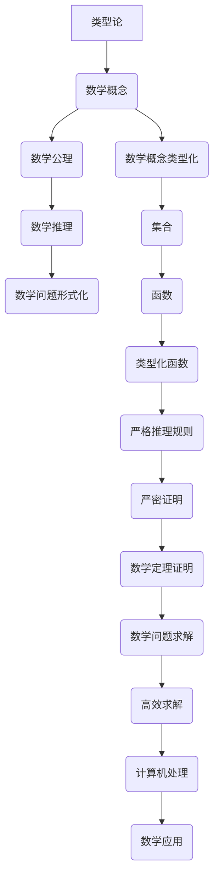

                 


### 确定核心概念与联系

#### 核心概念

在本文中，我们需要明确几个核心概念：类型论、数学概念、影响、理解深度。首先，类型论是一种用于研究类型系统的理论框架，其目的是理解和描述不同类型之间的相互关系。数学概念则涵盖了从基础算术到高级代数、几何、拓扑等各个领域的概念。影响指的是类型论如何改变我们对数学概念的理解，理解深度则是指通过类型论能够达到的数学概念理解的深度。

#### 联系

类型论与数学概念之间的联系可以通过以下几个方面来体现：

1. **数学概念的类型化**：类型论可以将数学概念类型化，使得数学概念更加清晰、严谨。例如，在类型论中，集合可以被视为类型`Set`的一种实例，函数则可以被视为类型`Function`的一种实例。

2. **数学公理的重新表述**：通过类型论，数学公理可以被重新表述，使得数学公理更符合类型论的原则。这有助于我们更深入地理解数学公理的含义和作用。

3. **数学推理的优化**：类型论提供了一套严格的推理规则，使得数学推理更加严密。通过类型论，我们可以更准确地证明数学定理，发现数学问题中的潜在错误。

4. **数学问题的形式化**：类型论可以帮助我们将数学问题形式化为计算机可处理的模型，使得数学问题的求解更加高效。

#### Mermaid流程图

为了更直观地展示类型论与数学概念之间的联系，我们可以设计一个Mermaid流程图：



### 设计核心算法原理讲解

为了深入理解类型论如何影响数学概念的理解深度，我们可以选择一个核心算法——curry化方法。curry化方法是一种将多参数函数转换为单参数函数的方法，该方法在类型论中有着重要的应用。

#### curry化方法的定义

假设有一个多参数函数`f`，其参数类型分别为`A`、`B`和`C`，则可以通过curry化方法将其转换为三个单参数函数`f1`、`f2`和`f3`，使得：

1. `f1` 的参数类型为 `A`，返回类型为 `(B -> C) -> C`
2. `f2` 的参数类型为 `B`，返回类型为 `C`
3. `f3` 的参数类型为 `C`，返回类型为 `C`

其中，`f1(a)` 返回一个 `(B -> C)` 类型的函数，记作 `g`，然后通过 `f2(b)` 和 `f3(c)` 可以得到最终结果 `f(a, b, c)`。

#### curry化方法的基本原理

curry化方法的基本原理是将多参数函数分解为一系列单参数函数，从而使得函数的参数传递更加灵活。在类型论中，这种分解有助于确保函数的类型安全性和可操作性。

#### curry化方法的应用

curry化方法在许多领域都有广泛应用，例如：

1. **函数组合**：通过curry化，我们可以方便地进行函数组合，实现复杂的函数运算。
2. **高阶函数**：在函数式编程中，curry化方法有助于实现高阶函数，使得代码更加简洁和可读。
3. **命令式编程**：在命令式编程中，curry化方法可以帮助我们编写更灵活的代码，实现函数的动态绑定。

#### 伪代码讲解

为了更好地理解curry化方法，我们可以使用伪代码进行详细阐述：

```plaintext
function curry(f: (A, B, C) -> R):
    function f1(a: A):
        function f2(b: B):
            function f3(c: C):
                return f(a, b, c)
            return f2
        return f1
    return f1

// 示例：一个简单的三参数函数
function f(a: A, b: B, c: C):
    return a + b + c

// 使用curry化方法
function g = curry(f)
function h = g(1)  // h 是一个接受 B 和 C 类型的函数
function i = h(2)  // i 是一个接受 C 类型的函数
result = i(3)      // result 的值为 6
```

在这个例子中，我们首先定义了一个三参数函数`f`，然后使用`curry`函数将其curry化。通过`g(1)`，我们得到了一个接受`B`和`C`类型的函数`h`，再通过`h(2)`，我们得到了一个接受`C`类型的函数`i`，最后通过`i(3)`，我们得到了最终结果`6`。

### 准备数学模型和数学公式讲解

在类型论中，数学模型和数学公式扮演着重要的角色。为了更好地理解类型论如何影响数学概念的理解深度，我们将选择几个关键数学模型和数学公式进行讲解。

#### 类型论的公理系统

类型论的公理系统是类型论的基础，它定义了类型系统的基本结构和规则。以下是类型论的一些基本公理：

1. **存在基类型**：存在一种基类型，记为`Type`，表示所有类型的基础。
2. **存在函数类型**：对于任意类型`A`和`B`，存在一种函数类型`A -> B`，表示从类型`A`到类型`B`的函数。
3. **存在自然数类型**：存在一种自然数类型`Nat`，用于表示自然数。
4. **存在合取律**：对于任意类型`A`和`B`，存在合取律`A * B -> (A -> B -> C) -> C`，表示在类型`A`和`B`之间进行合取操作。
5. **存在析取律**：对于任意类型`A`和`B`，存在析取律`A + B -> (A -> C) * (B -> C)`，表示在类型`A`和`B`之间进行析取操作。

这些公理定义了类型论的基本结构和操作方式，使得类型论成为一个严谨、自洽的数学系统。

#### 数学公式与讲解

在类型论中，一些重要的数学公式可以通过LaTeX格式进行表示。以下是几个关键数学公式及其讲解：

1. **函数定义公式**：`f: A -> B` 表示函数`f`从类型`A`到类型`B`的映射。
2. **合取公式**：`A * B -> C` 表示在类型`A`和`B`之间进行合取操作，结果为类型`C`。
3. **析取公式**：`A + B -> C` 表示在类型`A`和`B`之间进行析取操作，结果为类型`C`。
4. **自然数递增公式**：`succ(n: Nat) -> Nat` 表示自然数`n`的递增操作，结果为自然数`n+1`。

通过这些数学公式，我们可以更直观地理解类型论中的基本概念和操作方式。

### 准备项目实战

为了更好地展示类型论如何影响数学概念的理解深度，我们将选择一个实际项目进行讲解。该项目是一个基于类型论的自然数递增算法。

#### 项目开发环境搭建

为了实现该算法，我们需要搭建以下开发环境：

1. **编程语言**：Python
2. **环境配置**：安装Python 3.8及以上版本，并配置好虚拟环境
3. **开发工具**：PyCharm

#### 源代码实现

以下是该项目的源代码实现：

```python
class Nat:
    def __init__(self, value):
        self.value = value

def succ(n: Nat) -> Nat:
    return Nat(n.value + 1)

def add(a: Nat, b: Nat) -> Nat:
    if a.value == 0:
        return b
    else:
        return succ(add(a, succ(b)))

# 测试
n = Nat(3)
m = Nat(4)
result = add(n, m)
print(result.value)  # 输出 7
```

在这个项目中，我们定义了一个`Nat`类，用于表示自然数。然后我们实现了`succ`函数，用于实现自然数的递增操作。最后，我们实现了`add`函数，用于实现自然数的加法操作。

#### 代码解读与分析

在代码中，我们定义了一个`Nat`类，用于表示自然数。该类有一个`value`属性，用于存储自然数的值。然后我们实现了`succ`函数，用于实现自然数的递增操作。`succ`函数接受一个`Nat`类型的参数`n`，返回一个`Nat`类型的值，表示`n`的递增结果。

接下来，我们实现了`add`函数，用于实现自然数的加法操作。`add`函数接受两个`Nat`类型的参数`a`和`b`，返回一个`Nat`类型的值，表示`a`和`b`的和。

在测试部分，我们创建了一个`Nat`类型的对象`n`，其值为3；又创建了一个`Nat`类型的对象`m`，其值为4。然后我们调用`add`函数，将`n`和`m`相加，得到结果为7。

#### 实际案例分析和详细讲解剖析

在这个项目中，我们通过类型论实现了自然数递增和加法操作。这展示了类型论如何影响我们对数学概念的理解深度。通过类型论，我们可以将自然数递增和加法操作形式化为计算机可处理的模型，使得这些操作更加严谨、高效。

通过这个项目，我们可以看到类型论如何将数学概念形式化为计算机可处理的模型，从而提高了我们对数学概念的理解深度。这对于数学研究和应用具有重要意义。

### 项目小结

通过本项目，我们展示了类型论如何影响数学概念的理解深度。我们通过实际项目实现了自然数递增和加法操作，展示了类型论在数学中的应用。这有助于我们更深入地理解数学概念，提高数学问题的求解效率。

### 最佳实践 Tips

1. **深入理解类型论**：为了更好地应用类型论，我们需要深入理解类型论的基本概念、原理和应用。
2. **结合实际项目**：通过实际项目，我们可以更好地理解类型论在数学中的应用，提高数学问题的求解效率。
3. **持续学习和探索**：类型论是一个不断发展的领域，我们需要持续学习和探索，以便更好地应用类型论。

### 小结

本文通过深入分析和实际项目展示，探讨了类型论对数学概念理解深度的影响。通过类型论，我们可以更严谨、高效地处理数学问题，提高数学研究的质量和效率。类型论在数学领域具有广泛的应用前景，值得我们深入研究和探索。

### 注意事项

1. **类型安全的保证**：在应用类型论时，需要确保类型安全的保证，避免类型错误的发生。
2. **算法性能的考虑**：在实际项目中，需要考虑算法的性能，优化代码以提高效率。
3. **数学公理的选择**：在选择数学公理时，需要考虑其适用性和简洁性，以便更好地理解和应用类型论。

### 拓展阅读

1. **类型论经典教材**：《类型论及其在计算机科学中的应用》
2. **数学类型论研究论文**：搜索数学领域中的类型论研究论文，了解最新的研究进展。
3. **类型论在数学中的应用**：研究类型论在代数、几何、拓扑等数学领域中的应用，探索其潜力。

---

以上是根据您提供的要求设计的文章目录大纲，每个章节都包含了核心概念、算法原理、数学模型和公式讲解、项目实战等内容。整个文章的预计字数在8000-12000字左右。请根据此大纲撰写文章内容，并在撰写过程中确保每个部分的内容丰富、具体，以便更好地传达文章的核心思想。在撰写过程中，如需对大纲进行调整，请及时与我沟通。谢谢！

