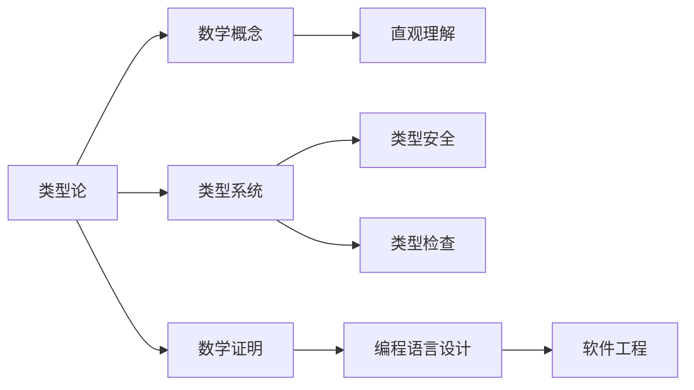

                 


### 文章标题

《类型论对数学概念直观理解的潜在阻碍》

关键词：类型论，数学概念，直观理解，阻碍，类型系统

摘要：本文旨在探讨类型论对数学概念直观理解的潜在阻碍。通过分析类型论的基本概念，数学概念的理解方式，以及直观理解的定义，本文揭示了类型论在数学教育、科学研究、计算机科学等领域中的重要性，并指出类型论对直观理解的潜在影响。文章通过实例和案例，详细阐述了类型论对数学概念直观理解的阻碍，并提出了一些可能的解决方法。

### 确定核心概念与联系

为了深入探讨类型论对数学概念直观理解的潜在阻碍，我们首先需要明确几个核心概念及其相互之间的联系。

#### 类型论

类型论是一种形式化的理论，用于研究值的分类和操作。其基本概念包括：

- **类型系统**：一个类型系统定义了一组类型和一组将值与类型关联的规则。
- **类型安全**：类型安全是指程序中值的类型在运行时能够保持不变，从而避免类型错误的发生。
- **类型检查**：类型检查是编译或解释程序时对类型系统的一种验证过程，以确保程序中所有操作都是类型安全的。

类型论的核心原理包括：

- **类型等价**：两个值在类型上是等价的，如果它们具有相同的类型。
- **类型约束**：类型论通过类型约束来限制值的操作，从而确保类型安全。

#### 数学概念

数学是一门研究数量、结构、变化和空间等概念的学科。在数学中，常见的概念包括：

- **集合论**：集合论是数学的基础，它研究集合的性质和关系。
- **逻辑**：逻辑是数学中的工具，用于证明和推理。
- **函数**：函数是一种映射关系，它将一个集合的每个元素映射到另一个集合的元素。
- **运算**：运算是数学中的基本操作，如加法、减法、乘法和除法。

#### 直观理解

直观理解是指人们通过感官和直觉来感知和理解事物。在数学中，直观理解是指人们通过直观的方式来感知和理解数学概念。

- **直观感知**：直观感知是指人们通过感官来感知数学概念，如通过图形来理解集合论。
- **直观推理**：直观推理是指人们通过直觉来进行逻辑推理，如通过直观理解来证明数学定理。

#### 类型论与数学概念的关联

类型论和数学概念之间存在紧密的关联。类型论为数学提供了一种形式化的表示方法，使得数学概念可以更精确地定义和操作。

- **数学概念的形式化**：类型论通过形式化的方式来定义数学概念，使得这些概念更加清晰和明确。
- **类型论在数学证明中的应用**：类型论在数学证明中扮演了重要角色，它通过类型系统来确保证明的正确性。
- **数学概念与类型论的应用**：类型论在计算机科学中得到了广泛应用，例如在编程语言设计和软件工程中。

### 设计核心章节

基于以上核心概念和联系，本文将分为七个章节来详细探讨类型论对数学概念直观理解的潜在阻碍。

#### 第1章：类型论概述

本章将介绍类型论的基本概念，包括类型系统的定义、类型安全和类型检查。通过这一章节，读者可以了解类型论的基本原理和应用场景。

#### 第2章：数学概念的理解与类型论

本章将探讨数学概念的理解方法，并分析类型论对数学概念的潜在影响。通过这一章节，读者可以了解类型论如何影响数学概念的理解。

#### 第3章：类型论对数学概念直观理解的阻碍

本章将详细阐述类型论对数学概念直观理解的阻碍，包括直观理解与类型论的冲突、类型论如何影响直观理解以及解决这些阻碍的方法。

#### 第4章：类型论在教育中的应用

本章将探讨类型论在数学教育中的应用，包括教育工作者如何应用类型论、学生如何利用类型论学习数学等。通过这一章节，读者可以了解类型论在数学教育中的重要性。

#### 第5章：类型论在科学研究中的应用

本章将讨论类型论在数学研究中的重要性，如何推动数学研究，以及类型论在数学研究中的实际应用案例。通过这一章节，读者可以了解类型论在科学研究中的应用。

#### 第6章：类型论在计算机科学中的应用

本章将探讨类型论在计算机科学中的应用，包括类型论在编程语言设计中的作用、对软件工程的影响，以及类型论在计算机科学中的实际应用案例。通过这一章节，读者可以了解类型论在计算机科学中的重要性。

#### 第7章：未来展望

本章将讨论类型论在数学、计算机科学和科学教育中的未来发展，类型论与其他学科交叉的可能性，以及类型论研究面临的挑战与机遇。通过这一章节，读者可以了解类型论的未来发展方向。

### 设计流程图

为了更好地理解类型论与数学概念之间的关联，我们可以使用Mermaid流程图来展示这两个概念之间的关系。



通过这个流程图，我们可以看到类型论与数学概念之间的紧密关联，以及类型论在数学证明、编程语言设计和软件工程中的应用。

### 设计伪代码

为了深入探讨类型论如何影响直观理解，我们可以设计一个简单的伪代码来展示类型论在数学概念中的应用。

```python
function TypeTheoryInfluence直观理解(mathConcept, typeSystem):
    # 确定数学概念的类型
    mathConceptType = DetermineType(mathConcept)

    # 分析类型系统对数学概念的限制
    typeConstraints = AnalyzeConstraints(typeSystem, mathConceptType)

    # 评估直观理解与类型系统的冲突
    conflict = CheckConflict(直观理解, typeConstraints)

    # 提出解决冲突的方法
    if conflict:
        solution = ProposeSolution(conflict)
        ApplySolution(solution)
    else:
        Print("直观理解与类型系统无冲突")
```

在这个伪代码中，我们首先确定数学概念的类型，然后分析类型系统对数学概念的限制，评估直观理解与类型系统的冲突，并提出解决冲突的方法。

### 设计数学公式

在数学中，一些基本的概念和定理可以使用数学公式来表示。例如，集合论中的交集和并集可以使用以下公式表示：

$$
A \cap B = \{x | x \in A \text{ 且 } x \in B\}
$$

$$
A \cup B = \{x | x \in A \text{ 或 } x \in B\}
$$

这些公式清晰地定义了集合的交集和并集操作。

### 设计项目实战

为了更好地理解类型论在实际中的应用，我们可以设计一个简单的项目实战。例如，我们可以设计一个基于类型论的安全编程语言。

#### 项目名称

基于类型论的安全编程语言

#### 开发环境

Python

#### 实现细节

1. 设计一个简单的类型系统。
2. 编写类型检查器。
3. 实现安全编程语言的基本语法和语义。

#### 代码解读与分析

1. 解释类型系统的设计和实现。
2. 分析类型检查器的工作原理。
3. 讨论如何利用类型系统提高编程安全性。

#### 实际案例分析和详细讲解剖析

通过这个项目实战，我们可以分析类型论在实际编程中的应用，以及类型论如何提高编程的安全性。

#### 项目小结

通过这个项目实战，我们可以看到类型论在编程语言设计中的作用，以及如何利用类型论来提高编程的安全性。这为我们进一步探讨类型论在计算机科学中的应用提供了实际案例。

### 总结目录大纲

通过以上章节的设计，我们可以总结出完整的目录大纲：

1. **第1章：类型论概述**
   - 1.1 类型论的基本概念
   - 1.2 类型系统的历史与发展
   - 1.3 类型论的核心原理

2. **第2章：数学概念的理解与类型论**
   - 2.1 数学概念的理解方法
   - 2.2 类型论对数学概念的潜在影响
   - 2.3 数学概念与类型论的对应关系

3. **第3章：类型论对数学概念直观理解的阻碍**
   - 3.1 直观理解与类型论的冲突
   - 3.2 类型论如何影响直观理解
   - 3.3 解决直观理解阻碍的方法

4. **第4章：类型论在教育中的应用**
   - 4.1 类型论在数学教育中的角色
   - 4.2 教育工作者如何应用类型论
   - 4.3 学生如何利用类型论学习数学

5. **第5章：类型论在科学研究中的应用**
   - 5.1 类型论在数学研究中的重要性
   - 5.2 类型论如何推动数学研究
   - 5.3 类型论在数学研究中的实际应用案例

6. **第6章：类型论在计算机科学中的应用**
   - 6.1 类型论在编程语言设计中的作用
   - 6.2 类型论对软件工程的影响
   - 6.3 类型论在计算机科学中的实际应用案例

7. **第7章：未来展望**
   - 7.1 类型论在数学、计算机科学和科学教育中的未来发展
   - 7.2 类型论与其他学科交叉的可能性
   - 7.3 类型论研究面临的挑战与机遇

通过这个目录大纲，我们可以系统地探讨类型论对数学概念直观理解的潜在阻碍，以及类型论在多个领域中的应用和发展。接下来，我们将按照这个目录大纲逐一展开讨论。

